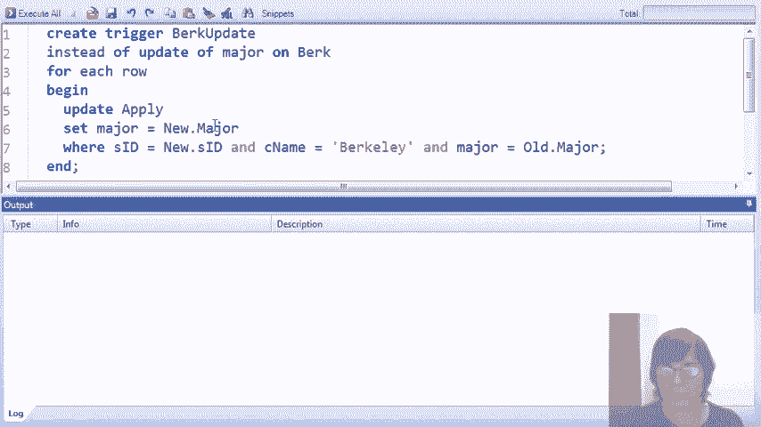

# P24：13-03-view-modifications-using-triggers.mp4 - 哈库那玛塔塔i - BV1R4411u7dt

在这段视频中，主要是现场演示，我们将讨论通过触发器修改视图。

提醒一下，一旦我们定义了一个视图，例如叫做V，我们希望能够像对待常规表一样对V运行修改命令。但由于V并不是常规表，它只是一个视图定义，实际上，针对V的修改命令会被重写为修改V所定义的基础表。

正如我们之前所讨论的，与查询视图不同，我们一般无法自动化地将对视图的修改重写为对基础表的修改。

正如我们在介绍视频中讨论的那样，处理无法自动化翻译的情况有两种基本方法。一种是由视图创建者进行干预，在创建视图时指定重写过程，如果我们希望允许该视图进行修改。

另一个目的是限制允许的视图和修改，以便能够自动化翻译。在这段视频中，我们讨论的是第一种情况，具体来说，我们将看到如何使用一种特殊类型的触发器，而不是普通的触发器，来指定重写过程，从而启用对视图的修改。我们将在演示中使用我们标准的简单大学招生数据库，包含我们通常的免费表。

包括学院表、学生表以及包含学生申请学院信息的表。

让我们开始演示。和往常一样，我们将从四所大学开始：斯坦福、伯克利、麻省理工和康奈尔，我们的一群学生，最后是显示学生申请特定专业的大学记录及其申请结果。

在这个演示中使用的部分视图将与我们在展示如何定义和查询概览时使用的视图相同。但现在，我们将专注于运行修改命令对视图进行操作的能力。我们的第一个视图就是其中之一，名为CS accept，和之前一样，它包含了学生ID和学生申请的大学及其主修专业（CS）。

结果是肯定的。我们已经创建了视图，可以查看它的内容，看到有一些学生已经被一些大学的CS专业录取。现在我们想要做的是对这个视图执行删除命令。假设我们想删除学生一、二、三，删除学生一和学生二的两条记录。

所以我们将像这样运行命令，非常简单。`delete from CS accept where student ID = 1, 2, 3`，但当我们运行命令时，出现了一个错误，因为SQLite不允许我们修改视图。因此，这就是我们将要创建的触发器，它可以使删除命令在CS接受视图上运行。

这个触发器会拦截这些删除操作，并将它们转化为对CS接受视图所定义的基础数据的删除操作。让我们看看我们希望发生什么情况。如果用户要求从视图中删除某些数据，然后再回到视图中。如果用户希望删除一、二。

如果从视图中删除了三，斯坦福，那么我们希望删除的是那些为我们提供这些元组的申请记录。让我们来看看这里的申请表，我们会发现这是学生申请斯坦福CS专业的第一条记录，且决定为“是”，第三条记录是这个学生（一、二、三）被接收为CS专业。

申请伯克利并且专业为CS，决定为“是”。我们不想删除该学生的其他记录（例如，学生一、二、三的记录），因为那些记录并没有贡献到我们的CS接受视图。因此，我们希望将视图中的删除操作转化为对申请表的删除操作，这样视图中的新值就不再包含学生一、二、三的前两个元组。让我们看看触发器是如何实现这一操作的。

现在，有一件重要的事情需要知道，那就是系统对我们所做的工作提供的一个重要贡献，它使得视图修改成为可能，那就是我们确实可以访问已删除的元组。所以这个触发器实际上是一个行级触发器。

这将为每个已删除的行运行一次，当我们运行触发器时，我们将有一个特殊的变量`old`，它包含了被删除行的内容。所以在触发器的执行部分，我们可以通过变量`old`引用学生ID和大学名称，仿佛我们真的在视图中删除了那个元组。因此，我再重复一遍，系统将绑定一个变量`old`。

要删除的元组将使用视图的模式，即使这些元组在物理上不存在。我们将使用这些值来翻译成我们希望在申请表上执行的删除操作。非常具体地，对于CS接受视图，如果我们有一个要从视图中删除的学生ID和大学名称组合。

然后我们想从申请表中删除的元组是包含该学生ID、大学名称、CS专业以及决定（是）的元组。因此，编写此触发器的人（推测也是创建视图的人）将使用视图中定义的组合，例如专业等于CS，决定等于“是”。

是的。结合它从`CS accept`中删除的值。我希望这个能有一定的理解。那么现在我们已经创建了这个触发器，让我们回到操作并尝试再次执行删除操作。这一次我们似乎成功了，所以让我们继续看看发生了什么。

我们进入视图管理器，确实可以看到这些元组已经消失。现在记住，这张表并不是真正存储的，当我们查看视图时，它实际上是在对数据执行视图查询。所以当我们查看`apply`表时，我们应该也能发现，这才是最重要的事情，123对应的CS接受记录已经被删除。

删除这些元组从`apply`表中删除会导致这些元组从视图中被删除。这是因为我们安装了一个触发器，它拦截了视图中的删除操作并将其转化为基础表的删除操作。

所以这次操作进行得相当顺利。现在假设我们想在视图上启用更新命令。假设我们想将学生345在康奈尔大学的CS接受更改为卡内基梅隆大学的CS接受。那么这是我们运行的更新命令，非常简单。我们找到学生ID 345，将大学名称更改为CMU，并更新视图中的CS接受。

当然，当我们运行这个命令时，我们再次会遇到错误，因为SQLite不允许我们对视图执行更新命令，除非我们有一个特殊的`instead of`触发器来拦截该命令并将其转化。所以接下来我们将创建一个触发器。这个触发器我要演示的是，在将修改转化为基础表时，并没有任何强制措施要求触发器的编写者必须正确处理。

我们将拦截对`CS accept`视图的更新，实际上你可能还记得触发器，我们可以在更新触发器中更具体地指定哪一列被更新。所以这个特定的触发器只会拦截试图更新`CS accept`视图中大学名称列的命令。

然后它将转化为更新`apply`表。当这个触发器被运行时，它会为每个被更新的记录执行一次，这时我们有旧值和新值，分别绑定到更新视图元组的旧值和新值上。

在这种情况下，只有大学名称会发生变化。所以我们将更新`apply`表中的关联，并且我们会把大学名称设置为新的大学名称，这将应用于具有旧学生ID和旧大学名称的元组，用来查找需要更新的元组。

然而，写这个触发器的人有点不太对劲，他们没有写正确的条件，而是写了针对 EE 专业且决策为 no 的应用条件，应该写的是针对 CS 专业且决策为 yes 的条件。但没有什么能阻止我们写这个触发器，它会执行这个错误的翻译。因此，触发器安装后，我们可以执行更新命令。

在执行之前，让我们再看一遍，提醒自己目前的状态。我们看到 345 申请了康奈尔大学，我们想把它改成卡内基梅隆大学。在 apply 表中，345 申请了康奈尔大学 CS 专业，并且决策是 yes，这就是为什么 345 会出现在视图中的原因。顺便提一下，345 也申请了康奈尔大学的 EE 专业，而且那个决策是 no。所以回到我们的更新命令，执行命令后，由于触发器已经安装，命令成功执行，让我们看看数据库发生了什么变化。

现在我们看的是 CS 录取视图，什么都没有变化，345 仍然申请了康奈尔大学。我们原本希望是卡内基梅隆大学，但我们写错了触发器，导致执行了错误的操作。具体来说，如果我们去查看 apply 表，我们会看到这条记录被更新了，因此我们的触发器修改了原始记录。所以我们想把康奈尔大学改为卡内基梅隆大学，因为它匹配的是专业 EE 且决策为 no。

所以我再次强调的是，写正确的翻译非常重要，并且系统并不会检查翻译是否正确。当然，正确的翻译应该是，如果我们在这里写的是 CS，并且决策等于 yes，那样就是正确的。

哎呀，决策等于 yes 是我们希望安装的正确触发器，用来管理计算机科学专业录取的学院名称更新。到目前为止，我们一直在查看 CS 录取视图，已经查看了删除和更新，现在我们将查看插入操作，并且我们会查看一个稍微不同的视图。

这是一个视图，显示了已申请计算机科学（CS）或电子工程（EE）专业的学生的 ID、学院名称和专业。现在我们来看看 CSE 视图的内容，我们看到有相当多的学生申请了 EE 或 CS 专业，以及他们申请的学院。

现在假设我们想要向这个视图中插入一个新的元组，因此我们希望学生 111 申请了伯克利大学的计算机科学专业。我们执行这个命令，当然会出现错误，因为我们还没有安装一个拦截视图插入操作的触发器，视图的名字叫做 CSE。

这是触发器，它非常简单。它说，替代在视图上执行插入操作，系统会在触发器中通过一个叫做 new 的变量提供用户意图的插入内容。因此，替代在视图上插入数据，我们会插入到 apply 表中，插入学生 ID、学院名称、专业，然后将决策字段设置为 null。

安装了触发器后，我们现在可以回到插入模式并执行它，查看我们视图中的内容。所以这是我们希望插入到视图中的新元组。再强调一次，这不是一个存储表，它只是通过应用查询的结果，但它正如我们所希望的那样存在，如果我们查看应用表，我们会看到 111 已经插入了 Berkeley CS 并且决策字段是空值。但现在让我们看看问题可能出在哪里，触发器虽然简单，但如果我们在这里输入 222 将申请到 Berkeley 生物学，并尝试将该元组插入名为 CSE 的视图（本应为 CS 和 E 专业），会发生什么？

那么让我们继续执行插入操作，一切顺利。我们来看一下我们的数据。好吧，这是我们的视图，什么也没变，我们的插入尝试显然没有发生。这里是我们插入的内容，我们插入了一个生物学专业的学生，从某种意义上来说，这很好，因为我们不希望生物学专业的学生出现在我们的视图中。另一方面，我们的插入触发器被激活了，如果我们查看数据，特别是应用表中的数据，我们会看到确实插入了一个元组，尽管它没有出现在视图中，因为它不满足条件。

所以我们大概不希望用户能向视图写入插入命令，这些命令会影响底层数据库，但不会反映在视图中，因为它们本来就不该出现在视图里。因此，我们需要编写一个更好的触发器来处理此特定视图中的插入操作。

所以我们将删除我们写的触发器，创建一个新的，这个触发器将使用触发器的 when 子句，这是我们在本演示中第一次使用它，它将检查用户尝试使用触发器的元组。

用户尝试插入视图中的元组时，必须是 CS 或 EE 专业的学生。如果插入的元组不是 CS 或 EE 专业，那么触发器将不做任何操作，但如果是，那么触发器会将学生的 ID、姓名和专业插入应用表中。

现在我们已经修正了触发器，让我们回到插入命令。我们已经对学生 222 做了插入尝试。那这次我们尝试学生 333，尝试插入该学生，然后看看发生了什么。如果我们查看视图，会发现该学生不在视图中，这很好，因为他是生物学专业的学生，但最重要的是我们希望应用表没有发生变化，为了确认，我们刷新了一下，发现确实什么都没有插入。所以这是我们希望看到的情况，或许我们希望生成一条错误信息，但如果用户尝试插入一个不属于视图的元组，我们当然不希望数据库被修改。

现在假设学生333申请了电气工程（EE）专业。现在当我们执行命令时，我们应该在视图中看到这个学生，确实他出现了，因此插入操作被拦截，并且基础表中的数据也被修改了，从而视图中不再显示该学生。

我们已经看过一些拦截触发器的例子，现在包括删除、更新和插入操作，它们会对视图进行相应的修改，确保对基础表的修改能够反映到视图上。视频的下一部分将快速展示几个例子，在这些例子中，我们将定义一些含有模糊修改的视图，实际上，我们甚至可能不希望允许用户修改视图的内容。因此，我们的第一个视图演示了，当视图包含聚合时，允许用户修改它通常是没有意义的。

这个视图为每个高中规模找到了去过该规模高中的学生的平均GPA。因此我们将创建这个视图，接着查看它的内容，看看它包含了什么。这里是这个视图的内容。它包含了我们数据库中不同规模的高中，以及去过该规模高中的学生的平均GPA。那么用户修改这个视图有意义吗？

我的意思是，用户是否会想写一个命令，更新视图并将平均GPA设置为3.6，适用于高中规模为200的情况？回到这里，我们想把这个平均GPA修改为3.6。我们如何制定规则来修改底层数据，以更改平均GPA呢？

其实，在这个视图上进行插入和删除操作并不太合理。也许我们可以将删除操作翻译为删除所有去过该规模高中的学生，但这可能不是我们想要的。因此，根本来说，当视图包含聚合时，通常不应该允许用户对该视图进行修改。

聚合视图最有用的地方通常是执行查询。这里是一个更简单的视图，在这个视图中，我们可能不希望允许用户进行修改。这个视图仅列出了我们申请关系中所有的专业。因此我们将创建这个视图并查看它，我们看到在我们的关系中有七个不同的专业。

那么，如果用户说我想向这个视图中添加一个新的专业，比如想要查看申请化学专业的学生，这样的请求有意义吗？

好吧，查看这个视图时，把化学专业加进去也没有什么大不了的，但这对数据库的底层结构会有什么影响呢？

谁是申请该专业的学生，在哪个学院？

在这种情况下，为什么不太合理更新这个视图，主要是因为我们只是从表中选取了一列，而且我们正在消除该列中的重复项。所以，若要将其翻译到底层的基础数据，我们首先需要为列添加很多新值，可能还会有多个元组贡献到应用关系中的一个新元组。

再次提醒，我们可能允许删除操作，我们可能会说如果删除一个专业，那么就删除该专业的所有申请，但这可能不是创建视图时的预期。因此，当我们对少数几列进行投影，或者使用了 `distinct` 关键字时，这又是一个我们可能不希望用户对视图进行修改的例子。

这是我们沿着这个思路看到的第三个也是最后一个例子，这个实际上是最复杂的一个。我们现在要创建的视图叫做 Non-unique，它将返回所有学生的元组，其中有其他学生拥有相同的 GPA 和相同的高中，而且这些学生是不同的。

所以你可能需要刷新你的 SQL 语句来提醒自己这是如何运作的。让我们继续创建视图并查看其中的数据。这里我们发现有三个学生，其中有些其他学生拥有相同的 GPA 和高中，事实上这三位学生的 GPA 和高中都是相同的，这在我们的小数据集里并不奇怪。那么，假设用户决定不希望 Amy 出现在这个视图中，所以他们尝试运行命令，从 Non-unique 视图中删除名字为 Amy 的学生记录。

那么，应该对底层数据执行什么删除操作，或者对视图中的数据执行什么修改操作，以将 Amy 从视图中移除呢？当然，我们可以直接删除 Amy 这个记录，这可能是最合理的做法，但如果我们删除 Doris 和另外一个 Amy，我忘了提到，这其实是两位不同的 Amy。

所以我们可以删除这个 654。如果我们删除 Doris 和另一个 Amy，那么这个 Amy 也会从视图中被删除。这个例子里有一些微妙之处。我们请求从一个只从学生表中选择数据的视图中删除数据，你可能会想，“哦，这里是一个一对一的映射，那就直接删除我们请求从视图中删除的学生记录吧。”但是，由于子查询引用了与外部查询相同的关系，删除外部查询中的元组引用也会影响子查询的结果，这可能会反过来影响外部查询中的数据。

所以，正是这两个表中引用的交互关系，使得确定如何将视图的修改映射到基础表的修改变得相当棘手。我们已经看到了三个例子，在这些例子中，允许用户对视图执行修改命令并没有太大意义。

这些基于视图定义中的构造。实际上，我们将在讨论SQL标准关于允许修改的视图时看到这些相同的构造。但是我确实想提醒你，在这段视频中，我们讨论的是编写触发器来启用视图的修改。因此，对于我展示的所有视图，我们可以选择编写触发器，拦截这些修改并对基础表进行某些修改。

但这种翻译可能并没有太大意义。这正是我想要表达的重点。并不是说在拥有代替触发器的能力时你不能这样做，而是你可能不希望这样做，因为这在应用中可能没有意义。

现在让我们回到我们希望允许修改的视图。因此，我们将通过“代替触发器”来启用这个功能。下一个例子更为复杂，因为它涉及到两个表的连接。这个视图被称为伯克利视图，它返回学生ID和专业，表示该学生已申请伯克利大学的该专业。

我们将创建视图，查看它的内容，我们会看到有两个学生申请了伯克利。一位申请生物学专业，另一位申请计算机科学专业。顺便提一下，我们的一些其他学生已经在我们举例的过程中从数据库中被删除了。所以假设我们希望启用对这个视图的插入操作。

所以我们希望能够插入一对数据，即学生ID和专业，然后以某种方式插入到我们的基础表中，这样该元组就会出现在视图中。那么我们将假设，当有人想要向这个视图插入数据时，他们插入的是一个已存在的学生，我们将实际检查是否确实如此。

因此，如果我们有一个已存在的学生并且我们正在插入到视图中，那么我们所需要做的就是向申请关系中添加一个元组，表示他们正在申请伯克利大学的某个专业，这个专业是根据我们在视图中请求的插入内容来确定的。我们将通过触发器来实现这一点。这里是一个触发器，它表示：对于每一行的插入操作，我们会为每个插入的行触发一次。

首先，我们会检查插入的元组的学生ID，并且确保新的元组与插入的元组绑定，查看用户想要插入的元组是否符合条件。我们将检查该学生是否存在于学生关系中。如果该学生不存在于学生关系中，我们将不会对请求的插入进行任何操作。如果该学生已经存在于学生关系中，那么我们就可以将学生ID插入到申请表中，因为我们知道这是一个申请进入伯克利的学生视图。

他们申请的专业是 `null`，决定结果也是 `null`。所以，我并不只是展示一个元组被插入，而是做一些稍微复杂一点的操作，要求一次插入一批元组到伯克利视图中，我们会看到这些元组中的每一个都将导致 `apply` 表中的相应插入记录，并且当然，也会按预期插入到视图中。

我生成一批元组插入视图的方法是执行一个子查询，这个子查询会获取所有在 `apply` 表中没有记录的伯克利学生 ID。也就是说，尚未申请伯克利的学生，我们将为每一个学生插入该学生的心理学专业申请记录到视图中。

让我们首先看一下 `apply` 表，看看哪些学生将申请伯克利的心理学专业。所以我们有 2、3、4 号学生已经申请了伯克利，还有 9、8、7 号学生也在我们的视图中。顺便提一下，如果你在想为什么这三个学生没有出现在我们的视图中，那是因为这些是作为演示的产物插入的，我们并没有插入匹配的学生元组。所以这些学生不会参与联合查询。

所以我们现在在联合查询中只有两个学生，所有其他尚未申请伯克利的学生，现在都将因为我们执行了插入命令而申请伯克利的心理学专业，这个插入命令会被我们的触发器拦截。接下来是触发器的内容，接下来是插入命令。让我们运行插入命令，然后看看发生了什么。

我们去看伯克利的视图，确实看到一大批心理学专业的学生已经出现在视图中了，当然，这是因为我们的 `apply` 表中现在应该有一大批心理学专业的学生记录，正如我们所看到的那样。回到视图，如果现在我们希望启用用户从视图中删除记录怎么办呢？

我们再次假设我们的目标不是删除学生。学生 ID 表将保持稳定，我们要做的是删除相应的申请记录。所以这是实现这一操作的触发器。它是通过在伯克利视图上的删除操作触发的，系统会将视图中已删除的元组绑定到预留变量 old。因此，该触发器的操作部分将删除 `apply` 表中与被删除学生 ID 匹配的记录。

大学名称是伯克利，因为我们要查询的就是伯克利。这并不是来自已删除的元组，也不在视图中，但我们知道这是视图定义中的条件。而且专业必须与已删除的目标专业匹配。所以我们会要求删除伯克利所有专业是 CS 的记录。

那么让我们首先查看视图，我们看到我们只有一个记录，所以我们预计这个元组会从视图中删除，因为我们将删除对应的 `apply` 记录。我们将执行删除操作，并首先查看视图。

确保那个计算机科学专业的学生已经删除了，然后我们查看 `apply` 表。我们在一开始忘记查看它，但我认为是学生 987，现在 987 已经不再申请伯克利了。最后，让我们启用对伯克利视图的更新。可能没有意义去更新学生 ID，但我们将允许更新专业。

所以我们有一个学生申请了伯克利的心理学专业。我决定他们想换一个其他专业。

这是触发器，它将拦截伯克利专业的更新，因此它不会拦截学生 ID 的更新。现在我们将把旧的和新的值绑定到伯克利虚拟元组的旧值和新值。它将更新 `apply` 关系，并找到我们更新中的学生 ID 记录。

这可能是旧的学生 ID 或新的学生 ID，因为它的值不会改变。因此，我们找出我们关心的学生 ID，他们在伯克利申请旧专业的记录，然后将其修改为申请新专业的记录。所以我们将把所有心理学专业的学生转变为物理学专业的学生。

所以，通过这一个更新命令，我们将要求更新伯克利视图中的大多数元组。每个元组都会被我们的触发器逐个拦截，它会修改对应记录的 `apply` 表，并将心理学专业改为物理学。

我们将运行命令并查看发生了什么。这里是我们的视图，我们可以看到，确实所有的心理学专业都已经变成了物理学专业，当然这是由于对底层 `apply` 表的修改所导致的，我们再次看到中间的所有心理学专业记录已经变更。

所有的心理学专业都已经变成物理学专业。现在回到我们的视图，我之前说过我们不允许修改学生 ID，而我们写的触发器只会拦截专业的修改。那么如果我们尝试修改学生 ID，会发生什么呢？

这里是一个命令，它试图在我们的伯克利视图中将三比一设置为一比三。如果我们运行查询，会出现一个错误，因为我们没有为该列的修改实现任何翻译。我们演示的最后部分将展示视图修改与约束之间的交互。所以我要删除我的 `apply` 表，并创建一个新的版本，在其中我们为决策列添加了一个约束，要求该列不允许为空。

现在让我提醒你我们很久以前创建的一个视图，叫做CSE，它包含那些申请计算机科学或电子工程专业的学生的大学和专业。让我们具体看看我们为处理对这个视图的插入操作而创建的触发器。

你可能记得，或者可能不记得，我们最初创建了一个不正确的触发器，但这里是我们已激活的那个。需要注意的重要一点是，它拦截了视图中的插入操作，然后它将包含学生ID的元组插入到apply中。

大学名称和专业，然后为decision字段插入null。这是我们麻烦的地方，因为我们现在已经创建了一个不允许decision为空的apply版本。所以让我们尝试将值1到3 Berkeley和CS插入到CSE视图中，这将被翻译为插入到apply的相同值，并且decision为null。我们执行插入操作时会遇到约束冲突。

发生的情况是插入操作被触发器拦截，翻译为对apply的插入，但该插入违反了我们在decision列上的非空约束。所以它做的是正确的，但我们现在将永远无法插入到CSE视图中，因为我们总是会尝试插入空值。

所以如果我们希望在apply关系上有那个非空约束，我们必须修改CSE的翻译方式，以确保它不会生成空值。这里有第二个类似的例子。我们将再次删除apply并创建一个新的apply版本。

这次我们将允许decision字段为空，因此我们移除了那个非空约束，但我们在apply上添加了一个主键约束，要求学生ID、大学名称和专业的组合必须唯一。所以一个学生不能两次申请同一所大学的同一专业。

所以由于我们创建了一个新的apply关系，它从一开始就是空的，但让我们插入一些元组，我们将通过CSE视图和它的触发器插入到apply关系中。所以我们将插入学生1、2、3，申请Berkeley的CS和EE专业，并且我们再次将这些插入到视图中。

我们执行这个操作，查看我们的视图，我们会看到它在哪里。找到了。这就是CSEE视图，其中包含我们插入的两个元组，当然，这些元组被触发器拦截并插入到了apply中。这里是apply关系，样子完全一样，只是decision为null。

现在我们接下来的操作是插入到我们其他的视图之一。我不知道你是否记得Berkeley视图，但它包含的是那些申请了Berkeley的学生的ID和专业，让我们看看当我们尝试插入Berkeley视图时会发生什么。

这是我们编写的触发器，用于处理向伯克利插入数据的操作。当我们尝试插入的学生已存在时，我们将插入一条记录到apply表，表示该学生申请伯克利，并指定插入中的专业，同时决策为null，这在现在是可以的，因为……

我们移除了那个非空约束。因此，我们将尝试向伯克利学生表插入一条记录，学生编号为一二三，专业为EE，我们将看到这实际上会违反我们的主键约束。因此，让我们继续操作，我们会收到一个非唯一约束错误，因为试图插入到apply表中。

让我们来看一下这个表。它试图插入一条记录到apply表，学生编号一二三，专业为伯克利EE，这会违反约束：每个学生ID、学校名称和专业组合只能有一条记录。因此，再次尝试插入到视图中时，实际上是转换为插入到apply表，并且违反了约束。

最后作为盛大结局，让我们尝试更新伯克利视图。假设我们希望学生一二三在伯克利的两个申请中都选择CS专业，这将生成对底层apply表的更新，应该会违反我们的约束。

提醒一下，让我们看看当我们尝试更新伯克利视图中的专业时会发生什么。这里是我们之前编写的触发器，它拦截对伯克利的更新，并将其转换为更新apply表中的记录，找到与旧专业和学生ID匹配的申请记录，并将其更改为新专业。

因此，我们将尝试更新伯克利视图，尝试将学生编号一二三的专业设置为CS。如果我们查看它尝试在apply表中执行的操作，它会试图将这两个专业都设置为CS，这将再次导致主键约束违规。

所以让我们继续操作，尝试在伯克利视图上运行命令，它将转换为对apply表的更新，而该更新将不被允许。因此，这完成了我们使用触发器启用视图修改的演示。这个演示是在SQLite系统上运行的，SQLite系统不允许直接对视图进行任何修改命令，因此每次我们尝试时都会出现错误，用户只能通过使用特殊的替代触发器来拦截对视图的修改，并将其转换为对基础表的修改。

现在，当系统处理触发器时，它会为视图上的修改生成数据，这些数据会绑定这些修改，包含在触发器中可用的旧变量和新变量，但其余的过程由用户编写操作，这些操作将在尝试对视图进行修改时发生。

正如我们所看到的，系统没有检查机制来确保用户写出正确的修改，从而导致正确的视图更新。然而，当用户按正确的方式操作时，一切都能以非常强大且正确的方式运行。

fashion。
