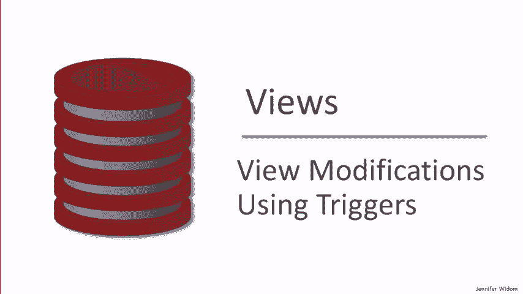
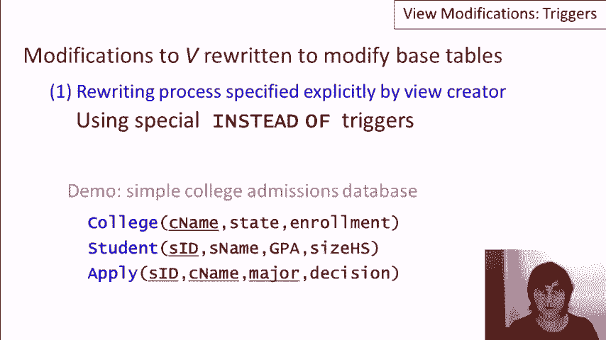

# 数据库课程 P24：使用触发器修改视图 🛠️


在本节课中，我们将学习如何通过编写特殊的“替代触发器”来允许对数据库视图执行修改操作（如插入、更新、删除）。由于视图本身并不存储数据，对视图的修改需要被正确地“翻译”并应用到其底层的基础表上。

---



## 视图修改的基本概念

上一节我们介绍了视图的定义和查询。本节中我们来看看如何修改视图。

视图是一个虚拟表，基于对基础表的查询结果。当我们希望对视图运行 `INSERT`、`UPDATE` 或 `DELETE` 命令时，这些命令必须被重写为对基础表的操作。

然而，并非所有视图的修改都能被数据库系统自动翻译。主要有两种处理方法：
1.  由视图创建者手动指定重写规则。
2.  限制可修改的视图类型，以便系统能自动翻译。

本节课我们聚焦于第一种方法，即使用一种特殊的触发器——`INSTEAD OF` 触发器——来手动定义修改操作应如何作用于基础表。

---

## 演示环境与初始数据

我们将使用一个简单的大学招生数据库进行演示，它包含以下表：
*   `College`（学院表）
*   `Student`（学生表）
*   `Apply`（学生申请记录表）

初始数据包括四所大学（斯坦福、伯克利、麻省理工、康奈尔）、一组学生以及他们的申请记录。

---

## 示例一：在简单视图上启用删除操作

首先，我们创建一个名为 `CSaccept` 的视图，它包含所有申请了计算机科学（CS）专业并被录取的学生ID和大学名称。

```sql
CREATE VIEW CSaccept AS
SELECT sID, cName
FROM Apply
WHERE major = 'CS' AND decision = 'Y';
```

当我们尝试从该视图中删除记录时，例如：
```sql
DELETE FROM CSaccept WHERE sID IN (123, 345);
```
系统会报错，因为默认不允许直接修改视图。

### 创建删除触发器

我们需要创建一个 `INSTEAD OF DELETE` 触发器来拦截删除操作，并将其转化为对基础表 `Apply` 的删除。

以下是该触发器的核心逻辑：
*   系统为每个被删除的视图行提供一个特殊的 `OLD` 变量，其中包含了该行的值（如 `sID` 和 `cName`）。
*   触发器利用这些值，删除 `Apply` 表中对应的、且满足视图定义条件（`major='CS' AND decision='Y'`）的记录。

```sql
CREATE TRIGGER Delete_CSaccept
INSTEAD OF DELETE ON CSaccept
FOR EACH ROW
BEGIN
    DELETE FROM Apply
    WHERE sID = OLD.sID
      AND cName = OLD.cName
      AND major = 'CS'
      AND decision = 'Y';
END;
```

创建此触发器后，之前的 `DELETE` 命令就能成功执行。它会从 `Apply` 表中移除相应的记录，从而使这些记录从 `CSaccept` 视图中消失。

---

## 示例二：在视图上启用更新操作（及错误示范）

假设我们想更新 `CSaccept` 视图，将学生345的录取学校从“康奈尔”改为“卡内基梅隆”（CMU）。

```sql
UPDATE CSaccept SET cName = 'CMU' WHERE sID = 345;
```

同样，没有触发器时此操作会失败。

### 创建更新触发器

我们需要一个 `INSTEAD OF UPDATE` 触发器。在触发器内部，我们可以通过 `OLD` 和 `NEW` 变量访问更新前后的值。

**重要警示**：触发器由开发者编写，系统不会检查其逻辑是否正确。如果编写错误，会导致数据不一致。

例如，一个**错误**的触发器可能将更新错误地应用到 `Apply` 表中专业为‘EE’且未被录取的记录上，而不是正确的‘CS’录取记录。这会导致视图数据没有如预期般更新，但底层数据已被错误修改。

**正确**的触发器应确保修改应用于符合视图定义条件的记录：

```sql
CREATE TRIGGER Update_CSaccept_CName
INSTEAD OF UPDATE OF cName ON CSaccept
FOR EACH ROW
BEGIN
    UPDATE Apply
    SET cName = NEW.cName
    WHERE sID = OLD.sID
      AND cName = OLD.cName
      AND major = 'CS'
      AND decision = 'Y';
END;
```

---

## 示例三：在视图上启用插入操作及条件检查

我们创建另一个视图 `CSE`，显示所有申请了CS或EE专业的学生ID、大学和专业。

```sql
CREATE VIEW CSE AS
SELECT sID, cName, major
FROM Apply
WHERE major IN ('CS', 'EE');
```

### 初始的插入触发器（有缺陷）

一个简单的插入触发器可能如下：
```sql
CREATE TRIGGER Insert_CSE
INSTEAD OF INSERT ON CSE
FOR EACH ROW
BEGIN
    INSERT INTO Apply(sID, cName, major, decision)
    VALUES (NEW.sID, NEW.cName, NEW.major, NULL);
END;
```
这个触发器的问题是：即使用户尝试插入一个专业为‘Biology’的记录（这不符合视图条件），它也会向 `Apply` 表插入数据。虽然新记录不会出现在 `CSE` 视图中（因为不满足 `WHERE` 条件），但底层数据库已被修改，这通常不是我们想要的。

### 改进的插入触发器（带条件检查）

更好的做法是在触发器中使用 `WHEN` 子句进行检查，只允许插入符合视图定义条件的数据：

```sql
CREATE TRIGGER Insert_CSE_Conditional
INSTEAD OF INSERT ON CSE
FOR EACH ROW
WHEN (NEW.major IN ('CS', 'EE'))
BEGIN
    INSERT INTO Apply(sID, cName, major, decision)
    VALUES (NEW.sID, NEW.cName, NEW.major, NULL);
END;
```
这样，只有专业为‘CS’或‘EE’的插入请求才会被实际执行。

---

## 不适合进行修改的视图类型

并非所有视图都适合允许修改。以下是一些例子：

1.  **包含聚合函数（如 `AVG()`, `SUM()`）的视图**：例如，一个显示各高中平均GPA的视图。将平均GPA从3.5更新为3.6意味着什么？这很难翻译成对单个学生记录的具体修改。
2.  **使用了 `DISTINCT` 或对少数列进行投影的视图**：例如，一个仅列出所有不重复专业的视图。向其中插入一个新专业“Chemistry”，应该对应在 `Apply` 表中为哪个学生、哪所大学插入记录？语义模糊。
3.  **包含复杂自连接或子查询的视图**：例如，一个找出具有相同GPA和高中背景的学生的视图。从该视图中删除一个学生，可能意味着删除该学生本人，也可能意味着删除另一个使他“重复”的学生，翻译规则复杂且不直观。

对于这些视图，即使技术上可以通过编写复杂的触发器来实现修改，但在业务逻辑上往往没有意义，甚至可能引发混乱。

---


## 示例四：在连接视图上启用修改


创建一个更复杂的视图 `Berkeley`，显示所有申请了伯克利大学的学生ID和专业。

```sql
CREATE VIEW Berkeley AS
SELECT sID, major
FROM Apply
WHERE cName = 'Berkeley';
```

### 为连接视图编写触发器

这个视图涉及对 `Apply` 单表的筛选。为其编写触发器时，需要考虑业务逻辑：

*   **插入触发器**：在插入前检查学生是否存在于 `Student` 表中。只有学生存在，才向 `Apply` 表插入一条申请伯克利大学的记录。
    ```sql
    CREATE TRIGGER Insert_Berkeley
    INSTEAD OF INSERT ON Berkeley
    FOR EACH ROW
    WHEN EXISTS (SELECT 1 FROM Student WHERE sID = NEW.sID)
    BEGIN
        INSERT INTO Apply(sID, cName, major, decision)
        VALUES (NEW.sID, 'Berkeley', NEW.major, NULL);
    END;
    ```
*   **删除触发器**：删除视图中的记录，应转化为删除 `Apply` 表中对应的、学校为‘Berkeley’的申请记录。
    ```sql
    CREATE TRIGGER Delete_Berkeley
    INSTEAD OF DELETE ON Berkeley
    FOR EACH ROW
    BEGIN
        DELETE FROM Apply
        WHERE sID = OLD.sID
          AND cName = 'Berkeley'
          AND major = OLD.major;
    END;
    ```
*   **更新触发器**：通常只允许更新专业字段。更新学生ID在业务上可能意味着另一个学生的申请，这通常不合理。
    ```sql
    CREATE TRIGGER Update_Berkeley_Major
    INSTEAD OF UPDATE OF major ON Berkeley
    FOR EACH ROW
    BEGIN
        UPDATE Apply
        SET major = NEW.major
        WHERE sID = OLD.sID
          AND cName = 'Berkeley'
          AND major = OLD.major;
    END;
    ```
    如果用户尝试更新视图中不允许的列（如 `sID`），而你没有对应的触发器，操作将会失败。

---

## 视图修改与约束的交互

视图修改触发器最终是对基础表执行操作，因此必须遵守基础表上的所有约束。

**示例冲突：**
1.  如果 `Apply` 表的 `decision` 列有 `NOT NULL` 约束，而你的视图插入触发器总是插入 `NULL` 到该列，则插入会失败。
2.  如果 `Apply` 表有主键约束（如 `(sID, cName, major)` 组合必须唯一），那么：
    *   通过视图插入重复的申请记录会失败。
    *   通过视图更新，导致两条记录拥有相同的主键值也会失败。

**解决方案**：编写触发器时，必须考虑目标表的所有约束，并在触发器逻辑中妥善处理（例如，在插入前检查唯一性，或为必填字段提供合理的默认值）。

---

## 总结

本节课中我们一起学习了如何使用 `INSTEAD OF` 触发器来实现对数据库视图的修改。

*   **核心机制**：通过创建 `INSTEAD OF INSERT/UPDATE/DELETE` 触发器，拦截对视图的修改操作，并将其重写为对底层基础表的操作。
*   **关键变量**：在触发器体内，使用 `NEW` 和 `OLD` 变量来访问试图插入、更新或删除的视图行数据。
*   **开发者责任**：系统不检查触发器翻译的逻辑正确性。由开发者确保修改能正确反映到视图和基础表，并保持数据一致性。
*   **适用性**：不是所有视图都适合修改。对于包含聚合、`DISTINCT` 或复杂逻辑的视图，允许修改可能没有业务意义。
*   **约束遵守**：触发器执行的操作必须满足基础表的所有完整性约束，否则修改会失败。


通过谨慎地设计和编写触发器，可以灵活、安全地扩展视图的功能，使其在某些场景下表现得像可修改的真实表一样。