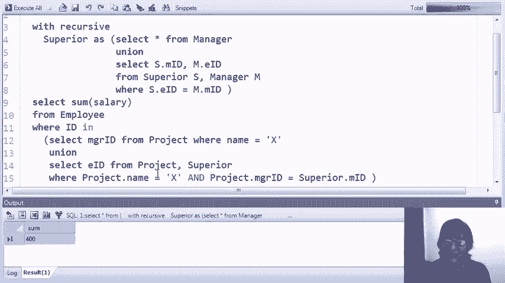
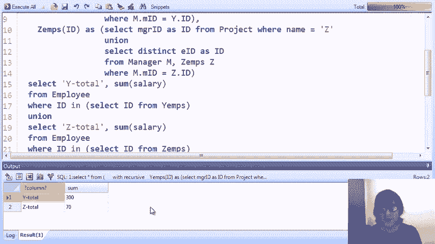
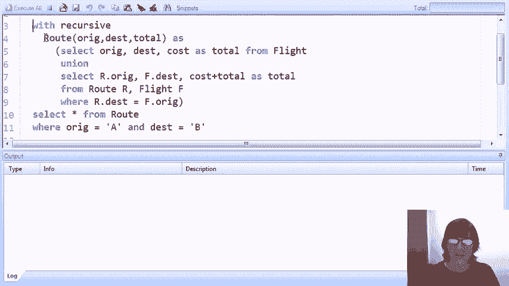
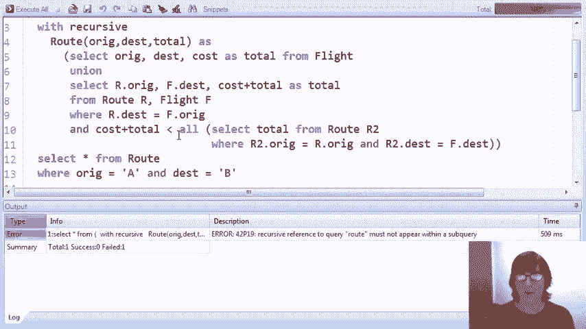
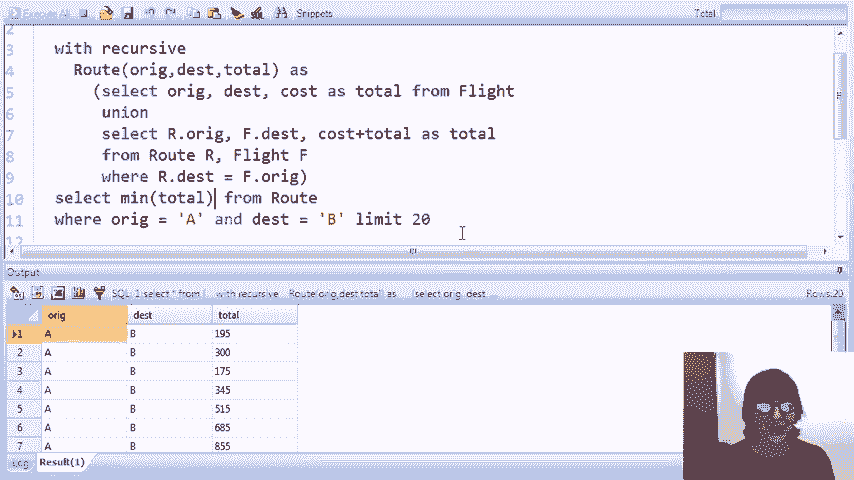

# P25：15-02-basic-recursive-with-statement-demo.mp4 - 哈库那玛塔塔i - BV1R4411u7dt

本视频展示了我们在前一个视频中介绍的SQL递归构造的实时演示。

作为提醒，递归已被引入SQL中，作为宽度语句的一部分，在这个语句中，我们可以设置由查询定义的关系，这些查询本身会引用正在定义的关系。最后，我们有一个查询，它可以涉及递归定义的关系以及数据库中的其他表。

递归定义关系中的典型表达式会是在宽度语句中，先有一个不依赖于R的基本查询，然后是一个依赖于R的递归查询。我们在介绍性视频中给出了三个示例，这些示例也是我们接下来要演示的内容。

第一个示例是计算祖先，当我们只有父母关系时，家族树可能深得无法预料。我们的第二个示例是一个关于公司层级关系的案例，层级可以非常深，我们想计算一个项目的总薪资成本，从该项目的经理开始，汇总整个子树的薪资。

我们的第三个示例是关于飞机航班的，我们想找到从A点到B点的最便宜的飞行方式，并且我们愿意根据需要换乘多次飞机以降低成本。我们看到所有这些示例基本上都涉及了一种闭包传递的概念，这个概念作为递归定义的关系进行计算。

在我们用递归解决这三个查询的演示的最后部分，我们将引入一个新的 twist，即当我们引入循环时会发生什么。所以在航空公司示例中，我们将设置一个案例，你可以从一个城市飞往另一个城市并返回，这在现实中当然是成立的，我们将看到当我们在这种情况下尝试回答查询时会发生什么。

我已经创建了一个名为parent的表，用来表示父母与子女之间的关系。所以我们有Alice、Carol、Bob，Carol、Carol、Dave等等。你实际上可能想在纸上写下来，看看实际的树形结构是什么样的，但我们要运行的查询是找到所有Mary的祖先。

所以我们当然会有Eve作为父母，Dave作为父母，然后Dave的父母是Carol，Carol的父母是Bob，依此类推。我们将在查询中获取数据库中的大部分数据。这里是查询，它是我们第一个递归查询的示例。让我直接说，即使比我们在这些视频中做过的任何事情，我也会鼓励你下载脚本，仔细查看查询，并最好在Postgres系统上实际运行查询并进行试验。

我们这次演示使用的是Postgres，SQL的一个项目，而MySQL目前不支持with recursive语句。无论如何，这是我们的查询，它的形式如我们在介绍中描述的那样。它是一个with语句，带有recursive，用来设置一个名为祖先的递归关系。这就是我们之前所说的。这是我们定义的带有AD模式的祖先关系，包含祖先和后代。

一旦祖先设置好后，我们的最终查询非常简单。它只是说从祖先表中取出A属性，其中一个后代是Mary。这样就会得到Mary的后代。当然，有趣的是括号里的部分，因为这是我们的递归查询，它确实采用了我们之前描述的形式，即包含基本查询。

这是第一行，然后是带有联合的递归查询。所以我们将从父子关系开始，这也是一种祖先关系。因此，我们将从我们的父母表中取出父母和孩子，并将它们重命名为A和D。

这说明父子关系是祖先关系。还有什么是祖先呢？嗯，如果我们有一个祖先，且这个祖先的后代是另一个人的父母，那么这个祖先与该父母的孩子也会形成一个祖先关系。

所以这有点像是在做连接，实际上它是在连接我们的祖先，并通过与另一个父母实例连接来扩展这种关系。你可以把它想象成在祖先树上向下添加关系。再强调一遍，我真的强烈鼓励你下载这个查询并亲自玩一下，充分理解它的工作原理。

让我们继续运行它。这可能会有点平淡无奇。当我们运行时，我们确实发现这五个人是Mary的祖先。如果你画出数据的小树图，你可以验证这是正确的答案。我们来玩一下，尝试查找其他人的祖先。我们试试Frank。

我们在这里看不到Frank，因为Frank实际上是Mary的孩子。所以，当我们运行这个查询时，我们应该能得到更多的祖先，特别是Mary应该被包括在内。事实上，她是的。她就在这里。这些是Frank的祖先。我们来试试George吧。

我想George大概位于树中的某个位置。是的，George有三个祖先。最后，我们来试试Bob。我认为Bob位于根节点，所以我们应该得到一个空结果，果然是这样，因为Bob在我们的数据库中没有祖先。现在让我们看看第二个例子。那是我们有一个公司管理链层级的例子。

然后我们关注的是计算项目的总薪资成本。所以我设置了三个表。第一个是员工表。它提供了员工的 ID 以及每个员工的薪资。第二个表是经理关系。所以你可能想画出这棵小树。

虽然这次的结构相对简单。根节点是第一、第二、第三号，管理着两个下属：第三、第四号和第四、第五号。第三、第四号有两个下属：第四、第五号和第五、第六号。M 三、四、五是另一个。因此它只是一个三层树。如果我们知道只有三层的话，其实完全不需要递归。

但我们要写一个能适应任意层数的查询。所以这是我们的管理结构。最后，第三个表，项目表，表明员工一、二、三是项目 X 的经理。所以我们要做的是在层级结构中找到项目 X 的经理，然后加上所有经理的薪资。

下属递归地遍历管理结构。当然，这就是我们小数据库里的所有人。

再次强烈建议你下载脚本并自己运行一下。所以这是我们查询项目 X 总薪资的查询。实际上，我会给出几种不同的查询方式。我们第一次做的方式是将管理结构展开成一个叫做 Superior 的关系。

所以这实际上是在做祖先计算，顺便提一下，这就是传递闭包。我早该提到的。对于熟悉传递闭包的人来说，它基本上就是那个操作。因此，我们将计算这些 superior 关系，以便拥有每一个经理与员工的关系，其中经理是员工的上级。

然后，一旦我们计算出这个 superior 关系，我们就写一个相当复杂的查询。所以这是我们 with 语句的最终查询。这个查询说，我们有这个递归关系 superior。我们将从员工表中汇总薪资，其中 ID 要么是项目 X 的经理。

所以这是前半部分。或者一个由项目 X 的经理管理的员工。现在这里，我想强调的是，这不是递归的。恰好它有相同的联合结构，但这里并没有发生递归。

所以一旦我们拥有了 superior 关系，这就是经理关系的传递闭包，我们就可以写一个普通的 SQL 查询。让我们来看一下 superior。Superior 这里，使用递归与联合表示，如果我们有一个经理，且其 ID 是 M ID 和 E ID，那么如果某人管理另一个人，那么他们就是这个人的上级。顺便提一下。

我在这里没有指定架构。所以架构隐式地将是 M ID E ID。所以我们会加入经理关系。然后如果我们有一个上级关系，也就是如果 M ID 管理着 E ID 的 S 关系，那么我们可以再添加一层，因为我们通过与经理的连接，假设如果 X 是 Y 的上级，且 Y 是 Z 的经理。

然后 X 是 Z 的上级。这与我们在前面的例子中计算祖先关系时完全相同。再一次，运行查询的结果可能会比较平淡，但我们还是做一下。我们发现，当把项目 X 的经理与所有参与人员一起计算时，项目 X 的总薪资成本为 400。

在这个经理下的层级结构中。所以，当我们想到递归时，通常会想到传递闭包或扩展层级结构，就像我们之前的例子那样。但是如果我们稍微退后一步，就会发现有一种更简单的方式来表达查询，来计算项目 X 的薪资负担。现在。

不仅如此，这种表达方式实际上更好看，而且可能更加高效，这取决于查询处理器有多智能。在我们之前的例子中，如果查询处理器以直接的方式使用查询，它会计算整个公司层级结构中的上级关系，然后才找出哪些人参与了项目 X。现在，一个非常好的查询处理器可能会智能地处理，直接将项目 X 并入其中。

但不一定。这里有一个例子，展示了查询的新表述方式，在这个查询中，我们实际上会将 X 特定地与我们的递归绑定。我们将在递归的 with 语句中计算。这是我们正在计算的临时关系。

这是一个只包含涉及项目 X 的员工 ID 列表的关系。一旦我们找到了所有参与项目 X 的员工，下面的查询就非常简单。我们只需找出这些员工是否属于 X 员工，并将他们的薪资相加。所以，让我们来看看这里的递归定义，再次强调。

它呈现出通常的查询形式，包括基本查询、联合查询或递归查询。接下来我们来看看怎么做。显然，项目 X 的经理是项目 X 中涉及的 ID 之一。因此，在项目中，我们查找名为 X 的项目，并提取该项目的经理，并将那个人的 ID 放入 XMs 中。这就是将进入递归的第一个 ID。

这又是基本查询。然后我们加入递归步骤：任何由 X 员工中的某个人管理的员工都会被算作与 X 相关。因此，我们将使用经理关系和 X 员工关系，如果该员工的经理在 X 中，那么这个员工也参与了 X。所以我们用项目 X 的经理作为递归的起始点。

然后我们只需递归地向下遍历树，逐一添加所有在下层的员工。我们不必知道树的深度，因为递归将继续，直到没有人再被添加。我想我应该在之前的示例中提到这一点。再一次，递归会反复添加数据，直到没有新数据可添加。

然后它就结束了。那么让我们继续运行查询，再次有些让人失望，但我们得到了与项目X薪资成本相同的答案，即400。现在，我们使用相同形式的查询来查找两个项目Y和Z的总薪资成本，这也将展示在with recursive命令中定义的两个关系。

所以我们将项目Y和Z添加到我们的项目表中，它们都由数据库中已有的员工管理，因此它们位于层次结构的稍低位置。我们应该预期这些项目的总成本会低于项目X，因为项目X的经理位于我们层次结构的根部。所以这是我们的查询，这是一个很大的查询。我们将定义YMs和ZMs，正如我们在前面的示例中定义XMs一样。

所以YMs是一个递归定义的关系表，它将包含参与项目Y的员工ID列表。所以我们将项目Y的经理作为我们的基础查询，然后我们将在递归中添加所有被YMs中某个员工管理的员工。ZMs也是完全一样的。我们从项目Z的经理开始。

然后我们将所有通过在ZMs关系中的某个人传递管理的人员加到树中。接下来，我们在这里的最终查询对于with语句是两个查询的并集。第一个查询获取Y的总薪资，并将其标记为Y total。因此，它获取所有在YMs表中的ID。

然后从员工表中获取他们的薪资并将其求和，同样是Z总薪资。那么我们现在运行这个查询，它将稍微少些让人失望。我们现在的结果中确实有两个元组。

我们看到Y的总薪资是300，Z的总薪资是70。如果你交叉检查这个结果与数据，你会看到，当我们考虑为项目Y和Z指定的经理时，这些确实是它们的总薪资。

最后是我们的最后一个也是最有趣的例子，找出如何从A点飞到B点，而我们只关心的是成本，而不在乎换多少次飞机。所以这是我设置的小型航班表，我用了A和B，方便我们字面上从A点飞到B点。我们所有的中途目的地实际上都是实际的机场代码，我还加入了一些航空公司。

尽管它们在我们的查询中实际上并不会被使用。我还加入了航班的费用。你可能想画一个小图表，这样你就能看到发生了什么。我们可以从A飞到芝加哥，费用是200，从芝加哥飞到B又需要100，或者我们可以从A飞到菲尼克斯，然后从菲尼克斯飞到拉斯维加斯，再飞到...哦。

我不记得这是什么，CMH是底特律、辛辛那提附近的某个地方。从那里到B点，或者我们可以乘坐老牌的JetBlue直飞A到B，费用是195。所以显然，搭乘这班JetBlue航班，经过芝加哥的300美元费用显然是不可能的。但如你所料，我已经设置了数据，以便通过菲尼克斯到拉斯维加斯和中西部的某个地方，事实上，这将是我们最便宜的路线。

现在，让我们来看看递归查询，它将帮助我们找到从A点到B点的路线，或者至少找到从A点到B点的最便宜方式。首先，我将展示的查询实际上列出了从A到B的所有不同费用，目的是让我们看到这些费用的枚举。然后，我们会修改查询，给出最便宜的费用。这就是递归查询。

我们将使用一个递归定义的关系，称为`root`。`root`表示我们可以从一个出发地到达目的地，并且有一个特定的总费用。好吧，所以我们在递归中有基本查询和递归查询。这正是你想象的那样。如果我们能从X点到Y点搭乘直飞航班，那么我们就能以给定的最高费用从X点到Y点。

这就是我们的基本查询。我们从`root`关系中的所有直飞航班开始，然后通过将`root`与额外航班连接来添加更多路径。所以，基本上这里的连接意味着，如果我可以从`root`中的某个出发地到达目的地，并且这个目的地是另一航班的出发地，那么我就可以添加这个航班。

我可以从我的原始出发地和最终目的地开始。然后，成本将是我已经拥有的总额加上新航班的费用。这就是我的新总额。所以，这又是一个类似递归的封闭遍历。这与祖先递归非常相似，非常类似于扩展公司层级。

唯一的真正区别在于我们在执行递归的同时也在积累这些成本。所以一旦我们完成了递归，那么我们就可以完全指定我们航班数据库中所有的路径，所有从A到B的方式。

以及总费用。现在我应该说，这实际上并没有给我们从一个地方到另一个地方的所有方式。如果我们想积累我们实际采取的路径，也就是航班、费用、航空公司等，我们需要在数据库中使用结构化的方式来存储这些信息。

有实现这个的方法，但我这里不打算演示。我只是要演示递归的基本用法和计算总费用的过程。好的，那我们就继续执行这个查询。我们已经计算了所有的路径，然后我们将从 A 到 B 开始查找，看看这些路径的总费用是多少。我们将运行查询，结果会发现从 A 到 B 有三种不同的方式。

第一个结果恰好是那班直飞的捷蓝航班，费用为195。第二个是经过芝加哥的航班，总费用为300。你可以返回查看数据并验证这些结果。第三个则是复杂的路径，其中我们停留了几次。

但我们节省了不少钱。通过经过那些城市，和直接航班相比节省了$20，因为总费用是175。我留给你决定是否值得为了节省$20而多次停留，还是选择直接航班。所以现在，由于我实际的需求是找到最便宜的方式，那么我只需要在最终查询中使用最小总费用（min total），而不是星号（star）。

我执行这个查询后，得到的答案是175是从 A 到 B 的最便宜方式。现在这里有一个替代的查询方式，它本质上与我们在项目成本中所看的替代方案相似，我们在递归中加入了项目 X，简化了那个情况下的递归。

在这种情况下，这并不更简单，但它可能会更高效。我们将从起点 A 开始，构建这个事实。所以下次我们不再需要在递归中查找从任意点到任意其他点的所有路径，再查找从 A 到 B 的路径。让我们递归地创建一个关系，表示从 A 点出发。

我可以以特定的总费用到达某个特定的目的地。所以这个方法将从 A 开始构建路径。基础查询当然会先查找直飞航班，其中出发点是 A，然后将目的地和费用加入到我们名为 from A 的关系中。所以这就开始了，首先给出我们从 A 出发的直飞航班，我们可以登上这些航班并到达目的地，且知道费用是多少。

然后我们的递归将会在这个基础上添加航班。它实际上与我们在项目 X 中所做的非常相似。我们的递归会说，好的，我们知道从 A 点出发，能以一定的费用到达某个特定地点。那么那个地点就是我们的目的地。如果我们再加上一个航班。

所以这个航班的起点是我们可以到达的目的地。那么这个目的地也将是我们可以从 A 点到达的目的地，我们只需要将这个地址加进来。然后我们只需要加上额外航班的费用。再提醒一次，强烈建议你下载并亲自尝试这些操作。

一旦我们找到了所有可以从 A 到达的地方，我们就可以用它来找出到达 B 点的最便宜方式。但让我们先运行一个宽度语句，其中我们只查看可以从 A 到达的地方及其到达费用。所以，开始吧，我们可以到达芝加哥、凤凰城，也可以用几种不同的方式到达 B。

三种不同的方式，实际上，正如我们已经知道的那样，我们还可以到达拉斯维加斯和这个神秘的 CMH，我真希望我记得它是什么。因此，现在如果我们有兴趣找到从 A 到 B 的最便宜路线，我们将在这里添加“where destination = B”，并加上最小总成本。

希望这会是我们经典的 175 结果，确实如此。顺便说一句，我们也可以做相同的基本操作，但反向的。不是找出所有可以从 A 城市到达的地方，而是找出所有可以到达 B 城市的地方。那么，这里就是执行该操作的查询。B 将是一个递归定义的关系，它将给我们出发地。

从哪些地方可以到达 B 以及从该地方到达 B 的总费用。所以，结构完全相同。我们从基本查询开始，假设如果我们有到 B 的直飞航班，那么我们可以从该航班的出发地按航班费用到达 B。然后我们递归地添加航班，但你可以想象成从左到右。

从左侧添加航班。所以如果我们知道可以从 A 地到 B 地，然后我们可以从其他地方直接飞到那个地方，那么我们就可以从其他地方到 B 地。无论如何，我们通过连接来再次实现这一点。因此，我们将以可以到达 B 的出发地为起点。

我们将找到带我们到这个出发地的航班。我们将加上该航班的费用，这样就会给我们一个新的到达 B 的方式。然后让我先写出查询，找到所有可以从某地到达 B 的地方以及到达那里所需的费用。

我们将运行查询，我们可以看到我们可以通过三种不同的方式从 A 地到 B 地，也可以从我们数据库中的其他城市到达 B。类似于我们之前所做的，如果我们特别关注从 A 到 B。那么，哎呀，让我们把那个作为出发地，然后添加“where origin = A”。如果我们想要最小值，那么它将是我们的最小总成本，再次完全与之前的做法相同。

我们运行它，得到了经典的 175 结果。现在我们将开始一些真正有趣的事情，因为我在我们的数据库中添加了另一个航班。这个航班将我们从哥伦布（我现在知道是哥伦布）带到凤凰城，并在我们的航班中创建了一个循环。这意味着我们可以从 A 飞到凤凰城，再到拉斯维加斯，然后回到哥伦布，再到凤凰城，再到拉斯维加斯，最后再回到哥伦布。这样，我们就会有任意多个，实际上是无限的方式。

事实上，现在我们可以采取无限长的路线。显然，这些路线永远不会是最便宜的方式，因为随着我们采取这些路线，成本会越来越高。没有一条路线是负成本的，也不会有任何路线是支付我们飞行费用的。但如果我们只是进行天真的递归，在我们查看最终查询之前生成所有的路线。

然后我们将生成无限多的路线。下面是我们原始的查询。我们写的第一个查询，通过计算整个数据库中的所有路线，然后查看从A到B的路线，来查找从A到B的所有成本。

现在，加入了额外的航班，创建了一个循环，我们运行这个命令，什么也没发生。实际上，如果我们等得够久，我们会得到一个错误。好吧，我们等了一会儿。似乎我们正在使用的用户界面不会显示错误。但如果你在Postgres命令行界面中运行这个，我向你保证，如果你等得够久，最终它会告诉你递归实际上已经溢出。

所以它正在尝试计算在`WITH`语句的递归部分中这个无限数量的路线，甚至都没有到达我们想要执行的查询部分。

好的，这是我第一次尝试解决这个问题。我们知道我们永远不会想采取一个任意长的路线。我们永远不会希望以绕圈子多次的方式作为从A点到B点的最便宜路线。所以我在这里做了一个处理，我不会详细介绍，但我在递归中添加了一个条件，表示我只会添加一条新路线。

当一条新路线加入到我的递归定义路线表中时，当这条路线的总成本（在此定义为成本加总费用）小于从该地点到目标地点的所有已有路线的成本时，我才会加入新路线。换句话说，我只会添加比已经存在的路线更便宜的路线。而且顺便提一下，如果从起点到终点没有已有路线，那么这个条件会被满足，我们会添加第一条路线，然后只会添加更便宜的路线。

所以让我们试着运行这个查询，看看会发生什么。嗯，我们遇到了一个错误。这个不是运行时执行错误。实际上，这是一个错误，表示我们不允许在递归查询中引用我们递归定义的关系。

SQL标准实际上可能允许这种特定的用法，但我不知道有任何实现真正处理它。处理递归定义关系在子查询和外部查询中同时出现的情况可能相当困难。

所以显然这并不能解决我们的问题。

现在，实际上有一个基本SQL的特性可以帮助我们解决这个问题。有一个叫做limit的东西。我们在SQL视频中实际上没有讨论过，但它的作用是给我们指定结果的数量。假设我们将有一个关于路线的递归，但在这里我们会说我只需要最多20个结果来表示从A点到B点的路径。而Postgres系统实际上会在最终查询中使用limit命令来限制递归。

这是一个很好的功能，专门为可能出现的无限递归问题添加的，在这种情况下我们实际上不希望它是无限的，因为我们只需要有限数量的答案。好的，既然如此，我们就这样做，看看效果。所有的都运作得很好。

我们得到了从A到B的路线，我有20条路线。所以它们变得非常昂贵。在这里，我会在中西部绕来绕去很多次，但这确实限制了递归。它停了下来，不像我们的查询那样没有限制，结果是无限进行的。所以这个看起来不错，唯一的一个不幸问题是，如果我们仍然想要最小值，我们会再次遇到无限执行的情况。

所以旧的结果仍然在这里，但现在系统在继续处理，因为这里的限制应用于最小值到我们结果中元组的数量。这不会限制递归。我们总是会在结果中只得到一个元组。

即使我们在这里说限制为1，我们仍然会得到无限的行为。所以我们还没有完全解决问题。

好的，这就是我们要做的。虽然从严格意义上讲这可能不是最好的解决方案，但我认为它是一个相当合理的方案。我们尝试限制递归，只添加比现有路线便宜的新的路线，以便从同一地点来回。

语法上我们不允许这样做。递归的with语句不允许带有递归定义关系的子查询。所以我们将做一个不同的改变，我们不再在航班的路线长度时添加新的路线。

换句话说，贡献到该路线的航班数量大于或等于十个。那么我们该怎么做呢？我们将向我们递归定义的路线关系中添加出发地、目的地以及它们的总成本，然后再添加长度。

这将记录每条路线所涉及的航班数量。那么我们来看一下如何通过递归实现这一点。我们依然有基本情况以及递归定义的联合。在我们的基本情况下，我们将添加直飞航班，因此我们会得到与之前一样的结果，然后加上常数1，表示这次直飞航班就是一次航班。然后，当我们进行递归时，我们将通过扩展路线关系来加入额外的航班，就像之前一样。

但这里有两个变化。其一是，我们将通过将现有路线的长度加一来计算新路线的长度，因为我们新增了一个航班，然后只有当我们添加的路线长度小于十时，才会将元组添加到路线关系中。

现在让我们看看会发生什么。我将重新开始，查看从A点到B点的所有费用，然后我们再来看看如何找到最便宜的路线。我们会执行查询，看到从A到B有一到三或五种不同的路线，其中每条路线的长度。

涉及的航班数量，小于或等于十。我们看到这些是我们的朋友们。这个是直飞航班，那个是经过波士顿的航班。这里是我们最喜欢的航班，还有几个其他的。所以这些将会通过循环几次。但是一旦我们达到十个航班的长度，就不再添加更多了。所以我们达到了终止条件。

如果我们想要将其更改为找到最低费用的航班，那么就像之前一样，只需使用最小总和，我们就能得到熟悉的175。现在这不太美观的地方是，我们实际上限制了递归的次数。编写递归查询的主要目的是在我们不知道需要进行多少次计算才能得到答案时使用。所以可能会发生这样一种情况，即为了找到最便宜的航班，可能需要超过十个航班。

如果是这样的话，我们就无法得到正确的答案。当然我们可以将其更改为100，仍然可以得到175。坦率地说，我们可以将其改为10,000，尽管这里看不出来，但实际上即使我设定为10,000，175依然会重新计算。我甚至可以设定为100,000，它依然会为我正常工作。

所以，如果我们假设没有人希望通过超过100,000个航班以最便宜的方式从A点飞到B点，这样就为递归过程设定了一个合理的边界，即使在我们的关系中存在循环，也能得到我们想要的答案。[BLANK_AUDIO]。

