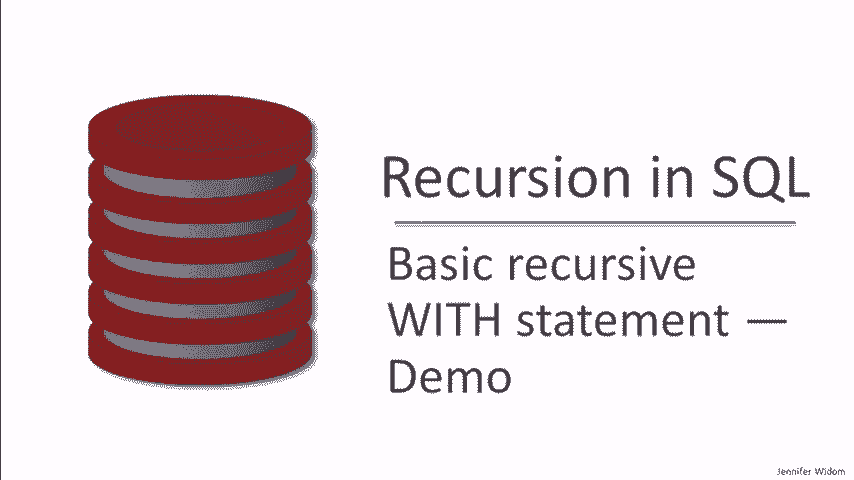

# 课程 P25：SQL 递归查询实战演示 🧠

在本课程中，我们将通过实际演示，深入学习 SQL 中的递归查询。我们将回顾递归查询的基本结构，并通过三个具体示例（家族树、公司层级、航班路径）来展示其应用。最后，我们还将探讨当数据中存在循环时，递归查询可能遇到的问题及其解决方案。

---

## 递归查询回顾 📚

上一节我们介绍了递归查询的基本概念。本节中，我们来看看其核心结构。

递归查询通过 `WITH RECURSIVE` 语句实现。其核心思想是定义一个关系，该关系的查询可以引用自身。一个典型的递归定义包含两部分：

*   **基础查询**：不依赖于递归关系 `R` 的初始数据。
*   **递归查询**：依赖于递归关系 `R`，用于扩展数据。

最终，我们可以编写一个查询，使用这个递归定义的关系以及数据库中的其他表。

其通用形式可以用以下伪代码表示：
```sql
WITH RECURSIVE R (attributes) AS (
    -- 基础查询 (Base Query)
    SELECT ...
    UNION ALL
    -- 递归查询 (Recursive Query)
    SELECT ... FROM R, ... WHERE ...
)
-- 最终查询 (Final Query)
SELECT ... FROM R, ... WHERE ...;
```

---


## 示例一：计算家族祖先 👨‍👩‍👧‍👦

在第一个示例中，我们将学习如何利用递归查询，从仅包含父子关系的表中，找出任意人的所有祖先。

我们有一个名为 `parent` 的表，结构如下：
```sql
parent (parent_name, child_name)
```

我们的目标是找到 `‘Mary’` 的所有祖先。以下是实现此目标的递归查询。

```sql
WITH RECURSIVE ancestor (ancestor, descendant) AS (
    -- 基础查询：父子关系即直接的祖先关系
    SELECT parent_name AS ancestor, child_name AS descendant
    FROM parent
    UNION ALL
    -- 递归查询：如果 A 是 B 的祖先，且 B 是 C 的父母，则 A 是 C 的祖先
    SELECT a.ancestor, p.child_name
    FROM ancestor a, parent p
    WHERE a.descendant = p.parent_name
)
-- 最终查询：找出 Mary 的所有祖先
SELECT ancestor FROM ancestor WHERE descendant = ‘Mary’;
```


**查询执行与验证**

执行上述查询后，我们得到了 Mary 的五位祖先。通过修改最终查询中的名字，我们可以查找其他人的祖先。例如，查找 `‘Frank’` 的祖先会包含 Mary，而查找根节点 `‘Bob’` 的祖先则返回空结果。

---

## 示例二：计算项目总薪资成本 💼


上一节我们计算了家族关系。本节中，我们来看看如何将递归应用于公司管理结构，以计算一个项目的总人力成本。

我们有三张表：
*   `employee(id, salary)`
*   `manages(mgr_id, eid)`
*   `project(name, mgr_id)`

项目 `‘X’` 的总成本是其经理及其所有下属（递归向下）的薪资总和。


**方法一：先计算完整管理闭包**

以下是计算项目 X 总成本的查询。首先计算整个公司的上下级关系（传递闭包），然后汇总相关人员的薪资。

```sql
WITH RECURSIVE superior (mgr_id, eid) AS (
    -- 基础查询：直接管理关系
    SELECT mgr_id, eid FROM manages
    UNION ALL
    -- 递归查询：传递管理关系
    SELECT s.mgr_id, m.eid
    FROM superior s, manages m
    WHERE s.eid = m.mgr_id
)
-- 最终查询：汇总项目 X 经理及其所有下属的薪资
SELECT SUM(salary)
FROM employee
WHERE id IN (
    SELECT mgr_id FROM project WHERE name = ‘X’
    UNION
    SELECT eid FROM superior WHERE mgr_id IN (SELECT mgr_id FROM project WHERE name = ‘X’)
);
```
执行查询后，得到项目 X 的总成本为 400。

**方法二：将项目约束融入递归**

我们可以编写一个更高效的查询，在递归过程中直接限定只计算与项目 X 相关的员工。

```sql
WITH RECURSIVE x_emps(id) AS (
    -- 基础查询：项目 X 的经理
    SELECT mgr_id FROM project WHERE name = ‘X’
    UNION ALL
    -- 递归查询：所有由 X 相关员工管理的员工
    SELECT m.eid
    FROM manages m, x_emps x
    WHERE m.mgr_id = x.id
)
-- 最终查询：汇总这些员工的薪资
SELECT SUM(salary) FROM employee WHERE id IN (SELECT id FROM x_emps);
```
此查询同样返回总成本 400，但递归范围更小，可能效率更高。

**同时计算多个项目**

我们还可以扩展查询，同时计算项目 Y 和 Z 的总成本。以下是实现方式。

```sql
WITH RECURSIVE
y_emps(id) AS ( ... ), -- 类似 x_emps 的定义，针对项目 Y
z_emps(id) AS ( ... )  -- 类似 x_emps 的定义，针对项目 Z
SELECT ‘Y’ AS project, SUM(salary) AS total_cost FROM employee WHERE id IN (SELECT id FROM y_emps)
UNION ALL
SELECT ‘Z’ AS project, SUM(salary) AS total_cost FROM employee WHERE id IN (SELECT id FROM z_emps);
```
执行后，我们得到项目 Y 总成本 300，项目 Z 总成本 70。

---

## 示例三：寻找最便宜航班路线 ✈️

前面我们处理了树状结构的递归。本节中，我们来看看在图状结构（航班网络）中如何使用递归，并处理可能出现的循环问题。

我们有一张 `flights(origin, destination, airline, cost)` 表。目标是找到从城市 `‘A’` 到城市 `‘B’` 总费用最低的路线，允许任意次中转。

**查询所有可能路径及费用**

首先，我们编写一个查询，列出所有从 A 到 B 的路径及其总费用。

```sql
WITH RECURSIVE routes(origin, destination, total_cost) AS (
    -- 基础查询：所有直飞航班
    SELECT origin, destination, cost FROM flights
    UNION ALL
    -- 递归查询：连接已有路径与新航班以扩展路径
    SELECT r.origin, f.destination, r.total_cost + f.cost
    FROM routes r, flights f
    WHERE r.destination = f.origin
)
-- 最终查询：筛选从 A 到 B 的路径
SELECT * FROM routes WHERE origin = ‘A’ AND destination = ‘B’;
```
执行后，我们得到三条路径：直飞（195）、经芝加哥（300）和一条复杂路径（175）。

**查询最低费用**


要找到最便宜的路线，只需修改最终查询，使用聚合函数 `MIN`。

```sql
WITH RECURSIVE routes(...) AS ( ... ) -- 同上
SELECT MIN(total_cost) AS cheapest_price FROM routes WHERE origin = ‘A’ AND destination = ‘B’;
```
查询返回最低费用 175。

**处理循环与无限递归问题**


当航班网络中存在循环（例如城市间可互相往返）时，上述简单递归将产生无限多的路径，导致查询无法终止或报错。

**解决方案：限制递归深度**

SQL 标准并未直接提供在递归中避免循环的机制。一种实用的解决方案是为递归添加一个深度限制。例如，我们假设不会有人为了省钱乘坐超过 10 次航班。


```sql
WITH RECURSIVE routes(origin, destination, total_cost, depth) AS (
    -- 基础查询：添加深度为1
    SELECT origin, destination, cost, 1 FROM flights
    UNION ALL
    -- 递归查询：深度加1，并限制深度小于10
    SELECT r.origin, f.destination, r.total_cost + f.cost, r.depth + 1
    FROM routes r, flights f
    WHERE r.destination = f.origin AND r.depth < 10
)
SELECT MIN(total_cost) AS cheapest_price FROM routes WHERE origin = ‘A’ AND destination = ‘B’;
```
通过引入 `depth` 字段并在递归条件中限制 `depth < 10`，我们确保了递归会在有限步骤内终止。只要设定的深度上限足够大，能包含实际的最优路径，我们就能得到正确结果。

---

## 课程总结 🎯

在本节课中，我们一起学习了 SQL 递归查询的实战应用。

1.  **核心结构**：我们回顾了 `WITH RECURSIVE` 语句，它由基础查询、递归查询和最终查询三部分组成。
2.  **典型应用**：我们通过三个例子演示了递归如何解决传递闭包问题：
    *   **计算祖先**：在树状结构中向上追溯。
    *   **汇总成本**：在管理层级中向下汇总。
    *   **寻找路径**：在网络图中查找连接。
3.  **循环处理**：我们探讨了当数据中存在循环时，递归可能导致的无限循环问题，并介绍了通过**限制递归深度**来确保查询终止的实用方法。


递归是 SQL 中处理层次化或图形化数据的强大工具，理解其原理和潜在陷阱对于编写正确高效的查询至关重要。