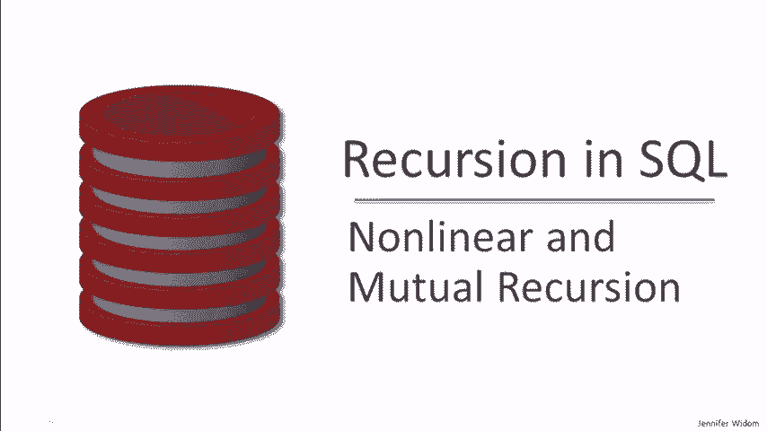
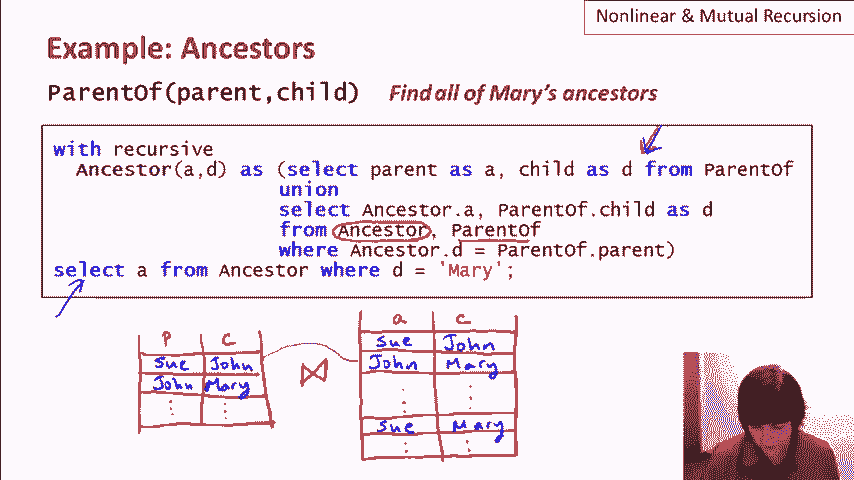
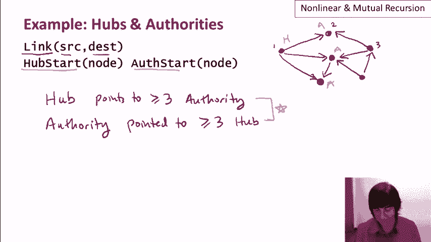
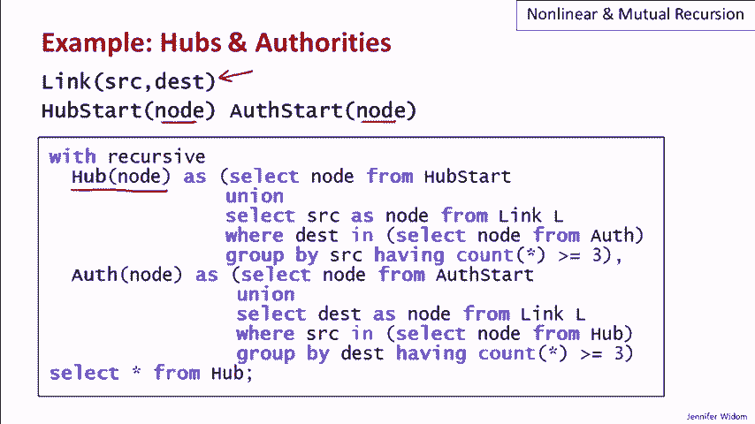
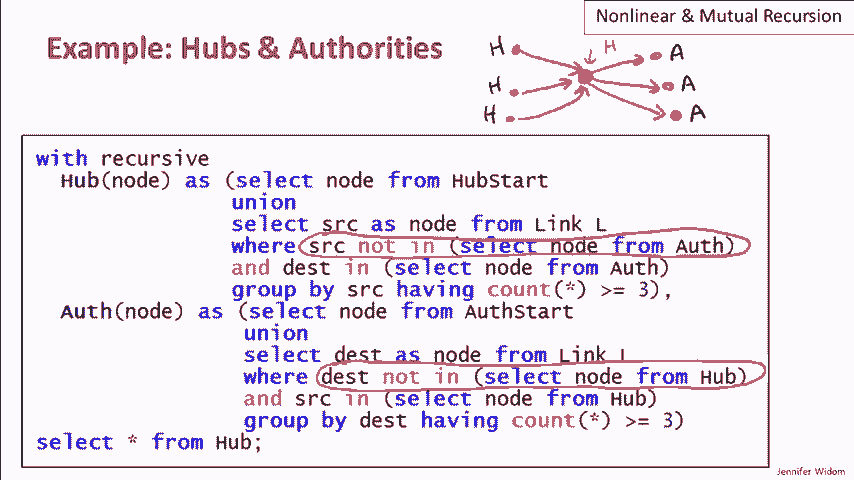
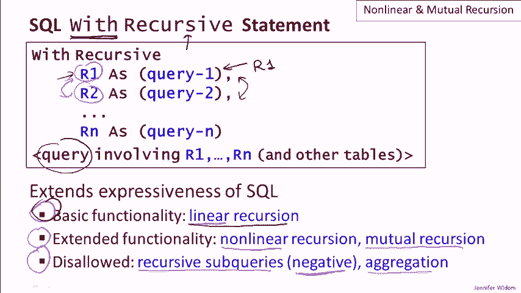

# P26：15-03-nonlinear-mutual-recursion.mp4 - 哈库那玛塔塔i - BV1R4411u7dt

 In this video， we'll be exploring some further issues involved in recursion in the SQL language。

 First， a reminder of how SQL implements recursion。

 There's a width statement in SQL that can be specified to have recursively defined relations in it。

 We say with recursive and then we define a set of relations where the query defining relation could involve the relation itself。

 That's where recursion pops in。 And then at the end。

 the final result is a query that might involve those recursively defined relations。

 as well as other tables in the database。 As we saw in the previous video and demo。

 it's very common for recursively defined relations in the width statement to take the structure of having a base query that doesn't involve our the recursively defined relation unioned with the recursive query。

 We saw many examples of that form。 The first thing I want to talk about in this video is what's called linear recursion。

 Linear recursion specifies that in the recursive definition of R， and again。

 let's assume it takes this form of the base query union， the recursive query。

 in the recursive query， there is only one reference to the recursively defined relation R。

 So let's take a look at an example to understand linear recursion and nonlinear recursion。

 The first example we used when we introduced recursion was finding ancestor relationships from a base table that just has parent-child relationship。

 So a basic transit of closure operation and the query we wanted to run was to find all of Mary's ancestors。

 And here's the query that we wrote。 It does take the form of having a base query here。

 which says if we have a parent relationship， that's also an ancestor relationship。

 And then the recursion occurs in the second part of the union where we join the recursively defined ancestor relationship。

 ancestor relation with parents so that we extend the ancestors with one more generation。

 Now this query does have linear recursion because we only have one instance here of the recursively defined relation ancestor。

 So let's take a look at what happens underneath when this query is executed。

 We start with our parent table。 And here it is with a parent and child and let's suppose we have say Sue and John and John and Mary。

 for example， in our parent table。 Then in what's effectively the first iteration。

 the base query here is run that copies the parent table to the ancestor table。

 So now we have Sue and John and John and Mary and anything else that we had in the parent table in the ancestor table。

 As the iteration continues， we're effectively joining the parent table and the ancestor table to get additional tuples in the ancestor table。

 For example， we see that Sue and John， the Sue and John tuple here。

 would join with the John and Mary tuple and that would give us Sue and Mary in the ancestor table。

 The iteration continues until there are no new tuples to add to the ancestor table and then we're done with our recursively defined relation and we can go ahead and execute the final query in the with statement。

 And again， often when I say we， I really mean we， the system， all this of course。

 is being performed by the system as it executes the recursively defined with statement。

 Now let's take a look at a nonlinear expression of the same query。 Here it is。

 What we see here is that the primary change is right in here。

 Instead of joining the parent with ancestor in the recursive half。

 we're going to join two instances of the ancestor relation。

 And let's see what happens during execution when this is how we express our recursion。

 So we again start by copying the contents of the parent table into the ancestor table as part of the base query and I've already shown that here。

 But now instead of during iteration joining the parent table with the ancestor table。

 we're actually going to join the ancestor table with itself to generate new tuples。 For example。

 we will join the first two tuples in ancestor with each other， Sue， John and John Mary。

 in order to obtain what was the same tuple we obtained with a linear recursion。

 which would be the tuple with Sue and Mary。 Just a quick reminder， I intended to say this earlier。

 but it's the fact that we have these two references to ancestor in the recursion here。

 That makes it nonlinear。 Okay， so what's the deal with these two queries？

 Why might we prefer one form of the query over the other？ And take my word for it， by the way。

 we do get equivalent results to the query in its linear and nonlinear versions。 Well。

 here are some pros and cons to nonlinear versus linear for this particular query and actually in general when we can express a query both ways。

 First of all， there's some pluses to the nonlinear。 So the query looks cleaner。

 If you go back and look at the two queries， the nonlinear version is sort of more symmetric。

 a little shorter even to express than the linear version。

 Second of all， the nonlinear version actually converges faster to the fixed point to the final state than the linear version。

 And I'm going to show that a little bit abstractly because it is actually fairly important。

 So I'm going to create this abstract example， parent-child relation。

 which is going to be completely linear just for illustrative purposes。

 So we have this person here who's the parent of the person here who's a parent of a person here and so on。

 We're going to make it eight levels deep。 So this is an abstraction of our parent table。

 And now let's see how ancestors are computed。 So in the first step。

 we'll add one ancestor tuple for each tuple in the parent relation。

 So the purple are the tuples that are added to ancestor。 Then in the second iteration。

 we're going to join those with themselves。 I'm sorry。

 we're going to join the ancestor tuples with parent tuples。

 So each ancestor tuple could be extended by one。 So that's going to give us all pairs of tuples。

 I'm sorry， it's already getting a bit crowded here， but I think you'll get the idea。

 On the next iteration， we're going to again take our ancestor tuples and extend them by one by joining them with parent。

 So after the second， we'll have all triples here。 So all great grandparent relationships。 Okay。

 and that's a big mess， but you can really see what's going on。 Each time we iterate。

 we get one more generation added into the ancestors。

 And now let's think about what happens when we use the nonlinear version。

 We're after the first step we join ancestor with itself instead of ancestor with parent。

 So as before on the first step， and now I'm going to make these red。

 the ancestor relation will contain exactly the same as parents。

 And the second step is the same as well。 We're going to join ancestor with itself。

 but since each one of ancestor is only the parent relationship。

 we're again going to get all pairs in the second step of the iteration。

 The difference begins in the third step。 Now we're joining ancestor with itself。

 So we will be joining these two step ancestors with the single ones， just like before。

 to get all the threes， but we will also be joining twos with twos。 In other words。

 we'll be joining grandparent relationships with grandparent relationships and we'll be getting in that same iteration。

 the fours。 So as you can see， the nonlinear version does converge faster。

 Now this example is very small， so it's not as blatantly obvious。

 but the linear version is going to take a linear number of iterations in order to converge to the final recursively defined relation contents。

 Whereas when we use the nonlinear version， it's actually logarithmic。 So for a large database。

 it can be considerably faster。 So what about the downsides of nonlinear recursion？ Well。

 the major downside is that it's harder to implement， or certainly harder to implement efficiently。

 And as a result of that， actually the SQL standard only requires linear recursion。

 and the Postgres system that we've been using also only supports linear recursion。

 So back to the basic form of our RIT recursive statement in order to introduce a different topic。

 which is the topic of mutual recursion。 Mutual recursion， as I alluded to in the previous video。

 is the case where one of our recursively defined relations does not refer to itself。

 but rather to a different recursively defined relation。 And that one refers back to the first one。

 or we could even have a loop of three or four or more。

 So the idea is that we can't look at these individually to see the recursion。

 but together they are recursive， and they have to kind of be computed in tandem。

 So the example I'm going to use here is what's known as hubs and authorities。

 Hubs and authorities was an algorithm for web searching， actually。

 for annotating web nodes for the purposes of searching。

 It was developed around the same time as Google's PageRank。 I guess we can see which one won out。

 But hubs and authorities are actually quite interesting just in what it does。

 So let me go ahead and define the meaning of hubs and authorities and then show how mutual recursion and SQL can be used to compute the hubs and authorities in a database that contains a link structure。

 a graph， basically。 So here's a little graph， and we're going to assume that each node has a number。

 say， associated with it， and that we have a relation called link that just tells us the edges of the graph。

 so the source， a node， and the destination node。 So in a graph。

 we're going to designate some of the nodes as hub nodes and some of the nodes as authority nodes。

 and we're going to define a hub node to be a node that points to at least some number， let's say。

 three authority nodes。 And similarly， we're going to say an authority node is a node that's pointed to by。

 let's say， at least three， again， hub nodes。 And by the way， these numbers， three and three。

 don't have to be the same。 And another thing I wanted to mention is in a graph， say。

 representing the web， we wouldn't expect a large fraction of the nodes to be hubs and authorities。

 Many would be normal nodes。 But again， this is just for illustrative purposes。

 but it also serves to teach you about the hubs and authorities concept。

 which is kind of interesting。 Now， you can see already how mutual recursion is going to fit into the picture。

 but how are we going to get started？ And the only way you can actually get started is to have some nodes that are predesignated as hubs and authorities。

 For example， if we predesignated as authorities these three middle nodes here。

 then we could compute the fact that node one is a hub。

 So we'll also assume that we have two or more relations in our database。

 One of them gives us a set of nodes predesignated as hubs and the other a set of nodes predesignated as authorities。

 And our job is to write a query that computes all of the hub and authority nodes based on this mutually recursive definition here。

 So here's the query that does it。 By the way， you've certainly noticed that I'm not doing a live demo of the recursive queries in this particular video。

 Nonlinear recursion is not supported in the Postgres system。

 and it's also not part of the SQL standard。 Mutual recursion in limited forms is part of the SQL standard。

 but it's also currently not supported in Postgres。

 So I've used the nice interface here to get the coloring of the queries。

 but these queries currently don't run on the systems that we're using。 Okay。

 so back to our actual query here。 So this is a query to compute hubs and authorities。

 given that we have a starting set of hub nodes and a starting set of authority nodes。

 And then we have the link relation that gives us the structure of our graph。

 So we're going to compute two relations， the hub relation with the nodes that are hubs。

 the authorities relation of the nodes that are authorities。

 and they are going to have mutual recursion between them。

 So let's take a look first at the hubs and we'll see that the structure of the queries for hubs and authorities is very。

 very similar。 So the base case for the hubs is that the nodes that are in the hub star relation are in the hub relation。

 of course。 And then the recursive query here is a little bit complex。

 So what we're going to find is links， elements in our link relation。

 where the destination is an authority。 And so we're going to find all of the sources that point to an authority。

 We're going to group by the source so we consider each node one at a time。

 and then we count how many times it appears in the link pointing to an authority。

 So this is going to give us a nodes that point two greater than or equal to three authorities。

 which was our definition of hubs。 Now here， of course， we're referring to authority。

 which itself is a recursively defined relation。 The authority relation is very similar。 As I said。

 we start at it with our base case of adding nodes that are in the authority start relation。

 And then we consider destinations instead of sources in our link relation such that there are at least three sources that are hubs。

 And that's what we've got down here。 So this is going to give us elements that are pointed to by greater than or equal to three hubs。

 And here， of course， we're using hub， which is also a recursively defined relation。

 So you can think of these two as working in tandem。

 You can think of this system as sort of iteratively adding to the hubs and the authorities until there's nothing more to add to either one。

 Now， one thing that this definition of hubs of authorities and this computation allows is for a node to be both a hub and authority。

 And there's nothing wrong with that if the structure of the graph yields that result。

 But let's suppose we don't want nodes to be allowed to be both hubs and authorities。

 We want every node to be either one or the other。 That will require us to modify our query to not add nodes to become hubs if they're already authorities or to have nodes become authorities if they're already hubs。

 So let's go ahead and modify the query to incorporate that additional constraint。

 So here's the query and by the way， just a reminder that you can download these queries from our website even though you can't run them at this point in time。

 The difference in this query from the previous one is one additional condition in the definition of hubs right here saying I'm not going to add a node。

 a source node to the hubs if it's already in the authorities。 And similarly。

 I've added one more condition here in authorities that I'm not going to add a node to authorities if it's already a hub。

 Now let's suppose we have the following graph structure。

 We have a node here that hasn't been labeled as a hub or authority yet。

 And let's suppose that this node is pointed to by three nodes that have already been designated as hub nodes。

 And furthermore， this node points to three nodes that have already been designated as authorities。

 So by our definition， this node could be a hub because it points to three authorities and it could also be an authority because it's pointed to by three hubs。

 But the query we've given now is not going to allow us to label this node as both a hub and authority。

 And just to be clear， in the previous query， we would have put this node in both the hub relation and the authority relation。

 But now we're not going to be able to do that because of these conditions right down here。

 So actually， whether this node ends up as a hub or an authority depends on effectively which one of these arms of our width statement gets executed first。

 If we first consider the possibility of the node being a hub。

 then it will be put in the hub relation and then it won't be allowed to be put in the authority relation。

 On the other hand， if we first make an authority， then when we look for computing the hub relation。

 it wouldn't be allowed to be a hub。 So you can think of this as a sort of non-deterministic behavior or if you're into theory that's a non-unique fixed point of the recursion。

 And this is considered a not good thing。 Generally。

 database people when they run queries like to have one answer all the time。

 They like to have a deterministic answer for their queries。 So actually。

 this type of mutual recursion is not allowed in the SQL standard。

 And the real crux of the problem here is that one recursively defined relation is depending negatively on another one。

 So this negative dependence is what causes the problem。 And actually。

 we can have a negative dependence even without mutual recursion。

 We could define a relation that sort of depends negatively on itself and a subquery。

 And that wouldn't be allowed either。 So that completes the example of hubs and authorities。

 And again， what we're trying to show first of all is mutual recursion， which can be quite powerful。

 And second of all， the restriction that we can't have negative subqueries across recursively defined relations。

 The last thing I wanted to mention in this video， it's not in the title of the video since we're focusing mostly on non-linear and mutual recursion。

 is recursion with aggregation。 And let me just show a simple abstract example。

 So we have a relation P that just contains one attribute。 We can assume that it's integers。

 And we're going to try in our with recursive statement to compute a recursively defined relation called R that contains the tuples in P together with the sum of the values in the attribute of P。

 I'll just write that as sum of P。 So here's how we write it in SQL。 We have our base case。

 which is that the tuples in P are also in R。 And then we do our union of the recursive part。

 which says， and also in R， I want to have the sum of the tuples in R。

 So let's say that P starts out with two tuples， the values one and two。

 So what does the query compute for R？ Well， certainly one and two are in R based on the first part here。

 And then based on the second part， then in the first iteration， R should also contain the sum of R。

 which is three， except as soon as we put three in， the sum of R isn't three anymore。

 The sum of R is six。 So should we cross out the three and put six there。

 but then now the sum of R has become six， 79， et cetera。 So we can see the problem。

 There's no good definition for what R should contain based on this recursion。 And for that reason。

 actually recursion with aggregation is disallowed in the SQL standard and isn't supported by any system。

 So to summarize both of our videos about recursion。

 SQL has introduced recursion into the standard as part of the with statement。

 Whether the keyword recursive goes with the with or with the recursively defined relations is a bit inconsistent。

 But in any case， the basic idea is the same。 When we have this statement。

 we can write queries that refer to the relation that's being defined。

 And we can also have mutual recursion between the queries that are defined in the with statement。

 And finally， the result is the running of the final query。

 which might involve the recursively defined relations。

 Adam recursion to SQL does strictly extend its expressiveness。

 There are queries that can't be written without recursion。

 They usually involve some type of unbounded computation。 For example。

 computing any number of flights or any depths of ancestors。

 Usually there's a transit of closure flavor to those queries。 Without recursion。

 the iteration involved in computing a recursively defined relation has to be written outside of the database。

 Has to be written in code in some fashion。 Now we saw that the basic functionality of SQL recursion is linear recursion。

 where we only have one instance of the recursively defined relation in the query defining the relation。

 We can write a lot with linear recursion。 It's very expressive and can express most of the natural queries we might want to do in recursive SQL。

 But there is extended functionality。 There's nonlinear recursion。

 We saw that nonlinear recursion can lead to nicer looking queries and can converge faster。

 but it's actually more difficult to implement efficiently。

 And then there's mutual recursion where R1 here might be defined in terms of R2。

 which itself is defined in terms of R1。 And we saw one interesting example where we'd like to use mutual recursion。

 where it was appropriate。 Finally in terms of what's disallowed， recursive subqueries。

 by that I mean referencing the recursively defined relation in a subquery is actually in the SQL standard。

 not supported by the Postgres system that we were using。

 When a reference in a subquery to a recursively defined relation is negative。

 sort of like a non-exists or not， and that is disallowed by the SQL standard。

 And we saw that that can lead to non-obvious behavior， non-deterministic final results。

 And finally aggregation causes complication as well in recursion and is disallowed too。

 The features that are disallowed really don't come up that often naturally。

 And once again let me just emphasize that the basic functionality of linear recursion does allow one to express a lot of really nice queries and does extend the expressiveness of the SQL language。

