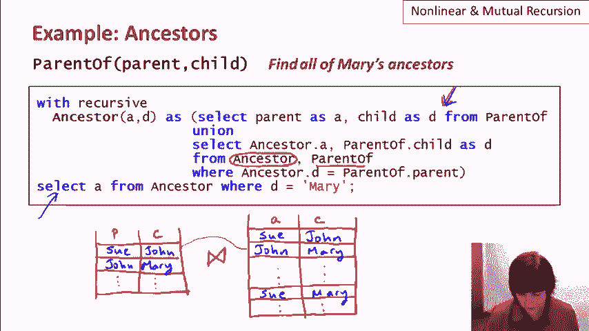

# 课程 P26：SQL 中的非线性递归与互递归 🧩

在本节课中，我们将深入探讨 SQL 递归查询中的两个高级概念：非线性递归与互递归。我们将了解它们是什么、如何工作、各自的优缺点，以及 SQL 标准对它们的支持情况。

---

## 概述

SQL 通过 `WITH RECURSIVE` 语句支持递归查询，这极大地扩展了其表达能力，使其能够处理诸如计算传递闭包等需要无界迭代的问题。上一节我们介绍了递归的基本形式——线性递归。本节中，我们将来看看更复杂的非线性递归和互递归，并探讨 SQL 标准对它们的限制。

---

## 1. 线性递归回顾

首先，我们回顾一下 SQL 如何实现递归。其核心是 `WITH RECURSIVE` 语句，它允许定义一个可以引用自身的关系。其典型结构包含一个不涉及递归的基本查询（Base Case）和一个引用自身进行扩展的递归查询（Recursive Case），两者通过 `UNION` 连接。

例如，在查找“Mary的所有祖先”这个经典例子中，查询结构如下：

```sql
WITH RECURSIVE Ancestor(ancestor, descendant) AS (
    -- 基础查询：父子关系即祖先关系
    SELECT parent, child FROM Parent
    UNION
    -- 递归查询：将已有的祖先关系扩展一代
    SELECT a.ancestor, p.child
    FROM Ancestor a, Parent p
    WHERE a.descendant = p.parent
)
SELECT ancestor FROM Ancestor WHERE descendant = ‘Mary’;
```

这个查询是**线性递归**的，因为在递归查询部分，递归定义的关系 `Ancestor` 只出现了一次。



---

## 2. 非线性递归

### 2.1 什么是非线性递归？

**非线性递归**指的是在递归查询部分，递归定义的关系出现了**两次或更多次**。以上面的祖先查询为例，它的非线性版本如下：

```sql
WITH RECURSIVE Ancestor(ancestor, descendant) AS (
    SELECT parent, child FROM Parent
    UNION
    -- 注意：这里引用了两次 Ancestor 关系
    SELECT a1.ancestor, a2.descendant
    FROM Ancestor a1, Ancestor a2
    WHERE a1.descendant = a2.ancestor
)
SELECT ancestor FROM Ancestor WHERE descendant = ‘Mary’;
```

这里的递归部分将 `Ancestor` 关系的两个实例（`a1` 和 `a2`）进行连接，因此它是非线性的。

### 2.2 执行过程对比

为了理解差异，我们对比两者的执行过程。假设 `Parent` 表包含 `(Sue, John)` 和 `(John, Mary)`。

*   **线性递归执行**：
    1.  基础查询：`Ancestor` 初始化为 `{(Sue, John), (John, Mary)}`。
    2.  第一次递归：将 `Ancestor` 与 `Parent` 连接，得到 `(Sue, Mary)` 并加入 `Ancestor`。
    3.  第二次递归：没有新元组产生，迭代停止。
    *   **特点**：每次迭代只将关系扩展“一代”。

*   **非线性递归执行**：
    1.  基础查询：`Ancestor` 初始化为 `{(Sue, John), (John, Mary)}`。
    2.  第一次递归：将 `Ancestor` 与自身连接，同样得到 `(Sue, Mary)`。
    3.  第二次递归：此时 `Ancestor` 包含三代关系 `(Sue, John)`, `(John, Mary)`, `(Sue, Mary)`。连接自身可能直接产生更远代的关系（例如，如果图更深）。
    *   **特点**：一次迭代可能连接多代关系，收敛更快。

### 2.3 优缺点分析

以下是线性和非线性递归在这个查询中的主要优缺点，通常也适用于其他可互换表达的场景：

*   **非线性递归的优点**：
    1.  **查询更简洁**：在某些情况下，非线性表达更对称、更简短。
    2.  **收敛速度更快**：理论上，线性递归需要 **O(n)** 次迭代（n为深度），而非线性递归可能只需要 **O(log n)** 次迭代。对于大型数据库，这能显著提升性能。


*   **非线性递归的缺点**：
    *   **实现复杂**：高效实现非线性递归对数据库系统更具挑战性。
    *   **支持有限**：因此，**SQL 标准只要求支持线性递归**。像 PostgreSQL 这样的主流数据库系统也只支持线性递归，不支持非线性递归。

---

## 3. 互递归


上一节我们介绍了单个关系的递归，本节中我们来看看关系之间相互引用的**互递归**。

### 3.1 互递归的概念

**互递归**是指两个或多个递归定义的关系相互引用，形成一个循环依赖。例如，关系 R1 的定义引用了 R2，而 R2 的定义又引用了 R1。它们必须被同时计算。

### 3.2 实例：枢纽节点与权威节点

我们用一个经典的“枢纽节点（Hub）”和“权威节点（Authority）”算法来演示互递归。该算法用于分析网页链接图：
*   **枢纽节点**：指向多个**权威节点**的网页。
*   **权威节点**：被多个**枢纽节点**指向的网页。

假设我们有一个表示链接的 `Link(src, dst)` 表，以及初始的 `HubStart` 和 `AuthStart` 节点集合。以下是计算所有枢纽和权威节点的互递归查询：

```sql
WITH RECURSIVE
    Hub(node) AS (
        -- 基础：初始枢纽节点
        SELECT node FROM HubStart
        UNION
        -- 递归：找到指向至少3个权威节点的源节点
        SELECT l.src
        FROM Link l, Auth a
        WHERE l.dst = a.node
        GROUP BY l.src
        HAVING COUNT(*) >= 3
    ),
    Auth(node) AS (
        -- 基础：初始权威节点
        SELECT node FROM AuthStart
        UNION
        -- 递归：找到被至少3个枢纽节点指向的目标节点
        SELECT l.dst
        FROM Link l, Hub h
        WHERE l.src = h.node
        GROUP BY l.dst
        HAVING COUNT(*) >= 3
    )
SELECT * FROM Hub, Auth; -- 最终查询
```


可以看到，`Hub` 的定义依赖于 `Auth`，而 `Auth` 的定义又依赖于 `Hub`，形成了互递归。

### 3.3 互递归的限制与问题

互递归虽然强大，但也带来复杂性。考虑一个修改场景：我们希望一个节点不能同时是枢纽和权威。我们可能在定义中加入排除条件：

```sql
-- 在Hub定义中增加：且不是权威节点
... AND l.src NOT IN (SELECT node FROM Auth)
-- 在Auth定义中增加：且不是枢纽节点
... AND l.dst NOT IN (SELECT node FROM Hub)
```

这引入了**负向依赖**（NOT IN）。这会导致一个严重问题：**结果可能不确定**。如果一个节点同时满足成为枢纽和权威的条件，它最终被归为哪一类，可能取决于系统先计算哪个关系。这种非确定性是数据库系统不希望的。

因此，**SQL 标准禁止在递归定义的关系中出现这种负向子查询**，并且对互递归的支持也非常有限。PostgreSQL 目前也不支持互递归。

---

## 4. 递归的其他限制

除了非线性递归和带有负向依赖的互递归，SQL 标准还对递归查询施加了其他重要限制：

*   **禁止与聚合函数共用**：在递归查询部分使用 `SUM`、`COUNT` 等聚合函数通常是被禁止的。因为这可能导致无法定义明确的固定点（结果集无限增长或无法确定）。
    *   *示例*：`R(x) AS (SELECT a FROM P UNION SELECT SUM(x) FROM R)`，这种查询没有明确定义。
*   **禁止的递归子查询**：如前所述，在子查询中对递归定义关系进行否定引用（如 `NOT EXISTS`）是被禁止的。

---

## 总结

本节课中我们一起学习了 SQL 递归查询的两个高级主题：
1.  **非线性递归**：递归部分多次引用自身，能写出更简洁、理论上更高效的查询，但因实现复杂，不被 SQL 标准要求，主流数据库也不支持。
2.  **互递归**：多个递归关系相互引用，能表达复杂的相互依赖逻辑（如枢纽-权威算法），但易因引入负向依赖导致非确定性结果，因此受到 SQL 标准的严格限制。


尽管存在这些限制，但 **SQL 线性递归的基本功能已经非常强大**，足以表达大多数自然的递归查询（如路径查找、层次结构展开），极大地扩展了 SQL 的语言表达能力。对于更复杂的图计算，可能需要借助专门的图数据库或过程化代码。