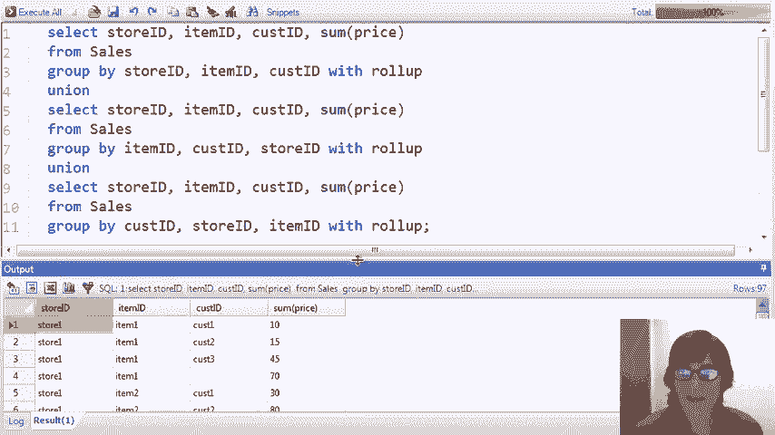
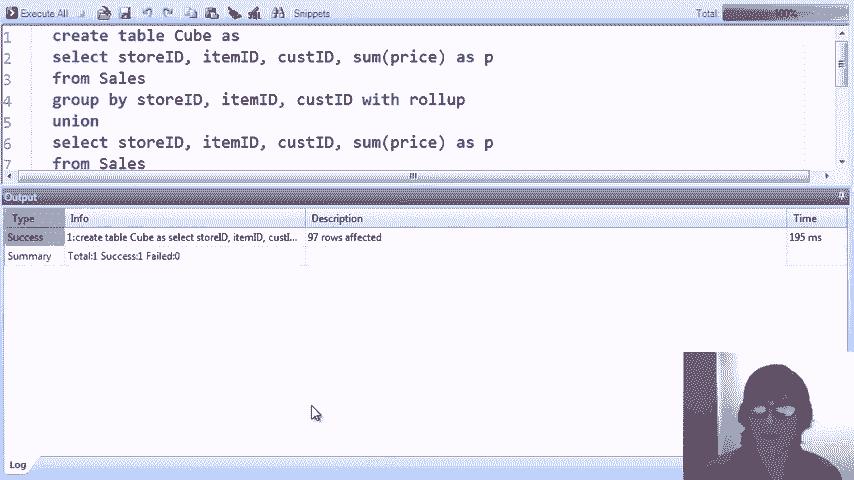
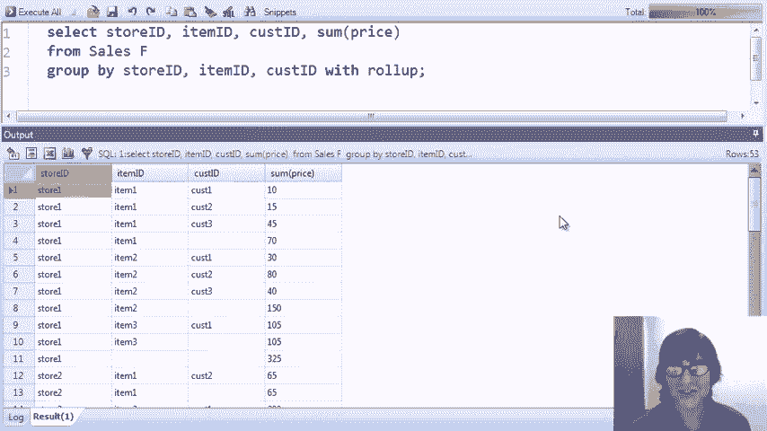

# P27：16-02-olap-demo.mp4 - 哈库那玛塔塔i - BV1R4411u7dt

在这个视频中，我们将进行OLAP的现场演示。

我们将创建一个类似于我们之前示例中的星型架构。它将是销售数据，包括一个事实表和多个维度表，然后我们将执行几种不同类型的OLAP查询。我们将展示整个星型架构的星型连接，并展示一些钻取和汇总的示例。

我们还将展示所谓的切片和切块操作，我们还没有解释过。等到我们做这些查询时就会介绍。最后，我们将展示SQL标准中针对OLAP查询新增的宽度、立方体和汇总操作。这些操作将使用MySQL进行演示。事实上，整个演示将使用MySQL。

MySQL支持with roll up。我们使用的其他系统，SQLite和Postgres，目前还不支持with roll up。MySQL也尚不支持with cube，但我们将看到我们可以使用MySQL的with roll up命令来模拟with cube的行为。那么我们开始演示吧。

这里是演示部分。我们有一个事实表，包含有关商店、商品和顾客的信息。我们这里只看到他们的ID值。我们在事实表中加载了60个元组。我们的维度表是顾客表。我们有四个顾客，每个顾客有性别和年龄。我们有商品表，包含五个商品。

商品的一个类别，仅包括蓝色和红色的T恤和夹克。最后，我们有我们的商店。我们有六家商店，分别位于加利福尼亚州圣克拉拉、圣马特奥县和华盛顿州金县的不同城市。我们的第一个查询就是完全的星型连接。所以我们通过外键连接所有四个表。

事实表中对维度表中键的引用。由于这些是外键引用，您可以把这个星型连接看作是简单地将销售表中的元组扩展，加入有关每个元组中提到的商店、商品和顾客的进一步信息。

所以我们开始吧。我们应该再次期望结果中有60个元组，每个元组对应事实表中的一行。我们可以看到我们从事实表中获得了信息，但我们也加入了来自维度表的更多信息。

现在，完全进行星型连接并不常见。通常我们至少会对星型连接做一些约束。所以我们接下来的查询将对星型连接进行选择和投影。我们将限制查询只涉及销售，并且销售的状态是加利福尼亚州。

类别是T恤，顾客的年龄小于22岁。最后的条件实际上是基于事实表，说明购买价格低于25。这将返回城市、颜色、顾客姓名和商品价格。我们运行查询，现在看到只有五笔销售记录。

这些符合我们标准的内容。我们已经看到星型连接和在星型连接上的约束，但在OLAP应用中更常见的，是进行分组和聚合以便分析数据。我们将从查看涉及维度属性的分组和聚合开始。

然后是被聚合的依赖属性。这是查询中非常常见的一种形式。这里我们假设我们想要根据商店和顾客的组合来分析数据。所以我们将按商店ID和顾客ID进行分组，然后求和以查看每个商店和顾客组合的总销售额。这里是我们的结果。现在，可能目前对我们来说意义不大。

只查看这些商店ID和顾客ID，但对分析师来说，这可能是有意义的。稍后我们会看到，对其他更有趣的属性进行分组和聚合。现在，我将展示钻取的概念。所以你可能还记得钻取。

这表示我们正在查看某种方式聚合的数据，并且我们决定需要更多细节。我们通过向group by中添加更多的属性来获得更多细节。比如在这个案例中，我想按商店、顾客和商品进行细分。

所以我将商品ID添加到group by中，并且也添加到select中。当我运行这个查询时，我看到结果变多了，分析的数据也更加详细。现在，即使我按所有三个维度属性分组，我的结果中也没有60个元组。

因为在我的事实表中，对于某些商店、商品和顾客的组合，确实有多个元组。接下来，我将介绍一个展示“切片”概念的查询。切片当然是与数据立方体相关的。我们在之前的视频中讨论过数据立方体，并且我们特别使用了这个例子。

用于展示三维数据立方体的查询。因此，切片查询的概念是分析数据立方体的一个切片。它通过约束某一维度来实现这一点。所以我要做的是，在这个查询中添加一个约束，表示我们只考虑来自华盛顿州的销售。当我添加这个约束后，我们会继续进行分组。

通过聚合，但仅限于数据立方体中的这一部分，代表华盛顿州的商店。销售来自华盛顿商店。所以对查询做了一些修改。我们首先看到的是，我在from子句中加入了商店关系。为了限制销售的州，我必须与商店表进行连接。

维度表，我可以访问到销售表中没有的州（state）值。因此，我还需要添加变量，并为销售表添加连接条件，使其与维度表连接。接着，我加上约束条件，确保州为华盛顿。

最后一个小改动是为商店 ID 添加一个变量，这样我就不会遇到歧义错误了。现在，让我们继续运行查询。我们看到，确实得到了之前数据的一个子集。这个子集代表了华盛顿州的销售数据，如果你这样理解的话，这是数据立方体的一片切片。现在，除了切片之外，还有一个叫做“切丁”（dicing）的概念。

再次提醒，如果你想象数据立方体，切丁的作用是将立方体切分成多个维度，它会给你一个立方体的块。因此，我将添加一个条件，限制所售商品为红色。这样，我将查看华盛顿州购买的红色商品数据块。这里是查询。

我在 `from` 子句中添加了第三个关系。我添加了商品维度表，这样我可以将颜色限制为红色。我添加了连接条件，将事实表与商品维度表连接起来。我添加了条件，要求颜色为红色。最后，我还必须再次添加变量名，以确保不会遇到歧义的属性引用。

我们运行这个查询后，会发现我们得到的数据立方体的一部分比之前更小了。再次是一个切丁操作，我们约束了两个维度。我们已经看过钻取、切片和切丁。接下来，让我们看一下汇总操作。汇总表示我们在进行数据分析时，认为数据太过详细，希望降低细节层次。换句话说，更多的聚合。

为了做到这一点，我们通过 `group by` 子句提取出属性。假设这是一个过于详细的方式。我们只希望按商品来划分销售数据。因此，我们从 `group by` 子句中移除所有属性，保留商品属性。好了，接下来当我们运行查询时，您会看到更加汇总的数据。

这里再次按单独的商品进行拆分。到目前为止，我们的分组和聚合基于维度属性，具体来说是标识元组的 ID 属性，存在于维度表中。这对于分析可能有意义。但对于这个演示，更有趣的是查看那些对我们实际有意义的属性。

那么让我们尝试一些查询，基于维度表中的属性进行分组。我们仍然会使用事实表，并且会与维度表进行连接。我们将从按州和销售类别进行分组开始，再次对不同组别的总销售额进行求和。

在这里，我们看到有四种州和类别的组合——加利福尼亚、华盛顿、夹克和T恤。然后我们看到了每种组合的总销售额。我们可以看到，在这两个州中，夹克的销量明显高于T恤。但我们也注意到，在加利福尼亚州，

在华盛顿州，T恤的销量要多得多。我想这并不令人惊讶，考虑到天气。现在，让我们演示一下如何在这个查询上进行下钻。假设我们想要更多的信息，也许我们希望除了州之外，还能按县进行划分。为了做到这一点，我们需要在`group by`子句和`select`子句中添加县。然后我们运行查询。

我们可以看到现在我们有了更多的细节。例如，我们可以看到，圣克拉拉县的夹克销售量要高于圣马特奥县，尽管T恤的销量大致相等。实际上，圣马特奥的T恤稍微多一些。这有点让人惊讶，因为圣克拉拉通常比圣马特奥温暖。

但这只是伪造的数据。现在，假设我们想进一步下钻，我们希望根据性别以及其他属性来拆分数据。为了基于性别进行下钻，我首先需要将客户表添加到`from`子句中。在此之前，我们没有进行任何涉及客户表属性的分析。

所以我需要在这里添加连接条件，然后进行下钻。我将性别属性添加到`group by`和`select`中。我们运行查询，结果怎么样？我们可以看到，例如，圣马特奥县的女性买T恤的数量不多。大多数T恤的销售来自男性。

我们注意到的另一件事是，我们并没有每一个县、类别和性别的所有组合。非常具体地说，我们查看后发现，金县的男性没有购买任何T恤。因此，我们的结果中只包含那些实际上出现在事实表中的维度值组合。

或者在事实表和维度表的连接中。现在假设在进行到这一层次的分析后，我决定，可能最有趣的是将数据按州和性别的组合来拆分。这将是一个roll-up操作。记住，对于roll-up，我需要从`group by`子句中移除属性。

所以我移除了县和类别，且只对州和性别的组合感兴趣。顺便提一下，在这一点上，如果我想的话，我可以移除项目表，因为我不再基于项目进行约束或基于项目进行分组。但我现在就留着它吧，它不会对我们的结果产生影响。当然。

为了提高效率，我可能更倾向于将其移除。无论如何，让我们运行查询。现在我们看到的是汇总数据。当我们查看它时，我猜我们的主要结论是：在我们的数据库中，加利福尼亚的男性是大消费者。到目前为止，我们所看到的一切实际上都是使用我们已经熟悉的常规SQL构造。

尽管我们是在一个星型模式上演示它们，并且我们展示的是在OLAP应用程序中，通常会在星型模式上运行的查询类型。现在我们将转向SQL中为OLAP添加的特定构造。正如你可能记得的那样，这两个构造分别叫做withCUBE和withRollUp。

它们是在group by子句中编写的。因此，我们的第一个查询是最基本的CUBE查询。我们从我们的销售事实表开始，对它的三个维度进行分组，然后添加withCUBE。我们得到的基本上是数据立方体中的数据，这是我们在前一个视频中看到的，介绍了立方体的内容。

那么我们继续运行查询。不幸的是，我们收到了一条错误信息，显示这个版本的MySQL还不支持CUBE。实际上，目前没有任何版本的MySQL支持CUBE，但我们希望未来的版本会支持。事实上，我们在演示中使用的三种开源系统中，只有其中一种支持CUBE。

只有MySQL支持withRollUp。因此，我们将继续使用MySQL。事实上，你可以得到与支持withCUBE时相同的结果，使用withRollUp。尽管这有点绕，但我现在会展示一下，如果你写withCUBE时会得到什么结果。下面是查询。我不会解释，除非你特别需要。

对它感兴趣。你可以下载我们的脚本并自行检查。再说一次，我最感兴趣的是查看结果。结果就在这里。

所以这个结果是通过withCUBE，针对我们销售表的所有维度进行分组和聚合的结果，涵盖了所有三个维度。所以我们的一些元组看起来很正常。第一个元组，第二个和第三个元组，都给出了店铺、商品和顾客组合的总价。这些正是我们在原始查询中得到的结果。

那时没有withCUBE操作符。但现在我们看到一些有空白的元组。作为提醒，界面中的空白意味着null。所以这个元组是店铺、商品和null。它对应的是立方体的一个面。因此，这是立方体的一个面，没有限制顾客维度。

那么这个值给我们的就是立方体面上的值，即店铺一、商品一和任何顾客的总销售额。这个值是70。我们实际上可以通过看到前三个元组加起来正好是70来交叉验证这一点，因为这正好是三位在店铺一和商品一购买的顾客。

我们也可以看到对于商店一和商品二，总销售额是150。如果我们再往下滚动一点，会看到其他只有单个空值的情况。我会继续，直到找到一个。比如，这里我们有一个空值是在商店上。这将是数据立方体的面，未约束商店维度的面。

所以这将是任意商店中商品一和顾客一的总和，商品一顾客二在任意商店中的总和。然后，我们还有一些包含两个空值的元组。这里是一个例子。所以这个将对应于立方体的边缘。这是沿着商店维度的立方体边缘，挑选出了商店五。

沿着那个维度，然后给出商店五中所有商品和所有顾客的总销售额。我们看到了这一点。再一次，我们会看到其他例子，其中缺少两个值。需要滚动下去才能看到这里。我们有一个缺少商店和商品的例子。所以这将在顾客维度的边缘。

这样我们就得到了顾客三在任意商店和商品的总销售额。最后，如果我们找到了，它将是所有三个空值的情况。就在这里。所以它代表了立方体的角落。这给了我们所有商店、所有商品和所有顾客的总和。因此，通过添加`cube`，我们做的就是这个——再一次。

这实际上就是结果，如果这里的方形立方体被支持——我们得到的是数据立方体的内容，即立方体的内部部分，这也是我们在最初的查询中看到的内容——除了立方体面的数据。

立方体的边缘和角落。现在让我们做一个快速的交叉检查。所以这些数据告诉我们，立方体的角落，这里所有空值的那一部分，是3350的总价。所以如果我们在没有做任何分组或聚合的情况下求和价格，应该正好是这个结果。让我们试试看。

所以我们只需将销售表格拿出来，求和所有价格，然后运行它。

结果确实是3350。所以现在我们已经看到了SQL如何有效地创建数据立方体。有时在OLAP应用中，直接查询立方体是很方便的。因此，人们经常在SQL中创建数据立方体，例如使用物化视图，或者通过创建一个包含数据立方体结果的表。

这正是我们要做的。有些系统甚至将数据立方体作为它们的基础本地数据模型。所以让我们继续，将我们的`cube`查询结果放入表格中。我刚刚添加了创建表格`Cube`，就像之前的查询一样。还有一件我做的事，就是给聚合属性的结果添加了名称。

这样我们就可以在数据 cube 中引用它。接着，P 将包含数据 cube 中商品的价格总和，此外还包括 cube 的面、边和角的总和。所以让我们创建这个表。

现在让我们直接查询 cube。所以你会在接下来的几个查询中注意到，唯一的变化是我们将销售表替换为了 cube 表。因此，我们将直接在 cube 上运行查询，并且我们可以将 cube 与店铺、商品表连接，甚至在需要时连接客户表。

就像我们之前连接了销售表一样，因为它确实包含相同的维度属性。cube 给我们提供的是预聚合数据，既包括店铺、客户和商品的组合，也包括那些没有值的数据，这些数据已经针对 cube 的面、边和角进行了聚合，正如我们马上就会看到的。

那么，我们的查询将做的事情是，找出加利福尼亚州蓝色商品的总销售额。我将首先展示用于获取该总额的元组。所以我们将按顺序将 cube 表与店铺和商品维度表连接，以便限制州和颜色，然后我们将限制州和颜色。

注意我们最后说的是客户 ID 为 `no`。这将给我们提供 cube 面上的数据，这些数据不涉及客户维度。这意味着这些数据已经为所有客户进行了预聚合。而这正是我们想要的，因为我们不关心具体的客户。

然后关于颜色和州的情况。首先让我们运行这个查询，我们看到得到六个元组。这些元组都是来自我们之前运行的 cube 查询结果的一部分，该部分的客户 ID 值为 `no`。然后它是所有店铺和商品的组合。如果我们检查我们的维度表。

我们可以看到这些店铺位于加利福尼亚州，这些商品是蓝色的。以下是按店铺和商品细分的总销售额。最后，为了得到总的销售额，我们只需将列 P 相加，记住 P 是数据 cube 中价格的总和。因此，我们将 `c.star` 替换为 P 的总和，并运行查询，最后得到总销售额为 1365。

现在让我展示一些可能一开始看起来不太直观的东西，但如果你自己思考一下，甚至运行一下查询，你会开始理解到底发生了什么。我将回到 `c.star`，在选择子句中使用它。顺便提一下，我之前没有提到过，`c.star` 在选择子句中为我们提供了所有来自 cube 表的属性。

这显示了用于聚合的元组。我们之前有六个元组被使用。现在我将对查询做一个小改动。不是查找客户 ID 为 `no` 的记录，而是查找客户 ID 不为 `no` 的记录。我将运行这个查询，看到现在有 14 个元组。

实际上，我们所做的就是离开了数据立方体的表面，进入了数据立方体。我已经说过，不要给我任何汇总数据。只给我商店、商品和客户的原始值。所以，我去掉了汇总数据，但实际上这仍然应该给我相同的答案。我们来确保这一点。

我对P求和，然后运行，结果是1365。所以这里发生的事情是，我使用了本质上相同的数据，但按客户拆分，并进行了求和。这是一个效率较低的查询，但这两个查询都给出了正确的结果。它们确实给出了加利福尼亚州商店或蓝色商品的总销售额。再次强调。

我鼓励你下载这些并亲自运行，搞清楚到底发生了什么。作为对这个相同查询的最后演示，我们实际上可以回到销售表。假设我们甚至没有数据立方体。那么我们将使用销售表来代替，结果应该是相同的，但比我们之前做的查询效率低。

你可以看到，我已经将数据立方体改为销售表，并将所有的C点替换成F点。我去掉了是否为null的约束，因为在销售表中这并不相关。除此之外，查询看起来基本相同。现在我们运行这个查询，看看我们现在正在操作多少个元组。现在我们操作的是25个元组。

这是原始的完全拆解数据。作为提醒，在数据立方体中，即使是在单元格中，我们也会对商店、商品和客户的组合进行总结或求和。所以，如果我们有三个相同商店、商品和客户的元组，这些会在销售表中拆分出来，并在数据立方体中汇总。

即使在数据立方体中最不简化的部分，如果你理解我的意思。现在我们有了25个元组，如果我们对这25个元组的价格进行求和，我们应该得到相同的结果，1365，结果确实是这样。所以我们看到，在最有效的查询中，我们只用了六个元组来查询数据立方体。当我们只使用数据立方体的中心部分时，我们有14个元组左右。

我实际上不记得确切的数字了。然后是25个，所有这些都给我们相同的答案。显然，这些数字非常小。但是如果你考虑到拥有数百万或数千万行数据的庞大数据集，那么我们就在谈论在获取答案时需要总结或聚合的数据量的巨大差异。所以，使用数据立方体中的汇总数据。

这比直接查询原始事实数据快几个数量级。现在，宽数据立方体的一种变体是直接在数据立方体操作符中给出特定属性。它的意思是只对这些维度属性进行汇总，而不是其他属性。换句话说，在结果中，我们只会看到商店ID和客户ID的null值。

我们不会看到项目 ID 的空值。所以在某种意义上，我们仅对立方体的一些面、边和角进行具体化，并不是所有的。如果我们运行这个查询，嗯，我们会得到相同的结果，MySQL 目前还不支持它。但这就是 SQL 标准中的立方体操作符。

使用属性的子集。像以前一样，我编写了一个等效的查询，使用了带有 rollup 命令的 MySQL。 当然，我不会解释它，但你可以下载并查看它。我真正想看到的是结果。

结果如下。这看起来和我们原始的数据立方体非常相似。但我们会注意到，项目列中没有空值。所以它是立方体查询结果的一个子集。当我们知道自己永远不会对项目进行汇总时，我们就会使用这个维度。所以基于这个维度的汇总就是如此。

这对我们来说不会有太大帮助。现在，让我们来看一下 width rollup，这是 MySQL 系统本地支持的功能。width rollup 给我们提供了数据立方体的一个子集，但它是一个非常特定的子集。它基于 group by 子句中属性的排序。让我直接运行它，并解释我们得到的结果。

我们再次看到空值。这些空值表示汇总。例如，商店一，项目一，70 是商店一和项目一所有客户的价格总和。我们也可以看到商店一项目二。我们再次看到包含两个空值的情况。所以这是商店一所有项目和客户的汇总，表示总销售额。

我们还会看到某些地方有三个空值。这个空值出现在底部，表示总销售额为 33.50。但我们会看到的是，我们没有所有空值组合。我们有客户 ID 的空值，或者客户 ID 和项目 ID 组合的空值，或者全是空值。

所以我们只拥有最右边的属性，或者最右边的两个属性，甚至是所有属性。如果我们有第四个维度，我们会看到最右边的两个、三个、甚至更多属性。所以对于这个查询而言，这并没有什么特别的意义，但它在具有层次化维度时使用。

实际上，我在我们原始的架构中引入了层次化维度，正是为了这个目的。

接下来让我们来看这个查询。这个查询是按州、县和市进行分组的。这三个是维度属性，全部来自商店维度表。它们是层次化的，意味着我们没有州、县和市的所有组合。我们有属于特定县的城市，也有属于特定州的县。

所以，当我们查看查询结果时，我们当然会看到，当我们有圣马特奥时，它总是在加利福尼亚州。金县总是在华盛顿州。我们没有看到帕洛阿尔托与，比如说，金县和加利福尼亚州组合在一起。所以我们没有所有三者的组合。我们有它们的层次结构。

而正是这种结构使得我们在使用上卷时能够理解。所以让我们在这个查询中添加`with roll up`，看看会得到什么。在我们的结果中，我们看到原始的元组，表示州、县、市的组合。然后我们看到，例如，这个元组，它表示加利福尼亚州和圣马特奥县。

并且对所有销售额进行了汇总。我们还看到了类似的情况，展示了圣克拉拉县的所有销售额。然后我们可以看到各个州的所有销售额。所以这就是加利福尼亚州的销售额和华盛顿州的销售额。最后，三重空值是数据立方体的角落，它代表了我们所有的销售额。和往常一样。

我们得到的总和是33.50。那么，与数据立方体相比，我们在这里看不到什么呢？嗯，我们看不到一个元组，它有加利福尼亚州、帕洛阿尔托和县为空的情况。为什么呢？因为帕洛阿尔托总是在圣克拉拉县。所以滚动上去（即选择）县，或者说，我想要加利福尼亚州和帕洛阿尔托在每个县的销售额。

这与说“我要加利福尼亚州和帕洛阿尔托在圣克拉拉县的销售额”是完全一样的。我们还没有看到，例如，州和县都为空的情况。例如，如果我们有西雅图这个城市，州和县都为空，那么，西雅图总是在金县，总是在华盛顿州。所以我们在那里没有进行任何汇总。

我们得到的结果与在华盛顿州使用西雅图金县是完全相同的。所以，如果我们在这个层次结构的数据上使用`cube`，我们实际上不会获得更多的信息。我们会得到一个更大的结果，但它并不会给我们更多的信息。它只是使得获取相同数据的过程变得更低效。

这就结束了我们的OLAP演示。我们看到了星型架构，也看到了基于该架构的简单SQL查询。我们了解了下钻和上卷的概念，也包括切片和切块。我们引入了SQL中的`with cube`扩展，它还没有在MySQL中实现，但我们能够编写一个与`with cube`等效的查询。

我们还看到了将`with cube`查询放入表格中，然后直接查询该表格。这比直接在事实表上运行等效的SQL查询要高效得多。我们还展示了已实现的OLAP功能，但我们没有演示将`with OLAP`的结果放入表格中。

但我们当然也可以做到这一点。所有这些功能主要用于处理执行大规模数据集分析的应用程序，这些数据集表现出这种维度类型的结构。但这种结构实际上在分析应用中非常常见。

