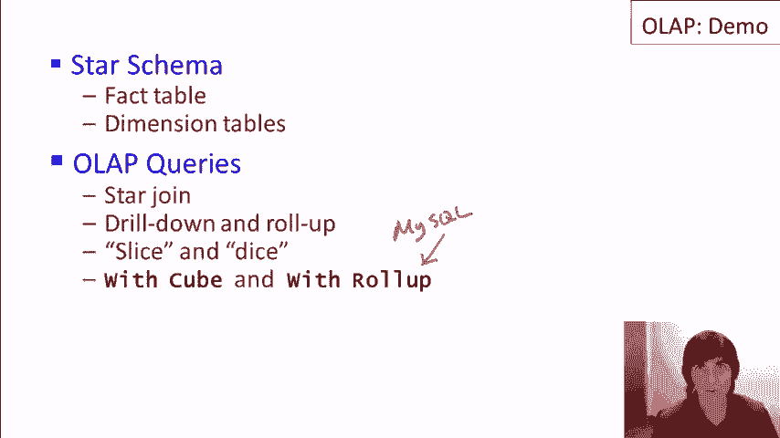
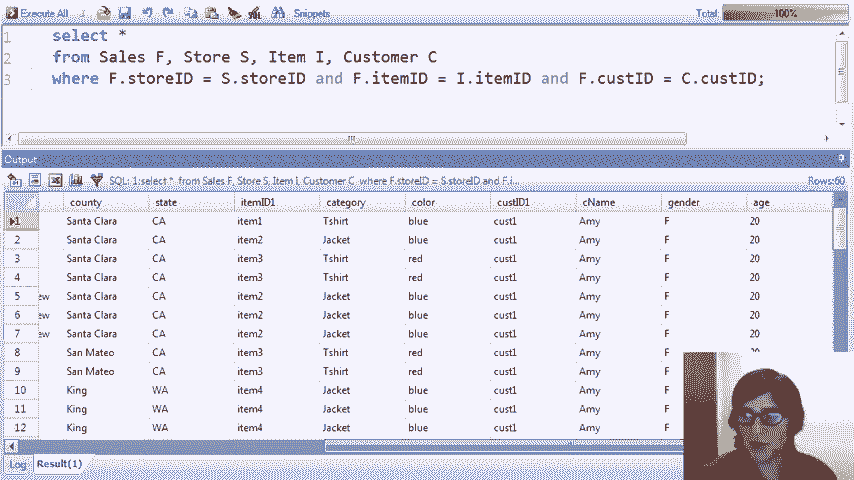
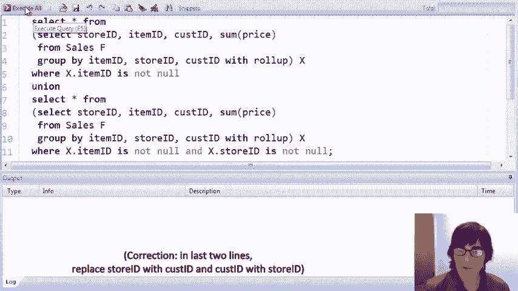
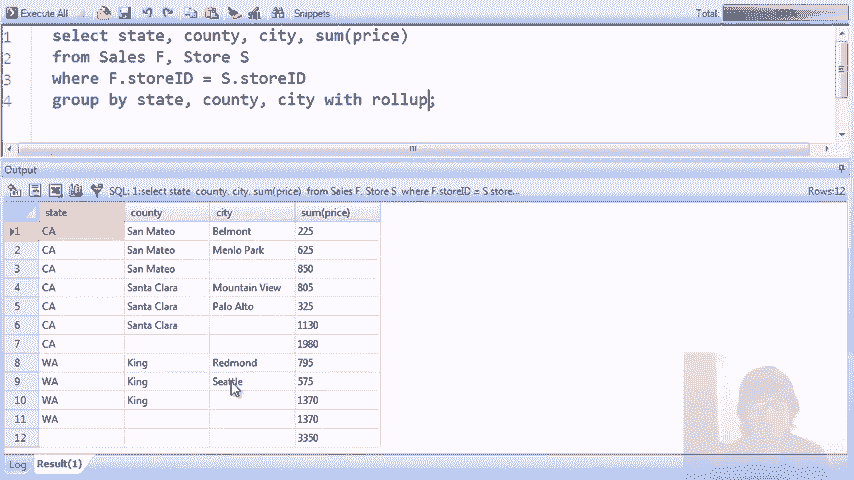

# P27：16-02-olap-demo.mp4 - 哈库那玛塔塔i - BV1R4411u7dt

 In this video， we'll be doing a live demonstration of OLAP。

 We'll create a star schema similar to the one we used in our previous examples。

 It will be sales data with a fact table and several dimension tables。

 and then we'll do several different types of OLAP queries。

 We'll show a full star join over the star schema。 We'll show some examples of drill down and roll up。

 We'll also show what's known as slicing and dicing， which we haven't explained yet。

 We'll just do when we get to those queries。 And finally， we'll show the width， cube。

 and width roll up clauses， that have been added to the SQL standard for OLAP queries。 For those。

 we'll be using MySQL。 Actually， for the whole demo， we'll be using MySQL。

 MySQL supports with roll up。 Neither of the other systems that we've been using， SQLite or Postgres。

 supports with roll up yet。 And MySQL does not yet support with cube。

 but we'll see that we can simulate the behavior of with cube。

 using the width roll up command of MySQL。 So let's move to the demo。

 Here we are in the demo。 We have a fact table that contains information， about stores， items。

 and customers。 We don't see much here except their ID values。

 And we have 60 tuples loaded up in our fact table。 Our dimension tables are the customer table。

 We have four customers with a gender and an age。 We have our item table， five items。

 a category of the item， just t-shirts and jackets just in blue and red。 And finally。

 we have our stores。 And we have six stores that are in various cities in Santa Clara。

 San Mateo County in California and King County in Washington。

 Our first query is simply the complete star join。 So we're joining all four tables using the foreign key。

 references in the fact table to the keys in the dimension tables。 Now。

 since these are foreign key references， you can think of this star join as simply extending。

 the tuples in the sales table with further information， about the store， item。

 and customer mentioned in each one。

 So here we go。 And we should expect again 60 tuples in the results。

 one for each tuple in the fact table。 And we can see that we have the information from the fact。

 table， but then we also have more information， that we've joined in from the dimension tables。

 Now， it's not typical to do the complete star join。

 Usually we would at least constrain the star join in some way。

 So our next query will do selections and projections， on the star join。

 We're going to limit ourselves to sales， where the state of the sale is California。

 the category is T-shirt， the age of the customer is less than 22。

 And the last condition is actually over the fact table。

 saying the price of the purchase was less than 25。 And that will return the city， color。

 customer name， and price of the item。 We run the query and we see now that we have just five sales。

 that meet our criteria。 So we've seen the star join with constraints on the star， join。

 but what's even more common in OLAP applications， is to do grouping and aggregation in order。

 to analyze the data。 And we're going to start by looking at grouping。

 and aggregation involving dimension attributes in the group。

 by and then the dependent attribute being aggregated。 This is a very common form of query。

 So here we'll say we want to analyze our data based， on combinations of stores and customers。

 So we'll group by store ID and customer ID， and then we'll sum up to see the total sales for each combination。

 of store and customer。 So here's our result。 Now， maybe not that meaningful to us right now。

 just looking at these store ID and customer IDs， but for an analyst it might be meaningful。

 We'll see in a moment doing group by and aggregation。

 on other attributes that look a little more interesting。

 So now I'll demonstrate the concept of drilling down。 So you might remember drilling down。

 says that we're looking at data that's aggregated。

 in some fashion and we decide we want more detail。

 We get more detail by adding more attributes to the group by。

 So let's say in this case I want to break out not only， by store and customer， but also by item。

 So I add item ID to the group by and also to the select。

 And when I run this query I see that I get more results。

 and I now have more detail in the analysis of the data。 Now I don't have 60 tuples in my result。

 even though I'm grouping by all three dimension attributes。

 because I do have in my fact table more than one tuple。

 for some combinations of store item and customer。 Next I'm going to introduce a query that shows the concept。

 called slicing。 Slicing of course evokes the data cube。

 We talked about the data cube in the previous video， and we specifically use this example。

 to demonstrate a three dimensional data cube。 So the idea of a slicing query is a query that。

 analyzes a slice of the cube。 And it does that by constraining one of the dimensions。

 So what I'm going to do is add to this query， a constraint that says let's only consider sales。

 that are from the state of Washington。 And when I add that we'll continue to do the group。

 by an aggregation but only on that slice of the cube， representing Washington stores。

 the sales that， are from Washington stores。 So it made a few changes to the query。

 The first thing we see is that I added the store relation， to the from clause。

 In order to constrain the state of the sale， I have to join with the store table。

 that dimension table， so that I can access the value of state， which。

 is not present in the sales table。 So I also had to add variables and I。

 add the join condition for the sales table， to join with the dimension table。

 And then I add the constraint that the state is Washington。

 The last small change is to add a variable to the store ID， so that I don't get an ambiguous error。

 So now let's go ahead and run the query。 And we see that we do get a subset of what we had before。

 And that subset is the slice of the data cube， if you want to think of it that way， representing。

 the sales in Washington state。 Now in addition to slicing， there's also， a notion of dicing。

 And again， if you imagine the data cube， what a dice does is slice into dimensions。

 and it gives you a chunk of the cube。 So I'm going to add a condition on the item being sold。

 I'm going to add that the item must be red。 So then I'm going to be looking at the chunk of the data。

 cube that identifies red items purchased， in the state of Washington。 So here's the query。

 I've added a third relation to the from clause。 I added the item dimension table so that I。

 can constrain the color to be red。 I've added a join condition joining the fact table。

 to the item dimension table。 I've added the condition that the color is red。 And finally。

 I had to add again the variable names， to make sure I didn't get ambiguous attribute references。

 So we'll run this query and we see， that we get an even smaller portion of the data cube。 Again。

 a dice where we've constrained two dimensions。 So we've seen drilling down and slicing and dicing。

 Now let's take a look at rolling up。 Rolling up says that we're looking at our data analysis。

 and we decide that it's too detailed。 We want to have less detail。 In other words， more aggregation。

 To do that， we take attributes out of the group by clause。 So let's say this is way。

 way too much detail。 And we just want our sales broken down on item。

 So we take all of the attributes out of our group， by clause except for item。 Here we go。

 And then when we run the query， we'll， see much more summarized data。

 And here it is broken down again just by separate items。 So far， our grouping and aggregation。

 has been on the dimension attribute。 Specifically， the ID attributes identifying the tuples。

 in the dimension table。 And that may be meaningful for analyses。 But for this demonstration。

 it's more， fun to look at attributes that actually mean something to us。

 So let's try a few queries that group instead， based on attributes in the dimension tables。

 we'll still be using the fact table。 We'll be joining with dimension tables。

 And here we're going to start by grouping， on the state and the category of the sales。 Again。

 summing up the total sales for the different groups。

 So here we see that we have four combinations of state， and category-- California， Washington。

 jackets， and t-shirts。 And then we have the total sales in each of those。

 So we can see in both states that the sales for jackets。

 account for considerably more than the sales for t-shirts。 But we do also notice that in California。

 there's a lot more sales of t-shirts， than there are in Washington。

 And I guess that's not surprising given the weather。 Now let's demonstrate drill down on this query。

 So let's say we want a little more information。 Maybe we want to break down by county in addition to state。

 So to do that， we add county to the group by clause， and a select clause。 And when we run the query。

 we see we do now have more detail。 We can see， for example， that we had more jackets--。

 sales in Santa Clara County than in San Mateo County。

 although the t-shirts were approximately equal。 A little， actually， more t-shirts in San Mateo。

 This is a little surprising because Santa Clara is generally， warmer than San Mateo。

 but it's fabricated data。 Now let's say we want to drill down even further。

 and we want to break our data down by gender， as well as the other attributes。

 In order to drill down based on gender， I first needed to add the customer table to our from clause。

 Prior to this， we weren't doing any analysis that involved， any attributes of the customer table。

 And so I need to add the joint condition here， and then to do the drill down。

 I add the gender attribute， to the group by and to the select。 We run the query。

 and what do we find？ Well， we can see， for example， that not too many females。

 in San Mateo County are buying t-shirts。 Most of those t-shirt sales are counted for by males。

 The other thing we notice is that we， don't have every single combination of county， category。

 and gender。 Very specifically， we look and we， can see that no males in King County bought any t-shirts。

 So we only have， in our result， those combinations。

 of dimension values that actually appear in the fact table。

 or in the join of the fact table with the dimension tables。

 Now let's suppose after I've gotten to this level of analysis。

 I've decided that what might be most interesting， is the data broken down just by combination of state and gender。

 So that would be a roll-up operation。 And remember， for roll-up， I take attributes out。

 of the group by clause。 So I take out the county and category。

 and I'm just interested in state gender combinations。 By the way， at this point， if I wanted to。

 I could remove the item table because I'm， no longer constraining based on items or grouping based on items。

 But I'll just leave it in for now。 It's not going to make a difference in our result。 Of course。

 for efficiency， I might prefer to take it out。 Anyway， let's run the query。

 And now we see that rolled up data。 And when we look at it， I guess our main conclusion here。

 would be that in our database， the California males， are the big spenders。 So far。

 everything we've seen has actually just， used the regular SQL constructs that we already knew about。

 Although we were demonstrating them over a star schema， and we are showing the types of queries。

 that one tends to run over star schemas in OLAP applications。

 Now we're going to move to the specific constructs that， have been added to SQL for OLAP。

 As you may remember， the two constructs， are called withCUBE and withRollUp。

 and they are written in the group by clause。 So our first query is the absolute basicCUBE query。

 We start with our sales fact table。 We group on all three of its dimensions。

 and then we add withCUBE。 And what we're going to get is basically the data。

 in the data cube that we saw in our previous video that， introduced the cube。

 So let's go ahead and run the query。 Disappointingly， we get an error message that。

 says this version of MySQL doesn't yet supportCUBE。 Actually， no version of MySQL supportsCUBE。

 at this point in time， but we're hopeful that a future one， will。 In fact。

 of the three open source systems， that we've been using for our demos。

 only MySQL supports the withRollUp。 So we will continue with MySQL。 And in fact。

 you can get the same result， that you would get if withCUBE were supported using withRollUp。

 Although it's a little bit contorted， but I'll do that now to demonstrate what you would get。

 if you wrote withCUBE。 So here's the query。 I'm not going to explain it if you're particularly。

 interested in it。 You can download our script and examine it yourself。 Again。

 what I'm most interested in is looking at the results。 And here they are。

 So this result is the result of a withCUBE， on the grouping and aggregation on all dimensions。

 of our sales table， all three dimensions。 So some of our tuples look very normal。 This first tuple。

 second and third tuple， are all giving us the total price for a combination of store， item。

 and customer。 And these are exactly what we got in our original query。

 that didn't have the withCUBE operator。 But now we see some tuples that have blanks。

 And as a reminder， blanks in this interface mean null。 So this tuple is store， item， and null。

 And what this corresponds to is an element， on the face of the cube。

 So this is the face of the cube that's， not constraining the customer dimension。

 And what the value gives us then is the value， we would have on the face of the cube， which。

 is the total sales for the combination of store one， and item one and any customer。 And that's 70。

 And we can actually cross check that， by seeing that the first three tuples add up to 70。

 because those happen to be the three customers that， have made purchases at store one and item one。

 And we can similarly see for store one and item two， the total sales are 150。

 If we scroll down a bit， we'll see cases， where we have other single null values。

 I'll keep going until I find one here。 For example， here we have the null value for the store。

 And that would be the face of the cube that's， not constraining the store dimension。

 So that would be the sum for item one and customer one， at any store， item one customer to it。

 any store。 Then we also have tuples that have two null values。 Here's an example。

 So this one is going to be corresponding， to the edge of the cube。

 So this is the edge of the cube that， is along the store dimension and is picking out store five。

 along that dimension and then giving the total sales， for all items and all customers in store five。

 And we see that。 And again， we'll see other instances， where we're missing two values。

 It gets scrolled down to get here。 We've got one where we're missing the store and the item。

 So this would be on the edge along the customer dimension。

 So this gives us the total sales for any store， item， by customer three。 And then finally。

 if we find it， we'll find the one that's all three null values。 And that's right here。

 So that represents the corner of the cube。 That gives us the total for all stores， all items。

 and all customers。 So what we've done here by adding with cube--， and again。

 it's really that would be the result， if the square here were supported--。

 what we're getting is the contents of the data cube， which， are the inner parts of the cube， which。

 is what we would get without adding anything to our group。

 by what we saw in one of our very first queries of the demo--， in addition to the data on the faces。

 the edges， and the corner of the cube。 Now let's do a quick cross check。

 So this data tells us that the corner of the cube here， the one with all null values。

 is a 3350 total price。 So that should be exactly what we get。

 if we sum up our prices without doing any grouping， or aggregation。 So let's give that a try。

 So we merely take our sales table， we sum up the total prices， and we run it。

 and indeed we get 3350。 So now we've seen how SQL can be used to effectively create， the data cube。

 Sometimes in OLF applications， it's， convenient to query the cube directly。

 So people frequently create data cubes， say in SQL using a materialized view。

 or just by creating a table that contains the result， of the data cube。

 which is what we're going to do。 There are even some systems that use the data cube。

 as their basic native data model。 So let's go ahead and take the result of our cube query。

 and put it in a table。 So I've just added Create Table Cube as before our query。

 And the one other thing I did was， add a name to the result of the aggregation attribute。

 so that we can refer to it in the data cube。 So P then will be containing the sum of the price。

 for the items inside the data cube， as well as for the faces， edges， and corners。

 So let's go ahead and create that table。

 And now let's look at querying the cube directly。 So the first thing you'll notice in the next few queries。

 is that we've replaced the sales table with the cube table。

 So we're going to run our queries directly on the cube。

 and we can join the cube with the store and item tables， and the customer if we needed it。

 just as we joined the sales table， because it does contain the same dimension attributes。

 What the cube gives us is pre-aggregated data， both for the store， a customer。

 and item combinations， as well as the data that has no values that is already。

 aggregated for the faces， edges， and corner of the cube， as we'll just see in a moment。

 So what our query is going to do， is find total sales of blue items in the state of California。

 I'm going to start by showing the tuples that are used， to get that total。

 So we'll join our cube table with the store， and the item dimension tables in order。

 to constrain the state and the color， and then we will constrain the state and the color。

 And notice the last thing we say is that customer ID is no。

 And that's going to give us the data that's， on the face of the cube that doesn't go along。

 the customer dimension。 That means it's going to be pre-aggregated for all customers。

 And that's what we want， since we don't care about the customers。

 and just about the color in the state。 So let's first run this query， and we see we get six tuples。

 These tuples are all from the portion of the result。

 of that cube query we ran that has a no value for customer ID。

 And then it's all combinations of stores and items。 And if we checked our dimension tables。

 we'd see that these stores are in California， and these items are blue。

 And these are our total sales broken down by store and item。 Finally， to get the total total sales。

 we'll just sum up our column P， which remember， was the sum of price in the data cube。

 So we replace c。star with sum of P， and we run the query， and we see that our total is 1365。

 Now let me show you something that may seem nonintuitive， at first， but if you think about it。

 maybe run the queries， yourself， you'll start to understand exactly what's happening。

 I'm going to go back to c。star in the select clause。 And incidentally， I didn't mention it before。

 but c。star gives us in the select clause， all the attributes from the cube table。

 And that's showing which tuples are being， used for the aggregation。

 So we had before six tuples that were being used。 Now I'm going to make one tiny change to the query。

 Instead of finding the customer IDs that are no， I'm going to find the customer IDs that are not no。

 I'm going to run that query， and I， see that we have 14 tuples now。

 What we've actually done is moved away， from the face of the cube and into the cube。 And I've said。

 don't give me any of the summarized data。 Just give me the original values that are the store item。

 and customer together。 So I've taken away the summaries。

 but actually this should still give me the same answer。 And let's make sure that's the case。

 I do sum of P， and I run it， and I can get 1365。 So what happened here is I used what's effectively the same data。

 but broken down by customer， and I added it up。 That was a less efficient query。

 but both of those queries， do give the correct result。

 They do give you the total sales of California stores， or blue items。 Again。

 I encourage you to download these and run them， yourself to figure out exactly what's going on。

 And as a last demonstration of this very same query， we can actually go back to the sales table。

 Let's say we don't even have our data cube。 So we're going to use our sales table instead。

 and it should give us the same result， but even less efficient than the last query that we did。

 So you can see here that I've changed the cube， to be the sales and all the C dots to F dots。

 I took away the constraint on being null or not null， since that's not relevant in the sales table。

 Otherwise， the query looks pretty much the same。 So let's run this much and see how many tuples。

 we're operating on now。 So now we're operating on 25 tuples。

 So this is the original completely broken down data。 Just as a reminder， in the data cube。

 even in the cells， we'll be summarizing or summing for the combination， of store item and customer。

 So if we have three tuples that are the same store item， and customer。

 those will be broken out in the sales table， and summarized in the cube。

 even in the least summarized， portion of the cube， if you get what I'm saying。

 So now we've got our 25 tuples， and if we sum up， the price of those 25 tuples。

 we should get that same result， 1365， and we do。 So we saw that we had six tuples in the most efficient query。

 over the data cube。 When we used just the center portion of the cube， we had 14 or something。

 I actually don't remember the exact number。 And then 25， all of them gave us the same answer。

 Obviously， these numbers are very small。 But if you think about huge data that has millions。

 or tens of millions of rows， then we're， talking about dramatic differences in how much data needs。

 to be summarized or aggregated in order to get the answer。 So using the summary data from the cube。

 can be orders of magnitude faster than going， to the original fact data。 Now。

 a variation on the width cube， is to give specific attributes with the cube operator itself。

 And what that says is to only give summaries， for these dimension attributes and not the others。

 In other words， we'll only see null values in the result， for the store ID and customer ID。

 And we won't see any null values for the item ID。 So in some sense， we're materializing just some。

 of the faces， edges， and corner of the cube， not all of them。 If we run this query， well。

 we'll get the same results， that MySQL doesn't yet support it。

 But this is the SQL standard for the cube operator。

 with subsets of attributes。 As before， I've cooked up an equivalent query。

 using a MySQLs with rollup command。 And I'm certainly not going to explain it。

 but you're welcome to download it and examine it。 What I really like to look at is the result。

 And here it is。 So this looks a lot like our original data cube。

 But what we will notice is that there， are no null values in the item column。

 So it's a subset of the result of the cube query。 And we would use that when we know we're never。

 going to be rolling up on items。 So that dimension is--， the summaries based on that dimension。

 aren't going to be useful to us。 Now let's look at width rollup， which。

 is supported natively by the MySQL system。 Width rollup again gives us a subset of the data cube。

 But it's a very specific one。 And it's based on the ordering of the attributes。

 in the group by clause。 So let me just go ahead and run it， and explain what we get。

 We again get null values。 And those null values indicate the summary。 For example。

 the store one item one and 70， is the sum of prices for all customers for store one， and item one。

 And we see store one item two as well。 We again see cases with two null values。

 So this is the summary for store one， all of the items and customers， the total sales。

 And we also have the triple null somewhere。 That's at the bottom this time。

 with that total sales of 33。50。 But what we'll see is that we don't have all combinations。

 of null values。 We have a null value for customer ID。

 or we have nulls for the combination of customer ID， and item ID， or all three null。

 So we only have the right-hand attribute， or the two most right attributes or all of them。

 And if we had a fourth dimension， we'd see we'd have the right-most， two-right-most。

 three-right-most。 So this doesn't really make any particular sense for this query。

 but it's used when we have dimensions that are hierarchical。

 And I actually introduced a hierarchical dimensions， in our original schema just for this purpose。

 So let's turn to that query。 So here's a query that's grouping， by the state， county， and city。

 These are three dimension attributes。 They all come from the store dimension table。

 And they are hierarchical， meeting， that we don't have every combination of state， county， and city。

 We have cities that are in specific counties， and counties that are in specific states。

 So when we look at the results of the query， we see， of course， that when we have San Mateo。

 it's always in the state of California。 King County is always in the state of Washington。

 We don't have Palo Alto combined with， say， King County with state California。

 So we don't have all the combinations of the three。 We have a hierarchical structure on them。

 And it's this structure that makes sense when we use a roll up。

 So let's add with roll up to this query and see what we get。 So here in our result。

 we see our original tuples， for a state， county， city combination。 And then we see， for example。

 this tuple here， which， is taking the state of California and county of San Mateo。

 and adding up all of the sales there。 And we see， similarly， that we have all the sales。

 for Santa Clara County。 Then we can see that we have all of the sales for each state。

 So this is the California sales and the Washington sales。 And finally。

 the triple null is the corner of the cube。 It's all of our sales。 And as usual。

 we get the total of 33。50。 Now， what don't we see in here compared with the data cube？ Well。

 we don't see， for example， a tuple that， has California and Palo Alto and the county as null。

 Why is that？ Well， Palo Alto is always in Santa Clara County。

 So rolling up that the county or saying， I want California and Palo Alto sales for every county。

 is exactly the same as saying， I want California and Palo Alto， sales in Santa Clara County。

 We also don't see， for example， the state and county， both being null。 For example。

 if we had Seattle as a city and the state and county， being null， well。

 Seattle is always in King County， and always in Washington。 So we're not aggregating anything there。

 We get the exact same result as having Seattle King in Washington。

 So if we ran with cube on this hierarchically structured data。

 we'd actually not get any more information。 We'd have a bigger result， but it wouldn't。

 be giving us more information。 It would just be less efficient for getting the same data。

 So that concludes our OLAP demonstration。 We saw a star schema， and we saw plain SQL queries。

 over that schema。 We saw the concept of drilling down and rolling up， also slicing and dicing。

 We introduced the with cube extension to SQL， which is not， yet implemented in MySQL， but we were。

 able to write a query that's equivalent to with cube。

 We also saw putting with cube query into a table， and then querying that table directly。

 And that can be much more efficient， than running the equivalent query in SQL directly。

 over the fact table。 We also saw with OLAP， which is implemented。

 We didn't demonstrate putting the result of with OLAP， in a table。

 but we could certainly do that too。 All of these features are useful primarily in applications。

 that are performing analyses over very large data sets。

 that exhibit this dimensional type structure。 But this is actually quite a common structure。

 in analysis applications。

