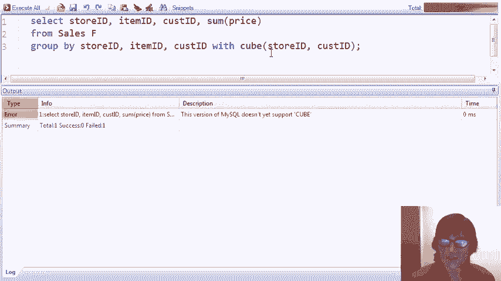

# 课程 P27：OLAP 演示教程 🧮

在本课程中，我们将通过一个具体的星型架构销售数据示例，演示联机分析处理（OLAP）的核心操作。我们将学习如何创建星型架构，执行不同类型的OLAP查询，并了解SQL中为OLAP新增的特定语法。

---

## 概述


我们将创建一个包含事实表和多个维度表的星型架构，用于分析销售数据。演示将涵盖星型连接、钻取、汇总、切片、切块等操作，并介绍SQL标准中的 `CUBE` 和 `ROLLUP` 操作。所有演示将使用MySQL数据库进行。

---


## 创建星型架构

首先，我们创建一个星型架构，它包含一个销售事实表和三个维度表：顾客表、商品表和商店表。


以下是创建这些表的SQL代码：

```sql
-- 创建顾客维度表
CREATE TABLE customers (
    customer_id INT PRIMARY KEY,
    name VARCHAR(50),
    gender CHAR(1),
    age INT
);

-- 创建商品维度表
CREATE TABLE items (
    item_id INT PRIMARY KEY,
    category VARCHAR(50),
    color VARCHAR(20)
);

-- 创建商店维度表
CREATE TABLE stores (
    store_id INT PRIMARY KEY,
    city VARCHAR(50),
    county VARCHAR(50),
    state VARCHAR(50)
);

-- 创建销售事实表
CREATE TABLE sales (
    sale_id INT PRIMARY KEY,
    store_id INT,
    item_id INT,
    customer_id INT,
    price DECIMAL(10, 2),
    FOREIGN KEY (store_id) REFERENCES stores(store_id),
    FOREIGN KEY (item_id) REFERENCES items(item_id),
    FOREIGN KEY (customer_id) REFERENCES customers(customer_id)
);
```

---

## 执行星型连接

星型连接是将事实表与所有维度表通过外键连接起来，以扩展每个销售记录的信息。

以下是执行完全星型连接的SQL查询：

```sql
SELECT *
FROM sales s
JOIN stores st ON s.store_id = st.store_id
JOIN items i ON s.item_id = i.item_id
JOIN customers c ON s.customer_id = c.customer_id;
```

这个查询会返回60个元组，每个元组对应事实表中的一行，并附加了来自维度表的详细信息。

---

## 在星型连接上添加约束

通常，我们不会进行完全的星型连接，而是会添加一些选择和投影操作来筛选数据。

以下查询将限制结果，只显示加利福尼亚州、T恤类别、年龄小于22岁且购买价格低于25的销售记录：

```sql
SELECT st.city, i.color, c.name, s.price
FROM sales s
JOIN stores st ON s.store_id = st.store_id
JOIN items i ON s.item_id = i.item_id
JOIN customers c ON s.customer_id = c.customer_id
WHERE st.state = 'California'
  AND i.category = 'T-shirt'
  AND c.age < 22
  AND s.price < 25;
```

运行此查询将返回符合所有条件的五笔销售记录。

---

## 分组与聚合分析

在OLAP应用中，常见的操作是对数据进行分组和聚合，以便进行分析。

### 按商店和顾客分组

以下查询按商店ID和顾客ID分组，计算每个组合的总销售额：

```sql
SELECT s.store_id, s.customer_id, SUM(s.price) AS total_sales
FROM sales s
GROUP BY s.store_id, s.customer_id;
```

此查询的结果显示了每个商店和顾客组合的总销售额。

### 钻取操作

钻取表示在已聚合的数据上添加更多细节。例如，我们可以将商品ID添加到分组中，以获得更详细的分析：

```sql
SELECT s.store_id, s.customer_id, s.item_id, SUM(s.price) AS total_sales
FROM sales s
GROUP BY s.store_id, s.customer_id, s.item_id;
```

运行此查询后，结果会变得更加详细，显示了按商店、顾客和商品细分的总销售额。


---

## 切片与切块操作

切片和切块是与数据立方体相关的操作，用于分析数据的特定部分。

### 切片操作

切片通过约束某一维度来分析数据立方体的一个切片。以下查询限制只分析华盛顿州的销售数据：

```sql
SELECT s.store_id, s.customer_id, s.item_id, SUM(s.price) AS total_sales
FROM sales s
JOIN stores st ON s.store_id = st.store_id
WHERE st.state = 'Washington'
GROUP BY s.store_id, s.customer_id, s.item_id;
```

此查询返回华盛顿州商店的销售数据，即数据立方体的一个切片。

### 切块操作

切块通过约束多个维度来分析数据立方体的一个块。以下查询限制分析华盛顿州购买的红色商品：


```sql
SELECT s.store_id, s.customer_id, s.item_id, SUM(s.price) AS total_sales
FROM sales s
JOIN stores st ON s.store_id = st.store_id
JOIN items i ON s.item_id = i.item_id
WHERE st.state = 'Washington'
  AND i.color = 'Red'
GROUP BY s.store_id, s.customer_id, s.item_id;
```

此查询返回华盛顿州红色商品的销售数据，即数据立方体的一个块。

---


## 汇总操作

汇总表示降低数据的细节层次，进行更多的聚合。例如，我们可以只按商品来汇总销售数据：

```sql
SELECT s.item_id, SUM(s.price) AS total_sales
FROM sales s
GROUP BY s.item_id;
```

此查询返回按商品汇总的总销售额，数据更加聚合。

---

## 基于维度属性的分组

除了按ID属性分组，我们还可以基于维度表中的有意义属性进行分组。以下查询按州和商品类别分组，计算总销售额：

```sql
SELECT st.state, i.category, SUM(s.price) AS total_sales
FROM sales s
JOIN stores st ON s.store_id = st.store_id
JOIN items i ON s.item_id = i.item_id
GROUP BY st.state, i.category;
```

此查询显示了不同州和商品类别的总销售额，例如加利福尼亚州和华盛顿州的夹克与T恤销量对比。

### 进一步钻取

我们可以在上述查询的基础上进一步钻取，例如添加县和性别属性：

```sql
SELECT st.state, st.county, i.category, c.gender, SUM(s.price) AS total_sales
FROM sales s
JOIN stores st ON s.store_id = st.store_id
JOIN items i ON s.item_id = i.item_id
JOIN customers c ON s.customer_id = c.customer_id
GROUP BY st.state, st.county, i.category, c.gender;
```

此查询提供了更详细的分析，例如按州、县、类别和性别细分的总销售额。

---

## SQL中的OLAP扩展：CUBE和ROLLUP

SQL标准为OLAP查询引入了 `CUBE` 和 `ROLLUP` 操作，用于生成数据立方体或进行层次化汇总。

### CUBE操作



`CUBE` 操作会生成数据立方体的所有可能组合。以下查询尝试使用 `CUBE`：


```sql
SELECT store_id, item_id, customer_id, SUM(price) AS total_sales
FROM sales
GROUP BY CUBE(store_id, item_id, customer_id);
```

然而，MySQL目前不支持 `CUBE` 操作。我们可以通过其他方式模拟其行为。


### 创建数据立方体表

我们可以将 `CUBE` 查询的结果存储在一个表中，以便后续高效查询：

```sql
CREATE TABLE cube AS
SELECT store_id, item_id, customer_id, SUM(price) AS total_price
FROM sales
GROUP BY store_id, item_id, customer_id WITH ROLLUP;
```

此表包含了数据立方体的预聚合数据，包括面、边和角的总和。


### 查询数据立方体

直接查询数据立方体表比查询原始事实表更高效。以下查询找出加利福尼亚州蓝色商品的总销售额：

```sql
SELECT SUM(c.total_price) AS total_sales
FROM cube c
JOIN stores st ON c.store_id = st.store_id
JOIN items i ON c.item_id = i.item_id
WHERE st.state = 'California'
  AND i.color = 'Blue'
  AND c.customer_id IS NULL;
```

此查询仅使用数据立方体表中的六个元组，就得到了总销售额为1365的结果。

### ROLLUP操作

`ROLLUP` 操作基于 `GROUP BY` 子句中属性的排序，生成层次化的汇总数据。以下查询按州、县和市进行分组，并使用 `ROLLUP`：

```sql
SELECT st.state, st.county, st.city, SUM(s.price) AS total_sales
FROM sales s
JOIN stores st ON s.store_id = st.store_id
GROUP BY st.state, st.county, st.city WITH ROLLUP;
```

此查询的结果显示了原始数据以及按县、州和总计的汇总数据，非常适合层次化维度的分析。

---

## 总结


在本课程中，我们一起学习了OLAP的核心概念和操作。我们创建了一个星型架构，并演示了星型连接、钻取、汇总、切片和切块等查询。我们还介绍了SQL中的 `CUBE` 和 `ROLLUP` 操作，展示了如何创建和查询数据立方体以提高分析效率。这些技术在处理大规模分析数据集时非常有用，能够显著提升查询性能。