# P28：DBClass办公时间 02_21_2013 - 哈库那玛塔塔i - BV1R4411u7dt

同学们，欢迎来到这一周的办公时间。我将制作这个视频，同时还会有一个视频介绍期中考试并解释一些较难问题的解答。但这个视频主要是帮助你们进行XML查询，因此我将像上次的办公时间一样操作。

办公时间，我将一起完成XML查询的额外练习题。实际上，我可能不会逐一完成每一个额外练习。

练习，因为各国有12个额外的练习题，我将做一些变化。我会做课程目录的额外练习，所有三个题目。做两道与各国有关的额外练习，然后做XSLT处理这两个国家和课程目录的数据。

额外练习集。所以首先我将开始进行课程目录XPath和XQuery的额外练习题。我们将开始第一个问题，它要求返回被列为语言学180的课程编号。作为一名已修过课程的斯坦福学生。

这门课我记得是CS124，但我可以展示如何在XPath中实现。所以这些练习都需要你们参考文档，你们只需要使用doccourses.xml。我们需要了解数据结构的一些细节，才能知道哪个课程是。

跨列为语言学180，所以我们快速看一下数据集。

让我看看能否更好地将其放入框架中。所以我们看到它是这样结构化的，首先是课程目录的根元素，然后是部门信息，再往下是每个课程的信息。

各个部门，我们想要了解哪里有先决条件信息。所以如果我们在这里查看，好的，CS124课程的描述字段下，我们看到有跨列的文本，列为Ling 180，这就是在这个数据集中，跨列课程的方式。

所以我们知道，我们需要返回课程编号，在这种情况下是CS124，该课程在描述中列出为Ling 180。如果我们回到文本框中查看，我们首先会看到。

需要找到一个课程，最终我们需要返回它的编号。如果你记得，编号是一个属性，而不是子元素，所以我们需要通过使用data@number来获取。因此，现在这将给我们返回每个课程的编号，因为这个双斜杠表示我们需要获取所有课程。

匹配数据中的任何课程元素，然后它将从那里导航并提取出编号。所以这其实不是我们想要的，我们想要的是在课程本身上做一些筛选，通常我们会这样做，即在方括号中进行筛选。如果我们记得正确的话，就是描述。

包含一些文本，即"cross-listed as Ling 180"，所以我们可以进行文本包含的操作。在XPath中，文本包含操作非常简单，你只需要使用contains，然后输入子元素，这里是描述（description），然后我们要查找的文本是"cross-listed as Ling 180"，如果没有任何拼写错误，这应该是。

正确，所以让我们快速检查一下。

很好，正确，它正确地返回了CS 124，太棒了。现在让我们。

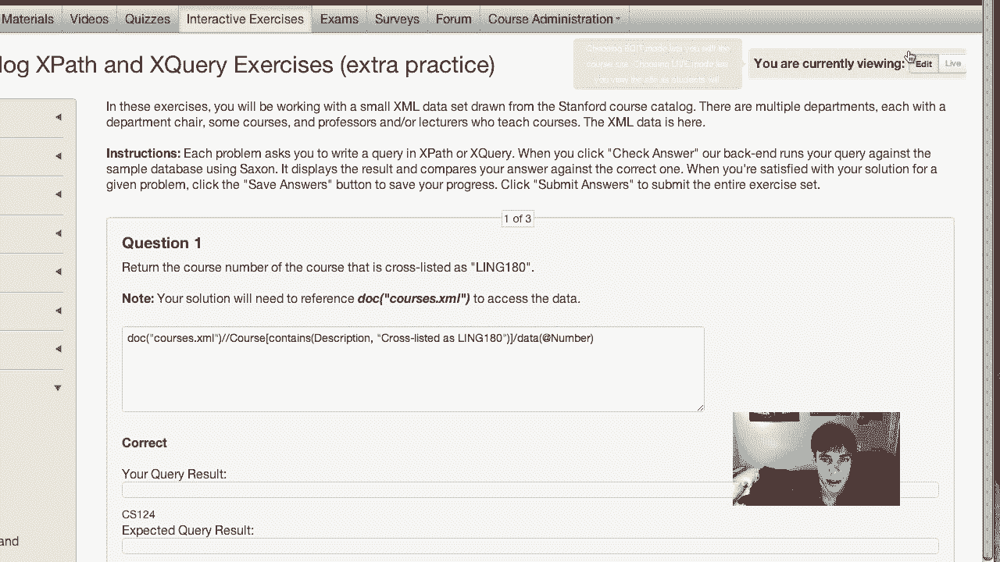

接下来是第二个问题，返回由名字是Daphne或Julie的讲师教授的课程编号。好的，所以我们再次需要从点（dot）课程开始。好的，所以再次强调，我们需要导航到课程，因为我们正在进行。

在课程上进行筛选，然后我们需要返回课程编号，所以这里的基本模式类似，我们在导航到课程并返回其编号，然后在课程内部，我们将进行更多的筛选，应该是课程而不是多个课程。好了，现在进入稍微复杂一点的部分，让我们来看看。

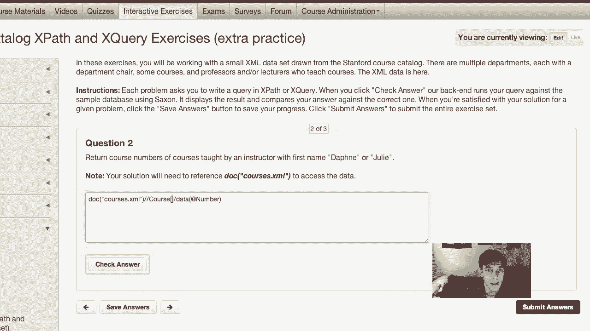

快速查看数据，看看名字如何出现。我们想要的是Daphne和Julie的名字，比如这是一个例子，Julie Zielinski是CS 107的讲师，我们看到在课程下面的讲师元素中，然后我们有讲座者和他们的名字。

讲座或讲师的姓氏，但并不是所有时候讲师就是讲座者，有时在数据中他们是教授，所以有时你会遇到讲师和教授，然后是他们的名字，在这个例子中是Maron Sahami。因此我们不仅仅想匹配讲师，也不希望。

只是匹配教授，但我们可以做的是我们可以导航到讲师的层级，然后匹配讲师的任何子元素。我们知道根据现有数据，讲师的任何子元素都会是讲座者或教授。你可以浏览数据来验证这一点。

如果我们匹配讲师，然后使用星号操作符作为通配符。

它将匹配讲师或教授，然后我们可以获取第一个名字。希望这样做能让这个过程更清晰一些。好的，我们已经导航到课程并且知道我们想要的是讲师。然后我声称我们可以使用这个通配符操作符，即星号（*）。

这样就能立即匹配到位于“instructors”下方的任何内容，在这个例子中是讲师或者教授，因此我们能得到这些，然后我们在讲师或教授上做些筛选，要求名字是Daphne或者Julie。好，假设没有任何拼写错误，这应该是对的。

做个演示，看看是否正确，我们得到了CS 107和CS 228，正如我们所期望的那样。

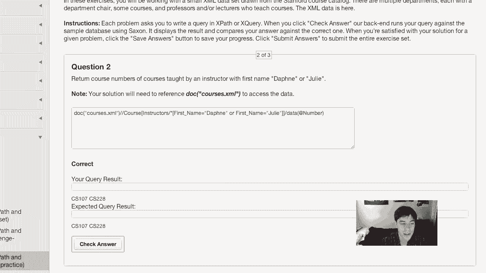

好的，现在让我们继续看一下第三个问题，返回同时拥有讲师和教授作为讲师的课程标题，并且每个标题只返回一次。好了，这实际上是一个我不会使用xpath的情况，相反，我会采取...

使用x-query表达式来实现这一点，所以返回所有课程的标题。在x-query中，我们需要引用这个文档，进行一种遍历操作，通常是对某个集合中的每个元素进行迭代，然后对其执行各种操作，所以在这种情况下，我们返回的是课程的标题。

其中有一些具体的要求，真正需要做的是查看课程元素，因此对于每个课程`$C`，我们在文档中导航到课程级别，这样就能创建一个循环，遍历数据中的所有课程元素，然后我们需要...

它们要求同时有讲师和教授作为讲师，所以你可以通过像`seed/instructor/lecturer`这样的表达式来判断是否有讲师作为讲师。如果该表达式非空，那么它将返回真值，你就知道存在讲师作为讲师。

讲师是其中一位讲师，因此我们可以通过`C/instructor/lecturer`来得到每一门包含讲师的课程，但我们也希望有教授作为讲师，因此我们可以将这两个条件拼接起来，使用`and`，并对教授进行相同的处理。

我们想要返回课程的标题，所以如果你还记得数据的话...

课程标题是课程的子元素，所以我们返回`C/title`，再一次...

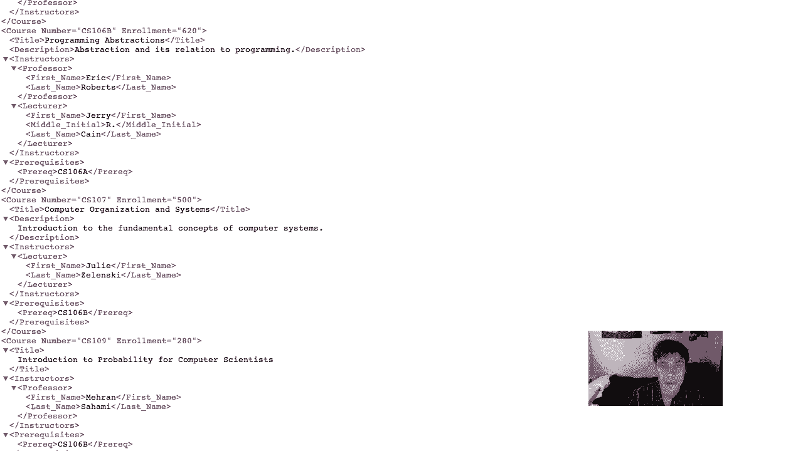

这是假设我没有犯任何拼写错误，看起来我...

结果正确，这样我们得到了两门课程：编程方法论和编程抽象。很好，希望这个...

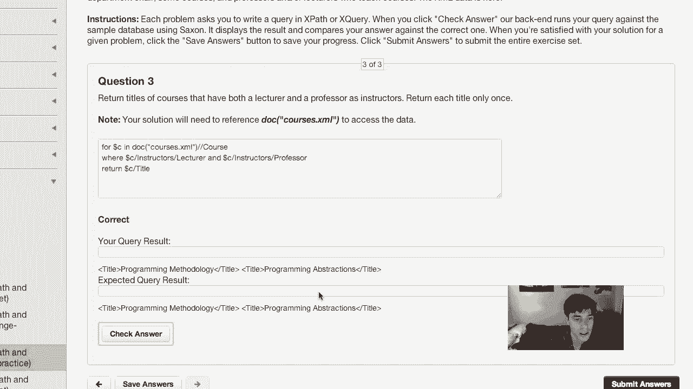

让你稍微熟悉一下课程目录数据集，并且稍微了解一下xpath和xquery的使用，接下来我将进入一些...

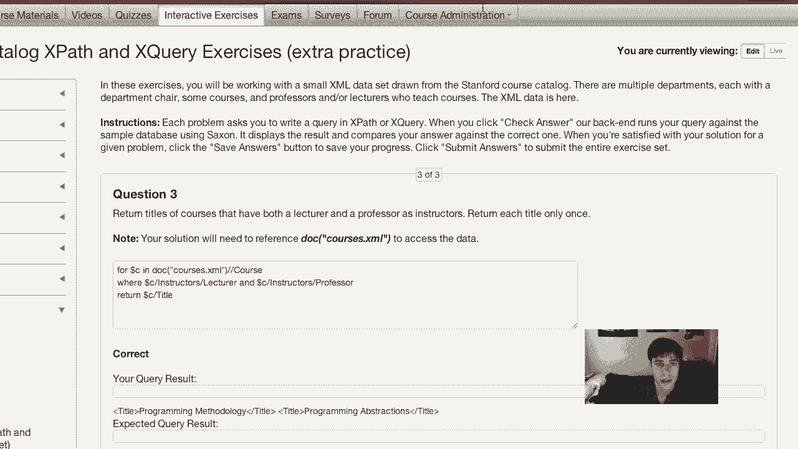

世界各国的额外练习题，因此我将做一些更具挑战性的题目，实际上，我将做这个集中的第 11 和第 12 题。稍微看一下这个数据集，它包含了一堆。

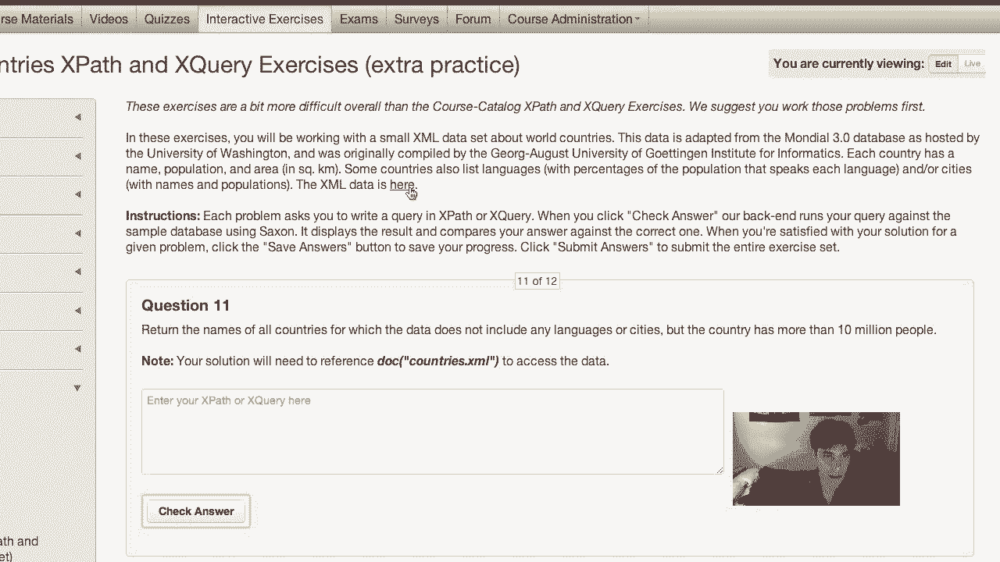

国家结构是 rudelmen 是国家，然后每个子元素是一个国家，拥有名称、人口、面积等属性，然后主要语言以及说这种语言的人口百分比作为属性，还可能包含该国家的城市列表，因此，第 11 题要求你。

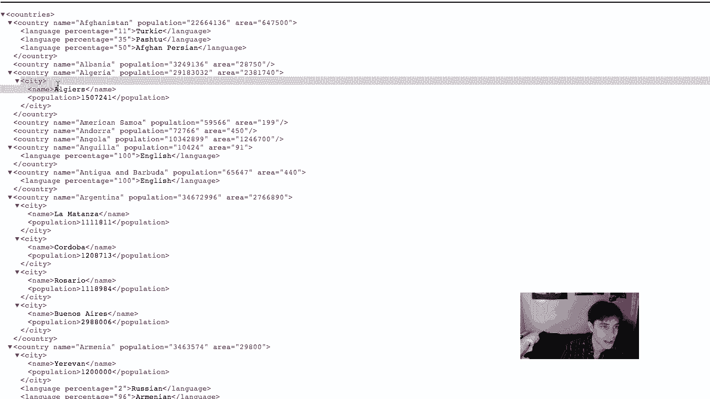

返回所有没有语言或城市数据，但人口超过 1000 万的国家的名称。好的，实际上我们可以完全通过 xpath 来实现这一点，再次需要引用文档，所以我就从那里开始。因此，我们希望返回国家的名称。

所以我们需要深入到国家级别，像我们之前做的那样查询 xpath。所以我们要返回国家的名称，因为如果你记得，名称是国家的一个属性，我们需要使用这个数据构造，所以国家斜杠数据的名称将给出国家的名称。

所以我们已经完成了这部分，现在我们只需要对这些国家进行筛选。好的，所以所有国家的数据中没有语言或城市数据，因此，如果你还记得，xpath 有这个 count 操作符，基本上你可以在任何地方使用它，它会给你。

带有该标签的元素数量，这样很方便。所以没有语言或城市数据，因此我们可以通过基于 count 语言等于零来进行过滤。这样，我们就能获得所有没有语言数据的国家，然后我们可以与之连接。

另外，我们不希望有城市数据，所以我们希望城市计数为零，并且希望国家人口超过 1000 万。因此，我们通过引用属性人口来实现这一点。所以我们希望人口大于 1000 万，然后我们就有了所有的条件，所有符合条件的国家。

没有语言、没有城市数据，但人口超过 1000 万，然后我们获取该国家的名称。让我们看看结果，哦，看来我有一个语法错误，让我看看这个问题出在哪里。

啊，看来我没有包括另一个人口数据，是的，你必须小心你的布尔逻辑运算符。所以语言计数等于零，城市计数等于零，而且人口大于 1000 万，太棒了，我们得到了。

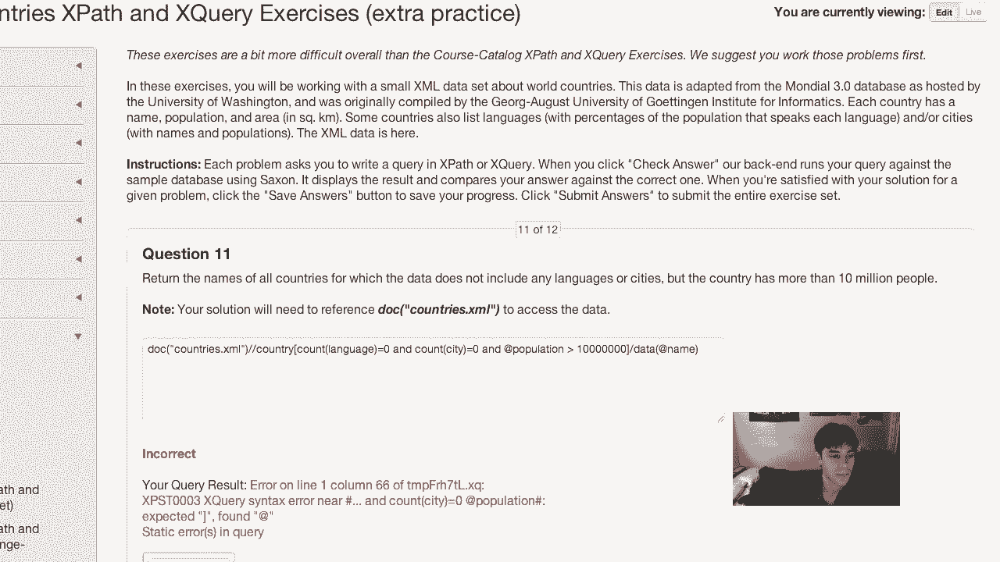

正确的国家就是这些，是的，就是这份国家列表，接下来。

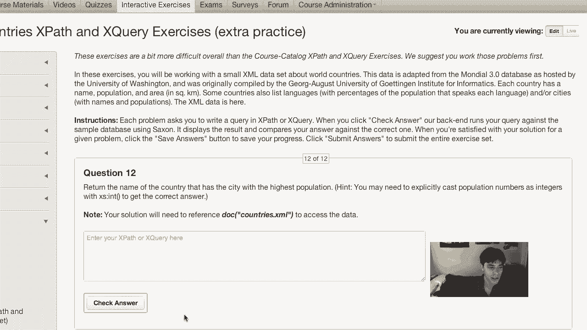

我们将要做的是第 12 题，这个查询需要一些相当复杂的 XQuery 操作，所以我们要返回那个拥有最大城市人口的国家的名称。我们要找的是拥有最大人口的城市，然后返回该城市所在的国家。

作为提示，你可能需要显式地将人口数字转换为整数，并加上额外的 int 才能得到正确的答案，因此我们将在有了主要逻辑之后再处理这个问题。无论如何，我们需要的是一个国家的名称，所以这密集的原因是基于基本的花式操作。

我们将要遍历文档中的每个国家，所以对于 countries.xml/country 中的所有国家，然后我们需要的是所有城市中人口最多的城市。因此我们在国家之间循环，然后可以在城市之间再做一次循环。

当前我们在循环中考虑的国家，所以对于每个城市，在 c/city 中，这将使我们遍历文档中每个国家的所有城市。现在我们有了这个城市，可以进行比较，看看它的人口是否高于其他每个城市的人口。

确实，我们要做的是将这个城市与数据库中的每个城市进行比较。如果它的人口少于其他城市的人口，我们就不返回它，最终我们将返回国家的名称。所以我们知道返回的数据将包括这个国家的名称。

这个国家的名称，所以我们将在筛选出并确认这个城市是所有城市中人口最多的之后返回该国家的名称。现在我们需要一个 where 子句，正如我刚才提到的，我们需要将这个城市与其他每个城市进行比较，所以我们将定义一个第二个城市。

与其他每个城市进行比较，所以如果你记得的话，XQuery 有一个 every 构造，允许你在 where 子句中遍历列表中的每个元素。这样在这里就非常方便了。所以我们做的是获取这个文档中的每一个城市，every 通常会跟随一个。

满足条件，所以这里的每个满足条件意味着这个循环中的每个元素都满足某个条件，我们现在将写出这个条件。我们希望是这样的：城市二的人口小于或等于城市一的人口，希望这个能让你理解，我们只是想确保这个条件成立。

进行逐个比较，并检查文档中每个城市二的总人口是否不超过城市一的人口，这样可以保证城市一是最大人口的城市。因此，使用额外 int 获取正确答案的提示将会发挥作用，所以我现在将检查这个答案。

它应该失败，因此在这种情况下，它会返回印度，而不是南韩。

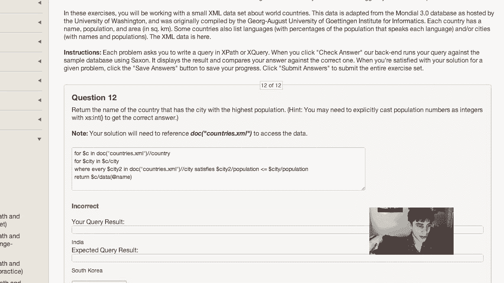

这有点搞笑，我觉得是因为它显式地做了这两个数字的字符串比较，但我们需要它做整数比较，所以才需要这个类型转换。实际上，我想我可以直接在这里做类型转换，两个城市的类型转换。

将人口数据转换为整数，然后我们应该能得到正确的结果，果然如此。

在这种情况下，我们正确地获取了韩国，所以太棒了，这就结束了额外的练习和练习题，我将要浏览的内容，现在开始。

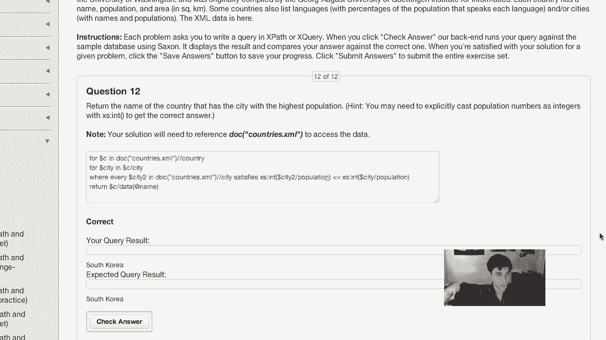

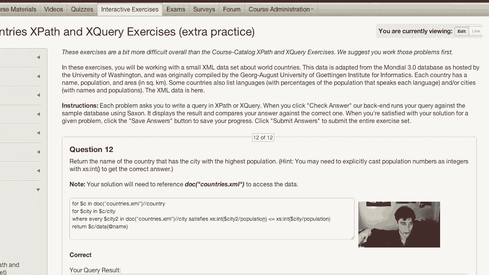

我要开始讲大家最喜欢的部分，那就是XSLT和额外练习。

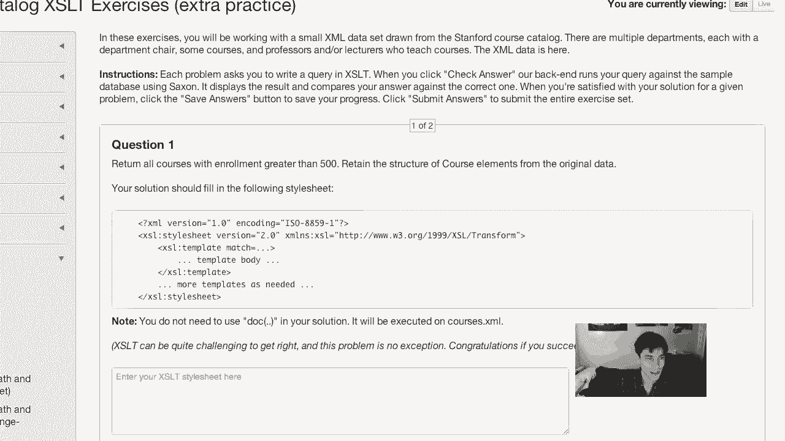

XSLT的练习真的很有挑战性，要做对很难，它的语法比较复杂，所以我们要深入学习，运用Jennifer在讲座视频中教的内容帮助我们，特别是这些额外的练习题。所以我们从课程的额外练习题开始，使用和之前完全相同的数据集，我们只是在用不同的语言写查询。

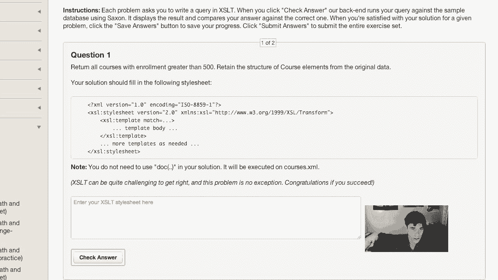

第一个问题还是关于课程目录，要求返回所有入学人数大于500的课程，并保留原始数据中的课程元素结构。好了，有一件好事是。

他们确实给了我们一个模板样式表，所以你的解决方案应该填充以下样式表，然后，哎呀，我们只需要复制并粘贴它。

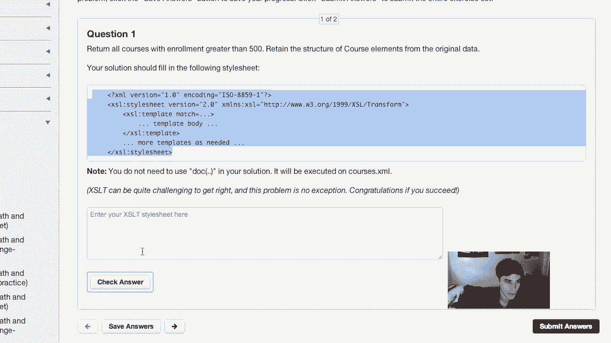

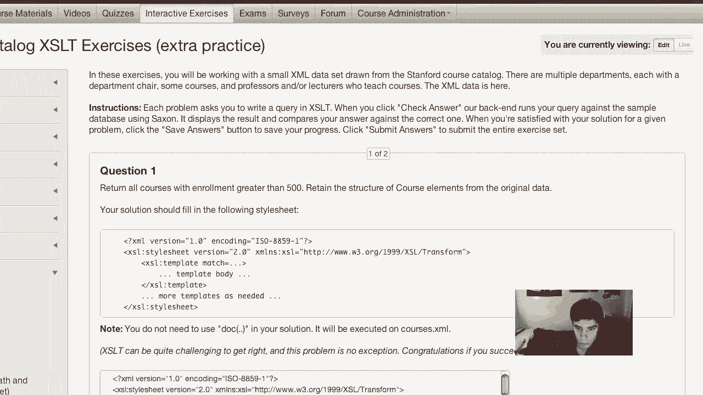

作为一个很好的起点，所有入学人数大于500的课程查询其实在XPath中非常简单，如果我们记得的话。如果你回想一下视频内容，我们有样式表，然后是模板。所以我们只需要匹配入学人数大于500的课程。

超过500，所以这里非常直接，我们只需要通过做一个XSL模板匹配`equals course`，就能匹配任何课程元素。这样就会匹配每个课程，然后我们可以在这里嵌入XPath，就像我们在XPath练习中做的那样，我们可以做`enrollment greater than 500`。

然后我们需要做一些其他匹配，所以它说保留原始数据中课程元素的结构。如果你还记得讲座的内容，你可以通过简单地复制这个精确的课程元素来做到这一点，你可以通过XSL `copy of` 和 `select equals dot` 来实现，`dot`是当前元素。

结果发现这就是整个查询，所以没有其他的了。

需要更多的模板，但这里不需要更多的模板，所以我们只需要这个模板就行。我们已经匹配了所有注册人数大于500的课程，并复制了它们的精确元素，然后我们关闭模板。让我们检查一下答案，哦，那是错误的，快速检查一下原因。好吧，所以。

我们在这里得到了很多垃圾数据，这实际上是一个预期的错误区域。我们只是从未匹配到的元素中提取所有文本。如果没有明确匹配它，它就会被输出。所以所有的文本都会被输出。如果没有匹配条件，所有的内容都会被打印出来，Jennifer在视频中讨论过这一点，且已经有了一个。

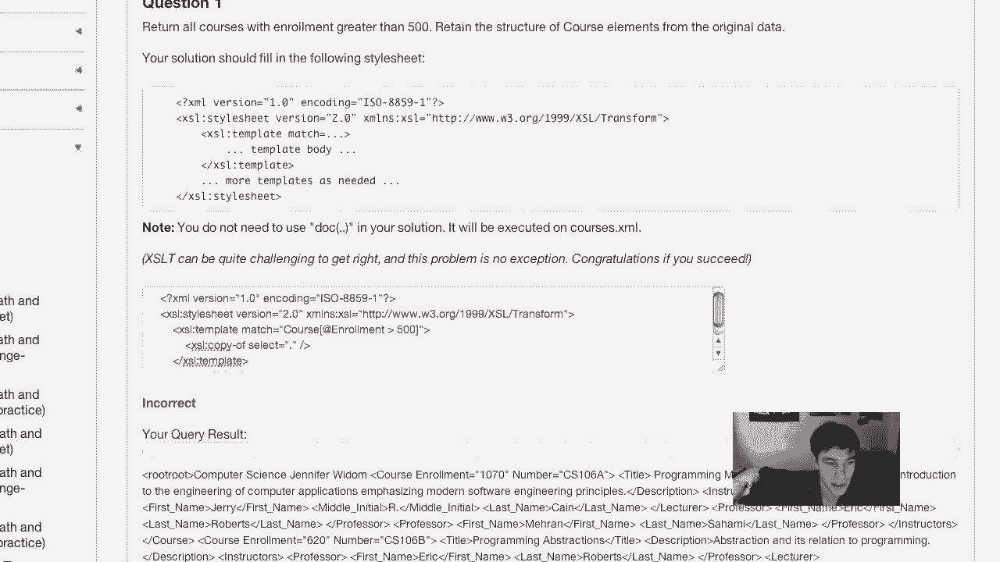

解决方法是，我们确实需要一个额外的模板，在这里，我们只需要匹配文本。所以你可以通过匹配文本的方式来做，接着关闭那个元素。我们不想复制它，只是想匹配它并且不做任何处理。现在让我们看看结果，看看是否正确。

正如你所看到的，我们只得到了所有注册人数超过500的课程。对于这种结果的显示方式没有缩进，我为此感到抱歉，确实不太易读。对此表示抱歉，但没关系，很酷。

这应该能给你一个关于如何返回课程的精确结构的概念。然后你只需匹配所有文本，并且不做任何处理，很酷。那么我们继续，接下来从数据中删除所有**注册人数大于60**或没有列出注册人数的课程。

数据的结构应该保持一致。好吧，所以我们再次从模板开始，我们希望保持数据结构的一致性。

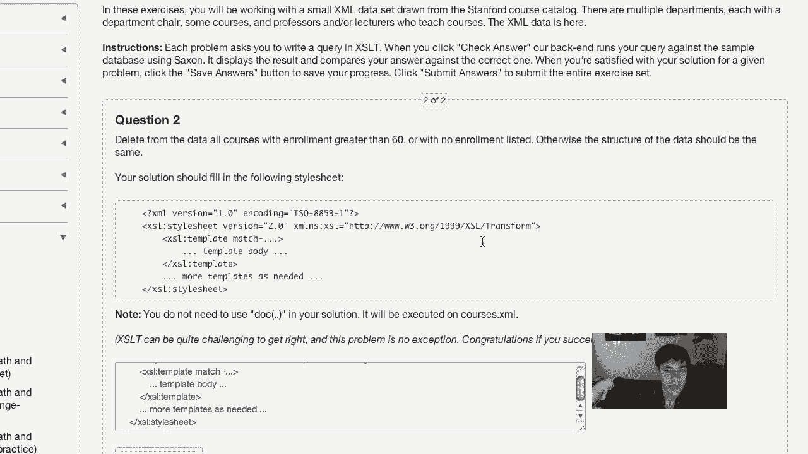

如前所述，如果我们回忆一下，这意味着我们仍然希望保留这个**根元素课程目录**，然后列出所有的部门及其所有课程，保持同样的方式。因此，如果你记得，保持数据结构的一致性是最有效的方式。

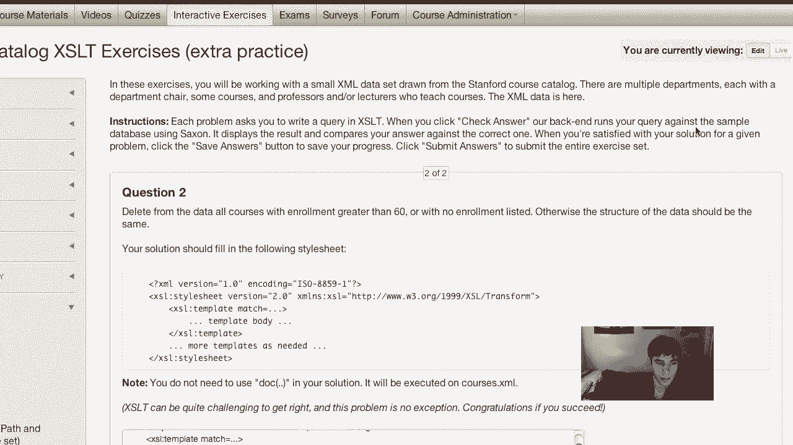

整体数据的结构就是要匹配所有内容并。

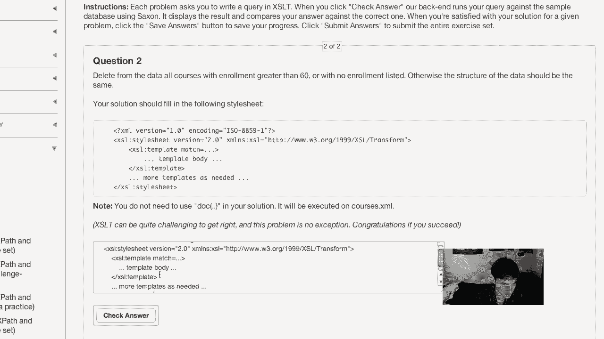

然后删除你需要删除的内容。所以，问题又回到了那个看起来有些复杂的正则表达式，Jennifer在讲座视频中讲解过这个表达式，它是`match star bar at star or text`，这个正则表达式会匹配XML中的所有内容。接着，我们应用这个模板。

这正是詹妮弗在讲座中所做的，保留数据的结构并只删除特定内容，我们就在一个复制语句中做了这个操作。在这个复制语句中，我们应用了模板，[ silence ]。到目前为止，我们所做的就是将整个数据集匹配并复制到结果中。

让我把这个框框稍微放大一点，以便更容易阅读。詹妮弗在讲座中讲解了这个过程。所以它会匹配所有内容并复制到结果中。接下来我们需要做的是匹配那些注册人数大于60或没有列出注册人数的课程，并将它们从数据集中删除。所以这部分其实很简单，我们可以通过一个简单的 x-path 表达式来实现。

所以我们将匹配所需的内容，然后什么都不做。我们就这样关闭它。回想一下，我们可以直接进入课程，就像在之前的某个问题中一样，我们会访问注册人数字段。所以我们想要的是注册人数大于60，或者如果没有列出注册人数。我们通过之前的方式来实现，在这个元素下列出的注册人数计数为0。

呼，虽然这很复杂，但希望能理解我们已经复制了所有内容，然后匹配那些注册人数大于60或没有列出注册人数的课程，这些课程是我们想要删除的。所以在复制完所有内容后，我们只匹配这些课程，并且对它们不做任何操作。

所以这应该可以把它们从数据中移除，让我们看看这个方法如何运作。

好吧，看起来我遇到了一个错误。所以 XSL 复制元素必须由匹配的结束标签结束。好的，看起来这里有个问题。我认为这可能只是一个简单的空格错误。所以是的。现在发生了一些有趣的事情。

所以我得到了一个结果，但它并不完全正确，我正在尝试找出问题出在哪里。

好的，我相信发生的情况是……

嗯，现在这个有点神秘。啊，我明白发生了什么了。所以我没有返回结果。我正在返回没有列出注册人数的课程，这是我之前的错误。我在“注册人数计数等于零”上用了复数形式，而应该用“注册人数”。所以我只需要去掉那个 S，这样应该就没问题了。

可能不是。正如我们所说，X 查询表达式很难写对。问题就在这里。我试图做的是注册人数大于60并且注册人数计数等于零。这应该是一个“或”条件。希望这样能让你理解为什么。我们希望删除的是注册人数大于60的课程，或者是没有列出注册人数的课程。

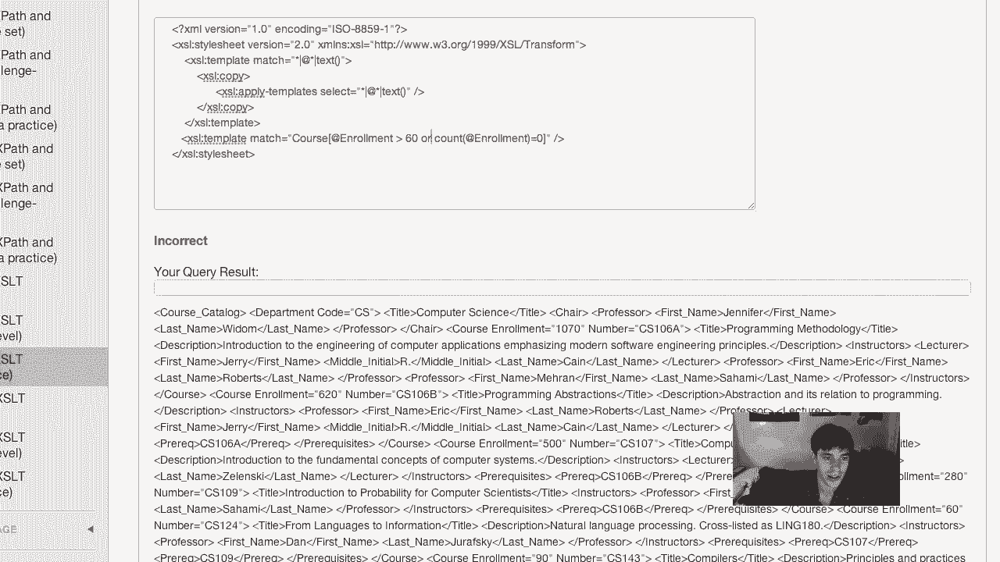

因为否则它会返回所有内容。最后我们得到了正确的结果。所以一些要点。第一，XSLT中语法的正确性确实很难掌握。我们在`copy`结束标签前有多余的空格，这会导致语法错误。所以你需要确保没有空格。然后就像是这里多了一个“S”这种小的拼写错误也会导致查询错误。

然后你还得考虑标准的布尔逻辑。所以在这里用and而不是or就是一个问题。

所以希望这能作为一个有指导意义的例子，现在一切都能理解了。

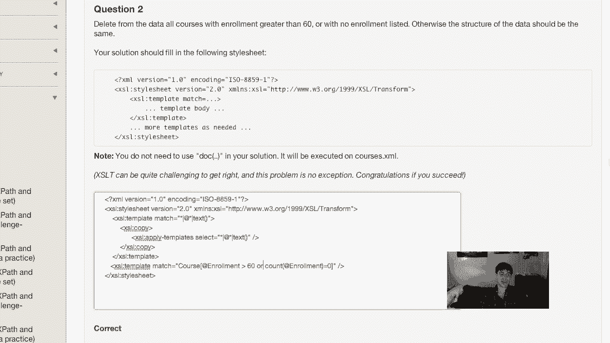

还有一个问题。

所以这是世界各国XSLT额外练习，我们想从数据中移除所有面积大于40,000的国家。

而且所有没有列出城市的国家。否则数据结构应该是一样的。好吧，实际上这和我们之前做的课程目录问题非常相似。

所以我将直接复制那个答案过来。

所以我们看到，我们想从数据中移除所有面积大于40,000或没有列出城市的国家。

所以这完全就像我们这里所做的一样。

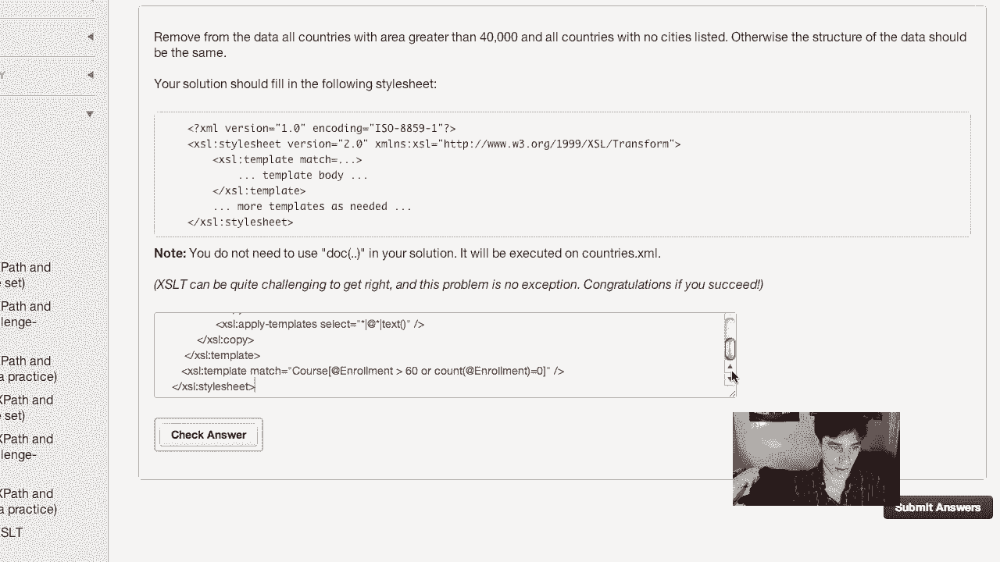

所以这挺好的。我们有适用于所有数据集的匹配模板，它无论数据集如何都能正常工作。然后我们只需要这一行特定于课程目录。所以我们可以把“course”改为“country”，把“enrollment population”改为“greater than 40,000”。

而不是`count enrollment equals zero`，我们想要的是`count of city sub elements`等于零。这样就对了。好吧，这个不正确。出问题了。哦，没错，我们想要的是区域大于40,000，而不是人口大于40,000。所以现在是完美的。

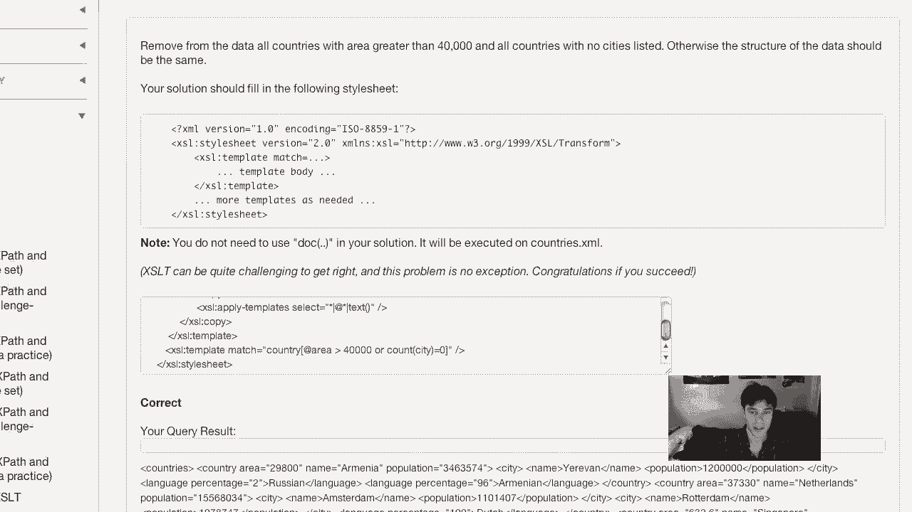

好的，我们看到这个问题几乎和我们上次做的完全一样。

所以这应该能让你对一些XSLT以及其中涉及的获取查询正确的复杂性有个不错的了解。

希望你们在这个环节中学到了东西。我现在要下线了。感谢大家观看。我希望这个视频对你们有帮助。我很快会发布关于期中问题的视频。谢谢。

