# P28：DBClass Office Hours 02_21_2013 - 哈库那玛塔塔i - BV1R4411u7dt

 Hello students， welcome to Office Hours for the Week。 So I will be doing this。 video and also a video which goes through the midterm exam and explains the。 solutions to some of the trickier problems。 But this video is just to help。 you with XML querying and so what I'm going to do is much like my last office。

 hours I'm going to go through the extra practice exercises for XML querying。 Actually I'm probably not going to go through every single extra practice。

 exercise because the world countries have 12 extra practice exercises so I'm。 going to get some variety。 I'm going to do the course catalog extra practice all， three of them。 Two of the world countries extra practice exercises and then I'm。 going to do the XSLT for both countries and and the course catalog and that's。

 the extra practice set。 So first I'm just going to get started with the course。 catalog X path and X query extra practice exercises and so we'll get started with。 the first question which just asks you to return the course number of the course。 that is cross-listed as linguistics 180 and so as a Stanford student who's taken。

 this course I remember that it's CS124 but I can show you how to do this， in in X path。 So all of these exercises are going to require you to refer to the。 document and so you just do that with doccourses。xml and so we need to find。 out a little bit more about the structure of the data to know which course is。

 cross-listed as linguistics 180 so let's just take a quick look at the data set。 So。

 let me see if I can get this in frame better。 So we see that it's structured。 like this where we have a course catalog root element and then the。 department information and then information on the courses for each of。

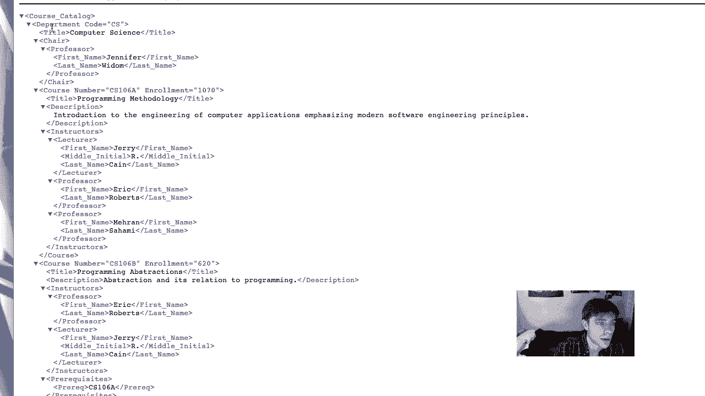

 the departments and so we want to find out where we have pre-requisite。 information and so actually if we look in here okay CS124 within the。 description field underneath that course we see that we have the text cross-listed。 as Ling 180 and so that's how cross-listed courses happen in this， dataset。

 So we know that we need to return the course number which in this case is。 CS124 of a course that just has it in its description cross-listed as Ling 180。 and so if we go back to our text box here so we see first that we're going to。

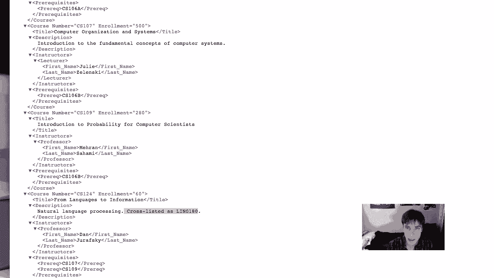

 need a course and eventually we're going to need to return its number and if you。 remember the number was an attribute and not a child so we have to do that by。 doing data at number and so right now this will just give us the course numbers。 of every course because this double slash will just double slash course will。

 match any element in the data which is a course and then it will just navigate。 from there and pull out the number。 So that's not really what we want we want to。 do some filtering on the course itself and so what we typically do is do that。 inside of brackets like this and if we remember it's that the description。

 contains some text namely cross-listed as Ling 180 and so we can do that text。 containment is really simple in XPath you just do contains and then you do what。 the child element from here is so it's description and then the text that we。 were after was cross-listed as Ling 180 and barring any typos this should be。

 correct so let's just check it out real quick。

 All right great it's correct it correctly returns to us CS 124 so awesome。 Now let's。

 move on to question two so return numbers of courses taught by an。 instructor with first name Daphne or Julie。 All right and so once once again。 we're going to need to start off with this dot courses。 Okay and so again we need。 we need to navigate down to courses as we can tell since we're doing our。

 filtering on courses and then we need to return course numbers so it's sort of。 the same basic paradigm here where we are navigating to a course and returning。 its number and then within the course we'll do some more filtering that should be。 course not courses。 Okay so now is a little bit more tricky part so let's take a。

 quick look at the data and to see how first names happen。 So we want first names。 of Julie and Daphne so like this is an example where Julie Zielinski is the。 instructor for CS 107 and so we see that underneath course it's under the。 instructors element and then we have lecturer and then the first name of the。

 lecture or the last name of the lecture but it's not always the case that the。 instructors the lecturer sometimes in the data they're a professor so sometimes。 you have instructors professor and then their first name in this case。 Maron's Sahami and so we don't want to just match lecturers nor do we want to。

 just match professors but what we can do is we can navigate down to the。 instructor's level and then match any child of instructors we do know that any。 child of instructors will either be a lecturer or a professor based on the data。 we have here and you can just go through the data to convince yourself of that so。

 if we match instructors and then use the star operator the wildcard operator then。

 it will match either lecturer or professor and then we can get the first。 name and so hopefully this is a little bit clearer when I actually do this。 okay so we've navigated down to our course and we know that we want instructors and。 then I claim that we can just use this wildcard operator which is the asterisk。

 and that will match anything immediately below instructors which in this case is。 either lecturer or professor and so that will get us that and then we do some。 filtering on either lecture or professor we need first name equal to Daphne or。 first name is equal to Julie all right so again borrowing any typos this should。

 do the trick and let's see great correct so we get CS 107 and CS 228 just as we。

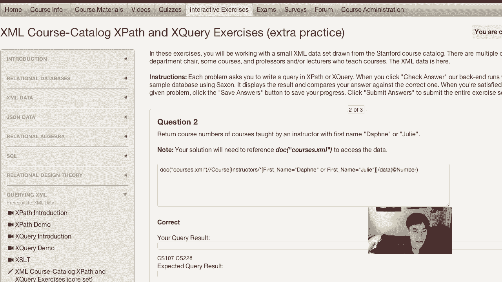

 want okay so now let's move on and take a look at question three okay return the。 titles of courses that have both a lecture and a professor as instructors。 and return each title only once okay so this is actually a case where I'm not。 going to do this in in expat what I'm going to do instead is is is go for an。

 x-query expression to do this and so return all titles of courses so in x-query。 so we are going to want to refer to this document in x-query the sort of。 iteration that we tend to do is for each element in some set and then you do。 various operations on it so in this case we're returning titles of courses that。

 that have some some specifications and so what we really want to be doing is。 looking at course elements and so for each course dollar sign C in our。 document navigating it down to the course level and this will create a loop。 which will just go across all course elements in the data and then we want。

 them to have both a lecture and a professor as instructors and so the way。 that you can tell that there's a lecture as an instructor is just with an。 expression like seed slash instructor slash lecturer if that expression is is。 non-empty then it will evaluate to true and so you will know that there is a。

 lecture as one of the instructors and so we can actually do where C slash。 instructor slash lecturer and that will get us every course where there's a。 lecturer's instructor but we also want a professor as an instructor and so we can。 just concatenate this and do an and and do the same thing with professor and then。

 we want to return the title of the course and so if you will recall from the data。

 title is just a child of course and so we then return C slash title and again。

 this is assuming I haven't made any typographical errors and looks like I。

 haven't so we get the correct result and in this case we get two courses。 programming methodology and programming abstractions great so hopefully that。

 gets you a little bit of familiarity with the course catalog data set and a little。 bit of familiarity with xpath and xquery so next I'm going to move on to some。

 world countries extra practice exercises and so I'm going to be doing some of the。 more challenging ones actually I'm going to be doing numbers 11 and 12 out of this。 set and so just to do a quick look at this data set so this has a bunch of。

 countries the rudelmen is countries and then each child is a country which has。 name population area as attributes and then the major language is along with the。 percentage of people who speak that language as attributes and then also。 possibly a list of cities for that country and so this question number 11 asks you。

 to return the names of all countries for which the data does not include any。 languages or cities but the country has more than 10 million people okay so。 actually we can do this entirely in xpath and again we need to refer to the。 document so I'll just start off with that and so we want to be returning the name。

 of countries so we go down to the country level and much much much as the xpath。 query so we were doing before we're going to be returning the name of the。 country since if you remember name is an attribute of country we need to use。 this data construct so country slash data of of at name will give you the name。

 of all countries and so we have that part done and then we just need to do our。 filtering on the countries okay so all countries for which the data does not。 include any languages or cities and so if you'll recall xpath has this count。 operator which basically you can pass in at any any point and it will give you。

 the number of elements with with that tag at the level so that's pretty。 convenient here so no data on languages or cities so we can just do a filter。 based on count language equals zero and so that'll give us all of the countries。 with with no data on languages and then we can just concatenate with and so we。

 also don't want any data on cities so we want count city to be zero and we also。 want the country to have more than 10 million people and so we do that by。 referring to the attribute population and so we want population greater than 10。 million and then we have all of our conditions we have all countries with。

 no languages no cities but greater than 10 million population and then we take。 the name of that country so let's see what we get oh looks like I have a syntax。 error here let me look at what this problem is。

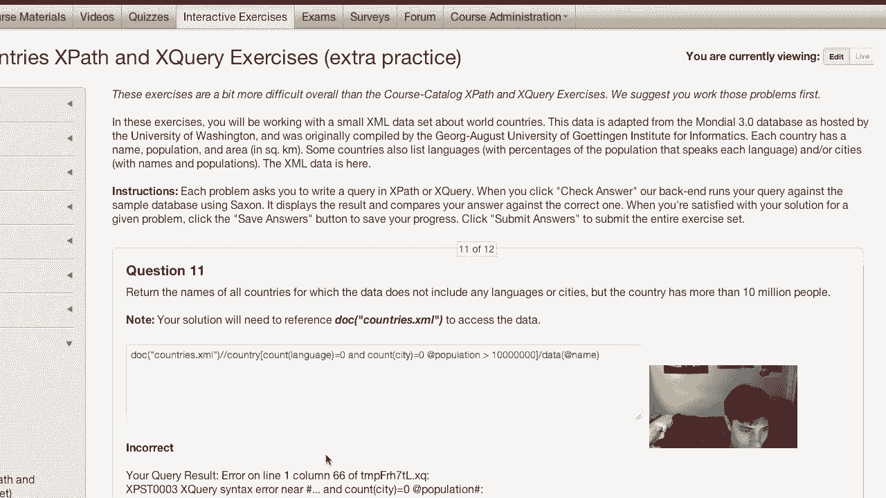

 ah looks like I didn't include another and her population yeah you got to be。 careful with your boolean logic operators so count language equals zero and count。 city equals zero and population is greater than 10 million great we get the。

 correct countries which is just this yeah just this list of countries and next。

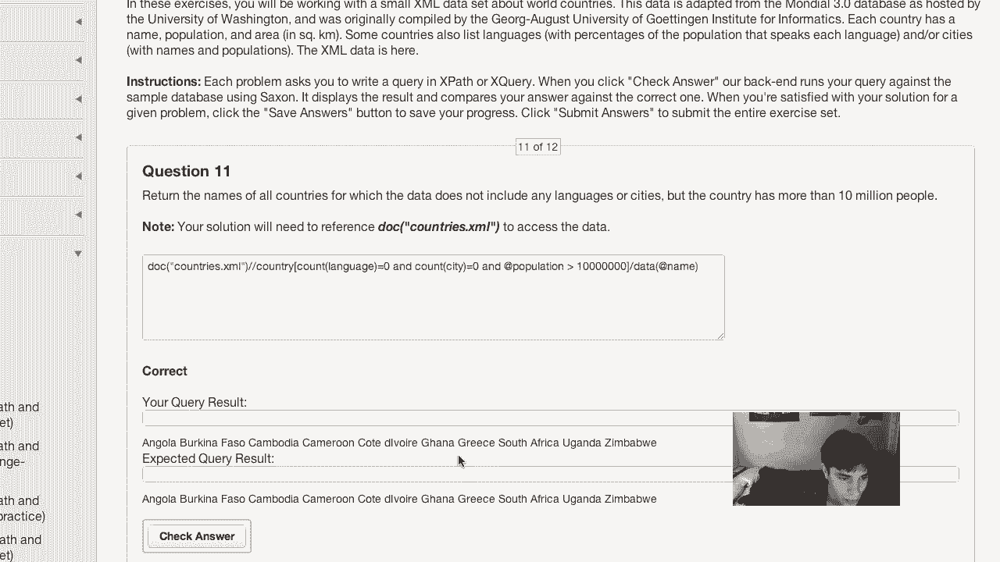

 we're going to be doing question 12 and so this is a query that requires some。 fairly intricate x-query operations so return the name of the country。 that has the city with the highest population out of any city so we want the。 city with the maximum population we want to return the country that that city is。

 in and as a hint you may need to explicitly cast population numbers as。 integers with excess int to get the correct answer so we'll deal with that。 after we have like the main logic of this setup but anyway we want the name。 of a country so it's dense reason following basic flower operations that。

 we're going to want to loop through every country in the document so for all。 countries in countries。xml/country and then we want the city that。 has the highest population of all cities in any country so we have this loop。 around the countries and then we can do another loop just around the cities in。

 in this country that we're currently considering in the loop so for city in。 c/city so this will loop us across every city in every country in the。 document and so now that we have this city here we can just do a comparison and see。 if its population is higher than the population for every other city and so。

 indeed what we're going to want to do is compare this city to every city in in。 the database and we don't want to return it if its population is less than some。 other population but ultimately we're going to be returning the name of the。 country so we know that we're going to have returns the c/data of so the name the。

 name of the country so we're going to be returning this country's name once once。 we filter out and decide that this city has the highest population of every。 city so now we need our where statement and so as I was saying a bit earlier we。 need to compare this city to every other city so we'll make up a second city。

 to every other city and so if you recall XQuery has this every construct where you。 can basically loop across everything in a list from within the where statement so。 it's convenient in this case so so what we've done here is we've just gotten。 every every city in in this document and every tends to come along with a。

 satisfies and so where every satisfies just means that every everything in this。 loop satisfies some condition and we're going to type out that condition now。 and so we want we want it to be the case that city to's population is less than。 or equal to cities population so hopefully that makes sense we're just。

 doing a point wise comparison and checking that for every city to in the document。 city to's population is at most cities population and so that guarantees that。 city is the max and so this hint about using excess int to get the correct。 answer is about to come into play so I'm actually going to check this answer and。

 it should fail and so it gives in this case India instead of South Korea and so。

 it's it's kind of funny I think it's because it's it explicitly does a string。 comparison between these two populations but we need it to be an integer。 comparison and so that's why this typing is needed so we just do a typecast。 actually I guess I can just do it there a typecast of both of these cities。

 population to integers and then we should get the correct result and we do and so。

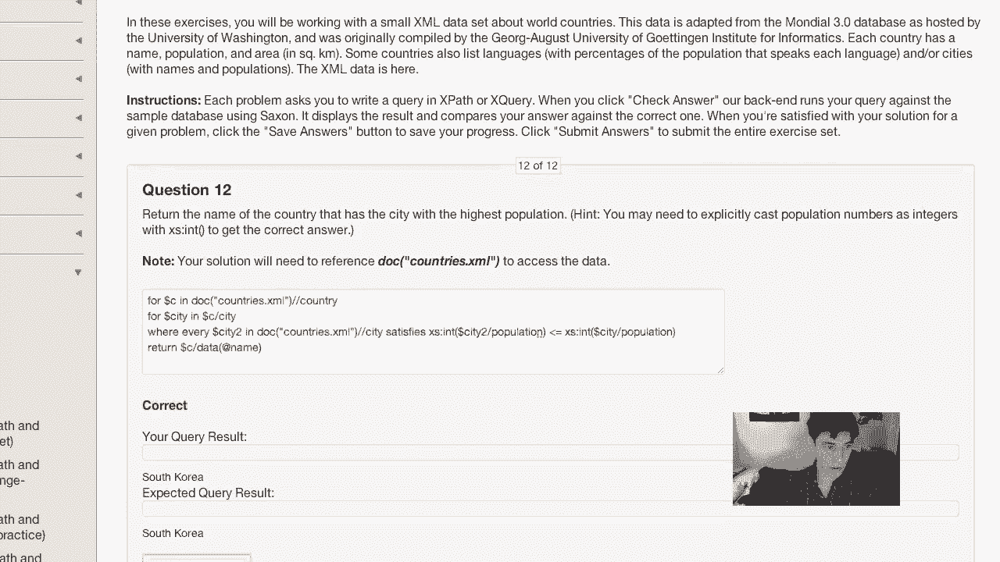

 in this case we get South Korea correctly so awesome so that wraps up the。 extra practice expat and exquary exercises that I'm going to run over and so now。

 I'm going to get on to everyone's favorite which is XSLT X extra practice。

 exercises so XSLT is pretty challenging to get right it's really syntax heavy so。 what is sort of dive into it and use some of the lessons that Jennifer taught in。 the lecture videos to help us along the way and so these extra practice。 exercises so we're starting up with the courses extra practice exercises use。

 exactly the same data set as before we just are writing the queries in a。 different language and so this first question is just again on the course。 catalog to return all courses with enrollment greater than 500 and to retain。 the structure of course elements from the original data okay so one nice thing is。

 that they do give us a template style sheet here and so your solution should。 fill in the following style sheet and so whoops we will just copy and paste that。

 in as a good starting point and so all courses with enrollment greater than。 500 so that's a query that's really easy to do in XPath if we remember and so if。 you recall from the video so we have like our style sheet and then a template and。 so we're just going to want to be matching courses with enrollment greater。

 than 500 and so that's pretty straightforward here we can match any。 course element just by doing a XSL template match equals course and so that。 will match every course and then we can embed X XPath in here and just as we。 would have done in the X XPath exercises we can do enrollment greater than 500 and。

 then we need to do some other matching and so it says retain this structure of。 course elements from the original data and so if you'll recall from the lecture。 the way that you do that is by just copying this exact course element which。 you do by XSL copy of and select equals dot where dot is the current element and。

 it turns out that that that is the entire query in this case so there is。

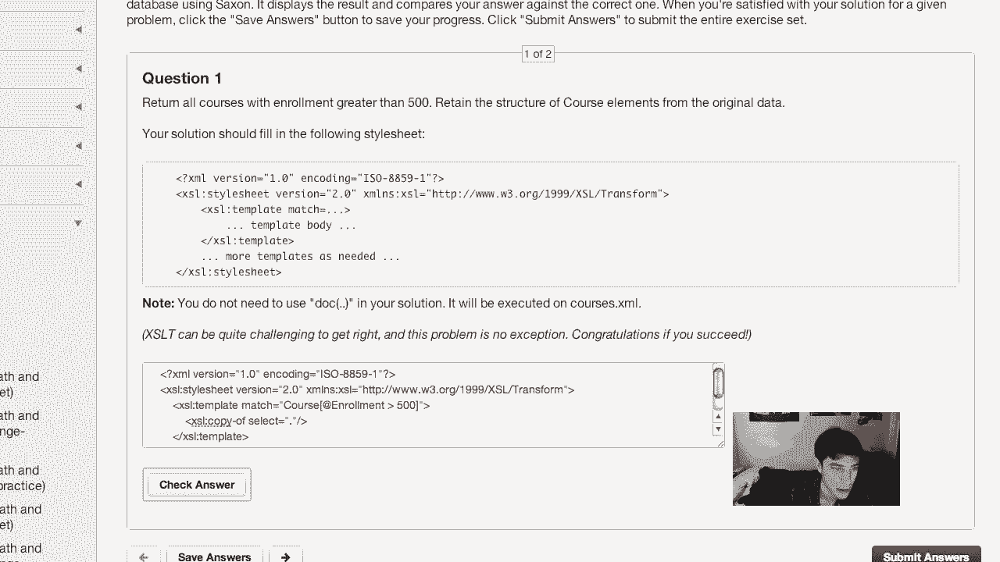

 more templates is needed but we don't need any more templates here so we should。 be good with just this we've matched all courses with enrollment greater than 500。 and we copied their exact element and then we close off the template and let's。 check that answer oh that was incorrect let's do a quick check of why okay so。

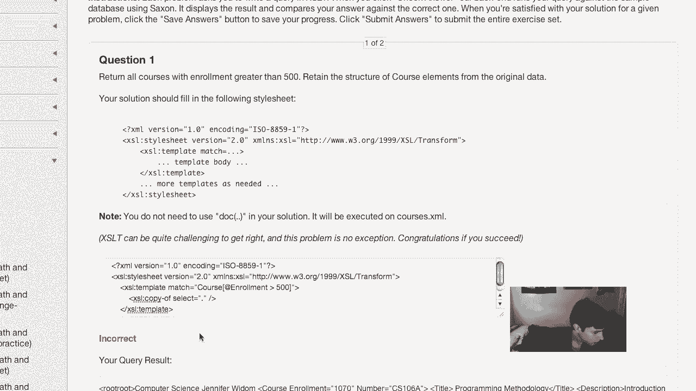

 we're getting a lot of junk in here and this actually was an expected area error。 where we're just getting all of this text from elements that didn't match。 anything so just all of all of the text gets spit out if you don't。 explicitly match it and Jennifer did discuss this in the video and there is a。

 workaround so we actually do need another template here so we need just to match。 text and so the way you do that is you just match text like that and then we can。 close off that element we don't want to copy it we just want to match it and do。 nothing with it and now let's see how we do now we get the correct result and。

 you can see we just get all of these courses with enrollments that are greater。 than 500 and I apologize for the lack of readability in the way that this result。 is displayed there's like no indentation or anything I'm sorry about that so cool。

 that should give you an idea where you return the exact structure of a course。 element and then you just match all of the text and do nothing with it cool and。 so let's just move on to the next so delete from the data all courses with。 enrollment greater than 60 or with no enrollment listed and otherwise the。

 structure of the data should be the same and okay so we'll again start off with。 our template and so we want to keep keep the structure of the data the same as。

 before so if we'll recall that just means that we we still want to like have this。 root element course catalog and then the departments and all their courses listed。 in in this same way and so if you remember the best way to retain the。

 structure of the overall data like that is to match absolutely everything and。

 then delete what you need to delete so it's it's it comes back to that kind of。 tricky looking regular expression that Jennifer went over in the lecture video。 where you do this match star bar at star or text and so that will match。 everything in in the XML and what we do with that is we then apply that template。

 so this is exactly what Jennifer did in lecture to retain this the structure of。 data and just remove certain things and so we do that inside of a copy。 and inside of this copy statement we apply template， [ silence ]。 And so what we've done so far is we have matched and copied the entire dataset into our result。

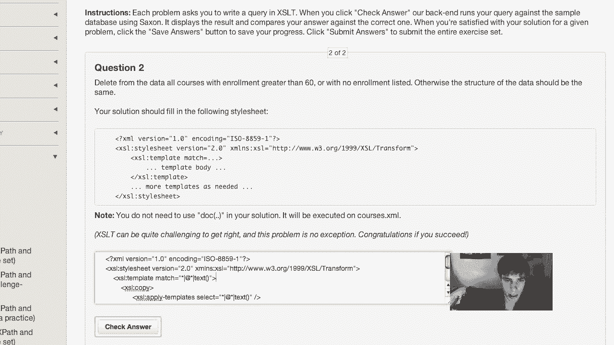

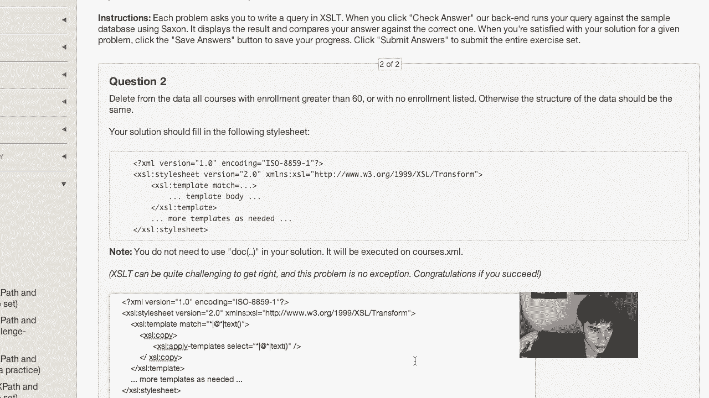

 And let me just make this box a little bit bigger for readability。 And Jennifer went over how that works in lecture。 So that just matches everything and copies it to the result。 And then what we need to do is match our courses with enrollment greater than 60 or no enrollment listed and delete them from the dataset。 And so this is actually the easy part where we can just do this with a simple x-path expression。

 And so we'll match what we need and then just do nothing with it。 We'll just close it off。 And so recall we can just go to course and much， much like in one of the previous problems we will be accessing the enrollment field。 So we want enrollment greater than 60 or if no enrollment listed。 And so we do that the same way as we did previously where we want the count of the number of enrollments listed underneath this element to equal 0。

 Phew， so I know that that's a lot but hopefully it makes sense where we've copied everything and then just matched these courses with enrollment greater than 60 or no enrollment listed which we wanted to delete。 So we just after we've copied everything we matched these and just do nothing with them。

 And so that should remove them from the data and let's see how this works out。

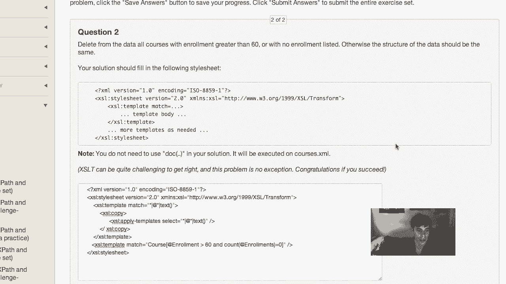

 Alright， so looks like I am getting an error。 So element of type XSL copy must be terminated by the matching end tag。 Okay， so that looks like it's a problem here。 And I think it may have been as simple as a white space error。 So yeah。 So now something interesting is happening。

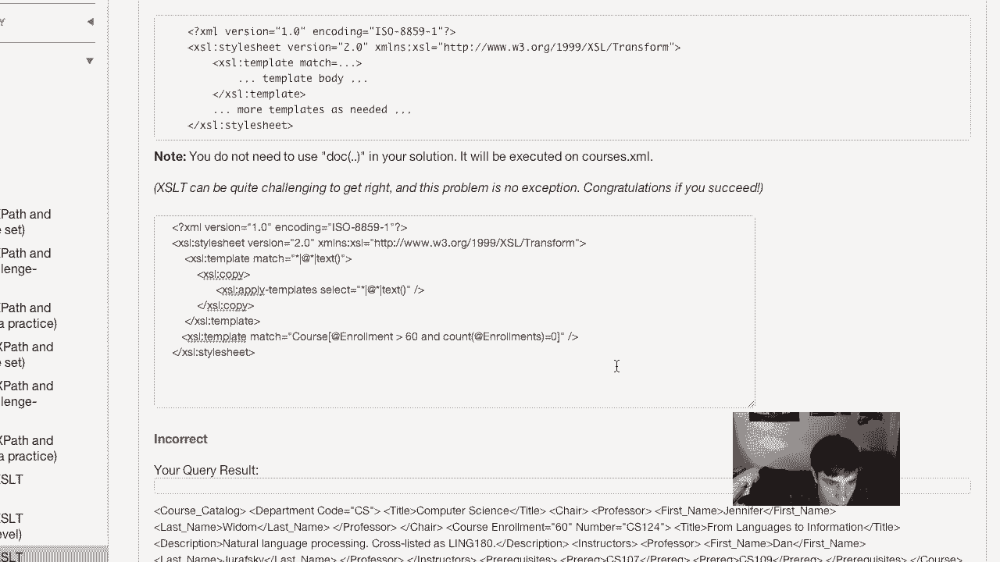

 So I'm getting a result but it's not quite correct and I'm trying to see what's wrong with it。

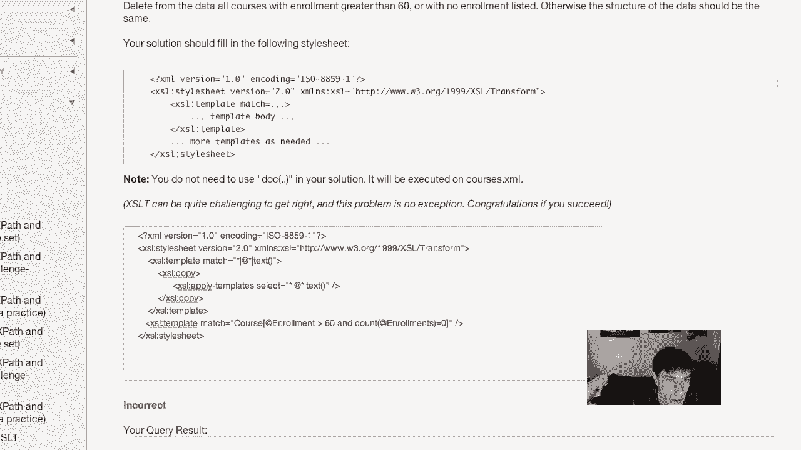

 Okay， so I believe what's happening is I am。

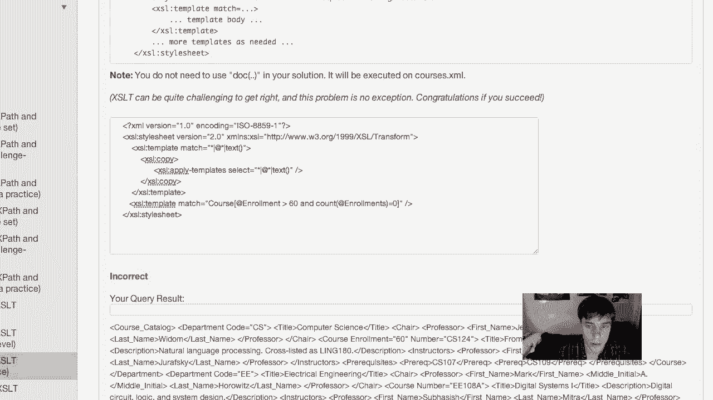

 Hmm。 Now this is mysterious。 Ah， I see what's happening here。 So I'm not returning。 I am returning courses that have no enrollment listed and that is my mistake up here。 I have enrollments in this count of enrollment equals zero instead of enrollment。 So I just get rid of that S and this should be good。

 Maybe not。 So as we say， X query expressions are difficult to get right。 So here's the problem。 I'm trying to do enrollment greater than 60 and count of enrollment equals zero。 That should be an or。 And hopefully that makes sense why。 So we want enrollment greater than 60 deleted or no enrollment listed。

 Because otherwise that would just return everything。 And finally we get the correct result。 So some takeaways。 One it's just tricky to get all of the syntax correct in XSLT。 We had like this extra white space before the closing tag of copy and that causes syntax error。 So you need to not have that white space。 And then just something as small as having an S here misspelling something will make your query wrong。

 And then you also have to worry about your standard Boolean logic。 So having and here instead of or is a problem。

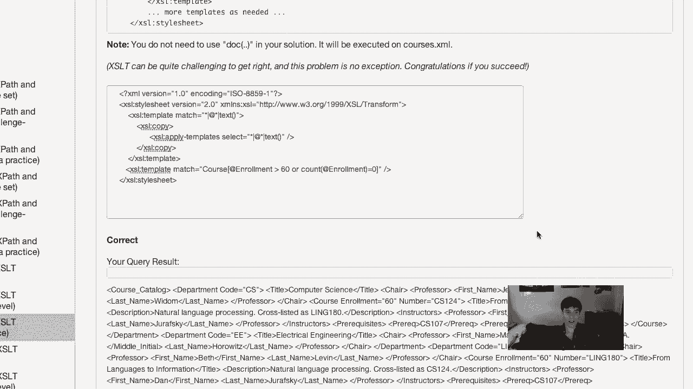

 So hopefully that is an instructive example and everything now makes sense with it。

 And just one more question here。

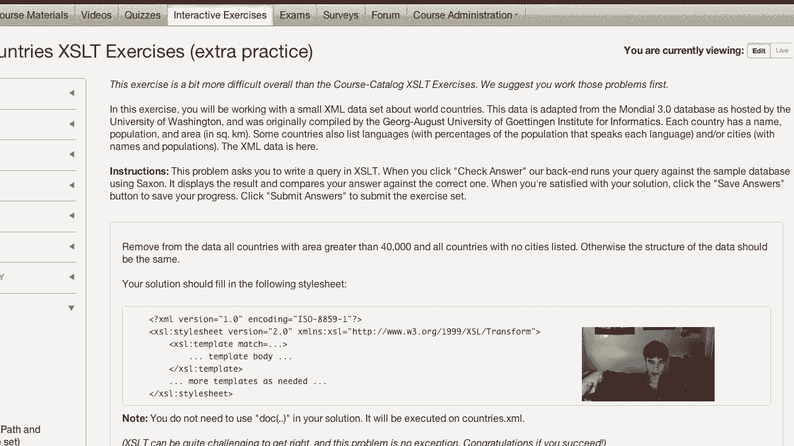

 So this is the world countries XSLT extra practice where we want to remove from the data all countries with area greater than 40。000。

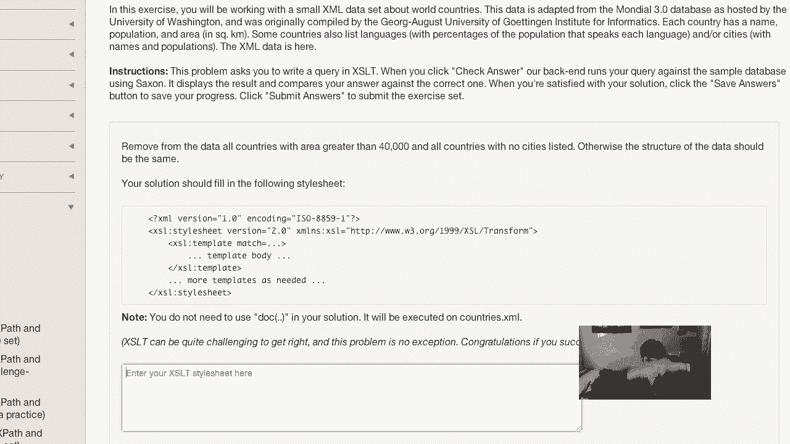

 And all countries with no cities listed。 Otherwise structure of the data should be the same。 Okay。 so actually this is incredibly similar to the last problem that we did with the course catalog。

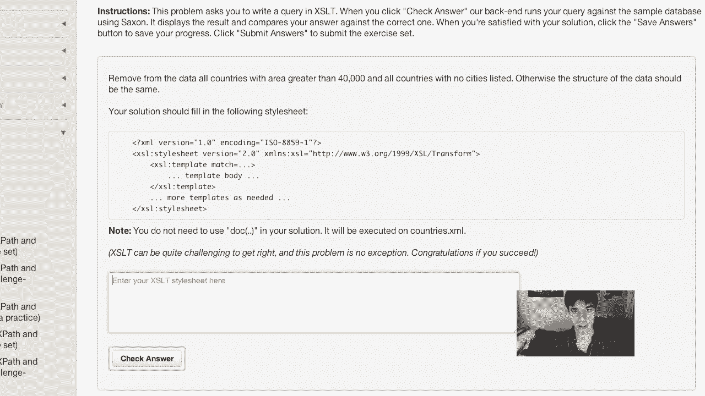

 So I am just going to copy that answer over。

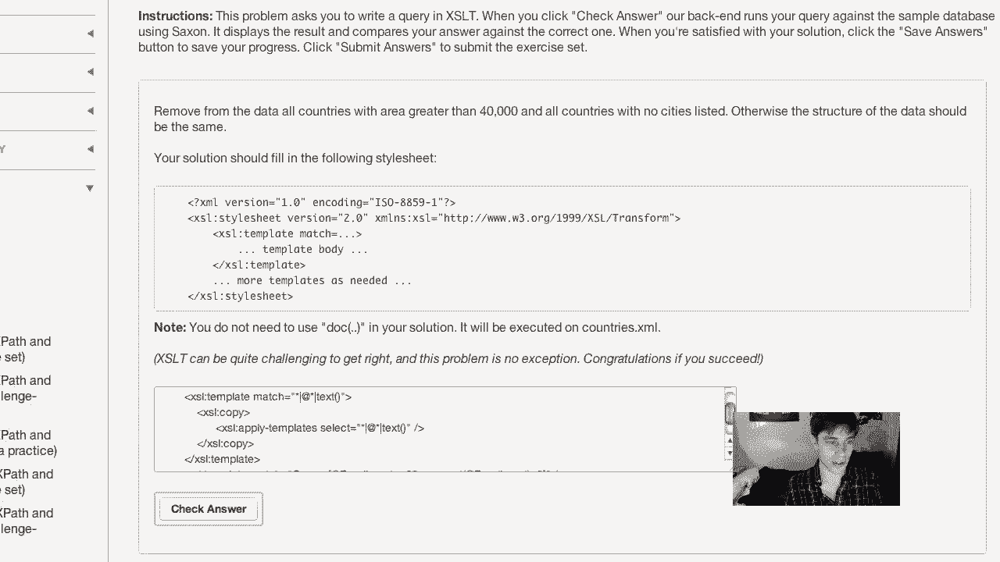

 So we see we want countries with area greater than 40。000 or no cities listed to be removed from the data。

 And so this is exactly like what we have here。

 So it is kind of nice。 We have our matching everything template which still works regardless of the data set。 And then we just had this one line that was specific to the course catalog。 And so we can just change this to country instead of course。 And instead of enrollment population and instead of greater than 60， greater than 40，000。

 And instead of count enrollment equals zero， we want count of city sub elements to be equal to zero。 And that should be it。 Okay， so that is incorrect。 Something went wrong there。 Oh right。 we wanted area greater than 40，000 not population greater than 40，000。 So it is perfect。

 Okay， and so we see that that was pretty much exactly the same problem that we had last time。

 And so that should give you a good idea of some XSLT and some of the trickiness that goes into getting the queries correct。

 And hopefully you've learned something in this session。 I'm going to sign off。 Thank you all for watching。 And I hope this video has been useful。 I will be posting a video on the midterm questions very soon。 Thank you。

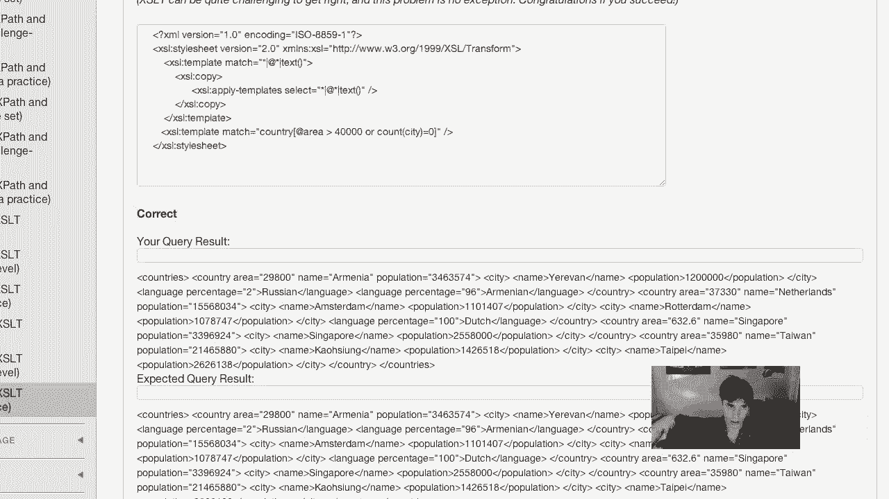