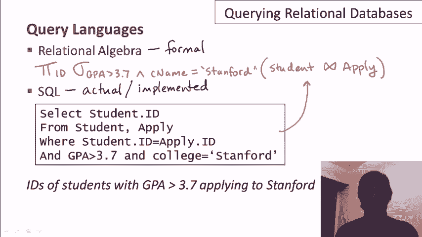

# P3：02-02-querying-relational-databases.mp4 - 哈库那玛塔塔i - BV1R4411u7dt

在这个视频中，我们将学习如何查询关系型数据库。我们不会专注于某个特定的查询语言，我们稍后会讲到，我们只会讨论如何一般性地查询关系型数据库。

让我们先谈谈创建和使用关系型数据库的基本步骤。顺便提一下，我应该提到，数据库人员有个习惯，把数据库和数据库系统画成巨大的磁盘，所以我也会沿用这个习惯。第一步是设计数据库的模式，然后创建模式。

使用数据定义语言。所以正如我们在之前的视频中讨论的，在关系型数据库中，模式考虑了关系的结构和这些关系的属性。因此，我们将在我们的大磁盘中设置这些内容。一旦准备好了，下一步就是用初始数据加载数据库。

所以数据库通常会从外部来源的数据中初始化加载。可能这些数据只是存储在某种类型的文件中，然后这些数据可以被加载到数据库中。一旦数据加载完成，并且我们有了一堆元组在我们的关系中，我们就准备开始有趣的部分了——查询和修改数据。

因此，只要数据库存在，这个过程会不断发生。暂时假设我们有人工用户直接查询数据库。实际上，这通常是通过应用程序或网站来完成的。所以一个用户会过来，向数据库提一个问题，我们会得到一个答案。

他可能会再问另一个问题，Q2，并得到另一个答案。相同的用户或也许是不同的用户可能会要求修改数据库，他们可能想插入新数据或更新一些数据。数据库会回应，“好的，我为你做了这个更改。”这就是查询和更新关系型数据库的基本模式。

关系型数据库支持高层次语言中的临时查询。所谓临时查询，意思是你可以提出你事先没有想到的问题。所以不需要为特定的查询编写冗长的程序。相反，这种语言可以用来在你想到想要询问的问题时，直接提出查询。

如前面的视频所述，关系型系统支持的语言是高级语言。意味着你可以以相对紧凑的方式编写相当复杂的查询，而且你不需要编写从数据库中获取数据的算法。所以我们来看一个查询的例子。让我们再次回到我们虚构的学生数据库，他们正在申请大学。

这里有三个例子，展示了你可能会对关系数据库提出的查询类型。你可能想获取所有GPA大于3.7且只申请斯坦福和麻省理工学院的学生。你可能想查询所有在加利福尼亚的工程系，且申请人数少于500人的系。或者你可能会查询过去五年内，平均录取率最高的大学。

这些查询可能看起来有些复杂，但所有这些查询都可以用几行代码写成，比如用SQL语言，或者用关系代数表示则是相当简单的表达式。

所以，有些查询比其他的容易提出，这是肯定的。你看到的这三个查询，正如我所说，都相对容易提出。现在，有些查询对于数据库系统来说，比其他查询更容易高效执行。很有趣的是，这两者并不一定是相关的。

有些查询容易提出，但很难高效执行；而有些查询则恰恰相反。现在稍微讲一下术语。通常人们会提到数据库系统的查询语言。这通常与DML（数据操控语言）或数据操作语言是同义的。

这通常不仅包括查询，还包括数据修改。在所有关系查询语言中，当你对一组关系执行查询时，你会得到一个关系作为结果。所以让我们对这里展示的三组关系运行一个查询队列，假设是这样。我们得到的结果将是另一个关系。

当你得到的结果与查询对象类型相同时，这被称为语言的闭包特性，它确实是一个很好的功能。例如，当我想执行另一个查询，比如Q2时，那个查询可以基于我第一次查询的答案来执行，甚至可以将该答案与数据库中现有的关系结合。

这被称为组合性，指的是在一个查询的结果上再次执行查询的能力。

现在让我简要讲一下两种查询语言。我们稍后会详细学习这些语言，但在这里我只会简单介绍它们的基本特点。关系代数是一种形式语言，嗯，从它的名字就能看出它是一种代数。

所以它在理论上是有坚实基础的。与此相比，SQL是我所说的实际语言或已实现的语言。那是你将在实际部署的数据库应用程序上运行的语言。但SQL语言的基础是关系代数。

这就是SQL语言语义的定义方式。现在让我给你们展示这两种语言的一个简单例子，我将在这两种语言中各写一个查询。所以让我先去掉这条小线。我们从关系代数开始。

所以我们正在寻找那些GPA大于3.7并且申请了斯坦福大学的学生的ID。在关系代数中，语言的基本操作符是希腊字母。再说一遍，我们稍后会学习具体的细节，但这个特定的表达式会用一个pi符号，后跟一个sigma符号来表示。

pi符号表示我们要获取ID。sigma符号表示我们想要那些GPA大于3.7，并且申请了斯坦福大学的学生。然后，这将作用于学生关系和申请关系的自然连接。再说一遍，我们会在后续的视频中学习这些细节。现在，这就是SQL中的相同查询。

这是你实际在部署的数据库系统中运行的查询。SQL查询实际上与关系代数查询是直接等价的。从教学角度来看，我强烈建议你通过观看关系代数视频来学习关系代数，然后再学习SQL视频，但我并不会强制要求你这样做。

所以，如果你急于马上学习SQL，你可以直接跳到SQL视频。如果你对正式的基础和更深层次的理解感兴趣，我建议你接着观看关系代数的视频。

