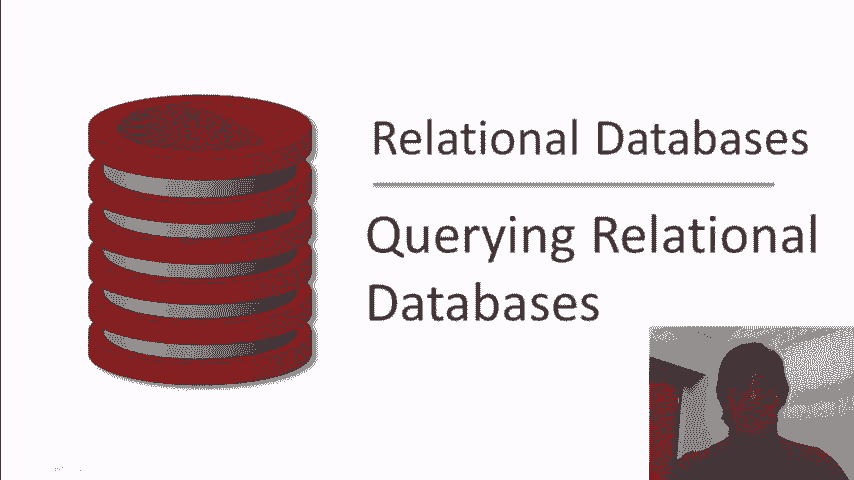
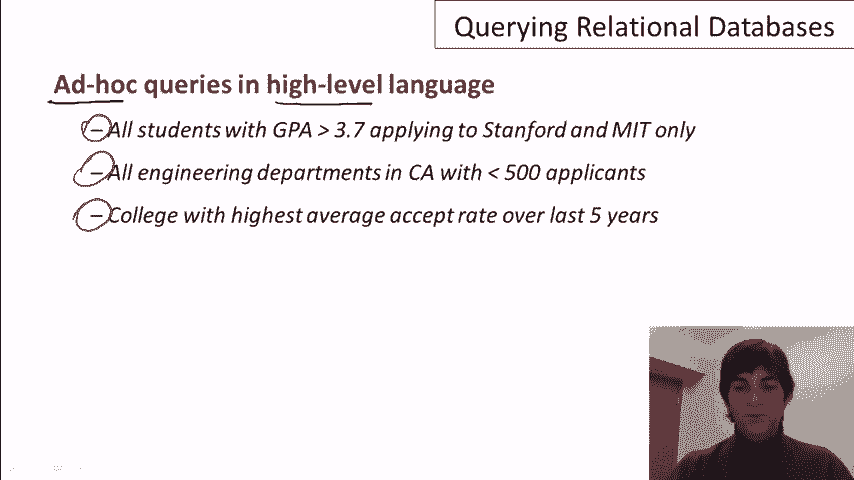
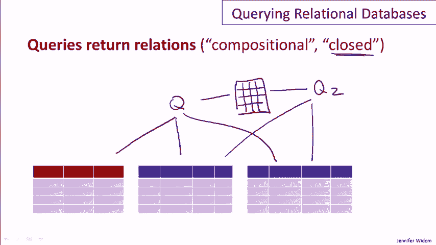

# P3：02-02-querying-relational-databases.mp4 - 哈库那玛塔塔i - BV1R4411u7dt

 In this video we're going to learn about querying relational databases。

 We're not going to focus on a specific query language， we'll do that later。

 we're just going to talk about querying relational databases in general。

 Let's start by talking about the basic steps in creating and using a relational database。

 So by the way I should mention that database people have this habit of。

 drawing databases and database systems as gigantic disks， so I'll be using that same habit。

 So the first step is to design the schema of the database and then create the schema。

 using a data definition language。 So as we discussed in previous videos。

 in a relational database the schema， considers the schema consists of the structure of the relations and the attributes of those relations。

 So we set those up inside our big disk。 Once that's ready。

 the next step is to load up the database with the initial data。

 So it's fairly common for the database to be initially loaded from data that comes from an outside source。

 Maybe the data is just stored in files of some type and then that data could be loaded into the database。

 Once the data is loaded and we have a bunch of tuples in our relation。

 now we're ready for the fun part， which is to query and modify the data。

 And so that happens continuously over time as long as the database is in existence。

 So let's just say for now that we're going to have human users that are directly querying the database。

 In reality that typically happens through say an application or a website。

 So a user will come along， we'll ask a question of the database and we'll get an answer。

 It might come along and ask another question， Q2， and get another answer back。

 The same human or maybe a different human might ask to modify the database so they might want to insert new data or update some of the data。

 The database will come back and say， "Okay， I made that change for you。"。

 So that's the basic paradigm of querying and updating relational databases。

 Relational databases support ad hoc queries in high level languages。 By ad hoc。

 I mean that you can pose queries that you didn't think of in advance。

 So it's not necessary to write long programs for specific queries。

 Rather the language can be used to pose a query as you think about what you want to ask。

 And as mentioned in previous videos， the languages supported by relational systems are high level。

 meaning you can write in a fairly compact fashion， rather complicated queries。

 and you don't have to write the algorithms that get the data out of the database。

 So let's look at an example of a few queries。 Let's go again to our imaginary database of students who are applying to colleges。

 And here's just three examples of the types of things that you might ask of a relational database。

 You might want to get all students whose GPA is greater than 3。

7 who are applying to Stanford and MIT only。 You might want to get all engineering departments in California with fewer than 500 applicants。

 Or you might ask for the college with the highest average except rate over the last five years。

 Now these may seem like fairly complicated queries。

 but all of these can be written in a few lines in， say， the SQL language。

 or a pretty simple expression in relational algebra。

 So some queries are easier to pose than others。 That's certainly true。

 The three queries you see here are， as I said， pretty easy to pose。

 Now some queries are easier for the database system to execute efficiently than others。

 And interestingly， it's not necessarily -- these two things aren't necessarily correlated。

 There are some queries that are easy to pose， but hard to execute efficiently。

 and some that are vice versa。 Now just a bit about terminology。

 It's frequently people talk about the query language of the database system。

 That's usually used sort of synonymously with the DML or data manipulation language。

 which usually includes not only querying， but also data modifications。

 In all relational query languages， when you ask a query over a set of relations。

 you get a relation as a result。 So let's run a query queue， say。

 over these three relations we've shown here， and what we'll get back is another relation。

 When you get back the same type of object that you query， that's known as closure of a language。

 and it really is a nice feature。 For example， when I want to run another query， say， Q2。

 that query could be posed over the answer in my first query。

 and could even combine that answer with some of the existing relations in the database。

 That's known as compositionality， the ability to run a query over the result of a previous query。

 Now let me talk briefly about two query languages。

 We'll be learning these languages in detail later。

 but I'm just going to give the basic flavor of the languages here。

 Relational algebra is a formal language。 Well， it's an algebra， as you can tell by its name。

 So it's very theoretically well-grounded。 SQL， by contrast。

 is what I'll call an actual language or an implemented language。

 That's the one you're going to run on an actual deployed database application。

 But the SQL language does have， as is foundation， relational algebra。

 That's how the semantics of the SQL language are defined。

 Now let me just give you a flavor of these two languages。

 and I'm going to write one query in each of the two languages。

 So let me get rid of this little line here。 Let's start in relational algebra。

 So we're looking for the IDs of students whose GPA is greater than 3。7。

 and they've applied to Stanford。 In relational algebra。

 the basic operators of the language are Greek symbols。 Again， we'll learn the details later。

 but this particular expression would be written with a pi followed by a sigma。

 The pi says we're going to get the ID。 The sigma says we want students whose GPA is greater than 3。

7， and the college that the students have applied to is Stanford。

 And then that will operate on what's called the natural join of the student relation with the apply relation。

 Again， we'll learn the details of that in a later video。 Now here's the same query in SQL。

 and this is something that you would actually run on a deployed database system。

 And the SQL query is in fact directly equivalent to the relational algebra query。 Now pedagogically。

 I would highly recommend that you learn the relational algebra by watching the relational algebra videos。

 before you move on to the SQL videos， but I'm not going to absolutely require that。

 So if you're in a big hurry to learn SQL right away， you may move ahead to the SQL videos。

 If you're interested in the formal foundations and a deeper understanding。

 I recommend moving next to the relational algebra videos。

