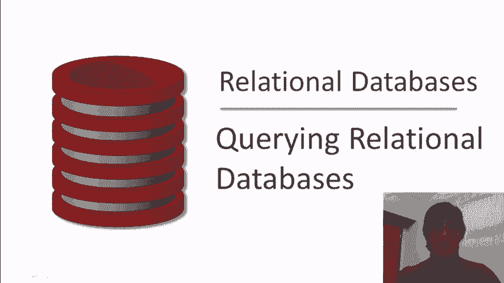
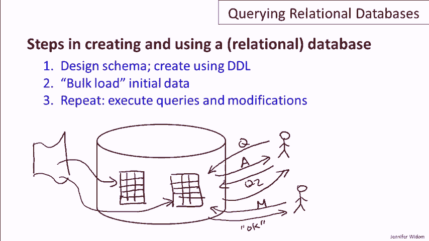
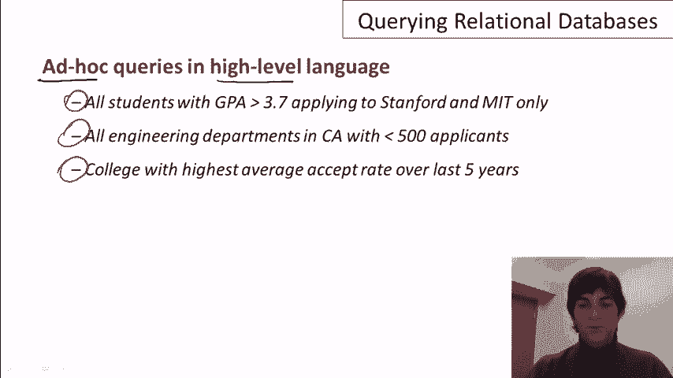
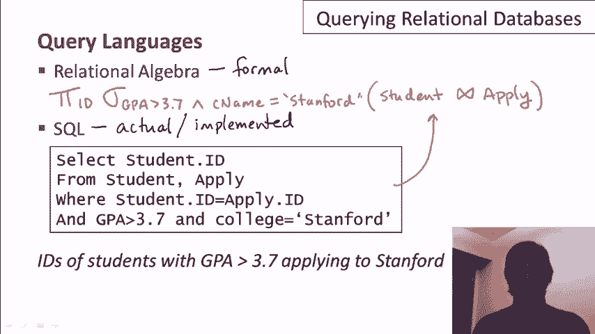

# 课程P3：02-02 关系型数据库查询 🗄️



在本节课中，我们将要学习如何查询关系型数据库。课程不会专注于某一种特定的查询语言，而是讨论查询关系型数据库的一般性方法和核心概念。

***

## 数据库的基本使用流程

上一节我们介绍了课程目标，本节中我们来看看创建和使用关系型数据库的基本步骤。数据库领域通常习惯将数据库和数据库系统画成巨大的磁盘图标，本教程也将沿用这一表示方式。

以下是创建和使用数据库的核心步骤：

1.  **设计并创建模式**：使用数据定义语言来定义数据库的模式。模式规定了数据库中关系的结构以及这些关系的属性。
2.  **加载初始数据**：数据库通常需要从外部数据源（如文件）进行初始化，将数据加载到已创建好的关系中，形成初始的元组集合。
3.  **查询与修改数据**：当数据加载完毕后，就可以开始对数据库进行查询和更新操作。这个过程在数据库的整个生命周期中会持续发生。

***



## 查询交互模式

在数据库就绪后，用户（通常通过应用程序或网站）可以向数据库提出问题（查询）或请求修改数据。

其基本交互模式如下：
*   用户提出查询 Q1，数据库返回答案 A1。
*   用户（可能是同一用户或其他用户）提出另一个查询 Q2，数据库返回答案 A2。
*   用户可能请求修改数据（如插入或更新），数据库执行操作并确认更改完成。

***

## 查询语言的特点

关系型数据库支持使用高级语言进行即席查询。即席查询意味着你可以随时提出事先未预料到的问题，而无需为每个特定查询编写冗长的程序。



关系型查询语言是高级语言，具有以下优势：
*   **表达简洁**：可以用相对紧凑的代码编写复杂的查询。
*   **非过程化**：用户只需声明“想要什么”，而无需指定“如何获取”的具体算法。

例如，针对一个学生申请大学的数据集，你可以轻松提出以下查询：
*   找出所有GPA大于3.7且只申请了斯坦福大学和麻省理工学院的学生。
*   找出所有位于加利福尼亚州、申请人数少于500人的工程院系。
*   找出过去五年内平均录取率最高的大学。

这些查询虽然看起来复杂，但使用如SQL这样的语言，只需几行代码即可表达。

***

## 查询的复杂度与语言特性

有些查询易于表述但难以高效执行，反之亦然。值得注意的是，查询的表述难度和执行难度并不总是一致的。


在关系型查询语言中，一个关键特性是：**对关系进行查询操作，得到的结果也是一个关系**。这被称为语言的**闭包**特性。

闭包特性带来了**组合性**，即允许在一个查询的结果之上再次执行新的查询，或者将查询结果与数据库中已有的关系进行组合操作。

***

## 两种主要的查询语言

最后，我们来简要了解两种重要的查询语言：关系代数和SQL。

*   **关系代数**：一种形式化、理论基础坚实的代数语言。它使用一系列操作符（常以希腊字母表示）来定义查询。
*   **SQL**：一种在实际数据库系统中广泛使用的实践性语言。SQL的语义建立在关系代数的基础之上。

例如，查询“GPA大于3.7且申请了斯坦福大学的学生的ID”：
*   在关系代数中，可能表示为：**π_ID (σ_(GPA>3.7 ∧ cName=‘Stanford’)(Student ⋈ Apply))**
*   在SQL中，对应的查询语句是：
    ```sql
    SELECT s.ID
    FROM Student s, Apply a
    WHERE s.ID = a.ID
      AND s.GPA > 3.7
      AND a.cName = ‘Stanford’;
    ```

从教学角度，建议先理解关系代数以建立扎实的理论基础，再学习SQL以掌握实践技能。当然，你也可以根据兴趣直接开始学习SQL。

***



本节课中我们一起学习了关系型数据库查询的基本流程、交互模式、查询语言的特点以及关系代数与SQL这两种核心语言的基本概念。理解这些基础是进一步掌握具体数据库查询技术的关键。