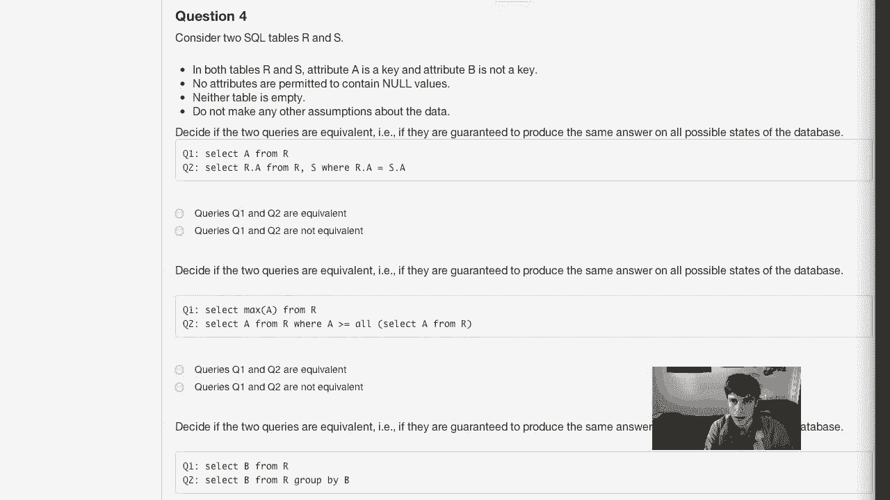
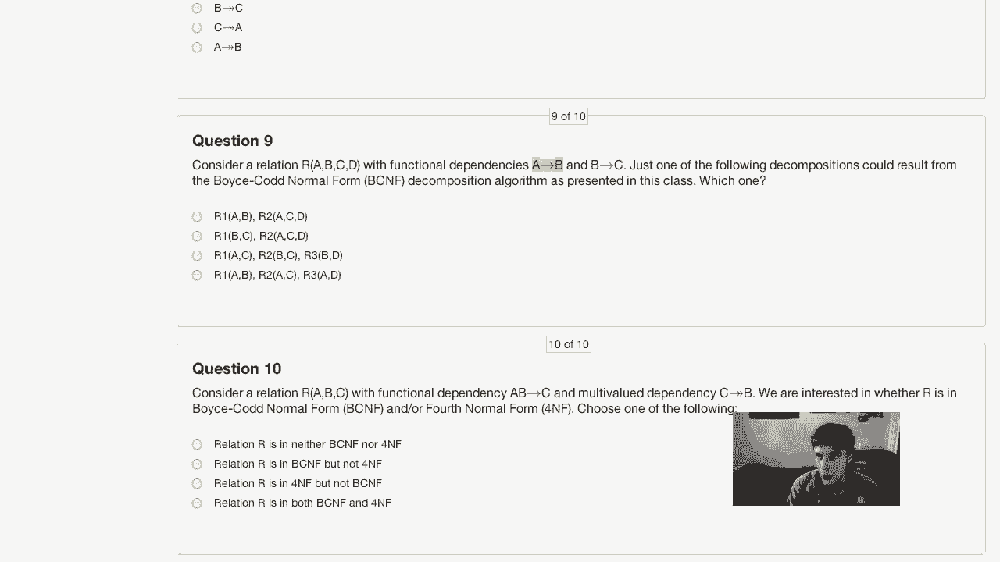
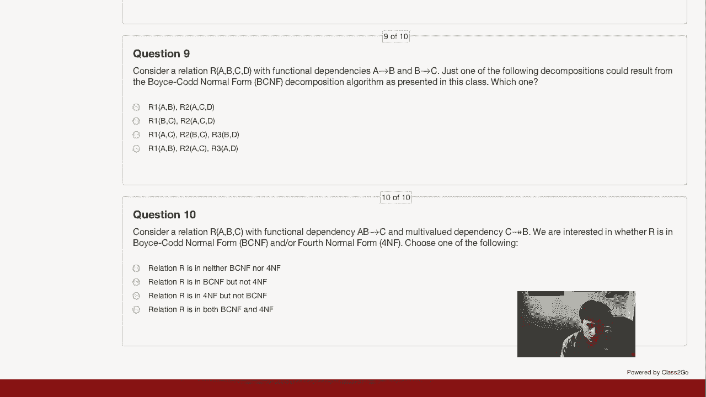

# P30：Midterm Exam Solutions - 哈库那玛塔塔i - BV1R4411u7dt

 Hello students。 This is the video where I'm going to run through all the problems in the midterm exam and go through just the quick solutions for each of them。 Okay， so first on question one， we have this dtd on city info。 And so just really quickly in an XML document that conforms to this dtd。 What are the minimum and maximum possible number of mayor elements。 Okay， so we look through here。

 we see that we have our route elements city info which has one instance of government。 And then each government has one instance of mayor。 And so we see that in this case we will have exactly one one mayor because mayor is never an optional。 An optional element nor is it possible to have more than one mayor。

 So the correct answer here is minimum number is one and maximum number is one。 Okay。 moving on to the second question。 What are the minimum and maximum possible number of library elements。 Okay， so we look through， we see that library is from neighborhood。 And we see that we have in city info neighborhood plus which means that we will have one or two。

 We have one or more neighborhoods。 And we see here that each neighborhood optionally has either a library or a book shop。 So in this case， since libraries are optional as we can tell by this question mark。 that means we could have zero libraries。 But since we can have any number of neighborhoods since we have neighborhood plus each one of those neighborhoods could have a library so we could also have any number of libraries。 So the correct answer here is we could have at minimum zero libraries and at maximum any number of libraries。

 Okay， let's move on to the second set of questions。 So here we have an XML schema。 And this is just on passenger info， I guess for a plane or a train。 In an XML document that conforms to this XML schema。 What are the minimum and maximum possible number of name elements。 Okay。

 so we see that we have our sequence of elements here。 And the name element is right here。 And so this is not inside of a choice。 And we don't specify like a minimum number of occurrences。 So this element has to appear。 But we are specified a maximum number of occurrences at two。 So it has to appear at least once and it can appear at most twice。

 So the correct answer is this third one， minimum one， maximum two。 Okay。 and now in an XML document that conforms to this schema。 what are the minimum and maximum possible number of snack elements。 Okay。 so we see that snack occurs inside of this excess choice where we will have either meal or snack because that's what choice does。

 So it's possible that we have no snacks。 So the minimum is zero。 But we are also given a maximum occurrences of two on snack。 So we could have up to two snacks。 So that makes the minimum zero and the maximum two。 Alright。 and now we can move on to the next set of questions， which is on some relational algebra。 Okay。

 so consider the following three relations where we have cars with a model year serial number。 which is the key and the color。 Makes relation with the maker and model model being the key and owns where owner and serial together specify a key。 Okay， so consider the following relational algebra expression。 We have projecting owner out of owns natural join with select color equals red of car natural join select maker equals Toyota makes。

 Okay， so which of the following phrases describes what this expression computes。 Okay。 so doing this natural join with owns car and makes and projecting out owner will give you the names of all owners of cars and then these selections will specify what type of car that is。

 So selecting color is red means that we will only have owners of red cars and selecting maker is Toyota will mean that we only have cars made by Toyota。 So this computes all owners of red car made by Toyota。 And so that is option A。 And then we move on to the next question， which asks about this relational algebra expression。 Okay。 so projecting owner out of selecting owner equals own O two and serial is not S two of the cross product of owns with itself with some attributes renamed。

 Okay， so this is a self join condition where we are doing this Cartesian product of owns with itself and checking that the owners are the same。 So that's going to give you all all pairings of cars that an owner owns。 And we're also checking that serial the serial numbers don't match。 So that's going to give you all pairings of cars that have the same owner， but are a different car。

 And we're projecting out owner。 So that computes then is just all people who own at least two cars。 And so we see， okay， so all owners of more than one car。 That's the third option。 And that's that's the correct option。 So， great moving on。 which of the following relational algebra expressions computes all companies that made at least one car in the year 2010。

 Okay， so what we need to be doing here is doing。 Let's see。 we need to have the maker field and the year field。 So we need a natural join from car and makes in order to get this so that will get us all all maker model year serial color pairs for every car。 And from that， we will just need to select that the year is 2010 and then pull out the maker。

 So this should be pretty straightforward。 Hopefully one of these options does that directly。 Indeed。 it's this one where we are selecting that the year is 2010 from car。 So that will get us all cars made in the year 2010 and then doing a natural join with makes will get us the maker of that car and then we project out the maker。 And so that is option B。 So that's good。 And then we have this one last question。

 which of the following relational algebra expressions computes the latest year of any car in the database。 Okay， so what we're doing here is basically just finding the max year and if we remember correctly year is in in the cars relation。 So we just want to find the maximum year across all tuples in the database。 And I've gone over this in office hours before， but the way that you find maximum in relational algebra is you find everything that is less than something else。

 And then you take the set of everything and subtract out everything that's less than something else。 So hopefully that makes sense， but it turns out that the query that does this is this one is the last option where we are doing this cross product of car with itself and picking out all cars or the set of all years that are less than some other year。

 And then when we subtract that from the set of all years， we get the maximum year。 And so that is the correct option。 All right， moving on to the next set of questions。 This set of questions is about SQL computations。 So first question。 So we need to decide if two queries are equivalent。

 meaning that they are guaranteed to produce the same answer on all possible sticks of the database。 And the database is that we have non empty relations are an S with attributes A and B。 Now。 no null values。 A is a key for both relations and B is an attribute。 but not a key for both relations。 All right。 And so first set of queries here is select a from R and select R dot A from R from the join of R and S where the theta join of R and S where。

 R A equals S A。 Okay， so I hope it's pretty obvious here that these queries are not equivalent。 And just as a quick example database to demonstrate that just think about this where we have a relation of the other。

 And so in this case， selecting a from R will give us one and selecting R dot A from R joined with S on the A attribute will give us an empty result。 So hopefully that makes sense。

 So these queries are not equivalent。 Now question two。 We have select max of A from R and select A from R where A is greater than or equal to all select A from R。 Okay， so hopefully it's obvious here that these are equivalent。 So this will return us a single number， the highest A value in R。

 And this will return us an A value any time that A is greater than or equal to all other A values in R。 And so in a different database， this could possibly return us more than one number。 whereas this would only return us one number。 But since A is a key on the relation R。 that means that each A value occurs only once。 And so in this case。

 it's impossible to have any duplicates from query to。 So indeed。 they will return exactly the same result。 So these two are equivalent。 All right。 now moving on to this third set of queries。 Select B from R and select B from R group by B。 Okay。 so these queries are not equivalent。 And the reason for that is we won't get like the same B values from both of these。

 But this one will group by the B values and so they will have every B value that's the same together in the result next to each other。 Whereas the first query which just selects B from R will give us all the B values。 but they could be in any sort of order。 So these two queries are not equivalent。 All right。 and just one more of these SQL problems。 Decide if the two queries are equivalent where we have select a from R where exists select star from S where S equals R dot A。

 And select a from R intersect select a from S。 All right。 so what this first query is doing is getting any a value from R where that a value appears as。 An a value in S because the exists just checks is that does this select statement give us any values。 And so that's all A's from R where that A also appears in S。

 And then select a from R where select a from R intersect select a from S。 That gives us the exact same thing that will give us all a values from R that also appear in S。 And since a is a key， this first operation doesn't have any duplicates。 And since this is an intersect operation intersect is by default and SQL done as a set operation。

 So that won't have any duplicates。 So indeed these queries are equivalent。 All right。 so moving along。 To this question five。 So the database class portal uses relational database management system to manage student assignment scores where each assignment submission is recorded in the scores table where we have the student ID。

 the assignment ID， a timestamp and the score。 And so the only minimal key here is the student ID assignment ID and timestamp altogether。 And that's because students as we know are allowed to submit assignments multiple times。 And so which of the following SQL statements returns the student IDs of all the students who have submitted some assignment more than 10 times。 Okay， so let's just look at these queries one by one。 Okay。

 so select distinct SID from scores where count stars greater than 10。 So this is incorrect because we typically don't have count star in our where clause that's not correct。 Let's see。 This is similarly wrong。 This last one is because we have the count in the where。 And actually also this one has the count in the where so let's let's hope that this third statement is correct。

 And I think it is it's select distinct student ID from scores group by SID。 AID having count star greater than 10。 Yeah， that's indeed correct。 What this will do is count up every time that at each student ID assignment ID pairing occurs in the scores table and filter out all of them if if they occur fewer than 10 times。 And so that is correct。 That's exactly what we want。 So cool。 That's good。

 And moving on to question six。 We have this relation R with attributes A， B， C， D， and E。 And there are three functional dependencies that A functionally determines D。 C functionally determines A， B， and D， B functionally determines E。 Okay。 so which of the following functional dependencies is also guaranteed to be satisfied by R？ Okay。

 so let's look at these one by one。 So C functionally determines E。 Let's see if that's true。 So we have that C gives us A， B， and so from C we get A and from A we get D。 So C gives us A， B。 and D since we have both B and D from C that also gives us E。 So this first one is correct。 So we're actually done with that question。 All right。

 Now we have the same relation but with different functional dependencies。 We have A implies B， B。 C implies E， and D implies A。 Which one of the following is the key for R？ Well。 let's look at these one by one again。 So with AC from A we will get B and then we'll have B， C。 which will give us E。 But then we have no way to get D because D never appears on the right side of one of these functional dependencies。

 So we know that we're going to need D in our key。 So AD。 well that's somewhat promising since it has D but， okay， so from A we get D。 And then we don't have C so we can't get E。 So that's a problem。 BC。 well we know that we need D in the key since D never appears on the right hand side。

 So we know that's not going to be right。 So this CD should be correct。 If we have CD then we get from D we get A and so we have， and then from A we get B。 So we have C， D。 A， and B and then we have B and C since C is in the key and we get E。 So that gets us all attributes。 So this last one is correct。 All right。

 Now here's an instance of a relation， R， A， B， C。 Just one of the following MBDs is satisfied by this instance of R on which one。 All right。 So MBDs are one of the， one of the trickiest concepts in this entire class。 So we'll step through this looking at one answer at a time。 So C multi-determined B。 Let's see if that's correct。 So recall that what the definition of multi-valued dependency means is that any time the。

 all of the attributes in the left hand side agree then， there is a tuple that has the， the， the。 the same attributes for every pair of tuples where the attributes in the left hand side agree。 There's a third tuple， guaranteed to be a third tuple that has the attributes on the left hand side from the first tuple。 the attributes on the right hand side from the first tuple and the attributes from everything that's neither the left side nor the right side from the second tuple。

 And so let's just look through and decide。 So with C multi-determined B we have these one one tuples and those look good since whenever we only have these two where we have a one as。 as the C and we have two's in the B attribute for both of those。 So those are going to be fine where we might run into problems is here with these C equals three tuples。 So since we have three as the C value for both of these tuples。

 what we need is we need to have a tuple that has three， two， five and three， one， five。 So we're good with those two， but if we look at this last tuple， we need to have。 if we compare this four， two， three， tuple with this five， one， three， tuple。 What C multi-determined B would mean would mean that we have a three， one， a three， one， four tuple。

 which does not occur in this relation。 So this answer is incorrect。 Now let's look at B multi-determined C。 Okay， so if that were true， then actually this may be true。 So what that says is whenever we have B values that are equal。 so we have B equals two in several places here。 That means that we need to have a two， one。

 five tuple， which we have here two， one and five， and we also need to have a two， three， four。 which we have down here two， three， four。 All right， so that's good。 Indeed。 it looks like we have all of the permutations here。 So B multi-determined C indeed is the correct answer。 This is satisfied by this relation。

 And you can just step through all of the possible permutations to convince yourself of that。 What I will do is go through these other two and explain why they're not correct。 So C multi-determined A。 That doesn't work because we would need to have a -- okay， so three --。 Since we have this five， one， three， tuple and this four， two， three， tuple。

 we have their C values equal。 So that means we need to have a three， five， two， tuple。 which we actually have。 And also a three， four， a three， four， one， tuple， which we don't have。 So that three， four， one does not exist。 And so that's why this answer is incorrect。 Okay。 and then with A multi-determines B， we have this pair of tuples。

 which implies that we need to have a five， one， one， tuple。 Five， one， one would need to happen。 And that doesn't happen anywhere。 And so that's why this answer is incorrect。 Okay， so again。 the answer to this question is B multi-determines C。 And you can step through and convince yourself completely of that if you're not already convinced。

 All right， and moving on to question nine。 So consider relation R， A， B， C， D。 with functional dependencies A implies B and B implies C。 Just one of the following decompositions could result from the voice card normal form decomposition algorithm as presented in class。 Which one？ Okay， so the trickiest part about this question is that since A functionally determines B。

 I'm sorry if I confused those two terms。 If， since A functionally determines B and B functionally determined C by the transitive rule。 A functionally determined C。 So you need to consider that as you're decomposing。 Okay。 so we can break apart our A， B， C， D。 First using violating functional dependency are A， B。 So I'm just going to type this out really quick。 Bring up my notepad from before。 So we have。

 We've discussed we have a functionally determines B。 B functionally determines C and therefore a functionally determines C。 And so we have our A， B。 C and D。 So we can break apart with A functionally determines B。 So we would break that into two relations are A， B。 We'll call that R1， A， B and R2 with A， C and D。

 And so we look at these。 Okay， so now the only functional dependency that we have here has A on the left hand side。 And so A is a key for this relation。 So that is fully decomposed。 And we have this A， C。 D relation where we still have a violating functional dependency with A and C。 And so we need to break that down further into our three into A and C and R4 with A and D。

 And so now we are done。 We have no more violating functional dependencies。 So the final set we have A， B in one relation， A， C in one relation and A， D in one relation。

 And so voila， that is the final option here。 So that is the answer to question nine。 which I know a lot of people had some trouble with。 And finally， let's look at question 10。 Consider relation R， A， B， C with functional dependency A， B， implies C and M， B， C。 multi determines B。 We are interested in whether R is in BCNF and or fourth normal form。

 Choose one of the following。 Okay。 So our ABC， we have AB implies C as our only functional dependency。 And so what that means in this case is that AB is a key for the relation R。 And so functional dependencies aren't violating if the left hand side is a key。 So indeed we are in BCNF here。 So we can eliminate this option and we can eliminate this option。

 So we know that it's either this one or this one。 Okay。 And we also have multi valued dependency C implies C C multi determines B。 So MVDs are violating if the left hand side is not a key。 And the MVD is non trivial。 And so in this case， C is not a key for the relation。

 So that part indicates that it's a violating MVD。 And it's also the case that this is a non trivial MVD。 Because we don't have B as a subset of C and C and B together are not all attributes。 So this is indeed a violating MVD。 So we have that this is in BCNF but not in fourth normal form since we have a violating MVD。 Alright， so that concludes me going over the solutions to the midterm exam。

 I hope that this was instructive and useful and gives you some good preparation for the final exam。 Thank you and have a great weekend。

