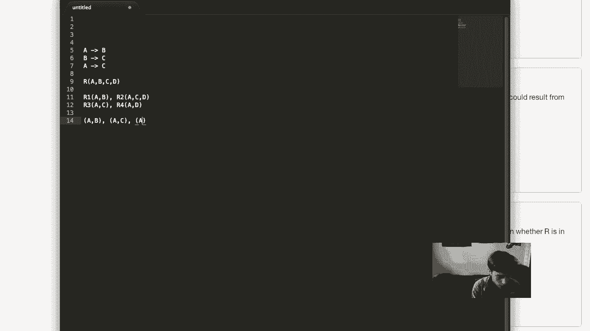

# P30：期中考试解答 - 哈库那玛塔塔i - BV1R4411u7dt

同学们好，这是我将演示期中考试所有问题并快速解答每个问题的视频。好的，第一个问题，我们有这个关于城市信息的DTD。所以非常快速地，在一个符合这个DTD的XML文档中，市长元素的最小和最大可能数量是多少？好的，我们来看一下。

我们看到我们有我们的路由元素，城市信息，其中有一个政府实例。然后每个政府都有一个市长实例。所以我们看到在这种情况下，我们将有恰好一个市长，因为市长从来不是可选的元素，也不可能有多个市长。

所以这里的正确答案是最小值为1，最大值为1。好的，继续下一个问题。图书馆元素的最小和最大可能数量是多少？好的，我们看一下，我们看到图书馆是来自社区的。我们看到在城市信息中，社区是可选的，这意味着我们会有1个或2个。

我们有一个或多个社区。我们看到每个社区可选择性地有一个图书馆或书店。所以在这种情况下，由于图书馆是可选的，正如我们从这个问号中可以看出，这意味着我们可以有零个图书馆。但是由于我们可以有任意数量的社区，而每个社区都可以有一个图书馆，因此我们也可以有任意数量的图书馆。所以正确答案是，最少可以有零个图书馆，最多可以有任意数量的图书馆。

好的，让我们继续下一个问题集。所以这里我们有一个XML模式。这只是关于乘客信息，我猜是飞机或火车的。对于一个符合这个XML模式的XML文档，名字元素的最小和最大可能数量是多少？好的。

所以我们看到这里有一个元素序列。名字元素就在这里。所以这不在选择内。我们没有指定最小出现次数。所以这个元素必须至少出现一次。但我们指定了最大出现次数是二。所以它必须至少出现一次，最多可以出现两次。

所以正确答案是第三个，最小值是1，最大值是2。好的，现在在一个符合这个模式的XML文档中，零食元素的最小和最大可能数量是多少？好的，我们看到零食出现在这个选择集内部，在这里我们会有餐点或零食，因为选择集就是这样工作的。

所以可能我们没有零食。最小值是零。但我们也被给定了零食的最大出现次数是两个。所以我们最多可以有两个零食。所以最小值是零，最大值是两个。好的，现在我们可以继续下一个问题集，这是关于一些关系代数的。好的。

所以，考虑以下三个关系，其中有一个汽车表，包含车型年份、序列号（作为主键）和颜色；一个制造商表，包含制造商和型号（其中型号是主键）；还有一个拥有关系，其中车主和序列号共同作为主键。好吧，所以，考虑下面的关系代数表达式。我们有投影车主从 owns，自然连接选择颜色为红色的汽车，自然连接选择制造商为丰田的制造商。

好吧，下面哪个选项描述了这个表达式计算的结果？好的。所以，进行这个与拥有表、汽车表和制造商表的自然连接，并投影出车主，将会给出所有车主的姓名，然后这些选择条件会指定该车的类型。

所以，选择颜色为红色意味着我们只会得到红色车主，而选择制造商为丰田则意味着我们只会得到丰田制造的汽车。这样，我们就得到了所有拥有丰田红色汽车的车主。这个就是选项 A。然后我们继续看下一个问题，问的是关于这个关系代数表达式的问题。好吧。所以，投影出所有车主，选择车主等于 own O2，且序列号不等于 S2，跨乘 owns 自身，并且对某些属性进行重命名。

好吧，这是一个自连接条件，我们正在执行 owns 自身的笛卡尔积，并检查车主是否相同。这样就能得到所有同一车主拥有的汽车配对。同时我们还在检查序列号是否不同。因此，这将给出所有同一车主拥有但不同的汽车配对。

我们正在投影出车主。所以，计算的结果就是所有至少拥有两辆车的人。因此，我们可以看到，所有拥有超过一辆车的车主。这是第三个选项。这就是正确的选项。所以，太好了，继续下一个问题。下面哪个关系代数表达式计算了在 2010 年至少制造一辆车的所有公司？

好吧，我们需要做的就是。让我们看看。我们需要获取制造商字段和年份字段。因此，我们需要对汽车表和制造商表进行自然连接，以便得到这些数据，这样就能得到每辆车的制造商、型号、年份、序列号和颜色组合。然后，从中，我们只需选择年份为 2010 的记录，并投影出制造商。

这个应该很简单。希望这些选项中有一个直接实现了这一点。确实是这个选项，我们从汽车表中选择年份为 2010 的记录。这样我们就能得到所有2010年制造的汽车，然后通过与制造商表进行自然连接，我们就能得到这些车的制造商，最后我们投影出制造商。这个就是选项 B。所以，这个很好。然后我们有最后一个问题。

以下哪个关系代数表达式计算数据库中任何一辆车的最新年份？好吧，我们要做的基本上就是找到最大的年份，如果我们没记错的话，年份是存在于 cars 关系中的。所以我们只需要找到数据库中所有元组的最大年份。之前我在办公时间讲过这个问题，关系代数中找到最大值的方法是找出所有小于某个值的内容。

然后你取出所有的集合，并从中减去所有小于某个值的内容。所以希望这能让大家理解，结果表明执行此操作的查询是最后一个选项，其中我们对 car 进行自乘积并挑选出所有小于其他年份的所有汽车或所有年份的集合。

然后，当我们从所有年份的集合中减去这些结果时，我们就得到了最大年份。所以这是正确的选项。好的，接下来进入下一组问题。这组问题是关于 SQL 计算的。第一个问题，我们需要判断两个查询是否等价。

意味着它们保证在数据库的所有可能实例上返回相同的结果。而我们有的数据库包含两个非空的关系 R 和 S，具有属性 A 和 B。现在，没有空值。A 是两个关系的主键，而 B 是一个属性，但不是两个关系的主键。好的。接下来是第一组查询，选择 R 中的 A，和选择 R dot A 从 R 和 S 的连接中，连接条件是 R 和 S 的 theta 连接。

R A 等于 S A。好吧，所以我希望现在大家能够明显看出这些查询是不等价的。作为一个快速的例子，假设我们有另一个关系来演示这一点。

在这种情况下，选择 R 中的 A 会给我们一个结果，而选择 R 中的 R dot A 与 S 在 A 属性上连接后的结果则会返回一个空结果。所以希望这能让大家理解。

所以这些查询是不等价的。现在第二个问题。我们有 select max of A from R 和 select A from R where A 大于或等于所有 select A from R。好的，希望这里显而易见的是这些查询是等价的。所以这将返回一个数字，即 R 中最大的 A 值。

这将返回一个 A 值，每当 A 大于或等于 R 中所有其他 A 值时。所以在另一个数据库中，这可能返回多个数字，而这个查询只会返回一个数字。但由于 A 是关系 R 的主键，这意味着每个 A 值仅出现一次。因此，在这种情况下。

查询二是不可能有任何重复项的。所以确实，它们会返回完全相同的结果。所以这两个查询是等效的。好了，现在继续看第三组查询。选择B从R，和选择B从R并按B分组。好吧，这些查询是不等效的。原因是我们不会从这两个查询中获得相同的B值。

但是这个会按B值分组，因此它们会将所有相同的B值聚集在结果中，紧挨在一起。而第一个查询，只是从R中选择B，它会给我们所有的B值，但它们的顺序可能是任意的。所以这两个查询是不同的。好了，再来看一个SQL问题。判断这两个查询是否等效，查询为选择a从R，其中存在选择星号从S，其中S等于R.A。

然后选择来自R的a，交集选择来自S的a。好了，首先这个查询的作用是从R中获取任何a值，其中这个a值也出现在S中，因为`exists`只是检查这个选择语句是否给我们提供了任何值。所以这就是从R中选择所有的a值，其中a也出现在S中。

然后选择a从R，其中选择a从R交集选择a从S。这会给我们完全相同的结果，它会返回所有来自R且也出现在S中的a值。由于a是主键，第一个操作不会有任何重复项。由于这是一个交集操作，交集在SQL中默认作为集合操作执行。

所以这个查询不会有任何重复项。确实，这些查询是等效的。好了，继续进行下一个问题。到问题五。数据库类门户使用关系数据库管理系统来管理学生作业成绩，其中每次作业提交都会记录在scores表中，其中包含学生ID。

作业ID、时间戳和分数。因此，这里的最小关键字是学生ID、作业ID和时间戳三者合在一起。因为我们知道，学生允许多次提交作业。所以，以下哪个SQL语句会返回所有提交某个作业超过10次的学生ID？好了，让我们一个一个地看这些查询。

所以选择不同的SID来自scores，其中count stars大于10。这个是错误的，因为通常我们在where子句中不会有count star，这样是不对的。再看一下，这个也是错的。最后一个是因为我们在where中有count。实际上这个查询也在where中有count，所以让我们希望第三个语句是正确的。

我认为它是`select distinct student ID from scores group by SID，AID having count star greater than 10`。是的，这确实是正确的。这样做会统计每次在`score`表中出现的学生ID和作业ID的配对，并且如果它们出现的次数少于10次，就会过滤掉它们。所以这是正确的。这正是我们想要的。真棒。很好。

接下来是第六个问题。我们有这个关系R，具有属性A，B，C，D和E。并且有三个函数依赖，A决定D，C决定A，B和D，B决定E。好吧，接下来，以下哪个函数依赖也一定会被R满足？好吧。

那么让我们逐一查看这些。那么C函数决定E。我们来看这是否成立。我们有C给我们A，B，所以从C我们得到A，然后从A我们得到D。于是C给我们A，B，D，因为我们从C得到了B和D，这也给了我们E。所以这个第一个是正确的。这样我们就完成了这个问题。好吧。

现在我们有相同的关系，但是有不同的函数依赖。我们有A决定B，B，C决定E，D决定A。以下哪个是R的键？好吧，让我们再次逐一检查这些。那么有了AC，从A我们将得到B，然后我们有B，C，这将给我们E。但接下来我们没有办法得到D，因为D从未出现在这些函数依赖的右侧。

所以我们知道我们需要D在我们的键中。那么AD，嗯，这有点希望，因为它有D，但是，好的，从A我们得到D。然后我们没有C，所以无法得到E。这是个问题。BC。好吧，我们知道我们需要D在键中，因为D从未出现在右侧。

所以我们知道那是不对的。那么这个CD应该是正确的。如果我们有CD，那么从D我们可以得到A，然后我们就有了，接着从A我们可以得到B。所以我们有C，D，A和B，然后我们有B和C，因为C在键中，我们可以得到E。这样我们得到了所有属性。因此，最后一个是正确的。好吧。

现在这里有一个关系实例，R，A，B，C。以下哪个MBD由这个R实例满足？哪个是？好的，MBD是这个课程中最棘手的概念之一。所以我们将逐个查看答案。C多值决定B。我们来看这是否正确。所以回想一下，多值依赖的定义是，每次。

如果左边的所有属性一致，那么就有一个元组，它具有左边每对元组的相同属性。在这些元组的左边属性一致的每一对中，都有一个第三个元组，保证存在一个第三个元组，它有第一个元组的左边属性，第一个元组的右边属性，以及第二个元组中既不属于左边也不属于右边的所有属性。

那么我们就看看并决定。对于C多重确定B，我们有这些一、一的元组，看起来没问题，因为当我们只有这两个元组时，它们的C值是1，而B属性的值都是2。所以这些元组是正确的，而我们可能遇到问题的是这些C值为三的元组。因为我们有这两个元组的C值都是三。

我们需要的是一个包含三、二、五和三、一、五的元组。所以这两个元组是正确的，但如果我们看看最后一个元组，我们需要比较这个四、二、三元组和这个五、一、三元组。C多重确定B的意思是我们需要有一个三、一、三、一、四的元组。

这个关系中没有发生的情况。所以这个答案是错误的。现在我们来看B多重确定C。好的，如果这是真的，那么实际上这个也可能是真的。所以这意味着每当我们有相等的B值时。我们在这里的几个地方都有B值为二。这就意味着我们需要有一个二、一的元组。

五元组，我们在这里有两个、一和五，我们也需要一个二、三、四元组。我们在下面也有这个二、三、四元组。好吧，这很好。确实，似乎我们已经涵盖了所有排列。因此，B多重确定C确实是正确答案。这个关系满足这个条件。

你可以遍历所有可能的排列，确保自己相信这个结论。我接下来会解释其他两个为什么不正确。首先是C多重确定A。这个不成立，因为我们需要有一个——好吧，三——。因为我们有这个五、一、三的元组和这个四、二、三的元组。

我们有它们的C值相等。所以这意味着我们需要一个三元组、五元组、二元组的组合。实际上我们有这些。但同时也需要一个三元组、四元组、三元组、四元组、一元组的组合，而我们没有这个。因此，三元组、四元组、一元组并不存在。所以这就是为什么这个答案是错误的。好的，然后我们来看A多重确定B，我们有这一对元组。

这意味着我们需要有一个五、一、一的元组。五、一、一必须存在。但在任何地方都没有出现。因此这就是为什么这个答案是错误的。好的，再次强调，这个问题的答案是B多重确定C。如果你还没有确信，你可以一步一步地验证，直到完全相信。

好的，我们继续来看第九题。考虑关系R，A，B，C，D。具有功能依赖A推导出B和B推导出C。在课堂上展示的“声卡规范形式分解算法”中，下面的哪种分解可能是结果？好吧，这个问题最棘手的部分是，因为A功能性地确定了B。

如果我混淆了这两个术语，我感到抱歉。如果，因A函数性地决定了B，而B又通过传递规则函数性地决定了C，那么A就函数性地决定了C。所以在分解时，你需要考虑这一点。好的，所以我们可以拆分A，B，C，D。首先，使用违反函数依赖的是A，B。所以我会很快把它打出来。打开之前的记事本。所以我们有。

我们已经讨论过了，我们有A函数性决定B，B函数性决定C，因此A函数性决定C。所以我们得到了A，B，C和D。我们可以用A函数性决定B来拆分。所以我们将它分解成两个关系，A，B。我们称之为R1，A，B和R2，A，C和D。

所以我们看一下这些。好的，现在唯一的函数依赖是A在左边。所以A是这个关系的一个关键。这个关系已经完全分解。然后我们得到了一个A，C，D的关系，但我们依然有A和C之间违反的函数依赖。所以我们需要进一步将它分解成我们的三个关系，A和C，以及A和D的R4。

所以现在我们完成了。我们没有更多的违反函数依赖。所以我们最终得到了三个关系：A，B在一个关系中，A，C在一个关系中，A，D在一个关系中。

所以，瞧，这就是最后的选项。这就是第九题的答案，我知道很多人对此有些困惑。最后，让我们看看第十题。考虑关系R，A，B，C，具有函数依赖A，B→C和M，B，C。多值决定B。我们要确定R是否在BCNF或第四范式中。

选择下面的一个。好的。我们有A，B→C作为唯一的函数依赖。所以在这种情况下，A，B是关系R的一个键。因此，当左侧是键时，函数依赖就不会违反。所以我们确实处于BCNF状态。因此，我们可以排除这个选项，也可以排除这个选项。

所以我们知道它要么是这个，要么是那个。好的。我们还要处理多值依赖C→C，C多值决定B。多值依赖是违反的，当且仅当左侧不是键，并且这个多值依赖是非平凡的。所以在这种情况下，C不是这个关系的键。

所以那部分表示它是一个违反的多值依赖（MVD）。而且，这也是一个非平凡的多值依赖。因为我们没有B是C的子集，并且C和B一起并不包含所有的属性。所以这确实是一个违反的多值依赖。所以我们知道这个关系是BCNF，但不是第四范式，因为我们有一个违反的多值依赖。好的，这就结束了我讲解期中考试解答的部分。

希望这对你们有所帮助，也能为期末考试做一些有效的准备。谢谢，祝你们周末愉快。

