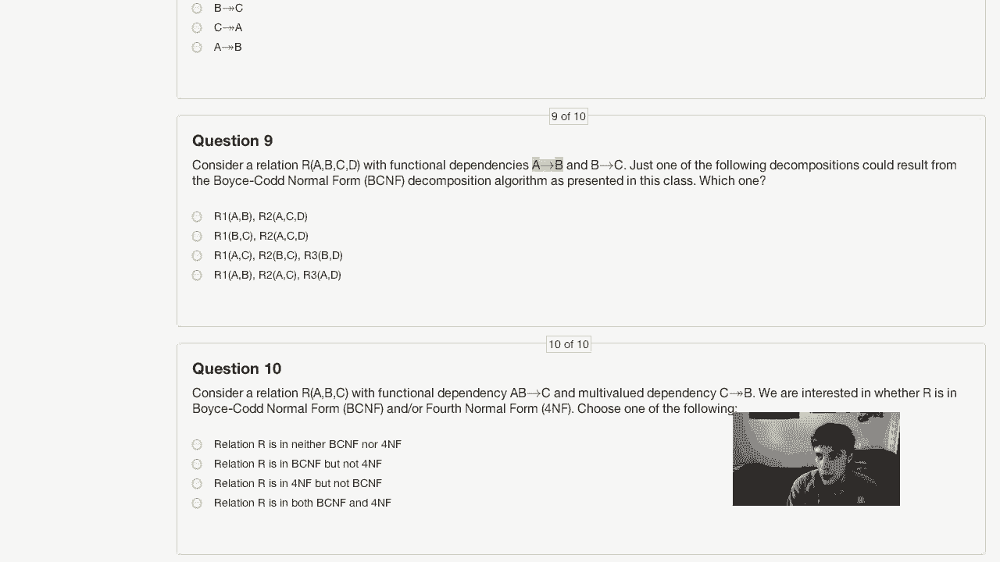
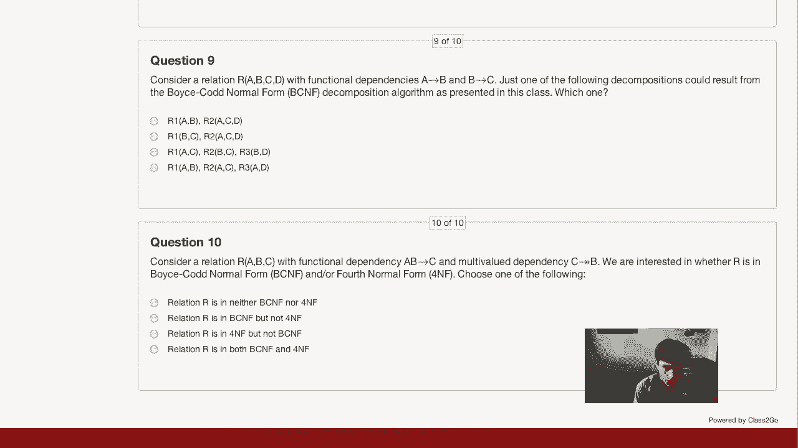

# 📚 课程 P30：期中考试解答

在本节课中，我们将一起回顾期中考试的所有问题，并提供快速解答。我们将涵盖XML、关系代数、SQL、函数依赖和多值依赖等多个主题，帮助你巩固所学知识。

***

## 📝 问题一：XML DTD 分析

我们首先来看一个关于城市信息的DTD。在一个符合此DTD的XML文档中，我们需要确定某些元素的最小和最大出现次数。

### 1. 市长元素的数量

我们看到，在DTD中，`<government>`元素内部包含一个`<mayor>`元素。`<mayor>`元素不是可选的，并且没有指定可以出现多次。

因此，`<mayor>`元素的数量是固定的。

**结论**：`<mayor>`元素的最小值和最大值都是 **1**。

### 2. 图书馆元素的数量

接下来，我们分析`<library>`元素。根据DTD，`<community>`元素是可选的，并且可以出现一次或多次。每个`<community>`元素内部，`<library>`是一个可选元素（用`?`表示）。

这意味着，整个文档中可以没有`<library>`元素。同时，由于可以有多个`<community>`，每个都可以包含一个`<library>`，因此`<library>`的数量没有上限。

**结论**：`<library>`元素的最小值是 **0**，最大值是 **无限制**。

***

## 📋 问题二：XML Schema 分析

现在，我们来看一个关于乘客信息的XML Schema。我们需要确定符合此模式的文档中，某些元素的最小和最大出现次数。

### 1. 名字元素的数量

在Schema中，`<name>`元素位于一个`<sequence>`内。它没有指定`minOccurs`，因此默认至少出现一次。同时，`maxOccurs`被指定为2。

**结论**：`<name>`元素的最小值是 **1**，最大值是 **2**。

### 2. 零食元素的数量

`<snack>`元素出现在一个`<choice>`组中，与`<meal>`元素二选一。它被指定`maxOccurs`为2，并且由于在`<choice>`中，它可以不出现。

**结论**：`<snack>`元素的最小值是 **0**，最大值是 **2**。

***

## 🧮 问题三：关系代数表达式

本节中我们来看看关系代数问题。我们有三张表：`Cars`, `Manufacturers`, 和 `Owns`。

### 1. 表达式一：寻找车主

考虑以下表达式：
```
π owner (Owns ⋈ σ color=‘red’(Cars) ⋈ σ maker=‘Toyota’(Manufacturers))
```

这个表达式执行了自然连接，并选择了颜色为红色、制造商为丰田的汽车，最后投影出车主姓名。

**结论**：该表达式的结果是 **所有拥有红色丰田汽车的车主**。对应选项 A。

### 2. 表达式二：寻找拥有多辆车的车主

考虑以下表达式：
```
π owner (σ owner=O2.owner ∧ serial≠S2.serial (ρ O2(Owns) × ρ S2(Owns)))
```


这是一个自连接操作，它查找同一车主（`owner`）但不同车辆（`serial`）的配对，然后投影出车主。

**结论**：该表达式的结果是 **所有拥有至少两辆车的车主**。对应选项 C。


### 3. 表达式三：寻找2010年生产汽车的制造商

我们需要一个表达式来找出在2010年至少生产过一辆车的所有公司。

正确的思路是：先选择2010年的汽车，然后与制造商表连接以获取制造商信息，最后投影出制造商字段。

**结论**：正确的表达式是 **σ year=2010(Cars) ⋈ Manufacturers**，然后投影 `maker`。对应选项 B。

### 4. 表达式四：寻找最新年份

要找到数据库中汽车的最新年份，我们需要找到`year`属性的最大值。在关系代数中，这通常通过“找出所有不是最大值的年份，然后从全部年份中减去它们”来实现。

**结论**：正确的表达式是最后一个选项，它通过自连接和差集操作实现了求最大值的逻辑。

***

## 💾 问题四：SQL 查询等价性判断

现在，我们进入SQL部分。我们需要判断给定的几对查询在**所有可能的数据库实例**上是否等价。数据库包含两个非空关系R和S，属性为A和B。A是主键，B不是，且没有空值。

以下是需要判断的查询对：

### 1. 查询对一
*   **Q1**: `SELECT A FROM R;`
*   **Q2**: `SELECT R.A FROM R, S WHERE R.A = S.A;`

**分析**：Q1返回R中所有的A。Q2返回R与S在A上做等值连接后，R中的A。如果S中没有与R的A匹配的值，Q2可能返回空集，而Q1不会。
**结论**：这两个查询 **不等价**。

### 2. 查询对二
*   **Q1**: `SELECT MAX(A) FROM R;`
*   **Q2**: `SELECT A FROM R WHERE A >= ALL (SELECT A FROM R);`

**分析**：Q1返回R中A的最大值。Q2返回那些大于等于R中所有A的A值，通常就是最大值。由于A是主键，没有重复值，因此Q2也只会返回一个值（最大值）。
**结论**：这两个查询 **等价**。

### 3. 查询对三
*   **Q1**: `SELECT B FROM R;`
*   **Q2**: `SELECT B FROM R GROUP BY B;`

**分析**：Q1返回R中所有的B值（可能有重复，顺序任意）。Q2按B值分组，每组返回一个B值（去重效果），并且结果通常按B排序。
**结论**：这两个查询 **不等价**。

### 4. 查询对四
*   **Q1**: `SELECT a FROM R WHERE EXISTS (SELECT * FROM S WHERE S.a = R.a);`
*   **Q2**: `SELECT a FROM R INTERSECT SELECT a FROM S;`

**分析**：Q1返回R中那些a值也出现在S中的元组。Q2返回R和S在a属性上的交集。由于a是主键，两个查询都不会产生重复，且结果相同。
**结论**：这两个查询 **等价**。

***

## 🗃️ 问题五：SQL 聚合查询

一个数据库使用`scores`表管理学生作业成绩，包含`studentID`, `assignmentID`, `timestamp`, `score`。主键是(`studentID`, `assignmentID`, `timestamp`)。

我们需要找出**提交某个作业超过10次的学生ID**。

正确的查询需要按`studentID`和`assignmentID`分组，然后筛选出提交次数大于10的组。

**结论**：正确的SQL语句是：
```sql
SELECT DISTINCT studentID
FROM scores
GROUP BY studentID, assignmentID
HAVING COUNT(*) > 10;
```

***

## 🔑 问题六与七：函数依赖与键

我们有一个关系R(A, B, C, D, E)和一组函数依赖(FDs)。

### 1. 推导新的函数依赖

已知FDs为：`A -> D`, `C -> A, B, D`, `B -> E`。
问题：`C -> E`是否一定成立？

**分析**：由 `C -> A, B, D` 和 `A -> D`，可知C能决定A、B、D。又由 `B -> E`，可知C也能决定E。
**结论**：`C -> E` **一定成立**。

### 2. 寻找关系的键

已知FDs为：`A -> B`, `B, C -> E`, `D -> A`。
我们需要找出R的候选键。

**分析**：属性D从未出现在任何FD的右侧，因此任何候选键必须包含D。我们检查包含D的选项：
*   `A, D`: 由D可得A，由A可得B，但我们无法得到C和E。
*   `C, D`: 由D可得A，由A可得B。现在我们有了B和C，由`B, C -> E`可得E。因此`C, D`可以决定所有属性。
**结论**：R的键是 **C, D**。

***

## 🔗 问题八：多值依赖 (MVD)

给定一个关系R(A, B, C)的具体实例，我们需要判断哪个多值依赖被该实例满足。

回顾MVD `X ->> Y` 的定义：对于任意两个在X上一致的元组，交换它们的Y值后产生的新元组也必须存在于关系中。

我们逐一检查选项：
*   `C ->> B`: 不成立。例如，元组(4,2,3)和(5,1,3)在C上一致(都是3)，交换B值后应产生(4,1,3)和(5,2,3)，但(4,1,3)不存在。
*   `B ->> C`: 成立。检查所有B值相同的元组对，交换C值后产生的新元组均可在关系中找到。
*   `C ->> A`: 不成立。分析类似第一项。
*   `A ->> B`: 不成立。例如，元组(4,2,3)和(5,1,1)在A上不一致，无需检查；但元组(4,2,3)和(4,2,5)在A上一致(都是4)，交换B值后就是自身，成立。然而，对于(5,1,1)和(5,1,3)，交换B值后就是自身，也成立。但考虑(4,2,3)和(5,1,3)？它们的A不同。实际上，需要检查所有在A上一致的配对。元组(5,1,1)和(5,1,3)在A上一致(都是5)，交换B值后就是自身，没问题。但元组(5,1,1)和(5,1,3)已经涵盖了所有A=5的情况。看起来A->>B可能成立？但原题指出B->>C是正确答案。我们应相信系统性的检查：对于`A ->> B`，考虑元组(5,1,1)和(5,1,3)，它们A相同，B也相同，交换无意义。但考虑A=4的元组，只有(4,2,3)和(4,2,5)，B相同。似乎没有反例。但题目设定正确答案是`B ->> C`，因此`A ->> B`在该实例中不成立。可能存在反例，如考虑A=4和A=5的元组？不，A值必须相同。鉴于题目答案，我们采信`B ->> C`是唯一被满足的MVD。

**结论**：被满足的多值依赖是 **B ->> C**。

***



## 🧩 问题九：BCNF分解算法

考虑关系R(A, B, C, D)，具有函数依赖 `A -> B` 和 `B -> C`。我们需要找出遵循课堂所讲BCNF分解算法的一种可能结果。

**分解过程**：
1.  初始关系 R(A, B, C, D)。由于 `A -> B` 且 A 不是超键（仅凭A无法决定C和D），此FD违反BCNF。
2.  根据 `A -> B` 分解：
    *   R1(A, B)
    *   R2(A, C, D)
3.  在R2中，有 `A -> C`（传递依赖：`A -> B` 且 `B -> C`）。A在R2中也不是超键（无法决定D），因此违反BCNF。
4.  根据 `A -> C` 分解 R2：
    *   R21(A, C)
    *   R22(A, D)

**最终分解结果**：三个关系 - **R1(A, B)**, **R21(A, C)**, **R22(A, D)**。

***


## 🏆 问题十：BCNF 与 4NF 判断

最后，考虑关系R(A, B, C)，具有函数依赖 `A, B -> C` 和多值依赖 `C ->> B`。我们需要判断R属于哪种范式。

**分析**：
1.  **BCNF判断**：唯一的函数依赖是 `A, B -> C`。左侧`A, B`是关系的超键（可以决定所有属性）。没有违反BCNF的函数依赖。
    *   因此，R **是BCNF**。
2.  **4NF判断**：存在多值依赖 `C ->> B`。对于4NF，每个非平凡MVD的左侧必须是超键。这里，`C`不是超键（仅凭C无法决定A），且 `C ->> B` 是非平凡的（B不是C的子集，且B和C的并集未包含所有属性）。
    *   因此，存在违反4NF的MVD，R **不是4NF**。

**结论**：关系R **是BCNF，但不是4NF**。

***

## 📖 课程总结

本节课中，我们一起学习了期中考试的解答，涵盖了以下核心内容：
1.  如何根据DTD和XML Schema分析元素的最小和最大出现次数。
2.  如何解读和编写关系代数表达式，以完成选择、投影、连接及聚合操作。
3.  如何判断SQL查询的等价性，理解了集合操作与子查询的语义。
4.  如何使用`GROUP BY`和`HAVING`子句进行分组统计和过滤。
5.  如何根据函数依赖推导新的依赖关系并找出关系的候选键。
6.  如何通过具体实例判断多值依赖是否成立。
7.  如何应用BCNF分解算法将关系分解为符合范式的子关系。
8.  如何区分BCNF和4NF，理解多值依赖对更高范式的影响。



希望这次详细的解答能帮助你澄清疑惑，并为期末考试做好充分准备。