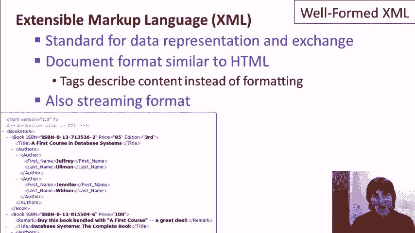
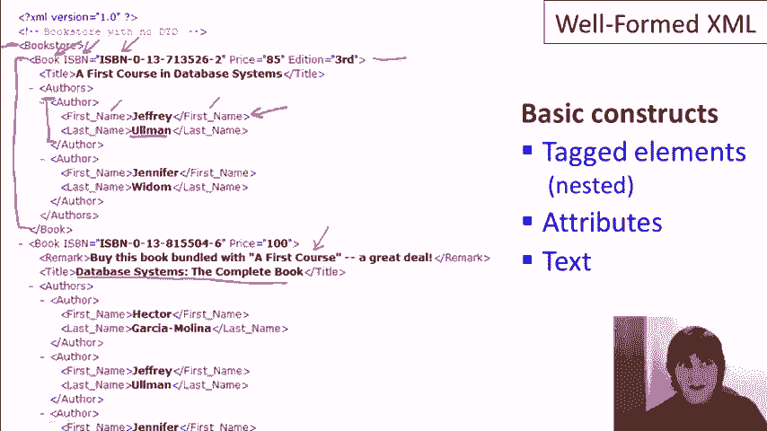
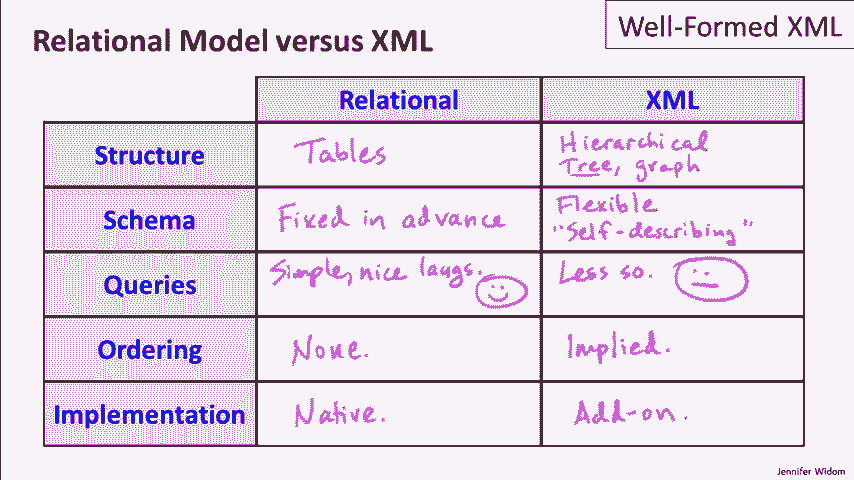
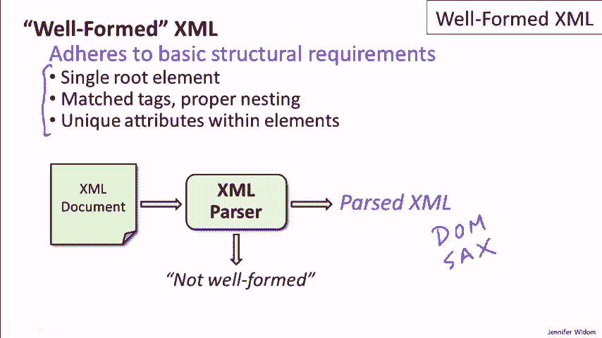
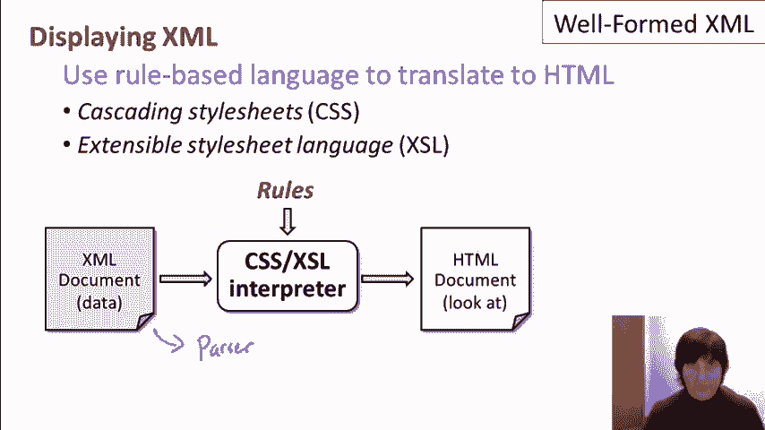

# P4：03-01-well-formed-xml.mp4 - 哈库那玛塔塔i - BV1R4411u7dt

这段视频介绍了XML的基础知识。XML可以被看作是一种数据模型，是关系模型的替代方案，用于结构化数据。除了介绍XML外，我们还将其与关系模型进行比较，尽管观看关系模型的视频并不是必需的。

为了从中提取信息。XML的全称是可扩展标记语言。XML是一种用于数据表示和交换的标准，它最初是为互联网信息交换设计的。现在，如果你无法读懂视频角落里的这段小文字，也不用担心。

目前你不需要掌握这些内容。XML可以被认为是一种文档格式，类似于HTML，如果你熟悉HTML的话。大多数人都知道HTML。最大的区别在于，HTML文档中的标签描述的是数据的内容，而不是数据的格式。

这正是HTML标签所代表的内容。XML还具有流格式或流标准，通常用于程序中发出XML数据。

以及如何使用XML。那么现在我们来看一下XML数据本身。你可以在视频的左侧看到一部分XML文档。整个文档可以从课程网站上获取。XML有三个基本组件，再次强调，非常类似于HTML。第一个是标签元素。例如。

让我们来看一下这个元素。它表示这里的数据是一个名字。我们有一个开标签，也有一个匹配的闭标签。我们还有元素的嵌套。例如，这里我们有一个作者（author）元素。这里是开标签，这里是闭标签，我们有名（first name）和姓（last name）元素的嵌套。

更大一些，我们这里有一个书籍元素，包含了开标签和闭标签，并且许多元素嵌套在其中。整个文档实际上是一个元素，它的开标签是book store，闭标签在视频中看不见。所以元素的组成包括：开标签、文本或其他子元素、闭标签。此外，我们还有属性。

因此，每个元素可能在其开标签内包含一组属性，下面我们来看一下这里的书籍元素。一个属性由属性名、等号和属性值组成。所以我们这里的书籍元素有三个属性，一个叫做ISBN，一个叫做price，另一个叫做addition。任何元素都可以有任意数量的属性，只要属性名是唯一的。

最后，XML的第三个组成部分是文本本身，如这里的黑色部分所示。所以对于一个元素，我们可以有字符串。我们这里有“杏仁”这个字符串。我们这里有一个标题。这里我们有一个备注。所以一般来说，如果你将XML看作一棵树，字符串或文本形成了树的叶子元素。所以再一次。

这就是XML的三个主要组成部分。看起来很像HTML，只是标签描述的是数据的内容。

而不是如何格式化它。现在让我们花些时间将关系模型与XML进行比较。同样，了解关系模型并不是至关重要的，如果你不感兴趣，可以跳过这部分内容。但在许多情况下，当你设计一个处理数据的应用程序时。

你可能需要做出决定，是否要使用关系数据库，或者是否希望将数据存储为XML。所以让我们看看数据的几个不同方面，以及它如何被使用，以及关系模型和XML之间的比较。让我们从数据本身的结构开始学习。所以如我们所知，关系模型中的结构基本上是一组表格。

所以我们定义了一组列，并且我们有一组行。XML通常，依然是以文档或字符串格式呈现，但如果你考虑到结构本身，结构是层次化的。嵌套的元素形成了一个层次或树形结构。有一些构造实际上允许我们在文档中插入链接。

所以你也可以使用XML表示图形，尽管通常情况下，它被认为是树形结构。接下来，让我们谈谈模式。在关系模型中，模式非常重要。你在设计数据库时提前固定好模式，然后再添加符合模式的数据。现在在XML中，你有更多的灵活性。

所以模式是灵活的。事实上，很多人称XML为自描述的。换句话说，模式和数据是混合在一起的。元素上的标签告诉你你所拥有的数据类型，而且你可以有很多不规则性。现在我会说，XML中有机制可以引入模式。

但它们不是强制性的。在关系模型中，模式是绝对必需的。在XML中，模式更多是可选的。特别是，让我们回过头来看一下我们的例子，我们会看到我们的例子中有一些结构，但并不是每一部分都像在关系模型中那样完全结构化。

所以回到这里看一下，首先，我们有这种情况。在这本第一本书中，我们有一个属性叫做“版本”，是第三版。而在第二本书中，我们只有两个属性，所以这本书没有版本。在关系模型中，我们必须为版本添加一列。

我们每本书都会有一个，但当然，某些书可能没有版本。在XML中，某些元素可以有一些属性，而这些属性在其他元素中并不存在，这是完全可以接受的。这是另一个例子，我们在一本书中有一个组件，而在另一本书中没有。

这是那个备注组件。所以，这里我们有一本书，其中恰好有一个备注，顺便提一下，你可以看到这个备注建议我们将完整的书与第一门课程一起购买。第一门课程是一个子集，所以这个建议不太好，尽管亚马逊确实做出了这个建议。好了，废话不多说。

我们看到第一本书有一个备注，而第二本书没有备注，这在XML中完全不是问题。

在关系模型中，我们仍然需要使用空值来表示这种情况。我想给出的第三个例子是作者数量。所以，这本书有两位作者。第二本书，虽然你看不全，但它有三位作者，这在XML中没有问题，拥有不同数量的元素是完全标准的做法。

主要的观点是，在XML的架构方面有很大的灵活性。你可以创建一个包含某些类型元素的数据库，后来可以添加更多元素，移除元素，或者引入结构上的不一致，这些都不会是问题。再说一遍，我要提到的是，有一些机制可以向XML添加类似架构的元素。

或者说是类似架构的规范到XML中。实际上，我们将在接下来的两个视频中讨论这些内容。接下来，我们来谈谈如何查询这些数据。对于关系模型，我们有关系代数，有SQL。这些语言相对简单，漂亮，我觉得它们是很不错的语言。虽然这有点主观看法，但我会给它们一个笑脸。

XML查询有点棘手。现在，这里有一个因素，那就是XML比关系模型新得多，查询XML的技术仍在逐步成熟。但我要说的是，你知道，XML查询的语言稍微复杂一些，所以我会给它一个中立的评价。

在后续的视频中，我们将花些时间学习一些这些语言。我们图表中的下一个方面是排序问题。所以，关系模型本质上是一个无序模型。实际上，在某些数据应用中，这有时可以被视为一个不利因素。能够进行排序是很好的。我们在SQL中学习了`ORDER BY`子句。

这是一种获取排序查询结果的方法。但从根本上讲，关系数据库中表里的数据是一组没有排序的数据。现在，在XML中，我们可以说有一种隐含的排序。所以，正如我所说，XML既可以被看作是文档模型，也可以是流模型。在这两种情况下，

就是文档中呈现的 XML 本质，像我们这里展示的，或者在流中的 XML，会引发一个顺序。非常具体地来说，让我们看看这里的作者。所以这里有两个作者，而这些作者在文档中并没有按顺序排列。如果我们将这些作者放入关系型数据库中，它们将没有顺序。

它们可以以任何顺序出现，除非我们在查询中使用了 `order by` 子句，而在 XML 中，文档结构所隐含的是一个顺序。并且这两本书之间也有顺序。有时这个顺序是有意义的，有时没有，但它可以在应用程序中使用。最后，让我们谈谈实现。

正如我在之前的视频中提到的，关系模型已经存在了至少 35 年，而实现该模型的系统也几乎同样长久。它们是非常成熟的系统，关系模型是系统的原生模型，并且被广泛应用。而 XML 的情况有些不同。部分原因是 XML 并没有存在这么久。

但目前 XML 和传统数据库系统的情况是，XML 通常是一个附加组件。所以在大多数系统中，XML 会作为关系数据库系统上的一层。你可以以 XML 格式输入数据，也可以以 XML 格式查询数据。它将被转换为关系实现。这不一定是坏事。

它确实允许你在一个系统中结合关系数据和 XML，有时甚至在一个查询中实现这一点，但它不是系统本身的原生模型。

现在，你可能注意到这个视频的名字是“结构良好的 XML”。那么，结构良好的 XML 实际上是最灵活的 XML。如果 XML 文档或 XML 流符合 XML 的基本结构要求，那么它被认为是结构良好的，并且有许多要求，只要我们有一个根元素，就像我们之前讨论过的那样。

在这种情况下，单一书店中的所有标签都匹配。我们没有没有闭合标签的开放标签，且标签正确嵌套。所以我们没有元素交错的情况。最后，在每个元素内，如果我们有属性名，它们是唯一的。就是这些。

这就是我们要求 XML 文档或一组 XML 数据被认为是结构良好的条件。对于许多应用来说，这就是我们所关心的。为了测试一个文档是否是结构良好的，并特别是在程序中访问文档的组成部分。

我们有一个叫做 XML 解析器的东西。我们将拿一个 XML 文档，传给 XML 解析器，解析器会检查元素的基本结构，抱歉，是文档的结构，确保一切正常。如果文档不符合上面提到的这三个要求。

解析器会直接报错，提示文档不符合格式。如果文档符合结构要求，输出的将是解析后的 XML。而且，对于如何显示解析后的 XML，有多种标准。一种是文档对象模型（DOM）。它是一个程序接口，用于遍历 XML 所隐含的树状结构。

另一个流行的标准是 SACS。它是 XML 的一种流模式。所以这些是程序在解析器输出解析后 XML 时访问该 XML 的方式。

所以一个常见的问题是，由于 XML 数据在互联网上被广泛使用，我们如何展示 XML。显然，展示 XML 的一种方式就是像我们这里看到的那样展示它，但是我们通常希望以更直观的方式来格式化 XML 文档或 XML 流中的数据。实际上，有一种不错的设置方法可以做到这一点。

我们可以使用一种基于规则的语言，将 XML 自动转换为 HTML，然后在浏览器中呈现。几种流行的语言是层叠样式表，简称 CSS，或者可扩展样式表语言，简称 XSL。我们将在后续视频中讨论 XSL，重点是如何查询 XML。

本课程不会讨论 CSS，但我们要理解这些语言是如何使用的，基本的结构是什么。基本思想是，我们有一个 XML 文档，然后将其发送到 CSS 或 XSL 的解释器。不过，我们还需要定义在特定文档上使用的规则。这些规则会做一些事情，比如匹配模式或添加额外的命令。

一旦我们将 XML 文档发送给解释器，我们就会得到一个 HTML 文档，然后我们可以在浏览器中呈现该文档。现在有一点我需要提到的是，在将其转换为 HTML 之前，我们还会检查解析器，确保文档格式良好。

总结来说，XML 是一种数据表示和交换的标准。它也可以被视为一种数据模型，某种程度上它是关系模型的竞争者，用来结构化应用中的数据。与关系模型相比，它通常具有更多的灵活性，这既是优点也是缺点。在本视频中，我们讨论了格式良好的 XML。

所以符合基本结构要求的 XML。在下一个视频中，我们将讨论有效的 XML，在那里我们实际上会引入 XML 的某种模式。最后我想提到的是，XML 的正式规范相当庞大。在这些视频中，我们将覆盖理解和使用 XML 所需的最重要的组件，而不包括其中的许多附加功能。

