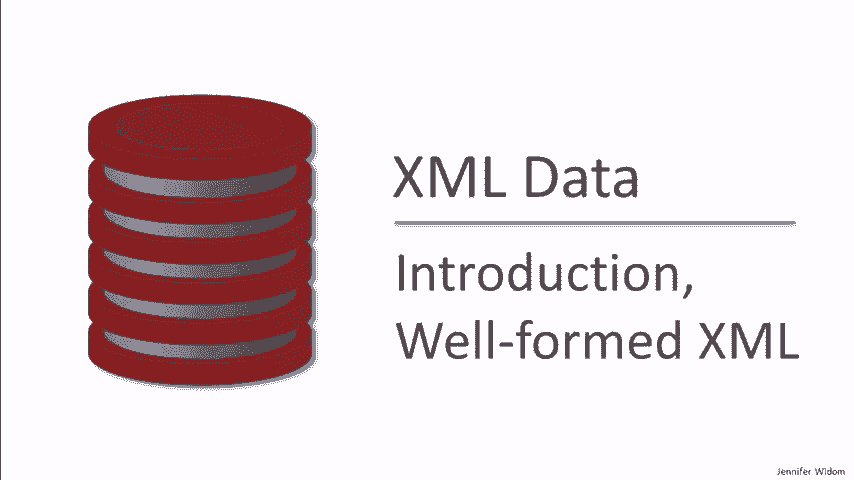
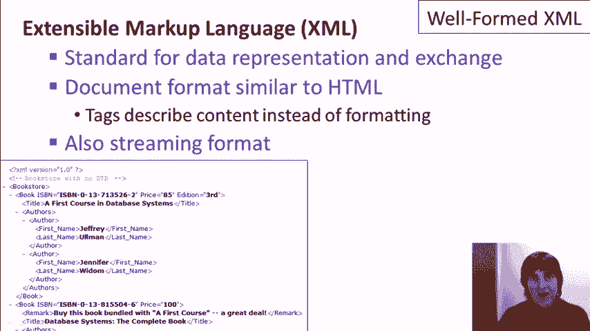
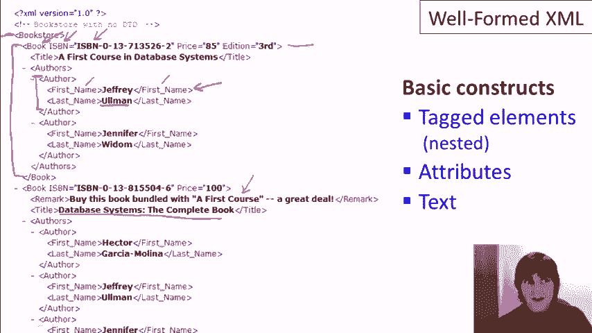
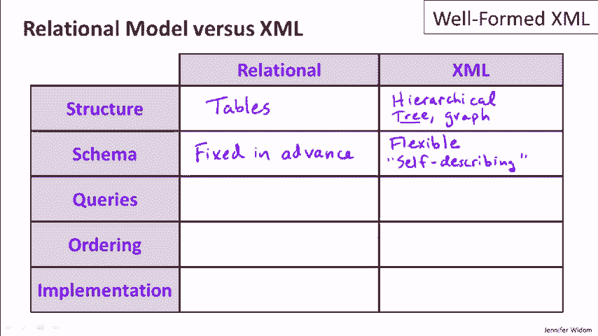
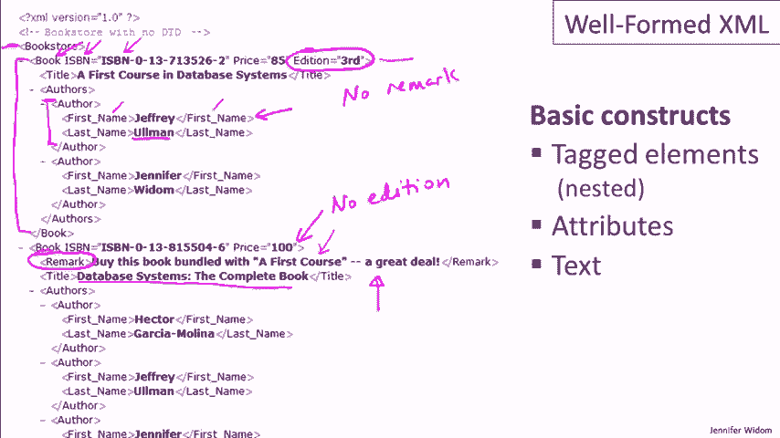
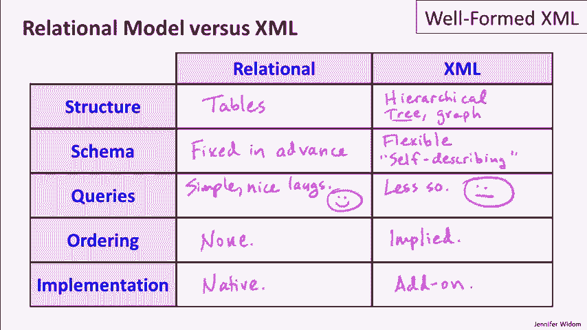
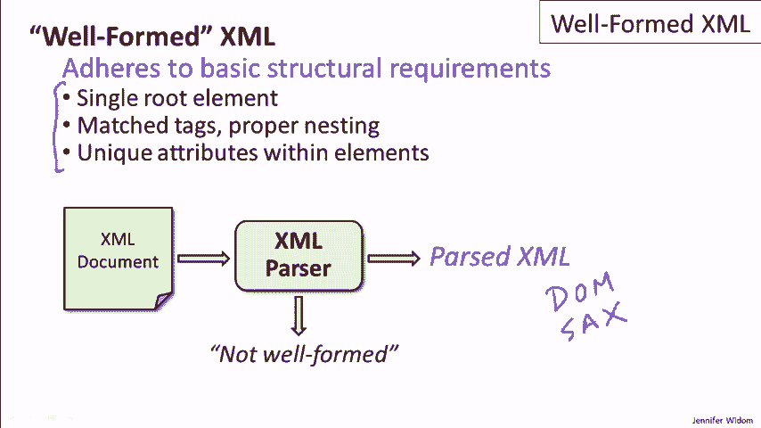
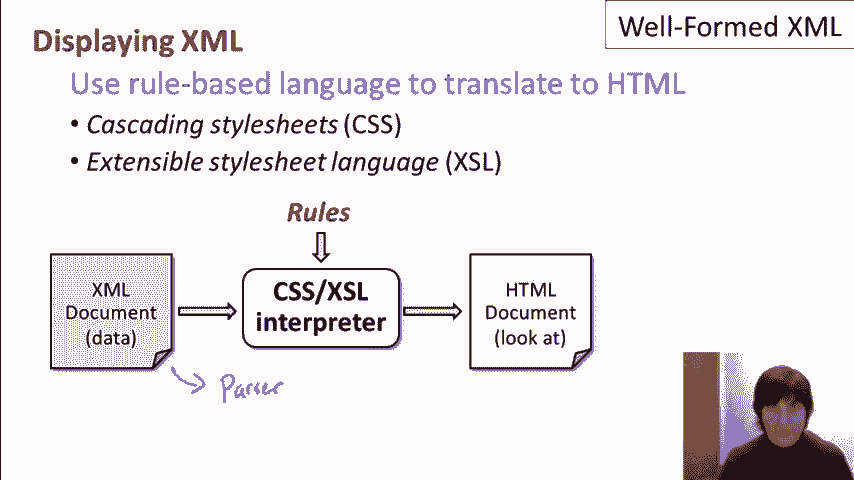
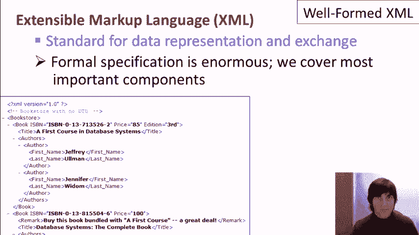

# 课程 P4-03-01：结构良好的 XML 📖



在本节课中，我们将要学习 XML 的基础知识。XML 是一种重要的数据表示和交换标准，可以作为关系模型的替代方案来结构化数据。我们将介绍 XML 的核心组成部分，并将其与关系模型进行比较，帮助你理解两者的区别和适用场景。

## 概述：什么是 XML？



XML 的全称是可扩展标记语言。它是一种用于数据表示和交换的标准，最初为互联网信息交换而设计。XML 可以被看作是一种数据模型，也是一种文档格式，类似于 HTML。但与 HTML 不同，XML 的标签描述的是数据的内容，而非数据的格式。此外，XML 也常作为一种流格式，在程序间传输数据。

## XML 的核心组成部分 🧱

XML 文档由三个基本组件构成，它们共同定义了数据的结构和含义。

### 1. 标签与元素

元素是 XML 的基本构建块，由开标签、内容和闭标签组成。例如，一个表示名字的元素如下所示：



```xml
<firstname>杏仁</firstname>
```

元素可以嵌套，形成层次结构。例如，一个 `author` 元素可以包含 `firstname` 和 `lastname` 子元素。

### 2. 属性

属性提供了关于元素的额外信息，位于元素的开标签内。一个属性由属性名和属性值组成，格式为 `name=“value”`。一个元素可以有多个属性，但属性名必须唯一。



```xml
<book ISBN=“123456” price=“29.99” edition=“3”>
```

### 3. 文本内容

文本是元素的实际数据内容，构成了 XML 树的叶子节点。例如，在 `<title>` 和 `</title>` 标签之间的“杏仁”就是文本内容。



综上所述，XML 的结构可以看作一棵树，其中元素是节点，属性是节点的附加信息，文本是叶子节点。

## XML 与关系模型的比较 ⚖️

上一节我们介绍了 XML 的结构，本节中我们来看看它与传统的关系模型有何不同。了解这些差异有助于你在设计应用时选择合适的方案。

以下是两者在几个关键方面的对比：

*   **数据结构**
    *   **关系模型**：数据以表格形式组织，包含行和列，结构扁平。
    *   **XML**：数据以嵌套的标签元素组织，形成层次化或树形结构，更灵活。

*   **模式（Schema）**
    *   **关系模型**：模式是严格且必须预先定义的，所有数据必须符合模式。
    *   **XML**：模式是灵活且可选的。数据和描述（标签）混合在一起，允许结构上的不一致性（例如，某些元素可有可无，元素数量可变）。

*   **查询语言**
    *   **关系模型**：使用 SQL 或关系代数，语言成熟且相对简单。
    *   **XML**：查询语言（如 XPath、XQuery）稍显复杂，技术仍在发展中。

*   **数据顺序**
    *   **关系模型**：表中的数据本质上是无序的集合。
    *   **XML**：文档或流中元素的出现顺序隐含了一种排序，这个顺序可以被应用程序利用。

*   **实现与成熟度**
    *   **关系模型**：已有数十年历史，拥有非常成熟和高效的数据库系统实现。
    *   **XML**：相对较新，在传统数据库中常作为附加层实现，而非原生模型。



## 什么是结构良好的 XML？✅

“结构良好”是 XML 最基本的要求。一个 XML 文档或数据流如果满足以下所有条件，就被认为是结构良好的：

1.  **有且仅有一个根元素**：所有其他元素都必须嵌套在这个根元素之内。
2.  **标签正确匹配与嵌套**：每个开标签都必须有对应的闭标签，且标签之间不能交错。
3.  **属性名唯一**：在同一个元素内，每个属性名只能出现一次。

程序通过 **XML 解析器** 来检查 XML 是否结构良好。如果不符合要求，解析器会报错；如果符合，解析器会输出解析后的 XML 树，供程序通过 **DOM（文档对象模型）** 或 **SAX（流式 API）** 等标准接口进行访问和处理。



## XML 的展示与样式 🎨

由于 XML 关注内容而非格式，直接查看原始 XML 文档可能不够直观。为了在浏览器等环境中更好地展示 XML 数据，通常需要将其转换为更友好的格式（如 HTML）。

以下是实现此转换的常见方法：

*   **CSS**：层叠样式表，可以为 XML 元素定义简单的显示规则。
*   **XSL**：可扩展样式表语言，功能更强大，可以将 XML 转换为 HTML 或其他格式。其基本流程是：XML 文档经过解析器检查后，由 XSL 处理器根据预定义的规则集将其转换为 HTML，最终在浏览器中渲染。



## 总结 📝

本节课中我们一起学习了 XML 的基础知识。XML 是一种用于数据表示和交换的灵活标准，它采用层次化的标签结构来描述数据内容。我们了解了 XML 的核心组成部分（元素、属性、文本），并将其与关系模型在结构、模式、查询等方面进行了比较。我们还明确了“结构良好”的 XML 所需满足的三个基本条件，并简要介绍了如何通过样式表（如 XSL）来展示 XML 数据。



记住，结构良好的 XML 提供了最大的灵活性，是使用 XML 的起点。在接下来的课程中，我们将探讨如何为 XML 引入更严格的模式定义（有效的 XML），以及如何查询 XML 数据。