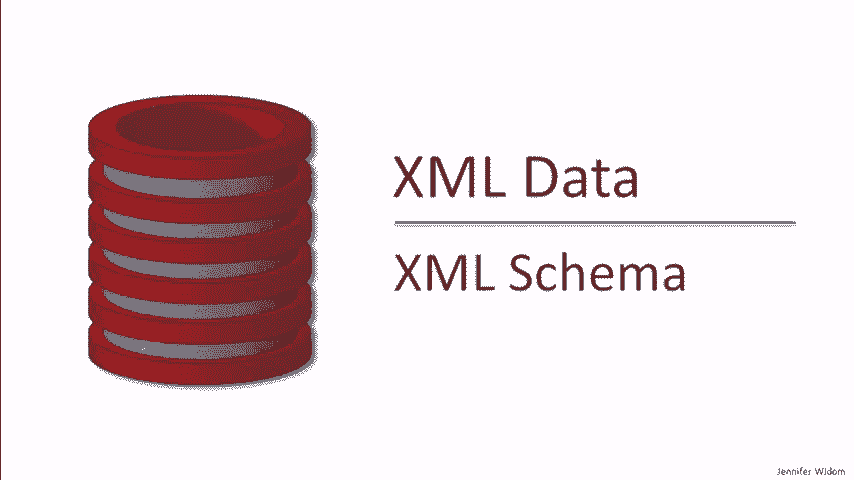
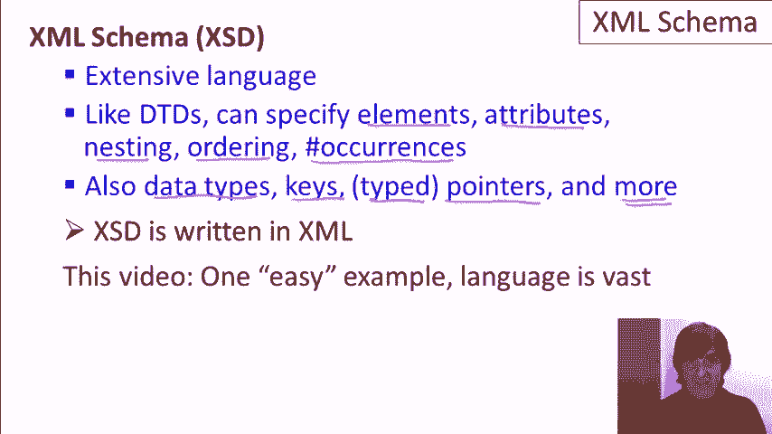

# P5：03-03-xml-schema.mp4 - 哈库那玛塔塔i - BV1R4411u7dt

在本视频中，我们将学习XML模式。

与文档类型描述符（DTD）类似，XML模式为我们提供了一种为XML数据指定内容特定规范的方式。正如你可能记得的那样，我们将XML文档以及描述文件发送给一个验证XML解析器。我们在上一视频中讨论了DTD，这次我们将讨论XSD。验证XML解析器会检查文档是否符合规范。

它还会检查文档是否符合其规范。如果符合，解析将成功。如果不符合，我们将收到一个错误，提示文档无效。

XML模式是一种广泛且功能强大的语言。像文档类型描述符（DTD）一样，我们可以在XML数据中指定我们需要的元素、属性、元素的嵌套结构、元素需要的顺序以及元素的出现次数。此外，我们还可以指定数据类型，可以指定键。我们现在能够指定的指针是有类型的。

与DTD不同，XML模式有很多，很多其他特性。现在，XML模式和DTD之间的一个区别是，XML模式中的规范（称为XSD）实际上是用XML语言本身编写的。这在某些情况下是非常有用的，例如，如果我们有一个可以很好渲染XML的浏览器。正如我所说，XML语言非常庞大。在本视频中，我们将展示一种“简单”的示例，但这个示例能够很好地体现XML的特性。

我们将尝试突出XML模式与使用文档类型描述符之间的区别。

好的，左边是我们的XML文档，右边是我们的XML模式描述符，或者说XSD，我们有一个小命令行将用于验证命令。现在，让我提前说明一下，我们不会像讨论DTD时那样逐行详细讲解XSD。正如你所看到的，它相当长，要逐行讲解会花费我们太多时间，坦率地说也会非常枯燥。

所以我强烈建议你下载XSD文件，这样你可以自己查看整个文件以及XML内容，并尝试进行验证。在本次演示中，我主要会关注XSD中与文档类型描述符不同、更强大的方面。首先。

让我们来看一下数据本身。所以我们有我们的书店数据，像往常一样，包含两本书和三位作者。与我们之前使用过的版本稍有不同。它看起来最接近我们上次使用的版本，因为书籍和作者是分开的，且作者的内容实际上是完全相同的。他们有一个标识符和名字、姓氏。

子元素。主要的区别在于书籍中。我们不再使用IDRETs属性来引用书籍与作者之间的关系，而是通过添加一个作者的子元素，下面有两个作者元素，然后这些作者元素本身实际上是指向作者标识符的指针。

我们将看到这与我们用于此文件的XML Schema描述符如何融合。另一个我想提到的是，现在我们将XML Schema描述符放在一个文件中，而XML放在另一个文件中。你可能还记得，对于DTD，我们只是将DTD规范放在文件顶部与XML一起。对于DTD，你可以选择将其放在同一个文件中，也可以放在一个单独的文件中。

对于XSD，我们总是将这些放在一个单独的文件中。还请注意，XSD本身是XML格式的。它使用的是特殊标签。这些标签是XSD语言的一部分，但我们仍然是以XML表达它。因此，我们有两个XML文件，一个是数据文件，一个是模式文件。为了将数据文件与模式文件进行验证，我们可以再次使用XML lint功能。

我们指定了模式文件、数据文件，当我们执行命令时，可以看到文件成功验证。因此，我现在要重点介绍XML Schema中有的而DTD中没有的四个特性。其中之一是类型值。另一个是键声明，类似于ID，但更强大。还有一个是引用，它们同样类似于指针，但更强大，最后是发生约束。

现在让我们从类型开始。在我们的数据中，我们看到price属性被标记为字符串，而在DTD中，所有属性值实际上都是字符串。在XSD中，我们可以说我们要检查这些看起来像字符串的值，是否符合特定的类型。

例如，我们可以说price必须是一个整数。同样，我不会详细说明语法细节，而是重点指出XSD中声明有趣内容的位置。具体来说，这里是我们声明price属性的地方，并且我们说price的类型必须是整数。所以我们的文档正确验证了，如果我们把这个100改为foo会怎样呢？

当然，如果使用DTD的话，应该没问题，因为所有属性都被视为字符串，但如果我们现在尝试进行验证，就会看到一个错误，特别是foo不是正确类型的值。所以让我们把foo改回100，这样我们就可以正确验证了。接下来我们来谈谈键。

在DTD中，我们能够指定ID。ID是全局唯一的值，可以用来标识特定的元素。例如，当我们想使用ID RATS来指向那些元素时。键则更为强大或更具体。我应该这么说。如果你考虑关系模型，关系模型中的键是一个属性或一组属性，它们在表中的每个元组中必须是唯一的。

现在我们没有表格或元组，但我们有元素，并且我们经常有重复的元素。因此，我们可以类似地指定一个特定的属性或组件在同一类型的每个元素中必须是唯一的。在我们的规范中，我们有两个键，一个是书籍的键，另一个是作者的键。具体来说，我们规定书籍的 ISBN 属性必须是一个键，而作者的 ident 属性必须是一个键。

所以让我们看看我们的数据，从作者开始。如果我们将例如 GU 改为 HG，那么我们应该会得到一个键冲突，因为我们将有两个作者具有相同的 ident 属性。让我们尝试验证。事实上，我们确实正确地得到了键验证错误。我们还会得到几个其他错误，这些错误与我们使用这些身份作为有效指针或引用的目的地有关。

所以让我们把它改回 GU，确保现在一切都能正确验证，结果是正确的。接下来我们做另一个更改。我们有 ident 作为这里的键，并且我们有 ISBN 号作为书籍的键。如果我们将 ISBN 号更改为我们之前用作作者键的值，比如 HG，会发生什么呢？当我们在 DTD 中做类似的事情时，我们会得到一个错误，因为在 DTD 中，ID 必须是全局唯一的。

在这里我们应该不会出现错误。HG 应该是一个合理的书籍键，因为我们没有其他相同的值。实际上它确实是有效的。现在让我们撤销这个更改。接下来我们来谈谈引用。引用允许我们通过 DTD 使用有效的类型化指针。所以它们被称为键引用（key ref），这里有一个示例。

让我把它改到文档的中间。所以我们在 DTD 中定义的引用类型之一是指向我们在书籍中使用的作者的指针。具体来说，我们想要指定这个属性，auth ident，必须是指向作者元素的键。我们要确保它指向的是作者元素，而不是其他类型的元素。

现在，在 XML Schema 中进行这种操作的语法相当详细。它都在这里，为了让你大致了解，这里间隔选择器实际上使用的是我们稍后会学习的 X-path 语言。但它所说的是，当我们在文档中导航到其中一个 auth 元素时，在该 auth 元素中，auth ident 属性是一个引用，指向我们已经定义的作者键。我们在书籍中也做过类似的事情。我们有 book/remark/book ref，它将我们带到这个元素，然后在这里我们指定书籍属性必须是指向书籍键的引用。

书籍键之前被定义为 ISBN 号。同样，我知道这非常复杂，语法也很繁琐，所以我建议你下载规范并花时间自行查看。现在让我们对文档做一些修改，演示这些类型化指针检查是如何工作的。例如，我们将这里的第一个引用改为 foo。

让我们验证一下文档，应该会出现一个错误，确实如此，作者键引用不正确。现在让我们将那个 foo 改为 JW。原来是 JU，但现在我们有两个作者，他们都指向 JW。这个应该没有问题。这只是两个指向同一个作者的引用，而且在我们的 XML 模式规范中并没有禁止这样做，文档也验证通过了。我们将把这个改回来，最后的修改是将我们的书籍引用更改为指向 JW。

这不应该通过验证，因为这次与 DTD 不同，我们实际上指定了类型化的指针。换句话说，我们指定了这个指针或这个引用必须指向一个书籍元素，而不是一个作者元素。所以我们进行验证，确实验证失败了。我已经做了这个修改，现在让我们继续看一下在这个演示中我们将要查看的最后一个特性，即出现约束。让我先展示一下它的第一个实例。

在 XML 模式中，我们可以指定一个元素类型允许出现的次数。具体来说，我们可以指定最小出现次数和最大出现次数。默认情况下，如果我们没有为元素指定 minOccurs 或 maxOccurs，那么它们的默认值都是 1。所以这里对于书籍我们说可以有零本书，也可以有任意数量的书籍。

这是最大灵活性，任何数量的元素。对于作者，我们也说了可以有任何数量的作者。这是在实际数据库中。记住，我们的书店由一组书籍和一组作者组成。但我们将为每本书中有多少作者指定一些不同的内容。

所以让我们继续查看其他指定了出现约束的情况。这是指定书籍中有多少作者的情况。同样，这里确实有很多 XML 内容，所以请在查看时耐心一些，或者暂时相信我的话。我们在这里指定的是有多少个子元素。

每个作者元素中有多少个子元素。在这里我们没有指定 minOccurs，只指定了 maxOccurs。这意味着默认情况下 minOccurs 为 1。所以这具体意味着每本书在其作者子元素中至少有一个作者，但可以有任意数量的作者。这就是字符串“unbounded”。

看一下剩下的出现次数约束，对于备注我们规定了最小出现次数为零。换句话说，我们不一定要有备注，并且我们没有指定最大出现次数。所以默认的最大出现次数是 1。我们这里的意思是每本书可以没有备注，或者只有一个备注，但不能有超过一个的备注。接下来，你可以继续浏览 XML 模式描述，查看一些其他的出现次数约束。

现在，让我们对文档做些修改，来测试这些出现次数约束。首先，先把第一本书中的作者部分删除。我们不会删除整个 author 子元素，而是只删除其中的两个 off 子元素。我们尝试进行验证，结果发现它没有通过验证。因为缺少了一些子元素，特别是 off 子元素，因为我们预期至少应该有一个。

顺便提一下，如果我们把整个 author 子元素去掉，系统也会报错，因为我们规定了书籍必须包含 author 子元素。所以现在我们缺少了这本书的整个作者结构，结果无法验证。让我们把作者部分加回来。现在我们来看看备注出现次数的约束。

我们规定每本书可以有零个或一个备注。那么让我们再为这本书添加一个备注。嗨，实际上备注是允许为空的。不管怎样，我们添加了一个小备注。我们验证后发现，备注的数量超出了规定，因为我们规定了每本书最多只能有一个备注。所以这就是我们对 XML 模式的演示。再次提醒，这只是一个相当简略的演示。

我们只讨论了其中的一些构造，但我确实集中讲解了在 XML 模式中有而 DTD 中没有规定的构造。最后，再次提醒你下载 XSD 和文档并自己进行实验。
