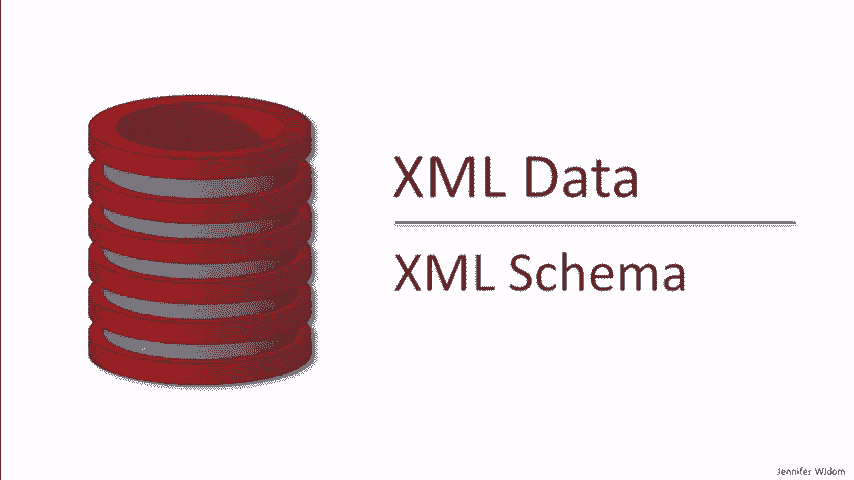
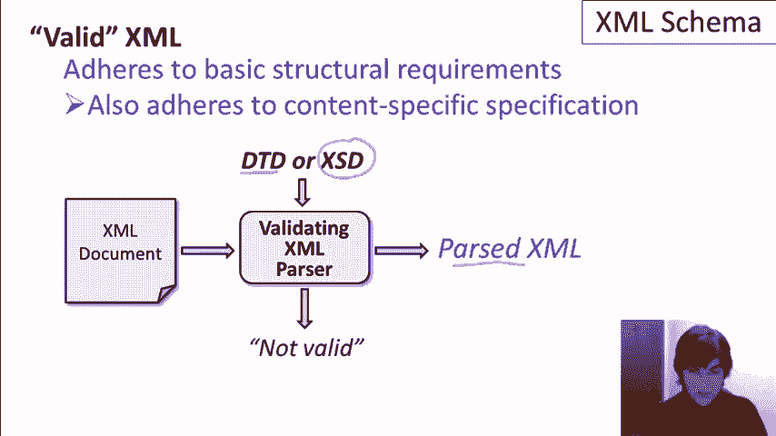
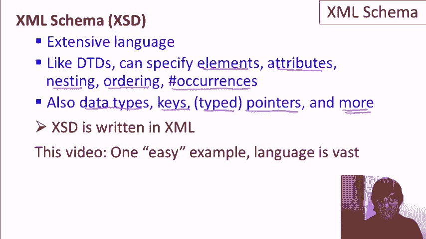

# 课程 P5：XML Schema 入门教程 🗂️

在本课程中，我们将学习 XML Schema（XSD），这是一种用于定义和验证 XML 文档结构和内容的强大语言。我们将了解其核心概念、基本语法，并通过示例演示其关键特性。



---

## 概述

XML Schema 与 DTD 类似，为 XML 数据提供了内容规范的描述方式。我们将 XML 文档及其模式描述文件发送给验证解析器，解析器会检查文档是否符合规范。如果符合，解析成功；如果不符合，则会报告文档无效。



与 DTD 相比，XML Schema 功能更强大，它允许我们指定数据类型、键约束、类型化引用以及元素出现次数等。此外，XML Schema 规范本身是用 XML 语言编写的。

---

## XML Schema 的核心特性

上一节我们介绍了 XML Schema 的基本概念，本节中我们来看看它的几个核心特性。以下是 XML Schema 相较于 DTD 的主要增强功能：

1.  **数据类型**：可以为元素和属性指定具体的数据类型（如整数、字符串），而不仅仅是字符串。
2.  **键声明**：可以定义类似关系数据库中主键的唯一性约束。
3.  **键引用**：可以定义类型化的指针，确保引用指向特定类型的元素。
4.  **出现次数约束**：可以精确控制元素出现的次数范围。

---

## 数据类型

在 DTD 中，所有属性值本质上都是字符串。XML Schema 允许我们为属性指定具体的数据类型。

例如，我们可以规定 `price` 属性必须是整数类型。在 XSD 中，相应的声明可能如下所示：

```xml
<xs:attribute name="price" type="xs:integer" use="required"/>
```

如果 XML 文档中的 `price` 值不是整数（例如是 “foo”），验证将会失败并报错。

---

## 键声明

键（Key）类似于 DTD 中的 ID，但功能更强大。它可以确保某个属性或元素值在特定范围内是唯一的。

例如，我们可以声明书籍的 `ISBN` 属性和作者的 `ident` 属性为键：

```xml
<xs:key name="bookKey">
  <xs:selector xpath="book"/>
  <xs:field xpath="@ISBN"/>
</xs:key>
<xs:key name="authorKey">
  <xs:selector xpath="author"/>
  <xs:field xpath="@ident"/>
</xs:key>
```

如果两个作者具有相同的 `ident` 值，验证将失败，提示键冲突。

---

## 键引用

键引用（Keyref）用于创建类型化的指针，确保引用指向已定义的键。这比 DTD 中的 IDREF 更严格，因为它可以指定引用的目标类型。

例如，书籍中引用作者的 `authIdent` 属性，必须指向一个已定义的作者键：

```xml
<xs:keyref name="authorRef" refer="authorKey">
  <xs:selector xpath="book/authors/author"/>
  <xs:field xpath="@authIdent"/>
</xs:keyref>
```

如果 `authIdent` 的值指向一个不存在的作者，或者指向一个非作者元素（如书籍），验证将会失败。

---

## 出现次数约束

XML Schema 允许我们通过 `minOccurs` 和 `maxOccurs` 属性来精确控制子元素出现的次数。

以下是几个常见的约束示例：

*   **默认情况**：未指定时，`minOccurs` 和 `maxOccurs` 默认为 1。
*   **零个或多个**：`minOccurs="0"` 和 `maxOccurs="unbounded"`。
*   **至少一个**：`minOccurs="1"` 和 `maxOccurs="unbounded"`。
*   **零个或一个**：`minOccurs="0"` 和 `maxOccurs="1"`。

例如，规定每本书必须至少有一个作者，但可以有任意多个：

```xml
<xs:element name="authors" minOccurs="1" maxOccurs="unbounded">
  ...
</xs:element>
```

如果一本书没有作者子元素，或者备注子元素超过一个，验证将失败。

---

## 总结

本节课中我们一起学习了 XML Schema（XSD）的基础知识及其核心特性。我们了解到，XML Schema 通过支持**数据类型**、**键声明**、**键引用**和**出现次数约束**，提供了比 DTD 更强大、更精确的 XML 文档验证能力。虽然其语法比 DTD 更复杂，但它在确保数据完整性和结构正确性方面优势明显。建议下载示例文件进行实践，以加深理解。