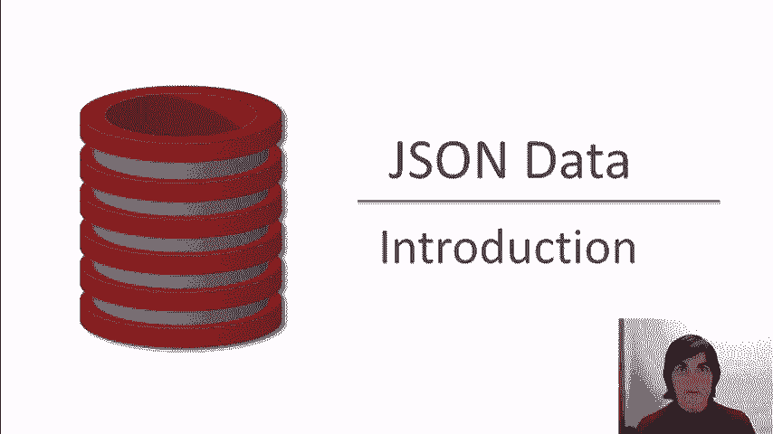
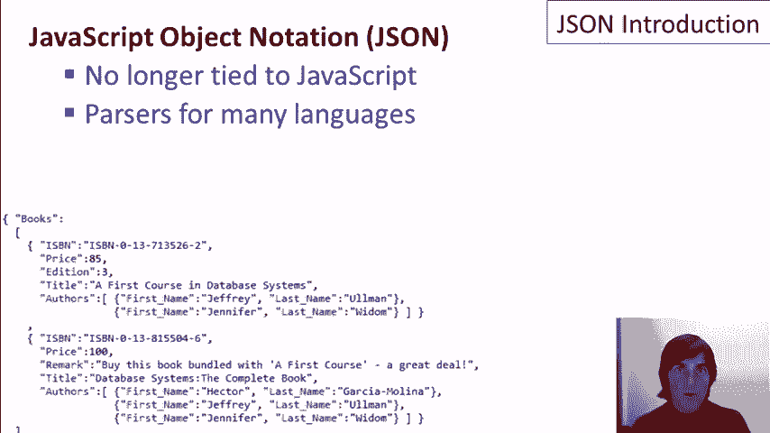
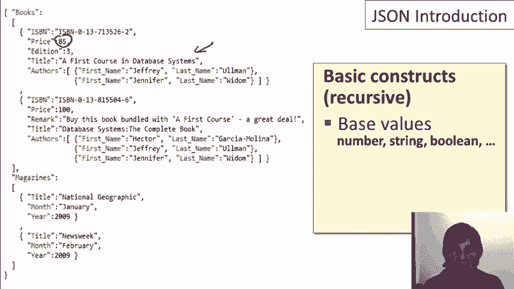
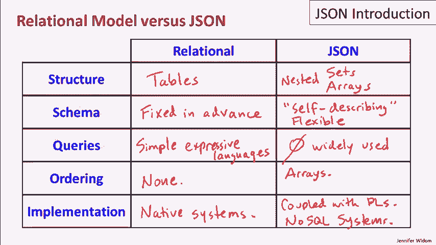
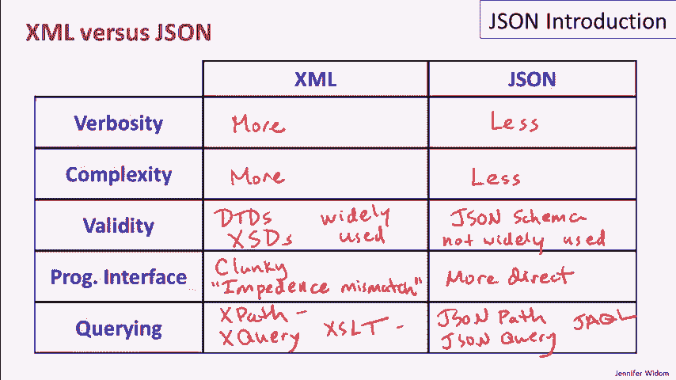
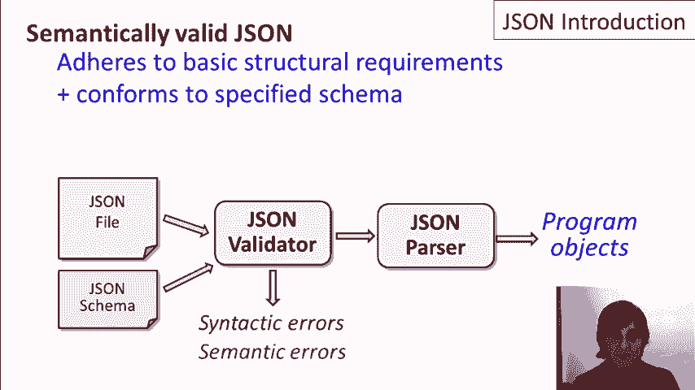
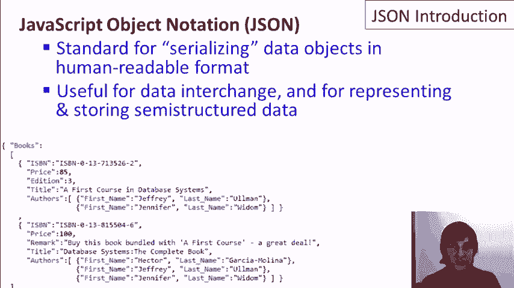

# P6：04-01-json-intro.mp4 - 哈库那玛塔塔i - BV1R4411u7dt

本视频介绍了JSON。我们从谈论它的发音开始。有些人叫它JSON，有些人叫它JSON。我做了一些调查，发现JSON的原始开发者叫它JSON，所以我也这么叫。像XML一样，JSON可以被看作是一种数据模型，是关系数据模型的一种替代方案，更适合半结构化数据。

在本视频中，我将介绍JSON的基础知识，同时将JSON与关系数据模型进行比较，并将其与XML进行比较。但观看那些视频并不是理解这一个视频内容的必要条件。现在，在这三种模型中，关系模型、XML和JSON，JSON是最新的，且JSON的工具远少于XML，当然也不如关系模型的工具那么多。

JSON代表JavaScript对象表示法，尽管现在它已经基本独立于JavaScript。角落里的这段JSON代码现在主要是装饰用途。我们稍后会详细讨论它。现在，JSON最初是为所谓的数据对象序列化设计的，即将程序中的数据对象以串行的方式写下来。

通常在文件中。关于JSON的一点是，它是可读的，人类可以读取，类似于XML的可读性，它通常用于数据交换。例如，将程序中的对象写出来，以便它们可以与另一个程序交换并在那个程序中读取。此外，由于JSON不像关系模型那样严格，因此它也被广泛使用。

它通常用于表示和存储没有严格结构的数据，我们称之为半结构化数据。正如我提到的，JSON现在不再与JavaScript紧密相关。许多不同的编程语言都提供了用于读取JSON数据并将JSON数据写入程序的解析器。

现在让我们来谈谈JSON中的基本构造，我们将看到这些构造是递归定义的。我们将使用屏幕上显示的示例JSON数据，这些数据也可以从网站下载。JSON中的基本原子值是相当典型的，我们有数字，也有字符串。

我们也有布尔值，虽然在这个示例中没有，这些布尔值有**true**和**false**，以及**null**值。在JSON中有两种复合值类型，分别是对象和数组。对象用大括号括起来，由一组标签值对组成。

例如，我们有一个对象，它包含名字和姓氏。我们有一个更大的对象，假设它包含 ISBN、价格、版本等。在进行 JSON 演示时，我们会更详细地探讨这些结构。此时，我们只是简单介绍它们。JSON 中的第二种复合值类型是数组。

数组用方括号括起来，数组元素之间用逗号分隔。实际上，对象中也有逗号，数组则是值的列表。例如，我们可以看到，作者（authors）是一个作者对象的列表。现在，我提到过，这些结构是递归的，特别是数组中的值可以是任何类型。

它们可以是其他数组或对象、基本值，且对象中的标签值对（label value pairs）的值也可以是任何复合值或基本值。而且，我想提一下，有时候这个“标签”（label）这个词，指的是标签值对时，也被称为“属性”（property）。

所以，和 XML 一样，JSON 在其格式中有一些基本的结构要求，但它对统一性要求并不严格。这里有几个异质性的例子。例如，这本书有一个版本（edition），而另一本文本没有。

这本书有备注，另一本文本没有，但我们在演示并更详细地查看 JSON 数据时，会看到更多异质性的例子。现在，让我们比较一下 JSON 和关系模型。我们会发现，许多比较与我们之前将 XML 与关系模型进行比较时非常相似。

让我们从数据模型的基本结构开始。所以，关系模型是基于表的，我们设置表的结构、列的集合，然后数据就成为这些表中的行。JSON 则是基于集合的，标签值对和数组的集合，正如我们所见，它们可以是嵌套的。

关系模型与 JSON 模型之间的一个主要区别是模式（schema）。关系模型的模式是预先固定的。你在加载任何数据之前就设置好它，然后所有数据都需要符合这个模式。而 JSON 则通常不需要预先定义模式。事实上。

模式（schema）和数据就像在 XML 中一样混合在一起，这通常被称为自描述数据（self-describing data），即模式元素包含在数据本身中。当然，这通常比关系模型更灵活。

虽然拥有模式（schema）确实有其优势，但肯定也有其局限性。就查询而言，关系模型的一个优点是它提供了简单、表达力强的查询语言来查询数据库。至于 JSON，尽管已有一些提议，但目前还没有广泛使用的查询 JSON 数据的工具。

通常JSON数据被读入程序中，并以编程方式进行操作。现在让我插一句，这个视频是在2012年2月制作的。所以有可能某些JSON查询语言会出现并得到广泛使用，但截至目前还没有使用的标准。确实有一些提案，比如JSON路径语言。

JSON查询，一种名为Jackal的语言。可能就像XML一样，查询语言会遵循数据格式或数据模型的普遍使用方式，但截至2012年2月，这还没有发生。那排序呢？

关系模型的一个方面是它是一个无序模型。它基于集合。如果我们想按排序顺序查看关系数据，就需要将其放入查询中。在JSON中，我们有数组作为基本数据结构之一，数组是有序的。当然，就像XML一样，JSON数据通常被写入文件，而文件本身自然是有序的。

但文件中数据的排序通常并不重要。有时重要，但通常不重要。最后，在关系模型的实现方面，有些系统原生实现了关系模型。这些系统非常成熟，通常高效且功能强大。对于JSON来说，

我们还没有看到使用JSON作为数据模型的独立数据库系统。相反，JSON通常与编程语言配合使用。不过，我应该补充的是，JSON在NoSQL系统中得到了应用。我们有关于NoSQL系统的视频，你可能看过，也可能没有看过。在这些系统中，JSON有几种不同的使用方式。

其中一种用途是作为数据读取和写入系统的格式。另一种用途是一些NoSQL系统，通常被称为文档管理系统，文档本身可能包含JSON数据，然后这些系统会有一些特殊的功能。

用于操作存储在系统中的JSON文档。现在让我们对比一下JSON和XML。这实际上是一个当前激烈讨论的话题。JSON和XML在用途上有很大的重叠。它们都非常适合将半结构化数据放入文件格式中，并用于数据交换。

由于它们的用途有很多重叠，因而出现了激烈的争论也就不足为奇了。我不会站在某一方，只是尽量为你提供一个对比。我们先来看看这两种语言表达数据的冗长性。通常情况下，XML比JSON更冗长一些。

用这两种格式表示的相同数据，通常 XML 会比 JSON 多一些字符。你可以从我们的示例中看到这一点，因为我们的大型 JSON 示例实际上和我们展示 XML 时使用的几乎是相同的数据。XML 比较冗长的原因，主要是由于结束标签和其他一些特性。是否 XML 表达方式略长是一个问题，我让你自己判断。

第二个是复杂性。大多数人会说 XML 比 JSON 更复杂。我不确定我完全同意这个比较。如果你看一下人们真正使用的 XML 子集，你会看到它包含属性、子元素和文本，大致就是这些。

如果你看 JSON，你会看到基本值、对象和数组。我认为问题在于，XML 里有很多附加的东西。所以，如果你阅读整个 XML 规范，它会花费你很长时间。而 JSON 的规范你可以更快地理解。

现在让我们来谈谈有效性。所谓有效性，我指的是能够在这些模型之一中指定数据结构上的约束、限制或架构，并由工具或系统强制执行这一约束。具体来说，在 XML 中，我们有文档类型描述符（DTD）的概念。

我们还有 XML 架构，它为我们提供了 SSD 和 XML 架构描述符。这些是类似架构的东西，我们可以指定，并且可以检查我们的数据，确保它符合架构要求。这些东西现在可以说在 XML 中得到了广泛应用。对于 JSON，有一种叫做 JSON 架构的东西，类似于 XML 架构，它是一种指定结构的方式，然后我们可以检查 JSON 是否符合这个结构。

我们将在演示中看到其中的一些内容。2012年2月的现状是，这在目前还不广泛使用，但这可能只是一个进化过程。如果我们回顾最初提出的 XML，可能当时并没有看到 DTD 的广泛使用，实际上直到后来才开始使用 X SSD。

所以我们只能等待看看 JSON 是否会以类似的方式发展。现在，JSON 的编程接口才是真正的亮点。XML 的编程接口可以说相当繁琐。XML 模型，属性和子元素等，通常与编程语言中的数据模型不匹配。

事实上，这被称为阻抗不匹配。阻抗不匹配在数据库系统中已经讨论了几十年，因为关系型数据库最初的批评之一就是它不是一个问题。关系型数据库系统的区别在于，数据库中使用的数据结构，特别是表格，并不直接与编程语言中的数据结构相匹配。因此，在编程语言和数据库系统之间的接口处必须进行一些操作，这就是不匹配。

同样的阻抗不匹配问题也出现在 XML 中，而在 JSON 中，它实际上是许多编程语言与 JSON 结构之间的更直接映射。最后，让我们谈谈查询。我之前提到过这一点，但目前 JSON 并没有任何成熟且广泛使用的查询语言。

对于 XML，我们有 XPath，我们有 XQuery，我们有 XSLT。虽然并不是所有这些技术都被广泛使用，但毫无疑问，至少 XPath 和 XSLT 被使用得相当多。至于 JSON，曾有一个名为 JSONPath 的提案，它看起来实际上和 XPath 非常相似，或许它会被广泛采用。还有一个叫做 JSONQuery 的东西，它看起来不像 XMLQuery，我是说 XQuery。

最后，有一个名为 Jackal 的 JSON 查询语言提案，但同样，截止到 2012 年 2 月，所有这些提案仍处于非常早期的阶段，因此我们还不知道哪种方式会得到广泛应用。

那么现在我们来讨论 JSON 数据的有效性。那么，语法有效的 JSON 数据仅仅需要遵循基本的结构要求吗？

提醒一下，我们有标签值对的集合。我们有值的数组，并且我们的基本值来自预定义类型。而且，这些值是递归定义的。因此，我们从一个 JSON 文件开始，然后将其发送给解析器。解析器可能会判断文件是否存在语法错误，或者如果文件在语法上是正确的，那么它就可以被解析为编程语言中的对象。如果我们关心的是语义上有效的 JSON，即符合某些约束或模式的 JSON，那么除了检查基本的结构要求，我们还要检查 JSON 是否符合指定的模式。

如果我们使用像 JSON 模式这样的语言，例如，我们将一个规范作为单独的文件提供，实际上，JSON 模式本身就是用 JSON 表示的，正如我们在演示中将看到的那样。我们将其发送给一个验证器，验证器可能会发现存在语法错误，或者可能会发现存在某些语义错误，因此数据在语法上可能是正确的，但并不符合模式。

如果它在语法和语义上都正确，那么它可以继续交给解析器，我们会再次将其解析为编程语言中的对象。

总结一下，JSON 代表 JavaScript 对象表示法。它是一种将数据对象序列化为人类可读格式的标准。它还非常有用，用于程序之间交换数据，和以灵活的方式表示及存储半结构化数据。在下一个视频中，我们将通过 JSON 的演示进行实际操作。我们将使用几个 JSON 编辑器。

我们将查看当 JSON 数据在语法上正确时的结构。我们还将演示当数据不规则时，它是如何非常灵活的，同时还将通过 JSON 模式的示例演示模式检查。

