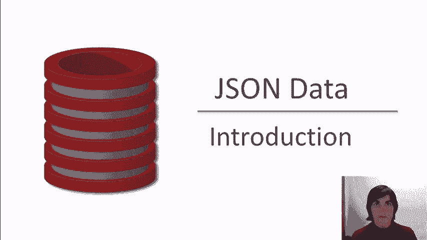
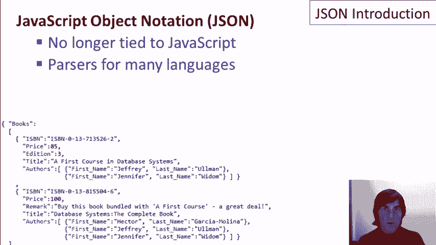
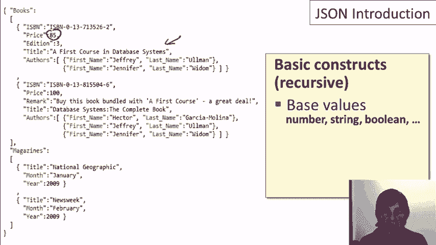
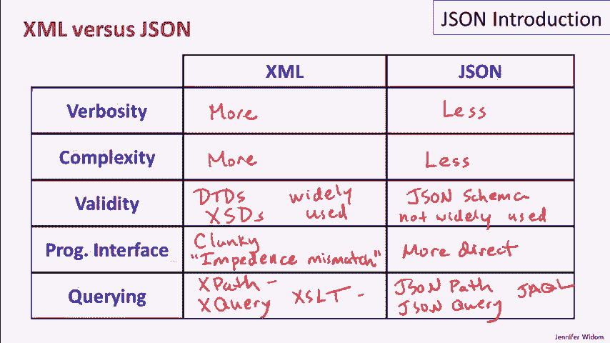
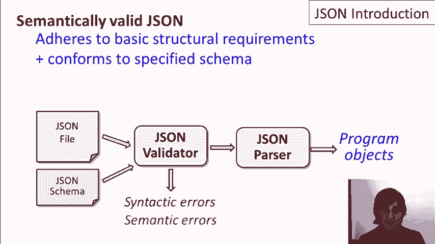

# 课程 P6：JSON 简介 📖

在本课程中，我们将学习 JSON（JavaScript Object Notation）的基础知识。我们将了解 JSON 是什么、它的基本结构，并将其与关系数据模型和 XML 进行比较，以便更好地理解其特性和适用场景。



---

## 概述 📋

JSON 是一种轻量级的数据交换格式。它源于 JavaScript，但现在已独立于任何编程语言。JSON 易于人类阅读和编写，同时也易于机器解析和生成。它非常适合表示半结构化数据，并广泛用于数据交换和存储。

---



## JSON 的发音与背景 🗣️

关于 JSON 的发音存在不同说法。有些人读作 “JAY-sawn”，有些人读作 “JAY-sahn”。根据 JSON 原始开发者的说法，它应读作 “JAY-sawn”。与 XML 类似，JSON 可被视为一种数据模型，是关系数据模型的一种替代方案，尤其适合处理半结构化数据。



---

## JSON 的基本概念 💡

JSON 代表 **JavaScript Object Notation**（JavaScript 对象表示法）。尽管其名称中包含 JavaScript，但它现在已基本独立于该语言。JSON 最初设计用于数据对象的序列化，即将程序中的数据对象以文本形式写入文件。

JSON 具有可读性，类似于 XML，常用于数据交换。例如，一个程序可以将对象写成 JSON 格式，以便另一个程序读取。此外，由于 JSON 不像关系模型那样严格，它也被广泛用于表示和存储没有严格结构的数据，即半结构化数据。

如今，许多编程语言都提供了用于读取和写入 JSON 数据的解析器。

---

## JSON 的基本结构 🧱

JSON 的基本结构是递归定义的。以下是 JSON 中的基本构造：

### 基本原子值
JSON 支持几种基本数据类型：
*   **数字**：例如 `42` 或 `3.14`
*   **字符串**：例如 `"Hello, World!"`
*   **布尔值**：`true` 或 `false`
*   **空值**：`null`

### 复合值类型
JSON 有两种主要的复合值类型：**对象**和**数组**。

#### 对象 (Object)
对象用大括号 `{}` 括起来，由一组**标签-值对**（也称为属性）组成。标签是字符串，值可以是任何 JSON 值。

```json
{
  "firstName": "John",
  "lastName": "Doe"
}
```

#### 数组 (Array)
数组用方括号 `[]` 括起来，是值的有序列表，元素之间用逗号分隔。

```json
["apple", "banana", "orange"]
```


这些结构是递归的。数组中的值可以是任何类型（包括其他数组或对象）。同样，对象中标签-值对的值也可以是任何复合值或基本值。

JSON 格式灵活，不要求数据具有统一的结构。例如，一本书的数据可能包含 `edition` 字段，而另一本书可能没有。

---

## JSON 与关系模型的比较 ⚖️

上一节我们介绍了 JSON 的基本结构，本节中我们来看看它与关系模型的区别。许多比较点与我们之前对比 XML 和关系模型时相似。

以下是 JSON 与关系模型的主要区别：

*   **基本结构**：关系模型基于**表**，有固定的列结构，数据是表中的行。JSON 基于**集合**，是标签-值对和数组的集合，且可以嵌套。
*   **模式 (Schema)**：关系模型需要预先定义严格的模式，所有数据必须符合该模式。JSON 通常不需要预先定义模式，模式信息常与数据混合在一起，称为**自描述数据**。这使 JSON 比关系模型更灵活。
*   **查询语言**：关系模型拥有强大且表达力强的查询语言（如 SQL）。对于 JSON，目前（指课程制作时的2012年2月）还没有被广泛使用的标准查询语言。JSON 数据通常被读入程序后以编程方式操作。
*   **排序**：关系模型本质上是无序的集合。JSON 中的**数组**是有序的列表。虽然 JSON 数据写入文件时文件本身有序，但数据的顺序通常不重要。
*   **系统实现**：关系模型有成熟、高效的原生数据库系统实现。JSON 本身通常没有独立的数据库系统，而是与编程语言配合使用。不过，JSON 在 NoSQL（非关系型）数据库系统中有所应用，一些文档型数据库使用 JSON 格式存储文档。

---

## JSON 与 XML 的对比 🔄

JSON 和 XML 在用途上有很大重叠，都适合表示半结构化数据和用于数据交换。以下是它们的一些对比：

*   **冗长性**：通常情况下，表达相同数据时，XML 比 JSON 更冗长，主要因为 XML 的结束标签等特性。
*   **复杂性**：普遍认为 XML 比 JSON 更复杂。XML 规范包含许多特性，而 JSON 的规范更简洁、易于理解。
*   **有效性验证**：XML 拥有成熟的模式定义和验证工具，如 DTD 和 XML Schema。JSON 也有类似的 **JSON Schema**，但在2012年2月时，其使用远不如 XML Schema 广泛。
*   **编程接口**：JSON 的亮点在于它与许多编程语言数据结构的映射更直接。XML 的数据模型（属性、子元素等）与编程语言的数据结构存在“阻抗不匹配”，操作起来可能更繁琐。
*   **查询**：XML 拥有 XPath、XQuery、XSLT 等查询和转换技术。JSON 在当时有一些提案，如 JSONPath、JSONQuery 和 Jackal，但均未形成被广泛使用的标准。

---

## JSON 数据的有效性 ✅



那么，如何判断一份 JSON 数据是否有效呢？

*   **语法有效**：数据必须遵循 JSON 的基本结构规则（正确的括号、逗号分隔、预定义的数据类型等）。语法检查通常由 JSON 解析器完成。
*   **语义有效（符合模式）**：除了语法正确，数据还需符合特定的结构约束或模式。这可以通过 **JSON Schema** 等工具来验证。验证器会检查数据是否符合模式中定义的规则。

处理流程通常是：JSON 文件 -> 语法验证 -> (可选) 模式验证 -> 解析为编程语言中的对象。

---

## 总结 🎯



本节课中我们一起学习了 JSON 的基础知识。

*   JSON 代表 **JavaScript Object Notation**，是一种将数据对象序列化为人类可读格式的标准。
*   它非常适用于程序间的数据交换，以及以灵活的方式表示和存储**半结构化数据**。
*   JSON 的基本结构包括**对象**（用 `{}` 表示）和**数组**（用 `[]` 表示），以及数字、字符串、布尔值和 `null` 等基本值。
*   与关系模型相比，JSON 没有固定的预定义模式，更加灵活。
*   与 XML 相比，JSON 通常更简洁，与编程语言的集成更直接，但在模式验证和标准化查询方面，其工具生态在当时（2012年）不如 XML 成熟。


在下一个视频中，我们将通过实际操作演示来进一步探索 JSON。