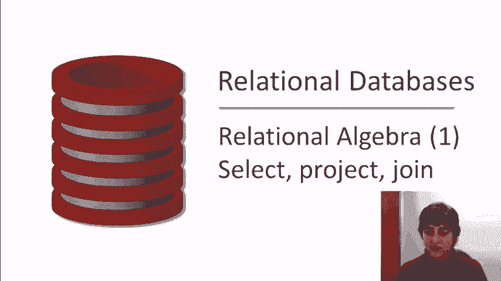
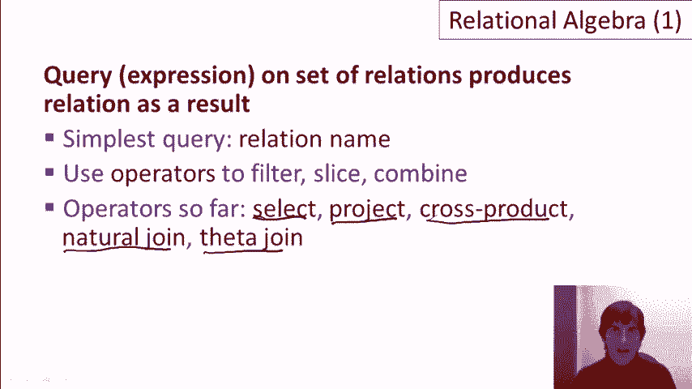

# 课程 P7：关系代数基础 🧮

在本课程中，我们将学习关系代数的基本概念和核心操作符。关系代数是一种形式化语言，它为SQL等数据库查询语言提供了理论基础。我们将通过一个大学招生数据库的示例，逐步了解如何通过不同的操作符来查询和组合数据。

---

## 回顾：关系查询的本质

上一节我们介绍了关系查询的基本概念。查询关系型数据库时，操作作用于关系，并且查询结果本身也是一个关系。这意味着我们可以对查询结果进行进一步的查询，或者将其与其他关系组合。

在本课程的示例中，我们将使用一个包含三个关系的简单大学招生数据库：
*   **College**：包含大学名称、所在州和注册人数。
*   **Student**：包含学生ID、姓名、GPA和高中规模。
*   **Apply**：包含学生ID、申请的大学名称、申请专业和申请结果。

键（Key）是能唯一标识元组的属性或属性组。在本示例中，我们假设`cName`、`sID`和`(sID, cName, major)`组合分别是三个关系的键。

---

## 基础操作符

关系代数中最简单的查询是直接引用一个关系的名称，例如 `Student`，这将返回整个`Student`关系。

接下来，我们将学习用于过滤、切片和组合关系的操作符。

### 选择操作符 (σ)

选择操作符用于从关系中筛选出满足特定条件的行（元组）。

其一般形式为：**σ条件(关系名)**

以下是三个示例：
1.  找出GPA大于3.7的学生：
    `σ_{GPA>3.7}(Student)`
2.  找出GPA大于3.7 **且** 高中规模小于1000的学生：
    `σ_{GPA>3.7 ∧ sizeHS<1000}(Student)`
3.  找出申请了斯坦福大学计算机科学专业的学生：
    `σ_{cName=‘Stanford’ ∧ major=‘CS’}(Apply)`

### 投影操作符 (π)

投影操作符用于从关系中选择特定的列（属性）。

其一般形式为：**π属性列表(关系名)**

例如，如果我们只关心申请记录中的学生ID和申请结果：
`π_{sID, decision}(Apply)`

### 组合选择与投影

由于每个操作符的输入和输出都是关系，因此我们可以将它们组合使用。

例如，要找出GPA大于3.7的学生的姓名：
`π_{sName}(σ_{GPA>3.7}(Student))`

### 关于重复项的重要说明

在关系代数中，**结果集自动消除所有重复的元组**。这与标准的SQL（基于多重集合）不同，后者默认保留重复项。

---

## 组合多个关系

为了回答涉及多个关系的问题，我们需要将关系组合起来。

### 笛卡尔积 (×)

笛卡尔积（叉积）将两个关系的所有元组进行两两组合。

其形式为：**关系1 × 关系2**

例如，`Student × Apply` 的结果是一个新关系，其模式是`Student`和`Apply`模式的并集。如果两个关系有同名属性（如`sID`），则会通过添加关系名前缀来区分（如`Student.sID`和`Apply.sID`）。

### 使用笛卡尔积进行查询

假设我们要查询：**“高中规模大于1000、申请了计算机科学专业并被拒绝的学生的姓名和GPA。”**

这个查询需要结合`Student`和`Apply`关系的信息。我们可以分步构建查询：
1.  组合所有可能的学生和申请记录：`Student × Apply`
2.  筛选出有意义的组合（同一学生的记录），并加上其他条件：
    `σ_{Student.sID=Apply.sID ∧ sizeHS>1000 ∧ major=‘CS’ ∧ decision=‘R’}(Student × Apply)`
3.  最后，投影出所需的姓名和GPA：
    `π_{sName, GPA}(σ_{Student.sID=Apply.sID ∧ sizeHS>1000 ∧ major=‘CS’ ∧ decision=‘R’}(Student × Apply))`

### 自然连接 (⋈)

自然连接是一种更便捷的操作符，它执行笛卡尔积，但**自动强制所有同名属性的值相等，并去除重复的同名列**。

其形式为：**关系1 ⋈ 关系2**

使用自然连接重写上面的复杂查询：
`π_{sName, GPA}(σ_{sizeHS>1000 ∧ major=‘CS’ ∧ decision=‘R’}(Student ⋈ Apply))`

可以看到，查询变得简洁许多，因为我们不再需要手动编写连接条件（如`Student.sID=Apply.sID`）。

### 连接更多关系

自然连接可以连续使用。例如，若想在上面的查询中增加“只考虑注册人数超过20000的大学”这一条件，只需引入`College`关系：
`π_{sName, GPA}(σ_{sizeHS>1000 ∧ major=‘CS’ ∧ decision=‘R’ ∧ enrollment>20000}(Student ⋈ Apply ⋈ College))`

自然连接会自动处理`Apply.cName`和`College.cName`的相等性。

### θ-连接 (⋈θ)

θ-连接是笛卡尔积后加选择条件的一个缩写。

其形式为：**关系1 ⋈条件 关系2**， 等价于 **σ条件(关系1 × 关系2)**

虽然它没有增加新的表达能力，但在数据库系统实现和讨论中，“连接”一词通常指的就是θ-连接。

---

## 总结

在本节课中，我们一起学习了关系代数的基础知识。关系代数是一种对关系集合进行操作并生成新关系的形式化语言。

我们掌握了以下核心操作符：
*   **选择 (σ)**：根据条件筛选行。
*   **投影 (π)**：根据属性名选择列。
*   **笛卡尔积 (×)**：组合两个关系的所有元组对。
*   **自然连接 (⋈)**：基于同名属性等值组合关系，并去重，是实践中非常有用的工具。
*   **θ-连接 (⋈θ)**：笛卡尔积加选择条件的缩写。

这些操作符构成了关系查询的基石。在下一节课中，我们将学习关系代数的其他附加操作符和表达式的替代表示法。