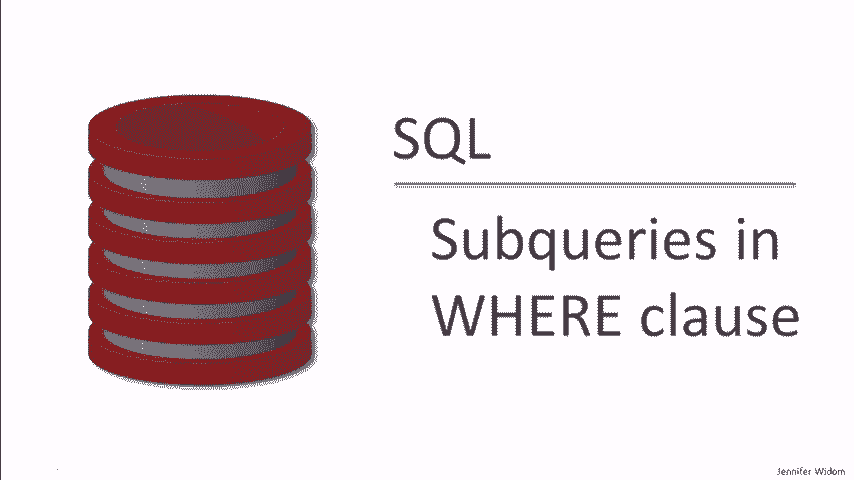
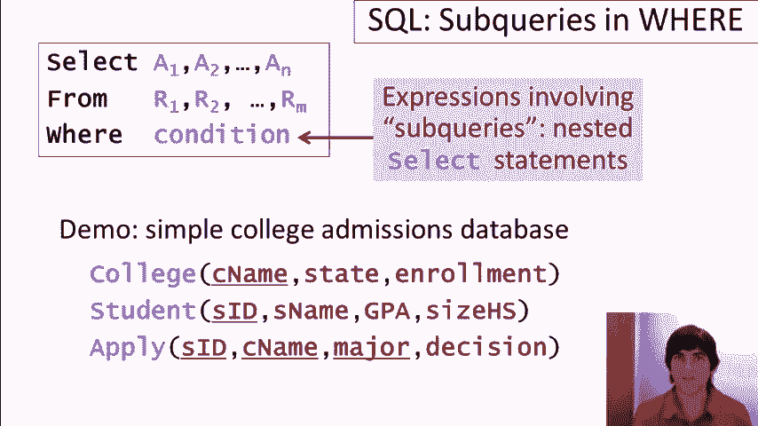
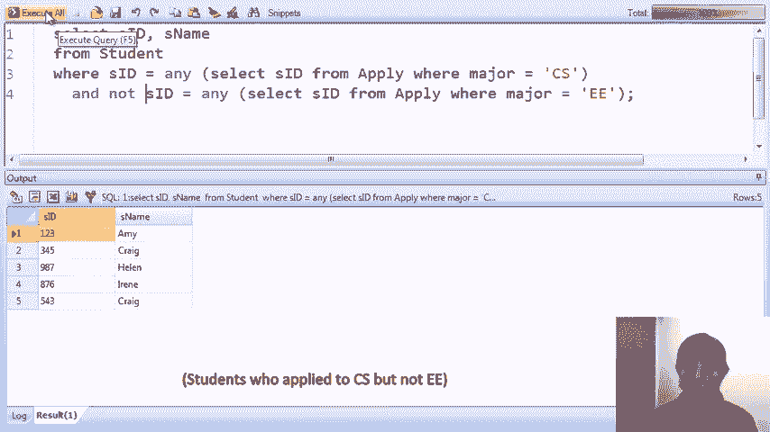

# P8：06-04-subqueries-in-where.mp4 - 哈库那玛塔塔i - BV1R4411u7dt

 This SQL video， which as usual， will consist mostly of running live queries。

 introduces sub queries in the WHERE clause。 As usual， we start with our basic。

 select from WHERE expression， and we're going to add to it now the ability in the。

 condition part of the select from WHERE expression to include sub queries。 Sub queries。

 are nested select statements within the condition and we'll see they're， actually quite powerful。

 As usual， we'll be using a sample demonstration database， that consists of colleges， students。

 and students applying to colleges。 As always。

 we'll have our four colleges， a bunch of students， and a bunch of records that。

 show students applying to colleges。 So let's launch right into our first query。

 that shows a sub query in the WHERE clause。 What this query finds is the。

 IDs and names of all students who have applied to major in CS to some college。

 So here's the sub query in the WHERE clause。 This expression right here in。

 the WHERE clause finds the IDs of all students who have applied to major in CS。

 So now we have that set of IDs。 Our outer query says let's take from the。

 students those students whose ID is in that set and let's select their ID and， their name。

 So we go ahead and execute the query and we find out that five。

 students have applied to major in CS。 Now we actually can do this query without a。

 sub query in the WHERE clause。 So let's take a look。 We can do it instead by。

 joining the student relation with the apply relation。 So here we do what we。

 learned in previous videos。 We take student and apply， we write the join。

 condition to make sure we're talking about the same student， we make sure they're， majoring in CS。

 and we get their ID and their name。 Let's run the query。 Whoops， an， error。 I knew that was coming。

 This is just to remind you about disambiguating， attributes。

 The ID here in the select clause could have come from student or。

 apply and even though the value is equal we do have to disambiguate by putting one， of those。

 So let's put student。sid and let's run the query。 Okay， now we see we got。

 more students back than we got back when we ran the query using the sub query。 Let's。

 go back and look。 We got five results here and we got several more here but the。

 additional results are actually duplicate values。 So we have two copies for example， of one， two。

 three， Amy。 The reason for that is that Amy actually applied to major in， CS at multiple colleges。

 So if we go back and we look at the apply data we'll see， that Amy was one， two。

 three applied to major in CS at Stanford as well as， Berkeley。 Let's hope she selects Stanford。

 In any case that's why we got Amy twice。

 in the join because she applied twice。 Back here where we use the sub query we。

 were just looking at students and whether their ID was in the set。 Okay so when we。

 do the join we get basically the same answer but we have some duplicate values。

 Of course we can fix that by adding distinct。 We run the query and now we have。

 the same result that we got when we used the sub query。 Let's look at some other。

 similar queries and let's focus again on the duplicates issue because it gets a。

 little tricky as we'll see。 This query is very similar to the previous one finding。

 students who are applying to major in CS but this time we're only getting the。

 names of the students and not their IDs。 So we run the query and we find our same， five students。

 Just want to mention that these two craigs are two different craigs。

 if we go back to our original result there's three four five Craig and five four， three Craig。

 So coming back here we find the names of the students who majored in， CS。

 Now similarly to what we did previously let's write this query using a join。

 instead of using the sub query in the WHERE clause。 So here's the join we're。

 joining student and apply on the students ID majoring in CS as always the only。

 difference is that we're just selecting the name。 We run the query and we get again。

 many more results than we got previously because we get two copies when a student。

 has applied to major in CS at two different places。 And just as we did before。

 we can add distinct to get rid of the duplicates。 Well something different happened this time。

 This time when we get rid of the， duplicates we only have four results where previously we had five and the。

 reason is that previously we included the student ID in the result and so the。

 two instances of Craig were two different craigs and didn't cause， duplicates to be eliminated。

 We can see that back here Craig and Craig but in this。

 result because we only kept the names the two copies of Craig turned into one， result。

 Now we might wonder why do we care about duplicates so much。 Let's see。

 an example where duplicates really do matter quite a bit。 We're going to do。

 exactly the same query again finding students who have applied to major in CS。

 but now we're not retrieving the IDs or names or we're retrieving the GPAs of， those students。

 Presumably what we're interested in doing is some analysis of。

 the GPAs of students who choose to apply for CS。 So let's run the query as always。

 we get our five results and here's the GPAs of the five students who have applied， to major in CS。

 Once again this will be the last time I promise we'll do this。

 query using a join instead of the sub query。 So here we go we've got student。

 and applied and joined on SAD majoring in CS and returning the GPA。 Once again。

 because we have students who applied multiple times for CS we're getting。

 more than our five results so we get a rather large number of results here and。

 again we have duplicates。 So here's where the problem comes in。 If we use this。

 result to compute the average GPA we'll be counting some students multiple times。

 and presumably that's not what we want to do。 Presumably we want to count each。

 student who's applied to CS once in the computation of say the average GPA。 That。

 worked in the previous query when we got the five results for the five students， who applied to CS。

 When we do the join we get too many results but this time again。

 we're gonna have a problem when we do select distinct because some of these。

 students have the same GPA and now we only have four GPAs instead of the five。

 that we should have and if we compute the average GPA now then we're not。

 factoring in one of the students GPAs。 So in this case neither the version with。

 distinct nor the version without distinct gives us the right number of。

 GPAs and neither of those will give us the correct average。 The only way to get。

 the correct number of duplicates is to use the version of the query that has the。

 subquery in the WHERE clause。 Now let's move to some different examples that also。

 use subqueries in the WHERE clause。 You might remember from the previous video。

 when we were learning the difference operator that we had a query that we。

 could write using the difference operator which in SQL is called accept but we。

 were unable to write that query without the difference operator and the query we。

 were trying to write is to find students who have applied to major in CS but have。

 not applied to major in EE。 Now that we have subqueries in the WHERE clause we。

 can write that query without using the accept operator and here it is。 The。

 query looks for students where their ID is among the set of IDs of students who。

 have applied to CS but their ID is not among the set of IDs of students who。

 are applying to major in EE。 So let's run the query and we discovered that there。

 are three students who have applied to major in CS but not applied anywhere in， EE。

 By the way let me just show you a different slightly different way to write， exactly the same query。

 You can see that we use this keyword combination not in to， specify that the ID is not in the set。

 We can actually write it by writing the， SID is in the set and then applying a not to that result。

 Well execute will get， exactly the same result。 It's fairly common in SQL for there to be multiple。

 ways to write the same query and we'll see more examples of that later in this， video。

 So far our examples of subqueries have used in and not in for testing。

 membership in the sets that are produced by subqueries。 Our next examples are going。

 to show that we can apply the EXISTS operator to subqueries just to test。

 whether they're empty or not empty。 Here's the query。 This query uses EXISTS to。

 check whether a subquery is empty or not empty rather than checking whether。

 values are in the subquery。 The other new construct that's being introduced here。

 is what's known as a correlated reference。 So inside the subquery we're。

 going to refer to a value C1 that comes from outside the subquery。 So let's talk。

 about exactly how this query works。 First let me tell you what the query is， trying to return。

 The query is going to find all colleges such that there's some。

 other college that is in the same state。 So in our example just a reminder we have， Stanford。

 Berkeley， MIT and Cornell。 So the two colleges we should get back are。

 Stanford and Berkeley because in each case there's another college in the same， state。

 So how does this query work？ It says we're going to take the colleges and。

 for each college we're going to check whether there exists another college and。

 we're going to call that one C2 where the state of C2 is the same as the state of C1。

 This is sort of similar to what we saw when we were doing self-joints with table。

 variables but now the variables are appearing in the outer query and the， inner query。

 So let's run the query and we see that we get the wrong answer。 That， was again intentional。

 Well here's the problem。 When we run this query C1 and C2， could be bound to the same college。

 So every college is in the same state as， another college if the other college can be the same college。

 What we need to do is， add inside the subquery a further condition that says C1 and C2 are。

 different colleges。 Specifically C1。c name is not equal to C2。c name。 Let's run。

 the query and now we get the correct answer。 Now let's look at some other。

 uses of the exists construct in subqueries。 If you happen to already know。

 C2 a little bit and someone asked you to write a query where you were going to。

 get a largest value of some type。 The first thing you'd think of is probably。

 using the max operator but we don't know max yet。 We'll be learning that in later。

 videos and as it happens a number of queries that are effectively computing a。

 max can be written using subqueries and here's our first example。 This example is。

 finding the college that has the largest enrollment and we're going to do that。

 with a subquery and with the not exists operator。 Specifically we're going to。

 find all colleges where there does not exist another college whose enrollment。

 is higher than the first college。 So let's go ahead and run the query and not。

 surprisingly we get Berkeley as a result。 So this is a form of query that we can。

 write anytime we're looking for something that's the largest or the smallest。 Let's。

 for example look for the student with the highest GPA。 So we'll change it to the。

 student name and we'll be looking instead of colleges at students。 Otherwise the。

 form of this query is going to stay very similar。 We're going to look for students。

 here as well and finally we're going to have GPA instead of enrollment。 So the。

 way this query works is it says I want to find all students such that it says that。

 there does not exist another student whose GPA is higher。 We run the query and， we get four results。

 Well that seems odd。 Actually it's not that odd。 Let's just add。

 the GPA to our query and we'll see exactly what happened。 We can see that。

 these four students all have a GPA of 3。9 so they're all tied for having the。

 highest GPA and very specifically it faithfully runs the query that it does。

 not exist another student whose GPA is higher than these students。 Now let's see。

 if we can write this same query without using a sub query。 So as usual if we want。

 to write a query without a sub query we'll need to do some type of join。 So we're。

 looking for students with the highest GPAs so we need to join two instances of the。

 student relation as we've done here and then we'll apply a condition that the GPA。

 of the first one is greater than the GPA of the second one。 We run the query wow we。

 got a lot of answers there。 Maybe our problem is just one of duplicates。 So。

 first thing we do when it looks too big is we add to select this thing。 Nope that。

 doesn't solve the problem either。 Actually this query is fundamentally wrong and we。

 cannot write the query that finds the student with the highest GPA just by， using joins。

 What this query actually does is it finds all students such that。

 there is some other student whose GPA is lower。 In other words it's finding all。

 students except those who have the lowest GPA。 Now let's see another new。

 construct we can use with sub queries in the WHERE clause and we'll continue with。

 the same query of finding the student with the highest GPA。 This query uses the， all keyword。

 What all tells us is that instead of checking whether a value is。

 either in or not in the result of a sub query we're going to check whether the。

 value has a certain relationship with all the results of the sub query。 In here in。

 this case we're checking to see if the GPA is greater than or equal to all。

 elements of the sub query that returns the GPA's of all students。 If a student's GPA。

 is indeed greater than or equal to all GPA's then the student has the highest， GPA in the database。

 We'll run the query and we'll get the same four students with， the 3。9 GPA。

 Now let's try writing this in a slightly different fashion just for。

 fun to illustrate some concepts。 Once again we're going to try to find the。

 students whose GPA is highest in the database。 Here's how we're going to do it， this time。

 Instead of using greater than or equal to all we're going to use greater， than all。

 So we're going to find all students where their GPA is higher than。

 every other student by saying GPA is greater than all GPA's of students in。

 the database who are not the student we're looking at by saying that the IDs are， not equal。

 Let's run the query。 Well we get an empty result。 Let's think about it， for a second。

 That is actually the correct result to the query。 The query itself was， incorrect。

 The query is looking for all students where nobody else has the same。

 GPA's that student everybody else's GPA is lower。 Well remember we had four， students with a 3。

9 GPA so none of those students are going to satisfy the query， and nor will any other students。

 So this is an incorrect formulation of the， query that we wanted。

 Now this query would be correct if we knew that every。

 student had the same GPA I'm sorry this query would be correct if we knew that。

 every student's GPA was unique because there would be then one student who had， the highest GPA。

 So let's modify the query to instead look for the colleges that。

 have the highest enrollment because it turns out in our database every college。

 has a unique enrollment。 So we'll change it to getting the C-name of college instead。

 of student and we'll want the enrollment to be greater than or greater than all， other enrollments。

 So we'll enrollment college almost done here grab a cup of。

 coffee if you want I just have to make this be C-name and this one be C-name and， we're all set。

 So what are we asking for here we're asking for all colleges whose。

 enrollment is greater than all of the enrollments of colleges that are。

 different than the one we're looking at。 We run the query and we get Berkeley as a。

 result which is exactly what we'd expect。 So far we've seen the keyword all for。

 checking whether a value has a relationship with all of the results of a， subquery。

 There's also a keyword any that is a companion but instead of having to。

 satisfy a condition with all of the elements of a set any says you must。

 satisfy the condition with at least one element of the set。 So what we're going to。

 do now is we're going to do the same query but we're going to write it a little， differently。

 Let me just type it in and then explain。 Here what we're going to say。

 is get me all colleges where it's not the case that the enrollment is less than or。

 equal to any other college。 So in other words there's no other college with a， bigger enrollment。

 Just think about it for a second this is if you happen to know。

 predicate logic this is a equivalence where when you say for all it's。

 equivalent to not exist not in any case if you didn't follow that don't let that。

 bother you let's run the query and we see we again get the result Berkeley。 So。

 again all tests a condition against every element in the result of a subquery and。

 the condition is true if it's satisfied with every element whereas any is true if。

 the condition is satisfied with one or more elements of the subquery。 Let's use。

 any for another query。 This query finds all students who are not from the smallest。

 high school in the database。 So what we're looking for here is all students where。

 the size of their high school is greater than any high school size in other words。

 a student is going to be returned if there's some other student whose size。

 high school is smaller than this student we run the query and there's the result。

 and you can verify if you look back at the data that there is in fact a few there。

 are students who are from high schools that have 200 students so here we have。

 in our result every student who comes from a high school bigger than that。 Some。

 systems notably at the current time SQL light do not support the any and the all， operators。

 We do not lose expressive power we just have to write those queries a。

 little differently typically using exists or not exists so let's look at the same。

 query written without using any。 Here's what we do we look for students where。

 there exists some other student okay whose high school is smaller than the。

 student we return so this is going to give us exactly the same result and we will。

 see we get the same set of students no students from a high school with 200 but。

 we get all the rest of the students without using any or all and just to。

 emphasize any or all are very convenient for writing queries but they aren't。

 necessary it turns out we can always write a query that would use any or all by。

 using the exists operator or not exists instead。 As a grand finale query let's。

 revisit the query that finds students who have applied to major in CS and have not。

 applied to major in EE and now we're going to write that query using the any。

 operator two instances of it now let's go back and look when we wrote the query。

 using in and not in and we see that there are three results Helen Irene and Craig。

 and now let's look at our query using any and not equal to any so we find。

 students where their SID is in the set of SID's of students who have applied to。

 major in CS and their SID is not equal to any of the students who have applied to。

 major in EE and let's run the query。 Well we got the wrong answer and that was。

 once again intentional let's look very closely at what this query asked for。 This。

 query asked for students where their ID is in the set of IDs who applied for CS。

 that's all fine and good but this is where things got tricky。 What happens。

 here is what we're saying here is that we want the condition to check whether。

 there's any element in the set of EE's that are not equal to this SID so in fact。

 this second condition is satisfied as long as there's anybody who applied to EE。

 that's not equal to the student we're looking at and that of course is。

 commonly the case so we made a mistake here and it's actually quite tricky to。

 use the any and all operators and always get the right answer it's especially。

 tricky when you can't just eyeball the answer and check but the correct。

 formulation that we want here is that it's not the case that the SID is equal to。

 any member of the set in other words for each member of this set of the EE。

 applications that value is not equal to the SID of the student we're going to。

 retreat and now we run the query and we get the right answer。

