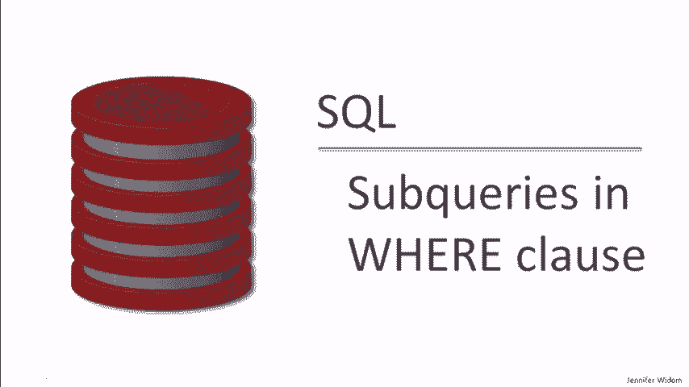
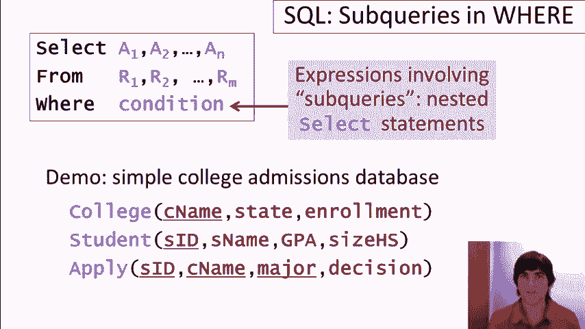
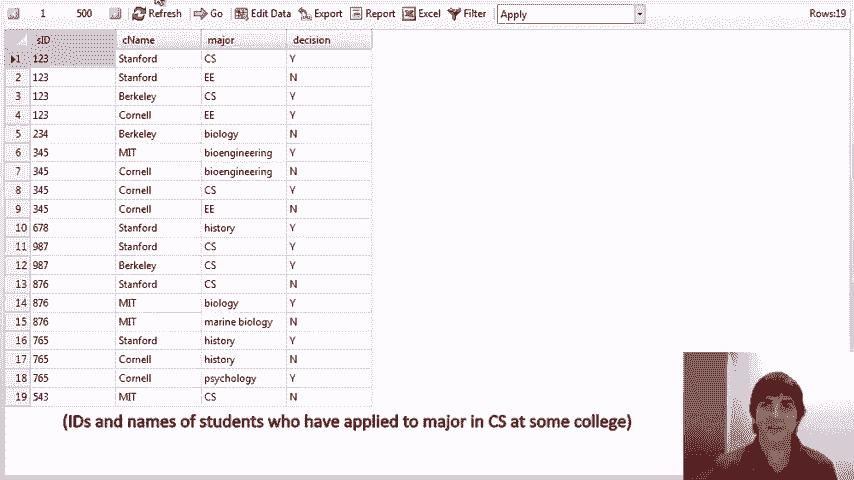

# SQL教程 P8：WHERE子句中的子查询 🧩



在本节课中，我们将学习如何在SQL的`WHERE`子句中使用子查询。子查询是嵌套在另一个查询内部的查询，它允许我们基于更复杂的条件来筛选数据。我们将通过具体的例子，学习使用`IN`、`NOT IN`、`EXISTS`、`ANY`和`ALL`等操作符来构建强大的查询条件。

## 概述与准备工作

我们将使用一个包含大学、学生以及学生申请记录的示例数据库。数据表结构如下：

*   **大学表 (College)**: 包含大学名称、所在州和入学人数。
*   **学生表 (Student)**: 包含学生ID、姓名、GPA和毕业高中规模。
*   **申请表 (Apply)**: 包含学生ID、大学名称和专业。



## 使用 `IN` 和 `NOT IN` 进行成员资格测试

上一节我们介绍了子查询的基本概念，本节中我们来看看如何使用`IN`和`NOT IN`操作符来检查某个值是否存在于子查询返回的结果集中。

### 示例1：查找申请了计算机科学专业的学生

以下查询使用子查询来查找所有申请了计算机科学（CS）专业的学生ID和姓名。

```sql
SELECT sid, sname
FROM Student
WHERE sid IN (
    SELECT sid
    FROM Apply
    WHERE major = 'CS'
);
```

**查询逻辑**：
1.  内部子查询 `(SELECT sid FROM Apply WHERE major = 'CS')` 返回所有申请了CS专业的学生的ID集合。
2.  外部查询 `SELECT sid, sname FROM Student` 会检查每位学生的ID是否在这个集合中。
3.  最终，只返回那些ID在集合中的学生信息。

**注意重复项问题**：我们也可以使用`JOIN`来实现相同的查询，但需要小心处理重复记录。例如，如果一个学生申请了多所大学的CS专业，使用`JOIN`会导致该学生的记录出现多次。这时，我们需要使用`SELECT DISTINCT`来去重。然而，当查询结果包含可能重复的值（如姓名）时，`DISTINCT`可能会合并掉本应不同的记录，导致信息丢失。因此，在涉及聚合计算（如求平均GPA）时，使用子查询的`WHERE ... IN`形式通常是更安全、更准确的选择。

### 示例2：查找申请了CS但未申请EE专业的学生

这个查询展示了如何使用`NOT IN`来执行集合的差集操作，找出那些申请了CS但没有申请电子工程（EE）专业的学生。

```sql
SELECT sid, sname
FROM Student
WHERE sid IN (
    SELECT sid FROM Apply WHERE major = 'CS'
)
AND sid NOT IN (
    SELECT sid FROM Apply WHERE major = 'EE'
);
```

**查询逻辑**：
1.  第一个条件 `sid IN (... 'CS' ...)` 确保学生申请了CS。
2.  第二个条件 `sid NOT IN (... 'EE' ...)` 确保学生没有申请EE。
3.  两个条件同时满足的学生才会被选中。

## 使用 `EXISTS` 和 `NOT EXISTS` 测试存在性

上一节我们使用`IN`检查了值的成员资格，本节我们学习`EXISTS`操作符，它用于检查子查询是否返回任何行（即结果集是否非空）。

### 示例3：查找存在同州其他大学的大学

这个查询使用了**关联子查询**，即子查询引用了外部查询中的列（`C1.state`）。

```sql
SELECT cname
FROM College C1
WHERE EXISTS (
    SELECT *
    FROM College C2
    WHERE C2.state = C1.state
    AND C2.cname <> C1.cname
);
```

**查询逻辑**：
1.  对于`College`表（别名为`C1`）中的每一所大学，执行内部子查询。
2.  子查询在`College`表（别名为`C2`）中寻找另一所大学（`C2.cname <> C1.cname`），且这所大学与外部查询中的大学位于同一个州（`C2.state = C1.state`）。
3.  如果子查询找到了至少一条这样的记录（即`EXISTS`返回真），那么外部查询中的这所大学就会被包含在最终结果中。

### 示例4：查找GPA最高的学生（使用`NOT EXISTS`）

我们可以利用`NOT EXISTS`来寻找最大值。这个查询找出那些不存在GPA比他们更高的学生。

```sql
SELECT sname, GPA
FROM Student S1
WHERE NOT EXISTS (
    SELECT *
    FROM Student S2
    WHERE S2.GPA > S1.GPA
);
```

**查询逻辑**：
1.  对于学生`S1`，子查询检查是否存在另一个学生`S2`，其GPA高于`S1`的GPA。
2.  如果**不存在**这样的学生`S2`（即`NOT EXISTS`返回真），那么`S1`的GPA就是最高的（或并列最高），他/她将被选中。
3.  如果有多个学生拥有相同的最高GPA，他们都会被返回。

## 使用 `ANY` 和 `ALL` 进行量化比较

`ANY`和`ALL`操作符允许我们将一个值与子查询返回的一组值进行比较。

*   `value operator ANY (subquery)`: 如果`value`与子查询结果中的**至少一个**值满足`operator`（如`>`，`=`，`<`）关系，则条件为真。
*   `value operator ALL (subquery)`: 如果`value`与子查询结果中的**每一个**值都满足`operator`关系，则条件为真。

### 示例5：查找GPA最高的学生（使用`ALL`）

我们可以用`ALL`重写寻找最高GPA的查询。

```sql
SELECT sname, GPA
FROM Student
WHERE GPA >= ALL (
    SELECT GPA FROM Student
);
```

**查询逻辑**：选择那些GPA大于或等于**所有**学生GPA的学生，这自然就是GPA最高（含并列）的学生。

### 示例6：查找不是来自最小规模高中的学生（使用`ANY`）

```sql
SELECT sname
FROM Student
WHERE sizeHS > ANY (
    SELECT sizeHS FROM Student
);
```

**查询逻辑**：选择那些高中规模大于**至少一个**其他学生高中规模的学生。这意味着，只要数据库中存在高中规模更小的学生，当前学生就会被选中。因此，结果将排除来自规模最小高中的学生。

**重要提示**：使用`ANY`和`ALL`时需要格外小心逻辑的正确性。例如，查询“不等于任何”（`<> ANY`）与“不等于所有”（`<> ALL`）含义截然不同。有些数据库系统（如SQLite）不支持`ANY`/`ALL`，但我们可以总是用`EXISTS`/`NOT EXISTS`来等价地重写查询。

## 总结

本节课中我们一起学习了在SQL `WHERE`子句中使用子查询的强大功能。我们掌握了：
1.  使用 **`IN`** 和 **`NOT IN`** 来测试值是否在子查询的集合中，常用于成员资格检查和集合差集操作。
2.  使用 **`EXISTS`** 和 **`NOT EXISTS`** 来测试子查询是否返回结果，特别适用于关联子查询和寻找最大/最小值。
3.  使用 **`ANY`** 和 **`ALL`** 将一个值与子查询结果集进行量化比较，它们提供了简洁的语法，但使用时需仔细斟酌逻辑。


通过灵活组合这些技术，我们可以构建出非常复杂和精确的数据筛选条件，以满足多样的查询需求。记住，许多使用`ANY`/`ALL`的查询都可以用`EXISTS`/`NOT EXISTS`重写，这有助于提高代码的兼容性和可读性。