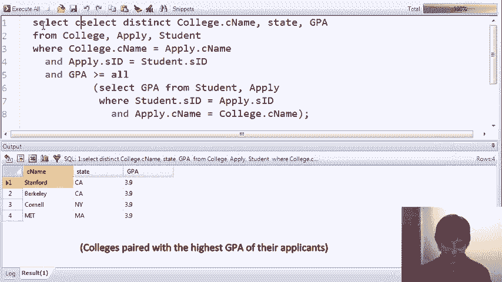

# P9：06-05-子查询-in-from-select.mp4 - 哈库那玛塔塔i - BV1R4411u7dt

在接下来的SQL查询集中，我们将看到在`from`和`select`子句中使用子查询的示例。

在前一个视频中，我们介绍了子查询，但仅仅在`where`子句中使用了它们。在查询条件中，我们写了生成集合的子查询，用于比较。在接下来的查询集中，我们将看到，我们还可以在查询的`from`子句和`select`子句中使用子查询的选择表达式。如果我们在`from`子句中使用子查询。

我们真正做的是运行一个嵌套的`select`语句，它将生成一个我们在后续查询中使用的表格。如果我们在`select`中使用子查询，那么我们做的就是写一个选择表达式，一个子选择表达式，它产生查询结果中的值。让我们看看这个在实际操作中的表现，像往常一样，我们将使用我们简单的大学招生数据库，其中包含`college student`和`apply`表格。

我们的第一个查询将演示如何在`from`子句中使用子查询。你可能还记得在前一个视频中，我们曾讨论过根据高中规模来缩放学生的GPA。具体来说，我们将GPA乘以高中规模除以1000的值。我们在这个查询中要做的是，返回所有通过缩放其GPA使其值发生超过1的变化的学生。

具体来说，要么是“规模GPA减去GPA大于1”，要么是“GPA减去规模GPA大于1”。所以让我们运行这个查询。我们会找到一些学生，他们的GPA通过缩放被修改了超过1。现在让我们来看一下这个查询。我们有一个表达式，它将GPA进行缩放。

而且我们实际上需要将表达式写三次。现在记住，实际上这个计算可能会更复杂。一个智能的数据库系统可能会查看查询并意识到，它可以只计算一次并在所有三个地方使用，但也许我们并没有使用一个智能的数据库系统，此外，对查询本身而言。 

我们可能想要简化一些，仅仅写出这个表达式一次。所以，简化`WHERE`子句其实是相当容易的。我们只需要使用大多数SQL实现中内置的绝对值函数。我们写出绝对值函数，并将它应用于这个计算。

我们删除查询的第二个子句，运行查询，结果应该和之前完全相同。果然如此。所以这很好，但我们仍然在这里进行了两次GPA缩放计算。那么我现在要做的，是在`FROM`子句中加入一个子查询。这个子查询将计算出缩放后的GPA。

当我们在 FROM 子句中使用子查询时，我们其实是在创建一个 select FROM WHERE 语句，它产生一个关系。在查询的其他部分，我们可以像处理一个关系一样处理这个结果。因此，我们可以在查询的其余部分引用该关系中的 GPA。好了，让我稍微编辑一下。所以我将从这里开始写 select。

这部分查询，如此，我将其转化为自己的子查询，并放入 FROM 子句中。现在我给它起个名字 G，技术上来说我可能可以省略它，但大多数 SQL 实现都要求必须指定。这个意思是计算 select FROM WHERE 表达式并将结果命名为 G。在查询的其他部分，每当我提到 G 时，它就代表着这个子查询的结果。

我在 FROM 子句中引用了这个子查询的结果。具体来说，我现在有了 GPA，如果需要，我可以加上它来自 G，尽管不加也没问题，因为它并不模糊不清。我可以在查询的其余部分使用这个 GPA。现在我还是缺少一个 select，所以我就加上了 select star，这样就可以把所有属性都返回了。

现在，我有了一个完整的查询，其中我在 FROM 子句中计算了 GPA，并在查询的其他地方使用了它。我运行这个查询，结果再次完全相同。在后续的聚合视频中，我们将看到更多在 FROM 子句中使用子查询的例子。

我们的第二个主要示例将涉及在 SELECT 子句中使用子查询。首先，我们来解释一下这个查询是做什么的。我们要做的是找到大学，并将这些大学与它们申请者中的最高 GPA 配对。所以这需要将我们三个表——college、apply 和 student——进行连接。

这里是我们的 JOIN 条件。我们始终需要记住包括这些条件。我们将返回大学名称、州和 GPA，其中 GPA 是最高的。我在这里使用了 "greater than or equal to all" 结构，来比较申请该大学的学生的 GPA。

你可能想暂停视频，确保你理解查询在做什么。但再说一遍，它会返回那些在申请者中拥有最高 GPA 的大学。我们运行查询后，看到大多数大学，实际上所有大学，都有一位 GPA 为 3.9 的申请者。这恰好是数据库中的最高 GPA。

所有的大学都有一位 GPA 达到该水平的申请者。现在我们看到一些重复的结果。如果我们不喜欢重复数据，我们可以使用我们通常的技巧——加上 distinct。现在我们得到了数据库中四所大学以及它们申请者的最高 GPA。现在让我们看看如何通过在 SELECT 子句中使用子查询来编写这个查询。

在 Select 子句中，子查询的作用是执行计算。只要该计算返回的正好是一个值，该值就会被用在结果元组中。所以让我开始在这里稍微输入一些。我们将在这里做的是从大学中选择大学名称和州。

让我从大学那里把它拉下来，然后我们将使用这个查询的修改版来计算该特定大学的最高 GPA。所以我们将有大学名称、州，然后是 From 子句中的子查询。

所以我们在这里加上括号。然后在子查询中，我们只计算 GPA，它将是这个大学的最高 GPA。所以我们不需要在 From 列表中包含大学，现在我们这里有大学，剩下的部分是完全相同的查询。我们要做的最后一件事是将这个属性标记为 GPA。

现在我们一切就绪。你可能想暂停视频，仔细查看，确保你理解查询是如何工作的。但再次强调，这对于每个大学，获取名称以及其余的班级。所以我们将使用相同的查询，并且我们将使用相同的查询。我们将使用相同的查询。所以我们将使用相同的查询。

我们将使用相同的查询，并且我们将使用相同的查询。所以我们将使用相同的查询，并且我们将使用相同的查询。我们将使用相同的查询。我们将使用相同的查询，并且我们将使用相同的查询，和我们将使用相同的查询。

申请该大学的学生姓名。所以一切看起来差不多。除了我们不需要这个大的子查询，这一大部分。我们像这样写。我们称它为学生姓名，这看起来非常相似。再一次，我们得到了大学名称、州，以及所有申请该大学的学生。

我们运行查询，得到了一个错误。这个错误是预期的，我用它来说明一个问题。当你在 Select 子句中写子查询时，至关重要的是该子查询必须返回恰好一个值。因为它的结果将用于填充结果中的一个单元格。

在我们之前的例子中，我们计算了每个大学的最高 GPA，且正好有一个值。在这个情况下，我们有几个学生申请大学。所以当我们在结果中得到一堆值时，我们无法知道该选择哪个值来填充正在构造的元组。事实上。

我们的结果表明子查询返回了多行，这是错误的。

