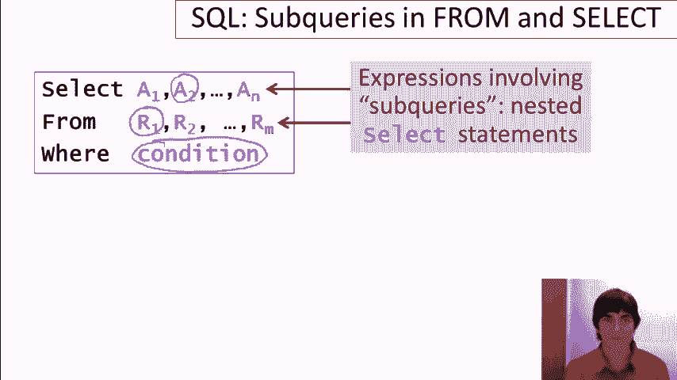

# SQL教程 P9：06-05-在FROM和SELECT子句中使用子查询 🧩


在本节课中，我们将学习如何在SQL查询的`FROM`子句和`SELECT`子句中使用子查询。我们将通过具体的示例，了解这两种子查询的用途、语法以及它们如何帮助我们编写更简洁、更高效的SQL语句。

---

## 概述 📋

在前面的课程中，我们介绍了子查询，并学习了如何在`WHERE`子句中使用它们来构建查询条件。本节课，我们将进一步探索子查询的另外两种常见用法：在`FROM`子句中生成临时表，以及在`SELECT`子句中作为计算列的值。我们将使用一个简单的大学招生数据库（包含`college`、`student`和`apply`表）来演示这些概念。



---

## 在FROM子句中使用子查询 🗂️

上一节我们介绍了子查询的基本概念，本节中我们来看看如何在`FROM`子句中使用子查询。其核心思想是：将一个`SELECT`语句（子查询）的结果作为一个临时的“表”，供外层查询使用。

### 应用场景：简化复杂计算

假设我们需要根据学生的高中规模来调整其GPA（绩点），调整公式为：`GPA * (高中规模 / 1000)`。我们想找出那些调整后的GPA与原GPA相差超过1.0的学生。

以下是不使用子查询的初始写法，其中调整GPA的复杂表达式需要重复书写多次：

```sql
SELECT sID, sName, GPA, GPA*(sizeHS/1000.0) AS scaledGPA
FROM Student
WHERE GPA*(sizeHS/1000.0) - GPA > 1.0
   OR GPA - GPA*(sizeHS/1000.0) > 1.0;
```

我们可以使用`ABS()`函数简化`WHERE`条件，但调整GPA的表达式仍然出现了两次：

```sql
SELECT sID, sName, GPA, GPA*(sizeHS/1000.0) AS scaledGPA
FROM Student
WHERE ABS(GPA*(sizeHS/1000.0) - GPA) > 1.0;
```

为了彻底避免重复计算，我们可以将计算调整GPA的部分放入`FROM`子句的子查询中：

```sql
SELECT *
FROM (
    SELECT sID, sName, GPA, GPA*(sizeHS/1000.0) AS scaledGPA
    FROM Student
) AS G
WHERE ABS(G.scaledGPA - G.GPA) > 1.0;
```

**代码解析**：
*   `FROM`子句中的子查询 `(SELECT ... FROM Student)` 会先执行，生成一个包含`sID`、`sName`、`GPA`和新增列`scaledGPA`的临时结果集。
*   我们使用`AS G`为这个临时结果集指定了一个别名`G`。
*   外层查询的`SELECT *`和`WHERE`子句就可以像操作普通表一样，引用`G`中的列（例如`G.scaledGPA`和`G.GPA`）。

这种方法使查询逻辑更清晰，复杂计算只书写一次，便于维护。


---

## 在SELECT子句中使用子查询 🔍

在`FROM`子句中，子查询生成的是一个表。而在`SELECT`子句中，子查询的作用是**为结果集的每一行生成一个单独的值**。这意味着`SELECT`子句中的子查询必须返回**标量值**（即单个值）。

### 应用场景一：为每所大学查找最高申请者GPA

假设我们想列出每所大学及其申请者中的最高GPA。一种方法是使用多表连接和`GROUP BY`。另一种更直观的方法是，在`SELECT`列表中为每所大学动态计算其最高GPA。

以下是使用`SELECT`子句中子查询的写法：

```sql
SELECT cName, state,
       (SELECT MAX(GPA)
        FROM Apply, Student
        WHERE Apply.sID = Student.sID
          AND Apply.cName = College.cName) AS maxGPA
FROM College;
```


**代码解析**：
*   对于`FROM College`表中的每一行（即每一所大学），外层查询都会执行一次`SELECT`子句中的子查询。
*   该子查询通过连接`Apply`和`Student`表，并利用条件`Apply.cName = College.cName`，找出申请**当前这所大学**的所有学生的最高GPA（`MAX(GPA)`）。
*   这个计算出的最高GPA值，会作为该行结果中`maxGPA`列的值输出。

### 重要限制：必须返回单个值

`SELECT`子句中的子查询**必须且只能返回一个值**。如果它返回多行，数据库将无法决定使用哪个值来填充结果单元格，从而导致错误。

例如，下面的查询试图为每所大学列出**所有**申请者的姓名，这是错误的：

```sql
-- 错误示例！子查询返回了多行
SELECT cName, state,
       (SELECT sName
        FROM Apply, Student
        WHERE Apply.sID = Student.sID
          AND Apply.cName = College.cName) AS students
FROM College;
```

执行此查询会报错，因为对于一所大学（如“Stanford”），子查询可能返回多个学生姓名（“Amy”、“Bob”等），而一个结果单元格无法容纳多个值。

---

## 总结 🎯

本节课我们一起学习了子查询的两种高级用法：
1.  **在`FROM`子句中使用子查询**：将子查询的结果作为临时表使用，常用于简化复杂表达式、分步计算或组织查询逻辑。
2.  **在`SELECT`子句中使用子查询**：为结果集的每一行动态计算一个列值。这是其**核心公式**：`SELECT 列1, 列2, (返回单个值的子查询) AS 新列 FROM 表`。务必记住，此类子查询必须返回**标量值**（单行单列）。


通过将子查询灵活运用于`FROM`和`SELECT`子句，我们可以构建出更强大、更模块化的SQL语句，有效解决复杂的数据检索问题。在后续关于聚合函数的课程中，我们还会看到更多结合子查询的实用技巧。