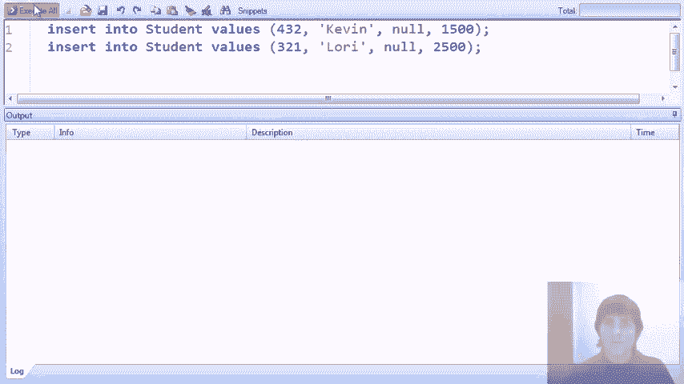

# [斯坦福大学 - 数据库系统入门] Introduction to Databases - Jennifer Widom - Stanford - P11：06-07-null-values.mp4 - 哈库那玛塔塔i - BV1R4411u7dt

 In this video， we'll be learning about null values in SQL。

 As usual， we'll be considering a simple college admissions database。

 and we'll be exploring the select from where query expressions。 Now。

 instead of extending what we can write in queries， in this video。

 we'll be looking at extending what's in the data。 Specifically， in relational databases。

 unless specified otherwise， any value in an attribute can take on the special value null。

 Null is usually used to mean that the value is undefined or unknown。 For example。

 we might have a student whose GPA is unknown or who doesn't have a GPA。

 and we would represent that in our data with null。

 Or we might create our apply relation with the decisions not yet decided。

 and those decision values would also be null。 So what we're going to look at in our demo queries is what happens when we have no values。

 and we run queries over the database。

 Here is the set of students in our database。 In order to explore what happens。

 when we have null values， let's insert two new students， Kevin and Lori。

 each of which have a null GPA。 We go back and we look at our student table。

 and now we see Kevin and Lori。

 as part of that table， and in this particular interface， null values are depicted as blanks。

 Now let's run some queries。 Our first query finds students whose GPA is greater than 3。5。

 It's a simple query to write。 We run the query and we find a number of students， in our result。

 We don't have Kevin and Lori because their GPA is our null。

 so we can't determine that they're greater than 3。5。

 Let's run another query that says GPA less than or equal to 3。5。

 We'll get a different set of students as we see， but we still don't get Kevin and Lori。

 Now let's run a query where we ask for the GPA to be greater than 3。5， or less than or equal to 3。5。

 This is the one that's a little bit funny。 Actually we talked about this very same query back when we were talking about。

 the relational model。 When you look at the query， you would think that you would。

 get every student in the database because everybody's GPA， obviously， is either， greater than 3。

5 or less than or equal to 3。5 or from a more logical point of view。

 This is an expression that's always true。 But you might not be surprised when we run the query。

 we still don't get Kevin or Lori， because we can't determine that their GPA satisfies either of these conditions。

 So even when we have a query that looks like the where clause is a tautology。

 meaning a logical expression that's always true， we still don't get all the data in the result。

 If we want this query to return all students in the database， we can do that。

 by adding one more clause to the where， which is or GPA is null。

 Now this is truly a condition that will be matched by every tuple because either the。

 GPA is greater than 3。5， less than or equal to 3。5， or it's a null value。

 Is null is a keyword phrase and sequel that matches values that are null。 Now when we run the query。

 we finally get all of the students in the database， including Kevin and Lori。

 Just to drive the point home a bit further， let's continue looking at queries where we have null values involved in where clauses。

 In this query， we're looking for students where their GPA is greater than 3。5 or their。

 size high school is less than 1600。 So let's run the query and see who we get。

 We get all of these students， including Kevin。 So although his GPA is null and therefore we can't。

 determine that it satisfies this part of the condition， because his high school size is 1500。

 he does satisfy the second part of the condition and he does come out in our result。

 Now let's add one more condition， which is or size high school is greater than or equal to 1600。

 So now we have again something in the condition that looks like a topology。

 It looks like it should always be true。 Everyone's high school is either smaller or larger than 1600。

 Furthermore， in this case we have no null values for the high school size。

 So when we run this query， we should get back everybody。 And indeed when we run the query。

 we do get back all of the students。 Now I'm not going to go into details here。

 but you can certainly read about it。 The way the where clause is evaluated when null values are involved is using a 3-valued logic。

 where every expression is either true or false or unknown。

 These logical values are combined to finally yield a value for the where expression that determines whether a tuple is in the result。

 Our last series of queries explores the interaction between null values and aggregate functions。

 specifically in this case the count function。 There are actually quite a few subtleties about null values and aggregation。

 and also null values and subqueries。 We're not going to do an exhaustive exploration of these subtleties here。

 but just give one example。 And we encourage you if you are using a database with null values to be very careful when you write your queries。

 to make sure you understand how the null values are going to influence the result。 Okay。

 so our query here is counting the number of students whose GPA is not null for starters。

 So we run the query and we see that there are 12 students who have a non-null GPA。

 Those are the 12 students we had originally in the database before we added Kevin and Lori with their null GPA。

 Now instead of just counting the students， let's count the distinct GPAs。

 So among these 12 students， how many different GPAs are represented？

 It turns out there are seven distinct GPAs among those that are not null。

 Let's further drop the not null condition and just count the distinct GPAs among the students。

 That will tell us whether count distinct includes nulls or not in its count。

 We'll run the query and we get the same answer。 So we still have seven distinct GPAs and we are not counting the null values。

 Now let's do one last query which is to take away the count and just look at the distinct GPAs themselves。

 So we had seven when we did the count。 We run the query now and we get eight。 What happened？

 Well this first couple， it's a little hard here with the visualization。

 This first answer is empty and that's actually the null value。 So when we right select distinct GPA。

 we do include the null value in our result if there is a null GPA。 However。

 when we count the distinct values， we don't include the null。

 And that's really just one example of the type of subtleties and possibly unexpected behavior we might get when we have null values。

 So again， I encourage you to be very careful when writing queries over databases that include nulls that you know exactly what you're going to get in your result。

