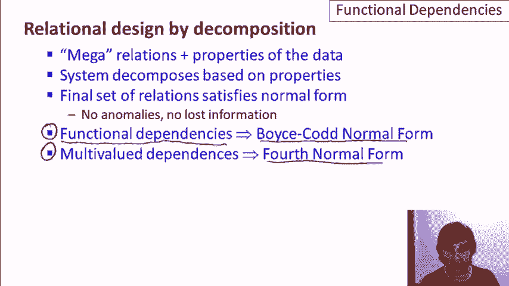

# [斯坦福大学 - 数据库系统入门] Introduction to Databases - Jennifer Widom - Stanford - P14：07-02-functional-dependencies.mp4 - 哈库那玛塔塔i - BV1R4411u7dt

 This video covers functional dependencies。

 First， a quick recap of relational design by decomposition。

 The idea is that the application designer， writes mega-relations that contain all the information。

 that we want to have and properties of the data that we're storing。

 and then the system will automatically decompose those， based on the properties that are specified。

 The final set of decomposed relations will satisfy what's called， the normal form。

 and normal forms are good relations， in the sense that they have no anomalies and they don't lose information。

 from what was specified in the original mega-relations。 Now。

 the properties themselves are defined either as functional dependencies。

 in which case the system will generate Boyce-Cud-normal form relations。

 or multi-valued dependencies， which we will then yield， fourth normal form relations。 So this video。

 as you can tell， is about functional dependencies themselves。

 And let me say that functional dependencies are actually a generally useful concept。

 in databases， not only for relational design。 So， for functional dependencies， as we'll see soon。

 are a generalization of the notion of keys， and they allow the system to， for example。

 store the data more efficiently， when the system knows about functional dependencies。

 Compression schemes can be used based on functional dependencies for storage。 And also。

 functional dependencies， as a generalization of keys。

 can be used to reason about queries and for query optimization， which， as a reminder。

 is a very important aspect of database systems， which allows declarative queries to be executed。

 by the system efficiently。 By the way， a third use of functional dependencies is for exam questions。

 in database courses， because there's a very nice theory of functional dependencies， as you'll see。

 and it's quite easy to write questions about them。

 So the remainder of the video will cover functional dependencies in general， as a general concept。

 and not specifically to relational design， and then later videos will tie functional dependencies back to design by decomposition。

 As always， we'll be using， as a sample， a college application database， and in this case。

 I've expanded the information that we're including quite a bit。

 We'll be using these same two relations as examples throughout this video。

 and subsequent videos on relational design。 In this case， we're going to look at two relations。

 one with information about students， and then a separate one with information about where they're applying。

 The student information will have a social security number， the student's name， their address。

 and then three attributes about their high school。

 We'll assume there's unique codes for high schools。

 but then they also have a name and are in a city。 Finally。

 the student's GPA and a priority field for admissions that we'll see in a moment。 For applications。

 we'll have the student's social security number， the college name they're applying to。

 the state of the college， the date of application， and the major。

 Not all of these attributes will even be used in this video， but like I said。

 this will permeate several videos as our running example。 To motivate functional dependencies。

 let's focus on the student relation， and specifically on the GPA and priority attributes。

 Let's suppose that a student's priority is determined by their GPA。 For example。

 we might have a rule that says if GPA is 3。8， greater than 3。8， then priority is one。 If the GPA is。

 say， in between， let's say， 3。3 and 3。8， then we'll set priority to be equal to。

 and let's say if the GPA then is less than 3。3， then the priority value is three。

 So this relationship is guaranteed in our data， then what we can say is that any two。

 tuples that have the same priority are guaranteed to have the same GPA。

 and let's formalize that concept。 So I'm going to write a little logical statement here to formalize the concept。

 I'm going to use that for all symbol from predicate logic。

 and I'm going to say if we have any pair of， tuples， so for all t or u， those are tuples。

 in the student relation， then if the student， if the t and u have the same priority， so I'll say。

 I'm sorry， the same， let me fix that， they have the same GPA， so if t。gpa equals u。gpa， then。

 and this is the logical implication symbol， then t。priority will equal u。priority。

 So this logical statement is in fact the definition of a functional dependency。

 and we would write that functional dependency as gpa arrow priority。

 So that says the GPA determines the priority， or any two tuples with the same GPA must have the same priority。

 So that was a specific example。 Now let's generalize our definition。

 So let me replace gpa in priority here with just two attributes A and B of， say， a relation R。

 And then we'll also need to modify our definition。

 So you can see I've erased the specific attributes and relation。

 and I'll just say for every t and u in our relation R， if t。a equals u。a， then t。b equals u。b。

 and that's the definition of the functional dependency A determines B for a relation R。

 Actually I'm going to generalize this definition even further because functional dependencies don't always have to have one attribute on each side。

 they can actually have a set of attributes。 So now I write A1， A2， dot， dot， dot。

 An on the left-hand side。 These will all be attributes of relation R， and on the right-hand side B1。

 B2， comma， Bm， again attributes of R。 Modifying the formal definition in red。

 now I can't use the dot notation anymore。 So I'll use a square bracket。

 and I'll write A1 through An equals u square bracket A1 through An。

 So what I'm saying here in this case is that the two tuples， t and u。

 have the same values for all of the attributes A1 through An。

 and if they do then they will also have the same values for B1 through Bm。

 We'll be getting to some concrete examples soon。 Just one last bit of notation before we move on。

 For simplicity I'm going to often in the video abbreviate a list of attributes or set of attributes by using a bar。

 So I'll write A bar to indicate a set of attributes A and B bar to indicate a set of attributes B。

 And again this is just for convenience。 So we've seen the motivation for a functional dependency in a relation。

 A functional dependency for a relation is based on knowledge of the real world data that's being captured。

 And when we specify one， just like specifying keys。

 all instances of the relation must adhere to the functional dependency。

 So just to summarize functional dependencies we say that a set of attributes A functionally determines a set of attributes B。

 If again any time tuples agree in their A values they also agree in their B values。

 And let's say that our relation here R has the tuples in A。

 the tuples in B and also a few more attributes we'll call those C。

 So let me draw a picture of a relation now here that has those attributes in it。 So we'll have here。

 let's just three columns but again these are multiple attributes。 And these are the attributes A。

 these are the attributes B and these are the attributes C。

 And if we put in a couple of tuples then what we'll say is if we have two tuples here that have。

 and I'm going to use a bar even for these values in the tuples。

 If we have two tuples whose A values are the same then their B values must also be the same。

 And we're going to be using this type of template for some reasoning later on。

 But we're not saying their C values have to be the same so we could have C1 and then different C values here as well。

 But again if we specify this functional dependency we are saying that every instance of our relation must satisfy the condition that if the A values are the same then the B values are also the same。

 Finally let's come back to our example and I think when we start writing functional dependencies for our actual relations it'll give you a good idea of what they're really capturing。

 So let's write a few functional dependencies for our student relation based on what we expect to be true in the real world。

 in the data that we're capturing in the relation。 So here's a first example。

 social security number functionally determines S name， the student's name。

 So what we say if we have multiple tuples about a particular student they have the same social security number say two tuples about student one。

 two， three， we're expecting them to have the same name。

 In fact we're requiring them to have the same name and presumably because one to three is sort of identifying the student that would be a natural functional dependency that would hold in this case。

 And similarly we would expect social security number to determine address although we're already making an assumption about the real world here。

 If we have this particular functional dependency then we're saying a student doesn't move。

 They don't have multiple addresses every tuple that describes that student by their social security number will have the same address。

 Let's go to the high school and see what might be going on there。

 So I mentioned that the high school code， what I'm trying to capture there is a unique code for each high school that might be filled in college applications。

 Then we would expect the high school code to determine the high school name。

 Every time we have the particular high school code。

 maybe for different students it would have the same name and also it would have the same city。

 So that's an example of a functional dependency with two attributes on the right hand side。

 Now let's look at one that's a little more complicated which is one that has two attributes on the left hand side instead。

 That actually turns out to be a more interesting case。

 In fact in this particular case we can probably reverse the arrow and have a functional dependency in the other direction。

 If we have a combination of high school name and high school city。

 I'm going to assume that's unique。 That there's never two high schools with the same name and the same city。

 If that's the case， if that's unique then we would expect a functional dependency to the high school code。

 Anytime we have the same name and city we're talking about the same high school so we should have the same code。

 What other examples do we have？ If we assume that there's one GPA for each student then we'd have the Social Security number determine the GPA。

 And we already talked about GPA determines priority。 And another example。

 actually if we put these two together we should see well if we have the same Social Security number twice then we should have the same priority。

 And you might be thinking well that's kind of a transitive rule that takes these two and produces that one and indeed it is。

 And we'll talk about rules for functional dependencies later。 And there may be more in this case。

 Now let's take a look at functional dependencies for our apply relation。

 Actually this one is a little trickier。 It's even possible there are no functional dependencies at all。

 It really depends on the real world data， the real world constraints。

 One possibility for example is that every college has a particular single date on which it receives its application。

 So if that were the case then we'd have the college name determine the date。

 In other words every application for a particular college must have the same date。

 Another constraint might be that students are only allowed to apply to a single major at each college they apply to。

 So if that were the case this is another one with two attributes on the left hand side we'd say that the Social Security number together with the college implies the major。

 In other words we cannot have a student and college combination with two different majors and that captures that constraint。

 Maybe we have a constraint that students are only allowed to apply to colleges in one state。

 That seems rather unlikely but I was struggling to find functional dependencies for this case。

 In that case we'd have this functional dependency again saying a student could only apply to colleges in a single state。

 For the apply relation specifically again it's really the real world constraints that drive which functional dependencies hold for the relation。

 But it's important to understand those constraints so they can be translated to functional dependencies which then can drive good relational design。

 So I've alluded a few times to the fact that functional dependencies generalize the notion of keys and let's make that connection explicit now。

 Let's suppose we have a relation R and R has no duplicate tuples。

 R has some attributes A and it has some other attributes let's call those B。

 And let's suppose that we have a functional dependency that A determines all of the attributes in the relation。

 Now let me draw a picture of that。 So here's a relation R with attributes A and attributes B and now let's suppose that we have two tuples with the same values for A。

 So we'll just write those as little A bar and now let's see what happens with the B values。

 We'll make them B1 bar and B2 bar。 Because we have the functional dependency the equal values here for A say that B1 and B2 have to be equal。

 So B1 equals B2 let's just erase the little one and two but now we've generated duplicate tuples。

 So what the function of dependency tells us in that case is that these two tuples are actually the same or rather we cannot have two separate tuples with the same A value。

 So we cannot have two tuples with the same A values is exactly what it means for A to be a key。

 Now again this is only the case when we have no duplicates in R but if we have no duplicates if a set of attributes determines all the other attributes then those attributes are a key。

 So here are a few other definitions related to functional dependencies。

 We have a notion of a trivial functional dependency。

 A functional dependency is trivial A to B if B is a subset of A and let's just draw a little picture of what that means。

 So here we have our attributes A and then we're saying and that's all of the attributes here and what we're saying is that B is a subset of A。

 So in other words some portion of these attributes here we'll just mark that in purple here are attributes B。

 Well it's pretty obvious that if two tuples have the same values across their entire expanse here for A's then obviously they're also going to have the same values for just this portion here。

 the B portion。 So that's why it's called the trivial functional dependency。

 So a non-trivial functional dependency is a functional dependency that's not a trivial one。

 By the way FD is a common abbreviation for functional dependency。

 So if we have A determines B then that is non-trivial if it's not the case that B is a subset of A。

 Going to our picture let's have here our attributes A and now we're saying there are some attributes in B that are not part of A so we can say well maybe B is partially part of A but there's some portion that's not part of A。

 So let's say that these are our B attributes here。

 So now our functional dependency is actually saying something。

 It's saying if we have two attributes that agree in these values then they're also going to agree in these values over here。

 And the last definition is a completely non-trivial functional dependency and that's A determines B where A and B have no intersection at all。

 So in that case again going back to our picture we'll have our A attributes here and then our B attributes are going to be some portion of the remaining attributes。

 And here we're saying a lot。 We're saying if these two have the same value then these two have the same value as well。

 And the reality is that completely non-trivial functional dependencies are the ones that we're most interested in specifying。

 I mentioned that there are some rules that apply to all functional dependencies and I'll give a couple of those right now。

 The first one is the splitting rule。 The splitting rule says that if we have a set of attributes that determine another set of attributes and this time I'm going to write it out instead of using the bar notation。

 Then we also have this rule this implies that we have A determines B1 and A determines B2 and so on。

 In other words we can split the right side of the functional dependency and if you think about it this is pretty obvious。

 If we say that the A when the A values are the same all of the B values have to be the same then certainly when the A values are the same the B values have to be the same independently。

 Now you might wonder if the splitting rule also goes the other way。

 So let's say we have I'll put the left hand side I'll write out the attributes explicitly。

 So let's say we have A1 through An determines B then is it from that the case that A1 determines B and A2 determines B on its own and so on。

 All the answer to that is no and I'll give a simple example from our college application database。

 So let's say that we have the functional dependency high school name and high school city determines high school code。

 We talked about that one before。 Oops， here that's an arrow there。

 So that says that when we have a particular name and city combination for a high school that's identifying a single high school and so we'll always have the same code。

 So that makes a lot of sense but it is not the case so I'll put a big X here necessarily that if we split the left hand side that high school name alone will determine high school code。

 So for example I would venture to guess that there's a lot of Jefferson high schools all over the country and they won't all be the same high school。

 So it's really the combination of attributes on the left that together functionally determine the right hand side and so we do not then have the splitting rule as a general principle。

 The combining rule is the inverse of the splitting rule。

 It says if we have a determines b1 and we have a determines b2 and so on up to a determines bn then we also have a determines b1 through bn together。

 Next we have two trivial dependency rules。 Let me remind you what a trivial dependency is。

 It's a determines b where b is a subset of a。 So in other words every left hand side determines itself or any subset of itself and that's what drives the two trivial dependency rules。

 One of them says that if we have a determines b then we also have a determines a union b。

 So in other words we can add to the right hand side of every dependency what's already on the left hand side。

 Sort of as a converse we can also say that if a determines b then a determines a intersect b。

 Actually this one is also implied by the splitting rule so we have two different rules in this case that are doing the same thing。

 And finally the transitive rule which is the one we alluded to earlier。

 It says if we have a determines b and we have b determines c then we have a determin c。

 Now all of these rules can actually be proven formally and I'm going to go through a sketch of this particular one。

 So here's my relation R and I'll have attributes a， b。

 c and then let's let d be the left of our attributes。

 And my goal is to prove that a determines c and the information I have to prove that is these two functional dependencies here。

 So to prove that a determines c I have to prove that if two tuples have the same a values。

 we'll put little bars there， then they also have the same c values。

 So I need to show that these two c values here are going to be the same。

 So you can see what's going to happen。 Using the first functional dependency because these two a values are the same。

 I know their b values must be the same。 And then I just use the second functional dependency and because the two b values are the same。

 I then know that the two c values are the same and that has shown that this functional dependency holds。

 And you can do a similar thing to prove the other rules to yourself。

 Now I'm going to introduce the concept of closure of attributes。

 Let's suppose we're given a relation， a set of functional dependencies for that relation。

 and then a set of attributes a bar that are part of that relation。

 I'm interested in finding all attributes b of the relation such that a bar functionally determines b。

 And this is what's called the closure and I'll show in a bit why we might want to compute that。

 Notationally， the closure is written using the plus sign， so the closure of a bar is a bar plus。

 Let me be a little more explicit。 Let me write out a bar because remember whenever we write bar we're actually talking about a list of attributes。

 So we're going to write it as a one through a n and I'm interested in computing the closure of that set of attributes。

 In other words， the entire set of attributes that are functionally determined by the attributes a one through a n。

 And I'm going to give an algorithm for doing that。 My algorithm says start with the set itself。

 So I'm going to start with a one through a n， except I'm not going to close that。

 I'm going to leave a little space there。 And then I'm going to repeat until there's no change。

 I'm going to add attributes to that set until I get to the closure。

 So I'm going to repeat if a determines b and that will put bars in here and all of a are in the set。

 then add b to the set。 So I might have my attributes here。

 a one through a n and it might be the case that a four determines attributes c and d。

 So I'll add c and d to the set。 I repeat maybe there's a c goes to e and I'll add e to the set and so on。

 And when there's no more change， then I've computed the complete closure。

 Now if you happen to be someone who likes to think in terms of rules instead。

 what we're effectively doing is applying the combining and transitive rules to the attributes in the set until there's no change。

 So let's run an example of the closure algorithm。 Let's go to our complete student table and let's add three functional dependencies。

 One that says this student's social security number determines their name。

 address and GPA and that would be normal。 GPA determines priority and high school code determines high school name and high school city。

 Again， these are all examples we gave earlier that would be natural functional dependencies for this particular relation。

 Let's suppose that we're interested in computing the closure of the two attributes。

 social security number and high school code。 So in other words。

 we want to find all attributes in the student relation that are functionally determined by these two attributes。

 So the algorithm says start with the two attributes themselves。

 social security number and high school code， and then add attributes that are functionally determined by ones in the set。

 So if we start with our first functional dependency here。

 because we have a social security number that allows us to add the student name， the address。

 the GPA。 And that's it for that one。 Now let's repeat again。 Because we have the GPA。

 our second functional dependency tells us we can add the priority。 And that's it for that one。

 And then since we have the high school code in the set。

 our third one tells us that we can add the high school name and the high school city。

 And at that point， we certainly know we're done because we've actually got the entire relation at this point。

 Now I didn't pick this particular example at random。 We took two attributes。

 social security number and high school code。 We computed their closure and we discovered that they together functionally determined all attributes of the student relation。

 Now remember just a few slides ago， when a set of attributes functionally determined all the attributes。

 then those attributes together form a key for the relation。 And in fact， if you think about it。

 social security number and high school code together are a natural key for the relation。

 A student might go to multiple high schools， but there's no reason to have more than one tuple with the combination of a particular student and the high school they attended。

 So let's formalize a bit this relationship between the notion of closure and keys。

 Let's suppose we're interested in answering the question。

 is a particular set of attributes a key for a relation？ We can use closure to do that。

 Remember we have the relation and we have a set of functional dependencies for the relation。

 So what we do is we compute the closure of a， that's going to give us a set of attributes。

 and if that equals all attributes， then a is a key。 As a more general question。

 let's suppose we're given a set of functional dependencies for a relation。

 How can we use it to find all of the keys for the relation？

 So we use the same basic idea of computing closure。

 but this time we have to do it for every subset of the attributes。

 So let's call each subset a bar and we just check if the closure of a bar determines all attributes。

 And if it does， then it's a key。 And by considering every subset of the attributes in our。

 then we're considering every possible key， and we'll just check for each one whether it's actually a key。

 Now that seems fairly inefficient and actually we can be a little more efficient than that。

 We can consider these subsets in increasing size order。 So for example。

 if we determine that a and b together determine all attributes。

 functionally determine all attributes in the relation， that tells us a， b is a key。

 And that actually also tells us that every superset of a， b is also a key。

 And if you think about it， that falls out naturally。

 So the real algorithm would say let's start with single attributes and determine if there are key。

 if a single attribute say c is a key， then so is every superset of c。

 and then we go to pairs of attributes and so on。 Finally。

 let's talk about how we specify the set of functional dependencies for a relation。 First。

 I'll define a notion of one set of functional dependencies following from another one。

 So let's suppose we have a relation R and we have two sets of functional dependencies that aren't identical。

 S1 and S2。 We say that S2 follows from S1 if every relation instance satisfying S1 also satisfies S2。

 As a simple example， suppose S2 is Social Security Number determines priority and suppose S1 is the two functional dependencies。

 Social Security Number determines GPA and GPA determines priority。

 Then it's certainly the case that in， for this example， S2 follows from S1。

 Every time we have a relation that satisfies Social Security Number determines GPA and GPA determines priority。

 then that relation will also satisfy Social Security Number determines priority。

 And we kind of proved that actually in an earlier part of this video。

 So one question you might have is how do we test whether one set of functional dependencies follows from another。

 That really boils down to testing whether one functional dependency follows from a set。 So。

 and let me just make this A bar， B bar here to make clear they can be sets of attributes。

 Because if we have S1 and S2， then we just check whether every functional dependency in S2 follows from the functional dependencies in S1。

 There's actually two ways of going about this test。 One of the ways is to use the closure。

 We'll compute A plus based on the functional dependencies that are in S and then we'll check if B bar B is in the set。

 Reminder， computing the closure tells us every attribute that's functionally determined by the attributes in A based on the functional dependencies in S。

 If those include B， then A determines B does indeed follow from S。

 The second way to check is based on a set of axioms， a set of rules called Armstrong's axioms。

 We saw some rules for functional dependencies earlier。

 but Armstrong's axioms are a specific set of rules that are what's called complete。

 It's guaranteed that if one thing about functional dependencies can be proved from another。

 then it can be proved using the Armstrong's axioms。

 I'm not going to cover Armstrong's axioms in the videos。

 but you can look at any of the recommended readings and find them there。

 You might wonder why did I introduce this notion of one set of functional dependencies following from another？

 For that matter， why did I introduce trivial and non-trivial functional dependencies？ Well。

 I'm going to sum up in one sentence what we're looking for when we specify the set of functional dependencies for a relation。

 We have a notion of the real-world data。 We have our attributes。

 but we need to specify the functional dependencies in order to get a good design or for some other reasons I mentioned。

 What we would like to find is a minimal set of completely non-trivial functional dependencies such that all functional dependencies that hold on the relation。

 follow from using the technical definition I gave the dependencies in the set。 Wow。

 that seems like a very complicated thing， but the fact is when you start specifying functional dependencies。

 you'll discover that you will actually get this definition pretty naturally。 So to conclude。

 functional dependencies are a generally useful concept in database systems。

 They're a key ingredient of doing relational design by the decomposition。

 because we use the functional dependencies to get Boyzka normal form。

 which is what we'll cover in the next video。 But they're also useful for the system to determine how to store data。

 to compress data， and also to reason about query processing。

