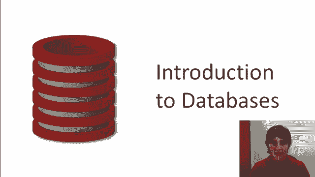
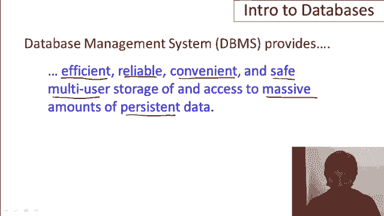
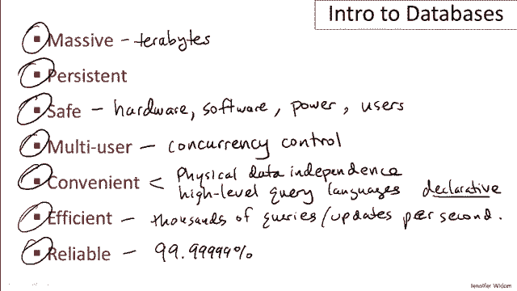
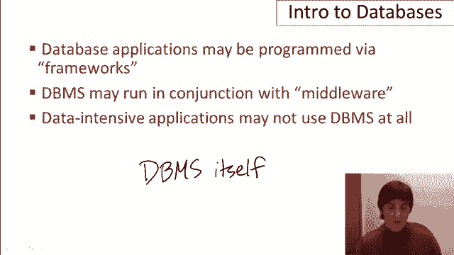
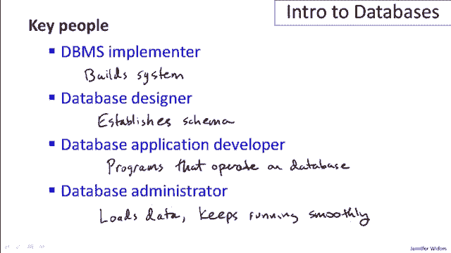
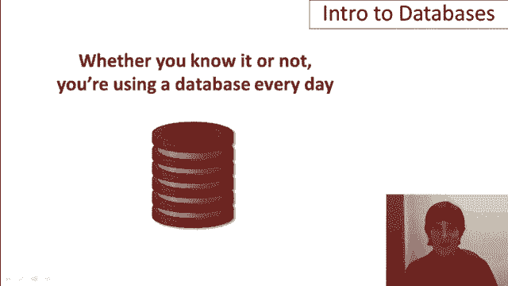

# [斯坦福大学 - 数据库系统入门] Introduction to Databases - Jennifer Widom - Stanford - P1：01-01-introduction - 哈库那玛塔塔i - BV1R4411u7dt

 Welcome to the course Introduction to Databases。 I'm Jennifer Whittom from Stanford University。

 In this course we'll be learning about databases and the use of database management systems。

 primarily from the viewpoint of the designer， user， and developer of database applications。

 I'm going to start by describing the， in one very long sentence。

 what a database management system provides for applications。

 It provides a means of handling large amounts of data primarily。

 but let's look at a little more detail。 What it provides in a long sentence is efficient， reliable。

 convenient， and safe， multi-user storage of and access to massive amounts of persistent data。

 So I'm going to go into each one of those adjectives in a little bit more detail in a moment。

 but I did want to mention that database systems are extremely prevalent in the world today。

 They sit behind many websites。 They're what run your banking systems， your telecommunications。

 deployments of sensors， scientific experiments， and much， much more highly prevalent。

 So let's talk a little bit about why database systems are so popular and so prevalent by looking at these seven adjectives。

 The first aspect of database systems is that they handle data at a massive scale。

 So if you think about the amount of data that's being produced today。

 database systems are handling terabytes of data， sometimes even terabytes of data every day。

 And one of the critical aspects is that the data that's handled by database management systems is much larger than can fit in the memory of a typical computing system。

 So memories are indeed growing very， very fast， but the amount of data in the world and data to be handled by database systems is growing much faster。

 So database systems are designed to handle data that's residing outside of memory。 Secondly。

 the data that's handled by database management systems is typically persistent。

 And what I mean by that is that the data in the database outlives the programs that execute on that data。

 So if you have a run a typical computer program， the program will start。

 the variables will be created。 There will be data that's operated on the program。

 the program will finish and the data will go away。 It's sort of the other way with databases。

 The data is what sits there， and then the program will start up， will operate on the data。

 the program will stop， and the data will still be there。

 Very often actually multiple programs will be operating on the same data。 Next， safety。

 So database systems， since they run critical applications such as telecommunications and banking systems。

 have to have guarantees that the data managed by the system will stay in a consistent state。

 It won't be lost or overwritten when there are failures。 And there can be hardware failures。

 There can be software failures。 Even simple power outages。

 You don't want your bank balance to change because the power went out at your bank branch。

 And of course there are the problem of malicious users that may try to corrupt data。

 So database systems have a number of built-in mechanisms that ensure that the data remains consistent regardless of what happens。

 Next， multi-user。 So I mentioned that multiple programs may operate on the same database。

 and even with one programming operating on a database。

 that program may allow many different users or applications to act。

 So when you have multiple applications working on the same data。

 the system has to have some mechanisms， again， to ensure that the data stays consistent。

 That you don't have， for example， half of a data-item rover written by one person and the other half over written by another。

 So there's mechanisms in database systems called concurrency control。

 And the idea there is that we control the way multiple users access the database。

 Now we don't control it by only having one user have exclusive access to the database or the performance would slow down considerably。

 So the control actually occurs at the level of the data items in the database。

 So many users might be operating on the same database。

 but be operating on different individual data items。

 It's a little bit similar to say file system concurrency or even variable concurrency in programs。

 except it's more centered around the data itself。 The next adjective is convenience。

 And convenience is actually one of the critical features of database systems。

 They really are designed to make it easy to work with large amounts of data and to do very powerful and interesting processing on that data。

 So there's a couple of levels at which that happens。

 There's a notion in databases called physical data independence。 And what that's kind of a mouthful。

 but what that's saying is that the way the data is actually stored and laid out in disk on disk is independent of the way the programs think about the structure of the data。

 So you could have a program that operates on a database and underneath there could be a complete change in the way the data is stored。

 yet the program itself would not have to be changed。

 So the operations on the data are independent from the way the data is laid out。

 And some are related to that as the notion of high level query languages。

 So the databases are usually queried by languages that are relatively compact and described really at a very high level what information you want from the database。

 Specifically， they have an obey a notion that's called declarative。

 And what the declarative is saying is that in a query you describe what you want out of the database。

 but you don't need to describe the algorithm to get the data out。 And that's a really nice feature。

 It allows you to write queries in a very simple way and then the system itself will find the algorithm to get that data out efficiently。

 And speaking of efficiency， that's number six， but certainly not sixth importance。

 There's in real estate is a little aside here， a old saying that when you have a piece of property。

 the most important three aspects of the property are the location of the property。

 the location and the location。 And people say the same thing about databases is a similar parallel joke。

 which is that the three most important things in the database system is first performance。

 second performance， and again performance。 So database systems have to do really thousands of queries or updates per second。

 And these are not simple queries necessarily。 These may be very complex operations。

 So constructing a database system that can execute queries。

 complex queries at that rate over gigantic amounts of data， terabytes of data is no simple task。

 And that is one of the major features also provided by a database management system。 And lastly。

 but again not last in importance， is reliability。 Again。

 looking back at say your banking system or your telecommunications system。

 it's critically important that those are up all the time。 So 99。

9999% uptime is the type of guarantee that database management systems are making for their applications。

 So that gives us an idea of all the terrific things that a database system provides。

 I hope you're already convinced that if you have an application you want to build that involves data。

 it would be great to have all of these features provided for you in a database system。

 Now let me mention a few of the aspects surrounding database systems and scope a little bit what we're going to be covering in this course。

 When people build database applications， sometimes they program them with what's known as a framework。

 Currently as of the time of this video some of the popular frameworks are Django or Ruby on Rails。

 And these are environments that help you develop your programs and help you generate say the calls to the database system。

 We're not in this set of videos going to be talking about the frameworks but rather we're going to be talking about the database system itself and how it's used and what it provides。

 Second of all database systems are often used in conjunction with what's known as middleware。

 And again at the time of this video typical middleware might be application servers， web servers。

 So this middleware helps applications interact with database systems in a certain types of ways。

 And again that's sort of outside the scope of the course。

 We won't be talking about middleware in the course。

 Finally it's not the case that every application that involves data necessarily uses a database system。

 So historically a lot of data has been stored in files。

 I think that's a little bit less so these days but still there's a lot of data out there that's simply sitting in files。

 Excel spreadsheets is another domain where there's a lot of data sitting out there and it's useful in certain ways。

 And the processing of data is not always done through query languages associated with database systems。

 For example Hadoop is a processing framework for running operations on data that's stored in files。

 Again in this set of videos we're going to focus on the database management system itself and on storing and operating on data through a database management system。

 So there are four key concepts that we're going to cover for now。 The first one is the data model。

 The data model is a description of in general how the data is structured。

 So one of the most common data models is the relational data model。

 We'll spend quite a bit of time on that。 In the relational data model the data in a database is thought of as a set of records。

 Now another popular way to store data is for example an XML document。

 So an XML document captures data instead of a set of records as a hierarchical structure of labeled values。

 Another possible data model would be a graph data model or all data in the databases in the form of nodes and edges。

 So again a data model is telling you the general form of data that's going to be stored in the database。

 Next is the concept of schema versus data。 So one can think of this kind of like types and variables in a programming language。

 The schema sets up the structure of the database。 And it's just going to tell me the structure of the database where the data is the actual data stored within the schema。

 So again in a program you set up types and then you have variables of those types。

 We'll set up a schema and then we'll have a whole bunch of data that adheres to that schema。

 Typically the schema is set up at the beginning and doesn't change very much where the data changes rapidly。

 Now to set up the schema what normally uses what's known as a data definition language。

 Sometimes people use higher level design tools that help them think about the design and then from there go to the data definition language。

 But it's used in general to set up the schema or structure for a particular database。

 Once the schema has been set up and data has been loaded then it's possible to start querying and modifying the data。

 And that's typically done with what's known as the data manipulation language。

 So for querying and modifying the database。 Okay so those are some key concepts。

 Certainly we're going to get into much more detail in later videos about each of these concepts。

 Now let's talk about the people that are involved in a database system。

 So the first person we'll mention is the person who implements the database system itself。

 the database implementer。 That's the person who builds the system。

 That's not going to be the focus of this course。 We're going to be focusing more on the types of things that are done by the other three people that I'm going to describe。

 The next one is the database designer。 So the database designer is the person who establishes the schema for a database。

 So let's suppose we have an application。 We know there's going to be a lot of data involved in the application and we want to figure out how we're going to structure that data before we build the application。

 That's the job of the database designer。 It's a surprisingly difficult job when you have a very complex data involved in an application。

 Once you've established the structure of the database then it's time to build the applications or programs that are going to run on the database often interfacing between the eventual user and the data itself。

 And that's the job of the application developer。 So those are the programs that operate on the database。

 And again， I've mentioned already that you can't have a database with many different programs that operate on。

 It would be very common。 You might， for example， have a sales database where some applications are actually inserting the sales as they happen while others are analyzing the sales。

 So it's not necessary to have a one-to-one coupling between programs and databases。

 And the last person is the database administrator。

 So the database administrator is the person who loads the data。

 sort of gets the whole thing running and keeps it running smoothly。

 So this actually turns out to be a very important job for large database applications。

 For better or worse， database systems do tend to have a number of tuning parameters associated with them。

 And getting those tuning parameters right can make a significant difference in the all-important performance of the database system。

 So database administrators are actually highly valued， very important。

 highly paid as a matter of fact， and are for large deployments an important person in the entire process。

 So those are the people that are involved。 Again， in this class we'll be focusing mostly on designing and developing applications。

 a little bit on administration， but in general thinking about databases and the use of database management systems from the perspective of the application builder and user。

 To conclude， we're going to be learning about databases and whether you know it or not。

 you're already using a database every day。 In fact， more likely than not。

 you're using a database every hour。

