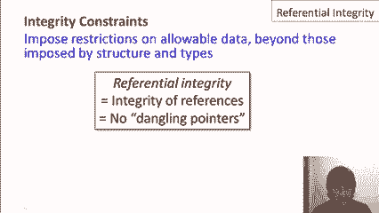
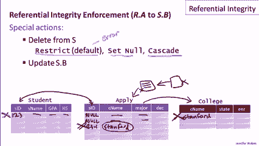

# [斯坦福大学 - 数据库系统入门] Introduction to Databases - Jennifer Widom - Stanford - P20：11-03-referential-integrity.mp4 - 哈库那玛塔塔i - BV1R4411u7dt

 This video introduces a very important type of constraint known as referential integrity。

 As a reminder， integrity constraints in a database restrict the allowable data beyond。

 what's already restricted by the structure and types of the database。

 Now the term referential integrity refers to integrity of references that appear in， the database。

 In a relational database， a reference from one tuple to another occurs through specifying， values。

 The referential integrity says that those values are valid。

 It's sort of equivalent to having no dangling pointers if we used pointers in the database。

 We'll see a number of examples。

 So let's look at our simple example database with the students， colleges and students applying。

 to colleges that we've been using for all of our demos。

 Let's suppose for example that we had a student 123 who had applied to Stanford for some major。

 let's say CS， with a decision of yes。 When we have this tuple。

 the value in the SID field here of 123 presumably refers to a， value here of an actual student。

 So maybe 123 is student Mary with some GPA and some high school。 And furthermore。

 the Stanford value in the C name or college name attribute is presumably。

 referring to the college name in the college table。

 So we would expect to have a Stanford value here。 So this little integrity talks about these values here referencing the corresponding values。

 in the other tables。 Specifically， if we have referential integrity from a attribute A say of a relation R to。

 an attribute B of another relation S， what that's saying is that every value that appears。

 in the A column of relation R must have some corresponding value in the B column of relation， S。

 So if we take a look at our example， we would say then that we would have referential integrity。

 from the SID column of apply to the SID column of student。

 We would expect every value that appears in this column to also have a value in the， other column。

 And similarly， we'll have referential integrity from the college name attribute and apply。

 to the college name attribute in college。 Again， we want every value that appears in this column to also appear in this column。

 Now we might have a violation for example， if we had a say 555 applying to Stanford for。

 some major and some decision， if we have no 555 over in the student table， then this。

 here would be considered a referential integrity violation。

 Finally we might have 123 which is valid because we have 123 student here， but if 123 is applying。

 to Yale and we don't have Yale over here， then again we have a referential integrity violation。

 Now let me mention that referential integrity is directional。

 So we talk about this SID here referencing the SID in the student table。

 We could have referential integrity in the other direction but that's saying something， different。

 That would be saying that every student must apply somewhere， every value for student ID。

 must appear in the apply table。 In this particular example。

 we probably would not have that be the case。 We would probably be able to have students who hadn't yet applied anywhere or colleges。

 where no one had applied yet。 And the most sensible direction for this referential integrity in this case is from the apply to。

 the student and the apply to the college。 But again。

 we could have it in both directions if we so wished。

 Now just a few more details of referential integrity constraints。 The referencing attribute。

 in this case the referencing attribute is A， is often called， the foreign key。

 And in fact referential integrity is often referred to as foreign key constraints。

 And even in the SQL syntax we'll see that the term foreign key is used。 Second。

 when we have a referential attribute， in this case now we're talking about attribute， B。

 so we have R dot A to S dot B。 The reference to attribute is usually required to be the primary key for its table or at least。

 specified as unique。 And that's more about efficient implementation than anything else。

 But it is a requirement in the SQL standard and in most systems。 Third。

 it is possible to have foreign keys that consist of multiple attributes， just like。

 keys themselves can be multiple attributes。 Let's say for example that in our college relation。

 the college named together with the， state for my key， not the college name individually。

 If that were the case then our apply table would presumably have one more column that。

 specified the state， so we know which college a student was applying to。

 And in that case we would have these two attributes together as the foreign key referencing the。

 college name and state together in the college table。

 And we'll see an example of multi-attribute foreign key constraints in our demo。

 Now let's talk about the enforcement of referential integrity constraints。

 First let's think about what operations can occur to the database to violate a constraint。

 It's not every possible modification。 So again let's suppose we have R dot A referencing S dot B。

 So for example here we have apply referencing student and we have apply referencing college。

 So certainly if we insert a tuple into the referencing relation， so if we insert it a。

 tuple into the apply relation that could potentially violate the referential integrity。

 if the values say an SID or C name didn't have matching values in the reference relations。

 Sort of conversely if we delete from a reference relation， say we delete a student then that。

 could cause a violation because say we have the one two three value here and the apply。

 tuple that was referring to one two three after this is gone would then have effectively。

 a dangling pointer。 And of course if we updated the referencing value either of these columns that could cause。

 a violation if the new value didn't exist in the reference table or if we update the referenced。

 values that could also cause a violation。 In the SQL standard and in all implementations if we have an insertion into the referencing。

 table or an update to the referencing table that causes a violation to the integrity constraint。

 the referential integrity constraint then an error is generated and that modification is。

 not allowed just like the violation of other types of constraints。

 For the reference table however table S or in our case table student and table college。

 if there are modifications that violate the constraint if the referential integrity was。

 defined initially with some special options that is possible for the database system to。

 automatically modify the referencing table so that the constraint is not violated。

 So let's talk about that in a little more detail。 Let's start by talking about deletions from the referenced table。

 So let's say we have our student one two three here maybe one two three is applied a。

 couple of places and then we have our student one two three here in the student table so。

 right now referential integrity is good everything's okay but let's suppose that we delete the。

 tuple with one two three。 So there's actually three possible things that can happen depending on how we set up the。

 referential integrity constraint in the first place。

 So the default behavior is what's called restrict so restrict is actually a keyword but that's。

 the default and it says that if we do a deletion to the reference table and a constraint becomes。

 violated then we generate an error just like I said before and the modification is disallowed。

 The two other options are a little bit more interesting。

 One of them is called set null and what set null says is if we delete a tuple in a reference。

 table then we don't generate an error rather we take the referencing tuples in this case。

 these two tuples with one two three and we take away their SID's and we replace those。

 SID's with null and this is considered acceptable from a referential integrity point of view to。

 have nulls in the foreign key column so that will occur automatically。

 The third possibility is what's called cascade so let's set up a little more data let's say。

 we have two three four who's applied to Stanford and we have Stanford over here and now let's。

 say that we again delete this tuple so that would leave us with a referential integrity。

 constraint violation here with the Stanford value。

 So what cascade says for the on delete case is that if we delete this tuple then we'll。

 simply delete any tuple that has a referencing value so this tuple will be deleted as well。

 Now the reason it's called cascade is because sometimes you can actually set up a whole。

 chain of referential integrity constraints so we have apply a referencing college here。

 but maybe we'd have some other table referencing apply and maybe even another table referencing。

 that one and if we say deleted a tuple from college that caused us to delete a tuple from。

 apply if there was a tuple up here referencing that we might get a delete there and then a。

 further delete and so on。 Typically cascading will only go one step but we'll see an example in our demo where we'll。

 set it up where a cascade will go some distance。

 Now updates have a similar three options let's erase all this stuff here let's again set up。

 some example data so let's say we have our student one two three who was applied to Stanford。

 and we have one two three over here if we tried to update say this one two three to be。

 the value four five six the restrict command would say that's not allowed because that would。

 leave us with this dangling pointer and it will generate an error the set null command。

 will similar to the delete if this is changed to four five six set any one two three values。

 to null so in this case we change one two three to four five six in the student and then。

 we would change one two three over here to null。 Probably the most interesting case is the cascade case for the update。

 It says that if we update a reference value then we'll make the same update to the referencing。

 value so let's say we have Stanford over here in fact we have to if we have the value the。

 referential integrity constraint being correct and now let's say that somebody comes along。

 and says I think Stanford is spelled wrong it's actually Stanford well that's actually。

 a common misspelling for Stanford the first one was correct but if someone makes this change。

 if we have the cascade option for the referential integrity constraint between apply C name and。

 college C name then that update will be propagated to any referencing values so in that case automatically。

 this Stanford and any other Stanford's in the apply table will be updated automatically。

 to Stanford。 Now let's take a look at referential integrity in action。

 Let's create our three tables we create the college table with the college name as primary。

 key in the student table with the student ID as primary key that allows us to have referential。

 integrity constraints in the apply table that reference those two attributes。

 When we create the table apply now we're going to specify the attributes and the keyword。

 references says that we're setting up a referential integrity constraint from attribute student ID。

 to the student ID attribute of the student table and similarly we extend the declaration。

 of the college name attribute to have a referential integrity constraint to the college name attribute。

 of the college table。 We'll go ahead and create those tables。

 Now let's try to populate our tables。 If we make a mistake we try to put our apply values in first but there's no data in the。

 student table or the college table so when we try to insert for example student 123 applying。

 to Stanford we'll get a referential integrity violation because there's no student 123 and。

 there's no college Stanford and similarly for student 234 applying to Berkeley。

 So we see the errors and what we need to do is first insert the tuples for the students。

 and the colleges and then insert the apply tuples afterwards。

 So let's insert the two students 123 and 234 and the two colleges Stanford and Berkeley。

 No problem doing that and now we'll go ahead and again insert the apply tuples and this。

 time everything should work just fine and it does。

 In addition to inserts into the referencing table we also have to worry about updates。

 So as a reminder let's take a look at the students that we have。

 We have students 123 and 234 and in the apply we have students 123 and 234 each applying。

 to one college。 Now we're going to update our apply tuple that has student ID 123。

 Our first update tries to set the student ID to 345 but we'll get a referential integrity。

 violation because there's no student with ID 345。 Our second update will be more successful。

 It will update 123's application to have student ID 234。

 We'll go ahead and execute the updates and we see that the second one did succeed。

 So far we've looked at modifications to the referencing table but we also have to worry。

 about modifications to the reference to tables。 In our case that's the student table and the college table。

 For example let's suppose we try to delete from the college table where the college name。

 is Stanford。 If we try to delete that tuple we'll get an error because we do have an apply tuple that。

 has the value Stanford and is therefore referencing the tuple we're trying to delete。

 Similarly we can try to delete some student tuples。

 Let's go back and look at our apply relation and we now see that both of the student IDs。

 in apply are 234。 So it should be okay to delete the student tuple with 123。

 Nothing is referencing it but it should not be okay to delete the tuple with student ID。

 234 and indeed when we run the commands we see that the first one generated an error。

 and the second one succeeded。 How about updating a reference table？

 Let's say that we decide we'd rather have Berkeley called berserkly。

 So we try to update that college name but when we run the command we get an error because。

 we do have an apply tuple that's referencing the value as Berkeley。

 And finally although we've been talking about data level modifications， referential integrity。

 constraints also place restrictions on dropping tables。

 For example if we tried to drop the student table we would again get a referential integrity。

 constraint because that would leave data in the apply table referencing non-existent data。

 in what would now be a non-existing table。 You can see that the error says you cannot drop a table student because other objects。

 are currently depending on it。 So when we have referential integrity constraints if we wanted to drop the tables we'd have to。

 first drop the apply table and then drop the tables that it's referencing。

 Now we're going to set up the apply table to experiment with some of the automatic mechanisms。

 for handling referential integrity violations。 Specifically we still have the same referential integrity constraints from student ID to the。

 student table and from college name to the college table but for the student ID referential。

 integrity constraint we're going to specify that if a student is deleted then we're going。

 to set any referencing values to null and we do that with the keywords on delete which。

 tells us what to do when there's a delete to the referenced table we use the set null， option。

 For the college name reference we're going to specify that if the college is updated。

 in the college table and that says on update we'll use the cascade option。

 As a reminder what that says is if we change the college name then we'll propagate that。

 change to any college names that reference it in the apply table。

 Now I could have specified two more options。 I could have specified an on update option for the student ID and an on delete option。

 for the college name so there could be four altogether because I let those out those will。

 both use the default which is the restrict option which says if you perform a modification that。

 generates a referential integrity violation then an error will be generated and the modification。

 will not be performed just as we saw in the previous examples。

 So let's go ahead and let's create the table and then let's experiment with some modifications。

 Let's start by adding a couple more students to our student table。

 So then if we take a look our replay table is currently empty because we just created。

 our college table has Stanford and Berkeley and our student table now has three tuples。

 student IDs one two three two three four and two three five。

 We'll insert five tuples into the apply table and all of them are going to be valid with。

 respect to referential integrity。 We're only going to insert students that are one two three two three four three four five。

 and they're only going to apply to Stanford or Berkeley。

 So we've inserted those values and now we'll perform some modifications to see what happens。

 We're going to delete from the student table all students whose ID is greater than 200。

 Going back and looking at that table we'll see that student two three four and three four。

 five are going to be deleted。 Now remember we specified on delete set null for the apply referential integrity constraint。

 Specifically when we look at our apply table the references to the students that are about。

 to be deleted should be automatically set to null when we run the update and when we。

 run the delete command。 So we'll go ahead and we'll perform the deletion。

 We'll take a look at the apply table when we refresh we see that those values haven't。

 been set to null and if we take a look at the student table we'll see that we only have。

 student one two three left。 Now let's test our cascade update。

 As a reminder when we set up the college name referential integrity constraint we said。

 that if we update the college name in the college table we should propagate those updates。

 using cascade to any references in the apply table。

 So we're once again going to attempt to change the name of Berkeley to berserkley this time。

 it should allow us to do it and it should change any applications to Berkeley to now。

 specify berserkley。 So we'll go ahead and run the command and we'll look at the apply and we will see once we。

 refresh that indeed Berkeley has now been changed to berserkley。

 This example is a doozy it's going to show a whole bunch of features that we haven't。

 seen in previous examples。 We're going to use a simple table T with just three attributes A。

 B and C and we're going， to say that A and B together are a primary key for the table。

 In the example we're going to demonstrate referential integrity within a single table。

 so intra table referential integrity。 We're going to demonstrate referential integrity involving multiple attribute foreign keys and。

 primary keys and we're going to demonstrate a real cascading where we're going to have。

 a cascaded delete that's going to propagate across numerous tuples。

 So typically one thing of referential integrity is having a referencing table and then the。

 reference value exists in a different table but there's nothing wrong with having referential。

 integrity within a single table。 For example in the one attribute case I might have attribute B where every value in B must。

 also appear in value A and that would be a referential integrity constraint within the， table。

 In this case things are slightly more complicated because I'm using pairs of attributes for。

 my referential integrity constraint。 So specifically I'm going to have attributes B and C together reference attributes A and。

 B together。 Syntactically to declare a multi-attribute referential integrity constraint in a table。

 definition I have to put it at the end because I can't attach it to a single attribute just。

 like I do when I have say multi-attribute keys which is also demonstrated here。

 The syntax is that at the end of the table definition I say that I'm going to have a。

 foreign key constraint and attributes B and C together have a referential integrity constraint。

 to attributes A and B of the same table。 Then in addition I'm going to specify on delete cascade。

 That means if I delete a attribute if I delete a tuple then any other tuple that's referencing。

 the AB values of that tuple with its BC values will automatically be deleted。

 So let's run the table creation， insert our data and then let's take a look at the table。

 and predict what's going to happen when we actually delete a tuple。

 So here's the contents of table T after the insertions。

 So we see that A and B together do form a key， all of the AB pairs are unique and furthermore。

 every BC pair has a corresponding AB value in the same table。

 So every tuple except the first the BC pair references the AB pair of the preceding tuples。

 So we have 1 1 here referencing 1 1 in table 1 or 2 1 here references the 2 1 in tuple 2， and so on。

 So our referential integrity constraints are intact for this table。

 What we're going to do is we're going to delete the first tuple by running a command。

 that says delete the tuple whose A value is 1。 When we delete tuple 1 because we have the cascaded delete set up we will need to delete。

 any tuple whose reference values are 1 1。 So that will be tuple 2。

 So after deleting tuple 1 the referential integrity constraint enforcement will delete， tuple 2。

 When tuple 2 is deleted the 2 1 value will be gone so tuple 3 which references tuple 2。

 will be deleted then tuple 4 which references 3 will be deleted and so on until the entire。

 table is empty。 So here's our delete command to delete the first tuple。 We run the command。

 we go back and we look at the table and when we refresh we see that， the table is indeed empty。

 That concludes our demonstration of referential integrity constraints。

 Referential integrity is actually extremely common in deployments of relational databases。

 The natural way to design a relational schema often has values in columns of one table referring。

 to values in columns of another and by setting up referential integrity constraints the system。

 itself will monitor the database and make sure that it always remains consistent。

