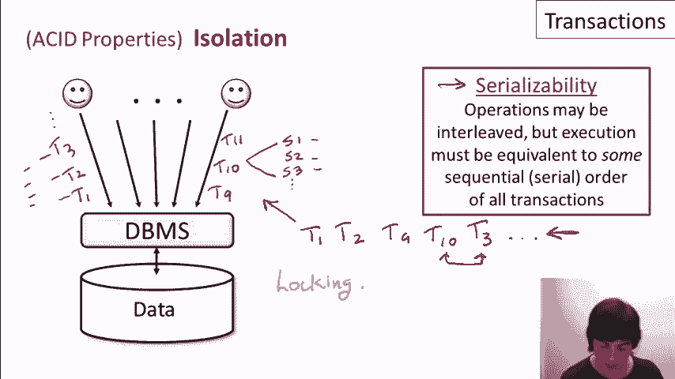
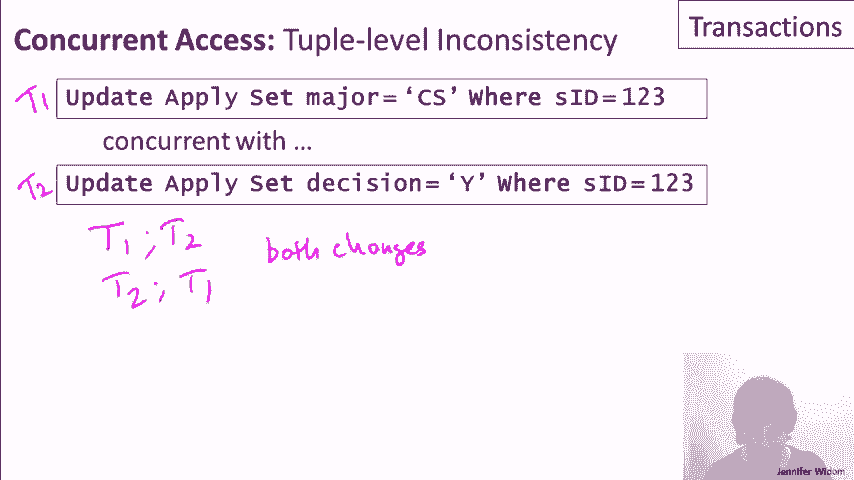
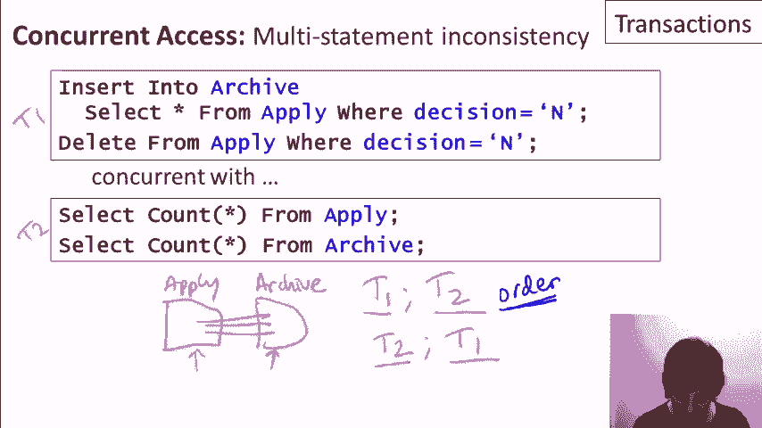
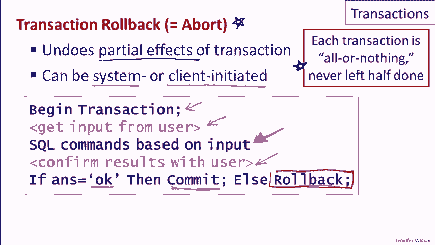
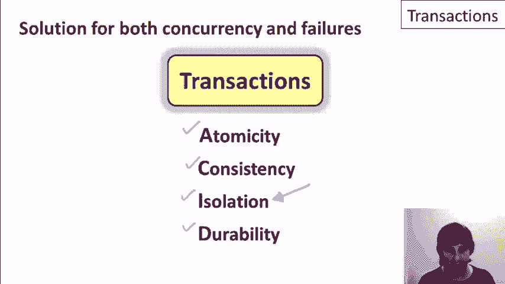

# [斯坦福大学 - 数据库系统入门] Introduction to Databases - Jennifer Widom - Stanford - P23：12-02-transactions-properties.mp4 - 哈库那玛塔塔i - BV1R4411u7dt

 In this video， we'll delve into more detail about the properties of transactions。

 As a reminder， transactions are a concept that's been introduced as a solution to both the concurrency control problem and the system failure problem in databases。

 Specifically， a transaction is a sequence of operations that are treated as a unit。

 Transactions appear to run in isolation even if many clients are operating on a database at the same time。

 and furthermore， if there's a system failure and unexpected software hardware or power failure。

 every transaction's changes that were issued to the database are either reflected entirely or not at all。

 Every database connoisseur knows that transactions support what are known as the acid properties。

 although not everybody always remembers what acid stands for。 So I'll tell you。

 A stands for atomicity， C stands for consistency， I stands for isolation。

 and D stands for durability。 And we're going to talk about each of these four properties in turn。

 We're going to talk about isolation first， we're going to talk about durability second。

 then we'll next talk about atomicity， and we'll conclude talking about consistency。

 So here's the deal with isolation。 We'll have a whole bunch of clients operating on our database。

 and we'd kind of like each client to imagine that they're operating on their own。

 So as we discussed in the previous video， each client issues to the database system a sequence of transactions。

 So this first client might be issuing first transaction T1， then T2， T3， and so on。

 Over here we have T9， T10， T11， and as a reminder。

 each transaction itself can be a sequence of statements。 So this might be statement 1， statement 2。

 statement 3， and so on， and then those statements will be treated as a unit。

 So the isolation property is implemented by a very specific formal notion called serializability。

 What serializability says is that the operations within transactions may be interleaved across clients。

 but the execution of those operations must be equivalent to some sequential serial order of all the transactions。

 So for our example over here， the system itself may execute all of the statements within each transaction and over here concurrently。

 but it has to guarantee that the behavior against the database is equivalent to some sequential order again。

 So perhaps the equivalent sequential order will be as if the system first did transaction T1 and maybe then T2。

 T9， T10， maybe back to T3 and so on。 And again， the system has to guarantee that the state of the database at this point in time。

 even if it's interleaved， the statements within these transactions looks as if these transactions executed in order。

 Now you might wonder how the database system could possibly guarantee this level of consistency while still interleaving operations。

 It uses protocols that are based on locking portions of the database。

 Now we're not going to describe the implementation because implementation aspects are not the focus of this course。

 What you need to know from a user or application perspective is really the properties that are being guaranteed。

 Now with the formal notion of serializability in mind。

 let's go back and look at the examples from the previous video that motivated the problems we could get into with concurrent access。

 The first one was the example where two separate clients were updating Stanford's enrollment。

 Let's just call one of them T1。 It's now a transaction and the other T2。

 So when we run these against the system and serializability is guaranteed。

 then we will have a behavior that is at least equivalent to either T1 followed by T2 or T2 followed by T1。

 So in this case， when we start with our enrollment of 15，000。

 either execution will correctly have a final enrollment of 17，500， solving our concurrency problems。

 Here's our second example。 In this case， the first client was modifying the major of student 123 in the Apply table。

 and the second was modifying the decision。 And we saw that if we allowed these two run in an interleaved fashion。

 it would be possible that only one of the two changes would be made。 Again， with serializability。

 we're going to get behavior that guarantees it's equivalent to either T1 and then T2 or T2 and then T1。

 And in both cases， both changes will be reflected in the database， which is what we would like。

 The next example was the one where we were looking at the Apply and the Student table。

 and we were modifying the Apply table based on the GPA in the Student table and simultaneously modifying that GPA。

 So again， if these are issued as two transactions。

 we'll have either T1 followed by T2 or T2 followed by T1。

 or at least we'll have behavior that's equivalent to that。 Now。

 this case is a bit interesting because either of these does result in a consistent state of the database。

 In the first case， we'll update all the decision records before the GPAs are modified for anyone。

 and in the second case， we'll update the Apply records after the GPAs have been modified。

 The interesting thing here is that the order does matter in this case。 Now。

 the database systems only guarantees serializability。

 They guarantee that the behavior will be equivalent to some sequential order。

 but they don't guarantee the exact sequential order if the transactions are being issued at the same time。

 So if it's important to get， say， T1 before T2， that would actually have to be coded as part of the application。

 And our last example was the case where we had the Apply table and the Archive table。

 and we were moving records from one table to another in one of our clients。

 and the other client was counting the tuples。

 And again， so T1 and T2， they're issued as transactions。

 The system guarantees that will either move all the tuples first and then count them。

 or will count the tuples and then move them。 Now， again。

 here's a case where the order makes a difference， but if we care specifically about the order that would have to be coded as part of the application。

 Okay， so we finished our first of the four acid properties。

 The other three will actually be quite a bit quicker to talk about。 Let's talk now about durability。

 and we only need to look at one client to understand what's going on。

 So let's say that we have our client and the client is issuing a sequence of transactions to the database。

 and each transaction， again， is a sequence of statements。 And finally。

 at the end of the transaction， there's a commit。 So what durability guarantees for us is that if there is a system crash after a transaction commits。

 then all effects of that transaction will remain in the database。 So specifically。

 if at a later point in time after this occurs， there's a failure for whatever reason。

 the client can rest assured that the effects of this transaction are in the database。

 and when the system comes back up， they will still be there。

 So you may be wondering how it's possible to make this guarantee since database systems move data between disk and memory。

 and a crash could occur at any time。 There are actually fairly complicated protocols that are used。

 and they're based on the concept of logging。 But once again。

 we're not going to talk about the implementation details。

 What's important from the user or application perspective is the properties that are guaranteed。

 Two properties down。 Now let's talk about atomicity。 Again。

 we'll only look at one client who's issuing a sequence of transactions to the database。

 and let's look at transaction T2， which itself is a sequence of statements followed by commit。

 The case that atomicity deals with is the case where there's actually a crash or a failure during the execution of the transaction before it's been committed。

 What the atomicity property tells us is that even in the presence of system crashes。

 every transaction is always executed either all or nothing on the database。 So in other words。

 if we have each of our transactions running， it's not possible in a system crash to say have executed on the database a couple of statements。

 but not the rest of the transaction。 Now once again， you might be wondering how this is implemented。

 It also uses a logging mechanism， and specifically when the system recovers from a crash。

 there is a process by which the system is not being used。

 There's a process by which partial effects of transactions that were underway at the time of the crash are undone。

 Now applications do need to be somewhat aware of this process。

 so when an application submits a transaction to the database。

 it's possible that it will get back and error because there was in fact a crash during the execution of the transaction and then the system is restarted。

 In that case， the application does have the guarantee that none of the effects of the transaction were reflected in the database。

 but it will need to restart the transaction。

 Now let's come back to the fact that the system will undo partial effects of a transaction to guarantee the atomicity property that each transaction is executed in all or nothing fashion。

 So this concept of undoing partial effects of a transaction is known as transaction rollback or transaction abort。

 And the reason I'm mentioning it here is that although it is the implementation mechanism for atomicity。

 it's also an operation that's exposed to by the database if an application would like to use it。

 Specifically， a transaction rollback can be initiated by the system in the case of an error or a crash recovery。

 but it can also be client initiated。 Let me give a little example where a client might write code that takes advantage of the operation。

 So here's some toy application code。 In this code， the client begins a transaction。

 It asks the database user for some input。 It performs some SQL commands。

 maybe some modifications to the database based on the input from the user。

 confirms that the user likes the results of those modifications， and if the user says okay。

 then the transaction is committed and we get an atomic execution of this behavior。

 But if the user doesn't say okay， then the transaction is rolled back and automatically these SQL commands that were executed are undone。

 and that frees the application from writing the code that undoes those commands explicitly。

 So it can actually be quite a useful feature for clients to use。

 But clients do need to be very careful because this rollback command only undoes effects on the data itself in the database。

 So if perhaps in this code， the system was also modifying some variables or even worse。

 say delivering cash out of an ATM machine， the rollback command is not going to undo those。

 It's not going to modify variables and it's certainly not going to pull that cash back into the ATM。

 So there actually is another issue with this particular client interaction that I'm going to put a frowny face here。

 It was a nice simple example of how rollback can be helpful。

 But one thing that happens in this example is that we begin a transaction and then we wait for the user to do something and we actually wait for the user back here。

 So experienced database application developers will tell you never to hold open a transaction and then wait for arbitrary amounts of time。

 The reason is that transactions do use this locking mechanism I alluded to earlier。

 So when a transaction is running， it may be blocking other clients from accessing portions of the database。

 If the user happened to go out for a cup of coffee or is going to come back in a week。

 we certainly don't want to leave the database locked up for an entire week。 So again。

 a general rule of thumb is that transactions should be constructed in a fashion that we know they're going to run to completion fairly quickly。

 Finally， let's talk about consistency。 The consistency property talks about how transactions interact with the integrity constraints that may hold on a database。

 As a reminder， an integrity constraint is a specification of which database states are legal。

 Transactions are actually very helpful in the management of constraints。 Specifically。

 when we have multiple clients interacting with the database in an interleaved fashion。

 we can have a setup where each client can assume that when it begins。

 it operates on a database that's specific。 The database satisfies all integrity constraints。

 Then each client must guarantee that all constraints hold when the transaction ends。

 and that's typically guaranteed by the constraint enforcement subsystem。 Now with that guarantee。

 since we have serializability of transactions， that guarantees that constraints always hold。

 Specifically， the behavior of the database is some sequential order of the transactions we know that we can assume at the start of the transaction the constraints hold。

 and then we guarantee they hold at the end， and since the behavior is equivalent to a sequential order。

 then the next transaction can assume the constraints hold， and so on。

 In conclusion， transactions are a very powerful concept。

 They give us a solution for both concurrency control and system failure management in databases。

 They provide formally understood properties of atomicity， consistency， isolation， and durability。

 In the next video， we're going to focus more on the isolation property。

 We're going to see that in some cases we may want to relax the notion of isolation while still providing properties that are sufficient for applications in certain circumstances。

