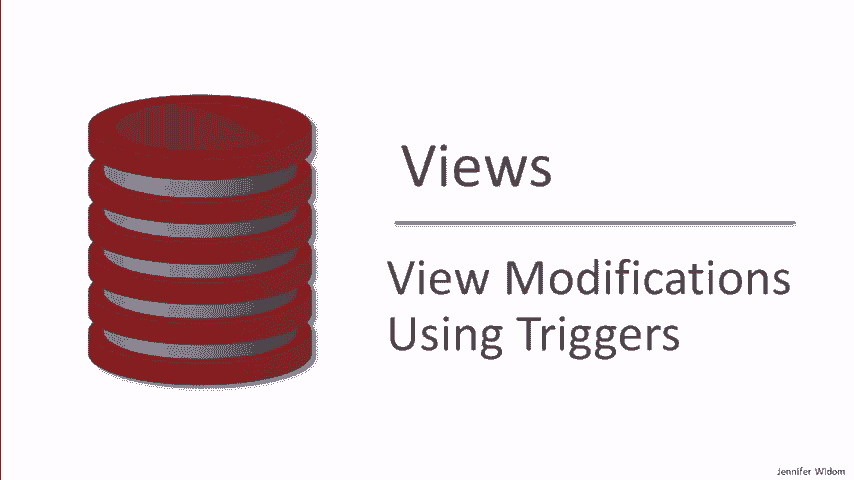
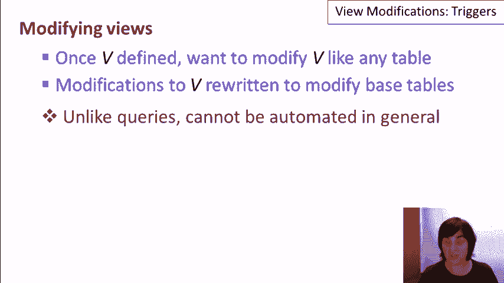
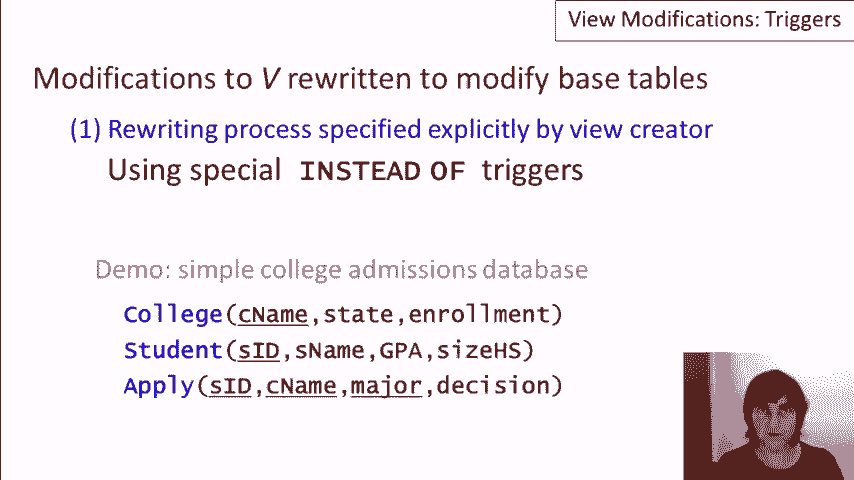
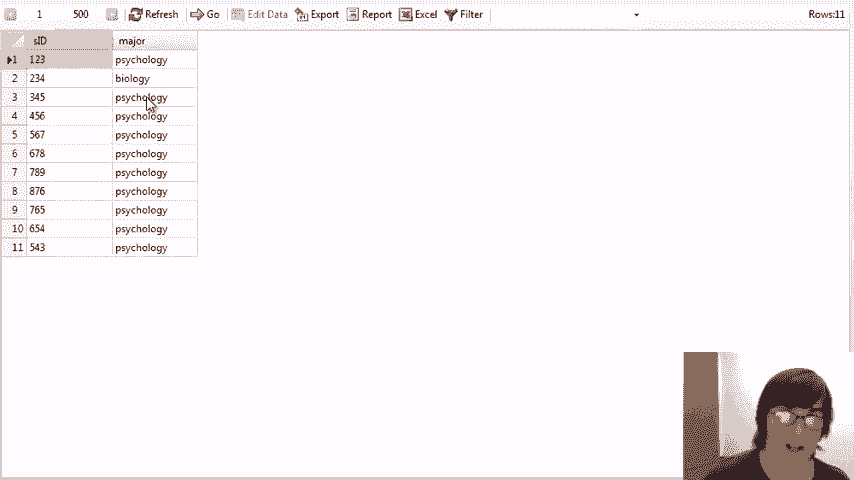
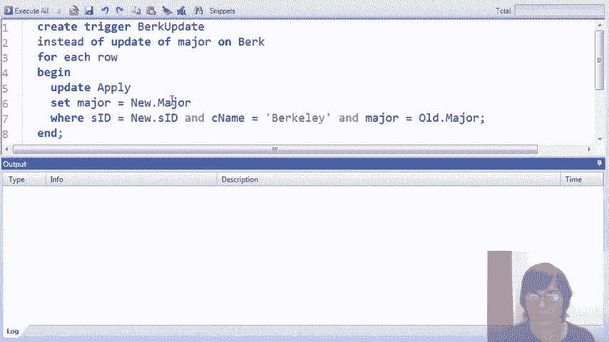
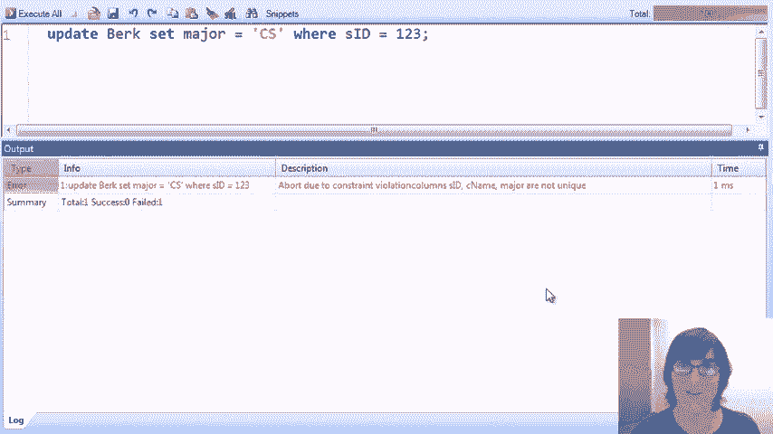

# [P24：13-03-view-modifications-using-triggers.mp4 - 哈库那玛塔塔i - BV1R4411u7dt

 In this video， which will mostly be live demo， we'll talk about modifying views through triggers。

 As a reminder， once we've defined a view， say called V。

 we'd like to be able to run modification commands over V as if it were a regular table。 Now。

 since V is not a regular table， it's just a view definition。

 what happens is that the modification commands against V are rewritten to modify the base tables over which V is defined。

 And as we talked about previously， unlike with queries over views。

 we can't in general automate the process of rewriting of modifications on views into modifications on the base tables。

 As we discussed in the introductory video， there are two basic approaches to dealing with the fact that the translation can't be automated。

 One is to have intervention by the view creator where the rewriting process is specified as part of creating a view if we want to allow that view to have modifications against it。

 And the other is to restrict the allowed views and modifications so that the translation can be automated。

 In this video， we're talking about the first case， and specifically。

 we're going to see how instead of triggers， a special type of trigger can be used to specify the rewriting process to enable modifications against views。

 We'll be using our standard simple college admissions database for the demonstration where we have our usual free tables。

 the college table， the student table， and the table containing information about students applying to colleges。

 So let's turn to the demo。 As usual， we'll start with our four colleges， Stanford， Berkeley， MIT。

 and Cornell， our bunch of students， and finally， the records showing our students applying to colleges for a specific major and a decision for that application。

 Some of the views that we use in this demo are going to be the same views that we used in our demo showing how we define and query overviews。

 but now we're going to be focusing on the ability to run modification commands against views。

 Our first view is one of those。 It's called CS accept， and as before。

 it contains the student ID in the college name where the student has applied to major and CS at that college。

 and the decision is yes。 We've now created the view， and we can take a look at its contents。

 and we'll see that we have a few students who have been accepted to CS at a few colleges。

 Now what we'd like to do is run a delete command against the view。

 Let's say that we want to delete student one， two， three， the two records of student one， two。

 three being accepted to major and CS。 So we would run that command like this， very simple。

 delete from CS accept or student ID equals one， two， three， but when we run the command。

 we get an error because SQLite does not allow us to modify views。

 So here's the trigger that we're going to create to enable deletion commands to be run on the CS accept view。

 This trigger is going to intercept those deletions。

 and it's going to translate them into deletions on the base data over which CS accept is defined。

 So let's take a look at what we'd like to happen。 If a user asks to delete some data from the view。

 and then again， let's go back and take a look at our view。 If the user wants to delete one， two。

 three， Stanford from the view， then what we'd like to be deleting is the apply records that gave us these tuples in the view。

 So let's go take a look at the apply relation here。

 and we'll see that this was the first record here where the student applied to CS at Stanford。

 and the decision is yes， and the third record where this person， one， two， three。

 applied to Berkeley and CS is yes。 We don't want to delete the other records for the student one。

 two， three， because those weren't contributing to our CS accept view。

 So we'd like to translate that deletion on the view into a deletion over apply such that the new value of the view no longer has those first two tuples for student one。

 two， three。 So let's see how that's implemented by our trigger。

 Now the one important thing to know that happens， and this is the one real contribution the system makes to what we're doing here to enable view modifications。

 is that we do have access to the deleted tuples。 So this trigger， it's actually a row level trigger。

 so it's going to be run once for each deleted row， and when we run the trigger。

 we will have this special variable old that contains the contents of the row to be that's the divisor。

 So in the action portion of the trigger， we can refer through the variable old to the student ID and college name that are in the accept view as if we were really deleting that tuple from the view。

 So again， let me reiterate， the system is going to bind two variable old。

 the tuples to be deleted from the view using the schema of the view。

 even though those tuples aren't physically in existence。

 And we'll use the value from those to translate to the deletion we want to perform on the apply table。

 Very specifically for the CS accept view， if we have a student ID college name combination to be deleted from the view。

 then what we'd like to delete from the apply table is the tuple that has that student ID。

 that college name， a major of CS and a decision， yes。 So the person who writes this trigger。

 which is presumably also the person who created the view。

 is going to use the combination of what was defined in the view， major equals CS in decision equals。

 yes。 Combine with the values that it's getting to be deleted from CS accept。

 I hope that makes some amount of sense。 So now that we've created this trigger。

 let's go back and let's try to perform our deletion operation again。

 This time it looks like we had success， so let's go ahead and see what happened。

 We go to our view manager and we see indeed those tuples are gone。

 Now remember this table isn't actually stored， this when we look at the view it's actually running the view query against the data。

 so when we look at the apply table we should also find， that's the really important thing。

 that the tuples corresponding to 123 be accepted to CS are indeed gone。

 And it's the deletion of these tuples from apply that causes the tuples to be deleted from the view。

 and that was the deletion on apply was because we installed this trigger that intercepted the deletion on the view and translated to the deletions on the base tables。

 So that worked out pretty well。 Now let's suppose we want to enable update commands on our view。

 Let's say we want to change this student 345's acceptance to CS at Cornell to be an acceptance to CS at Carnegie Mellon University instead。

 So here's the update command that we run。 It's very simple。

 We find student ID 345 and we change the college name to CMU and we're updating the view CS accept。

 Of course when we run this we again get an error because SQLite won't allow us to perform an update command on a view except if we have a special instead of trigger that intercepts that command and translates it。

 So that's what we'll do next is create a trigger。 So here's the trigger but what I'm going to demonstrate with this trigger is that nothing is forcing the trigger writer to actually do the right thing when a modification is translated to the base tables。

 So we are going to intercept updates to the CS accept view and in fact you might remember from triggers that we can be even more specific with update triggers and say which column is updated。

 So this particular trigger is only going to update is only going to intercept commands that are trying to update the college name column of the CS accept view。

 And then it's going to translate them to update the apply table。

 Now what we have when this trigger is run and again is run once for each roving updated is we have old and new that are bound to the old value of the updated view tuple and the new value of the updated view tuple。

 And only the college name will have changed in this case。

 So we're going to update the apply relation and we're going to set the college name to be the new college name and that's going to be for the tuple where we have the old student ID and the old college name that finds the tuple to update。

 However whoever wrote this got a little whack-o and instead of writing the condition that it's applications to CS where the decision is yes。

 they've made it applications to EE where the decision is no。

 But nothing prevents us from writing this trigger which performs this incorrect translation。

 So now that the trigger is installed we can run our update command。

 Before we do that let's just go look again and remind ourselves what we have。

 We have 345 is applied to Cornell and we're trying to change that to be Carnegie Mellon。

 And in our apply relation we have 345 is applied to Cornell CS yes that's why 345 is in the view 345 also by the way has applied to Cornell for EE and the decision on that one was no。

 So back to our update command now we'll run the command and now that we have our trigger installed the command succeeds and let's go see what's happened to our database。

 Here we are in CS accept and nothing has changed 345 has still applied to Cornell。

 We wanted it to be CMU but we wrote the wrong trigger so it did the wrong thing。

 Specifically if we go look at apply now we see that this record here this apply record has actually been updated so our trigger went in and modified that core record。

 So we want to modify that Cornell to be CMU because it matched the major being EE and the decision being no。

 So again what I'm emphasizing here is that it is important to write the correct translation and nothing in the system is checking that that is the correct translation。

 Of course the correct translation would be if we wrote CS here and decision equals yes that would be the。

 Whoops decision equals yes here would be the correct trigger that we'd like to install to manage updates on the college name of the CS acceptability。

 So far we've been looking at the CS accept view and we've looked at deletions and updates now we're going to look at insertions and we'll look at a somewhat different view。

 This is a view of the IDs， college names and majors of students who have applied to major in either CS or EE。

 Now let's take a look at the contents of our view in CSE and we see we have quite a number of students who have applied to major in EE or CS and the colleges to which they've applied。

 Now let's suppose we want to insert a new tuple into this view so we want student 111 to have applied to Berkeley in CS。

 We run the command and of course we're going to get an error because we haven't yet installed a trigger that intercepts insertions into the view called CSE。

 So here's the trigger and this one's pretty straightforward。

 It says instead of inserting on the view and again the system will provide to us the users intended insertion on the view in the variable called new as part of the trigger。

 So instead of inserting into the view we'll insert into the apply table the student ID。

 the college name， the major and then we'll put in null for the decision。

 With that trigger installed we can now go back to enter insert and perform it and take a look at the contents of our view。

 So here's our new tuple that we wanted inserted into the view。

 Again this is not a stored table this is just a result of a query over apply but it's there as we wanted it to be and if we take a look at the apply table we'll see that 111 was inserted with Berkeley CS and a null value for the decision。

 But now let's see where things can go wrong our trigger was blissfully simple but what if we put here that 222 is going to apply to Berkeley in biology and we try to insert that tuple into our view called CSE that's supposed to be CS and E majors。

 So let's go ahead and run that insertion and everything went fine let's take a look at our data。

 Well here's our view and nothing changed our attempted insertion apparently didn't happen。

 Well here's our insertion we inserted a biology major so in some sense that's good we don't want our biology major to show up in our view。

 On the other hand our insertion trigger was activated and if we go ahead and look at the data specifically the apply relation we'll see that we did get a tuple inserted into apply that tuple just didn't show up in our view because it didn't satisfy the condition。

 So presumably we don't want users to be able to write insertion commands against a view that affect the underlying database but don't get reflected in the view because they shouldn't be in the view in the first place。

 So we need to write a better trigger to handle insertions into this particular view。

 So we're going to drop the trigger that we wrote and create a new one and this one is going to use the when clause of triggers it's the first time we've used it in this demo and it's going to check that the tuple that the user is attempting to use the trigger。

 The user is attempting to insert into the view has a major that's CS or a major in that's EE。

 If the attempted insert doesn't have CS or EE as a major then the trigger won't do anything but if it does then it will insert into apply the student ID name and major。

 Now that we've fixed up our trigger let's go back to our insertion command we've already done damage with student 222。

 So let's try student 333 this time let's attempt to insert the student and then let's see what happened。

 If we go to the view that student is not in the view which is a good thing because it's a biology major but most importantly we hope that nothing happened to the apply table and just to be sure we refresh and we see that indeed nothing got inserted。

 So that's the case that we would like and maybe we'd like an error message to be generated but certainly if the user attempts to insert into the view a tuple that doesn't belong in the view we wouldn't like the database to be altered。

 Now let's suppose instead that student 333 asks to major in EE。

 Now when we run the command we should see in our view that the student has shown up and indeed they have so that insertion was intercepted and the underlying modification was made to the apply table so that the view is not in the view。

 So we've seen examples of triggers to intercept now deletions。

 updates and insertions to views and do the right thing of modifying the underlying base tables so that the view gets the desired modification。

 The next phase of the video is going to show a few examples quickly where we'll define views that have ambiguous modifications in fact where we might not even want to allow users to modify the contents of the view at all。

 So our first view demonstrates that when a view includes aggregation it's probably not sensible to allow users to modify it。

 This view finds for each high school size the average GPA of students who went to a high school of that size。

 So we'll create the view， we'll go and take a look and let's see what it contains。

 So here are the contents of that view。 It has the different size high schools represented in our database and the average GPA of students who went to a high school of that size。

 So does it make sense for a user to modify this view？

 I mean maybe would a user want to write a command that says update the view and set the average GPA to 3。

6 for the high school size is 200？ So going back and looking here we want to change this average GPA to 3。

6。 How would we have a rule for modifying the underlying data to change the average GPA？

 It really isn't very sensible and making insertions and deletions to this view well maybe we translate deletions to translate to delete every student who went to a high school of that size but that's probably not what we want。

 So fundamentally when a view includes aggregation it usually doesn't make sense to allow users to perform modifications on that view。

 Aggregation views are most useful just for running queries。

 Here's an even simpler view where we may not want to allow users to make modifications。

 This view just lists all the majors that are represented in our apply relation。

 So we'll create the view and take a look at it and we see that we have seven different majors in our relation。

 Now would it make sense for a user to say I want to add a new major to that view so I'd like to have students who have applied to the chemistry major？

 Well certainly looking at the view it would be no big deal to put chemistry in here but what would be the underlying change to the database？

 Who would be the student that's applied to that major and at what college？

 So in this case what makes it not very sensible to update this view is mostly that we're just taking one column out of our table and also that we're eliminating duplicates from that column。

 So to think how to translate this to the underlying base data we'd have to add a lot of new values for columns just to begin with and maybe there would be multiple tuples contributing to a new tuple in the apply relation。

 Again you know we might allow deletions we could potentially say if we delete a major then we delete every application to the major but that may not be what's intended by creating the view。

 So when we have projections onto a few columns or we have the distinct keyword that's another example where we may not want to allow users to perform modifications to the view。

 And here's our third and last example along these lines this one's actually the most complicated one。

 The viewer we're creating now called Non-unique is going to give us all student tuples where there's some other student who has the same GPA and the same high school and it's a different student。

 So you may want to refresh your sequel to remind yourself how this works。

 Let's go ahead and create the view and take a look at what's in it。

 Here we find that there are three students who some other where some other student has the same GPA and size high school and in fact all three have the same GPA and size high school which is not surprising in our small data set。

 So let's suppose that the user decides that they don't want Amy in this view so they try to run the command delete from the non-unique view where the student name is Amy。

 So what deletion should be performed or what modification should be performed to the underlined data in order to get Amy out of the view。

 Well of course we could delete Amy herself and that might be the most sensible but if we deleted Doris here and the other Amy I forgot to point out these are two different Amy's。

 So we could delete this one 654。 If we deleted Doris and the other Amy then this Amy would be deleted from the view too。

 So there's something a little subtle going on in this particular example。

 We are asking to delete from a view that just selects from students so you might think oh well there's a one to one math thing so let's just delete the students that we're asking to have taken out of the view。

 But because the sub query references the same relation as the outer query deleting a tuple reference in the outer query also affects the result of the sub query which can feedback into what's in the outer query。

 So it's this interaction between the two references of the table that makes it pretty tricky to figure out how a modification to the view should be mapped to a modification to the base table。

 So we've seen three examples where it doesn't make a lot of sense to allow users to write modifications commands against the view。

 And those are based on constructs in the view definition。

 And actually we're going to see those same constructs pop up when we talk about what the SQL standard says about views that are allowed to be modified。

 But I do want to remind you that in this video we're talking about writing triggers that enable modifications to views。

 And so really for all the views that I showed you we could choose to write triggers that intercept the modifications and perform some modifications on the base table。

 But probably that translation would not make a lot of sense。

 And that's the point I'm trying to make。 Not that you can't do it when you have the power of writing instead of triggers but that you probably don't want to do it because it probably doesn't make sense in the application。

 Now let's return to views that we do want to allow to be modifiable。

 And so we're going to enable that through instead of triggers。

 And the next example is more complex because it involves a join of two tables。

 This view is called Burke and it returns student IDs and majors where the student has applied for that major at Berkeley。

 We'll create the view， we'll take a look at its contents and we'll see that we have two students who have applied to Berkeley。

 One to major in biology and one to major in computer science。

 Some of our other students have gotten deleted from our database along the way through our examples by the way。

 So let's say that we want to enable insertions into this view。

 So we want to be able to insert a pair that's a student ID and a major and then insert into our underlying tables in some fashion so that that tuple is now in the view。

 So what we're going to do is assume that when someone wants to insert into this view they're inserting for an existing student and we'll actually check that's the case。

 So if we have an existing student and we're inserting into the view then all we need to do is add a tuple to the apply relation that says that they are applying to Berkeley for the major that's specified in the insertion we've asked for on the view。

 So we'll write that as a trigger。 So here's a trigger it says instead of inserting on the Burke relation for each row again we'll get one instance of a trigger for each inserted row。

 We'll check first of all that the student ID of the inserted tuple and again new is bound to the inserted tuple the student the tuple the user wants to insert into view Burke。

 We'll check that that student does exist in the student relation。

 If they don't exist in the student relation we're just not going to do anything with the requested insert。

 If they already exist in the student relation then we can insert into apply the student's ID Berkeley because we know this is the view for students who have applied for applications to Berkeley。

 The major that they're applying for and null for the decision。

 So instead of demonstrating just a single tuple being inserted I'm going to do something a little more complicated and ask to insert a whole bunch of tuples into Burke and we're going to see that each of those tuples is going to result in an insertion into the apply table underneath and of course the desired insertion into the view。

 So the way that I'm going to generate a batch of tuples to be inserted into the view is to run a sub query and the sub query is going to take all student IDs that are not in the apply table for Berkeley。

 So students who have not yet applied to Berkeley and we're going to for each one ask that we insert into the view that student and a psychology major application to Berkeley。

 So let's first take a look at our apply table to see who's going to be applying to Berkeley for psychology。

 So we have 2， 3， 4 who's applied to Berkeley already in 9， 8， 7 and they're in our view。

 By the way if you're wondering why these three students down here didn't appear in our view it's because these were inserted as an artifact of our demo and we never inserted matching student tuples。

 So these aren't going to participate in the joint。

 So we just have two students in our joint all the rest of the students here who haven't applied to Berkeley are now going to apply to Berkeley in psychology as a result of us running that insert command that's going to be intercepted by our trigger。

 So here's the trigger。 Here's the insert command。 Let's go ahead and run the insert and now let's take a look and see what happened。

 We go to Berkeley and we do see indeed a whole bunch of psychology majors now in our view and of course that's because we should have a whole bunch of psychology majors now in our apply relation and here they are。

 So back to our view what if we now want to enable users to delete from the view。

 We're going to again assume that the intention is not to delete the student。

 The student ID table is going to say stay stable and what we're going to do is we're going to delete the corresponding applications。

 So here's the trigger to do that。 It's activated by deletions on the Burke view and the system again will bind the desired deleted tuples from the view to the reserved variable old。

 So the action part of that trigger will delete from apply where the student ID matches the one to be deleted。

 The college name is Berkeley because that's what we're looking for。

 That doesn't come from the deleted tuple。 That's not present in the view but we know that that's a condition from the view definition。

 And the major has to match the desired deleted major。

 So we'll ask to delete from Berkeley all the records where the major is CS。

 So let's go ahead first and take a look at the view and we see that we have just one so we'll expect this tuple to be deleted from the view but that's going to happen because we're going to delete the corresponding apply record underneath。

 So we'll go ahead and execute the deletion。 We'll take a look first at the view。

 make sure that that person that CS is gone and it is， and then we'll go look at apply。

 We forgot to look at it in the first place but I think it was student 987 and now 987 has no longer applied to Berkeley。

 And finally let's enable updates to our Burke view。

 Probably doesn't make sense to update the student ID but we'll allow updates to the major。

 So we'll have a student who applied to Berkeley in psychology。

 I decide they want a major in something else。

 So here's the trigger and this one is going to intercept updates to the major on Berkeley so it won't intercept updates to the student ID and again now we'll have the old and new values bound to the old and new imaginary tuples of Burke。

 It's going to update the apply relation。 It's going to find the record where we have the student ID in our update。

 This could be old student ID or new student ID since its value isn't changing。

 So we find the student ID we care about their application to Berkeley for the old major and we'll change that to be applying to the new major。

 So let's take all those psychology majors and let's turn them into physics majors。

 So with this one update command we'll be asking to update most of the tuples in the Burke view。

 Each tuple one at a time will be intercepted by our trigger and it will modify the apply table for the corresponding record and turn the psychology major into physics。

 We'll run the command and we'll take a look at what happened。

 Here's our view and we see indeed that all the psychology majors have turned into physics majors and of course that's a result of the modifications to the underlying table apply where again we've seen that all the psychology is in the middle。

 All the psychology is changed to physics。 Now back to our view I said we weren't going to allow modifications to the student ID and the trigger that we wrote only intercepted modifications to the major。

 So let's see what happens if we try to modify the student ID。

 Here's a command that tries to set three to one to one to three in our Burke view。

 If we run the query then we do get an error because we didn't implement any translation for modifications to that column。

 The last portion of our demonstration is going to demonstrate the interaction between view modifications and constraints。

 So I'm going to drop my apply table and create a new version of it where we add to the decision column a constraint that the column is not allowed to be null。

 Now let me remind you of a view we created a long time ago called CSE that took the students colleges and majors where the student had applied to major in CS or EE。

 And let's look specifically at the trigger that we created to handle insertions into this view。

 So you might remember or you might not that we first created an incorrect trigger but here's the one that we have activated。

 And the important thing to notice is that it intercepts insertions into the view and then it inserts into apply a tuple that contains the student ID。

 the college name and the major and then puts null for the decision。

 And this is where our troubles are going to occur because we've now created a version of apply that doesn't allow null for a decision。

 So let's try inserting into our CSE view the values one to three Berkeley and CS and that will translate to an insertion to apply of the same values and null for a decision。

 We run the insertion and we get the constraint violation。

 So what happened is the insertion into the view was intercepted by the trigger translated to an insertion into apply but that insertion generated a violation against our not null constraint on the decision column。

 So it's doing the right thing but we'll never be able to insert into the CSE view now because we're always going to attempt to insert null values。

 So if we want to have that not null constraint on the apply relation we'll have to modify our translation for CSE so that it doesn't generate the null values。

 And here's a second example along the same lines。 We're going to drop apply again and create a new version of apply。

 This time we're going to allow null values and decisions so we've taken away that not null constraint but we've added a key constraint to apply saying that the combination of student ID。

 college name and major must be unique。 So a student can't apply twice to the same college for the same major。

 So because we've created a new apply relation it's starting out empty but let's insert some tuples what we're going to insert into the apply relation via the CSE view and it's trigger。

 So we'll insert student one two three applying to Berkeley for CS and Berkeley for EE and again we're inserting these into the view。

 We'll run that we'll take a look at our view and we'll see that where is it。 Here we go。

 CSEE has the two tuples that we inserted of course those were intercepted by the trigger and created insertions into apply and here's the apply relation which looks exactly the same but with the decision as null。

 Now what we're going to do next is actually insert into one of our other views。

 I don't know if you remember the Berkeley view but that was the IDs and majors of students who had applied to Berkeley and let's go take a look at what happens when we try to insert into the Berkeley view。

 Here's the trigger we wrote to handle insertions into Berkeley。

 When the student that we're trying to insert does exist then we'll insert a record into apply having that student apply to Berkeley for the major that's specified in the insertion and a null decision which again is fine now because。

 we remove that non-null constraint。 So we're going to try to insert into Berkeley student one two three majoring in EE and we're going to see that that's actually going to violate our key constraint。

 So let's go ahead and we get a non-unique constraint because that attempted to insert into the apply table。

 Let's go look at that table。 It attempted to insert into apply one two three Berkeley EE and that would have violated the constraint that we can only have one tuple for a student ID college name and major combination。

 So again our attempt to insert into the view was translated oops that's the earlier insert sorry our attempt to insert into the Berkeley view was translated into an insertion into apply that violated the constraint。

 And as a grand finale let's try an update on our Burke view so let's suppose that we want student one two three to major in CS in both applications to Berkeley and that will generate an update to the underlying apply table that should violate our constraint。

 Just as a reminder let's take a look at what happens when we try to run an update command on the major of the Burke view。

 Here's our trigger that we wrote a while ago it intercepts updates to Burke and it translates them to update the apply relation find the appropriate record where it's an application to Berkeley matching the old major and the student ID and it changes it to the new major。

 So we're going to try to update a Burke we're going to try to set let's find it here we're going to try to set the major equals CS for student ID one two three。

 So if we take a look at what it's going to try to do the to to the apply relation it's going to try to set these majors both to CS and that will give us again a key constraint violation。

 So let's go ahead and try to run the command against Burke it'll translate to an update on apply and that update won't be allowed。

 So that completes our demonstration of enabling view modifications using triggers。

 So this demonstration was all run on the SQLite system the SQLite system does not allow any modifications commands on views directly so we saw every time we tried that we got an error and the only way that a user can run modifications overviews is if we have in place the special instead of triggers that intercept the modifications that are attempted on the views and translates those to modifications on the base table。

 Now the system when it does process the triggers generates for the modifications on the views what the data would be in terms of binding those modifications the old and new variables that are available in triggers but the rest of the process is up to the user to write the actions that will be will take place when these are attempts to do a modification on a view。

 And as we saw there's no checks in place to make sure that the user writes correct modifications that result in correct view updates however when the user does things correctly it can all work in a very powerful and correct fashion。

 fashion。