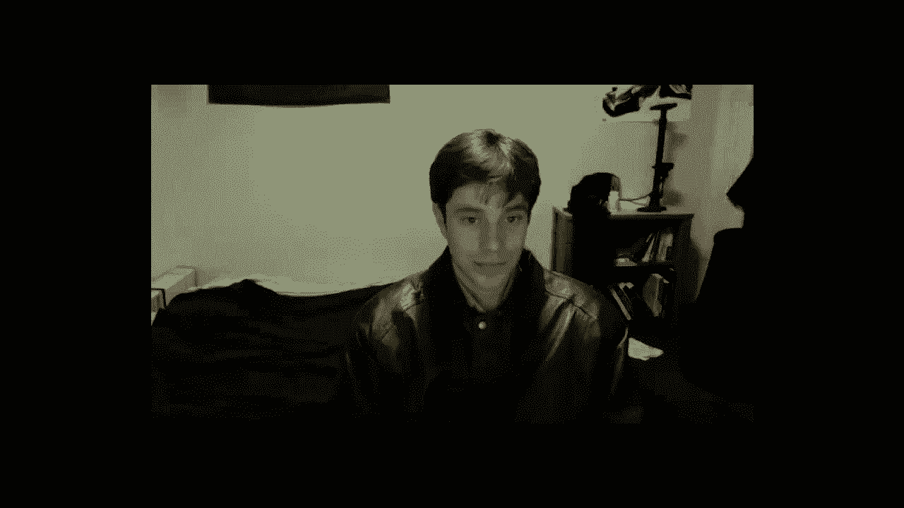
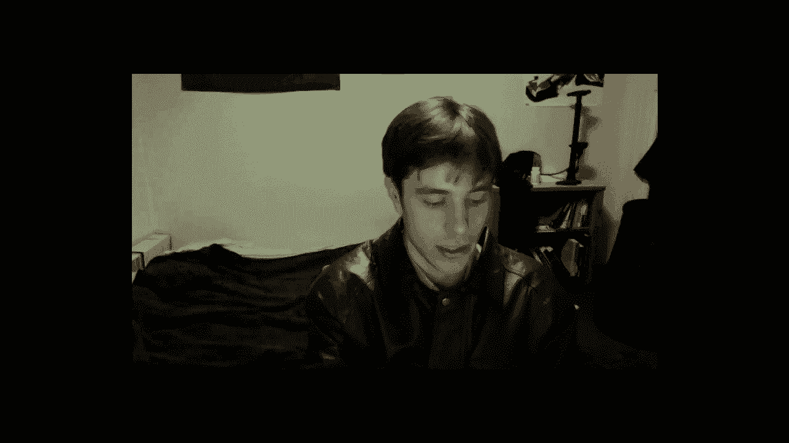

# [斯坦福大学 - 数据库系统入门] Introduction to Databases - Jennifer Widom - Stanford - P29：DBClass Office Hours 03_06_2013 - 哈库那玛塔塔i - BV1R4411u7dt

 Hi students， welcome to my office hours for the week。 Just so you know， I've been。

 experimenting with several different ways of doing office hours throughout this。

 course as part of an agreement with Jennifer and people working on online。

 education at Stanford who are interested in like the best way of staff。

 student interaction for MOOC courses and so we've tried several different。

 things including the IRC chat and read it office hours and Google hang out and。

 then just like the one-way videos of running through some practice problems。

 and so I've had a lot of fun preparing week all of the office hours and。

 answering your questions so thank you for being patient with all the different。

 format changes so as you know this week I asked you to pre-populate a。

 Reddit forum with questions on course topics so I didn't get a whole lot of。

 questions on the Reddit forum about the sequel triggers exercises that are due。

 on Monday so I'm going to keep this video short and just congratulate you on。

 making it this far in the course I hope that you're all learning a lot and。

 enjoying the class so we don't have too much more time the final exam is only。

 two weeks from tomorrow and so I guess it's a good time to start getting。

 ready for the final the format is going to be pretty much the same as the midterm。

 so the topics for the final exam are going to be weighted heavily toward topics。

 that were after the midterm but you will still be expected to know and be able to。

 answer questions on topics from before the midterm and so yeah we don't have。

 too much left in the course we have views authorization recursion online。

 analytical processing and no sequel systems and so I will be back with。

 office hours next week working through some of the extra problems on sequel view。

 updates and again just giving you an idea of how to approach the problems and。

 hopefully hopefully that turns out to be a helpful video in addition I will be。

 doing a review video for the final exam which again goes live two weeks in two。

 weeks on Thursday March 21st so again congratulations on making it this。

 far in the course keep up the good work and I will see you all next week。

