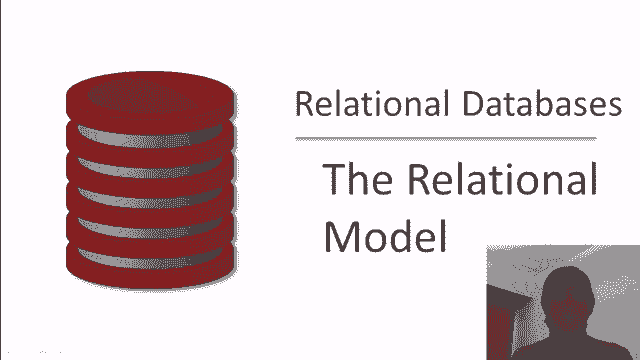
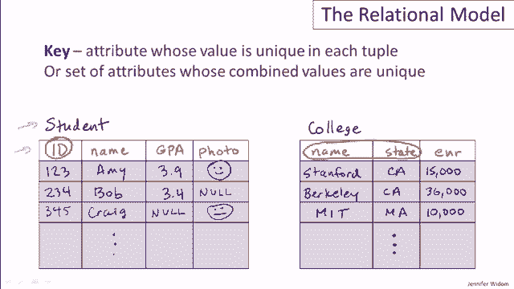

# [P2：02-01-relational-model - 哈库那玛塔塔i - BV1R4411u7dt

 In this video， we'll learn about the relational model。

 The relational model is more than 35 years old， and it's really the foundation of database。

 management systems。

 It spawned a many billion dollar industry。 The relational model underlies all commercial database systems at this point in time。

 It's actually an extremely simple model， and that's one of its benefits。 Furthermore。

 it can be queried by that I mean we can ask questions of databases in the。

 model using high level languages。 High level languages are simple yet extremely expressive for asking questions over the database。

 And finally， very importantly， there are extremely efficient implementations of the relational。

 model and of the query languages on that model。 So let's move ahead and understand the basic constructs in the relational model。

 So the primary construct is in fact the relation。 A database consists of a set of relations or sometimes referred to as tables。

 each of。

 which has a name。 So we're going to use two relations in our example。

 And our example is going to be a fictitious database about students applying to colleges。 For now。

 we're just going to look at the students and colleges themselves。

 So we're going to have two tables and let's call those tables the student table and the。

 college table。 Now as an aside， there's a healthy debate in the database world about whether tables。

 relations ought to be named using the singular or the plural。

 I personally don't have a stake in that debate。 I'm going to use the singular。

 Next we have the concept of attributes。 So every relation in a relational database has a predefined set of columns or attributes。

 each of which has a name。 So for our student table。

 let's say that each student is going to have an ID， a name， a GPA， and a photo。

 And for our college table， let's say that every college is going to have a name， a state。

 and an enrollment。 We'll just abbreviate that E and R。 So those are the labeled columns。

 Now the actual data itself is stored in what are called the tuples or the rows in the tables。

 So let's put a couple of the data tuples in our tables。

 So let's start with the students and let's say that our first student has ID123。 Name is Amy， GPA 3。

9， and she's happy with that。 So she has a smiley photo。 And our second student is 234。 It's Bob。

 His GPA is 3。4。 He's not quite as happy。 And typically of course a table will have thousands。

 maybe millions， even sometimes billions， of rows， each row containing a value for each attribute。

 In our college table， let's suppose we have， well of course we're going to start with。

 Stanford in the state of California and Stanford's enrollment is 15，000。

 We'll include our cross bay rival Berkeley。 Again in the state of California。

 Berkeley's enrollment is a whopping 36，000。 And last of all。

 we are going to not be West Coast biased。 We'll include MIT in the state of Massachusetts with an enrollment of 10。

000。 Now of course there's going to be again many more tuples in the college table and many。

 more tuples in the student table。 Okay next let me mention that in a relational database typically each attribute or column。

 has a type sometimes referred to as a domain。 For example the ID might be an integer。

 the name might be a string， GPA might be a float， photo might be a jpeg file。

 We do also in most relational databases have a concept of enumerated domain。

 So for example the state might be an enumerated domain for the 50 abbreviations for states。

 Now it's typical for relational databases to have just atomic types in their attributes。

 as we have here but many database systems do also support structured types inside attributes。

 Okay a little bit more terminology。 The schema of a database is the structure of the relation。

 So the schema includes the name of the relation and the attributes of the relation and the。

 types of those attributes where the instance is the actual contents of the table at a given。

 point in time。 So typically you set up the schema in advance then the instances of the data will change。

 over time。 Now I mentioned that most columns have types but there's also a special value that's in。

 any type of any column and that's a special value known as null。

 And those are actually quite important in relational databases。

 Null values are used to denote that a particular value is maybe unknown or undefined。

 And so let's suppose let's add another temple to our database。 Let's say three， four。

 five another student named Craig and for whatever reason Craig doesn't， have a GPA。

 Maybe Craig is homeschooled， maybe Craig doesn't want to reveal his GPA。

 So then the database would contain a null value for Craig and we'll just put a neutral face， there。

 Or for example maybe Bob doesn't want to have his photo in the database so then Bob would。

 have a null value for his photo。 So again nulls can go anywhere。

 Now null values are useful but one has to be very careful in a database system when you。

 run queries over relations that have null values。 Now later video will go into this in more detail but I just wanted to give a sort of。

 example of what can happen。 So let's suppose we're asking a query over our student table of all students whose GPA。

 is greater than 3。5。 So when we run that query on our database obviously we'll get Amy out。

 Obviously we won't get Bob out but should we get Craig？

 The answer is no we don't know for a fact that Craig's GPA is greater than 3。5。

 So we'll only get one student out from that query。

 Now let's suppose we had another query where we're going to ask for the GPA less than or。

 equal to 3。5。 So similarly we would not be in the result and we would certainly have Bob in the result。

 and similarly we would not have Craig in the result because we don't know that his GPA。

 is less than or equal to 3。5。 So far so good what gets a little weird is when we add an or here in our query and we。

 say I want everyone whose GPA is greater than 3。5 or whose GPA is less than or equal to 3。5。

 and even though it looks like every tuple should satisfy this condition that it's always true。

 that's not the case when we have null values。 So that's why one has to be careful when one uses null values in relational databases。

 Let me erase this now and let's move on to our next concept which is the concept of key。

 Key is again another important concept in relational databases and a key is an attribute。

 of a relation where every value for that attribute is unique。

 So if we look at the student relation we can feel pretty confident that the ID is going。

 to be a key。 In other words every tuple is going to have a unique value for ID。

 Thinking about the college relation it's a little less clear。

 We might be tempted to say that the name of the college is an ID but actually college。

 names probably are not unique across the country。 There's probably a lot of or several colleges named Washington College for example。

 You know what we're allowed to have sets of attributes that are unique and that makes。

 sense in the college relation。 Most likely the combination of the name and state of a college is unique and that's what。

 we would identify as the key for the college relation。

 Now you might wonder why it's even important to have attributes that are identified as， keys。

 There's actually several uses for them。 One of them is just to identify specific tuples。

 So if you want to run a query to get a specific tuple out of the database you would do that。

 by asking for that tuple by its key。 And related to that database systems for efficiency tend to build special index structures or store。

 the database in a particular way so it's very fast to find a tuple based on its key。

 And lastly if one relation in a relational database wants to refer to tuples of another。

 there's no concept of pointer in relational databases therefore the first relation will。

 typically refer to a tuple in the second relation by its unique key。

 As our videos develop we'll see the importance of keys。

 Okay just to wrap up I'll mention how one creates relations or tables in the SQL language。

 It's very simple you just say create table give the name of the relation and a list of。

 the attributes。 And if you want to give types for the attributes it's similar except you follow each attribute。

 name with its type。 So to wrap up the relational model has been around a long time has started a huge industry。

 it's used by all database systems。 As you've seen it's a very simple model and we'll shortly see that it can be queried with。

 very nice languages and finally it's been implemented very efficiently。

