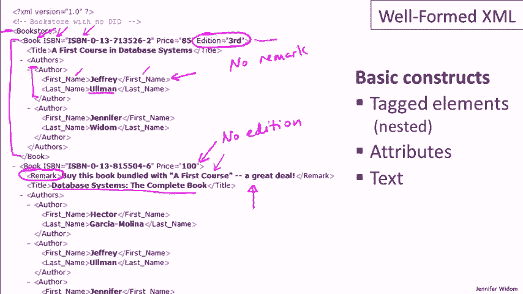
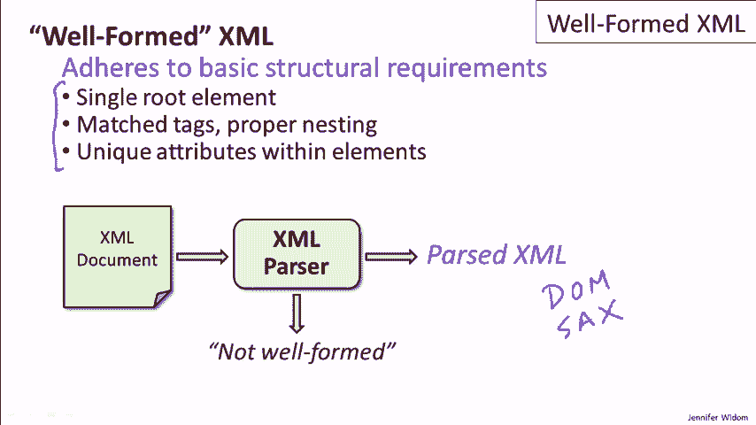
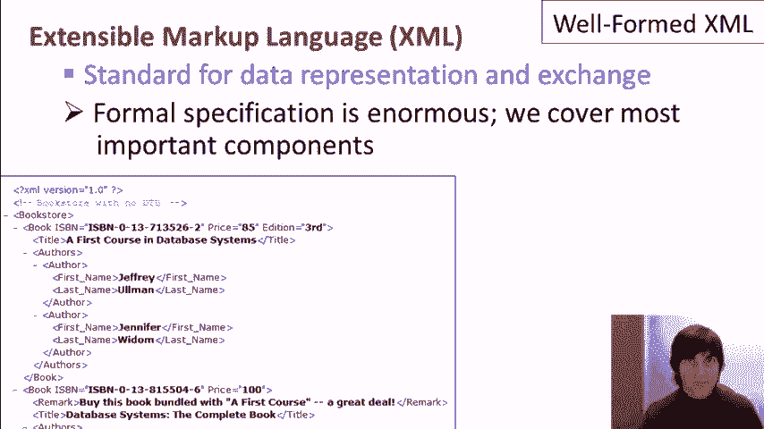

# [斯坦福大学 - 数据库系统入门] Introduction to Databases - Jennifer Widom - Stanford - P4：03-01-well-formed-xml.mp4 - 哈库那玛塔塔i - BV1R4411u7dt

 This video introduces the basics of XML。 XML can be thought of as a data model。

 and alternative to the relational model for structuring data。 In addition to introducing XML。

 we will compare it to the relational model， although it is not critical to have watched the relational model videos。

 in order to get something out of this one。 The full name of XML is the extensible markup language。

 XML is a standard for data representation and exchange。

 and it was designed initially for exchanging information on the internet。 Now。

 don't worry if you can't read the little snippet in the corner of the video here。

 You're not expected to at this point。 XML can be thought of as a document format。

 similar to HTML if you're familiar with HTML。 Most people are。

 The big difference is that the tags in an HTML document。

 describe the content of the data rather than how to format the data。

 which is what the tags in HTML tend to represent。 XML also has a streaming format or a streaming standard。

 and that's typically for the use of XML in programs for emitting XML。

 and consuming XML。 So now let's take a look at the XML data itself。

 You see on the left side of the video a portion of an XML document。

 The entire document is available from the website for the course。 XML has three basic components。

 Again， very similar to HTML。 The first is tagged elements。 So for example。

 let's take a look at this element here。 This is an element saying that the data here is a first name。

 So we have an opening tag and we have a matching closing tag。 We also have nesting of elements。

 So for example， here we have an element that's author。 We have the opening tag here。

 the closing tag here， and we have the nesting of the first name and the last name elements。

 Even larger， we have a book element here with opening and closing tags。

 with the nesting of numerous elements inside。 And the entire document actually is one element whose opening tag is book store。

 and the closing tag isn't visible on the video here。 So that's what elements consist of。

 An opening tag， text or other sub elements and a closing tag。 In addition， we have attributes。

 So each element may have within its opening tag， and let's take a look at the book element here。

 a set of attributes。 And an attribute consists of an attribute name， the equal sign。

 and then an attribute value。 So our book element right here has three attributes。 One called ISBN。

 one called price， and one called addition。 And any element can have any number of attributes as long as the attribute names are unique。

 And finally， the third component of XML is the text itself， which is depicted here in black。

 So with an element， we can have strings。 We have the string almond here。 We have a title here。

 Here we have a remark。 And so that's generally sort of， if you think of XML as a tree。

 the strings form or the text forms the leaf elements of the tree。 So again。

 those are the three major components of XML。 Looks a lot like HTML。

 except that the tags are describing the content of the data。

 and not how to format it。 Now let's spend some time comparing the relational model against XML。

 Again， it's not critical that you've learned about the relational model。

 and you can skip this material if you're not interested。 But in many cases。

 when designing an application that's dealing with data。

 you might have to make a decision whether you want to use a relational database。

 or whether you want to store the data in XML。 So let's look at a few different aspects of the data and how it's used。

 and how it compares between relational and XML。 Let's start with the structure of the data itself。

 So as we learn， the structure in a relational model is basically a set of tables。

 So we define a set of columns and we have a set of rows。 XML is generally， again。

 it's usually in a document or a string format， but if you think about the structure itself。

 the structure is hierarchical。 The nested elements induce a hierarchy or a tree。

 There are constructs that actually allow us to have links within documents。

 and so you can also have XML representing a graph， though in general。

 it's mostly thought of as a tree structure。 Next， let's talk about schemas。 In the relational model。

 the schema is very important。 You fix your schema in advance when you design your database。

 and then you add the data to conform to the schema。 Now in XML， you have a lot more flexibility。

 So the schema is flexible。 In fact， a lot of people refer to XML as self-describing。 In other words。

 the schema and the data are kind of mixed together。

 The tags on elements are telling you the kind of data that you have。

 and you can have a lot of irregularity。 Now I will say that there are mechanisms for introducing schemas into XML。

 but they're not required。 In the relational model， schemas are absolutely required。 In XML。

 they're more optional。 In particular， let's go back and take a look at our example。

 and we'll see that we have sort of some structure in our example。

 but not everything is perfectly structured as it would be in the relational model。

 So coming back here and taking a look， first of all， we have the situation。

 in this first book we have an attribute called "edition"， the third edition。

 whereas in the second book， we only have two attributes， so there's no edition in this book。

 Now in the relational model， we would have to have a column for edition。

 and we'd have one for every book， although of course we could have no editions for some books。

 In XML， it's perfectly acceptable to have some attributes for some elements。

 and those attributes don't appear in other elements。

 Here's another example where we have a component in one book that's not in another。

 and it's this remark component。 So here we have a book where we happen to have a remark。

 and incidentally， you can see that this remark suggests that we buy the complete book together with the first course。

 The first course is a subset， so it's not a very good suggestion。

 although Amazon actually did make that one。 Anyway， enough of the aside。

 We do see that we have a remark for the first book and we have no remark for the second book。

 and that's not a problem whatsoever in XML。

 In the relational model， we would again have to use null values for that case。

 And the third example I just wanted to give is the number of authors。

 So this first book has two authors。 The second book， you can't see them all。

 but it has three authors， not a problem in XML， having different numbers of things is perfectly standard。

 So the main point being that there's a lot of flexibility in XML in terms of the schema。

 You can create your database with certain types of elements， later ADMOR elements， remove elements。

 introduce inconsistencies in the structure， and it's not a problem。 And again。

 I'll mention one more time that there are mechanisms for adding schema-like elements to XML。

 or schema-like specifications to XML。 We will be covering those in the next two videos， actually。

 Next， let's talk about how this data is queried。 So for the relational model。

 we have relational algebra， we have SQL。 These are pretty simple， nice languages， I would say。

 It's a little bit of a matter of opinion， but I'm going to give them a smiley face。

 XML querying is a little trickier。 Now， one of the factors here is that XML is a lot newer than the relational model。

 and querying XML is still settling down to some extent。 But I'm just going to say， you know。

 it's a little less， so I'm going to give it a neutral face here。

 in terms of how simple and nice the languages are for querying XML。

 And we'll be spending some time in later videos learning some of those languages。

 Next in our chart is the aspect of ordering。 So the relational model is fundamentally an unordered model。

 and that can actually be considered a bad thing， to some extent， sometimes in data applications。

 It is nice to have ordering。 We learned the order by clause in SQL。

 and that's a way to get ordering query results。 But fundamentally。

 the data in our table in the relational database is a set of data without an ordering within that set。

 Now， in XML， we do have， I would say， an implied ordering。 So XML， as I said。

 is either can be thought of as either a document model or a stream model。 In either case。

 just the nature of the XML being laid out in a document， as we have here， or being in a stream。

 induces an order。 Very specifically， let's take a look at the authors here。

 So here we have two authors， and these authors aren't in order in the document。

 If we put those authors in a relational database， there would be no order。

 They could come out in either order unless we did an order by clause in our query， whereas in XML。

 implied by the document structure is an order。 And there's an order between these two books as well。

 Sometimes that order is meaningful， sometimes it's not。

 but it is available to be used in an application。 Lastly， let's talk about implementation。

 As I mentioned in earlier videos， the relational model has been around for at least 35 years。

 and the systems that implemented have been around almost as long。 They're very mature systems。

 They implement the relational model as the native model of the systems， and they're widely used。

 Things with XML are a little bit different。 Partly again， because XML hasn't been around as long。

 but what's happening right now in terms of XML and conventional database systems。

 XML is typically an add-on。 So in most systems， XML will be a layer over the relational database system。

 You can enter data in XML， you can query data in XML。

 It will be translated to a relational implementation。 That's not necessarily a bad thing。

 and it does allow you to combine relational data and XML in a single system。

 sometimes even in a single query， but it's not the native model of the system itself。

 Now， you might have noticed that the name of this video is well-formed XML。

 So well-formed XML is actually the most flexible XML。

 XML document or XML stream is considered well-formed if it adheres to the basic structural requirements of XML。

 and there are many， just that we have a single root element， as we discussed before。

 a single bookstore in this case， that all of our tags are matching。

 We don't have open tags without closed tags， and our tags are properly nested。

 so we don't have interleaving of elements。 And finally， within each element。

 if we have attribute names， they're unique。 And that's about it。

 That's all we require for a XML document or a set of XML data to be considered well-formed。

 And for many applications， that's all we're concerned about。

 In order to test whether a document is well-formed。

 and specifically to access the components of a document in a program。

 we have what's called an XML parser。 So we'll take an XML document here。

 and we'll feed it to an XML parser， and the parser will check the basic structure， of the element。

 sorry， the document just to make sure that everything is okay。

 If the document doesn't adhere to these three requirements， up here。

 the parser will just send an error saying it's not well-formed。

 If the document does adhere to the structure， then what comes out is parsed XML。

 And there's various standards for how we show parsed XML。

 One is called the Document Object Model or DOM。 It's a programmatic interface for sort of traversing the tree that's implied by XML。

 Another popular one is SACS。 That's a more of a stream model for XML。

 So these are the ways in which a program would access the parsed XML when it comes out of the parser。

 So one issue that comes up， because XML data is used frequently on the Internet。

 is how we display XML。 So obviously one way to display XML is just as we see it here。

 but very often we want to format the data that's in an XML document or an XML stream in a more intuitive way。

 And actually there's a sort of nice setup for doing that。

 What we can do is use a rule-based language to take the XML and translate it automatically to HTML。

 which we can then render in a browser。 And a couple of popular languages are cascading style sheets。

 known as CSS， or the extensible style sheet language known as XSL。

 We're going to look a little bit at XSL in later video in the context of querying XML。

 We won't be covering CSS in this course， but let's just understand how these languages are used。

 what basic structure is。 So the idea is that we have an XML document and then we send it to an interpreter of CSS or XSL。

 but we also have to have the rules that we're going to use on that particular document。

 And the rules are going to do things like match patterns or add extra commands。

 And once we send an XML document for the interpreter。

 we'll get an HTML document out and then we can render that document in the browser。

 Now one thing I should mention is that we'll also check with a parser to make sure that the document is well formed as well before we translate it to HTML。

 To conclude， XML is a standard for data representation and exchange。

 It can also be thought of as a data model， sort of a competitor to the relational model for structuring the data in one's application。

 It generally has a lot more flexibility than the relational model。

 which can be a plus and a minus actually。 In this video， we covered the well formed XML。

 so XML that adheres to basic structural requirements。 In the next video， we'll cover valid XML。

 where we actually do introduce a kind of schema for XML。

 The last thing I want to mention is that the formal specification for XML is quite enormous。

 There are a lot of bells and whistles we're going to cover in these videos the most important components for understanding and using XML。

