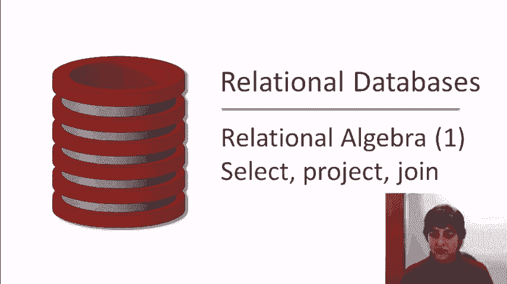
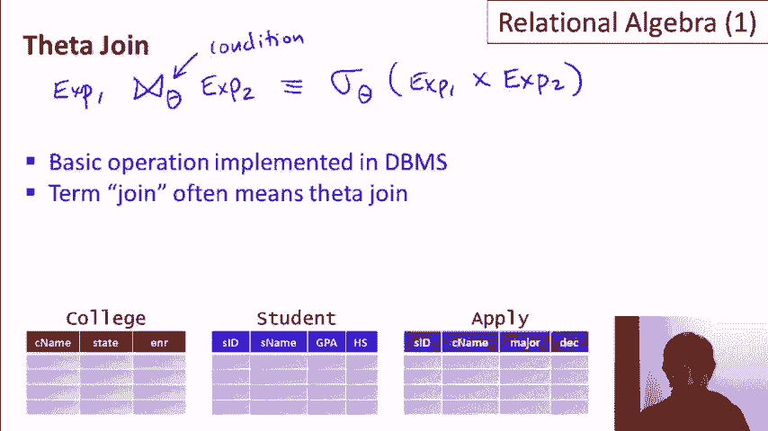
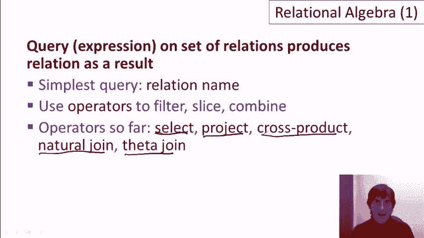

# [斯坦福大学 - 数据库系统入门] Introduction to Databases - Jennifer Widom - Stanford - P7：05-01-relational-algebra-1.mp4 - 哈库那玛塔塔i - BV1R4411u7dt

 This is the first of two videos where we learn about relational algebra。

 Relational algebra is a formal language。 It's an algebra that forms the underpinnings of implemented languages like SQL。

 In this video， we're going to learn the basics of the relational algebra query language and a few of the most popular operators。

 In the second video， we'll learn some additional operators and some alternate notations for relational algebra。

 Now， let's just review first from our previous video on relational querying that queries over relational databases。

 operate on relations and they also produce relations as a result。

 So if we write a query that operates， say， on the three relations depicted here。

 the result of that query is going to be a new relation。 And in fact。

 we can pose queries on that new relation or combine that new relation with our previous relations。

 So let's start out with relational algebra。 For the examples in this video。

 we're going to be using a simple college admissions database with three relations。

 The first relation， the college relation， contains information about the college name， state。

 and enrollment of the college。 The second relation， the student relation。

 contains an ID for each student， the student's name， GPA。

 and the size of the high school they attended。 And finally。

 the third relation contains information about students applying to colleges。 Specifically。

 the student's ID， the college name where they're applying， the major they're applying for。

 and the decision of that application。 I've underlined the keys for these three relations。

 As a reminder， a key is an attribute or a set of attributes whose value is guaranteed to be unique。

 So for our examples， we're going to assume that college names are unique， student IDs are unique。

 and that students will only apply to each college for a particular major one time。

 So we're going to have a picture of these three relations at the bottom of the slides throughout the video。

 The simplest query in relational algebra is a query that is simply the name of a relation。 So。

 for example， we can write a query， student， and that's a valid expression in relational algebra。

 If we run that query on our database， we'll get， as a result， a copy of the student relation。

 Pretty straightforward。 Now， what happens next is that we're going to use operators of the relational algebra to filter relations。

 slice relations， and combine relations。 So let's go through those operators。

 The first operator is the select operator。 So the select operator is used to pick certain rows out of a relation。

 The select operator is denoted by a sigma with a subscript that's the condition that's used to filter the rows。

 that we extract from the relations。 So we're just going to go through three examples here。

 The first example says that we want to find the students whose GPA is greater than 3。7。

 So to write that expression in relational algebra， we write the sigma。

 which is the selection operator， as a subscript that we're filtering for， GPA greater than 3。7。

 and the relation over which we're applying that selection predicate。

 So this expression will return a subset of the student table containing those rows where the GPA is greater than 3。

7。 If we want to filter for two conditions， we just do an AND of the conditions in the subscript of the sigma。

 So if we want， say， students whose GPA is greater than 3。7 and its high school size is less than 1。

000， we'll write select GPA greater than 3。7。 We'll use the logical AND operator， a carrot。

 High school size is less than 1，000。 And again， we'll apply that to the student relation。

 And once again， the result of that will be a subset of the student relation containing the rows that satisfy the condition。

 If we want to find the applications to Stanford for a CS major。

 then we'll be applying a selection condition to the apply relation。 Again， we write the sigma。

 and now the subscript is going to say that the college name is Stanford。 And the major is CS， again。

 the AND operator。 And that will be applied to the apply relation。

 And it will return as a result a subset of the apply relation。

 So the general case of the select operator is that we have the sigma。

 we have a condition as a subscript， and then we have a relation name。

 and we return as a result the subset of the relation。 Our next operator is the project operator。

 So the select operator picks certain rows and the project operator picks certain columns。

 So let's say we're interested in the applications。

 but all we wanted to know is the list of IDs and the decisions for those applications。

 The project operator is written using the Greek pi symbol。

 And now the subscript is a list of the column names that we would like to extract。 So we write ID。

 sorry， student ID， and decision， and we apply that to the apply relation again。

 And now what we'll get back is a relation that has just two rows。

 It's going to have all the tuples of apply， but it's only going to have the student ID and the decision columns。

 So the general case of a project operator is the projection and then a list of attributes can be any number and then a relation name。

 Now what if we're interested in picking both rows and columns at the same time？

 So we want only some of the rows and we want only some of the columns。

 Now we're going to compose operators。 Remember that relational queries produce relations。

 So we can write a query， say， with a select operator of the students whose GPA is greater than 3。7。

 This is how we do that。 And now we can take that whole expression which produces a relation and we can apply the project operator to that and we can get out the student ID and the student name。

 Okay， so what we actually see now is that the general case of the selection of projection operators weren't quite what I told you at first。

 I was deceiving you slightly。 When we write the select operator。

 it's a select with a condition on any expression of the relational algebra。 And if it's an big one。

 we might want to put parens on it。 And similarly， the project operator is a list of attributes from any expression of the relational algebra。

 And we can compose these as much as we want。 We can have select over project over select， select。

 project and so on。 Now let's talk about duplicate values in the results of relational algebra queries。

 Let's suppose we ask for a list of the majors that people have applied for and the decision for those majors。

 So we write that as the project of the major and the decision on the apply relation。

 You might think that when we get the result of this query。

 we're going to have a lot of duplicate values。 So we'll have CS， yes， CS， yes， CS， no， E， E， S， E。

 E， no and so on。 You can imagine in a large realistic database of applications。

 there's going to be hundreds of people applying for majors and having a yes or a no decision。

 The semantics of relational algebra says that duplicates are always eliminated。

 So if you run a query that would logically have a lot of duplicate values。

 you just get one value for each result。 That's actually a bit of a difference with the SQL language。

 So SQL is based on what's known as multi sets or bags and that means that we don't eliminate duplicates。

 whereas relational algebra is based on sets themselves and duplicates are eliminated。

 There is a multi set or bag relational algebra defined as well。

 but we'll be fine by just considering the set relational algebra in these videos。

 Our first operator that combines two relations is the cross product operator。

 also known as the Cartesian product。 What this operator does is it takes two relations and it kind of glues them together so that their schema of the result is the union of the schemas of the two relations。

 and the contents of the result are every combination of tuples from those relations。

 This is in fact the normal set cross product that you might have learned way back in elementary school。

 So let's talk about， say， doing the cross product of student and apply。

 So if we do this cross product， just to save drawing。

 I'm going to just kind of glue these two relations together here。 So if we do the cross product。

 we'll get as a result a big relation here， which is going to have eight attributes。

 the eight attributes across the student and apply。

 Now the only small little trick is that when we glue two relations together。

 sometimes they'll have the same attribute name。 We can see we have SID on both sides。

 So just as a notational convention， when cross product is done and there's two attributes that are named。

 they're prefaced with the name of the relation they came from。

 So this one would be referred to in the cross product as the student。SID。

 where this one over here would be referred to as the apply。SID。 So again。

 we glue together in the Cartesian product， the two relations with four attributes each。

 we get a result with eight attributes。 Now let's talk about the contents of these。

 So let's suppose that the student relation had S tuples in it， that's how many tuples。

 while the apply had A tuples in it， the result of the Cartesian product is going to have S times A tuples。

 It's going to have one tuple for every combination of tuples from the student relation and the apply relation。

 Now the cross product seems like it might not be that helpful。

 but what is interesting is when we use the cross product together with other operators。

 And let's see a big example of that。 Let's suppose that we want to get the names and GPAs of students with a high school size greater than 1000 who applied to CS and were rejected。

 Okay， so let's take a look。 We're going to have to access the students and the apply records in order to run this query。

 So what we'll do is we'll take student cross apply as our starting point。

 So now we have a big relation that contains eight attributes and all of those tuples that we described previously。

 But now we're going to start making things more interesting because what we're going to do is a big selection over this relation。

 And that selection is first of all going to make sure that it only combines student and apply tuples that are referring to the same student。

 So to do that we write student dot SID equals apply dot SID。

 So now we've filtered the result of that cross product to only include combinations of student and apply tuples that make sense。

 Now we have to do a little bit of additional filtering。

 We said that we want the high school size to be greater than 1000 so we do an operator in the high school。

 We want them to have applied to CS so that's and major equals CS。

 We're getting a nice big query here。 And finally we want them to have been rejected so and decision equals we'll just use an R for reject。

 So now we've got that gigantic query but that gives us exactly what we want except for one more thing which is I said all we want is their names and GPAs。

 So finally we take a big parentheses around here and we apply to that the projection operator getting the student name and the GPA。

 And that is the relational algebra expression that produces the query that we've written in English。

 Now we've seen how the cross product allows us to combine tuples and then apply selection conditions to get meaningful combinations of tuples。

 It turns out that relational algebra includes an operator called the natural join that is used pretty much for the exact purpose。

 What the natural join does is it performs a cross product but then it enforces equality on all of the attributes with the same name。

 So if we set up our schema properly for example we have student ID and student ID here meaning the same thing then when the cross product is created it's only going to combine tuples where the student ID is the same。

 And furthermore if we add collagen we can see that we have the college name here and the college name here。

 If we combine collagen apply tuples we'll only combine tuples that are talking about the same college。

 Now in addition one more thing that it does is it gets rid of these pesky attributes that have the same names。

 So since when we combine for example student and apply with the natural join we're only combining tuples where the student SID is the same as the apply SID then we don't need to keep two columns。

 Two copies of that column because the values are always going to be equal。

 So the natural join operator is written using a bow tie that's just the convention。

 You will find that in your text editing programs if you look carefully。

 So let's do some examples now。 Let's go back to our same query where we were finding the names and GPA's of students from large high schools who applied to CS and were rejected。

 So now instead of using the cross product we're going to use the natural join which as I said was written with a bow tie。

 What that allows us to do once we do that natural join is we don't have to write that condition that informs equality on those two attributes because it's going to do it itself。

 And once we've done that then all we need to do is apply the rest of our conditions which were that the high school is greater than 1000 and the major is CS and the decision is reject。

 Again we'll call that R and then since we're only getting the names and GPA's we write the student name and the GPA。

 Okay and that's the result of the query using a natural join。

 So as you can see that's a little bit simpler than the original with the cross product and by setting up schemas correctly natural join can be very useful。

 Now let's add one more complication to our query。 Let's suppose that we're only interested in applications to colleges where the enrollment is greater than 20。

000。 So so far in our expression we've referred to the student relation and the apply relation but we haven't used the college relation。

 But if we want to have a filter on enrollment we're going to have to bring the college the college relation into the picture。

 This turns out to perhaps be easier than you think。

 Let's just erase a couple of our parentheses here and what we're going to do is we're going to join in the college relation with the two relations we have already。

 Now technically the natural join is a binary operator。

 People often use it without parentheses because it's associative but if we get pedantic about it we could add that and then we're in good shape。

 Now we've joined all three relations together and remember automatically the natural join enforces equality on the shared attributes。

 Very specifically the college name here is going to be set equal to the apply college name as well。

 Now once we've done that we've got all the information we need。

 We just need to add one more filtering condition which is that the college enrollment is greater than 20。

000 and with that we've solved our query。 So to summarize the natural join we the natural join combines relations。

 It automatically sets values equal when the attribute names are the same and then it removes the duplicate columns。

 The natural join actually does not add any expressive power to relational algebra。

 We can rewrite the natural join without it using the cross product。

 So let me just show that rewrite here。 If we have and now I'm going to use the general case of two expressions。

 One expression natural join with another expression that is actually equivalent to doing a projection on the schema of the first expression。

 I'll just call it E1。 Now union the schema of the second expression that's a real union。

 So that means if we have two copies we just keep one of them。

 Over the selection of now we're going to set all the shared attributes of the first expression to be equal to the shared attributes of the second。

 So I'll just write E1 A1 equals E2 A1 and E1 A2 equals E2 A2。

 Now these are the cases where again the attributes have the same names and so on。

 So we're setting all those equal and that is applied over expression one cross product expression two。

 So again the natural join is not giving us additional expressive power but it is very convenient notationally。

 The last operator that I'm going to cover in this video is the theta join operator。

 Like natural join theta join is actually an abbreviation that doesn't add expressive power to the language。

 Let me just write it。 The theta join operator takes two expressions and combines them with the bow tie looking operator but with the subscript theta。

 That theta is a condition。 It's a condition in the style of the condition in the selection operator and what this actually says it's pretty simple is it's equivalent to applying the theta condition to the cross product of the two expressions。

 So you might wonder why I even mentioned the theta join operator and the reason I mention it is that most database management systems implement the theta join as their basic operation for combining relations。

 So the basic operation is take two relations combine all tuples but then only keep the combinations that pass the theta condition often when you talk to people who build database systems or use databases when they use the word join they really mean the theta join。

 So in conclusion relational algebra is a formal language it operates on sets of relations and produces relations as a result。

 The simplest query is just the name of a relation and then operators are used to filter relations slice them and combine them。

 So far we've learned the select operator for selecting rows the project operator for selecting columns the cross product operator for combining every possible pair of tuples from two relations and then two abbreviations。

 The natural join which is a very useful way to combine relations by enforcing equality on certain columns and the theta join operator。

 In the next video we'll learn some additional operators of relational algebra and also some alternative notations for relational algebra expressions。

