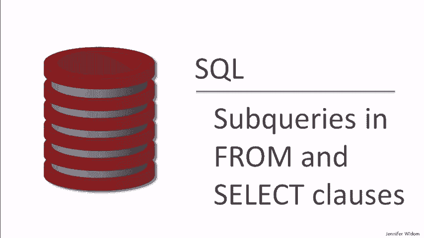

# [斯坦福大学 - 数据库系统入门] Introduction to Databases - Jennifer Widom - Stanford - P9：06-05-subqueries-in-from-select.mp4 - 哈库那玛塔塔i - BV1R4411u7dt

 In the next set of SQL queries， we'll see examples of using subqueries in the from and the select clauses。

 In the previous video， we introduced subqueries， but we only used them in the wear clause。

 In the condition of queries， we wrote subqueries that generated sets that we used for comparisons。

 In the next set of queries， we're going to see that we can also use subqueries， select expressions。

 in the from clause of queries， as well as in the select clause。 If we use a subqueries in the from。

 what we're really doing is running an nested select statement that's going to generate one of the tables that we use in the rest of the query。

 If we use a subqueries in the select， then what we're doing is writing a select expression。

 a sub-select expression that produces the value that comes out of the query。

 So let's see this in action， and as usual， we'll be using our simple college admissions database with the college student and apply tables。

 Our first query is going to lead to demonstrating the use of a subquery in the from clause。

 You might remember from a previous video that we had the concept of scaling a student's GPA based on the size of their high school。

 Specifically， we took the GPA and multiplied by the size of high school divided by a thousand。

 What we're going to do in this query is we're going to return all students where scaling their GPA changes its value by more than one。

 specifically either the scale GPA minus the GPA is greater than one。

 or the GPA minus the scale GPA is greater than one。 So let's run the query。

 and we find a number of students whose GPA is modified by more than one by scaling it。

 Now let's take a look at this query。 We have this expression that scales the GPA。

 and we actually had to write the expression out three times。

 Now remember this could in fact be a much more complicated calculation。

 A smart database system might look at the query and recognize that it can do the computation once and use it in all three places。

 but maybe we're not using a smart database system， and furthermore for the query itself。

 we might like to simplify things and only write that expression once。

 So simplifying the WHERE clause is actually fairly easy。

 We can just use the absolute value function that's built into most SQL implementations。

 So we write absolute value function， and we apply it to this computation here。

 We delete the second clause of the query， and we run the query and we should get exactly the same result。

 and we do。 So that's good， but we still have two computations here of the scale GPA。

 So what I'm going to do now is I'm going to put in the FROM clause a subquery。

 and that subquery is going to among things compute the scale GPA。

 When we put a subquery in the FROM clause， what we're doing is creating a select FROM WHERE statement that produces a relation。

 but in the rest of the query we can treat that just like a relation。

 so we can refer to the scale GPA in the rest of the query。 Alright。

 so let me just do a little editing here。 So I'm going to take this select from here。

 this portion of the query， like that， and I'm going to turn it into its own subquery and put it in the FROM clause。

 Now I'm going to give it a name G， and technically I might be able to leave that out。

 but most SQL implementations require it。 This says compute the select FROM WHERE expression and call the result G。

 and now in the rest of the query， any time I refer to G。

 I'm referring to the result of this subquery in the FROM。 Specifically， I now have scale GPA。

 and if I want， I can put that it comes from G， although I don't need to， since it's not ambiguous。

 and I can use that scale GPA in the rest of my query。 Now I'm still missing a select。

 so I'll just put select star here， and I'll get all attributes back。

 and now I have a complete query where I computed the scale GPA in the FROM clause and used it elsewhere in the query。

 I run this one， and I get， again， the exact same result。

 We're going to see more examples of using subqueries in the FROM clause in the later video on aggregation。

 Our second major example is going to lead to using a subquery in the SELECT clause。

 Let's start by explaining what this query does。 What we're going to do is we're going to find colleges。

 and we're going to pair those colleges with the highest GPA among their applicants。

 So this requires joining all three of our relations， college， apply， and student。

 We have here the JOIN conditions。 We always need to remember to include those。

 We're going to return those college names， states， and GPAs， where the GPA is the highest。

 and I'm using the greater than or equal to all construct here。

 among the GPAs of the students who applied to that same college。

 You might want to pause the video and just make sure you understand what the query is doing。

 but again， what it's going to return is colleges with the highest GPA among their applicants。

 Let's run the query， and we see that most colleges， all of the colleges in fact。

 have a applicant with a 3。9 GPA。 That happens to be the highest in the database。

 and all of the colleges have an applicant with that GPA。 Now we see some duplicates here。

 If we don't like duplicates， we use our usual trick of putting distinct。

 and now we have our four colleges in our database and the highest GPA of their applicants。

 Now let's see how we can write this query using a subquery in the Select clause。

 What a subquery in the Select clause does is performs a computation。

 and as long as that computation returns exactly one value， that value is used in the result tuple。

 So let me just start typing here a little bit。 What we're going to do here is we're going to select the college name and state from the college。

 Let me just pull this down here from the college， and then we're going to use a modified version of this query to compute the highest GPA for that particular college。

 So we're going to have college name， state， and here comes the subquery in the From clause。

 So let's just put parens around there。 And we're going to， in the subquery， just compute the GPA。

 and it's going to be the highest GPA for this college。

 So we don't need to include college in our From list， and now we have college here。

 and the rest of this is the same query precisely。 The last thing we're going to do is label this attribute as GPA。

 and now we're all set。 You may want to pause the video and look carefully to make sure you understand how the query works。

 but again， it's taking the， for each college， the name， and the rest of the class。

 So we're going to use the same query， and we're going to use the same query。

 and we're going to use the same query。 So we're going to use the same query。

 and we're going to use the same query， and we're going to use the same query。

 So we're going to use the same query， and we're going to use the same query。

 and we're going to use the same query。 So we're going to use the same query。

 and we're going to use the same query， and we're going to use the same query。

 The names of the students who applied to that college。 So everything looks pretty much the same。

 except we don't need this big sub query， this big portion here。 We write it like this。

 we'll call it the student name， and that looks pretty similar。 Again。

 we've got the college name state， and then all the students who applied to that college。

 we run the query， and we get an error。 The error was expected。

 and I'm using it to illustrate a point。 When you write a sub query in the Select clause。

 it's critical that that sub query returned exactly one value。

 because the result of that is being used to fill in just one cell of the result。

 In our earlier example， we were computing the highest GPA for each college。

 and there's exactly one of those。 In this case， we have several students applying to colleges。

 so we wouldn't know when we get a bunch of values in the result。

 which one to put in the tuple that's being constructed。 And in fact。

 our result here says sub query returns more than one row， and that's the error。

