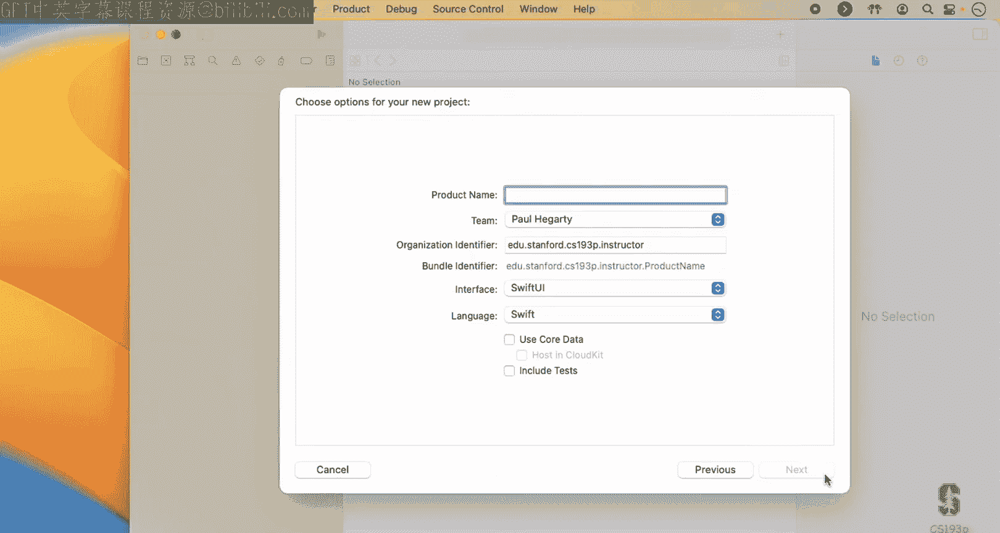
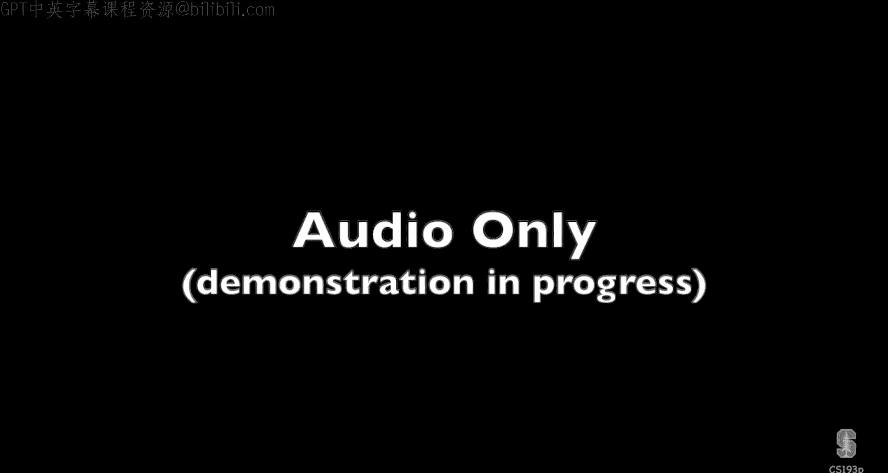
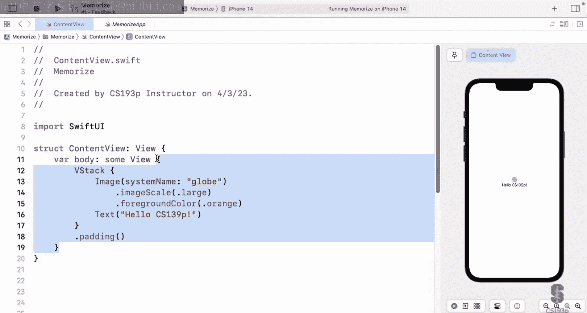
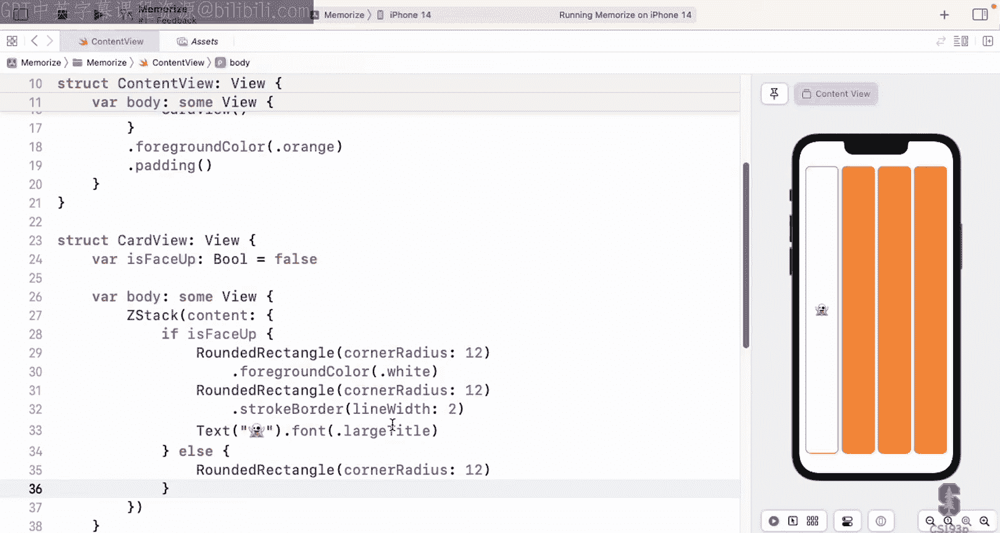

# 001：课程介绍与SwiftUI基础 🚀

在本节课中，我们将学习斯坦福大学CS193p课程的第一讲内容。课程将介绍iOS应用开发的基础知识，特别是使用SwiftUI框架。我们将从课程概述开始，逐步深入到SwiftUI的核心概念，包括视图、结构体、函数式编程等。通过本讲的学习，你将能够理解SwiftUI的基本工作原理，并开始构建一个简单的卡片游戏应用。

---

## 课程概述与准备工作 📋

大家好，欢迎来到斯坦福大学CS193p课程，本课程专注于使用SwiftUI开发iOS应用。我是Paul Hegarty，已经教授这门课程13到14年了。本季度我们回到校园授课，虽然没有录制完整的课堂视频，但我录制了屏幕演示，以便学生回顾课程内容。这些演示对你们同样有帮助，因为你们可以跟随学习。

课程内容基于2023年春季学期的教学，但请注意，苹果可能会在WWDC开发者大会上发布SwiftUI和iOS的更新。因此，如果你在2023年底或2024年之后观看本课程，可能需要留意一些变化。不过，由于这是一门入门课程，核心内容不太可能发生重大变化。

本课程主要关注SwiftUI，前七到八周专注于iOS应用开发，课程后期会展示如何将所学知识应用于macOS、watchOS和Apple TV应用开发。课程内容包括函数式编程、响应式用户界面编程以及面向对象数据库等。课程的重点是实际应用，将你在其他课程中学到的知识整合到iOS开发中。

课程的前提条件包括一定的编程经验，因为所有作业和最终项目都涉及编码。建议你至少学习过一门结构化编程语言（如Python、Java或C++），以便更好地理解SwiftUI中的新概念。

课程将通过演示、阅读作业和编程作业进行。前五周我们将构建一个大型应用，以叙事的方式学习SwiftUI的核心概念。之后，你将通过小片段（vignettes）进一步深入学习。课程还包括六次编程作业和一次最终项目，最终评分基于作业和项目的完成情况。

在开始编码之前，你需要完成“作业0”，即安装Xcode并配置Apple ID和GitHub账户。Xcode是开发iOS应用的主要工具，GitHub用于提交作业。接下来，我们将创建一个新项目，开始构建我们的第一个应用。



---



## 创建第一个SwiftUI项目 🛠️

上一节我们介绍了课程概述和准备工作，本节中我们来看看如何创建第一个SwiftUI项目。我们将使用Xcode创建一个名为“Memorize”的卡片游戏应用。这个游戏类似于“记忆匹配”游戏，玩家需要翻转卡片并匹配相同的图案。

首先，打开Xcode并创建一个新项目。选择“iOS App”模板，将项目命名为“Memorize”。在组织标识符中，建议使用反向DNS格式（例如“edu.stanford.yourid”）。确保选择SwiftUI作为用户界面框架，并取消选择其他选项（如Core Data）。创建项目后，Xcode会自动生成一些文件，包括`ContentView.swift`和`MemorizeApp.swift`。

Xcode界面分为多个部分：
- **导航器**：显示项目文件、搜索、错误等信息。
- **编辑器**：编写代码的主要区域。
- **检查器**：编辑选中元素的属性。
- **预览面板**：实时显示UI效果。
- **调试器与控制台**：用于调试和输出日志。

预览面板是SwiftUI的一大亮点，它可以实时更新UI变化。例如，如果你修改代码中的文本，预览面板会立即显示更新后的效果。此外，你还可以在预览面板中切换设备、颜色模式（深色/浅色）和字体大小，以确保应用在不同环境下都能正常显示。

接下来，我们将开始编写代码，构建游戏的基本界面。

---

## SwiftUI基础：视图与结构体 🧱

上一节我们创建了第一个SwiftUI项目，本节中我们来看看SwiftUI的核心概念：视图与结构体。在SwiftUI中，几乎所有内容都是结构体（`struct`），这些结构体通过遵循协议（如`View`）来定义行为。

首先，让我们分析`ContentView.swift`中的代码：
```swift
import SwiftUI

struct ContentView: View {
    var body: some View {
        Text("Hello, CS193p!")
    }
}
```
- `import SwiftUI`：导入SwiftUI框架，这是所有UI相关代码的基础。
- `struct ContentView: View`：定义一个名为`ContentView`的结构体，并声明它遵循`View`协议。这意味着`ContentView`必须实现`View`协议的要求。
- `var body: some View`：这是一个计算属性，返回一个遵循`View`协议的类型。`some View`表示返回的类型可以是任何遵循`View`协议的结构体。

`View`协议的核心要求是提供一个`body`属性，该属性返回一个视图。通过遵循`View`协议，你的结构体可以访问SwiftUI提供的数百个函数和修饰符，用于定制UI。



在SwiftUI中，视图可以通过组合其他视图来构建。例如，`VStack`（垂直堆栈）和`HStack`（水平堆栈）用于排列多个视图。视图还可以通过修饰符（如`.font()`、`.foregroundColor()`）进行定制。这些修饰符返回一个新的视图，因此可以链式调用。

为了理解视图的组合方式，我们可以用乐高积木来类比：
- 基本视图（如`Text`、`Image`）就像乐高积木块。
- 组合视图（如`VStack`、`HStack`）就像将多个积木块堆叠在一起。
- 修饰符就像为积木块添加颜色或纹理。


通过这种方式，我们可以构建复杂的UI界面。接下来，我们将开始构建游戏中的卡片视图。

---

## 构建卡片视图 🃏

上一节我们介绍了SwiftUI的基础概念，本节中我们来看看如何构建游戏中的卡片视图。卡片视图需要显示一个矩形背景，并在正面显示一个表情符号，背面显示统一的颜色。

首先，我们创建一个名为`CardView`的结构体，用于表示单个卡片：
```swift
struct CardView: View {
    var isFaceUp: Bool = false

    var body: some View {
        ZStack {
            if isFaceUp {
                RoundedRectangle(cornerRadius: 12)
                    .fill(Color.white)
                RoundedRectangle(cornerRadius: 12)
                    .strokeBorder(lineWidth: 2)
                Text("👻")
                    .font(.largeTitle)
            } else {
                RoundedRectangle(cornerRadius: 12)
                    .fill(Color.orange)
            }
        }
    }
}
```
- `ZStack`：用于将多个视图叠加在一起。在这个例子中，我们将卡片背景、边框和表情符号叠加显示。
- `RoundedRectangle`：一个圆角矩形形状，用于表示卡片的背景。
- `fill`：修饰符用于填充形状的颜色。
- `strokeBorder`：修饰符用于绘制形状的边框。
- `Text`：显示表情符号的文本视图。

卡片视图通过`isFaceUp`属性控制正面或背面的显示。如果`isFaceUp`为`true`，则显示白色背景、边框和表情符号；如果为`false`，则显示橙色背景。

接下来，我们在`ContentView`中使用多个`CardView`实例，并通过`HStack`水平排列它们：
```swift
struct ContentView: View {
    var body: some View {
        HStack {
            CardView(isFaceUp: true)
            CardView()
            CardView()
            CardView()
        }
        .padding()
        .foregroundColor(.orange)
    }
}
```
- `HStack`：水平排列四个卡片视图。
- `padding`：为整个堆栈添加内边距，避免卡片紧贴屏幕边缘。
- `foregroundColor`：设置所有子视图的前景色为橙色。这个颜色会传递给`CardView`，用于背面背景。

通过这种方式，我们构建了一个简单的游戏界面，显示了四张卡片，其中一张正面朝上，其余三张背面朝上。在接下来的课程中，我们将进一步优化这个界面，例如使用网格布局代替水平堆栈，并添加游戏逻辑。

---

## 总结与下一步计划 🎯

本节课中我们一起学习了SwiftUI的基础知识，包括视图、结构体、协议和修饰符。我们创建了一个简单的卡片游戏应用，构建了卡片视图，并通过组合视图实现了基本的UI布局。

以下是本讲的核心要点：
1. **SwiftUI基于结构体和协议**：几乎所有UI元素都是结构体，通过遵循协议（如`View`）定义行为。
2. **视图通过组合构建**：使用`VStack`、`HStack`和`ZStack`等容器视图组合多个子视图。
3. **修饰符用于定制视图**：通过链式调用修饰符（如`.font()`、`.foregroundColor()`）可以修改视图的外观和行为。
4. **预览面板提供实时反馈**：Xcode的预览面板可以实时显示UI变化，支持深色模式、横竖屏等多种变体。

在下一讲中，我们将继续优化游戏界面，例如将水平堆栈改为网格布局，并开始分离游戏逻辑与UI代码。我们还将学习如何使用SwiftUI的响应式编程特性，使游戏更加动态和交互式。

希望你能通过本课程掌握SwiftUI的核心概念，并开始构建自己的iOS应用。如果你有任何问题，请随时在课程讨论区提问。祝你在iOS开发的道路上一切顺利！

---



**注意**：本教程根据斯坦福大学CS193p课程第一讲内容整理，旨在帮助初学者理解SwiftUI的基础知识。所有代码示例和解释均基于课程演示，力求简单直白，便于理解。