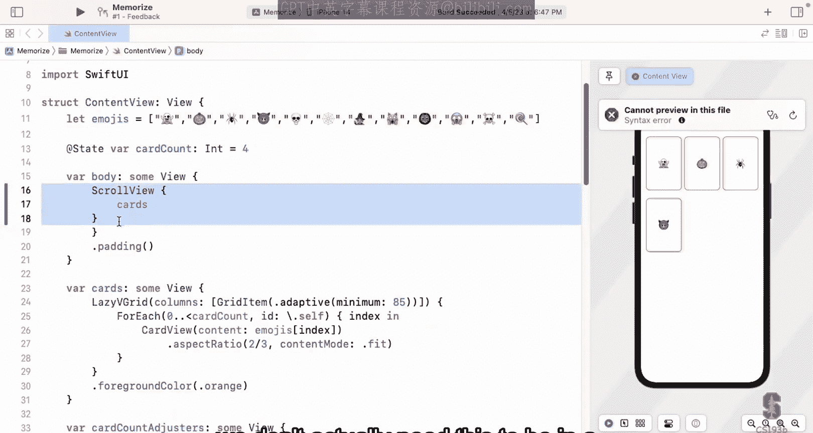
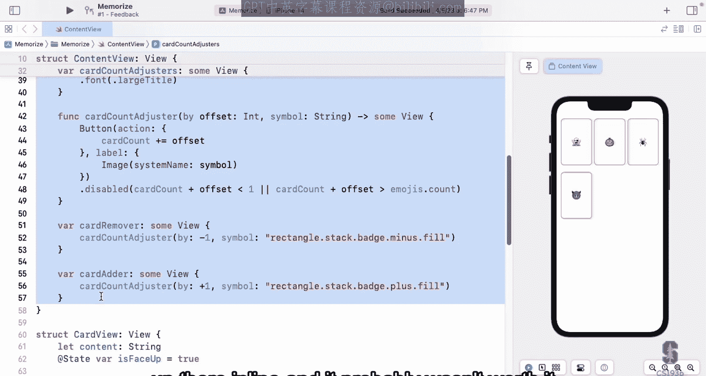
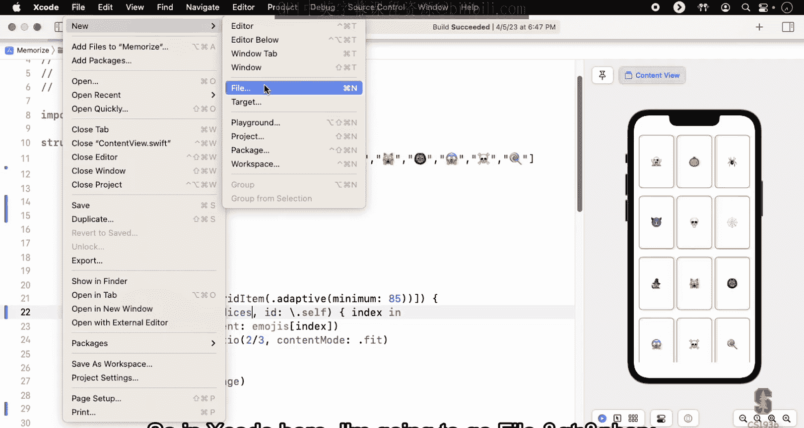
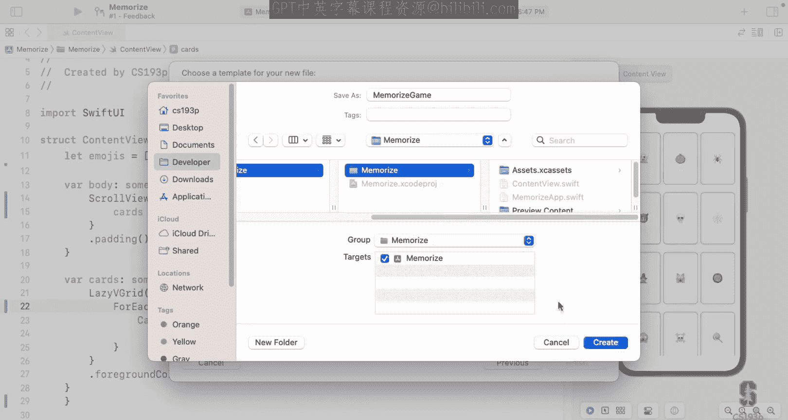
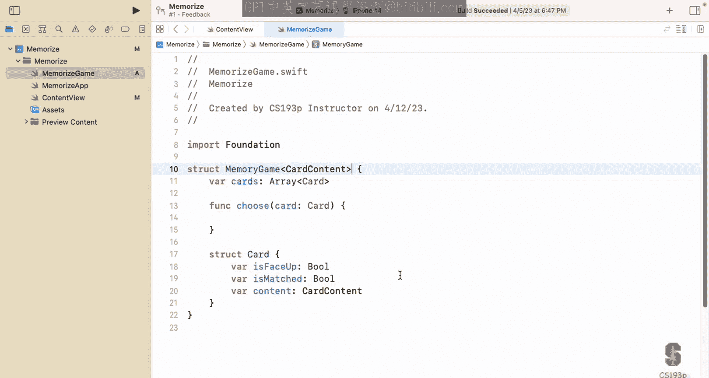
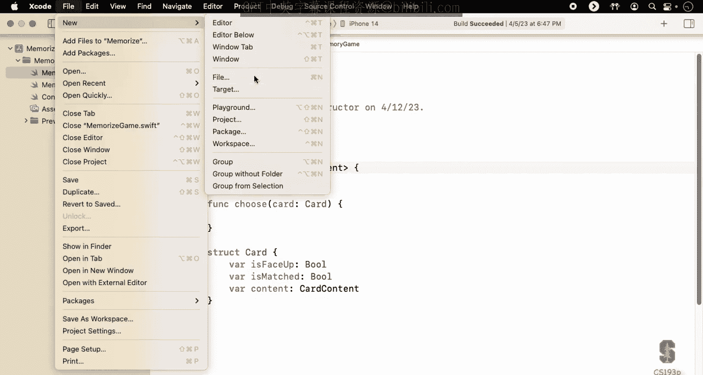
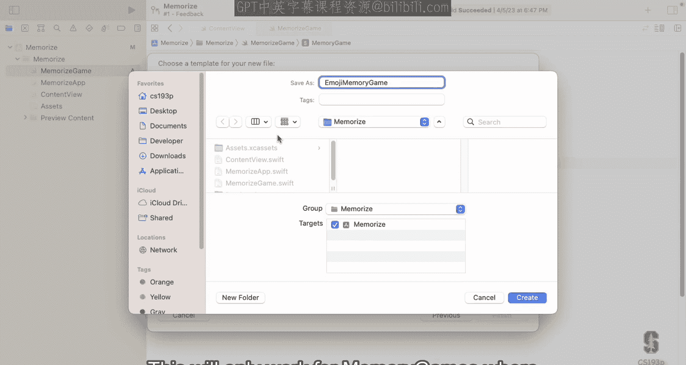
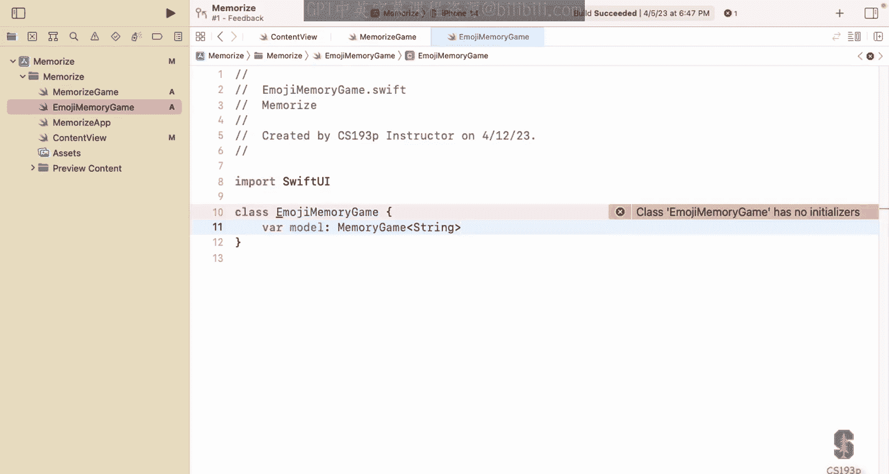

# 003：斯坦福大学《SwiftUI的iOS应用开发｜CS193p Developing Applications for iOS using SwiftUI 2023》 p03 -03-Lecture 3 _ Stanford CS193p 2023.zh_en -BV1HyzNYdEiD_p3-

## 概述 📋

在本节课中，我们将学习两个核心主题：**MVVM架构**和**Swift类型系统**。理解MVVM是构建SwiftUI应用的基础，它能帮助我们清晰地分离应用的逻辑、数据与用户界面。之后，我们将探讨Swift中的关键类型，如结构体、类和协议，这些是构建应用功能模块的基石。最后，我们会回到演示项目，开始为记忆卡片游戏构建核心的游戏逻辑。

## MVVM架构：设计范式 🏗️

在深入演示之前，我们需要先了解一些基础架构。MVVM是您将用来构建应用的设计范式。

在Swift中，将应用的逻辑和数据部分与用户界面分离至关重要。SwiftUI正是围绕这一理念构建的：您将拥有处理应用逻辑和数据的部分，以及向用户展示并与之交互的独立UI部分。逻辑和数据部分，我们称之为**模型**。例如，在我们的记忆卡片应用中，模型处理点击卡片时发生什么、卡片是正面朝上还是朝下等所有逻辑。我们目前所做的UI部分，有时称为**视图**，它是我们观察模型的窗口。

模型可以是一个单一的结构体，也可以是一个完整的SQL数据库、机器学习代码，甚至是互联网上的REST API。它是一个概念性的存在。UI部分则像是模型的一个可参数化的外壳，是模型的**可视化呈现**。因此，您应该这样思考：模型是应用的本质，而UI只是向用户展示它的方式。

到目前为止，我们放在视图中的 `@State` 变量，如 `faceUpCardCount`，实际上属于模型，因为它们描述了游戏的状态。我们将把它们移入模型。

SwiftUI的一个重要职责是确保模型中的任何变化都能反映在UI上。它内置了大量基础设施来为您处理这件事。您只需向SwiftUI提供一些关于模型中哪些部分会影响UI的提示，之后SwiftUI会负责更新。因此，您主要需要关心的是如何将这两部分清晰地分离。

## 连接模型与视图 🔗

如果我们分离了模型和视图，它们如何相互通信呢？主要有三种连接方式：

1.  **模型作为视图的 `@State`**：将整个模型作为视图的一个 `@State` 变量。这种方式分离度极低，通常不推荐。
2.  **通过“守门员”访问模型**：这是我们将要采用的主要方式，即MVVM。一个称为“视图模型”的中间层负责协调模型与视图之间的安全通信。99%的应用开发都会采用这种方式。
3.  **混合方式**：视图模型作为守门员，但有时也允许UI直接访问模型的某些部分。这种方式在应用增长时容易变得混乱，不够灵活。

简单的答案是：**始终采用第二种方式**。即使对于非常简单的模型，使用视图模型作为守门员也是值得的，因为它为应用未来的增长提供了灵活性。在我们的演示中，我们将主要展示第二种方式，但也会提及第三种。

## 深入MVVM：模型、视图、视图模型 🧩

MVVM代表 **Model-View-ViewModel**。

*   **模型**：是UI无关的。它包含应用的数据（如卡片状态）和逻辑（如选择卡片时的行为）。模型是**唯一的真相来源**。您不应将数据复制到视图模型或UI的 `@State` 中，而应始终向模型询问信息。
*   **视图**：是模型的**可视化呈现**。它应该是**无状态的**，始终反映模型的当前状态。我们使用 `@State` 标记的状态变量是罕见的例外，提醒我们正在做一件不寻常的事。视图的构建是**声明式**的：我们描述UI应该是什么样子，然后由模型数据驱动其变化。这使得UI是**响应式**的：当模型变化时，UI自动更新。
*   **视图模型**：是连接视图和模型的**绑定器**和**守门员**。它的职责包括：
    *   **解释模型**：例如，将复杂的SQL查询结果转化为视图可以理解的简单变量。
    *   **保护模型**：防止UI对模型进行不当操作。
    *   **发布变更**：当模型变化时，通知整个系统（特别是SwiftUI）。
    *   **处理用户意图**：当用户在视图中进行操作（如点击）时，视图会调用视图模型中的一个函数来表达**用户意图**（例如 `chooseCard`），而不是具体的UI动作（如 `tapped`）。视图模型负责将此意图转化为对模型的相应操作。

**数据流**：模型数据通过视图模型流向视图（只读）。当用户通过视图表达意图时，该意图通过视图模型传递给模型，模型随之改变。视图模型注意到模型的变化，发布“某物已变”的消息，SwiftUI随后智能地更新受影响的视图。

## Swift类型系统：构建模块 🧱

理解一门语言的基础类型至关重要，因为语言的所有能力都源于这些类型。我们将讨论结构体、类、泛型（“不在乎”类型）、协议（第一部分）和函数。

### 结构体与类 🆚

结构体和类在语法上非常相似：它们都可以有存储属性、计算属性、常量、函数和初始化器。

**核心区别**在于：**结构体是值类型，而类是引用类型**。

*   **引用类型（类）**：变量存储的是指向堆内存中对象的**指针**。多个部分可以共享并修改同一个对象。Swift使用**自动引用计数**来管理内存。
*   **值类型（结构体）**：变量直接存储**值本身**。当传递值类型（如赋值给另一个变量或作为函数参数）时，会创建该值的**副本**。Swift使用**写时复制**技术来高效处理大型数据结构的复制。可变性是**显式**的：存储在 `var` 中的结构体可以修改，存储在 `let` 中的则不能。

**设计哲学**：
*   **类**是**面向对象编程**的基础，侧重于数据封装和继承。
*   **结构体**是**函数式编程**和**协议导向编程**的基础，侧重于描述行为（功能）和可证明性。由于值类型的特性，您可以更容易地推理代码的行为。

在本课程中，**99.9%的情况下您将使用结构体**。我们唯一会使用类的地方是**视图模型**，因为它需要在多个视图间共享，并且其作为“守门员”的角色设计可以安全地管理这种共享。

### 泛型（“不在乎”类型）🎲

有时您想构建一个结构体，其中包含一些您不关心具体类型的数据。Swift是强类型语言，因此我们需要一种方式来指定这种“不在乎”的类型，这就是**泛型**。

**语法**：在类型名后使用尖括号 `<...>` 声明一个或多个类型参数。

```swift
struct Array<Element> {
    func append(_ element: Element) { ... }
    subscript(index: Int) -> Element { ... }
}
```

这里的 `Element` 就是一个“不在乎”的类型参数。当您创建实例时，需要指定具体类型：

```swift
var a: Array<Int> = [1, 2, 3] // 现在 Element 就是 Int 类型
a.append(4) // 参数必须是 Int
```

泛型可以与协议结合，对“不在乎”的类型施加一些约束（“在乎一点点”），我们将在演示中看到。

### 协议（第一部分）📜

**协议**定义了行为（或功能）的蓝图，但不提供实现。它只包含函数和属性的声明。

```swift
protocol Movable {
    func move(by: Int)
    var hasMoved: Bool { get }
    var distanceFromStart: Int { get }
}
```

如果一个类型要**遵循**（或说“表现得像”）某个协议，它必须实现协议中要求的所有内容。

```swift
struct Car: Movable {
    func move(by: Int) { ... }
    var hasMoved: Bool = false
    var distanceFromStart: Int = 0
}
```

**协议的作用**：
1.  **约束与获益**：约束遵循它的类型必须实现某些功能，同时这些类型能获得协议扩展带来的额外功能（我们将在后续讨论扩展）。
2.  **作为类型使用**：协议本身可以作为变量、参数或返回值的类型。
3.  **约束泛型**：使用 `where` 子句可以要求泛型类型参数必须遵循某个协议。

协议是实现**协议导向编程**的关键，它允许我们隐藏具体实现，专注于描述功能。

### 函数作为类型 🧮

在Swift中，**函数是一等公民类型**。这意味着您可以像使用其他类型（如 `Int`、`String`）一样使用函数类型。

**函数类型语法**：由参数类型和返回类型组成，例如：
*   `(Int, Int) -> Bool`：一个接受两个 `Int` 并返回 `Bool` 的函数。
*   `(Double) -> Void`：一个接受 `Double` 且不返回值的函数。
*   `() -> [String]`：一个无参数但返回字符串数组的函数。



您可以声明函数类型的变量、参数或返回值：



```swift
var operation: (Double) -> Double // 变量 operation 是一个函数类型
func square(operand: Double) -> Double { return operand * operand }
operation = square // 将 square 函数赋值给 operation
let result = operation(4) // 调用 operation，相当于调用 square(4)
```





**闭包**本质上就是内联的匿名函数，它们可以捕获定义环境中的变量。我们在构建UI时已经大量使用了闭包（例如 `ZStack` 的 `content` 参数、按钮的 `action`）。

## 回到演示：构建记忆游戏模型 🎮

上一节我们介绍了MVVM架构和Swift的核心类型，本节我们将回到演示项目，开始构建记忆卡片游戏的模型。

我们将创建一个独立的Swift文件来存放模型，确保其UI无关性。模型的核心是一个 `MemoryGame` 结构体，它包含一个卡片数组和一个处理选择卡片逻辑的函数。卡片本身也是一个嵌套的结构体 `Card`，包含是否正面朝上、是否已匹配以及卡片内容等属性。为了使模型通用，我们使用**泛型**让卡片内容可以是任意类型（如字符串代表表情符号，或图像数据）。

接着，我们创建视图模型 `EmojiMemoryGame`。它是一个**类**，因为需要在多个视图间共享。视图模型持有一个 `MemoryGame<String>` 类型的模型实例，作为UI与模型之间的桥梁。目前，我们遇到了两个需要解决的问题：类需要初始化器，以及我们需要保护模型不被UI直接访问（实现“守门员”角色）。这些将在下一讲中完善。

## 总结 ✨







本节课我们一起学习了构建SwiftUI应用的两大基石。

首先，我们深入探讨了**MVVM架构**，理解了模型（数据与逻辑）、视图（UI呈现）和视图模型（中间协调者）各自的职责与协作方式。这种分离对于构建清晰、可维护的应用至关重要。

其次，我们梳理了**Swift类型系统**的关键部分：值类型的结构体与引用类型的类的区别、泛型如何表达“不在乎”的类型、协议如何定义行为规范，以及函数如何作为一等公民类型使用。这些类型是构建应用功能模块的基本工具。



最后，我们在演示中开始了模型层的构建，并创建了视图模型的雏形，为下一讲连接所有部分打下了基础。记住，在SwiftUI中，我们主要采用函数式和协议导向的编程风格，结构体和协议是我们的主要工具。