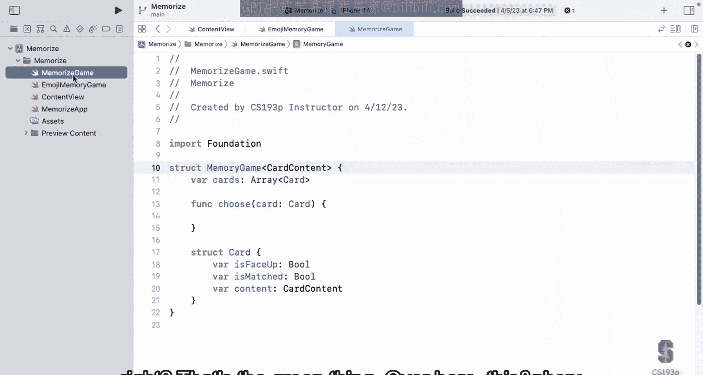
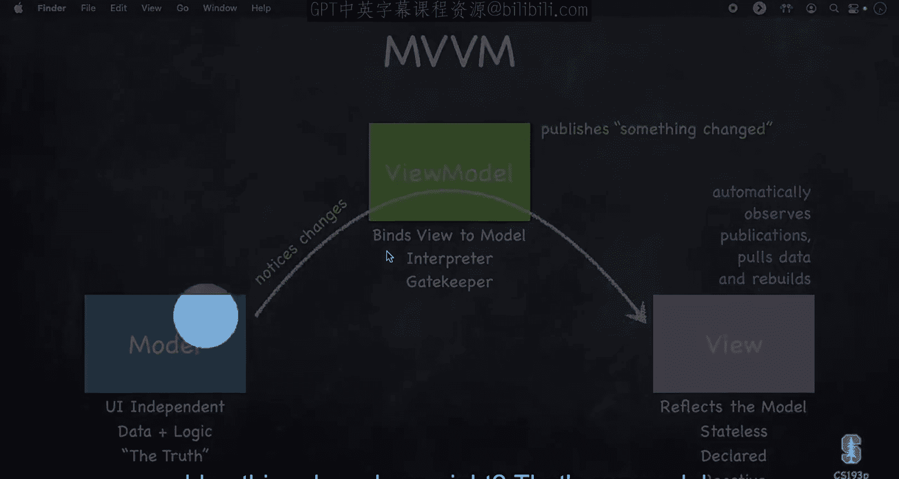
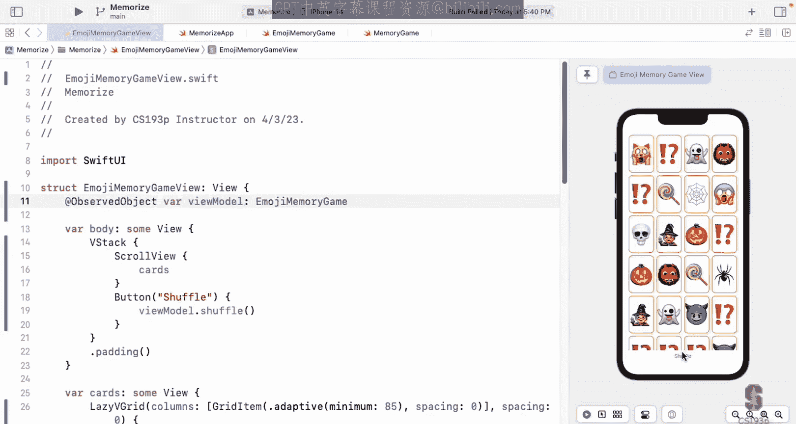

# 004：构建记忆游戏逻辑





在本节课中，我们将学习如何应用MVVM架构来构建记忆游戏的逻辑。我们将深入探讨模型、视图模型和视图之间的交互，并实现游戏的核心功能。

## 概述

上一讲我们介绍了MVVM架构的基本概念。本节我们将具体应用这个架构来构建记忆游戏的逻辑，目标是让游戏能够真正运行起来。

## 回顾架构

让我们回顾一下当前的代码结构。我们有一个名为`EmojiMemoryGame`的类，这就是我们的视图模型。在MVVM架构图中，视图模型是绿色的部分，它负责连接模型和视图。

我们的模型是蓝色的部分，目前已经构建了一个名为`MemoryGame`的结构体。视图部分目前叫做`ContentView`，我们稍后会将其重命名为更合适的名称。

## 视图模型与模型的连接

视图模型需要能够与模型进行完整的通信，因为它负责理解模型数据并以友好的方式呈现给视图。有时我将视图模型比作视图的“管家”——它负责整理模型中的数据，让视图代码保持简洁明了。

在我们的代码中，视图模型通过一个变量来持有模型：
```swift
var model: MemoryGame<String>
```
视图则需要一个变量来指向视图模型，以便能够请求所需的数据：
```swift
var viewModel: EmojiMemoryGame
```

## 访问控制与封装

在MVVM架构中，视图模型与视图之间的通信是单向的。视图模型永远不会直接引用视图，它只通过“某些东西改变了”的信号来通知视图更新。

为了实现更好的封装，我们可以使用访问控制关键字。例如，将模型变量标记为`private`可以实现完全分离：
```swift
private var model: MemoryGame<String>
```
这样，视图就无法直接访问模型，必须通过视图模型提供的方法来获取数据。

在模型端，我们也可以使用`private(set)`来保护数据：
```swift
private(set) var cards: [Card]
```
这意味着只有模型内部可以修改卡片，但其他代码可以查看卡片状态。

## 初始化问题解决

我们的视图模型目前有一个错误：“类EmojiMemoryGame没有初始化器”。这是因为类中的变量`model`没有初始值。

为了解决这个问题，我们需要为模型提供一个初始化器。模型需要知道要创建多少对卡片，所以我们在初始化器中添加这个参数：
```swift
init(numberOfPairsOfCards: Int)
```
在初始化器中，我们需要创建指定数量的卡片对。

## 使用闭包传递知识

模型不知道如何创建卡片内容（对于我们的游戏来说是表情符号），但视图模型知道。我们可以通过传递一个函数来解决这个问题：
```swift
init(numberOfPairsOfCards: Int, cardContentFactory: (Int) -> CardContent)
```
这个函数参数允许创建者（视图模型）提供创建卡片内容的知识。

## 静态变量与函数

为了在属性初始化器中使用表情符号数组，我们将其定义为静态变量：
```swift
private static let emojis = ["🚗", "🚕", "🚙", "🚌", "🚎", "🏎️"]
```
静态变量是命名空间内的全局变量，不会污染全局命名空间。

我们还可以创建静态函数来创建游戏实例：
```swift
private static func createMemoryGame() -> MemoryGame<String>
```

## 更新视图代码

现在我们可以更新视图代码来使用视图模型。首先将`ContentView`重命名为`EmojiMemoryGameView`，然后更新它来使用视图模型提供的数据。

卡片视图现在只需要一个参数——卡片本身：
```swift
struct CardView: View {
    let card: MemoryGame<String>.Card
    // ...
}
```
主视图通过遍历视图模型的卡片数组来创建卡片视图。

## 添加交互功能

接下来我们添加一个洗牌按钮。这需要视图模型提供一个洗牌意图函数：
```swift
func shuffle()
```
在模型内部，我们需要实现洗牌功能，并标记为`mutating`，因为这会修改结构体。

## 实现响应式UI

为了让UI能够响应数据变化，我们需要使视图模型遵循`ObservableObject`协议，并将可能变化的变量标记为`@Published`：
```swift
class EmojiMemoryGame: ObservableObject {
    @Published private var model: MemoryGame<String>
    // ...
}
```
在视图中，我们使用`@ObservedObject`来观察视图模型的变化。

## 总结

本节课我们一起学习了如何应用MVVM架构来构建记忆游戏的逻辑。我们实现了模型与视图模型的连接，解决了初始化问题，使用闭包传递知识，添加了静态变量和函数，更新了视图代码，并实现了响应式UI。



通过这节课的学习，你应该对SwiftUI中的MVVM架构有了更深入的理解，并能够应用这些概念来构建实际的应用程序功能。