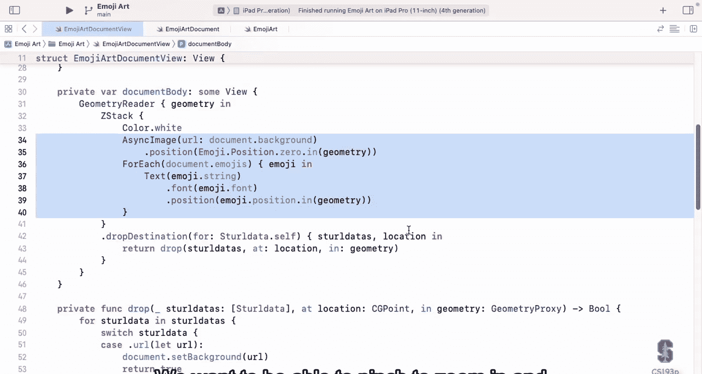
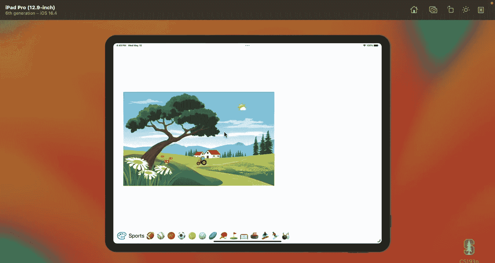
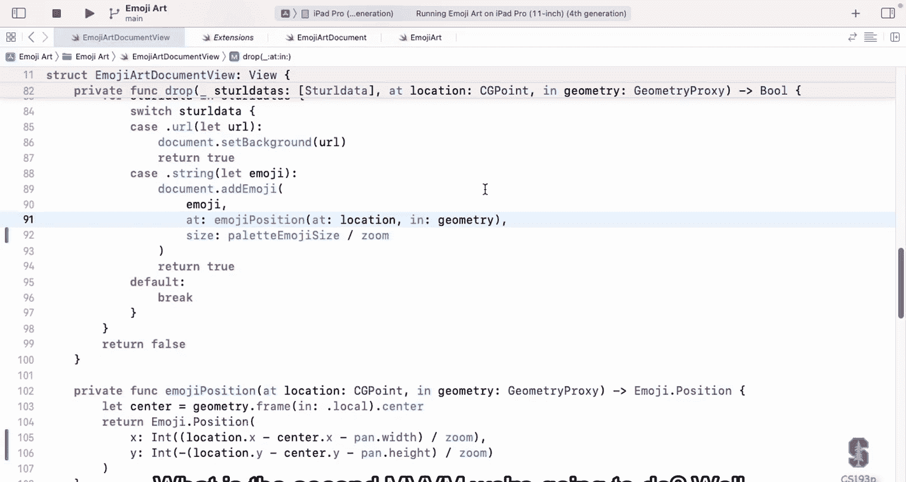
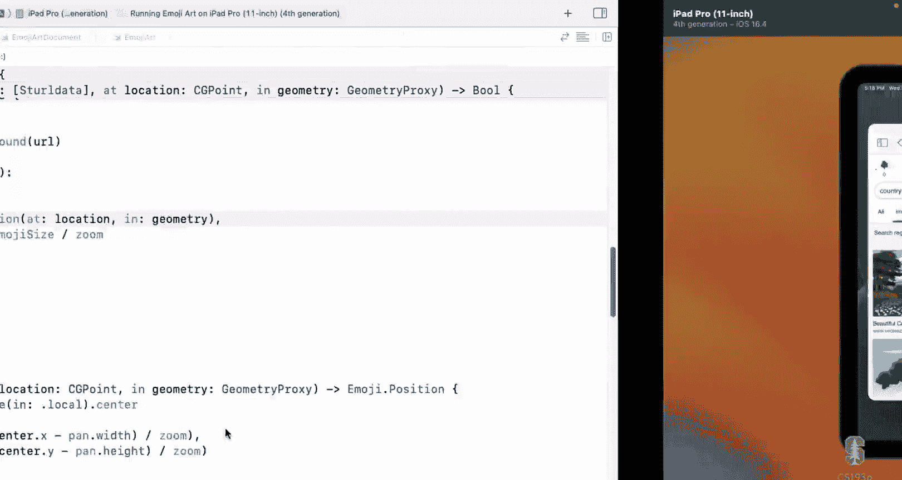
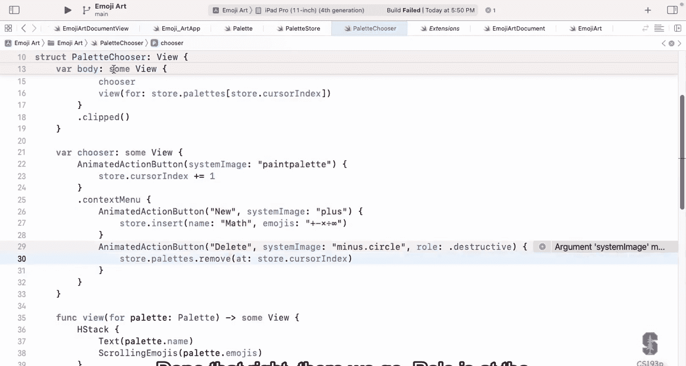

# 011：手势与多视图模型

在本节课中，我们将学习如何在SwiftUI应用中处理复杂的手势（如缩放和拖拽），并探索如何在一个应用中使用多个视图模型（MVVM）来组织代码。我们将以EmojiArt应用为例，实现文档的缩放与平移功能，并添加一个独立的调色板选择器。

## 手势处理概述

上一节我们介绍了拖放功能。本节中，我们来看看如何通过手势与用户进行更丰富的交互。SwiftUI内置了强大的手势识别系统，可以识别常见的多点触控手势，如捏合、拖拽、旋转等。我们的任务不是识别这些手势，而是编写代码来响应这些手势。

### 添加手势识别器

要为视图添加手势识别，需要使用 `.gesture` 视图修饰符。传递给它的参数必须遵循 `Gesture` 协议，通常我们会使用Apple提供的预定义手势。

以下是如何创建一个手势的示例：

```swift
private var zoomGesture: some Gesture {
    MagnificationGesture()
        .onEnded { value in
            // 手势结束时执行的代码
        }
}
```

### 离散与非离散手势

手势分为两类：离散手势和非离散手势。

*   **离散手势**：如点击（`TapGesture`）和长按（`LongPressGesture`）。它们瞬间发生，我们通常只在手势结束时进行处理。
*   **非离散手势**：如拖拽（`DragGesture`）、缩放（`MagnificationGesture`）和旋转（`RotationGesture`）。它们持续一段时间，我们需要在手势进行中持续更新UI以提供即时反馈。

处理离散手势非常简单，只需使用 `.onEnded` 闭包。而对于非离散手势，我们需要更复杂的机制来跟踪手势过程中的状态变化。

### 处理非离散手势

处理非离散手势的核心是使用 `@GestureState` 属性包装器。它专门用于存储手势进行期间的临时状态。

以下是处理缩放手势的关键步骤：



1.  **定义手势状态**：使用 `@GestureState` 声明一个变量来存储手势过程中的缩放比例。
    ```swift
    @GestureState private var gestureZoom: CGFloat = 1.0
    ```



2.  **更新手势状态**：使用 `.updating` 修饰符，在手势进行中不断更新 `gestureZoom`。
    ```swift
    .updating($gestureZoom) { value, gestureState, _ in
        gestureState = value
    }
    ```
    *   `value`：手势的当前值（例如，缩放比例）。
    *   `gestureState`：需要更新的 `@GestureState` 变量。
    *   注意：**只能在 `.updating` 闭包中修改 `@GestureState` 变量**。

3.  **应用手势状态到视图**：在视图的修饰符中，结合使用永久状态（如 `@State private var zoom: CGFloat = 1.0`）和手势状态。
    ```swift
    .scaleEffect(zoom * gestureZoom)
    ```

4.  **更新永久状态**：在手势结束时（`.onEnded`），根据最终的手势值更新应用的永久状态（`@State` 或模型数据）。
    ```swift
    .onEnded { value in
        zoom *= value
    }
    ```

**总结处理流程**：`.updating` 用于更新临时的 `@GestureState`；`.onEnded` 用于更新永久的 `@State` 或模型；视图绘制时同时依赖这两种状态。

### 同时识别多个手势

有时需要让一个视图同时响应多种手势（例如，既能缩放又能平移）。可以使用 `.simultaneously` 方法将多个手势组合起来。

```swift
.gesture(panGesture.simultaneously(with: zoomGesture))
```

## 在EmojiArt中实现缩放与平移

现在，我们将上述概念应用到EmojiArt项目中，为文档内容添加缩放和平移功能。

### 第一步：提取文档内容并添加状态

首先，我们将文档内容（背景和表情符号）提取到一个独立的视图 `documentContents` 中。然后，声明两个 `@State` 变量来存储缩放比例和平移偏移量。

```swift
@State private var zoom: CGFloat = 1.0
@State private var pan: CGOffset = .zero // CGOffset 是 CGSize 的别名
```

### 第二步：应用变换

在 `documentContents` 视图上应用 `.scaleEffect` 和 `.offset` 修饰符，使其能够根据 `zoom` 和 `pan` 状态进行变换。

```swift
.scaleEffect(zoom)
.offset(pan)
```

### 第三步：创建缩放手势

创建一个 `MagnificationGesture`，并实现 `.updating` 和 `.onEnded` 逻辑。

```swift
@GestureState private var gestureZoom: CGFloat = 1.0

private var zoomGesture: some Gesture {
    MagnificationGesture()
        .updating($gestureZoom) { value, gestureState, _ in
            gestureState = value
        }
        .onEnded { value in
            zoom *= value
        }
}
```

在视图的 `.scaleEffect` 中，结合使用 `zoom` 和 `gestureZoom`：
```swift
.scaleEffect(zoom * gestureZoom)
```

### 第四步：创建平移手势

类似地，创建一个 `DragGesture` 来处理平移。





```swift
@GestureState private var gesturePan: CGOffset = .zero

private var panGesture: some Gesture {
    DragGesture()
        .updating($gesturePan) { value, gestureState, _ in
            gestureState = value.translation
        }
        .onEnded { value in
            pan += value.translation
        }
}
```

在视图的 `.offset` 中，结合使用 `pan` 和 `gesturePan`：
```swift
.offset(pan + gesturePan)
```

### 第五步：组合手势并应用

将缩放和平移手势组合，并应用到包含 `documentContents` 的容器视图上。

```swift
.gesture(panGesture.simultaneously(with: zoomGesture))
```

### 第六步：调整坐标转换

由于视图现在可以缩放和平移，之前添加表情符号时使用的坐标转换逻辑需要更新，以考虑当前的 `zoom` 和 `pan` 值，确保表情符号被放置在正确的位置和大小。

## 引入第二个MVVM：调色板管理器

一个真实的应用通常由多个功能模块组成，每个模块都可以拥有自己的视图模型（MVVM）。接下来，我们为EmojiArt添加一个调色板选择器，它将作为一个独立的MVVM模块。

### 模型：Palette

首先定义数据模型 `Palette`，它代表一个命名的表情符号集合。

```swift
struct Palette: Identifiable {
    let id: UUID
    var name: String
    var emojis: String
}
```

### 视图模型：PaletteStore

创建 `PaletteStore` 作为视图模型。它负责管理一组 `Palette` 对象，并处理相关的业务逻辑，例如确保始终至少有一个调色板、提供游标索引等。

```swift
class PaletteStore: ObservableObject {
    @Published var palettes: [Palette]
    private var _cursorIndex = 0

    var cursorIndex: Int {
        get { boundsCheckedPaletteIndex(_cursorIndex) }
        set { _cursorIndex = boundsCheckedPaletteIndex(newValue) }
    }

    private func boundsCheckedPaletteIndex(_ index: Int) -> Int {
        // 确保索引在有效范围内
    }

    // 其他辅助方法：insert, append, delete 等
}
```

### 视图：PaletteChooser

创建 `PaletteChooser` 视图，它使用 `PaletteStore`。这个视图包含一个按钮用于切换调色板，以及一个显示当前调色板内容的区域。

```swift
struct PaletteChooser: View {
    @EnvironmentObject var store: PaletteStore

    var body: some View {
        HStack {
            // 切换按钮
            AnimatedActionButton(systemImage: "paintpalette") {
                store.cursorIndex += 1
            }
            .contextMenu {
                // 上下文菜单：新建、删除
                AnimatedActionButton("New", systemImage: "plus") {
                    store.insert(name: "New", emojis: "")
                }
                AnimatedActionButton("Delete", systemImage: "minus", role: .destructive) {
                    store.palettes.remove(at: store.cursorIndex)
                }
            }

            // 当前调色板显示
            HStack {
                Text(store.palettes[store.cursorIndex].name)
                ScrollingEmojisView(emojis: store.palettes[store.cursorIndex].emojis)
            }
            .id(store.palettes[store.cursorIndex].id) // 通过ID触发视图过渡动画
            .transition(.asymmetric(insertion: .move(edge: .bottom), removal: .move(edge: .top)))
            .clipped()
        }
    }
}
```

### 在应用层级注入共享状态

`PaletteStore` 需要在应用的所有相关部分共享。我们使用 `@StateObject` 在应用的根视图（`EmojiArtApp`）中创建它，并通过 `.environmentObject` 将其注入到视图环境中。

```swift
@main
struct EmojiArtApp: App {
    @StateObject var paletteStore = PaletteStore(name: "Main")

    var body: some Scene {
        WindowGroup {
            EmojiArtDocumentView()
                .environmentObject(paletteStore) // 注入
        }
    }
}
```

在需要使用 `PaletteStore` 的子视图中，使用 `@EnvironmentObject` 来获取它。

```swift
struct PaletteChooser: View {
    @EnvironmentObject var store: PaletteStore // 获取
    // ...
}
```

## 总结

本节课中我们一起学习了两个核心主题。

首先，我们深入探讨了SwiftUI中非离散手势的处理机制。关键在于理解 `@GestureState` 的用途：它作为手势过程中的临时状态存储，通过 `.updating` 修饰符进行更新，并在手势结束时将结果同步到永久的 `@State` 或模型数据中。我们还学习了如何使用 `.simultaneously` 让视图同时响应多个手势。



其次，我们实践了在单个应用中构建多个MVVM模块。通过创建独立的 `Palette` 模型、`PaletteStore` 视图模型和 `PaletteChooser` 视图，我们实现了一个功能完整的调色板管理器。更重要的是，我们学会了如何使用 `@StateObject` 和 `@EnvironmentObject` 在应用顶层创建和共享视图模型，使其能够被整个视图层次结构方便地访问。

这些技能是构建复杂、模块化SwiftUI应用的基础。在接下来的课程中，我们将继续探索更多UI组件和数据处理技术。