# 斯坦福大学《SwiftUI的iOS应用开发｜CS193p Developing Applications for iOS using SwiftUI 2023》 p02 -02-Lecture 2 _ Stanford CS193p 2023.zh_en -BV1HyzNYdEiD_p2-

I like to start my lectures sometimes by looking back at the last lecture and doing all the things I forgot because you see how these lectures go there's a lot to cover and sometimes I'll just go over something quickly so I like to start and go back。

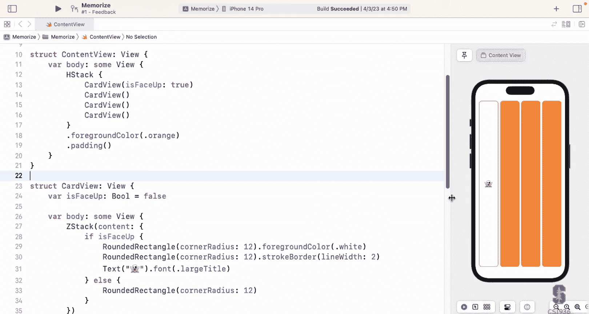

One thing I want to clarify a little bit is this whole deal about the inspector remember I told you you can go into select mode down here and then you can select things。

A coupleuple of things about it One， I talked about why is this valuable if you know how to code。

 why would you even want this and I use the examples of localizers for your user interface to designers who might not be coders。

 that doesn't mean it's not totally of value to you as well it might be good for like fine tuning and one thing to note about this I don't think I mentioned this is that the selection works all the way across so if I click in here see it's selected that line of code that was this thing I selected and it also selected here in other words it's not just the case that you selected over here and it's like if you selecting either of the two it selects the other one So I wanted you to understand that and then you know as a programmer why you want this is you might want to be fiddling around with the color or some of the padding or something like that without having to be constantly typing and editing your source code kind of depends on what you like me I love editing source code you kind of blows out of my brain so I like being in the code but some people might want to click buttons。

I just didn't want to undersell the inspector and the selecting mode here。

 it can be kind of interesting and valuable so that was one thing I wanted to go back to。

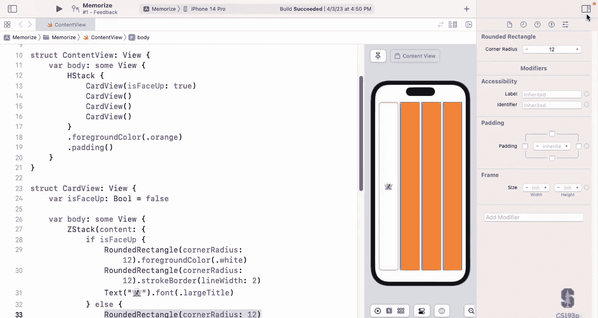

Another thing I wanted to mention when we brought out the navigator and we went to the files area here。

 I said， look there's three files， memorize app content view and assets。

 well there's actually another thing you can click on here which is sort of a file which is your project settings that top thing this is a settings it's like what destinations here I'm building i iPad and Mac design for iPad and what I'm deploying it to i 16。

4 and you can see that they're signing in capabilities that's where you deal with your Apple ID connection and all that so there is project settings here you don't need to go here much I' almost never going to reference this but just so you know there's a lot of stuff going on there you can feel free to browse through all these tabs and see what this does Xcode is a very powerful build engine for building multiple things that have dependencies frameworks and apps all depending on each other so it has a lot of functionality in here for managing that kind of complexity。

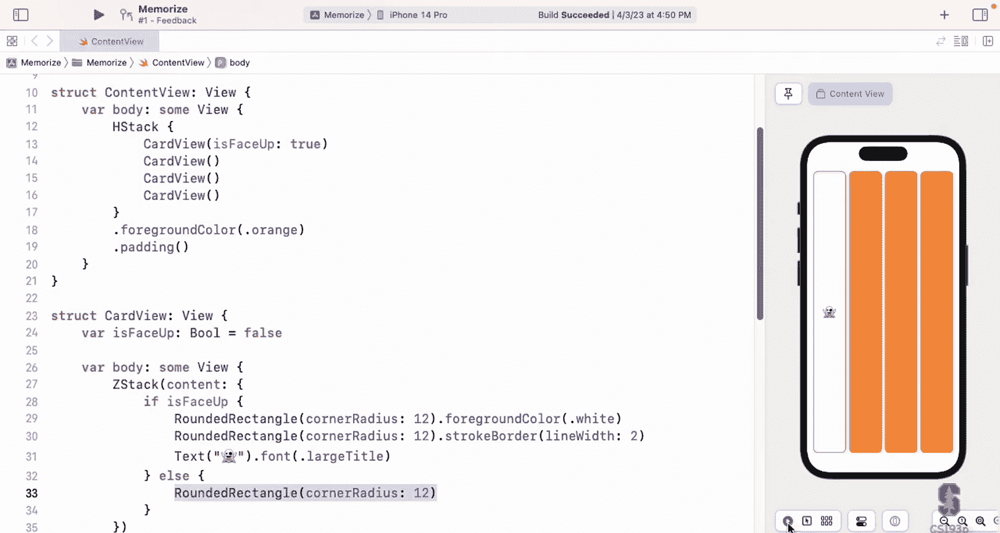

Another thing I wanted to mention is that this colon view。

 which all of you now should be very comfortable with the phrase it means that content view behaves like a view this is again nothing to do with objectian programming0% that is not it superclass or something there's no superclass in functional programming that's an objectian programming that colon view means this structure behaves like a view and we're going to expand on what it means to behave like something a lot in the coming the next couple weeks actually。

 but I just wanted to emphasize that。

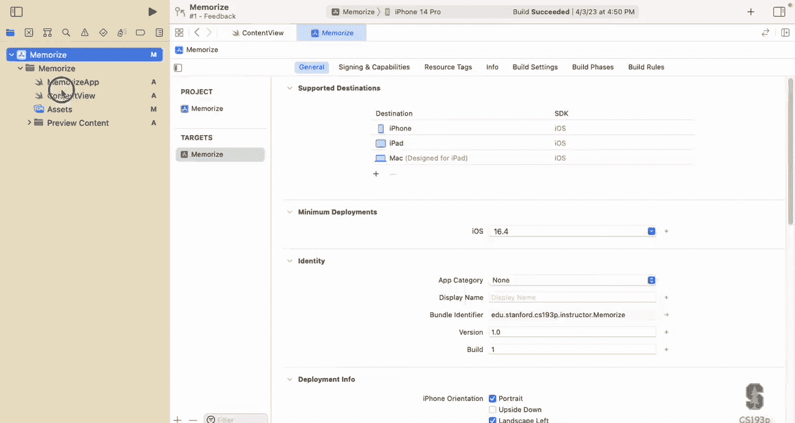

One other thing I wanted to show just emphasize a little bit about how some view works。

 I have a nice little demo， so I'm going to。Take this out of here for a second and just make it so that our body is just a text that says hello all right。

 and so you understand this it's got the hello， you understand that that sub view that some view there is what。

 what type is this， this is the type text。Because it looked inside the curly braces it saw there was a text in there and it said that's it so notice that I changed that to text it compiles it's right。

 some view is a way to get the compiler to help you but it's still basically doing this and if I were to put something else in here there's not a text like oh be stack that had this text thing and maybe another text thing hello there put this down here now the compiler is going to complain。

Because that computed。Little code there， the computes the value of that property is not of type text。

 so now you have a mismatch and in fact， if you look at the error there in detail。

It's very illustrative， it says I cannot convert the return expression of type VStack。

 Tple view text and text to return type text。Notice how complicated the type is。

That is returned here this actually being returned here。

 Vt tuple view text and text I told you that the vtax's little bag alego was called a tuple view。

 you can see it right there and specifically it's a tuupple view that has two texts in it。

 All of that is kind of encoded into the type for that vt expression that's why we need some view because it will be a pain in the neck if we had to know all this detail。

 good news is you don't need to know any of this In fact in this course you will never type tuple view。

 that's something that the viewbuer mechanism does behind the scenems for you that's something you have to know about or type or ever access completely done for you。

 and that's why we have this really wonderful some view thing which will look in there and compiles it works fine you see it figures out there at the vtac tuple view of2 text just want to make sure we understand that a little more So let me back back to where we were our stuff there it is and oh another big thing I forgot I forgot this committed。

To Github I've been watching you， most of you， more than half of you have already done all of this but for the half of you who haven't we've been making a ton of code changes here I'm just gonna to go to source control and commit to commit these changes to my repository and you can see that along this puts this nice window up is going to show you every change you make now here there's a ton of changes all the files are on the left that's because this is my initial commit I haven't committed anything so everything has changed right my whole project is new but I still always want to put a comment in fact it won't let you commit without putting a comment here so what would be my comment well I would say this is my initial commit for one thing but I'm also going to put in something that reminds me what was this commit about if I had remembered to do this last time I would have said this was this commit was ready to start doing memorized and I would have committed it before we started but we actually started we made some cards so now I'm going to say that this commit includes the creation of。

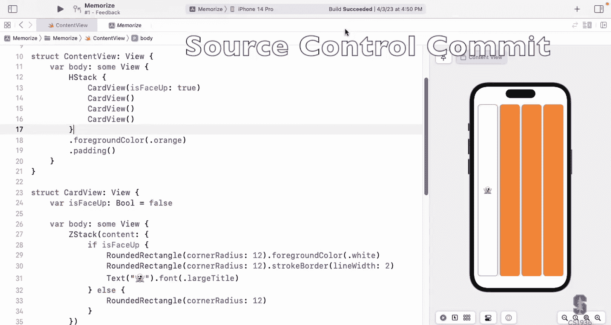

Card view and we did is face up for the card view。 So I'm just putting things in here just so I can quickly remember what was that commit Now I can commit here。

 just commit these 11 files， all my files。 basically。

 notice that I can also push to my remote all in one step if I want to。

 but I'm going to do this in two steps here I do my commit。

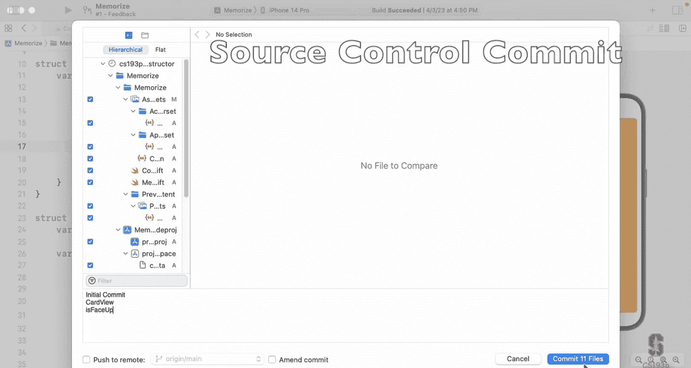

It's committed now when I want to submit my assignment because that's what you're going to do。

 I'm just gonna to go source control push and because I created this project inside that repository that I cloned it sees that up there that origin main make sure you always push to origin main never to origin feedback I'm gonna show you what that origin feedback branch is in a second and worry about the tags we're not going be doing that and just push so it pushes it up there it's connecting here to GitHub if I now go to GitHub I would see the thing I just pushed you could actually be able to see the files that are there and then the next time we push and hopefully I'll remember to push again somewhere in the middle of this demo we'll be able to see the diffs and you can see the diffs in Excode before you submit and when you go to GitHub。

 you'll see the dis what you may be that's really kind of cool especially if you remember to do it。

 which I did not。

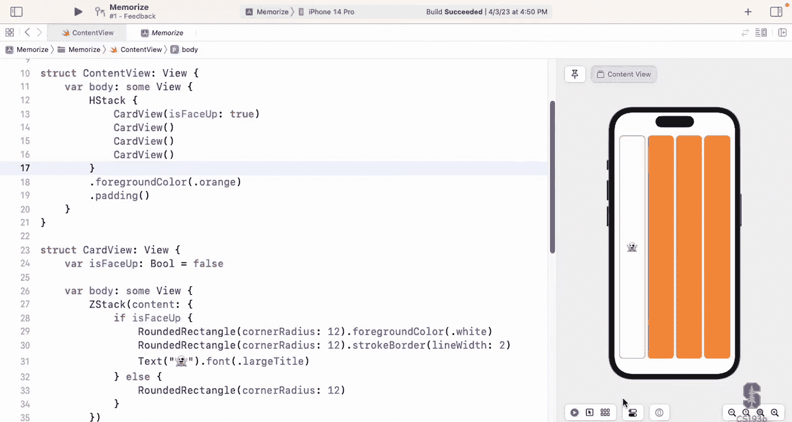

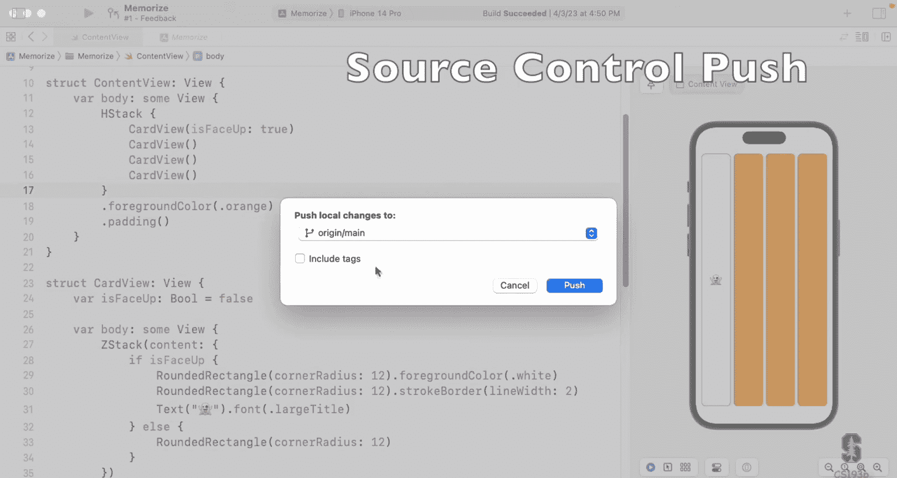

Now that feedback branch， if you look right up here， the top there you see it says feedback。

 if you click on that there's a pull request and the pull request you can click on it here and it's essentially going to pull this stuff from this branch this feedback branch on GitHub and you can actually look at this this is your grading feedback So when your T is grade it will start appearing here So anytime you want to look at that you just go up there to that number one feedback and it'll go to this it becomes a tab you see it along the top so you can go back between your code and the feedback you got it's really kind of cool。

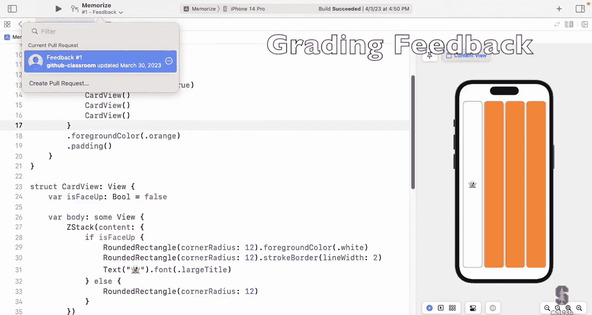

Right so that's the Github integration not a lot more to say about that This is the first time we've done this it looks like it's working really well I think I have one person say I couldn't call them the repository one thing also once you start committing along here is we start making changes if we edit our code you'll see it says M over there for modified or if you add a file it'll say a you added a file so you can kind of see what you' we're doing。

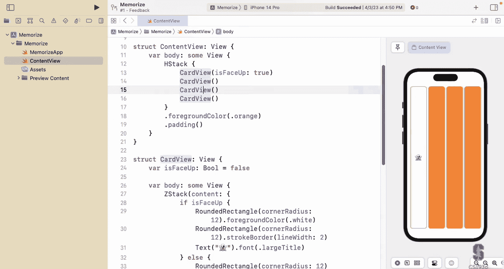

The first thing I wanted to talk about is something we introduced last time。

 I'll write it up here again， this is the trailingclo syntax and that is this thing right here。

We had this ZStack and it has an argument there content which takes a bag of Lego and it ranges it and it even has some conditional in there。

 depending on whether's spaced up or not， it kind of does a little different list of views and we also will remember hopefully that ZStack could have other arguments like alignment got top look our ghost he's now alignedd to the top。

 they're still stacked on each other， but the ghost is up at the top this is just two arguments to the ZStack creator ZStack is just astruct behaves like a view。

 it has two arguments If the last argument to any creation thing or to a function。

Is a function itself like this cur brace。 remember this bag a Lego thing is actually a function that returns a view。

 one of those twofold views or something like that， a collection view。

 If the last argument is a function， then you can do this thing where you get rid of its label if it has one。

 which they usually would in that case， close it off and let the。

Function essentially hanging off the end it's just kind of hanging off the end there that's called trailing closure syntax because this function is called the closure we're going talk all about that these in line functions we call them closures and it's trailing it's at the end so it can hang out there right so that's why it looks like that and then we went along and said well we don't want the alignment at the top we want the alignment to be in the center and this alignment center。

 which is what we want just happens to be the default just like face up here it's default is false the alignment thing in ZStac it's one is center so I didn't need it。

This is fine compiling， everything's good。 And then I went one step further， and I deleted。

Those parentheses。 Now， that step I can only do if I have a trailing closer syntax。

You can't delete empty parentheses of a function call or a creation of a struct unless you've got a trade enclosure syntax。

 just want to make that clear。While we're down here， by the way， I also want to talk about fill。

 you see this rounded rectangle， it seems to just be sitting there and it's the back so we know that it just does a fill。

 this is really kind of doing this dot fill just like we have dot stroke border is causing this rectangle to have its edges stroked fill means it's filling It's just that this is the default If you don't tell a shape to either fill or stroke it will fill that's just default and fill is kind of nice。

 it also will take what to fill it with in this case I'm filling it with the color white that's our little background there。

Now I want to go back to where we were when we left off。

 we had just added this is face up thing here， and we gave it a default value。

 and I just want to emphasize that if I took this default value off。

I get all these complaints up here right and that's because I told you that if you have a var in a struct any struct。

 not a struct that behaves like a view， any struct。

 if it has a var that has no value that's not allowed so if you want to create this struct you have to provide this value that's why the top line doesn't complain it's providing it the other lines are complaining because you're trying to create astruct that' has a variable that's never had its value set。

Everyone understand what's happening there， and if I go and copy this is space up true。

And put it in these other ones， they'll stop complaining。

So I just want to be clear that's why we are providing that argument we're setting this variable that has to be set and then we went to the step of saying。

 okay， but you know most of the time we want this thing to be， let's say true。

 we want the card to be face up by default that allows us to take this out and still have that card to be face up because it's defaulting。

Let's talk a little bit more about the bag of Lego that we're passing to this ZStAC to make our cards。

There's we know that we can do lists of views in here and we can do these conditionals in this weird viewbuder bag of Lego world。

 there's one other thing we can do， which is we can do local variables so I could say bar base for example。

 of rounded rectangle type。Eals this rounded rectangle that we use three times。

 this is really bad because this is you know replicated codes I'm going to put this up here。

 and instead of having this， I'm just going to replace it with that variable。Three times I use it。

You see what I've done here， created a little local variable now you might be like， oh no。

 that's a view but views are juststruct， this could be an int and you wouldn't be so freaked out by this int is just astruct。

Bunded rectangle， which happens to be a view and a shape， it's actually a couple other things。

 It's still just a struct so there's no reason I can't create it here。

 I could also say var I colon an int equals1 that's perfectly legal so I can create these local variables。

 However I cannot go so far as to say var x is an int equals1 and x equals x plus1 now I'm gone too far this kind of code can't be in a view builder the view builder only knows how to do the ifs the list and the variable assignments right there that's all I can do。

It can do some other conditional type things， there's a switch statement which is like an if with multiple cases。

 it can do that as well， but essentially conditionals， lists and local variables。That's all I can do。

 so let's take this back out of there because that's bad。Now。

 this gives me a great opportunity to talk about another syntactical thing。

 which is that we would never say var base of type rounded rectangle equals that， we would say let。

This keyword exactly like var， except for this thing will never change so let means this is a constant we don't use var because it can't vary right very variable means it varies。

😡，And it reads nicely， it let base equal this rounded rectangle and it's a constant it will never change and that's true we never do change base。

 we you know create other views off of it by sending the modifiers but we never actually change it and we can't change it because I just told you views are read only so we couldn't change it anyway。

 but inside of a view builder he would always be using let because nothing in there can change you can't have variables those values are change。

 you can't say x equals x plus one。You might say， oh， can we do the same thing up here。

 let is space up because we don't change it is a space up in here， but this is not going to work。

Because if you say L is face up will equal true， then you're saying is face up is true and it's always true so now the guys up top trying to call it and say。

 oh yeah， please create me a card view that starts up face down。

They can't do it because the is face up is a constant， can't be changed。

If we said we didn't want to have a default here， then we could have it be a let。

Because then the one and only time it gets set， its constant value is what the person pass in。

 but again， now we're in the problem where you have to pass it in in that case。

If you want to be able to say equals false。Or equals true this has to be a var and the reason it has to be a var is it actually is going to vary it's the one time you can actually change something in a view is it darts out with its default value。

 but then it can be changed when it's created but that's it can't change after that so that's why we make it a var。

Other times we just make the decision between let and Var by whether we're going to change the thing and if you want some advice。

 always start out with let and the compiler will complain if you try to change it。

 think of let as really the way you defined variables Varr is more like marking something that you are going to change and it's great because when you're reading someone's code you can tell they're going to go change this thing somewhere in this code versus this is just a constant essentially。

Now let's talk about another cool syntax thing here which is this line of code。

 it's kind of annoying rounded rectangles， rounded rectangle-， I have say rounded rectangle twice。

 why would I have to do that well I don't have to do that I can just go here and get rid of that。

Now this is called type inference in Swift， I'll select this line for。

Recording and what's happening here is that Swift knows you've set this thing to a rounded rectangle so we will infer that the type must be rounded rectangle and in fact。

 if you hold down option and click on a variable like base it'll tell you what it inferred from what the code says and look at that it says base is a rounded rectangle and it is and we almost always let Swt infer as opposed to explicitly putting the type why do we do that well what if I decided you know what I've decided I want my game to have circles as the background which is kind of cool actually looks kind of fun。

All I had to do was change that round a re to circle。

 I didn't have to change it twice round a rectangle， round regular circle， circle one time。

Swift is what's called a extremely strongly typed language Swift knows all the types at compile time in your entire code basically so since it's so strongly typed。

 it can really tell you if you're messing up and trying to pass the wrong kind of type variable to the wrong function or whatevers very strongly typed well very strongly type languages can be very annoying if you have to constantly expressing types and for those of you who knows languages that are very weakly typed Java script for example。

 you're just setting variables to anything you want in passing them off to functions and if it's not working。

 it's just not work that works maybe if you have a lightweight kind of thing， but in a serious app。

 you want some provability， you want to make sure that your app is actually doing what you want to do what Swift does as a trade off for being so strongly typed to make your life easier is it does enormous type inference every time you think it could figure out what you mean。

It will。We are rarely going to be specifying types the times we specify types are mostly the types of Rs we're going to express this type because we want the competitor to type check what's returned here against this also the arguments to functions right when we have a function we're going to be very clear about what types the arguments are but when we have local variables and top we don't do it in fact even right here look at this is face up bo na。

is face up equals false， false can only be a bo that's only struck that can have that value。

 so it knows is' face up and if I do option click， it says， oh yes， it' face up， that's a bo。

Let's go back to rounded rectangle here。We can leave that off though。

Next thing we're going to do is make it so we can tap on these cards and flip them over。

RightObviously thing we want to be able to do This turned out to be incredibly easy and swift as you might imagine because when you build a user interface if you're tapping on things all the time。

 how do we do this we do it with a viewmodifier and I'm going to put this viewmodifier on this Z stackack which means if I tap anywhere on this card face up face down anywhere typing on this z stack it's going to do something and the name of the viewmodifier here is called on tapap gesture。

And basically looks like this， put it on line by itself here。

But I'm sending it to that ZStack now this on tab gesture takes a function to execute when someone taps on this view。

 this really looks like this， of course， I think it's called perform call。With this。

That's really what this looks like but I'm just using trailing closure syntax right here that trailing closure syntax works with everything not juststructs of their views anytime。

 so I don't have to have that on there it also has other arguments like count colon2 that's a double tap to two taps would cause this to happen。

This little function right here， this closure that gets executed when I tap on it is not a view builder it's normal code。

 I could say x equals x is one in here， it's just absolutely normal code I can do anything I want in here actually it's just like it's calling a function in fact it is calling a function it's just the functions in line right here into the middle of my code。

😡，So what am I going to do here， Well， first thing I'm going to do， I'm going to have it print。

Brint tapped。On this thing。Let's do it， right， I'm going to go over here and tap。

I doesn't seem to have done anything I don't see anything happening well that tap is coming out down here I told you pull this thing up here now let me warn you that what I just did only works if you are running at least Xcode version 14。

3 which came out last Friday。so this is really cool just installed feature and what this feature lets you do is see down here it says previews and executable at the bottom。

 you can actually click previews and tapping in your live preview will cause things to happen on the console if you use this function print。

In the old days， meaning before last Friday， this wouldn't be here。

 it would be as if this executable were clicked and the only way to get the print to print on the console。

The only really realistic way you had to run the simulator。

 which is kind of annoying to have to go off to that simulator when I got a preview right here。

I really encourage all of you to get up to 14。3 because this is gonna to be really valuable debugging feature for you One thing about this declarative user interface can be a little hard to debug sometimes because you're used to imperative code where you're kind of going through a sequence of events and you want to set a break point see what happens and move on whereas here you're just kind of declaring that these things are the way they are so being able to put prints in there is nice where you can see things being created put a print in a creation method or something like that as they're going along kind of verified that this is being declared in the way that you expected to be so print statements are your friend especially for the first three or four weeks of this quarter really focus on print as a really great way to debug what's going on print out what's happening and with 14。

3 you can do it in your previous。All right， so that's good。

 we know that this on tap gesture is working， I clicked on it， it said tapped。

 now we want to flip the card over， so let's put that in here。Is face up equals not is face up。

Does everyone agree that would flip this card over， saying this play buzz， oh oh no？

Cannot assign property， self is immutable。Well I promised I told you this is way it's going to be this view is the view itself。

 it's immutable， can't be changed so we can't changed and even though that is face up it says it's a var that varness is only at the very beginning like I said so now what are we gonna do we're really in trouble because I really want to flip this over well first of all let me tell you the real answer。

 the real answer is R backend our game logic is the thing that's gonna to flip cards over but we don't have our game logic so how do we want to do it well what we're gonna to do is a little trick that you can do in view strucks if you have state that you do want to have change but it's only for temporary state like if you're in the middle of an animation you want to keep track of the beginning or the end of the animation or something like that it's not for storing the state of your game you never would put this in this mechanism I'm showing you。

And the way you do it is you find the var that you want to be able to be changed and you put at sign state in front of it。

So this is only for small things kind of like this， just flipping the card over。

Now some might want to know what is that actually doing up there at Sign State and I'll tell you you can ignore what I'm about to say if it bothers you you don't really need to know know about it。

 it's creating a pointer is face up there that at sign state is actually creating a pointer to a little piece of memory where it keeps is face up so now the pointer never changes the pointer itself the thing it points to can change but the pointer never changes so it satisfies that thing where the view can't change but is face up can be changed so that's what's going on there again I'm really emphasizing our real state about whether cards are face up is going to be in our game logic so we're not going to use it we're going to be getting rid of this atign state next week when we have some game logic。

So let's see if it works， I'm going to tap on some of these and I it， who。

 look at that works perfectly。All that is doing is just changing that is face up there in the card view by the way。

 one thing that takes them getting used to too is you're used to other language。

 things like bulls and ints and strings are like these fundamental types。This。

It is face up like almost everything you see is a struct so it can have functions on it， for example。

 bo has a function called toggle toggle changes the value of it from true to false false to true back and forth so this is how we would write this is face up to toggle the other way is fine too but we would call this function on a bo to do it because it's a struct。

All right， so I'm actually going to write up here， views are immutable。

Thing that's changing about views， you know their body can be changing and being called and re-evaluate all the time。

 but the views themselves the bars in the view themselves are immutable and that leads to the other thing I'm going to put here which is at sign state and I'm even going to put temporary state date that has to do with just kind of displaying not about our actual app and what's going on。

Let's go and commit here。 Let's commit。 I want to show you this let's source control commit Now when we commit here。

 you can see the list of our files on the left， only a couple of them has changed only one of them actually some code And look at this it's really nice shows you all the changes you've actually made here and what did we do here where we added toggable。

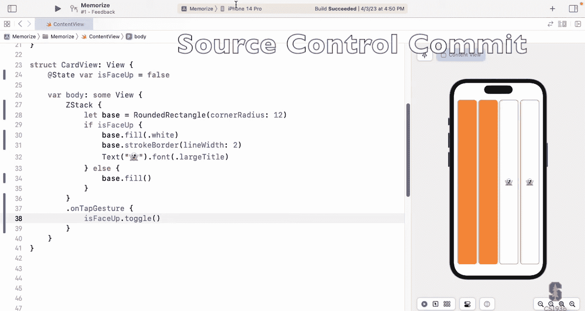

Is face up， That's the main thing we added here。 I'm going to go ahead and commit that。

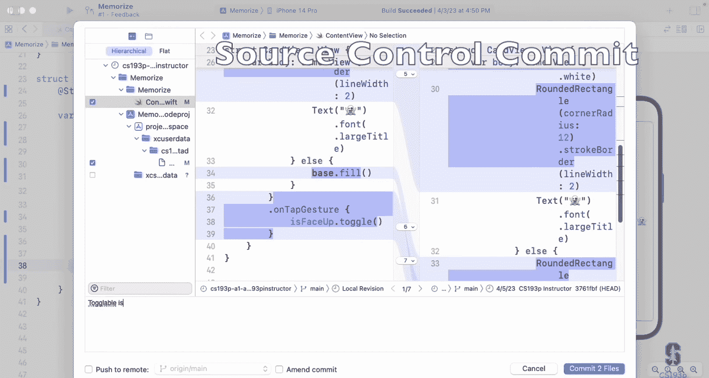

Now over here it's cleared， it'll have cleared the M's off of here and I still haven't submitted my homework assignment。

 I just committed it to the repository locally okay that's what commit does we're going to push our homework assignment at the end of this lecture。

Our app is really coming together here。 We have these very tall thin cards， not what we want。

 but its close it's getting there。 Unfortunately， they're all ghosts。

 So this is a really easy game because all four of the cards all match each other。

 So we need to be able to have different things on there than ghosts。 So how we're going do that。

 Well， there's just really no way around the fact that we need to tell our card view to draw something other than a ghost right now。

 it draws the because of this right here。I really want to pass it along as an argument。

 So Im want to do something like content。Is a ghost。 Put the ghost up there。

Like that and then have it use that content in here。

So hopefully everybody instantly sees exactly how we would do that。 right。

 We're just going to have a。Far here called content it's a string there's absolutely no reasonable default for the content we have to know what it is you can't have the default be a ghost right cards that don't say what on them have get a ghost no so makes no sense so we're not going to have a default there because there's no default this wants to be a let。

It can't be changed， so it has to be a let and then up here content is working， it's already working。

 and then we'll use this content let instead of our ghost right here， so content。

For all of our cards， we can just。Give them each different content。

Could be getting rid of this this face up here if we wanted to。

 but hold onto to it for a second I'm going to change this This ghost is kind of a Halloween thing you saw my theme I built over there of these cards these are Halloween things so let's go get some more Halloween things from edit emoji symbols here I got some queued up here there's a pumpkin。

we got how about a spider。And then saw there was a demon there。 He was that demon。

Let's look over here and look at all our cards。嗯。We probably don't want this ghost and the pumpkin and the spider as literals string literals in there。

 it'd be kind of cool to have an array of them right and then get the things out of an array so how do we create an array in Swif very important obviously to be able to create arrays and we do it like this let emojis equal now again I'm inside this htax view builder so I'm the allowed to do variables。

 but they're lets even though I can use type inference print I'm still going to say this is an array of string。

I'm going to set it equal to a literal array， this is how you do a literal array here。

 open square brackets and then the things just listed in there。

 let's look at that type though first array of string array is the array type。

 the angle bracket string you're probably used to this from Java is because array is a generic type。

Aray can have anything in it， an array of anything。

 but you have to say what it is that's in it when you create the array So here I'm declaring that emojis a little local variable here is an array and there are strengths in it we are going to build our own generic type believe it or not in next lecture doing these kind of generic types really important really fundamental part to doing swifts so we're going to do it in our very next lecture and that'll demystify this I know for a lot of people lot students I talk to in Java they don't really quite understand what's going on here。

 they just accept it oh yes array I have to parameterize what's in the array find but we're going to show next we exactly how this really works So now this is an array literal meaning kind of an actual array and so I'm going to put these guys up inside here。

Make myself an array of these emoji strings。And now that I have an array。

 I can use it to set each of these things。 For example， I can make this guy P emojis sub0。

 This is how you index into an array。 you might imagine square brackets， emojis。Someone。

A little easier on myself by copying and pasting here and if I tried to do emoji sub。

4 what would happen crash this is crashing my preview and that's what this means memorize quit unexpectedly over here understandably and you can see why see where it says cannot preview in this file index out of range clearly there are only four things in that array so if you go for index four that's past the end of the array and that would happen in your app as well Array index out of bounds is a crasher in Swift don't do it。

Now， this emojis var that I created here， it can live here inside this viewBuilder。

Or it can also live up here at the top of this var as just a local variable inside that computed property and of course it could also live up here as a var or a let if you want to call it that in our content view so you can scope it where you want and normally you would put things close to where they're used。

 that's just good programming style， you know but something fundamental like this array of emojis it's kind of driving our whole thing I might want that at the top level。

Aray of string looks like that， I like to write it that way because it's so clear that my type is array where the type is string。

 but there's another way to do this which is you're going to see a lot。

 which is open square bracket string This is exactly the same it identical it just looks different but it means exactly the same thing and array of string you'll see this a lot again I prefer this way。

 but you can do whichever way you want， it seems to me that the world of Swift prefers this way。

Because for example， if we let Swift infer this， which we of course would get rid of this and let it be inferred。

 if I option click on it， it uses that square bracket string。Notation， you see。

I think that's proof positive that is the preferred way to do it I think the reason I like array of strings is because I'm teaching it to you and it's clearer to see what's happening there that's all。

All right， great， this is working， our still working， yes。

 the things in the array got passed along there。Now let's address this problem that we have this repeated code。

 four lines that look almost exactly the same that are reaching to an array。

 clearly we want a four loop here right， we want a four loop so we can just go through the array one by one and make a card view for it。

 Unfortunately inside of view builder like this Hdac， you can't do four。

I told you you could do those three things conditionals and the lists and the local variables not going to add for to the list for you。

 sorry in fact all the things I told you that's all there is there's no more so how the heck are we going to do this if we can't do a four loop in here。

The way we do a for loop in here is with a special view， it's a special view called a four each。

And it's a bag of Lego view， right the four each。View got views inside of it。

 but they have to be passed to something like a vSt to lay them out on screen so I'm going to create a four each view a four each bag of Lego that's going to have four card views in it just sitting it and the H stack is going to lay them out。

😡，So what does it look like to create a for each view now。

 it's just astructstruct that behaves like a view it's called for each。

Has a lot of different kinds of arguments。 Look at all these different things you can do down here。

 but I'm going to show you this variant of it， which takes an array or any sequence actually of things and I'm going to give it a sequence which is a range0 dot dot less than four which is swift notation for a range of integers that goes from zero up to but not including four and if I wanted up to and including four。

 I would just change this little less than to be a dot so three dots mean up to and including four so there are five things in that range there were four things in this range0。

1，2，3 versus0，1，2，34 so I give that now the second argument here to4 each。

I'm just going to type it and I'm going to ask you to trust me， not going to tell you what it is。

 we're going to go into it， believe me I'll explain what this is。

 but for now if we're going to do a range like this， you're going to put this ID self。

just I hate to do this to you I know as your like please tell me what is that but I need to explain some other things first before I can really explain what this is and I'll get to it next week I'll get to it but we're not going to do it now for each also has a view builder as an argument this view builder is going to have the view for each of these four things by the way this is a range it could be an array and then it would build a view for each of the things in the array right but here I'm going to do the index now normally this is not multiple views in a list although it could be right you could be wanting to build eight views here to each for each of the four things but usually the reason this is a view builders you want the if ends。

That's mostly why this is a view builder， but essentially this for E is saying give me the view you want for each of these things now since you're doing a view in here for each of these。

 you want this for each of them right just like in a for loop right you need a control variable that tells you which one my building right now and that actually comes as an argument right here index in。

This here you have a view builder that actually has an argument to it and that's perfectly fine because a view builder is a function。

 functionss can have a argument to them。 This happens to be a view builder that takes an argument index right there and that index is set to zero it asks you to make a view for zero then it's set to one it's you're asked to make a view for one。

 you see what I'm saying and the for each keeps track of them keeps track of which view goes with zero。

 which group goes with one which view goes with two So our view couldn't be simpler here。

 it's just card view Car view in here and the content instead of emoji sub0。

 it's emoji at that index and we'll let is face up just default for this it's going make。

Four of these cards and they're defaulting down here to face up false I'm going to change that actually so we can see them a little easier I'm going to change that default to true now cards get created default face up。

Here we go and you can see before each it's a bag of Lego and it has created four views one for each of those things in that range that's just as it goes four right so we're not missing not being able to do for loose because it's essentially doing the same thing here and you know we're actually going to find out that because this argument can be an array and because we're probably not going to need this down the road actually for each can be even more powerful than this and do some really cool things especially when it comes to animation and the reason that's important for animation is if these are going to be moving around you need to know which view goes with which thing and that's before each does it keeps track which of01。

23 goes with which of these views so like the array gets reordered it moves the views around in the bag of Lego and that caused the HSt to move them around or more likely a grid。

It's kind of annoying that I'm doing zero to four because I know there's four things in that array What if I added something to the array am I going to have to change that zero to4。

 I'm going to change this range right here by asking the array to give me a range of its indexes so emojis is the array up there and it has a little var called indexes indices and it returns a range that represents it in its indices so we get all four cards and if I added something here like I made two demons。

Then it's going to automatically give me five cards， right following range。Let's commit again。

So where's my source control commit and what we did here is we arrayified。

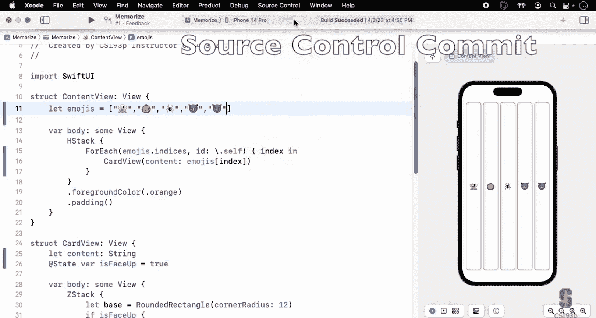

The cards。With for each something like that again we can look at what we did we changed we added that emoji thing we put for each here instead of having four card views we made this default to false。

And we change this to content right so this is nice。 you can before you commit it。

 you can make sure you didn't oh， I didn't mean to do that。 you can also discard these changes。

 you see this， you can click on that thing in the middle and say， oh no。

 actually I didn't mean to do that， undo that。Kind of cool feature so we'll commit that again。

 I haven't submitted my homework yet， I'm just keeping track of my changes。

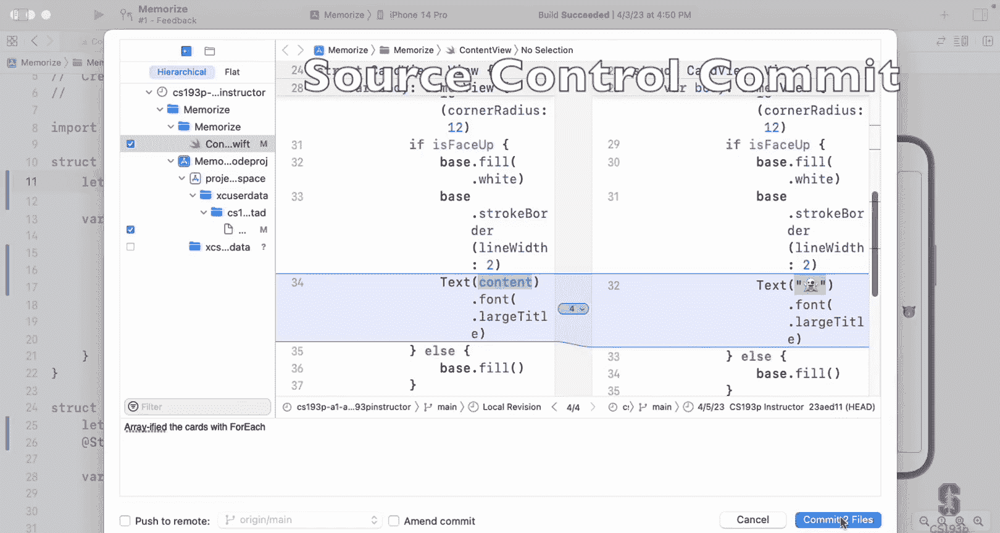

Let's go and talk about buttons you eyes want buttons。

 you kind of are looking at this and thinking well those cards are kind of like buttons right I'm tapping on them and they're flipping over it' kind of like a button。

 but what we're talking about here is buttons that the user perceives as a button in all apps。

In iOS apps， buttons are usually blue text， they look like blue text right no matter what app you're in。

 if you see some blue text， you think you can tap on it and that's generally a button。

 then you can have buttons that have other things。 we're going build a blue image on it So how do we put a button on screen and I picked this because button is the most basic tool you have in your sharedd to start building your UI and we've actually done very sophisticated UI building so far we've built custom views these card these are custom built But now I'm going to show you one that's just built into the system it's called button I'm to put this button in the H stack so that sits right here and what this button is going to do it's going add a card。

I need more cards than this， so I'm going to actually go up here。And I don't usually like to do this。

 but I can't possibly type in all of those things so I actually have a little code snippet here that's adding some more so if you're following along。

 I apologize， you're probably feverishly typing more emojis but we need more emojis because I'm going to have this button make it so that adds and then I'll have another button that remove so we can add and remove cards here。

Before we put the button， we need to have some infrastructure that lets us change how many cards we're showing。

 so I'm going to go away from emojis that indices here and go back to a range0 do do less than。

 but I'm going to have a variable to be how many cards I'm showing so I'm going have a v card count here it's just going to be an int I'll start it out at for sorry normal amount here and then I'm going to add a button that increments that var。

I'm going to put it in the H stackAC for now， it doesn't really belong here。

 but just to keep things simple， I'm going to put it right there。Button。

 you say it's a viewstruct it behaves like a view。 It has a lot of different variants for how to create it。

 As you can see right there。 I'm going to use the one that takes a string like add card。

And it also takes action， I think they call it which is a closure。

 I'm start right off the bat here and use trailing closure syntax for it。

 and this is any code you want to implement， this is like on tap gesture。

 this is the thing that happens when someone touches on it and of course I want a card count plus equals one。

Oh， no。We've seen this one before。Self is not mutable。We can't change card count。

 so how do we fix that？I even heard people saying a good job。 At time state。 Again。

 the number of cards that are up there probably determined by our model。

 we're not going to need this at time state， but it's good for demos here。

 At time stage's really good for demos not really used that much in real code。

 although you'll see there's some good reason for using it。 But anyway， I have our card count here。

 So now hopefully if I touch this ad card。 I get more cards。 look at that。 It's working great。

 super simple。 So buttons couldn't be simpler。 Let's add one for removing cards to。Cantpy and paste。

I told you every time I do copy and paste I think how am we going to do this right and we're going to see how we do this right before the end of this lecture say remove card and this is a minus equals one and so now I've got remove cards and add cards but this is total garbage UI right here we don't want these in the H stack we actually probably one them on the bottom right maybe at the top but we'm going to put them along the bottom。

I want you to take two seconds and imagine how we would do that in your mind。

 Can you picture that because's really， really straightforward。 We're just going to create。A V stack。

That has this h stack of the cards in it。And these buttons。The stack that has the cards in the H。

 and then these guys down here。This works still， I didn't break anything I can still remove cards and add cards。

 but maybe I'd prefer to have these two things be side by side remove card and add card。

 How would I do that again， just throw an H stack right here， stack those two buttons。Horizontally。

 there we go， remove card add card， so you can see that putting these little h stacks and view stacks in is super lightweight you just throw these things in here。

Now there's a couple of problems here with this down here。

 one is these don't look like buttons because they're orange。The buttons are not orange。

 they're like blue or at least the accent color of the app。

Why is that happening Well it's because this orange is being applied to the whole V stackack that includes both Ht so everything in there is getting turned to orange and of course we really want this foreground color orange to only be on this H stack up here where our cards are and sure enough they're orange these things are blue Another problem is remove card add card it's not is this four different buttons or it's very hard for the user to see what is going on here So I want like some space in the middle there how do I give space of course there's a view for that it's called spacer。

And put spacer in there and it uses up all the space in the middle。

One thing I do want to say this is not related to this， but we're here padding。

 someone was asking me last time you know we're putting this padding on this vStack does this padding get applied to everything inside the vStack like foreground color the answer is no because padding is one of the viewmodifiers not many but it's one that makes sense for the VSt itself to be padded but padding around the whole thing so there are some viewmodifiers that you give to one vack or an HStack that actually applied to the vStack itself。

 they don't get passed down in padding is certainly one of them and if you wanted padding passed down to each one of these you'd actually do that with an argument to vStack called spacing I showed this to your last time right VStack parenthees spacing5 that would put extra space or less space between them vertically everyone see how we're building our UI putting things where we want with HStax and VStax notice also that this way of building UI completely independent of a device you're on like。

I've got this thing here， why if I go here and say， well， let's make this be in landscape mode。

And here's my landscape see it's totally laid these out differently right even though this is in landscape the cards aren't tall and they're a little shorter and fatter because landscape allows that。

 but it's still space these things out to the edges。

That's one of the real advantages of building this declaredlarative viewI like this is pretty much going to work on almost any device in any rotation now you might have to tune it because you don't want the car to be tall and thin we'll do some of that tuning soon。

Now， this button string do the action couldn't be simpler， but what if I wanted these to be images？

not text I want to be a nice icon that represents adding and removing cards。 Well to do that。

 I'm going to use a different kind of button creation arguments。

 I'm going to say button and this time the action comes first So there's the closure for the action and then there's another one that takes a closure。

 this time of view builder， which is the label。This closure here is a view builder this one normal code because this is the action I'm going to do card count plus1 plus equals one and the other one is a view builder that's going to be the views that are on the button and this is another thing about Swift UI that's awesome is that buttons could be made any carburarily complex helicopter view if you wanted to because the title of them or whatever you want to call it is a view builder it can be anything we want in here。

I'm going to have the action B。Card count minus equals1。 we're doing the remove one here。

 and I'm going to have the label be an image system name。 We already saw this。With our globe。

 remember we have the globe， and so this actually makes this into a globe right here。

 and I'll get rid of the text。Version of this。And I don' I don't want it to be a globe though I want this to be some other thing that seems like remove card so how do I find that I'm gonna go here and select globe let me do this plus up here。

 you see this plus in the upper right this is the library a lot of stuff in the library it's a great place you're going learn to go to look to find things and here you can see it's already showing me symbols theses all various symbols and there are hundreds of them maybe over a thousand probably but you can also do other things in here like views here's the view like here's button just explain how to use it and if I double clicked here。

 it would actually put that snippet of code that makes a button in there for yeah。

 I wouldn't have had to type it myself what else we got here we'll talk about those things later remember that code snippet I had there with the Halloween extra emojis you can build your own in here images of colors gonna have named colors if your app has particular colors。

And then here are the images Now you can type to search like we want to add something here so I might type add and then I'm looking down here you can see there's lots and lots and lots and lots of things that mean add and as I'm looking through here I kind of see I see plus sign yeah that looks good too plus maybe there's things plus and so I can kind of scroll through here and there's a lot of I'm trying to narrow down what I want by the way you see that these have tags add write writing this pencil one has you taggged this searching by this I think is only in that latest Xcode otherwise it's searching by the name pencil tip crop circle badge searching for those words。

These extra tags， I think only 14。3 searches for those。We could pick anything we want here。

 I kind of like this one at the bottom。 You see that rectangle stack badge plus spill。

 that kind of looks like a plus for adding cards， isn't it， a little bit。 So that's a good one。

 Of course， that's plus。 and I want minus。 So we can look see if we can find a minus version of that。

 go up here and search for minus。And oh， there's the same thing。

 but with minus right there found what I want， double click on it and it fills it in here as the system name long system name。

 and it's very descriptive of what it actually does。

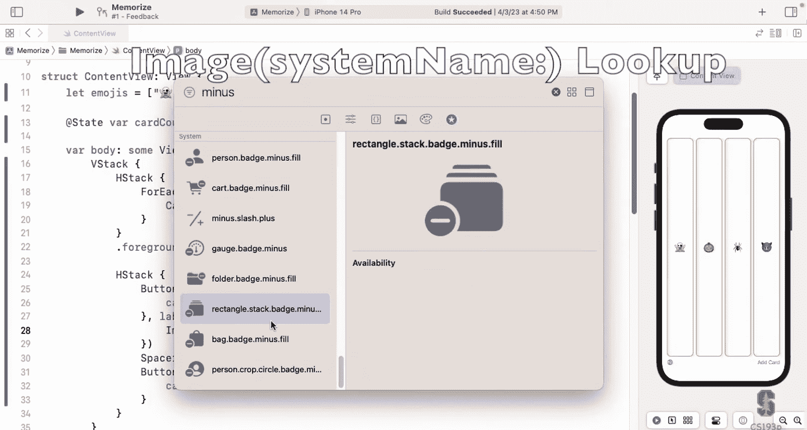

And while I look at that you can hardly see it， but there it is now it's too small， I want it bigger。

 we know how to do that， I can of course say dotimscale do large and if I wanted it really large I could change its font to be。

 for example， that large title which I'll do because this is a demo and I want you to be able to really see what's going on here。

 one might say why is font applying to an image。And the answer is images。

 these system images try to track the fonts of the things they're near right they try to work as in line and so whatever font you said it to it's going to make them match that and then the image scale is relative to that is it large compared to the size I would want to be for this font or the small medium。

Notice also that we applied these to the button and it filtered all the way down into its label。

That's the view modifiers they always filter through we could have put this image gal font right on this image that would be fine too also we could put it on the whole H stack which probably makes sense because we want both of those buttons to get this so let's put this out here and put it on the Hd now this we' can apply to both of these things see the font got big。

So let's do the same thing。For the other one。Copy and paste， Yes。

 that means we have to do something about that。Say plus equals one here instead of minus equals。

 and I'm going to use the plus version of here， I could go look it up again based faster just to type it。

 here I have plus and minus if I tap on these more cards and fewer cards。

And there's another problem besides this ugly code， which is that if I click this too many times。

 watch minus minus。us who， my button moved out from under my finger。

 right I'm tapping here and moved up here because now there's no cards。

 So it just went up to the center。 that's not good。 And if I hit minus again， Oh。

 it it crashed because I made the card count， go down below 0。

 So it's now it's trying to do card count -1。Let's protect our code against such an nefarious use。

 For example， card count minus-1， let's say if card count is greater than one。

 then we'll let the card count go down， so we'll always have at least one card and same thing down here if the card count is less than the number of emojis So count is a bar a computed bar on array that tells you how many are in there then we'll allow it So now minus minus minus won't go past zero and plus plus plus plus plus plus plus won't go past the number of cards so we don't crash our app。

Remember I told you 12 lines of code or less please， I think I said you could do 20 if you push it。

 this is way more than 12 and it's just really hard to read if I look at that I can't imagine how it's laid out so let's talk about how we make our var bodies and all of our code kind of be broken down into pieces so that's readable。

Now how do we do this， You could imagine that we could， for example， create more。

Named views like Car view helicopter view right just maybe make a view for this and make a view for this and that would help do it。

 but there's really no reason to do that Car view is a fundamental component of our UI It deserves to be a view deserves to be astruct to behave like a view This button it's just a button it doesn't it doesn't need that treatment So how what's a lighter weight thing we can do to kind of encapsulate this thing and get some of the mess out of this var body up here。

 all these lines of code up here。Well， it's actually so simple。

 here's our var body right below the var body。 I'm just going to create another var。

 I'm going to call it my card remover and it's some view just like var body is。

 and I'm going to take this button out of here。And put it in here。So now I've got this var。

 which is a type sum view， it's astruct。Now I can just put it right here， card remover。

And I can do the exact same thing with this one， take it out of here， create a nice bar card adder。

 I'll call it because that's what it is， it's a card adder。Put the space in there。

 go up here and say card adder。 Well， already just that has made our far body much smaller and much more understandable about what's going on here。

 And I can take this another step further。 You see this H stack of four each。 That's my cards。

 So why don't I take this out of here。Cut that and make something called cards， could just my cards。

 bar cards， some view， paste that in there。Now I have a very understandable body。

 This body is a vertical stack of my cards with a horizontal stack of my remover and adder。

 and there's some scaling and fonting。 but I I can even do better than this because these two things。

 the remove and adder， this pair is kind of like our card count adjusters So I'm just going to put those in their own thing too。

 I'm going take this whole thing。 cut this out， create a little bar for it that I'm going to call card count adjusters。

And in here， put right here， bar， card count adjusters。Some view。There it is。

Now bar bar body could not be simpler to understand what it is and these things down here are also each very simple to understand。

 they have a nice name like cards or card count adjusters and there only a few lines of code each pretty cool with this so we are definitely going to use this mechanism of creating this little subbars for little small things we wouldn't do it for our card view card view is too important but we would do it for buttons or things like that。

Now this is great， one thing I want to really touch on here。No one's asked me this。

 why doesn't this state return？This is a computed property here， right so this is a function。

That returns this。What's interesting is that this is not a view buildder， this v card some view。

 this is not a view buildder， this is a normal， there's nothing in here that makes it a viewBuilder now what's inside the HStack as a view buildder but the Htack itself is not so why didn't I have to say return there？

😡，It doesn't make sense if this' is not a view builder， in other words this is not a view builder。

 this is a view builder， this is not a view builder， this is just a normal function。Well。

 the reason for that is if you have a normal function and it only has one line of code and this is one line of code。

 it's got a lot of input， but it's one line of code， then you don't need this return。

It's called implicit return and this works in functions and computer properties if it's one line of code like this。

 as everyone okay with the fact that this is one line of code。

 this is one line of code that creates an H stackack and then modifyifies it that's what this is the fact that this argument to the H stack is a whole bunch of other code it doesn't matter it's just an in line function right but the one line of code here is this create this H stackack modify it this is just an argument to the H stack。

Okay， I'm still not happy with this， however， because when I scroll down here。

I see some code this and this which look almost identical right and I copied and pasted them to create them and I told you anytime I copy and paste I always say really how am I going to do this right。

 I'm going to do this better than this I'm going create a function that creates this button。

 a card adder or a card remover and the reason I'm going to do that is I always want these to be the same。

 So if I remember going to change anything about one。

 I wanted to change the other one so I'm going to have one function that builds both of them separately so let's do that let's create a little function up here and it's also a great opportunity for me to show you what it looks like to make a function in Swift It looks like this funk。

Just keyword， the name of it， I'm making card count adjusters here， so I'm going to call this card。

Count adjuster that's the name of the funk and they need some arguments because I need to know whether I'm going plus plus plus right here or minus minus minus And also they have different symbols。

 So I need an argument for where which way I'm going and the symbol。

 So the argument for which way we're going I'm going to say by offset which is an int and the symbol is a string。

And this returns， anyone want to guess what this returns？Yeah， some view， it returns。

 some view and whatever we put in here is going to return it' just like var body or something。

 and we're going to get swift to look inside our function， see what we return。

 and that's going to be our return value。Now we' got to write this code。

 and this code is basically this button stuff right here。 So let's start by putting this here。

 I'm putting that here。 And instead of having this， I'm going to have the card count here。

Be offset by this by offset thing plus equals the offset。

 and I'm going to have the system name instead of being this particular thing， be the symbol。

So everyone see how this function works Now let's talk about the by offset and the symbol arguments there we know already that sometimes when we pass an argument like to a constructor of something we have to say system name colon right we put like a label same thing here with functions sometimes we have to put a label like symbol a symbol right there is the name of that thing it's a label when we have two labels by offset the first one is the label that callers use the second one is the one we use inside or function so you see I used offset the by I didn't even use the word by in here I used offset but the person calling me is going to use by。

OkayThis is external names and internal names for those little parameter labels like system name Now symbol since it's by itself right there。

 it's both the external name and the internal name when you have just one word like that symbol it's both so both the caller and I as the implementer here am using symbol so let's look at the call with that let's let's have this card remover instead of building the button itself let's just have it return card count adjusters。

Juster by， this is remover， so minus1 and the symbol for this one is this with a minus。And again。

 I put return here because I want this computer property to return that。

 but this is one line of code so I can implicit return there。See。

 so that implicit reference even works if you're calling a function as the one line of code。Now。

 look how I called card count adjuster by minus1。I didn't say offset because I'm the caller of this function and look how nicely this reads。

 give me a card count adjuster by minus1 using this symbol and on the other side，Appear。

When I'm using it， I say adjust the card count by this offset。

 I don't have to say card count plus equals by， that's just kind of weird I want offset because that's what it is the offset。

Sa thing down here for this card adder， we're going to use the same function。

 we're going to implicitly return card count adjuster。By plus one in this case。

 the symbol is the same thing before， and now we have our plus and minus are built by this function instead and they still work just fine。

Now got a problem， though， I lost my test to know protect me against crashing。

So we're going to do a little different way of doing that which is I'm going to put a viewmodifier called disabled on there and this viewmodifier disables the UI control under certain circumstances and the circumstances we want for our disabling here that our card count plus the offset is less than one or the card count plus the offset would be greater than emoji do count if that's true if either of those things is true then we want this button to be disabled right so now if we go minus minus minus minus look dis it graded out same thing plus plus plus plus plus all the way to the top it disabled it。

All right， now time is going to tight here， the last thing I want to show you is to get rid of these tall thin cards and put them in a grid instead。

We do that really simply here， instead of using an H stack for my cards。

 I'm going to use something called a lazy V grid so a lazy V grid is something that takes a certain。

Bag a Lego instead of laying them out of stack it lays them out in a grid with a certain number of columns Now you wish you could say it like this columns three and I want three columns and as many rows as it takes unfortunately you don't specify it with a number you specify it with an array of grid grid items so however many grid items you put in here。

Is how many columns you're going to have look at that three columns okay， and if I add more cards。

 watch。It just adds more rows perfect almost exactly what I want unfortunately look how it squinched my UI down。

 Why did it do that because lazy B grid uses as little space as it can whereas HStAC uses as bunch space as it can it's just the way they're defined。

That's no good， we need to put a spacer in here， I'm going to do that that is a spacer between my cards。

And my card count adjusts。That's good， couple other small problems here。

 I don't have time unfortunately explain why these are grid items。

 but there's a special kind of grid item， which is called an adaptive grid item which takes a minimum size。

Like let's say 65 and the way this grid item works is it pours as many of the things in the bag of Lego as it can on one row and then goes to the next row。

 so it just pouring them in there and the minimum there is the minimum width so if I said like minimum 120 you see they're wider and it's pouring them in there and if I create more it just keeps pouring them in there。

So this I would normally explain this but we're out of time。

 the last thing I want to show here is this problem if I click this， look what happens。

When I have a whole row where its cards are faced down it shrinks down why because a lazy B grid makes it as small as possible and when there's no emoji showing those cards can be really really small there's no emoji there so we're going to change our card gear a little bit instead of using this if then to do this here we're going to use opacity we're going to have the front and the back always there but the back will be invisible when it's face up and the front will be invisible when it's face down so how do we do invisibleibility simple it's a view modifier it's called opacity so let's do the back first。

So here's my back， I'm going to say its opacity if it's face up， opacity is zero。

 which means fully transparent， and if it's face down。

 then it's fully opaque so zero is fully transparent。

 and you can have anywhere in between and you know， can be 0。5 or whatever we want 1 or 0。

 Now we have to make all of this So we could put aacity on every line opacity opacity opacity。

 I'm going to show you another Lego。Holding bag of Lego thing called group group is kind of like a four each of one if you want to think about it。

 it's just a group to hold other Lego so that you can apply a you modifier to all of them group is a bag of Lego so it can only be inside an HCd or something。

 but it allows us to apply opacity。Is face up question mark one colon0 so the opposite way around。

 So look， it works。 These cards are face up。 It's not showing the background because the opacity is0。

 But when I click on it or tap on it now the face is fully transparent。

 can't be seen and the back is fully opaque。 now if I make a whole bunch。

And I click two in the same row， they don't shrink down because those emojis are still there。

 they're just transparent， can't see them， but they are there。

This mechanism of using opacity is a good way to switch between two states where you need sizing and spacing for all of them for all the states。

 you see the problem with the if was that when we had if it is face up being face up。

 then the background would just not even there and vice versa， when it was face down。

 the front wasn't even there because not the if it was in the else so the if wasn't even there and so the emoji did not show up。

One last thing I know we're over time these cards want to look more like this this is two across and three down right aspect ratio。

 one line of code to fix that we're going to go back up here to our card view do aspect ratio two by three and there's another little argument here I don't have time to explain but do fit which means fit it in the space available now our cards are two by three the other problem is once I add too many cards it knocks my buttons off the screen so I can't do it so we're going to go up here and put our cards in a scroll view。

Scroll view is just a simple， like a Vtack like thing， and it scrolls， watch this， add more cards。

 scrolling。Scrolling incredibly easy and so if you you just put things scroll around it and boom things inside we'll scroll。

Sorry I had to rush those last two， that's it， I wanted to get that stuff in there because your assignment now oh let me sorry submit I assignment okay。

 I'm going to commit right here， here's my changes。

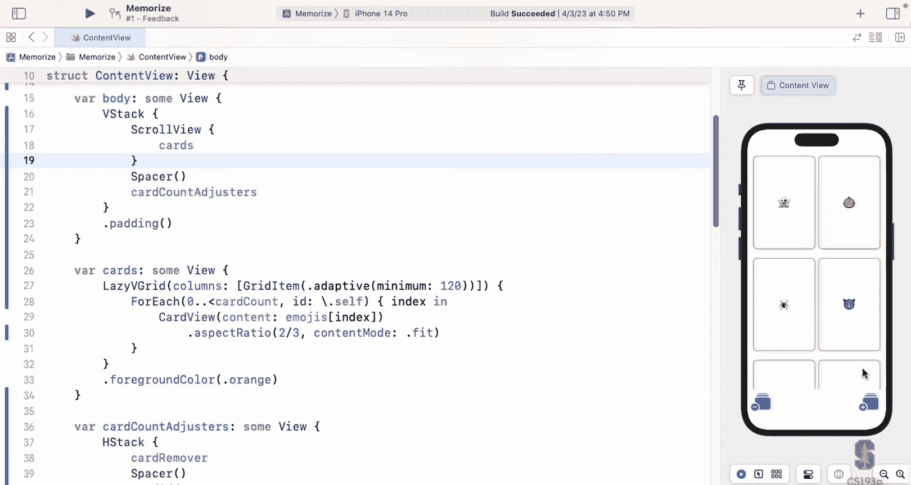

Finished assignment。1。No， not really finished。Require task one of assignment one。

 still have more to go， and now I'm going to go up here and say push。

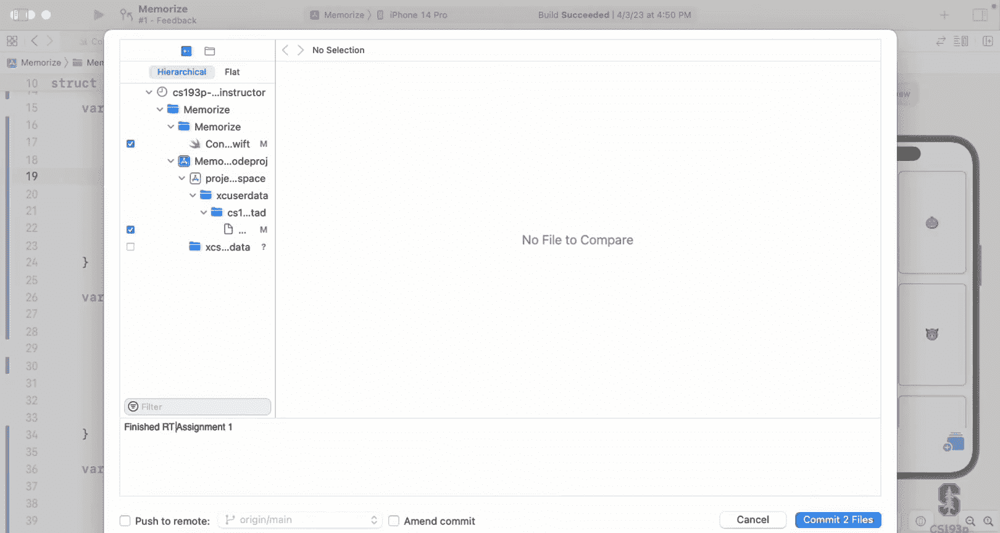

嗯。Push it up there it's going to go up to GitHub when I go up to GiHub and I'm going see two submissions up there。

 that initial commit I made and this one now I'm going to go off and do my homework which is to get all this to this point and then to add some more stuff that shows me you understood everything I did here you won't have to do anything that I haven't showed you just more of this kind of thing and then you submit that and that's your assignment。

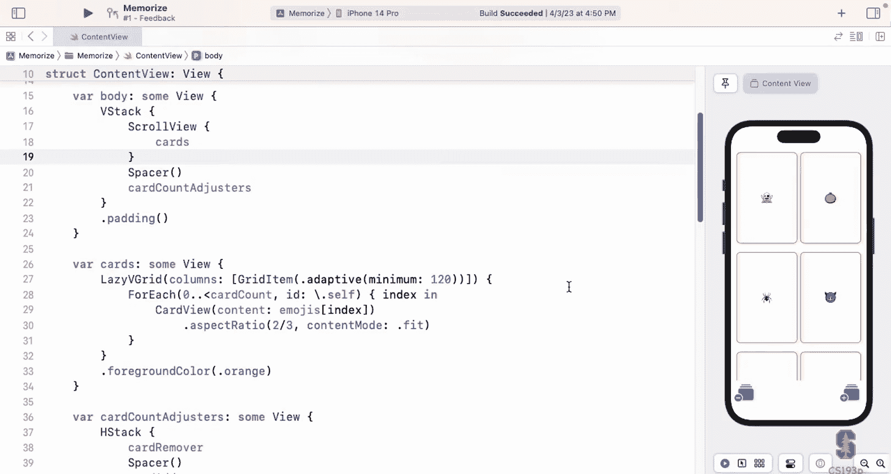