# 斯坦福大学《SwiftUI的iOS应用开发｜CS193p Developing Applications for iOS using SwiftUI 2023》 p06 -06-Lecture 6 _ Stanford CS193p 2023.zh_en -BV1HyzNYdEiD_p6-

So today's lecture， in fact this whole week we're going to pick up some topics where we're going to try and understand more about how the things that we've been doing actually work The first topic here is layout how do H stackax and lazy B grids and scroll views and all that how do they work。

 how do they decide where to put everything in there so we're going talk about that and then we have a little demo。

Similarly， view builder， right， we've had this cool little view builder thing。 It's it's a。

 we know that it's just a function that returns of some kind of view。

 but we also know it's kind of cool in that it's a list of views and it's got the Fs in there and local variables。

 So how does view builder。😊，Now， I'm not going to talk about really how view builders implemented it。

 but I'm going to talk about how you use it and how it works。

So layout how is the space on screen assigned and apportioned to all those views that appear there and it's actually an incredibly elegant little system and very。

 very simple and it has very strong rules to it to make it so incredibly predictable pretty much 100% predictable what is going to do and it's three steps。

 the first step is of course views are offered some amount of space now your content view。

 the things at the top of your app is offered the whole screen right that's the starting point but then once you start making HStax and V grids now you're being offered less and less space as you go down there a container view like an HStac or grid or whatever is offered a certain amount of space and it turns around and then offers it to its children with some algorithm and now when it does that number two is crucially important and really it's really the thing the whole makes the whole system really work is that views after they offer。

A space， even if they're like a text view or an image or something like that。

 they choose what size they want to be。The only person that can choose the size of a view is that view itself there's no way to force a size onto a view views choose their size and they choose a size based on the space that's offered to them right we're going to talk about how they do that but this inviolable rule that they choose their own size is a lot of what makes of this system is completely predictable and you don't get these weird cases where you don't understand really what's going to happen nobody is forcing anything on anybody。

But then once the views choose their size they want to be now the container view comes back in and it places them right the Htac decides are they all you know placed evenly or some of them past over more to the left and some to the right that's up to the Ht to position them So positioning is done by containers size is chosen by the views themselves and they're position by the containers that's the way system works it always works that way and has a really nice low protocol for doing this dance which I'll kind of show you I'm not going to implement it。

 but I'll show you what it looks like when we get to the demo So let's talk about some of these things and how they make decisions to do all that stuff and the basic ones are Hts and v stacks the most basic layout here。

And they take the space that's offered to them and they try to divide it up to all the views that are inside of that Now the key to Htax and VStax is this idea of how flexible is a view inside of the Hdac in terms of using the space some views are not very flexible like they basically want a certain amount of space give it to them other ones are incredibly flexible like rounded rectangle it can be tiny it can be gigantic it's anywhere in between very。

 very flexible view but other things are less let's talk about some examples of flexibility here and image you know like image system name whatever very inflexible it wants to be the size that it is doesn't want to be smaller。

 can't be larger， it's the least inflexible view out there probably is image next least flexible texts text want to fit their text they' mostly one to be that size but in a pinch if you make them smaller。

They'll allow them to be smaller and either do that minimum scaling remember we do the minimum scaling to make the thing fit or they'll just put dot dot dot。

 they'll cut off the text and put dot dot dot on the end of it so they're pretty inflexible they want to be this size of their text but they'll scroooch down a little and then of course very flexible rounded rack and circle all the shapes tend to be completely flexible can put anything you want in there this flexibility is the key to how H stack and BSt work。

After the first least flexible view is offered its space。

 the HtAC gives it that space from the space it has and then takes the rest of the space and moves on to the next least flexible view in other words。

 the least flexible views are taking space first then the next next least until there's hopefully some space left over and then you can give it to a flexible view if there's there or you might get too big won't even fit all the views said they wanted more space than even fits in there and then the HdAC has to decide what to do does it go back to the somewhat flexible views like the text and say actually I'm going to offer you a little less space because Im ran out of space and it might accept it or not so it can adjust。

So it's a little dance back and forth until it can get them all to fit。

 and they may not all fit if you try to force them to be smaller than they can possibly be like if you put 10 image views in an H stackack that's pretty small。

 it's just going to spill out the sides。And then after the HStAC or VStack has sized them all。

 then it sizes itself to fit them。So that means it might be smaller than the space that was originally offered to it if they're all inflexible views right and they're less space or it might actually be larger if it couldn't fit them all then they h stack wind up being too big again。

 the HdAC is just a view， it gets to choose its own size just like all of the things inside of it and it might choose to be too big if it can't fit the things。

So that's it， that's how H BStAC work a very predictable， sensible way to do it。

 and this is one of the most powerful and most elegant parts of alsoFUI is all this laying things out。

When you're doing HStAC and VSt layout there's a couple of little views you're going to put inside them that are really valuable and you've already seen one which is the spacer the spacer uses all the space that's given to it in both directions so it kind of fills up extra space so it's great in an Hdac we you want one thing on the left and one thing on the right and you put spacer in the middle and it'll use all the extra space it's a very flexible view the most flexible view right。

And the other one that we haven't seen is divider， similar to spacer in that it uses all its space in the crosswise direction。

 but it uses minimal space in the direction you're going， right horizontal minimal space。

 and it draws a little gray dividing line and the divider it draws is kind of platform dependent on a Mac it might look a little different than an iOS。

 maybe on an Apple Watch， it looks a little different。But those two things， spacers and dividers。

 you'll be using those in H stacks and V stacks to group your stuff and separate them and all that。

So this least flexible thing， I told you that Ht and VSt go to the least flexible guy first and then the next most flexible guy and then well you can override that with this view modifier called layout priority the layout priority by default is zero it's the floating point number it zero you can send it to anything you want and put it on a view and if it's the one with the most priority it gets the first chance to get the space out of the Ht so here I have an Ht that has two text and an image in between the top text is important text I want to see all of that text so I've given a layout priority of 100 the other two the image in the text they have a layout priority of the default which is zero So when the Ht goes to lay these out it's first going to offer space to important and important can you get all the space it needs to draw the full word important because thiss the most important one then it's going to go to the image in text and say well the image is the least flexible so it gets the space next。

And then finally it goes to this unimportant text， which is tied with image。

 but it' more flexible than an image。 So it's the last one。

 And so if there's barely any space left it might say on M dot dot dot instead of unimportant because it doesn't fit or it might ink get truncated completely。

All right alignment。 So we already saw this with Ht and vStack。

 you might put things in an Htack and it's laying them out horizontally。 That's great。

 But then do they sit in the center the Ht or are they up towards the top of the Ht are down towards the bottom and we saw that there's this alignment argument that you can provide to a vStack or an Hap that says which way you put it there and you can align not just by top and bottom。

 but by leading edge and trailing edge and notice that I say leading and trailing not left and right I don't know if I explaining this but why do we use leading and trailing in Sw your eyes instead of left and right because some languages text goes the opposite direction veric Hebrew。

 they go right to left So you want the things you're laying on your Ht to go with the text they want to go right to left too so leading means the edge from which text flows Another kind of things you can align on are text base lines say you have a bunch of text。

 maybe the text are not exactly the same size big font small font you want their baseline lines to all。

And so you can do that in there as well。It's even possible to have your own custom alignment on anything you want。

 semantically， a little complicated for this intro course that we're taking here。

 but you can kind of look in the documentation if you found some reason you really need to line it up。

 but it's a very flexible system。Let's talk about lazy Htack and lazy VStack What are those lazy things Well the lazy primarily means that it's not actually going to lay out the views that are not on screen right。

 starts laying out the views until oh now I'm off screen I'm outside of my bound not going lay them out anymore so you could have  a thousand items there maybe it's all the songs in your music library you don't want to have to go lay out a thousand things just show the first seven but once you got start scrolling now you got to start laying out the other ones the lazy Ht and VStack to do that。

One thing about lazys is they don't take up all the space inside of them even if there's flexible views inside of them so that's different than an HdAC of BStack right if they have flexible view they'll use that extra space。

 these ones don't， so you're almost always going to put these inside a scroll view because they're going to scrunch down to the size of the things inside of them and you're generally not putting flexible things in there unless you have things that constrain the flexibility like aspect ratio or something else that's going to make it be an actual size so that's lazy HStAC lazy Btack mostly again for scrolling lists of things。

And then there's lazy H grid and lazy V grid we've already seen this。

 of course we used a lazy V grid to lay out our cards。

 I'm not really going to talk about it too much here。

 but it's similar in that it sizes itself to the things inside of it。

 so usually put it in a scroll view。You already know how to use this。

 waste our time talking about this， there's another thing called grid。

Now grid doesn't have an H or B in it， so grid is a view that you use to lay out things in both directions。

 I like to think of grid as my spreadsheet view or a table view。

 you know have a table where it has certain columns。That's kind the way a grid works。

The gridds mechanism is a lot about these viewmodifiers dotgri this so things like doc grid column alignment can make it so everything that's in the third column over is all left aligned or right aligned。

 things like that so we're not going to really use grid in this course it can be valuable if you're building a table like thing like that you might use them in your final projects when you do go to try and discover how to use grid definitely want to make sure you go and find these viewmodifiers that start with doc grid because that's really about how you make this really work。

Then there's scroll view， we've already seen this super simple view and it uses all the space that's given to it。

 so scroll view always takes all the space offered to it。

 but then it puts the thing inside and lets you scroll around on it。100% obvious what that does。

There's another super cool view called View that fits， Viewed up fits。

 its ViewBuilder has a list of views， usually only two or maybe three。

 and what it'll do is check out the size of all of them in the size that's offered to the view that fits and it chooses the one that fits the best。

So a classic example of this is you have a view that fits and in this viewBuilder。

 you put an H stackack with your items and a VStack with your items and when the phone's in portrait。

 it ends up using the VStack because it fits better。

 but when it's in landscape it ends up using the H stackack。

It's a really cool little idea another one this is really good for is dynamic type when old people like me on our phone we go set our type to be really large that can make it so that now things won't fit horizontally right the text just too big and so it needs to now be vertically and this will do that automatically in other words this is not just this is not looking at portrait and landscape or inside it's actually sizing its views and seeing which one fits best。

For and list an outline group and disclosure group we're going to talk about these later in the quarter these are sort of super smart Vtacks Vtacks that know about things like selection right selecting items in the VStack or hierarchy maybe I have data that I can click on a little like you know disclosure thing and it'll show me deeper children information then click and go even deeper they're very powerful but let's wait till later in the quarter and we'll talk about them。

And finally， you can build your own ones of these using this custom layout protocol。

 I'll show you again in the demo briefly what that looks like。Probably rare that you would do this。

 we're actually going to build our own combiner view that lays out our cards。

 but we're going to do it in terms of other ones rather than doing the full layout protocol and by this layout protocol I mean the thing on the very first slide offered space to your views。

 they pick sizes you position them that whole dance is all this layout protocol it's a really beautiful simple protocol as you'll see when to show you to you。

Then there's ZStack， I didn't put ZStack in the same brackets HStack and VStack because of course it's a little different。

 you're stacking these things now towards the user from the device up towards the user。

 and so the sizing is a little different there。The ZStAC has its alignment and it's going to put things in there but the important thing to know about ZSAC is if even one of its children is fully flexible。

 like our round erectangle or something， then the whole ZStack gets fully flexibility because it wants to give as much space to that thing as it can and really in ZSAC one of the key things to understand is what's going to be the size of this ZStack and it's going to be the largest thing that needs to fit that's ZStAC is obviously going to fit the largest thing and if the largest thing is fully flexible。

 then the ZStAC is going to be fully flexible and take all the space ever offer to it。

And that's sometimes what you want， but sometimes not。For example， you might have。

A little text right there。And you want it to be ZSted or stacked on top of a rectangle。

 or I no rectangle around it， but you don't want the zStack to use all the space。

 you want the zStack to size to the text and just have the background only behind the text right Well you wouldn't do that with a ZStack。

 you would do it with this background view modifier。So the background view modifier takes a view。

 a single view， not a view builder， by the way， a single view。

Although you could obviously create your own bar， which was a view that was a view builder inside of it。

 but anyway， it takes a single view and it puts that view z stacked behind the view you're modifying。

 but the sizing is all determined by the main view， not the thing in the background。

So background is like a two man Z stack where the sizing is the one in the front。

 it determines the size。And similarly， there's another one called dot overlay， it's the opposite。

The two man ZStack where the thing in the front is a slave to whatever's in the back。

So for example here I have a circle that's got an overlay of a text in that case that's going to be a flexible view as large as can be so that would be similar to a ZStack now in these cases where you have an overlay and you got that text in there。

 obviously it could be in the center but you might also want it leading a aligned or top aligned or whatever so this has also an alignment that lets you say where you want it。

The thing that's determining the size is bigger than you。Background and overlay， very simple。

 two man's Z stacks。Who is in charge of what the sizing is， where ZStack。

 it's always the largest of the one in the stack is the Z stackack。Modifiers。

 Why am I talking about view modifiers here in layout Because really a lot of modifiers are essentially like little layout engines。

 if you want to think about it that way。 I mean， some of them like let's say foreground color or font they're not layout things。

 they just whatever size is offered to them， they just pass it on to the view they're modifying right because they don't do anything。

 But other ones like padding， they actually change the space that's available to the thing if I put padding around a text now that text has less room to put itself in so you can think of padding as a simple little layout thing that takes the space offered to it sces it in a little bit and then offers that space to the thing inside So if you had a padding 10 then it would offer the view that's modifying it a space that's the same size as it was offered minus10 on all sides。

 and then the view that's returned by the padding 10 would choose a size for itself thiss 10。

Poin larger than the thing inside。 so it does the dance with the thing inside。

 the thing inside still gets to choose its own size， and then the padding adds 10。

But the size it offers that thing isn't size it was originally offered to it minus 10 how the dance goes。

 size offered， go in 10， this guy sizes himself， add 10 back out。

 I might be bigger than what I was offered if that thing in sizeith wanted to be big。

Another example of a modifier that is' kind of like this is aspect ratio。

 so the view this return by aspect ratio takes the space this offer to it。

 it picks a size that's either in the aspect ratio inside what was offered to it。

 that's the dot fit then we have content mode dot fit or it picks a size that as big as possible where one edge is the larger size and thus it'll be bigger than the size offered to it。

 that's the dot fill option， bigger dot fill so that's different between dot fit and dot fill and once it's done that then it's going to offer that space to the thing inside and then whatever that thing picks it's going to be in a kind of centered in a view that is the right aspect ratio。

So aspect ratio and padding these view modifiers， they act a lot like V stacks and Hts and things like that。

 They do this layout dance themselves。 Let's talk a little bit about views that take all the space offered to them。

 Of course， we know about shapes and we're going to do our own shape， it's going to do this。

 but other views also can do this。 for example， our card view does this。

 we whatever space we give our card view， it draws in it。 And for example， the way we make it。

Be the right aspect ratio is we you modify it with an aspect ratio modifier。

 it creates a view that's the right aspect ratio and offers it to our card our card uses all of that space and we already did a little bit in there to make it use as big a font as possible right we just chose a really large font and then we used that little minimum font scale text size scale whatever that modifier was and then shrunk it back down to fit the space that was offered to it。

But。If you think about the view that has all our cards。What if we took that thing。

 took all the space offered， and then picked a size for the cards that would fit perfectly in there？

So we wouldn't have to scroll around if we had too many cards and if we had a few cards。

 the cards are nice and big。 So that would be an example of getting a lot of space and then trying to pick。

An arrangement that makes it work。How would a view that would want to do that。

 how does it find out what size it is without doing that whole layout dance because that layout dance and it's got a lot of work to do well the answer is you can put your view inside another kind of container view called a geometry reader so a geometry reader using it looks like this geometry reader。

It's a view that takes all the space offer to it， sees what size it is。

 and then passes that onto its subview， right its view that its content view。

 along with this little proxy， this geometry proxy that says what the size it found was。

Here I have a geometry reader， I'm wrapping it around。

 see the three green dots that would be my view that I want to know the size of and the proxy is telling me things here how big the space is I was offered。

 this frame and coordinate system is a rectangle with coordinate space and this coordinate space could be the local coordinate space of the view or could be the global coordinate space of the device。

And then this safe area inss thing is interesting， that's saying how much of the space that was offered to it is being cut off because like the notch at the top of the phone gets in the way。

 so that gets automatically removed but you get told what it is in case you're saying I want to draw under the notch anyway。

 so I'm going to draw outside the safe area there。So that's how geometry reader works really。

 really simple， it's just like a wrapper view that passes the size offer to it only trick with geometry that's important to understand it uses all of the space offered to it。

 it's really the only way it can work right because the whole idea is it tells you how much space was offered to you so it has to use all that space to see what it sizes and so that's in red here some people they forget about that and they're trying to make a view small but then they're like oops I forgot I'm put it in a geometry reader now it' it big as the space offered。

That safe area thing， that's the notch， all those things。

 Another way you can ignore the safe area is with the viewmodifier edges ignoring safe area top and that'll make it so that Z stack will draw outside of the space offer to it on the top into a safe area like the notch It's not just the notch by the way sometimes you're put in a navigation view you know on a phone sometimes you can navigate around。

 you can hit the back button to go back well where that back button is at the top of the screen that's a safe area for the views inside of it but if you were like navigating through images。

 maybe you would want those images up underneath that back button up there。

 you want them outside the safe area you can do that this edge is ignoring safe area。

We'll basically make it so that view， it ignores any safe area on the top or the bottom， whatever。

So let's get a demo here， we're going to do that thing I talked about of having the cards go ahead and use all the space offered to them。

This is where I told you when we would get back to this lazy Bgrid and I would explain this better because I had to rush it at the end of of that lecture two or something。

 so let's talk about what's happening with this grid item。Go back to what I was saying at the time。

 which is that really， we'd love it if lazy P gridd would just let us specify the columns like three and there would be three columns here。

 but we can't do that。 can't specify three there。 and the reason for that is we don't want to just specify how many columns we want a little bit of control over the columns So instead of this being the number three instead is an array of these things called grid items。

 these grid items define each column so here I have one grid item in the array。

 so I have one column still working fine here's my card there one column and if I have two grid items then I get two columns and however many grid items I put here is how many columns I'm going to get these ones that have no arguments are actually having the argument flexible。

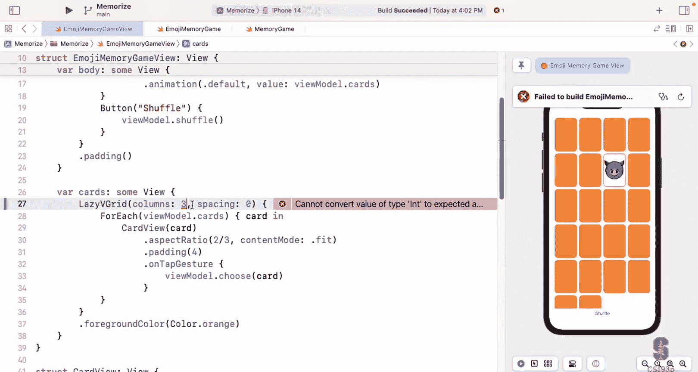

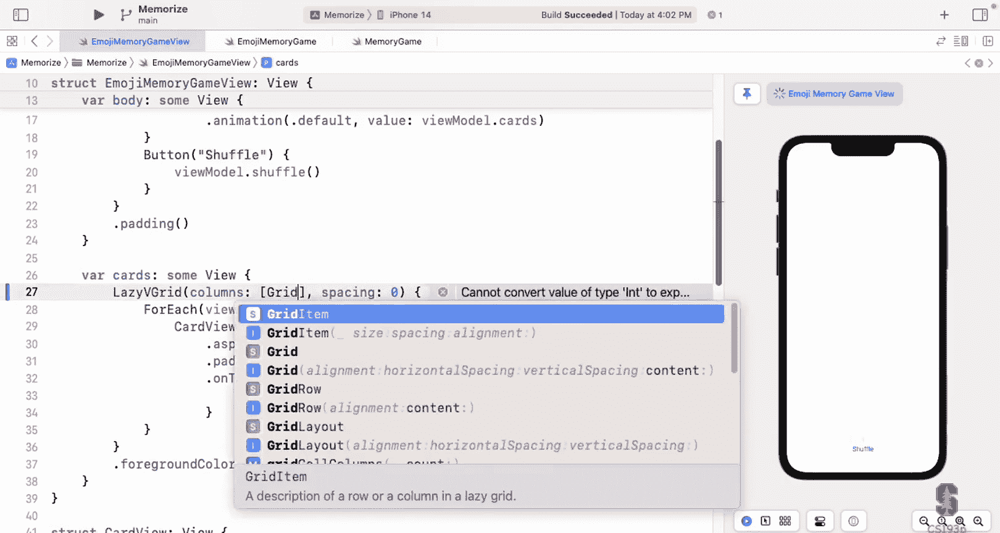

flexible is the default argument or grid item， they're flexible， these things can be as big or small。

 they're reallyre allowed to be whatever and this has some arguments too。

 but you can also have fixed is another one here so if I say。Fixed。And maybe， I don't know， 40。

Really tiny， so I' fix this column to be 40 and that's just that first column， I two columns。

So that's how grid item works One thing I do want to take a second to look at is this fixed you see it's fixed right here。

 I'm going to open that up in the documentation and show you that it's actually an enum it's a case in an enum for this thing called grid item do size So here's grid item do size that's the argument to a grid item there it is there's the three cases flexible with minimum maximum size fixed with a fixed size or this adaptive thing that we ended up using in lecture2 right case case case these are enum What are these things called。

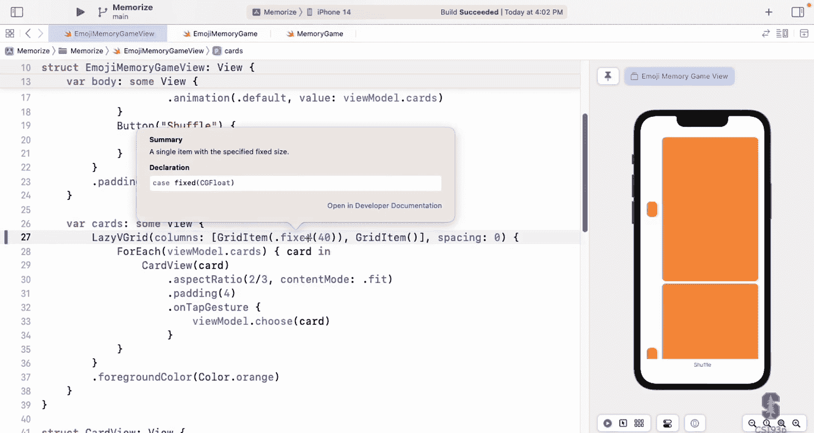

The associated data for those cases， right？When you see things that start with a dot like this dot fixed。

 it's not always going to be like a static function on a type， it might be an enum。

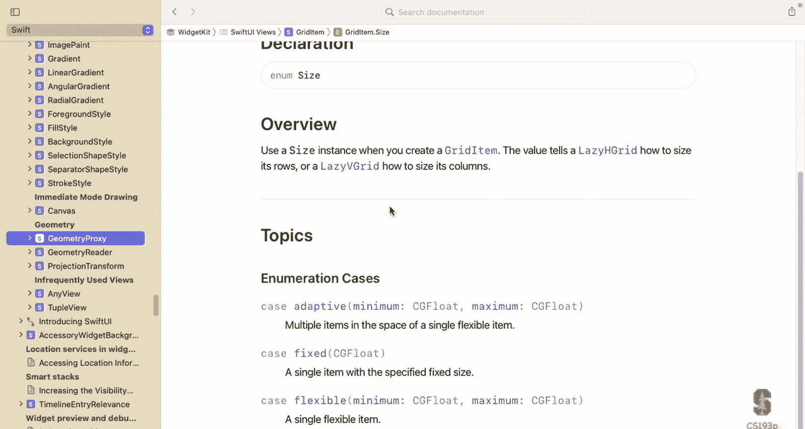

So let's go back to what we had before， though， which is we were using this adaptive item， adaptive。

And we had a minimum size， 65 or whatever。And we also had the spacing in here being zero。

So I've set the spacing here to zero and that's the spacing in between is this one and the spacing over there that zero that's the spacing in between the rows。

 why have I set this to zero because our goal is to pick the right size cards that will fit perfectly in here so I need to take the spacing out of the equation and why is that because this spacing is platform dependent。

On an Apple Watch might be one thing on a Mac it's a different thing the default spacing I don't know what it is so I can't put it in my math of how the cards would fit So instead I'm taking the spacing to zero and I'm going to pick the space so they all fit zero and then。

Padding I add as an extra little padding down here after the fact。

 after I've already divided the space up to fit the right number of cards。

Here's a really valuable debugging tool when you're trying to figure out which view is using which space。

 these H stacks and B stackacks are laying things out， where is everything？

And what you can do is go to some views like maybe this button and put a background view on it。

 and a color is a great background， so color is not only the argument to foreground color and all that it also behaves like a view。

Color behaves like a view， which is really convenient so I can said background member background means put this view behind me。

 but used my size，'s put it there and see oh there is the bounds of that view and I can do with other things too How about the V stack itself let's go here and say that background that yellow for the V stack So it is the V stack you see how it's。

The padding makes it in from the edges a little bit。 The yellow is a little bit in from the edges。

 If I put this background on the padding view。Then it would go all the way to the edges。

And this is important to understand that the padding view is a different view than this be stack in that it's put this extra padding around doing this little background thing and plopping it around on various things inside and outside of padding will really help you understand what's going on let's do the same thing up here。

With our cards， I'm going put my cards here and say dot background， what colors I got left， blue。

 green。Red。啊。I can see the red， so here is my cards， it's a lazy V grid so it has fit itself。

 but you can see the scroll view is big right it holds it's big space and when I scroll see how it's scrolling around inside my scroll view so putting background colors really really cool way to just see how all these things laid out your world。

Go out of there。Our goal here is to make these cards fit that's this number right here right 65 makes it so that they fit if I change this to 95 now they don't fit and I have to scroll。

Everybody agree with that so I need to pick this number so that things fit and once they do。

 then I won't need this scroll view and if I took off the scroll view now and just use my cards。

 I have a big problem。Again， this VStack tried to fit everything。

 couldn't fit it with that minimum width， so it'd actually pushed the shuffle button that was right here off the bottom of the screen because it's in a VStack with this very tall thing and I don't have a scroll view anymore so shuffle buttons down here somewhere and' see it on screen。

So I want to pick this 95 to be smaller when I have so many cards。

 but when I have a few cards I want to be nice big， so I can see my cards really well。

Though I'm going to do this with that geometry reader。

I'm going make this close because these lines are getting along。

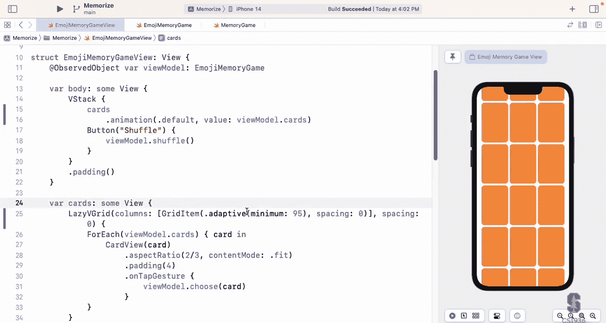

I'm going to put a geometry reader here around my lazy B grid it's got this little geometry proxy here and the only thing that this is really done is it's made it so that this view here takes all the space offered to it that wasn't true before lazy B grid it sized itself to the cards。

 but now geometry is it takes all the space， but the great news is it's going to tell us what that space was that all that space in this geometry thing and we can use this to set that cards so I'm going to create a function to pick that size。

放。Red。Item with that bits and you need some information here， some arguments。

One argument that needs is how many cards to fit， so that's the count。

Another argument needs to fit is the size， what space are we trying to fit in， so that's the CG size。

 and finally it needs to know the aspect ratio。Aspect ratio。To fit into。

So if I have those three pieces of information， then I can return 95 or whatever the right number I can calculate the right number to put there so let's call that up in here I'm going to let grid item size equal calling this function grid item with that fits and what's the count how many cards do we have that's our view models card count。

And what's the size we're fitting in Well， this is where that geometry proxy comes in。

 remember this geometry proxy we have here， this is what it looks like in the documentation。

 it's got the frame in local or global coordinates and it's got this size right here in those safe variant sets so we're going to use this size that comes in our geometry proxy。

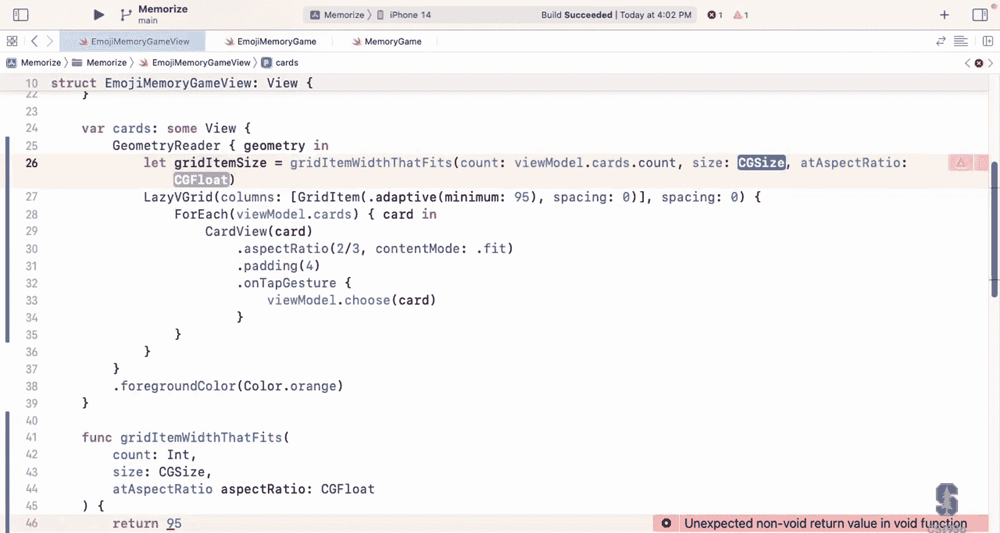

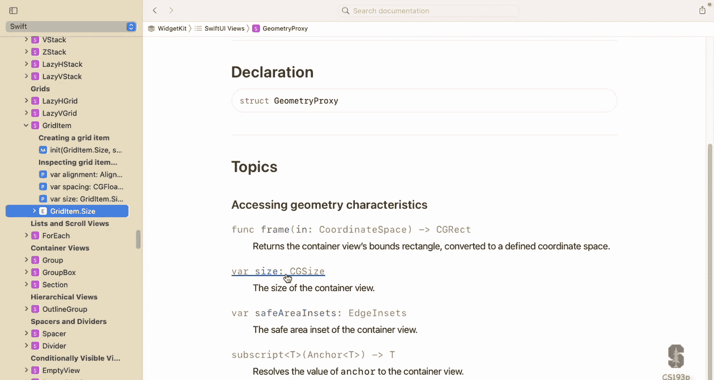

As the size we have to fit our cards in and the aspect ratio is the aspirral ratio we've been using。

 which is two to three， a two to three aspect ratio and this size is our geometry proxies size。

Let me space this up so you can see this better。Everybody cool with that call right there。

 I'm calling that function。 We still have to implement this thing。

 but I'm just calling it to find out what it is。 And then instead of having 95 here。

 I'm going to use this。Great item size。Sorry， one other thing。

 this grid item size that fits function， it has to return a CG float。

Now this should be working exactly the same as it was before because I'm returning 95 down there。

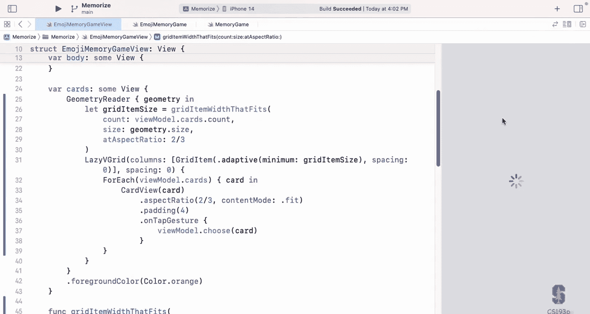

I think I'm sure enough if it looks like it's doing that and if I go down here and say 65。

Then they're smaller， that's great shuffle button fits on there again。

So how am I going to calculate this 65 to be the right numberNormally I actually in press quarters have copied and pasted this in here。

 I'm going ahead and type it in because I see that you a lot of you are still following along。

AndBy the way if you're following along you don't need to be doing it for the homework。

 I still think it can be a valuable way to understand what I'm doing but you don't have to follow on for homework so what's going to be my strategy for calculating what fits so here's how I'm going to do it I have some space that's offered to me and first I'm going to try to use one column and see if it fits now depending on my aspect ratio it might fit or it might not fit the card might be so big that it won't fit if it won't fit now I'm going to try two columns。

And to keep that same mass ratio， now they might fit。If that doesn't work。

 I'm going to try three columns， four columns all the way up to one column for every single thing I have so I all I'm going do that's my strategy。

 really simple， just going to try every possible column count until it fits vertically。

Let's start with a column count of one， and then I'm going to repeat doing this until。

The column count。Then my overall count and when you do this， you say while。

 so this is a repeat while statement。Most languages have a while or do repeat or do until this is a repeat while。

So it makes no sense to add so many columns that it's more than the number of items that I have。

 it's not going to help at that point。And inside here。

 I'm going to get the width and height of each of my cards or cells really in this。

 given the number of columns that I have， so the width is just the size that I've been offered divided by that many columns everybody agree at that and then the height。

The height is just the width divided by the aspect ratio。That's how I get the height of each cell。

 so now I know the width and height of every cell if I had that many columns that column count now I'm going to get the row count I'm going to say。

 well how many rows would I need then if it was that size and the row count。

Is just the count divided by the column count， but I need to round this up。

If I had three things and I had two columns， one， two， three at two rows， not one row。

 so I need to round this up， got rounded is just a function in CG float or in double and it round it you can round up。

 you can round down there's various arguments to this thing it's got an Eum here。

So now I know the row count， so I'm going to say if the row count times that height of each cell is less than the size that I was offered as height。

 then I'm done， I win and I'm going to return the size dot width divided by the column count。

And this one also， I'm going to round down。One thing about Swiftyi that is super cool feature is it draws on pixel boundaries。

 That's not the same as point boundaries。 All the work we do is in points。

 all these things and a point can have one pixel to it or two pixels or three pixels。

 It depends on how incredibly dense and beautiful， your retina displays or whatever。

 So you know new iPhones， they have three pixels per point so they draw very smooth lines old iPads one pixel for point so the lines are might even more jaggy but you don't have to even think about that。

 the only reason I'm rounding down here is I just don't want to have a rounding error pushed me over to edge okay where it's adding the columns I have like seven columns and adds numbers and a rounding error causes it to go one too many and now it doesn't fit。

 I'm just rounding down to make sure it fits。 It's nothing to do with pixels and points there。

 If that doesn't work， then let's go to the next column count plus equals one。

Now if I get all the way through here and I've tried every single column that I can all the way up to my count of items。

 then what am I going to return？Well， one thing I could return。

 you might think here is the width divided by the counts。

Take whatever width they have and then just divide it up black however many items。

 but that actually is not good because what if again。

 our aspect ratio is such that if I use the entire width， now my cards are all too big， you see。

 so I' have to do really the minimum of this。Or。你。Size height that I was offered times the aspect ratio。

And I'm also going to round that one down too。So this is make sure that it fits。

For sure that these cards will fit and that might make it so that it's fewer than the entire width。

 even though it's one card per column， but that's what it has to be to make them fit then that's what it has to be。

Now I'm getting all kinds of errors here I'm not getting all these errors everywhere let's look at it says binary operator slash divide cannot be applied to what。

CG float and int。Indeed， Swift does not automatically allow interop between ints and floats。

It wants you to think about that when you do that， what do you really mean？

And now it will allow interop between floats and CG floats though CG floats are the floats that we use when we're drawing right you've seen those all over the place here CG size that's got CG floats in it so you can do that which can't do ins so how am I going to fix this problem here well this one is the size out width divided it by the column count I'm just going to turn column count into a float。

So I said column count is 1。0 instead of one， well that fixed that problem。

But there's still another problem， this count is an impt。

Right the count the number of items it's also an hint So how can I do that Well watch this little trick。

 I'm going to let count equal a CG float that I make out of the count that was passed to me。

A couple of things going on here， one， you're seeing how to do type conversions。

 which is you just create a new one。And hopefully the thing you're creating has an argument which is the other type that you want that's what's happening here CG floatloat it has a nit argument that takes int it'll do it but the second thing I'm doing is I'm creating a local variable count that's the same exact name as a parameter that was passed to me and it's kind of overriding it and that's scoping that's the normal swift scoping there this right here it's type is CG floatloat this is the argument past to me it's an int and that's perfectly fine now I don't usually recommend picking the exact same name as remember unless it's semantically identical which it is in this case it's the same name it's just a different type so I think we're okay to do it there。

And that's it。This is our little simple。Way of calculating the size of the cards。

 so let's hope it works。No no errors， seems to be doing it。

 let's go over here and pick some different numbers of cards。

Let's try what happens if we do one card now our model is smart enough to say， oh。

 you can't have a matching game with one pair of cards so I'm going to make two so that's why we got two there and these cards look good yeah。

 look absolutely fine how about two that's going to be the same as we just had there three Oh look at that resize the card to be smaller four。

They didn't need to be smaller， five。U， resides the smaller again， six。7even。Eight size is fine。

 nine。Fine，10。Okay，11。Oh， smaller again，12。The reason it's switching back is because I'm hitting backspace and now it's going back to one and that's the previewers so fast that they able to rebuild and get it going there。

 but this is working great so we don't have to ever。Scroll here。

 and we have essentially used this geometry reader to look at the space that was offered to us and pick an item size that makes them all fit。

I'm going to do one other thing here it's kind of a transition to our next little thing which is you see this two thirds right here。

 I have that magic number in two different places we're going to talk about on Wednesday。

Blue numbers。 these is blue。 This is blue。 Blue numbers are bad。 Blue numbers are magic numbers。

 You surely you've all learned N CSs 106 or whatever you don't want to have magic numbers。

 You want to have constants for those。So we're going to talk all about how we do constants with on Wednesday。

 but I'm going to do just this one constant here and I'm going to do it by going up here and saying let aspect ratio。

 which is a CG floatat equal this two thirds thing right here。

And then I'm just going to replace everywhere the 2/ thirds appears with this aspect ratio。

And this is nice， this makes my code not most not， oh no。

How could that possibly have broken something to do that， let's take a look， what does it say here。

 function declares an opaque return type that has no return statement in its body from which to infer the underlying type。

What this means is you said this returns some view， but I'm looking in here。

 I don't see the thing returning some view。And in fact， this doesn't return some of view。

 and in fact this is not even valid syntax， it doesn't return anything。

It just has a littleette there， and then it just has a view sitting there。

 it's not returning that view。Now you might be saying wait a second when you do this all the time in our view builders we're supposed to be allowed to have variables and then just list views how come it's not working well the answer is bar cards that computer property is not a view builder it's just a regular function so we could fix this by saying。

Return this， that would work。Now this is a normal function that just is declaring a variable and returning some view。

But we would probably not do that here instead we would turn this var into a view builder by saying@ sign view builder。

Putting outside viewBuilder in front of a var says look at the contents of my。Computer property here。

 as if it were a view builder。 that's what Asign viewBuilder does。

 Now you might say why didn't we put atign view builder up here， Asign view builder。Well。

 we didn't have to because the person who designed that protocol did it for us。

We only have var body because of that colon view up there behaves like a view。

 so this is implicit with var body。that makes sense， wrote whoever at Apple wrote the view protocol。

 they knows that your bar body always wants to be a view builder。

But you can do it for your own ones as well。Now having said that， I probably wouldn't do this。

 what I would do is take this aspect ratio and put it out here。As a private let。

Constant because aspect ratio is an important thing in my view。

 the aspect ratio of the cards that's important， I don't want it buried as a local let in some function I want it up at the top level so that readers on my code can see yes。

 I'm building a memory game with cards that have aspect ratio I might even want to rename that to be card aspect ratio to be clear it's the aspect ratio of the cards but we'll leave it as here by the way。

 notice I have a private there in our view and generally whenever we're programming and Swt everywhere we put private in front of everything unless it needs to not be private。

Now why doesn't Var body have private， because Var body is part of the view protocol and in the view protocol。

 it's not private。So we can't make it private， if it's not private in that protocol。All right。

 so we learned a little bit about viewBuildder there that we can take a function or a computed var。

 either one and put outside viewBuildder in front of it and then the stuff in there will now be interpreted as a viewBuilder。

 so let's go back to the slides now and talk a little bit more about viewBuildder。

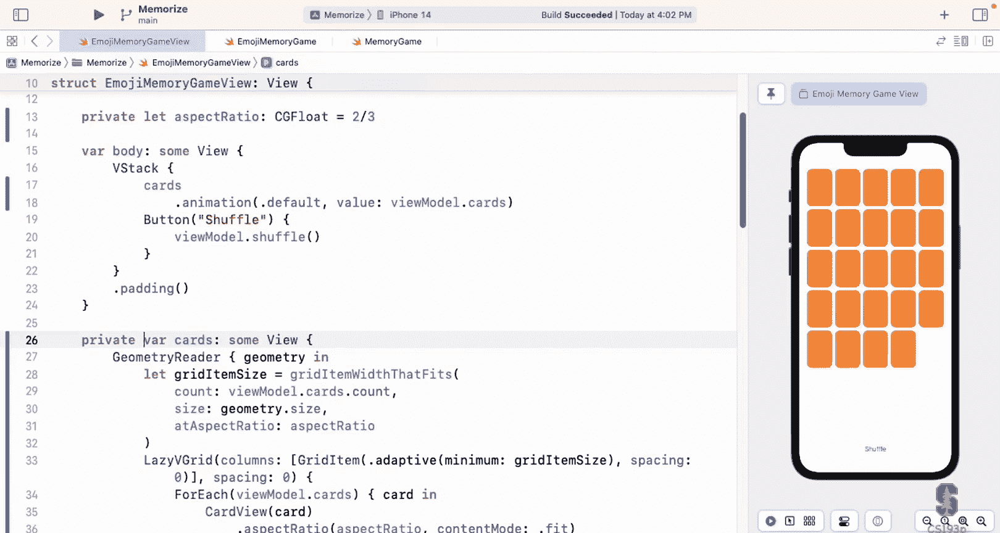

We already know what a view buildder is， it's just this way to have a list of views with conditionals and little lets。

That's what a view builder is， it takes a function that returns a view and it interprets it in that way。

The reason we need this is a lot of times we have bag of Lego views which are a bunch of views but we want to pass them around as a view and that's why in the very first lecture I said bag of LeEgo。

 this is a view and I tried to plop it on top of the Lego I was building that's why we have viewBuilder so we can combine a bunch of views together and make a single view out of it。

That view we learned is often a tuple view so tuupal view is just a view that can contain a number of views。

 by the way tuupal view isn't infinite I think it's like 11 or something like that you can have up 11 if you had more than 11 views you're probably going to use a for each to do more than 11 and put the things in an array or some sort of thing that drives it it also might be an underbar conditional content I think that's still what it's called I don't think they made that really a public thing when you see underbar in front of something that means it's not really public you're not supposed to use it that means you would never use conditional content yourself but the view builder uses it when there's an if then or a switch or something it's using conditional content view and it could also be empty view like if you an if then and and the else case did nothing then it might be an empty view in that case and it could be any combination of these things tuple views with conditional views in there conditional views with twoupple views you know any tree of these things that you want it all rolls up。

At the top level there's either a twoable view or another of our conditional content view or something's at the top level that's the view that's returned so that's what's going on inside ViewBuilder now I'm not going to talk about how it does that it's actually a public mechanism how it does it you could go and look at that if you wanted to build your own@ sign something that parsed the stuff inside the function and do something with it but way beyond the scope of this course right。

Now what it creates， we really don't care， what it creates， some view set it up for us。

 so it's completely meaningless as to what it creates。

But we do sometimes want to say which of our functions that return of view get treated as view builders and we saw already that any。

Computed bar or funk can be marked as a view buildiler。 And here's my example of it。

 Let's say we had a function for the front of our card right now。 we embedded all in our bar body。

 but let's say we had a function for it。 We couldn't just do front of card。

 some view shape is round rectangle shape strokes we can't list the views like this。

 But if we put outside view builder in front。 And now green light we can do it。

 that's exactly what we just did in our demo。 And this thing right here would return something tuple view with three don't cares rounded rectangle。

 rounded rectangle text。 So it does this with generics Tupple view as generics can have up to 11 don't cares right there。

 don't care what they are。 and that's what the views are。

 I'm not showing you this because you're supposed to know this。

 I'm just showing how weird it is and why you don't want to know what it is that you don't care。

 It's just some view。We saw how we can turn a function into a view or we can also use it for argument types。

AndIf we're passing an argument， and this is how a ZStack works。

RightWhen you pass the content to a ZAC or an HStAC， it's a view builder。

 well hows it do that in there in it， they mark that argument as at sign viewBuilder and we're going to do this also in our demo。

It's really simple just put that assignign viewBuilder right before the argument in your argument list。

 you can also do it with a var， so if you had a view that had a var that was a function that returned to view。

 it could just mark that var as Asign viewBuilder and then when then you wouldn't even need the init。

 people could call it they would get the free viewBuilder activity going on their function。

Just to reiterate view builder， it's just a list of views， it's not arbitrary code。

 you can do the ifs， you can do the lets， and that's it。Let's go build our own HSt， VSt like thing。

 I'm going to build something that does the cards。So it's going to be a generic view that takes any number of items and a view builder for each item and lays them out at a certain aspect ratio so that they fit。

All the stuff we just did， but I'm going to put it in its own little H stack like deal。

 Let's see what that looks like。

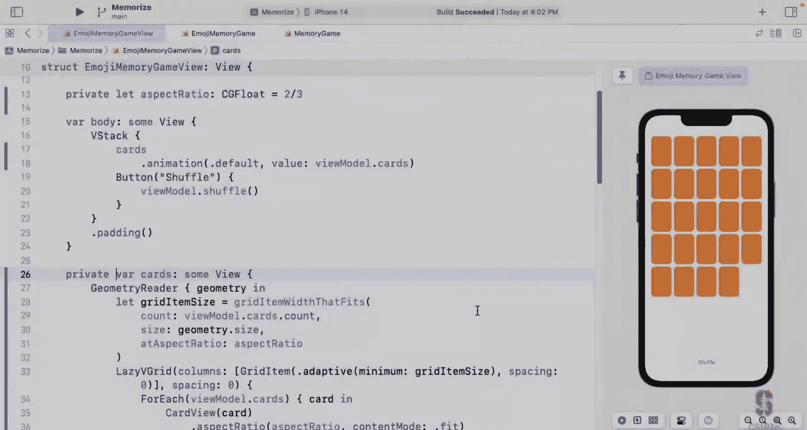

Let's start by creating this thing or start trying to create it it's a view each stack is a view。

 all these interviews I'm going to say file new file and'm going to do file new file I'm going to pick at the bottom left Swt UI view see that because this is a view here we go Swt UI view and what name does it have I'm going to say aspect V grid because it's going to be a V grid but it's going to use the aspect ratio to make things fit。

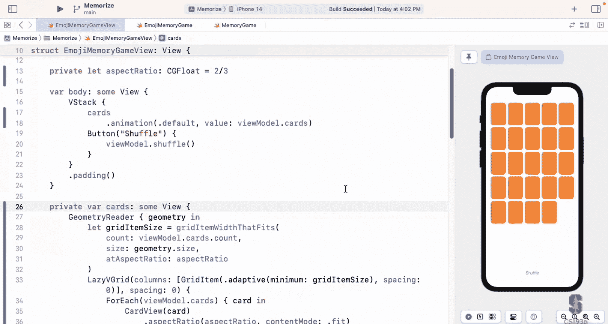

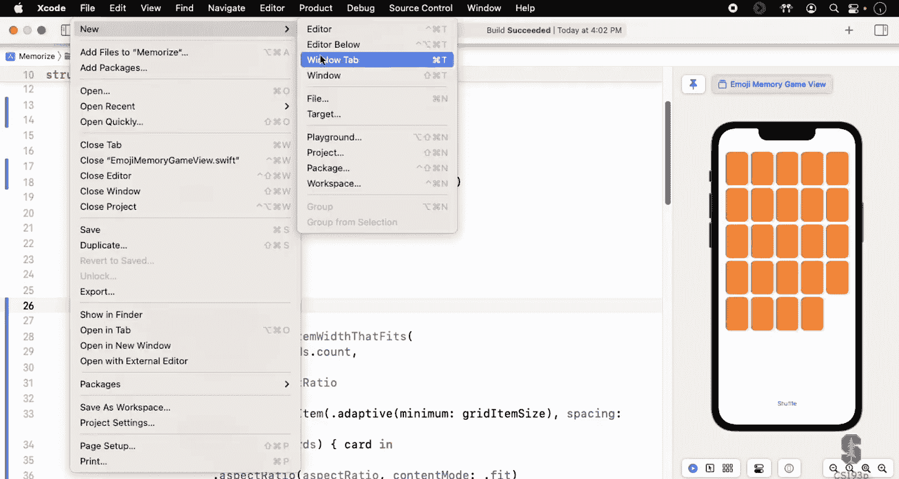

So it's an aspect of ratio oriented vertical grid one thing this is great i'm really always going to check this group every time I do this i'm going to remind us because I know you guys you don't check this and then files end up all over the place at your top level and stuff so you really want to put this where all your other files are and you want to put it in the group here so that。

When you look in your navigator， these files won't be all over the place。

 they'll be collected together。

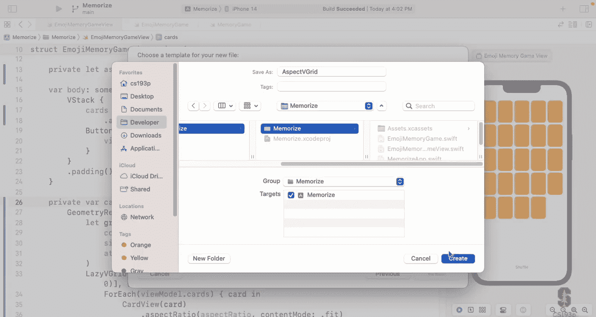

So here's my aspect Vgrid it's created there it is where all the rest of my files are it's created it here as a normal view with a var body let's get rid of our preview if you build your own AS stack or vStack type thing like this you would have a preview and you would build some kind of sample content that you would use to show if your thing is working we don't have time for that so I'm going to delete the preview so we're not gonna to be able to preview this aspect V gridd but we will be able to preview it because we'll be looking at this pinned view which will' be using it so we'll be able to test it there。

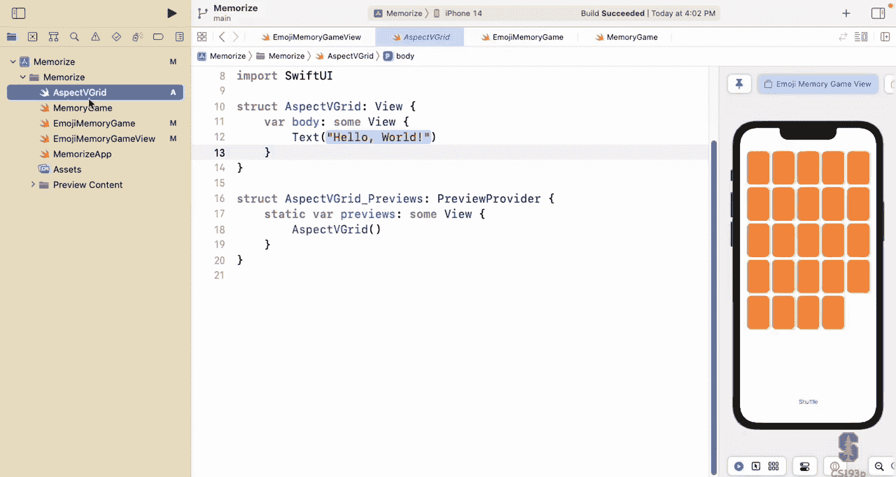

This aspect Vgrid I could do it as a custom layout remember I told you that there was that thing where the dance of how much space you're offering。

 what size are you and I'm positioning you that to do that you just say that your aspect V gridd implements the protocol layout now a layout is a view so you're still behaving like a view because the layout behaves like a view and when you do that if you want to see what it looks like let's go here where it says oh you don't conform and let's look at the protocol stubs。

And I'm not going to implement this， but you can see what it looks like。Size that fits。

 here's my sub viewss here's the proposed sizes here I'm after the fact being asked to place my subviews based on their proposed size I see what I'm see how it works there this is all the mechanism really just these two things now they're being called back and forth you're being calling them trying to size them they say no you offer different sizes back and forth you keep working on it until you get what you want as as close as possible and then you place your sub viewss there and then you can size yourself everybody can do that。

So that's what it looks like， but we're not going to do it that way we are going to implement our aspect Vgrid in terms of our lazy V gridd because we've already written that code so we'll just use it。

This is what I mean by that I'm going to go back to my view here and I have all of this junk。

 look at all this junk from the geometry reader all the way down to this for each。

 I just want to get rid of all of that。Cut it out of there。 And instead。

 I want to say aspect the grid with these cards， with an aspect ratio。Of my aspect， ratio。

And then all I really want to have in here is my cards。

See how beautiful this code would be if I only had an aspect V gridd。

So let's go make that aspect re gridd and we go back here to aspect B gridd， it has a var body。

 just some view because I'm not using that layout thing， I' just going to paste what I just。

Coopied out of there into here I have to fix this up a little bit because it's referencing things like my view model my aspect B gridd can lay out any array of things it doesn't have to be cards or anything it's a generic ht like thing so I'm going to have array here called items which is gonna be array of some don't care I don't really care what they are so let's put our don't care we all hopefully familiar now with don't cares so I'm going to use those items instead of my viewmodel cards where I say viewmod cards here I'm going to say items count and same thing over here my4re I'm going to forreach over the items。

And let's put some curly braces in here。Grid item with that fits， let's go grab that。

 that's the function we wrote that does the math。那。TR。Little emoji memory game is looking really。

Nice， right here。Go back to grid， put that is a function in here。This is item in。

Now we've got the dreaded error failed to produce diagnostic for expression。

 please submit a bug reports when you get this， this are one of the most frustrating things to get into GI actually what this is saying is there's some problem inside of your view builder。

 but since it's deep in a view builder， I can't tell you what it is。

This is one of the reasons we try to have nice small little you know computed vars and functions for all our views。

 not these big massive things we want to break it up into a little pieces like we did in the very first lectures。

 remember we broke everything down like when we were doing the plus minus buttons and all that we broke everything down to one in two liners that's why if we have a big one with a lot of lines we don't know what's going on Now I happen to know what the problem here is this aspect ratio right here is not defined that needs to be an argument。

To my aspect v grid of course I'm going to have I'll have it be a bar aspect ratio it's a Cg flow and I'll have a default to one even just have an nice default why not that fixes that down here we got another problem This one at least we know what it is right referencing initizer in it on a for each requires that item conform identifiable that's what for each is do they for each over identifiable things So this don't care that we have up here it has to be an identifiable where item is an identifiable。

By the way， there's another syntax for this， if you don't want to do this where。

 if you just take this and pop it in here， then that means the same thing。

So that's aspect B greaterd has a don't care that has to be in identifiable。And it itself is a view。

Now， if we go back to our memory game view， we're almost there。

 we'd have to put items as the name of this argument。

 but we've got another argument to our aspect V grid that we're doing nothing about。

 which is the card view to show for each of the things in the aspect V grid this is the thing that's on the end of an H stack It's on the end of a V stack It's on the end the Zt it's the thing we want to be a view builder It's the view to use for each of the cards that the aspect B grid is going to do So how do we pass this argument right here。

Let's go back to aspect B grid， it's going to be some argument， so it's got to be some var here。

We'll call it content。 How about that and what type。Do you guys think this v is？How about。

A function that returns a view。What we're getting there。

 it is a function that return to view for sure。But a couple of things about it， one。

 you can't say returns of view because view is a protocol。

And you need a concrete to type there an actual type。 And you might think。

 well how about if we say some view okay， I we do our body， but there's no。

Currently brace thing to look in and see what type it is。 so can't do that。 can't do some view。

 So you know what we're going to do here。 This is going to return。A don't care called item view。

 So I's looking add another don't care up here。 item view。 And it's going to be a view。

 something that behaves like a view。Now there's one other thing about this is that I need to pass the item that I want you to make a view for me here along。

 so this has to take an item as an argument。So that almost is what it looks like inside ZStAC and HStAC when they're taking that content argument from you。

 they're just saying give B a function that returns of U and for HStAC and V stackack it has no argument for for each。

 it has the same thing and it does have an argument for each has the iteration variable being passed you and our aspect B grid also has that iteration variable that we want't passed。

if we go back to here， oh my gosh， it compiles。Because here is a trailing closure that takes one argument passing it。

 I'm giving you a view。This is identifiable， we satisfied all of our constraints on our dot cares up there。

You see， I'm setting the aspect ratio of my card view here。

 but I'm also forcing that aspect ratio on the B grid。

 So let's let the B grid do this aspect ratio setting on the view。

 I going take this aspect right here。Put it over here on this thing inside of my view。

So what goes in here this for each， I'm doing four each over the items。

 I want a view for each item here and real easy， I'm just going to content the item and do that aspect ratio。

We worked。Content is just a function that takes an item and returns a view for it。

 so saying content of item gives me a view， I said it's aspect ratio to match the aspect ratio I'm doing the calculation on。

挂了。Any questions about that makes sense？Oh， back here。

 why did we get rid of the outside view buildder here because we're just we only have one thing in here and so it's just returning it so it's normal function doesn't need the outside viewbuer。

 although I'm getting to that because I'm going to make it neat in a second。

Any other questions about what we did so far here？All right， so let's talk about what she said。

We don't need an assignign view builder here on our cards。

 and actually we didn't need an assignign view builder here either because this card view is just one view。

returnsturn it， there's really no need for a view builder， if you want to really think about it。

 this is just the same as saying return card view。So this is a normal function。

 this is not a view builder and if you look over an aspect Bgri there's nothing that would say that it's a viewBuilder over I don't see the word viewBuildder over here so it's not and that means if I tried to do viewBuilder things in here like watch this let's go back and put our VStack remember the VStack that we had when we had the card view and the cardss ID when we were learning about identifiable。

Remember that we have these little Is， they one A2 B。 What if I said， well。

 I only want to see the A cards I'm debugging in， I just want to say if the cards ID last last is something just gets the last character equals B。

 then show me this otherwise I don't want to see it Now let's filter out the A。呃。

Fail to build doesn't work。 we get this directeded can't conform to view。

 that's because this is no longer a view。 In fact， this is not even returning anything at this point。

 it's just kind if it never returns anything。But it is a valid view builder。

It's got just if ends and lists of views， so we need to make this function。

 take a view builder and then this will just work。So how do we do that we go over to our aspect V grid here's where the function is it's this var I's going to mark this var as an atign viewBuilder atign viewBuilder works not only for vars where you're the computer properties but vs that are passed into something also can be marked view builders and when that thing is passed in the compiler is going to run the viewBuilder magic on it and look at it and interpret it as a view builder and turn it all into a single view and so this is going to get turned into an underbar conditional content and inside it's going to have a card view。

Or v stack actually， do you stack with a card view and look， only the bees。See， no A's over there。

Perfectly。Now there's one other problem I don't like here， you see this as items。Really。

 it'd be nice if I could do that thing where I don't have to say items。 Wouldn't that be cool。

 yall remember how we did that， We go over to our view and we just created an init。

 So I'm going create an init here and gonna fix it up a little bit。

 my items are array of items and this function takes an item returns and item view。😊。

One thing I'm going to make sure I say here because I know that some of you are confused by this。

 is see I say self dot items equals self dot aspect ratioity self。t content。

 I see a lot of you in your inits in your assignment saying self dot something equals all the time in your inits。

Totally not necessary the only time you need to say self dot items equals something is if you're going to say it equals items because Swift needs to know when you say items。

 do you mean this items or do you mean this items？You see and self dot items is this items。

 the items on myself and this items is this items， so that's the only time you need to do self dot thing equals is if you're setting equals to the same named thing it's just telling the difference。

 otherwise you don't need self dot。And then I can just do my nice underbar。There we go。

 right underbar items， and that should work， right， Let's go back over here。We're back to。

 type cannot conform to view just as if it doesn't think this is a view builder anymore。And in fact。

 it's not a view buildder anymore because our init does not take a view buildder as an argument。

 so it's passing this through as a normal function and so it never gets view buildderized by the time it gets to that atign view buildder v it's been deVi builderized because it's been passed through。

 but we can make it happen by just saying that this is an atign view builder argument now this argument will do the view buildder processing when the thing is passed through。

And in fact， if we do it this way， we don't need the one here anymore。

Because viewBuilder processes all the information inside of a function， turns it into a viewBuilder。

 it really kind of creates a new function that returns to view。

 and that view has got Table view content conditional content， all that stuff in it。

And that's the function that gets set into that content there It doesn't hurt to have this viewBuildder thing back here because this view buildder thing that this build is compatible with assigning it to a var that's a view builder obviously。

 but it's not necessary if you have an in so we've seen three places that view builders can go on functions on the arguments to functions。

 which will make it so when the function is passing。

 it gets view builderized or on vrs that our parts obstruct in which case when the var gets assigned。

 it'll get the view builder treatment。And we can go back to this and get rid of all this extra stuff we put in here。

It still works fine because this is still a view builder。

The reason I show you all this is I want to give you a little exposure how this stuff view buildder and the arguments does DStack and how those things are actually working I'm not showing you this because you're going to have to do this in this class you will not be building your own aspect V gridd but you'll be using a lot of Htax and VStax and lazy V gridd and now you understand how they work and the same things can be true on Wednesday say we're going to talk about viewmodifiers right we have all these view modifiers how do those work。

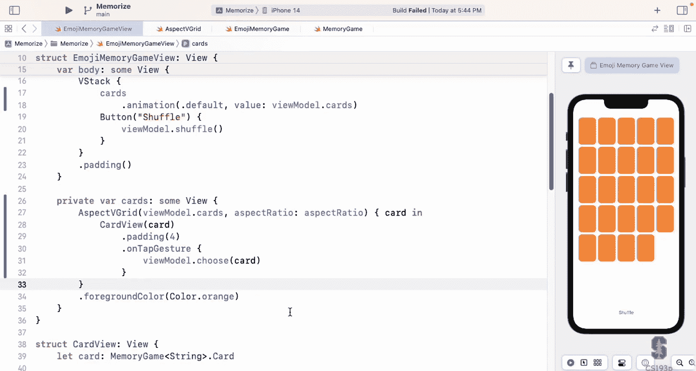

I'm going to stop there what we didn't get to today， we didn't get to drawing your own custom shape。

 you will need the shape for a very small part of your assignment three so you can start on your assignment3 and just don't do the custom shape part。

 just do some other shape until we go over it on Wednesday。

