# 斯坦福大学《SwiftUI的iOS应用开发｜CS193p Developing Applications for iOS using SwiftUI 2023》 p07 -07-Lecture 7 _ Stanford CS193p 2023.zh_en -BV1HyzNYdEiD_p7-

All right。Today what are we doing today we're gonna to start with a little bit of demo's like a demo interlude I call it here。

 which is I want to take card view and separate it out into its own file because it's getting significant enough that it doesn't really want to live inside of ouroji memory game view and also we're gonna show you a little bit how to deal with constants and Swt because we're starting to accumulate some magic numbers in our code and we want to start being good about that then we are going to talk about another couple of things you can see the theme this week has been I'm trying to show you how things work behind the scenes last time it was how the whole layout engine works and how view builder works and today I'm going to talk about shapes like rounded rectangle how do people write those and then I'm going to talk about another behind the scene a huge one which is viewmodifier right our UI we're just view modifiers everywhere we're calling them how do those work。

 how does one write of view modifier and all that and we have demos of course memorize for everything let。

I'll do this little demo interlude here。And it's real simple， I have my card view it's down here。

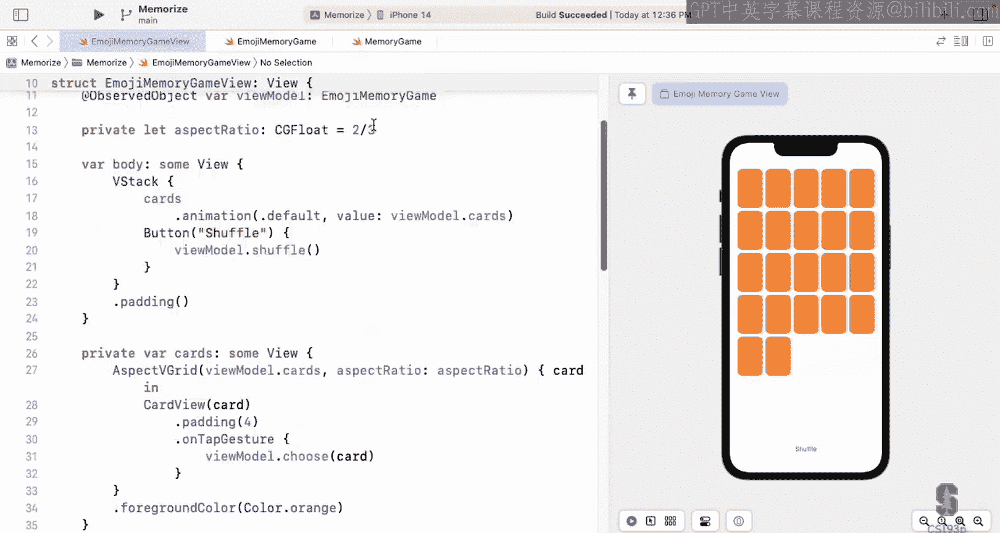

Stuck inside of my emoji memory game view， I'm just gonna take this card view and put it in its own file super simple right file。

 new file， really already know how to do this。 The card view is the Sw UI view while I am going to pick the one in the lower left corner there I'm going to call it Car of view and of course I'm going to make sure that I'm not at the wrong level here。

 I want it to be down a level with all the rest of my stuff and I want to choose the right directory here so don't forget those and I hit create。

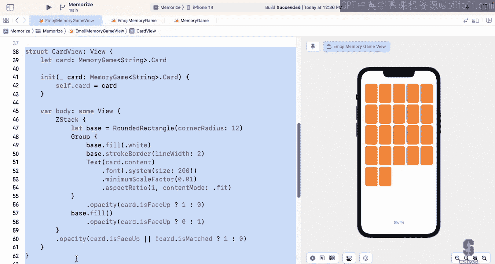

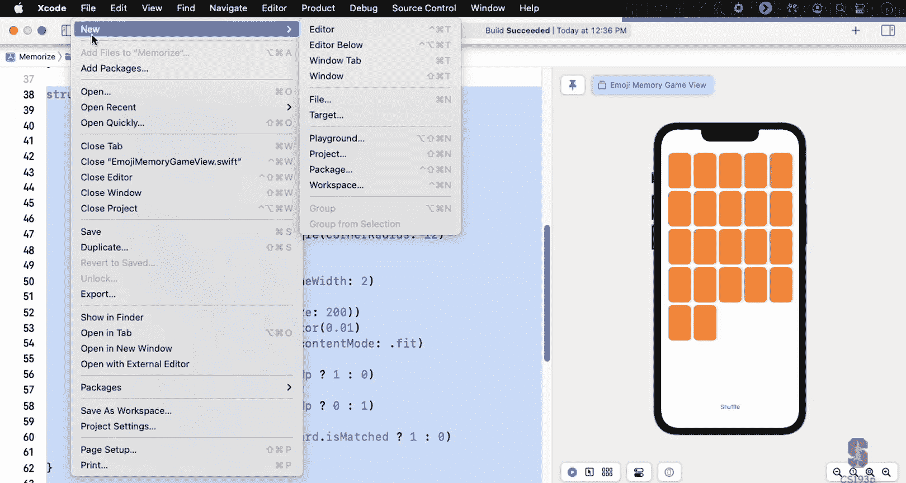

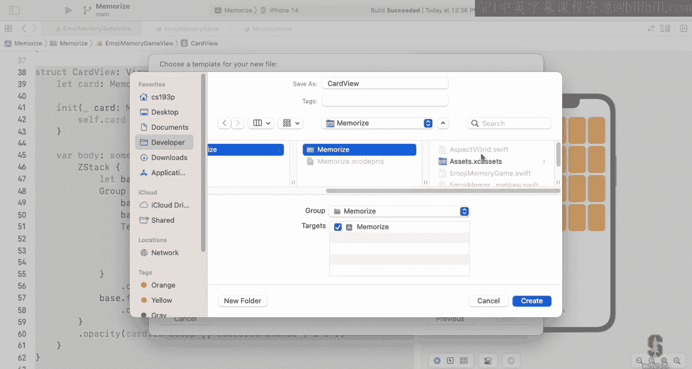

You can see it's created my Car view and put it in the right place thankfully。

 and I'm just going to go over here to memory regain view， got my card view already here。

 you see it's already complaining that I have two versions of Carview so let's cut this one out of here and replace this over here with that one。

And that just works。CardViPstruct and putting in another class has no effect on its usability because of that。

 One thing， however， is we have an error。 and it's this error down here。

 The preview is trying to say， please create a card view for my preview。

 but we know that Carview actually takes an argument， which is the card。 here's already knit。

 we have to provide a card， we can't just call a Car view without a card。 and we want to anyway。

 because just like we have a nice preview of our game。

 we want to be able to have a preview of a Car view。 Now， when I did aspect Bgrid， remember。

 I just commented out or deleted the preview。 you know， aspect Bgrid is a combiner view。

 and so you have to come up with some fake data to do it whereas Carview is not Carview is just a real view that's showing something。

 So we should put something in our preview that is at least minimally testing it out。

 Now this is a demo。 So I'm not going to put a whole ton of stuff in there。

 But let's just go down here。

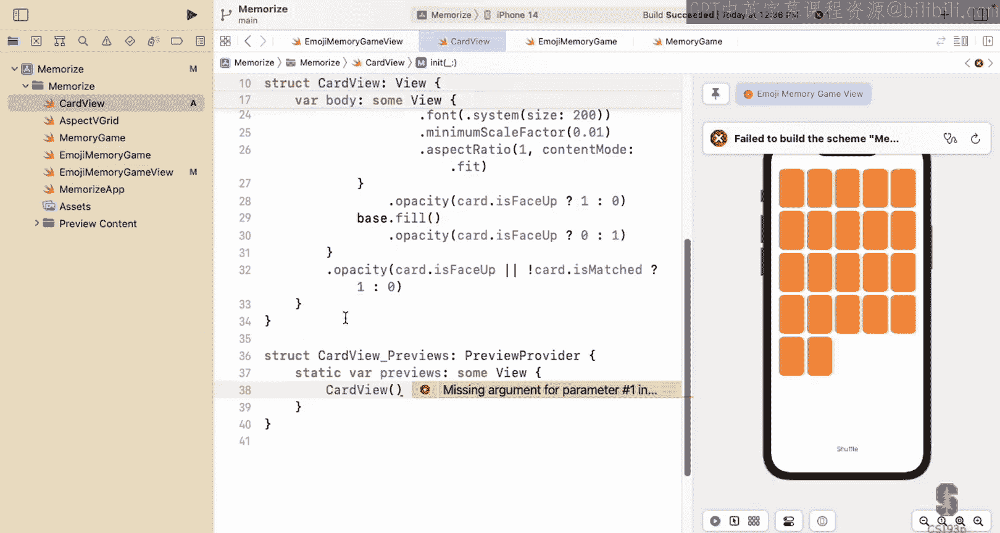

And put something like， I don't know， we can create a card right in places we have a memory game of string。

 card and this is the constructor for it right there。

 you can see I' me go ahead and tab and let's put some content how about this letter X and we need an ID is required。

 so maybe test1 because this is preview a preview test。

And so it should be showing our card view or is it I don't see it here。 Well。

 we have this one pinned still， so it's showing that one， but look up here。

 here's our card view It showed up as another thing we can click on。 So here it is。

 Here's our card big black face down card and maybe we can see it a little better。

 if we throw some padding around it。

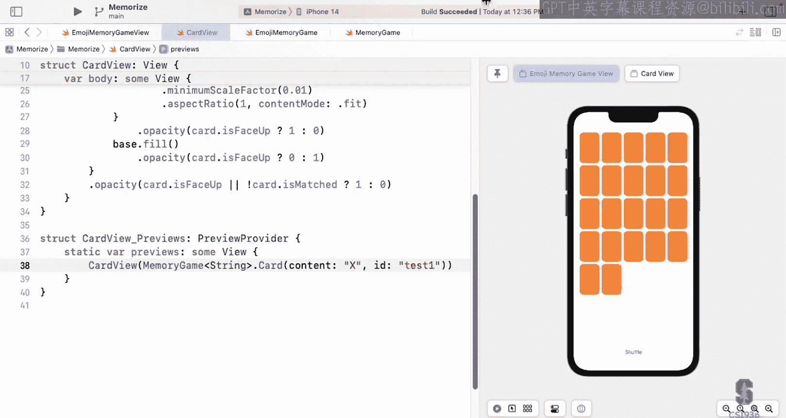

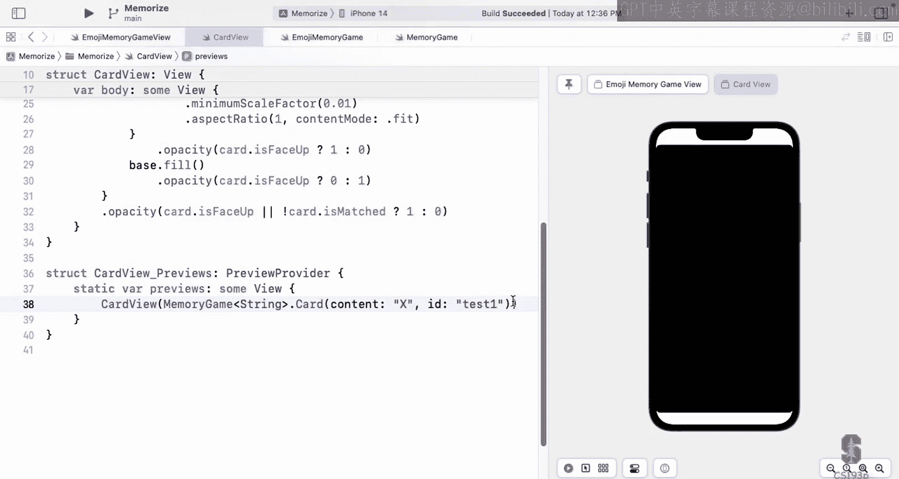

Maybe we'll make it a different color or ground color， green or something。

 so we can look at it and putting padding and color and stuff like that in your preview is normal because you want to be able to at a glance。

 make sure you haven't broken your card view as you're working on things here。

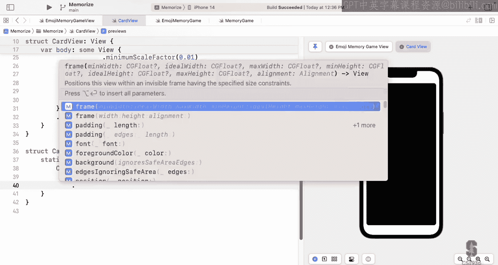

Now， one thing I do notice here is that I'm kind of getting tired of typing memorygaof string card everywhere。

 that's an awful lot of typing。 really， I just want it to be the card and there's a way to avoid all that typing which is to take this commonly typed type and make eight type alias for it。

 I'm gonna call it card and it's just going to equal memory to game of string do card and then down here I can use that type I just alias called card to create my card view So type alias are a great way to take especially when you have generics and don't care and you end up with these long things to zip zip them down to something nice Of course type alias really almost create a new type it's identical to the other type and it's namespaced So the fact that I did this here doesn't mean that I can like go up here and just say。

Clard right here。That's not going to work， this is going to get an error。

 cannot find type card because it's namespace down to the preview， so if I wanted to do that here。

 I'd have to put this type alias up there as well。Now some people are tempted to make a type alias like that global just put it at the top level outside of anystruct which you can do。

 but again， if you were writing an app that had multiple card games like maybe your card game from assignment3 that you're writing and memorize well the cards might be different and they both might call the thing card and have it be nested inside their model or something like that so you don't always want to just go global here it's almost better to put the type alias where you need it and so let's go and use it here though it's good place for it where else do we use it let's go search see if we go over here to the search we haven't done any searching so I'm just gonna to do it and I'm gonna to search for memory game of string do card and see where else we use it and the answer is we use it here right type alias here typey alias good Oh over here in our view model our view model use it a couple times this is another place where I probably。

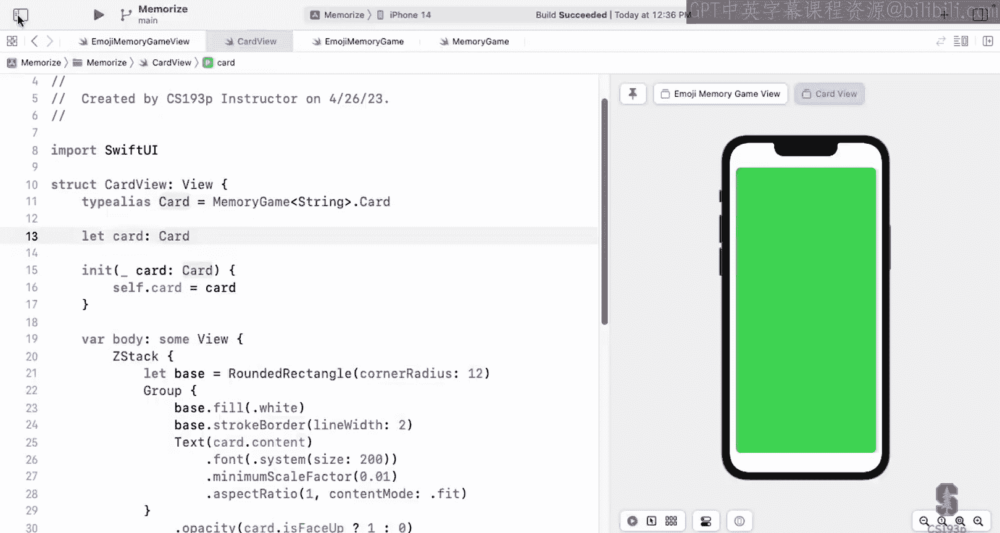

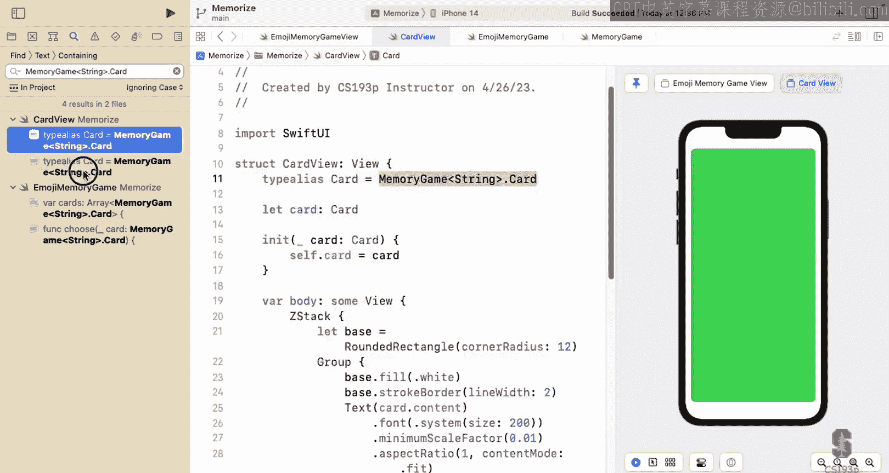

to put this's good。Put that out and put card there。Go up here to put type alias。Card equals a memory。

 game of a string， dot card。I'm using it enough， I think in here that my code will look a little nicer don't you agree if I put it there？

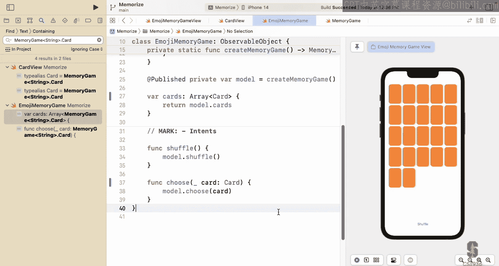

Now one other thing is that， like I said， this RAs a new type。

 so if I go back to my card view down here in my Car view previews。

 I might want to call this one instead of memoryga of string。card， cardview。card。Which might seem。

Kind of weird， but this is the preview for the card view so it makes sense to alias that to be Carview。

 card and that type alias cardviews card that we didn't make it private。

 we could have could have said private type alias and it wouldn't have been available but we didn't so I can use that like this。

So let's type aliases。Well let's go back to our preview here， we've got one card right here。

 let's go make some more cards， I'm going to copy and paste this。

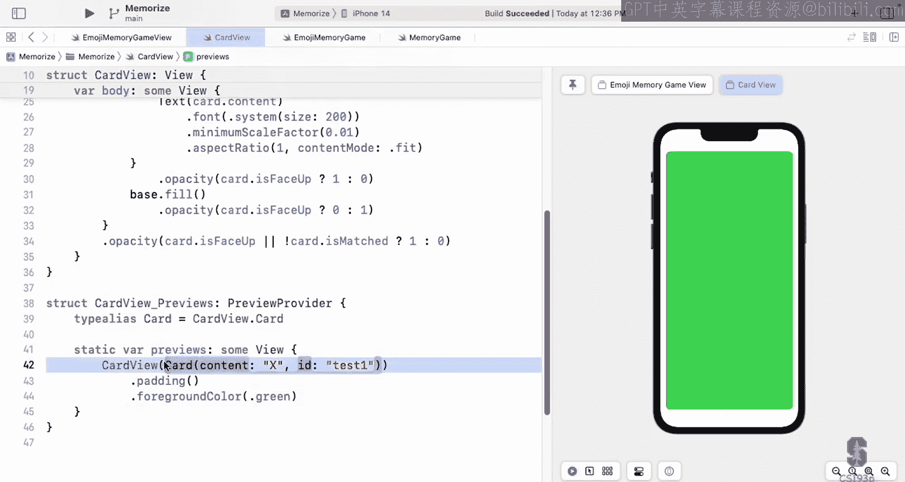

And let's put it in an H stack， maybe。

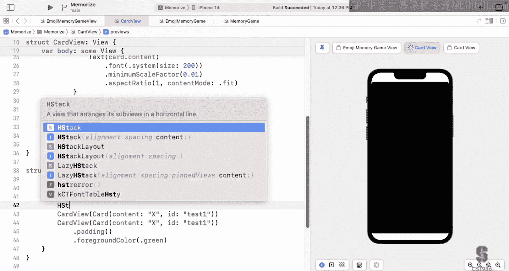

We're totally allowed to do this， our preview can be anything we want and this card。

 let's make this one face down， is face up， it actually we'll make this one be。Face up。

Ill put this one first， actually。So now I've got a face up version of card and a face down version of my card so again I'm trying to have my preview show me what is going on。

 how about also the matched so let's take these this and make another H stack and down here。

 let's say is matched。

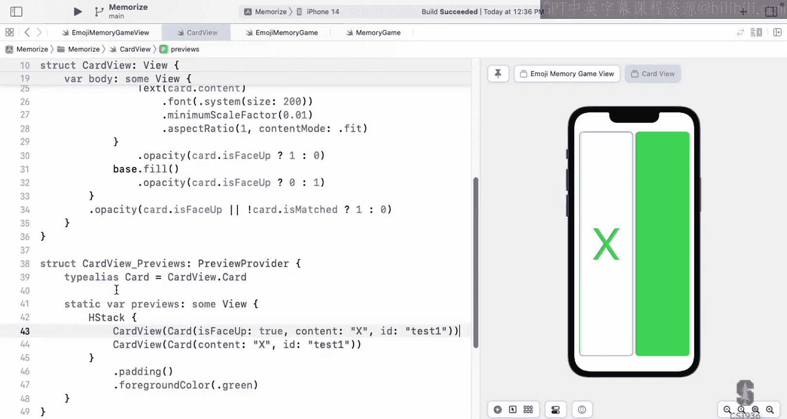

It's true。 So on the cards to the bottom。Is match。It's true。And these two H stacks， of course。

 right now it's built two different previews， one for each of those H stacks。

 and that's kind of cool， but we could put them all on the same screen by putting them both in a VStack。

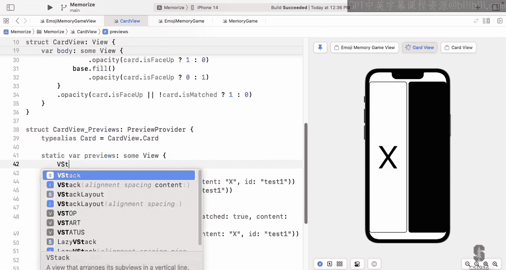

So that's kind of fun a way to look at it and we could try some different things in here likely we might actually generate this from some data or algorithmically try to do every single possible version right every is face up every is match different kinds of content for example we might try some content let's say instead of just saying content X where we say this is a very long string and I hope it fits we can see that's kind of cool it's fitting it in there our little aspect ratio one inside there。

 although I noticed there's a couple of things I don't like about its kind of right up against the edge and it might be better if it was centered so let's fix those problems to back in our card view up here so centering it is just a matter of another one of these little text things which is called multiline。

Text alignment about centered that centers them there and we might also want to go here and say dot padding maybe five or something like that give us a little bit of padding around the edge and again we would probably enhance our previews to test as much of this as we could so that anytime we want right we're looking in our game over here and it seems to be working but we can always just jump over and say well is our card part of the problem if something looks bad we can just click here and hopefully look in our preview。

I got that。Kind of a little microcosm of how you develop a view。 Usually put it in its own file。

 It gets a preview， start doing some test cases in there so that you can quickly look at it。 Now。

 this is not UI testing。There's a whole other mechanism which I'm not going to get to this quarter which is too bad。

 but there's an incredible built-in mechanism for actually testing your UI。

 right having invariance and running the UI and actually seeing if it's doing what you think。

 but this is a quick way to just see， oh is that working。

 it's kind of testing light if you want to think it that way。

Again down here we could do other things too， maybe I want to see what does it look like with an aspect ratio of four by three or something like that。

Can do that too and have that in there。All right， the next thing I want to do is talk about constants because we have a lot of constants building up here。

 and we actually did something with a constant back here in our emoji memory game view。

 which by the way， this is our entire emoji memory game view。

 very concisely drawing our entire systems because we've factored out things like the card and the aspect V grid into other small little pieces。

 again， I can't emphasize enough。 break your UI up into small little pieces。

 That's the way it's supposed to work。 That's what it's designed to be lots of small pieces。

 not gigantic views with。40 lines of code in their bodies。

 that's just not the design methodology for Swt UI。

So here we had a constant there aspect ratio you can see I just said private let aspect ratio is two thirdd。

 that's a perfectly fine way to do a constant I have another one right here。

 you can kind of find your magic numbers they're blue so if you search through your code and look for blue numbers。

 it'll help you find them but there's one right there padding maybe I'll call that something like my spacing。

Put up here， private let spacing， it's also a CG float equal4。

Now this works when we only have two I guess is that all we got yeah that's all there is there's no more blue numbers this is great but what about something like Carview that has a lot of blue numbers look at all the blue numbers here that are in Car view CarVi we want to be a little more verbose about our constants and not just have a string of you know seven or eight you know let you this let that and here's how we do it this is the way we do it and I have told you I don't really like to do this too much but I'm going to which is the quick fill in and if you're following along you don't want to type all that in just skip this part where we're in constants you can go back and put the constants in later。

But the important thing to understand here is that we do these concerts with privatestruct。

And all we're trying to do with these constants is namespace them and type them because they have column C flow their type。

 but since these are statics， remember that the way to get at of static is the name of the type dot the static name。

 so these things have all gotten namespace into my constant structure and I've even subnamespace some of them with my font size down there。

So how do I use these， well， let's go over here， here is the corner radius， some more space。

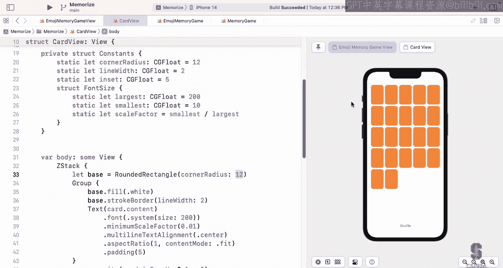

And this corner radius is just going to be my constants。Dot corner radius。

And same thing here if I line with。Students do line width and same thing down here。

 even with this padding。Constance dot inset that's the inset from the edges of my card。

 and this guy right here， this is the largest font I'm willing to allow 200 points。

 That is Constance dot font size dot the largest。This  point。

01 is actually the constants do font size do smallest。Dived by the constant do size dot largest。

That's what that is Now that's making my code wrap right there and if I'm reading this code I have to like what is this so I could put that code up in here What if I just have used this scale factor that I've said smallest divided by largest and here I don't have to do the font size dot because I'm inside thisstruct so you don't have to give the full names here。

 then I can say constant font size dot scale factor。

Thesestructs give you a lot of flexibility because not only can you do this and do little calculations。

 you could have functions in there too， constant functions。

 functions that are taking some data and making some constant calculation。

They also force whats in here to be constants because their ownstructs inside yourstruct。

 so they can't see any of your vs that are in your outer struct。

 so they can't accidentally depend on something， they have to be constants。

There there's a lot of benefit from doing things this way I also tend to put my constants。

 this is probably a matter of personal preference but I tend to put them at the bottom of my struct and the reason I do that is of course constants are important they're what's driving the settings of my UI but once I get them tweaked and set where I want then I want them out of the way I don't really want them to appear when I first appear in my car view look I want to be seeing my in and body kind of the main parts of my view。

You see that there's still blue numbers here， look at this 1，0，0，1， those are blue numbers， also。

 what about this？White。Isn't that kind of a constant。

 a constant color and what about also color wise back here in our memory game。

 there's this foreground color orange。Absolutely you could put these things in your constants。

 there's no reason you couldn't say static lead color， colon type color equals something however。

 white and black and also some of the other colors like back color。

It's not clear that you're going to ever tweak that。

Maybe you would if you ever think that your card might want something besides a white background。

 then you would want to make this a constant， but black and white。

Tend to be almost like one in zero where they're not really meaningful constants。

 so a lot of times you'll see one and zero， especially with opacity。

 this is really just like saying opaque and fully transparent not be put in your constants it's up to you。

 but you sometimes see that。And then a color like orange over here this。Could be a concept。

 but actually I claim really this wants to be view model do color I want my view model to be in charge of the color of my card so I'm going to go back over to my view model here。

Bar color， the type color， and I'll just return dot orange for now， don't need the return here。

 In fact， I don't need any of these returns in these one liners。And then I would use that over here。

 the other thing about this color， I don't want to really bury this inside this cards bar。

 I'm going to elevate this to a higher level because it's really something being driven by my model and I want it to be right up front that that's what's going on up there that for ground color so you can sometimes emphasize things by how high up the view hierarchy you bring them you bring them up towards the top。

 they're going to be in peoples space is if you bury them down the bottom people might lose them not really where do I set their card color again it's down in that bar inside that bar something to think about there also in terms of scoping constants and things like that。

All right。Let's go back to our slides。And talk about shapes。So shape is a protocol。

 it inherits from view， so everything that is a shape is also a view。

 bounded rectangle and all those。And。You've seen some shapes already circle and rounded rectangle。

 but there's other ones， capsule and non rounded rectangle。

And shapes draw themselves as you've learned so far by filling themselves with the current for ground color by default。

 but we stroke and fill on them， we'll fill with arguments to change that these stroke and fill modifiers。

 they are shape modifiers， not view modifiers and they are essentially little functions that take a shape and。

Stroke it or fill it to create a view， so they convert a shape into a view essentially by stroking a fill filling it。

 now I told you the shapes are already views and they are they serve as views that are filled That's their default behavior。

Now I want to look at the arguments to stroke and fill here。

 these things that convert shape into a view。And it looked like Phil， for example。

 took a color right we said Phil got white to fill the background。

 but you actually it's much more powerful than that。

 The function fill that works on shapes is actually a generic function。 and we haven't seen this。

 I don't think I've shown you this。 but this just like you can have instructs and classes that have don't cares。

 an individual function can have a don't care and this function fill has a don't care called S and it's the type of the argument to it and it's not really a don't care。

 It's a care a little bit because it's got where S is shapet So a shape style is something that knows how to take a shape and do something to it to turn it into a view and some examples of shapets are colors。

 they know how to fill it in with that color image paint will paint an image into the shape angular and linear gradients will draw gradient color gradients inside there to make that happen。

But I'm mostly showing you this so that you know that generics are not just forstructs。

 they can work on individual functions where you have a don't care。

And we're going to see this one again down the road here， but I just wanted to introduce this to you。

What if you want to create your own shape Well the shape protocol implements var body for you so when you're implementing a shape even though it behaves like a view because a shape behaves like a view。

 you don't have to do var body the shape protocol by extension and we haven't talked about part two of protocol so you don't really know how extensions are used to make this work but we use extensions and an extension to the shape protocol implements var body。

 but in turn it adds something that you have to implement which is this thing path in。

So path in is like the var body if you want to think of it that way of a shape and so the path is really just a little object that you're moving and adding lines and arcs to as you draw your shape。

 whatever it might be a diamond shape or whatever and you just have to build it and return it do that any way you want I'm not really going to talk about all the things inside path that you can do lines。

 arcs， busyier curves， all these things you got the documentation for that I'm more going to focus on how we plug all that into a shape。

And that's best shown by demo， so let me show you what we're going to do。

By showing you what we're going to do next week， this you recognize is your memorize app。

 this memorize app has had animation added to it it's got a lot of animation so keep your eyes out and you're going to see a lot of things flying around on the screen here because next week we're going to spend the whole week doing animation。

But one of the animations we're going to do is a little countdown timer when you flip a card base up。

 that starts counting down。And it's really encouraging you to pick the cards faster because you get more points。

 the more the thing counts down， the fewer points you get by the time you match it。

 so let's watch it do that。Can you see the countdown timer behind it？

Counttain down right there so I let echo go all the way down so I'm not gonna get very many points even if I match it let's flip there now when I flipped back that one itss timer stopped And so here I click that and did you see a little plus two fly up that was saying how many I got so So let me try and be a better that was good plus 13 popped up now watch this I'm going to be bad and pick when I already passed minus-1 fell down that's the same scoring as you guys had if you have a mismatch it goes down。

So that little round pie that counts down that's why we're going to build we're not going to animate it today but we're going to build our own shape that builds like a little pie one other thing that's happening here of course we have our shuffle animation also the card flipping look it's not dissolving it's actually flipping over right the card is flipping over so we'll be doing a viewmodifier later in this lecture and we'll animate that next week because all animation you're going to find out happens inside viewmodifiers and that's how we're going to do that。

Let's head over to our code and implement this little beauty to do this so we can see what's going on。

 I'm actually going to change the number of cards I have down to。four cards。

 and we're going to have them all be face up because we're going to put the pie on there and when we put the pie on。

 we're going to want to see nice large version what's going on with the pie there。

Let's just start by taking our card view， which I happen to have on screen right here you see that's our card view。

 I'm just gonna to put a circle in there instead of the pie so let's put a circle and this is a ztack so these are grouped but it's still a z stackack and so I just pop the circle behind the text in those ztack we're almost done Okay really got it now it's not a pie。

 but it's a circle and it's there now this bright orange a little too bright and it's not you know the timers not that important so let's take the circle and add a little bit of opacity how about 0。

5 that's pretty good it could maybe go down to 0。4 see now it's a little bit it's transparent。

 a little bit lighter weight back there we can kind of do whatever we want to make that look nice Another thing I don't like my pie is right up against the edge that's not so good so let's move that that we have some extra padding you see this padding that we have down here。

Use that。I could put this in a Z stack， the circle texted here。

 but we already learned about member dot background and dot overlay。So in this case。

 I'm going to overlay our text on top of the circle。

And it also makes our code look a little nicer there as well。

The only other thing maybe is you see how Mr。 Ghost he's right up at the edge to。

 maybe I'm with some padding in there there's also so let's go here and say stop padding maybe five is that enough yeah just just to get him in the edge and some emojis might be so large they're going to stick out but you know this is probably a good size we can play with the padding later and really that padding should be a constant so let's add that let's go to our constants down here add some more constants。

F constantstance。For the opacity and for that inset right there， this five is constantsance。pi。

inset and this opacity up here。Like I said， 0。5 down there。

 but that's fine constant do pi do opacity。Now we want to actually build our pie。

We're going to build our pipe by making our own shape， go up here， we're going to say file， new file。

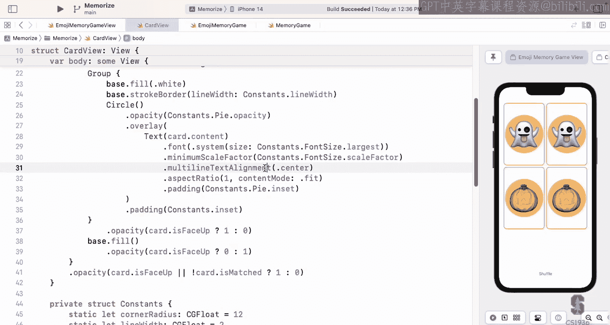

And it is a view but it's a view because it's a shape。

 so we're actually going to pick Swif file here， not Swif UI view the Sw UI view in the lower left that just means you're going to get that preview thing at the bottom that little st the pre we don't want that for a shape so I'm going do that I'm going gonna call my shape pie it's a little pie shape and to make sure I put it in the right place。

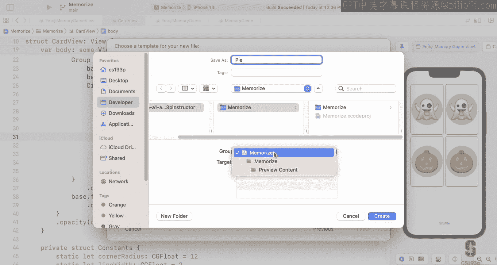

Now we have our pi， here it is， it's a UI thing of course。

 so we're going to change this to swiftift UI and it's just astruct pi and it implements the shape protocol。

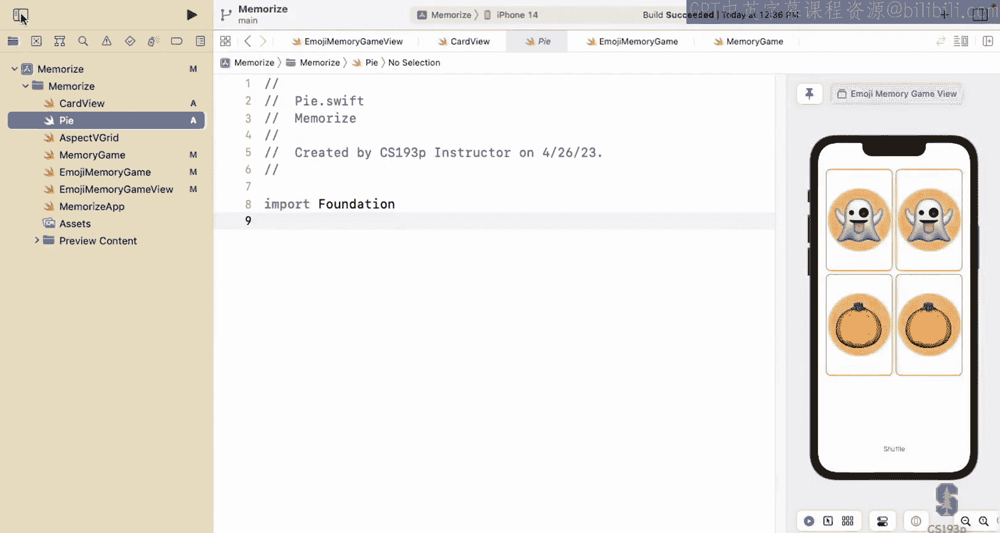

Whenever we do a protocol， we always get this thing when you don't yeah you said you are shape but you don't actually do it and we always love to go here and say fix and most of the time this works and this time it did but later in the lecture you're going to see it doesn't always work so you can't rely on that 100% but it does work for shape。

 which is good。Let's look at this path function that it wants me to build。

 I told you it wants to build a path， but you see look it's also got in that rec right there。

 that's the rectangle， this purple thing in my graph here that you're being asked to draw in and it could be any size be asked to draw in any size we're going to be drawing a pie a pie is like a circle so it's going to draw in the middle。

One really important thing to understand about this rectangle and your drawing coordinates that you're given here is that big purple dot in the upper left。

That is your drawing origin。Now you're used to Cartesian coordinates where the origin is here。

 and this is positive x， positive y， but when you draw an iOS， your origin here， this is positive y。

 positive y is down。That takes some getting used to for those of you who are used to Cartesian coordinates。

 it'll take some getting used to and you're going to see how it has an effect on this， it's minor。

 but it will have an effect， so just be cognizant of the fact that that is your origin over there。

Other than thats pretty easy， we just have to draw inside this rec and you're going to do that by creating a path。

 so I'm going to say R equals empty path， and then I'm going to return that path。

And then in between I'm going to do draw a line， draw Arc， drawaw Beier curve。

 whatever I need to do to draw in this drawing coordinate system that I have here。

 this upside down system where the rec that CG rec by the way I don't know if we need to go look at it but let's do it Here's CG rec in the documentation you can see it's got some initializers。

 origin and size， it's got origin and size are its basic properties， origin is a point。

 size is a CG size right CG size is width and height。

 you can look through all this is exactly what you would think there's nothing particularly special about the rec。

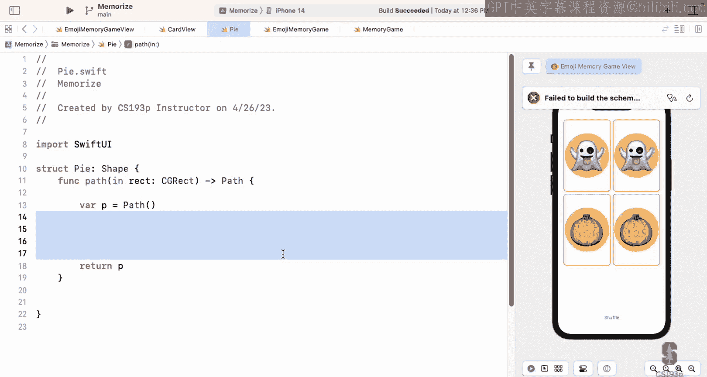

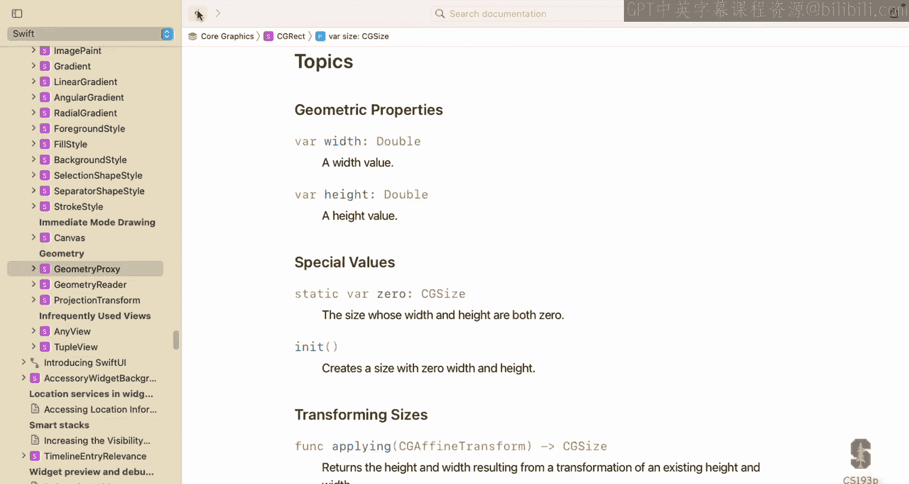

We're going to use that rack， though， the coordinate system to figure out where to put everything in our path。

Let me show you this picture that I drew before class。

I'm essentially going to have my pi draw from some start angle around to some end angle。

 and then when we animate we're going to animate that， the start angle will be fixed。

 but the end angle will just be animated。Here's my center I'm going to need to know the center and then the start angle is going to be a certain angle off of here。

 and then the end angle is presumably far there around。

 so I would then draw this pi shape right in here if I did that。To know how to draw my pie。

 I need to know the start angle， and I need to know the end angle Those are the only bars in my pie。

Var start angle。 Now the start angle is going to be of type angle。

 It's a knife built in Sw thing called angle and angle it's got really just two things。

 You can set the angle in degrees like 350 degrees or you can do it in radians like pi over two or something like that。

 Does everyone know that you'm strain radians and degrees。 we can't do either one there。

I'm going to make this a var and have it。 have a default。 How about。Degrees0。Or radium zero could be。

 and there's actually even something for this， a built in， which is angle do0。Hes the same thing。

 and of course I can infer this， I don't really need to say that。

Now my end angle I'm not going to have it have a default， you got to give me one of the two angles。

 so I'm going to have just let end angle here be an angle so that's going to be a required argument to my shape so you give me those two things I'm going to draw this。

Now how am I going to draw it， I'm going to start in the center here， that's why I mark this center。

 then I'm going to move up to this start point right along this start angle move here。

 and I'm going to draw an arc around to this end angle and I'm going to go back to the middle。

Last I'm going to make my pie shape there。So I need the center。

 let's get the center the local variable hole let center equal a CG point， CG point takes x value。

 which is going to be my Rex middle x and a y is my Rex mid y mid x and midY are just bars。

 computed bars on a rectangle to tell you the middle。

First thing I'm going to do in my path here is I'm going to move to that point。

 so P dot move to the center。There's a difference between moving in paths and drawing lines to paths here I'm just moving without drawing on my way。

 I'm just moving there so that I can start there。Now I need to get this point。

 this start point because now I'm going to add a line up to here before I go around。

 how do I get that point？At point。Call it start， let start equal and it's a CG point and we have to do some geometry here。

 I don't know if you can all remember your geometry lessons。

 but it looks like this X is just going to be my center。Plus， whatever my radius is。

 we'll have to figure that out times cosine you ever heard of that start angle radians， of course。

 were doing。Cosine， we need radance and y is center of y。

Plus the radius again times the sign of the start angle in radance。

I'm not going to take time out to go over geometry again but。

Ptty obvious there that that's what it is sign in co-sence what it gives us our way of getting if we're on this angle right here to get up to there。

 I need my radius， the radius here is going to be the lesser of this way or this way because you see because I'm going to draw this fully fitting inside my rectangle so I'm going to check this distance and this distance and pick the shorter one that's going to be the radius of my circle。

Let's do that。喂你。Let the radius equal the minimum of my res。

widthth and my res height and divided by two because it's the radius， not the diameter。

So that's that notice that it's saying ambiguous use of cosine Swift has many packages that have cosine in it。

 believe it or not， this one that we're is core graphics so I'm going to import core graphics there are other。

Libraries that have their own cosines in there so we're just we're doing chore graphics here notice the CG Re CG size。

 CG point， that CG stands for chore graphics that's all the drawing that we're doing。

Now we've got a line to go from here up to here， how do we do that， we're going to go P。

ad line to the start。Now we've got that line， now we need an arc。

 we need to go from the start around to here。Amazingly we can say P do add arc in there a couple of different versions but we're going use this nice version。

 I'll go ahead and separate it out so you can see all the arguments and we need to provide these arguments incredibly we actually happen to have these on hand from the other stuff we did so the center is just the center the radius is our radius the start angle is our start angle the end angle is our end angle and clockwise are we go on clockwise here。

RightGo around here， this is clockwise， right going around the clock。 So one clockwise。

 we could say clockwise true。 Maybe we can even make clockwise be an argument up here， right。

 let clockwise。不。I will make it a bar and have a default。To' true even。Which means we wouldn't need。

This because it type inference。And then gone around the arc， now let's just move back。

 add a line back to the center。That's it。We just created our nice little pie。Goes around。

From a start angle to an end angle。Makes sense it's as simple as that and in your assignment three you have to do a shape。

 it's very simple to shape like a diamond or something。

 it's the how you're going to do it with this path。Right now that we have our pi。

 let's hop back to our card view and instead of using a circle up here。

 let's put a pi and if we do a pi of course it's demanding an end angle here。

 so let's pick an end angle of degrees 240， let's say。你不忘忘了。It's wrong。Okay。

 why this this was supposed to go from here around to here。

 this is about 240 right this is 27189 so why isn't it drawing around there from zero because I didn't specify why start angle so it should be zero What the heck is going on here。

Well， two things going on， one， zero when you're drawing here is not straight up and down。

You're used to that compass rows， zero is straight up and down， zero is actually out here。

 that's why it's starting right here。Now thats seemsly for us to fix。

 I want my pie to be an you know compass rose coordinate。

 so I'm just going to go back to my pie and at the very beginning I'm going to let my start angle。

Equal to the start angle I already have minus 90 degrees。

I'm going to do that for both my start angle and my end angle。

It's kind of questionable maybe whether we should do this one might argue， hey。

 if you're an iOSos programmer， you should know that zero goes out to the right。

 you shouldn't be doing compass rows， I buy that argument。 I could see that argument， but just。

For your making it easier on you guys to see what's going on I'm going to go ahead and say compass Rose coordinate for me that's still wrong。

This counterclockwise， it started up here， but whoop， it's going a wrong way。

 it's supposed to be going wrong clockwise。 What's happening here is this purple dot is getting us。

So I would like everyone out there to get out of your seats and stand on your head so that your origin is up there and then look and tell me if this is counterclockwisewise or clockwise you see it goes the other way if you're upside down and you watch it go around o that's actually going clockwise and our whole thing here is flipped upside down so clockwise is the opposite direction so in iOS when you go clockwise it's the opposite direction a Mac OS incredibly it's the other way it's really annoying but that's the way it is。

We really want our clockwise here to mean semantic clockwise。

 so I'm going to say not clockwise that the person says， and Bola， we got it， nice little pie there。

I will show a couple more things if we go back to where we use this pie。

It's possible to do that path thing in line， so I can actually say path P in and draw a path like I could say move to or dot zero。

 which is the origin and then add a line to a CG point that's let's say 100 and 100。

That makes a little path kind of on the fly， and then I can stroke it。Do you see the line there。

 just make it thicker， even have a stroke with line width of six。

See that line is going from the origin there， that zero over to 10000。

 and if I maybe maybe it be 50100。See that or if I made it be 5200。Goes farther down。

So you can just make a path， in other words， path that thing we built behaves like a view and it has an initializer which。

Ands you a path， create a path for you and lets you do your little deal in。Other thing here。

 notice if I try to do stroke border。On this name。Does not work。Why can't I do stroke border？

 In fact， can I do stroke border， Can I do stroke or stroke border on my pie， Let's try that。

 Let's get rid this path thing。 Let's just see if my pie can do stroke border。 Can I do it， no。

Stroke border is actually a function on something called insable shape。Change this to stroke。

 says stroke border so we compile pile here。AndNow if I go look at rounded rectangle in the documentation we scroll down to the bottom you'll see that it conforms to inceable shape if you look at inceable shape that protocol you see that's where stroke border is so the pi we didn't make it conform to inceable shape stroke border strokes inside your border so you have to be inceible to draw it so we didn't do that。

 but we can do stroke。

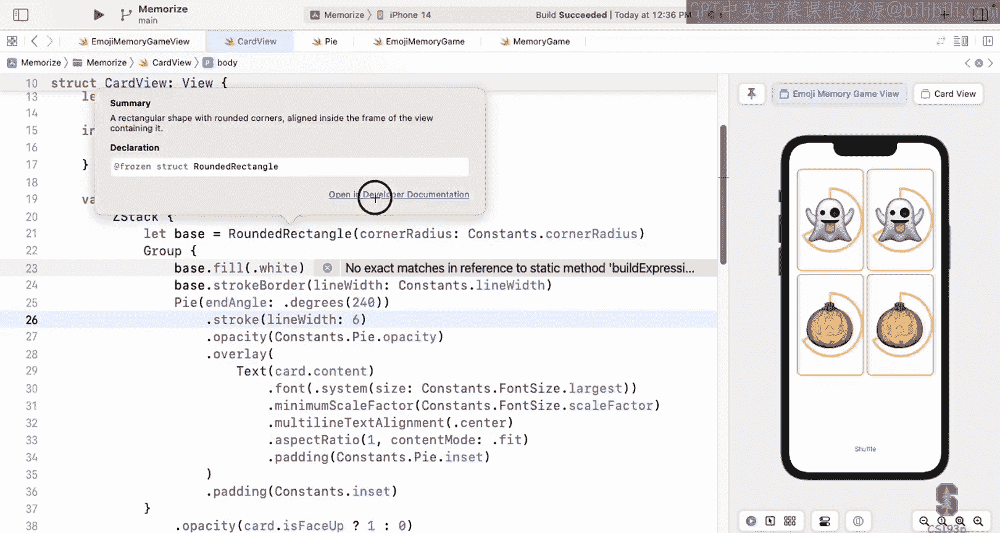

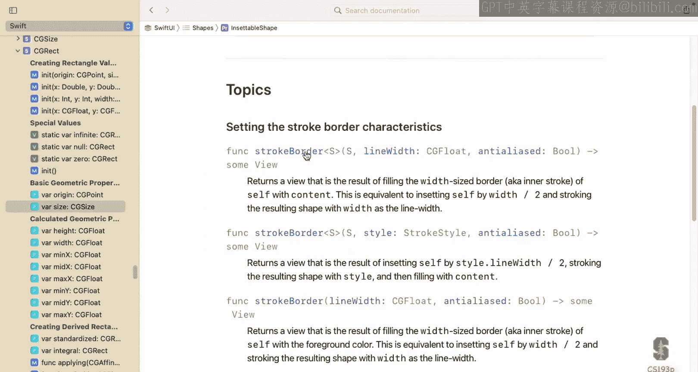

那个。And the default is fill， so we'll just take our fill。

The tip for shape should be all ready do assignment 3 for that。

 Now the next thing I want to talk about is view modifiers。

 but notice I have a little thing in the middle animation。 How does it work。

 I'm not going to teach you anything about animation here， We're going to do that next week。

 the whole week next week is animation， as I said。And one way to do animation is by animating shapes。

 so you might have a shape that's a little stick figureman and he's walking across the screen right you would have to change all those lines to move to you know as it animated so that is possible you can animate shapes。

But the other way to do it， which is really important is view modifiers， in fact。

 viewmodifiers are the only way in Swt UI to do custom animation。Besides shapes。

All of the animation that happens that is not just dissolving or views moving is done inside viewmodifiers。

Kind of makes sense because animation is showing you change。

 That is what you're going to see this me talk about this all the time next week。

 animation is just visualization of change。And so view modifiers change views。 That's what they do。

 They modify them。 So when a modifier's arguments change or whatever。

 that couldn't cause animation to happen。 and you put the code that causes custom animation inside of viewmodifiers。

 So let's look at viewmodifiers and how they work。 This is just an interesting topic on its own。

 How do we build those viewmodifiers。Foreground color and all these dot aspect ratio。

 how are those things built？Let's look at aspect ratio now I've put aspect ratio2 slash3 I've left off the content mode。

5 because my slides would all run off the edge， okay。

 but you know that aspect ratio modifier has another argument。Anyway。

 how does aspect Ra2/lash3 how to really work， well it's actually really a different viewmodifier called dot modifier。

You could replace aspect ratio 2/3 with dot modifier。Aspect rep modifier。

 which is a struct which conforms to the view modifier protocol2 slash3 as its argument and that really is what's happening the aspect2 slash3 is just some syntactic sugar we're going to do that syntactic sugar ourselves but that's all that's really happening there really what's going on is this do modifier。

 give me a view modifier。The Viewmodifier protocol only has one function inside of it。

And it looks like this， it's called body content is the argument return some view。

 you can see that this looks a lot like var body， but it's got this little extra argument right there。

Read this carefully here when we call dot modifier on a view。

This content argument to the fluk body is that view。

That we just called it on which makes sense right a view modifier takes another view and it modifies it well here's a function called body that takes another view that's it argument content content right there and returns some view now that content argument right there what is that that's a don't care its don't it's actually a care a little bit it's a don't care that has to obviously implement the view protocol。

😡，We saw we did that with aspect Migr， it's a kind of classic way to pass a view along there。

Another way of putting this in code， kind of pseudocode is a view dot modifier of my view modifier。

 which might take some arguments is if you did this line of code。

 then A view is going to be passed as the content to that MyVi modifier viewmodifier。

So it's super simple， it's exactly what you would think view modifiers are。

 you just implement this protocol， you get past the view that you're supposed to modify and you do something with it inside that funk body。

 presumably you're going to do something with the content， wrap it， if you're padding。

 you'll add some space， whatever。So this is I think best seen by example。

 and so the example we're going to do is we're going to create a view modifier that takes any view and carddifies it。

 turns it into a card like we have in our memorized game。

 so we're going to pass our little pi with the emoji on it and we're going to take that view and we're going to modify it to be a card。

So one line of code is going to make that thing be a card， we're going to call this thing Carify。

Here's what the code would kind of look like， this is a little different version of our card down here。

 but it's similar， you get it and the first line there， text of the ghost。

 see it has dot modifier Cardify with is face up true， that's going to draw a face up ghost card。

And eventually we're going to have it be dot Cardify with is face up true， not dot modifier or Card。

 we'll have it be dot Carify， I'll show you how to do that in a second。

Here's the code for that and let's look at three interesting pieces。 One is the content。

 You can see that the content is the text of the ghost。

 It is the argument to the funk body and it is used inside our funk body where we would have had the content of the ghost right our rounded rectangles and then content this is the face up of the card that's where the content would be。

 So it just replaces it in there。Straight forward。Here is the is face up because our view modifier takes an argument is face up well that's just so that down here we can do is face up because we don't have card that is face up anymore this is a generic carddifier and knows nothing about memorygame。

or that'll Cardify any view。And finally。Just so you understand this modifier view modifier。

 it's going to return this view， the purple view， it's going to return a ZStack with all this stuff in here。

 that is essentially the view you're going to get by modifier。

 obviously the contents of that funk body。😡，How do we get from dot modifyifier or Cardify as based up to dot Carify？

Extension。We're going to make an extension to the view protocol and add a function called Carify and all it's going to do is do that self do modifier Cardify。

So that's how we do it we haven't really talked about extensions to protocols。

 it's a very important thing， but when we extend a protocol like this。

 it adds this function to every single view。So every single view can be carddified now。

Let's see this inaction in memorize。Let's start by going and creating Cardify， let's just file new。

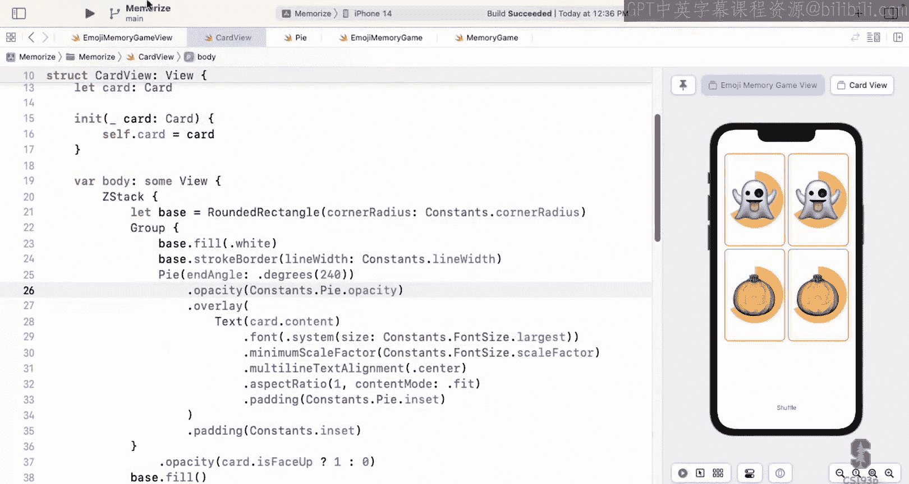

And it's not a Sw UI view， we're not going to have a preview。So here we'll call this Cardify。

 let's give you the name of a viewmodifier。

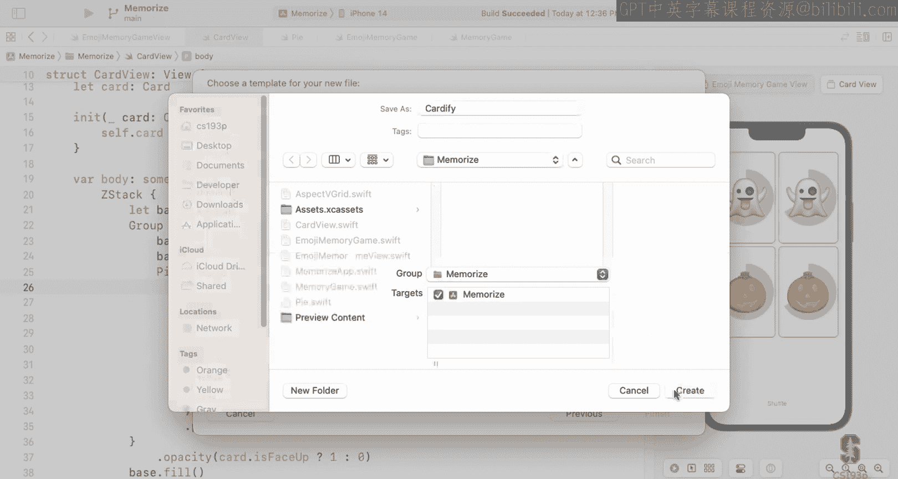

Ss in the right spot。Here it is， just another file。And it， of course， is part of the UI。

We a stroke Cardify。Implements the view modifier protocol。Now I totally I warned you about this。

 it says， you don't conform of you modifier， Oh， thanks， how about fix， let's go fix that。it did not。

 I told you there was that funk body thing， what， where is it？

So I'm not going to explain why this is happening， it has to do with the way that viewmodifier or protocol it has generic。

 it's generic right so it has these don't cares and body is one of its don't cares and what it's essentially saying here is can you please tell me the type of the body I'm going to build so that I can then make the right funk body for you。

 but that's of course ridiculous we want to use some view so we're not going to use this so I forget all that。

We're just going to have to know that its funk body takes content， which is' a type content。

 that's the don't care in there and it returns some view。And inside here。

 we're going to take that content， which can be any view， and we're going to cardify it。

We already have the code that does cardification over in our carview。

 so let's go over to our car view and grab it， it's essentially the entire thing here。

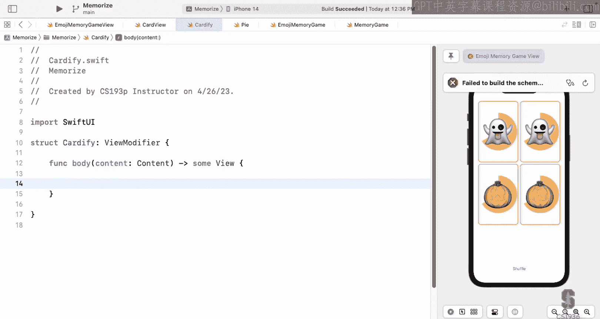

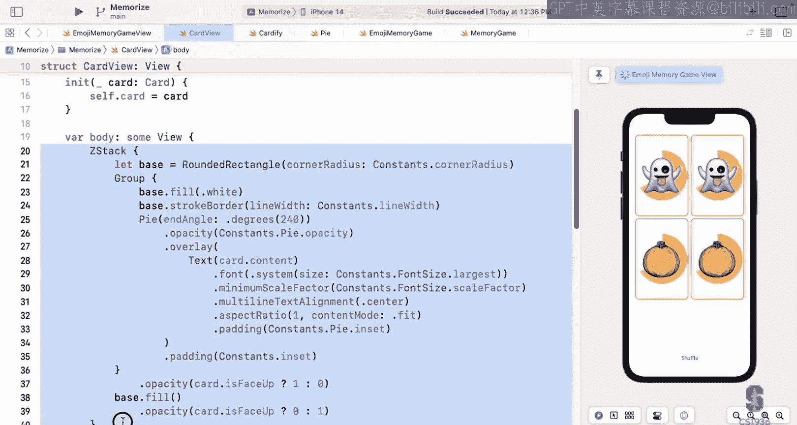

Grab this whole code。 Put it over here， inside this body。

Now we have to take some things out of here like our pi， this whole thing that's our pi。

 that is what we're carddifying so that doesn't go in here that gets replaced with content。

We're carddifying anything， so I took out what was in there for our card and I replaced it with this content argument。

 which is the argument there to funk body。And we of course don't have card dot is face up anymore。

 so we have to get rid of card dot， but we still need is face up。

 so we'll just make that R B of R here is face up， which is a bull。

 and I'm not going to have that default so let's go ahead and make that a lap that forces you to provide is face up when you cardify something you have to tell me whether you want me to cardify it face up or cardify it face down。

A couple other minor things here， we have these constants。

 let's go back to our card view and grab the constants。

 I think it's only the first couple of them here， we won't need them over here。Over here。

 put it down at the bottom。Oh， sorry， it space up is an argument to Carify， sorry about that。

the wrong place there。This is our Carify， this is really all is necessary to cardify something。

Put the bounded rectangle around it， the backing on it when it's face down， just make it filled。

 Now let's go back to our Car view and use this view modifier to cardify our content over there。

 So where is our content our content our content is this piece right here。

 the pi with the end angle and opacity and the overlay of the emoji right there。

 I'm going to cut that out of here and then just replace all of this junk with it。

And I'm going to ask to。Modifier it。With a cardify modifier is face up is my cards is face up。

So this seems like just a factoring out of code thing right we put the carddification over there and it is a factoring out of code process。

 but it's also going to set us up to do this animation because when we flip cards over right now they just dissolve and we need them to do something much more complicated。

 a 3D turn we use do a 3D turn as they flip and that's going to happen every time face up changes。

And I told you that viewmodifiers can custom animate change。

 that is the change that causes a flip right face up goes from face up to face down。

 that's going to cause a flip， that's where we're going to do custom animation and we'll do that next time。

Now what about the fact that it says modifyifier Carify when really what we wanted to say is dot Carify face up。

 that really would look nice， well， anytime we do a view modifyifier like this almost always at the bottom we put an extension on view。

That adds a new clk called Carify， which takes the argument。Return some view。And it's just going to。

Return essentially self dot modifier of that carify with is face up being the is face up argument。

 and we don't need return because it's a one liner。

And we don't need self either because this is an extension of view as obviously we're sending this to ourselves。

So this is how modifiers are built and all those modifiers you see， they're doing the same pattern。

 they're doing different stuff inside their funk bodies here， of course than we're doing。

 we're cardifying。But that's what they're doing。可。Make sure our card view still works。 Yeah。

 look at that preview over there is also that didn't break that either。

Now the last thing I want to do I actually promised I was going to do is to clean this up a little bit to use background and overlay。

Because really what's happening here is as I was saying before you have this outline that's the actual card the white that we put in the background is just so it works in dark mode remember that all the way back to I don't know first lecture's that's just the background of this so we should use dot background for it Im me to go up here。

 take my stroke border thing and say dot background。Is this。Pll。

That is the background of that thing and this content right here， that's the foreground。

 so I'm going to say dot overlay of that content。When I do that。

 all of a sudden I don't need this group。Take that out of here。This back。This all looks a lot。

More sensible and more meaningful， the content of this thing here is this stroke border with a background that's white so that works in dark mode and the foreground overlaid on top of it。

 but not controlling the size is the pi in the emoji。So this is really probably。

A little more correct and certainly probably the way you would want to write this。

 you're making it more explicit what's controlling the size here， the stroke border on the outside。

We could have designed this card by the way， in a different way where the size of this drives the size of the card。

 but we really wanted the card to be able to be small and big depending on how many cards we had。

 so the design constraints of our system demanded we have a flexible size card。

 so that's why we're driving its size with the stroke border rather than driving it with the text。

 let's say。So last thing Im want to do here is just slides。

 I want to finish up the swiftt type system， remember I said protocols。

 I was going to tell you in two parts and I showed you part one， so here's part two of protocols。

 let's go here， try to understand more about protocols。

We've learned a lot about how protocols are used to essentially ask an object to behave in a certain way one of the most powerful uses of protocols that we haven't talked about is code sharinghar I told you that protocols don't do implementation they implementationfr well that's true but implementation can be added to a protocol by using extension。

 the same extension we use to add the only bar to array back when we did that and the same extension we just use to add carddify to a protocol where you can add any implementation you want not just cardifies you could do anything you want and that's a super powerful feature and it's really when people come from object orial programming to this kind of programming they're like well what's really great about object or programming is I can create an object that inherits all this great functionality from some other object and that is true but you are also highly constrained because you're going to inherit all of that object data representation。

you might be a completely different kind of thing there's a lot of functions you can imagine that apply just as well to a dictionary as they do for an array。

 but a dictionary and an array are going to have very different data storage going on even a string versus an array a string wouldn't doesn't necessarily have to be implemented as an array of characters and in fact in Swift it's not implemented that way。

 but they still want to share a lot of the same functions like give me the last character。

 give me the last element of this array， same thing right and you want that code to be shared and this allows you to do that。

So first of all， using extension， we see how we got Carify and that's how we get all the view modifiers。

 foreground， font， all those things， all are getting there for free by having extension to view。

But it's also how functions like filter and first index where， remember those things that we used。

 those also get implemented as extensions and those extensions can not only add new functions。

 they can also add default implementations of functions and you can if you want to think of it as overriding them but not overriding in the objector in a sense just you' implementing them on your struct。

 but there's a default one in case you don't do it and this ability to be able to default and then implement your own gives you a lot of the same power you get with objectorient programming without all the restrictions of the data representations being the same。

The reason that we sometimes call programming and Swift protocol oriental programming instead of just pure functional programming is because of this。

We are building our implementation using protocols and but until now I kept telling you protocols were just only the declaration of things。

 not the implementation， but now you're understanding that because we have extensions。

 they also are an enormous amount of actual implementation as well。

So let's talk about filter a function that we think belongs lives in array that will filter an array right you give it some function and it filters the array out if that function turns true for an item in the array and that includes it otherwise it does not so that filter Well filter works not just on array it works on range and string and dictionary。

 these are all very different things and the code for all of this is the same。

And this code lives in the protocol sequence。So sequence is a protocol that arrays and range and string and dictionary all implement。

 of course they are sequences of things they can be sequence sequence knows how to iterate through the things in the sequence。

 so once you have those fundamentals then you can add an extension to sequence that will filter by just going through each one。

Everyoneone buy that？So now are you' just instantly seeing， oh， yeah。

 I can see how I'm kind of getting inheritance， but I'm getting it across all different kinds of types that don't share anything common about their data representation。

So let's talk about view because it's one of the most important places where we're getting this implementation sharing。

 so view we know that all the things I'm going to show you here by the way。

 kind of pseudo code it's not exactly the way it looks， but it's kind of like this。

 so protocol view as you probably picturing it it has one farar in its body。

Any body that returns some view。There's also something else like this in Swift， extension to view。

 funk foreground color， funk， font， funk， blur， all the hundreds of functions that you have to view are just in some extension to view。

This is why I was kind of calling protocols， constraints and games。

The protocol itself up there of our body constrains a view， you have to implement our body。

 otherwise you can't be a view， and then the gains you get are all these functions that come in through this extension。

Now I want to talk a little bit more about protocols that are generic。

we've seen this actually identifiable is a protocol with a don't care。

 and I just want to show you the syntax of it so that you when you see this in the documentation or whatever you're like。

 oh， I know I see what that is。Look at identifiable， it only has this one thing in the protocol。

 which is this bar ID， that's the ID you have to provide to be identifiable。

 and that ID is a don't care。Identfi doesn't really care what you use to identify yourself。

But it has to have something。But that don't care， how is it defined and you might see it defined in the same way as astruct。

 right， protocol identifiable angle brackets， the thing。

 but oftentimes you'll see it as associated type ID underneath there。But you'll see it both ways。

 it's the bottom line， sometimes angle brackets， sometimes this associated type right here。

Now we actually know that that associated type that don't care is not really a full don't care。

 it's a care a little bit。Because whatever you provide is your ID。

 it has to be hashable because if you have a bunch of identifiable things。

 you want to be able to put them in a hash table and look them up so you need that thing to be hashable So of course we have to add the where essentially to that and so how do we add the where how do we constrain it well we can add where right on the associated type over there associated type I and we can also just say associated type I colon hasable the same way we're allowed to do that when for example。

 in aspect be grid， remember when we added it don't care if we just put that right in the colon view and the colon identifiable right in there。

 we can do the same thing with the associated type So when you're look into the documentation and you see protocol and then associated type ID with some colon after it。

 you know what's going on there that is an associated type and it's telling you what you need to do to satisfy that particular type So if you're doing identfiable you will go in there and you would realize okay my v I to be。

That can be hashed， stringing int anything I can hash。

Let's talk about a couple of keywords that are used a lot with protocols， some in any。

The sum keyword right here， it's used to pass something that implements a protocol opaquely into or out of a function or into or out of a v even and what do I mean by opaquely I mean that you're going to pass this thing in and you're going to know that it implements that protocol but that's all you know it could be anything it just all you know is it implements that protocol in other words itss type is opaque to you it's like it's behind a wall you can't see through the wall you don't know what type it is。

 but you do know it conform to that protocol。And when I say it can be passed in or out。

 I mean it could be a parameter to a function or it could be a return type of a function。

So let's look at some as a return value， and this is the one you're most familiar with。

 like var body sum view when you have a return type that is like this。

One thing that's important is that the function always return the same type so that some view can figure out what that is because when you have some view as a return type as you know。

 it's going to look in here into the computer property and figure out what it is So if you had something here where sometimes it returns around a rectangle and sometimes it returns a rectangle which are two different types then the compiler would complain here it would say basically what it's saying is I can't figure out which shape it is because sometimes it's one thing sometimes it's another thing so you're not allowed to do that and with views we don't notice it because we have view buildderers and they package all up into one view for us so it always works in a view builder。

And that's why this works here I've got some view and I'm returning rounded rectangle。

 This works as long as this thing， this bar body is marked view buildilder。

 which it is all of our bodies are view buildilder but there's no such thing as a shapebuilder so you can't do it that way I mention this a little bit because you might be tempted to want to do this in your assignment 3 and you can't do it now you can still use some view however。

 in your assignment 3 as a parameter to a function so let's talk about that some used when it's a parameter an argument to a function。

Remember that fill， I told you we're going to go back to that， that fill generic function there。

 what to filled with， that can actually be rewritten like this fill。

 what to fill with is some shape style。So passing an argument that is some thing is just like having a generic right there where it's of that sum type。

I'll let this kind of sink in so you can compare these two。What we're essentially saying is fill。

 you can call Phil and you can pass it anything that implements this shapepet protocol。

 and I'm not going to know what it is and I don't care because I'm going Phil is only going to ask it to do shapet things so it doesn't care if it's a linear gradient answer or color or whatever。

That's what some shapet there means。And that's why you could call circle fill image paint， image。

 some image， right， and it would just figured out because image paint is some shape style。

 it implements the shapest protocol， so it is some shapes style。

Now how could you use that maybe in assignment3， let's say maybe you have a function called fill and stroke。

 we know that we can't fill and stroke at the same time we can only fill or stroke。

 but what if we wanted to function fill and stroke this shape well we could make a ZStack out of the fill and the stroke exactly like we do with our cards and we could implement a function to do this and the argument we would pass would be some shape。

 we don't care if this is around a rectangle or circle。

 whatever this is going to work because the only functions I'm using in here are things that shapes do。

So I can pass it in there and this is returning some view， so that's okay， ZStAC is some view。

So you might well want to do this in time3 you're not required。

You do have multiple shapes right on your cards， hopefully you've all looked at the assignment by now。

 and so I don't know if you want to fill and stroke them。

 but you might want to do things to the shapes， do it to any kind of shape。Now what about any。

 so you'll see this much more rarely， in fact， I doubt you'll use any at all in this course。

Any is a way to essentially have a heterogeneous。Aray or container full of something that responds to a protocols you could actually for a lot of protocols like here have protocol food that just implements bar and that's it you could have an array of fo in that case it would work you wouldn't have say array of any fo。

 you could just say array of fo and it would work and of course if you went through the array you could only call bar on those things because that's all you know about those things in the array no matter what they are the only function you know about them but if you have a more complicated protocol especially ones that are selfreferential like the equtable one right if remember the function for equtable it' equals equal statick equals equals the two arguments are of type the thing you're equating so that protocol is self-referential the argument types of the function inside of it refer to itself。

So if you have a self-referential protocol or you have a protocol that has generics in there then you can't just say array of food。

 there's too many other variables going on， so that case you do array of any of those things so you could have an array of any identifiable。

 even though identifiable has generics wouldn't normally be able to put it in array。

 you can say any identifiable。So imagine that this is an array that has rectangles and circles and other things in there。

 okay， the things in the rectangle are some shape， but you can't have an array of some shape because some shape results to ape specific shape。

It is some shape， not any shape， some shape， so you can't have an array of some shape because you can't have an array of any shape。

And any shape is actually a different type than shape。

 it's kind of this boxed up shape it's put in this box and the box is the type because in Swift arrays can own everything in an array has to be of the same type。

 and so when you say an array of any shape it's essentially array of these boxes and the boxes are the same type。

 but what's in them can be different kinds of shapes。Now here's the problem though。

 how do you get these things out of here and do anything with them because you can't just reference them and start doing identifiable things because you don't know the generic for example。

 you don't know if that's an identifiable with string bar or you don't even know what to do to it so how do you do it so the answer is you got to call a function that takes some identifiable。

If you take one of these things， subscript this and call a function sum identifiable。

 it can unbox it and pass it in there and this code is going to be working on a particular sum identifiable so really there are some other things you can do within any identifiable but mostly you have to pass it to a function that does sum identfiable so this one for example print the identifiables ID。

hi is legal because this is going to be swiftif can convert anything to a string， so that'll work。

That's the only way you can kind of deal with any identifiable don't worry about this too much。

 I don't expect to use that you to use this in this class the any identifiable or any I just want you to know it's there because you're going to run across code you're going to see some you'll see some quite a bit you've already seen some quite a bit you'll see any much less frequently but I just want you to know it's a thing it's out there。

You might be looking at all this and like， oh my God。

 are you really expecting me to figure out how to implement these protocols with generics and you know some and it's just too much homogon。

 no。I don't expect to be able to do all that。This stuff is a very powerful foundation for building very powerful systems like SwiftUI but it takes experience to master these things the great thing about SwiftUI is that you don't really need to be a master of all those things using extensions to extend protocols and all that to make it work I show it to you so that when you see it in the documentation you're like oh I know what that is I don't show it to you because I'm expecting you to start doing extensions to protocols and doing be pay types and all this stuff。

And it us more about understanding what's going on than being able to do it。

That is it and next week is all about animation your homework assignment this week is to build your own card game。

 your homework assignment next week is going to be to add animation to your card game so that's a little preview of what's coming up。

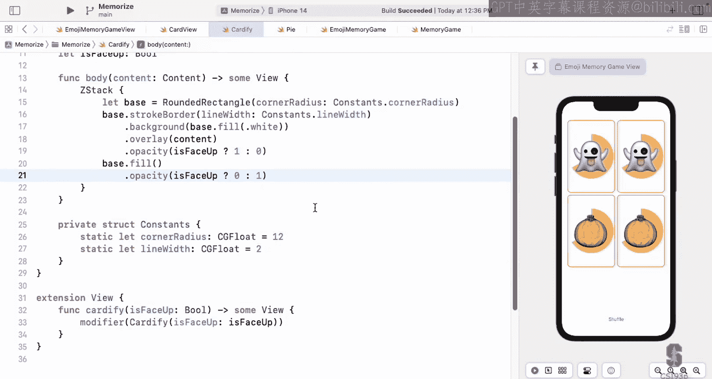