# SwiftUI iOS应用开发：08：动画与过渡

在本节课中，我们将深入学习SwiftUI中的动画系统。动画是iOS应用开发中至关重要的一部分，它能让界面变化更加平滑自然，提升用户体验。我们将从动画的基本概念讲起，涵盖隐式动画、显式动画、过渡效果以及如何创建自定义的动画视图修饰符。

## 概述

本周的课程和第四次作业将完全围绕动画展开。事实上，第四次作业就是为你的第三次作业添加动画效果。我们将深入探讨动画的工作原理，这是iOS开发中一个非常重要的主题。

## 1. 属性观察器与`onChange`

在深入动画之前，我们先介绍一个与动画关系不大但非常有用的概念：属性观察器。这是一个之前没有合适机会插入讲解的话题。

### 属性观察器

SwiftUI的值类型可以检测到属性的变化。属性观察器允许你在一个属性的值被设置时执行代码。它的语法看起来很像计算属性，但语义完全不同。

```swift
var isFaceUp: Bool {
    willSet {
        if newValue {
            startUsingBonusTime()
        } else {
            stopUsingBonusTime()
        }
    }
}
```

在上面的例子中，`isFaceUp`是一个普通的存储属性。`willSet`闭包中的代码会在`isFaceUp`的值即将被设置时执行。其中有一个特殊的变量`newValue`，代表即将被设置的新值。还有一个`didSet`观察器，它在值被设置后执行，其中可以使用`oldValue`变量来访问旧值。

属性观察器非常适合在模型中使用，用于同步执行与属性变化相关的操作。

### `onChange`视图修饰符

在视图中，我们通常不使用属性观察器来观察`@State`或`@Published`变量的变化，因为视图的重新绘制已经是对这些变化的响应。相反，我们使用`onChange`视图修饰符。

```swift
Text("Taps: \(taps)")
    .onChange(of: viewModel.cards) { newValue in
        taps += 1
    }
```

`onChange`可以附加到任何视图上。当它监视的表达式发生变化时，就会执行提供的闭包。闭包参数`newValue`是变化后的新值。

## 2. 动画基础

现在，让我们回到动画的主题。我将通过幻灯片讲解、演示和作业实践这三种方式来教授动画知识。

### 动画的本质

理解动画的首要原则是：**动画只是向你展示已经发生的变化**。

动画展示的是模型中的变化，通常是随时间展示的。这种变化通过视图修饰符的参数、形状的变化以及视图的进出屏幕来体现。动画系统并不会在动画持续的五秒内逐步改变一个不透明度变量。当你将不透明度从0设置为1时，它在你的整个视图中瞬间就变成了1。动画系统只是在五秒内将这个变化展示给用户看。

一旦你理解了这一点，动画如何融入你的其他代码就会变得清晰。

### 变化的类型

主要有三种类型的变化可以动画化：

1.  **视图修饰符参数的变化**：这是UI变化的主要驱动力。例如，不透明度、宽高比，甚至是视图的移动（通过`position`视图修饰符实现）。
2.  **形状的变化**：自定义形状的路径参数变化。
3.  **视图的进出屏幕**：视图进入或离开屏幕，例如淡入淡出或飞入飞出。

视图只有在已经出现在屏幕上之后，其视图修饰符参数的变化才会被动画化。视图刚出现在屏幕上时，会以其初始值直接显示，不会从某个随机值动画过来。

并非所有视图修饰符参数都可以动画化，但绝大多数你认为可以动画化的参数都是可以的。

### 视图的进出

视图主要通过以下方式进出屏幕：
*   `if-else`或`switch`语句。
*   `ForEach`：当数组中的元素被移除或添加时，对应的视图也会被移除或添加。

视图的进出动画（称为“过渡”）只有在视图所在的容器**已经**在屏幕上时才会发生。如果容器和视图一起出现或消失，那么只有容器的过渡动画会生效。

## 3. 触发动画的三种方式

有三种方式可以触发动画：

1.  **隐式动画**：使用`.animation`视图修饰符。它会使应用到该视图上的所有符合条件的视图修饰符变化都产生动画。这是我们之前使用`shuffle`时看到的动画类型。
2.  **显式动画**：使用`withAnimation`代码块包裹一段操作。这会使得该代码块内引起的所有变化一起被动画化。这是我们进行动画的主要方式。
3.  **视图过渡**：通过添加或移除视图来触发其定义的过渡动画。

同样，所有这些动画都只对**已经在屏幕上**的视图生效。

## 4. 隐式动画

隐式动画，有些人称之为自动动画，本质上是一个视图修饰符。它标记了一个视图，使得所有应用在该视图上的、位于此修饰符**之前**的视图修饰符的变化，只要满足`.animation`中指定的条件，就会按照某个动画曲线进行动画。

```swift
GhostView()
    .opacity(scary ? 1 : 0)
    .rotationEffect(.degrees(upsideDown ? 180 : 0))
    .animation(.easeInOut)
```

在上面的例子中，`.animation(.easeInOut)`会导致`opacity`和`rotationEffect`的变化被动画化。如果我将`.animation`放在`GhostView()`后面，那么两个效果都不会被动画化。如果放在`opacity`和`rotationEffect`之间，则只有`opacity`会被动画化。

`.animation`视图修饰符的行为更像`.font`而不是`.padding`。如果你将它应用在一个`VStack`上，它几乎会影响到`VStack`内的所有视图。这有时会让人困惑。通常，我们较少在容器上使用隐式动画，更多的是在叶子视图（如`Text`或我们自定义的视图）上使用。

### 动画曲线

`.animation`的第一个参数是动画曲线，它是一个`Animation`结构体。它控制动画如何进行，允许你设置：
*   **持续时间**：动画持续多久。
*   **延迟**：动画开始前的等待时间。
*   **重复**：动画是否以及如何重复。
*   **曲线**：动画速度随时间的变化方式。
    *   `.easeInOut`（默认）：开始慢，加速，结束慢。
    *   `.linear`：匀速。
    *   `.spring`：类似弹簧效果，快速到达目标，然后轻微振动。

你可以在`Animation`的文档中查看所有可用的曲线和设置。

隐式动画并非我们动画的主要来源。我们主要将它们用于叶子视图，或者用于那些与其他视图动画完全独立的动画。

## 5. 显式动画

应用中动画最可能的触发原因是用户交互，例如点击卡片或点击洗牌按钮。对于这类变化，我们几乎总是使用显式动画。

显式动画的本质是用`withAnimation`代码块包裹一段会引起变化的操作。

```swift
withAnimation(.linear(duration: 2)) {
    // 执行一些会改变视图修饰符或形状参数的操作
}
```

显式动画几乎总是包裹在视图模型意图函数（`intent function`）的调用周围。在视图模型中调用一个意图函数而不包裹显式动画是极不常见的。

**重要提示**：隐式动画比显式动画具有更高的优先级。如果你在一个显式动画块内部，有一个视图应用了隐式动画（`.animation`），那么隐式动画的设置将覆盖显式动画。这是合理的，因为隐式动画通常用于定义独立的动画行为。

## 6. 过渡

过渡专门处理视图进出屏幕的动画。它只对**CTAAOS**（Containers That Are Already On Screen，已经在屏幕上的容器）内的视图有效。

在底层，过渡实际上只是一对视图修饰符：一个用于视图进入屏幕前的状态，另一个用于视图进入屏幕后的状态。系统会在这两个状态之间进行动画。对于不对称过渡（例如淡入但缩放消失），则需要两对共四个视图修饰符。

我们99%的时间都使用预定义的过渡。这些过渡定义在一个名为`AnyTransition`的结构体中（虽然真正的过渡结构体是`Transition`，但`AnyTransition`进行了类型擦除，我们可以在这里找到所有静态定义）。

一些常见的过渡包括：
*   `.opacity`：淡入淡出。
*   `.scale`：缩放进入/消失。
*   `.offset`：通过偏移量飞入飞出。
*   `.move(edge:)`：从屏幕边缘移入移出。

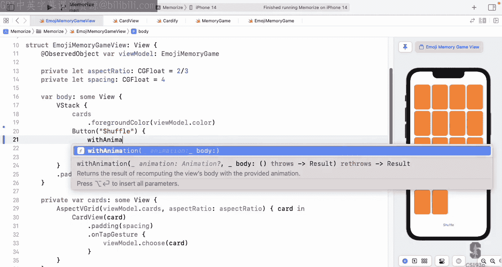

你也可以使用`.modifier(active:identity:)`自定义过渡。

### 指定过渡

使用`.transition`视图修饰符来指定视图进出时应使用哪种过渡。

```swift
ZStack {
    if isFaceUp {
        RoundedRectangle(cornerRadius: 12)
            .stroke()
        Text("👻")
            .transition(.scale) // 文字缩放
    } else {
        RoundedRectangle(cornerRadius: 12)
            .fill()
            .transition(.identity) // 背面立即出现
    }
}
// .transition(.opacity) // 整个ZStack淡入淡出（默认）
```

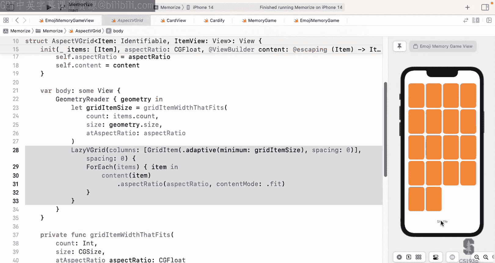

`.transition`作用于整个视图。如果你将它应用在一个`ZStack`上，你指定的是整个`ZStack`如何淡入或生长，而不是内部的每个子视图。

**关键理解**：`.transition`是一个名词，它指定了“当这个视图出现或消失时，使用哪种过渡效果”。让过渡动画发生的动作是**将视图从屏幕上移除或添加到屏幕上**。仅仅添加`.transition`修饰符并不会触发动画。

你可以为特定的过渡指定动画曲线，但这并不常用。

```swift
.transition(.opacity.animation(.linear(duration: 20)))
```

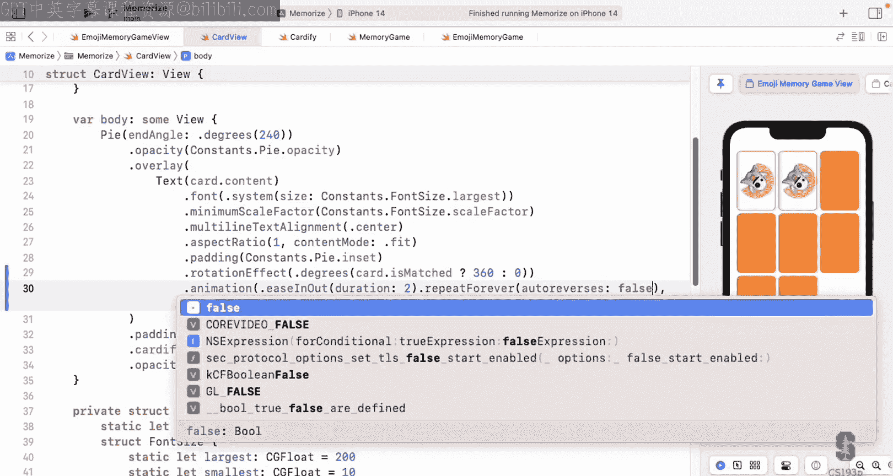

## 7. 匹配几何效果

有时，你想让一个视图从一个位置移动到另一个位置。如果两个视图在同一个容器内（例如洗牌时`LazyVGrid`内卡片的重排），这很容易，因为改变`position`视图修饰符的参数就能实现动画。

但是，如果两个视图不在同一个容器内呢？例如，你想从屏幕角落的一个牌堆中发牌到游戏区域的`LazyVGrid`中。这时，你需要使用`matchedGeometryEffect`。

它的原理是：你创建两个视图，一个在源容器（牌堆），一个在目标容器（游戏区）。你为这两个视图应用`matchedGeometryEffect`视图修饰符，并指定相同的`id`。然后，你通过代码确保同一时刻只有一个视图在屏幕上（例如，通过控制驱动`ForEach`的数组）。当源视图消失而目标视图出现时，系统会匹配它们的位置和大小，让视图从源位置“飞”到目标位置，并可能伴随缩放。

你还需要一个`@Namespace`来区分不同的匹配几何效果组（例如，同时有发牌堆和弃牌堆时）。

```swift
@Namespace private var dealingNamespace

// 在牌堆中的视图
CardView(card)
    .matchedGeometryEffect(id: card.id, in: dealingNamespace)

// 在游戏区中的视图
CardView(card)
    .matchedGeometryEffect(id: card.id, in: dealingNamespace)
```

## 8. `onAppear` 与动画启动

由于动画只对已经在屏幕上的视图生效，那么如果一个视图一出现在屏幕上就想启动一个动画该怎么办？这时可以使用`.onAppear`视图修饰符。

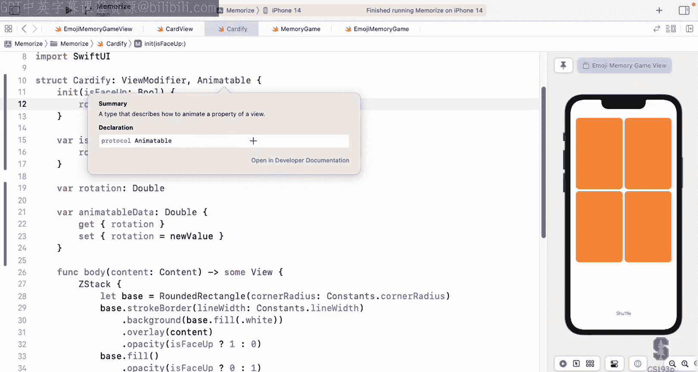

`.onAppear`接受一个闭包，该闭包会在视图每次出现在屏幕上时执行。既然视图出现在屏幕上，它必然已经在一个CTAAOS里。因此，你可以在`.onAppear`内部使用`withAnimation`来启动动画。

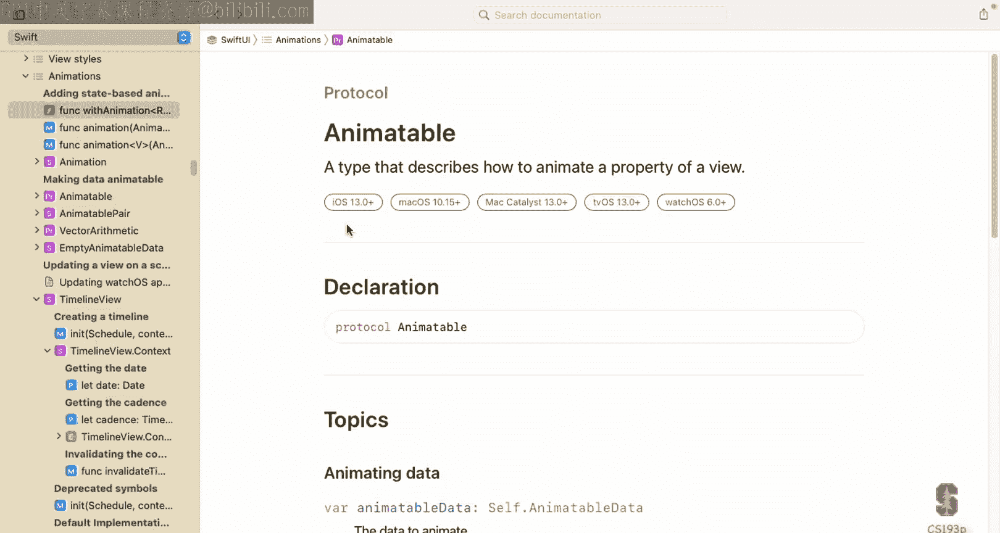

```swift
SomeView()
    .onAppear {
        withAnimation {
            // 改变某些状态，触发动画
        }
    }
```

这对于实现诸如“+2”得分提示飞出的效果非常有用。

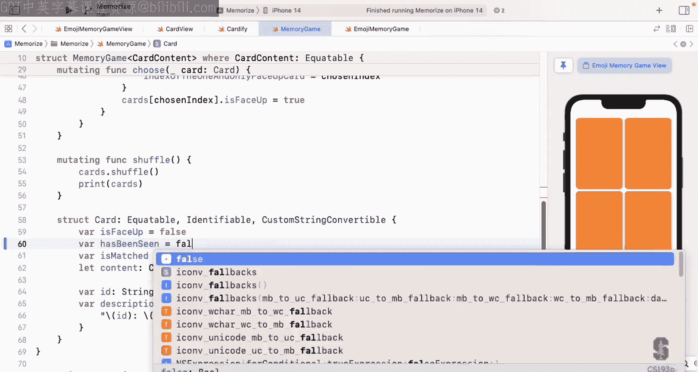

## 9. 动画引擎：`Animatable` 协议

视图修饰符和形状是动画发生的地方。那么，驱动它们动画的引擎是如何工作的呢？

本质上，动画系统会将动画持续时间分割成许多小片段，然后不断询问视图修饰符或形状：“在当前的片段，你应该是什么样子？”视图修饰符或形状只需要根据当前片段的值来绘制自己。

这个通信是通过实现`Animatable`协议来完成的。该协议只有一个要求：一个名为`animatableData`的计算属性。

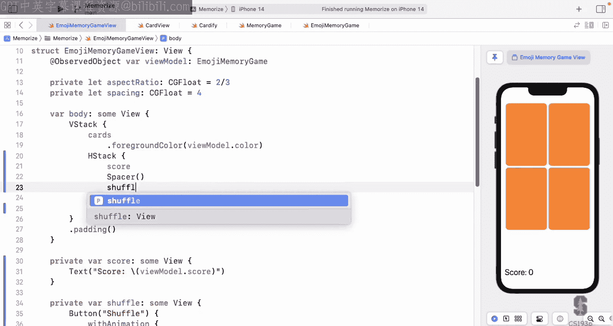

```swift
protocol Animatable {
    associatedtype AnimatableData : VectorArithmetic
    var animatableData: Self.AnimatableData { get set }
}
```

*   `animatableData`的类型必须遵循`VectorArithmetic`协议，这意味着它可以进行代数运算，从而能够被分割。
*   **设置** `animatableData`：动画系统通过设置这个值来告诉视图“请绘制对应于这个片段的状态”。
*   **获取** `animatableData`：动画开始前，系统通过获取这个值来知道动画的起点和终点。

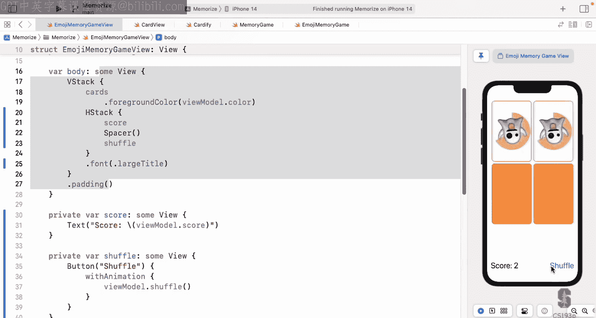

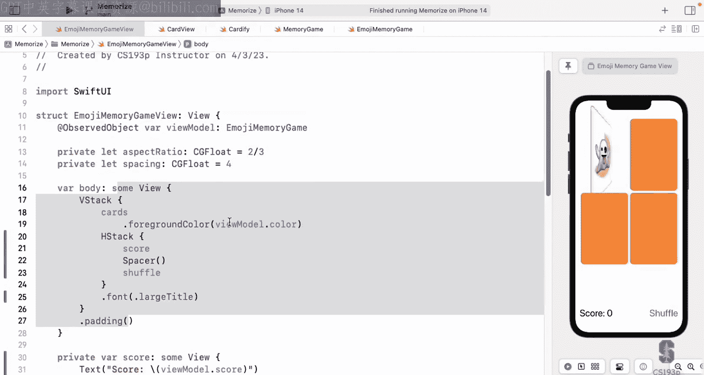

通常，`animatableData`会是一个`Double`或`Float`。如果你需要同时动画多个值，可以使用`AnimatablePair<First, Second>`，其中`First`和`Second`也需遵循`VectorArithmetic`。通过组合`AnimatablePair`，你可以动画几乎任何数学上可分割的数据。

在实践中，你通常不会直接使用`animatableData`这个变量名。你会有自己的变量（例如`rotation`），然后让`animatableData`的`get`和`set`方法映射到这个变量上。

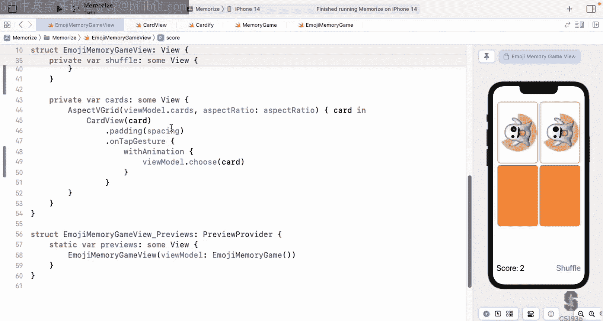

```swift
var animatableData: Double {
    get { rotation }
    set { rotation = newValue }
}
```

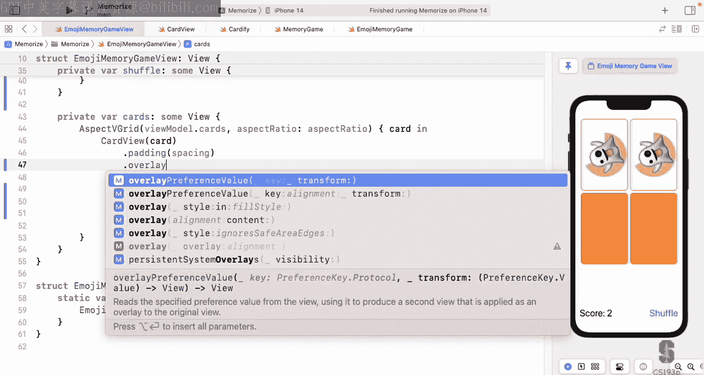

一旦你实现了`Animatable`协议，系统就会将动画控制权交给你，原本会自动动画的视图修饰符（如`.opacity`）将不再自动工作，需要你在代码中根据`animatableData`（即`rotation`）来手动计算和设置它们。

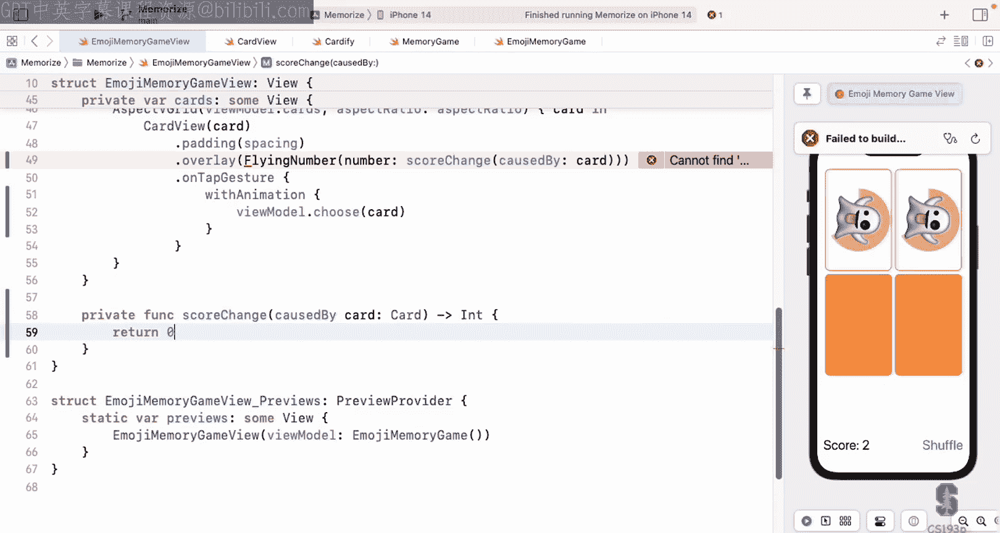

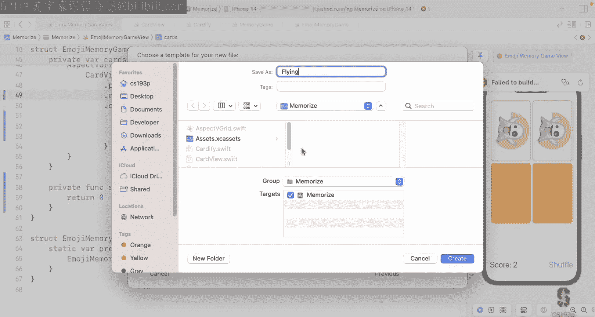

## 总结

本节课我们一起深入探讨了SwiftUI动画的核心机制。我们学习了：

1.  **属性观察器** (`willSet`/`didSet`) 和 **`onChange`** 视图修饰符，用于响应属性变化。
2.  **动画的本质**：展示已经发生的变化。
3.  **触发动画的三种方式**：隐式动画 (`.animation`)、显式动画 (`withAnimation`) 和视图过渡。
4.  **过渡效果**：控制视图进出屏幕的动画，如`.opacity`, `.scale`等。
5.  **匹配几何效果** (`matchedGeometryEffect`)：用于在不同容器间动画化地移动视图。
6.  **`onAppear`**：在视图出现时执行代码，常用于启动初始动画。
7.  **`Animatable`协议**：创建自定义动画视图修饰符和形状的底层机制。

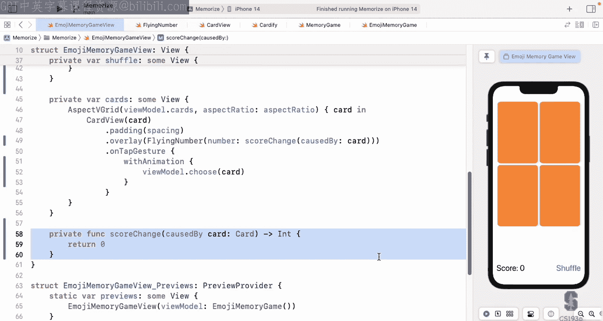

理解这些概念将帮助你构建出流畅、响应式的用户界面。在接下来的演示和作业中，你将有机会实践这些知识，让动画在你的应用中活起来。