# SwiftUI iOS应用开发：09：动画与过渡效果

在本节课中，我们将继续完善记忆卡片游戏，重点学习如何实现动画效果和视图过渡。我们将为游戏添加分数飞行动画、卡片计时器动画以及发牌动画，并深入理解`matchedGeometryEffect`等高级动画技术。

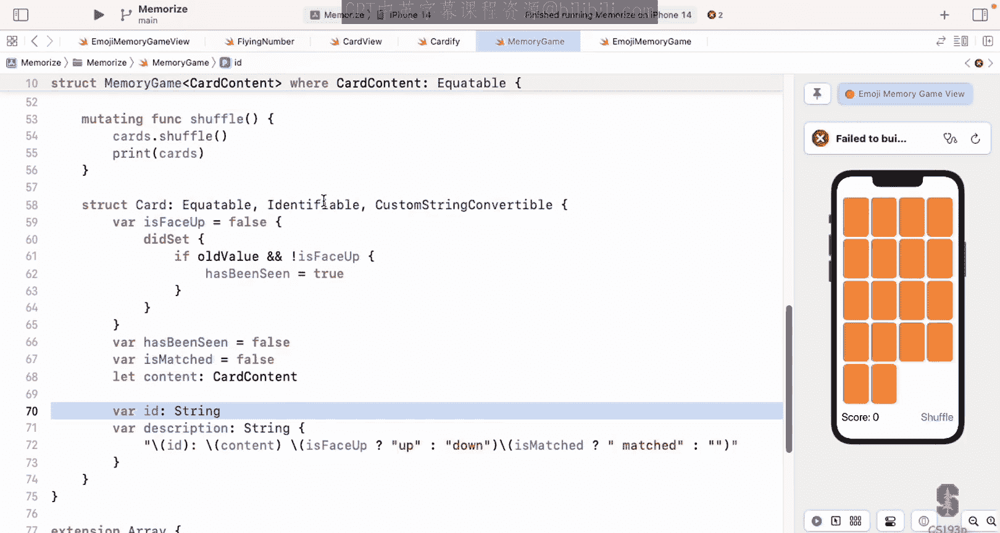

上一节我们为游戏添加了基本的卡片匹配逻辑和分数计算。本节中，我们来看看如何通过动画让这些交互变得更加生动和直观。

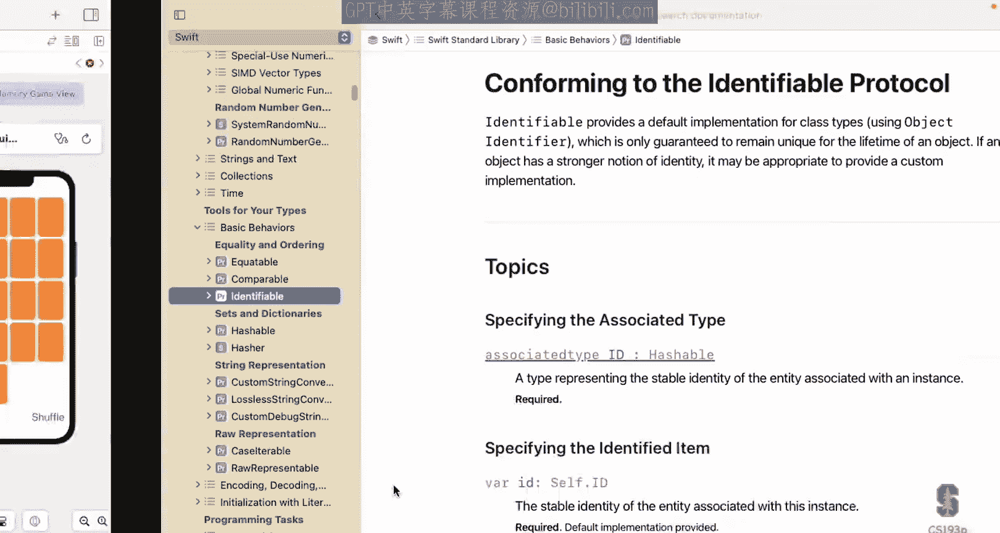

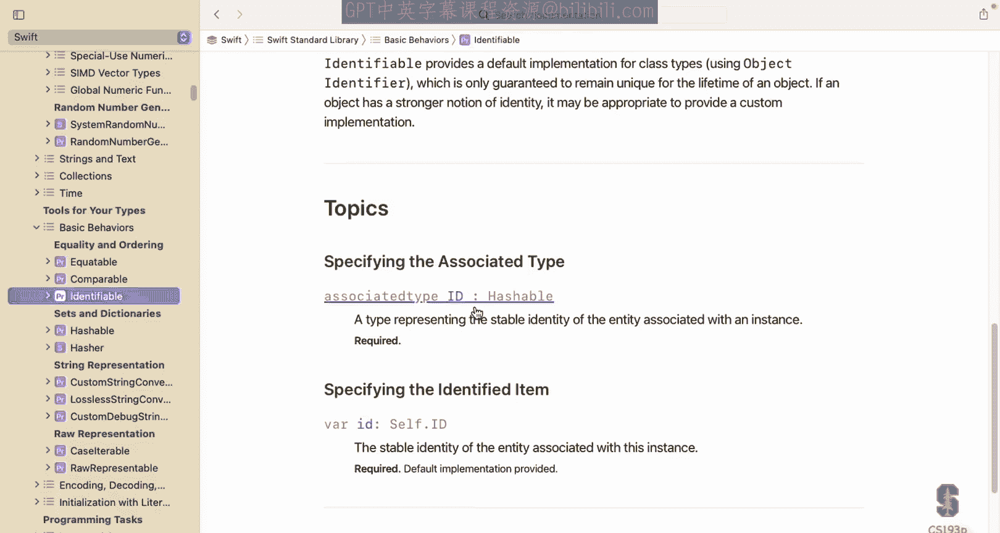

## 实现分数飞行动画

首先，我们需要在卡片匹配或失配时，让分数变化以动画形式“飞”出。这需要一个叠加在卡片上的视图来显示分数变化。

### 跟踪分数变化

为了知道哪个卡片导致了最近的分数变化以及变化了多少，我们使用一个**元组**来存储这两条信息。元组是Swift中一种将多个值组合成一个复合值的数据结构。

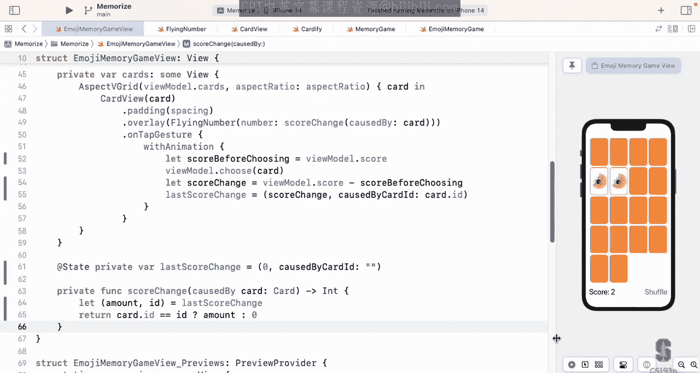

```swift
// 使用元组存储最后一次分数变化的信息
private var lastScoreChange: (amount: Int, causedByCardId: Card.ID) = (0, "")
```

在用户选择卡片时，我们更新这个状态：

```swift
let scoreBeforeChoosing = viewModel.score
// ... 处理卡片选择逻辑 ...
let scoreChange = viewModel.score - scoreBeforeChoosing
lastScoreChange = (scoreChange, card.id)
```

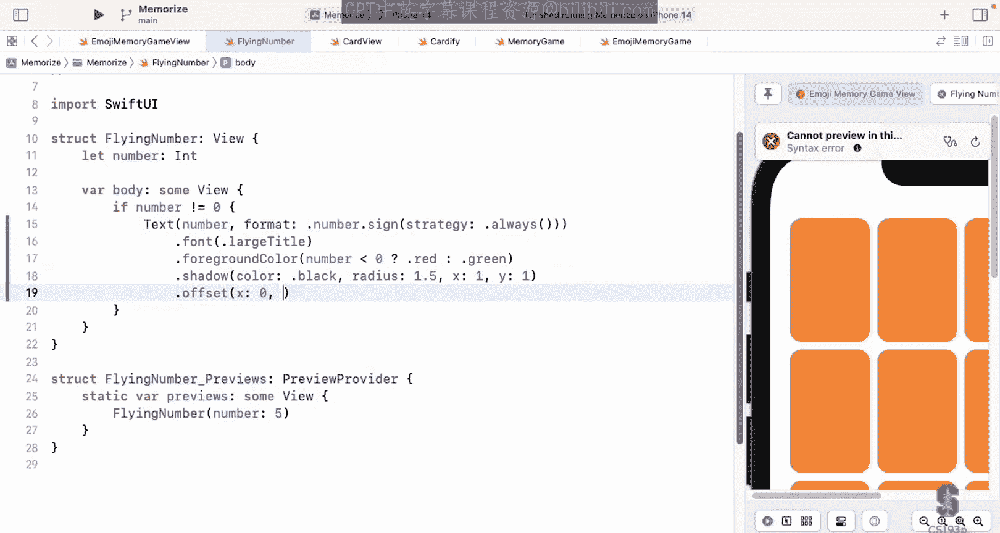

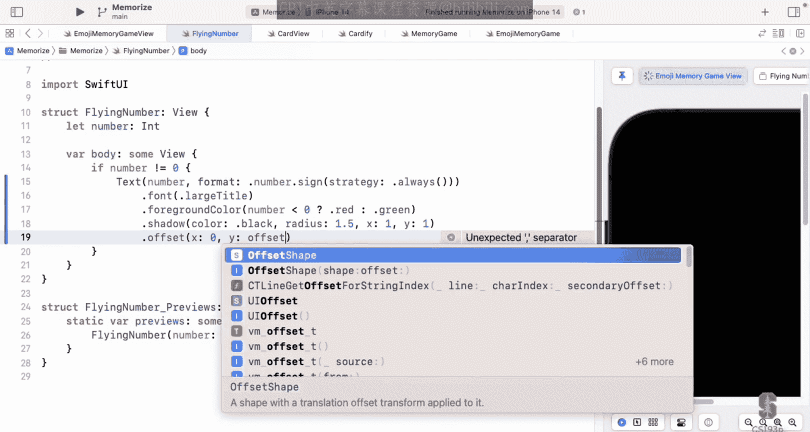

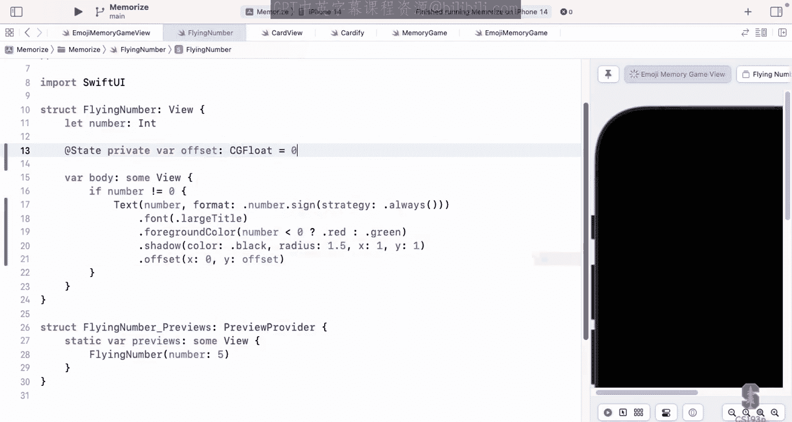

### 创建飞行动画视图

`FlyingNumber`视图负责显示并动画化分数。我们使用`offset`修饰符来移动它的位置，并使用`withAnimation`在视图出现时触发动画。

```swift
struct FlyingNumber: View {
    let number: Int
    @State private var offset: CGFloat = 0

    var body: some View {
        if number != 0 {
            Text(number, format: .number.sign(strategy: .always()))
                .font(.largeTitle)
                .foregroundColor(number < 0 ? .red : .green)
                .shadow(color: .black, radius: 1.5, x: 1, y: 1)
                .offset(x: 0, y: offset)
                .opacity(offset != 0 ? 0 : 1) // 根据偏移量淡出
                .onAppear {
                    withAnimation(.easeIn(duration: 1.5)) {
                        // 根据分数正负决定飞行方向
                        offset = number < 0 ? 200 : -200
                    }
                }
                .onDisappear {
                    offset = 0 // 视图消失时重置状态
                }
        }
    }
}
```

**关键点**：
*   `offset`用于控制视图的垂直位移。
*   `onAppear`闭包在视图出现时执行，我们在这里用动画改变`offset`。
*   `opacity`与`offset`绑定，实现飞走时淡出的效果。
*   `onDisappear`用于重置动画状态，确保下次出现时能正确播放。

### 确保视图层级

为了让飞出的分数显示在所有卡片之上，我们需要使用`zIndex`来控制视图的堆叠顺序。

```swift
.zIndex(scoreChange(causedBy: card) != 0 ? 100 : 0)
```

## 为计时器饼图添加动画

游戏中的卡片有一个6秒的计时器，匹配越快，获得的奖励分数越多。我们需要让表示剩余时间的饼图动画化。

### 使用TimelineView实现平滑动画

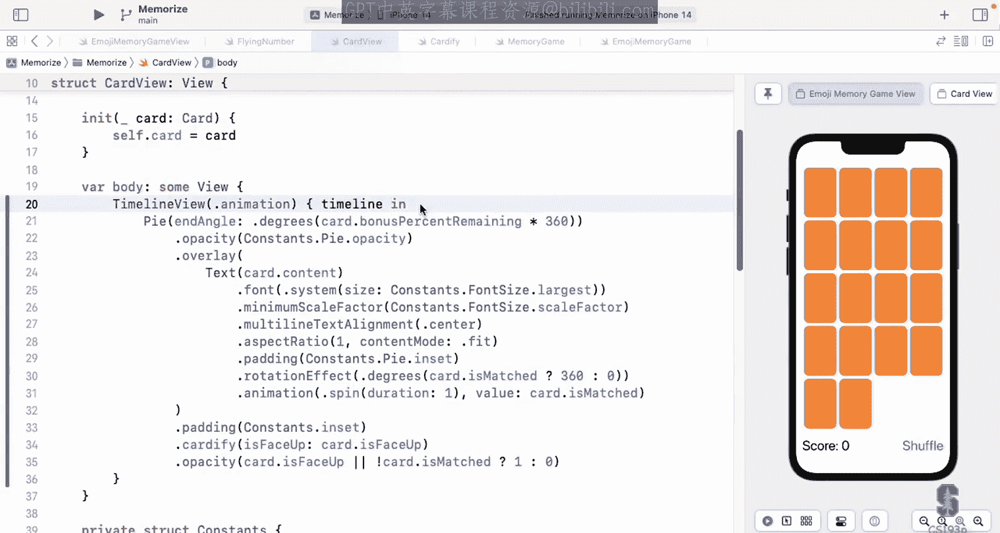

`TimelineView`是一个强大的视图，它会以系统认为合适的频率（例如动画帧率）反复调用其内容闭包，非常适合驱动基于时间的动画。

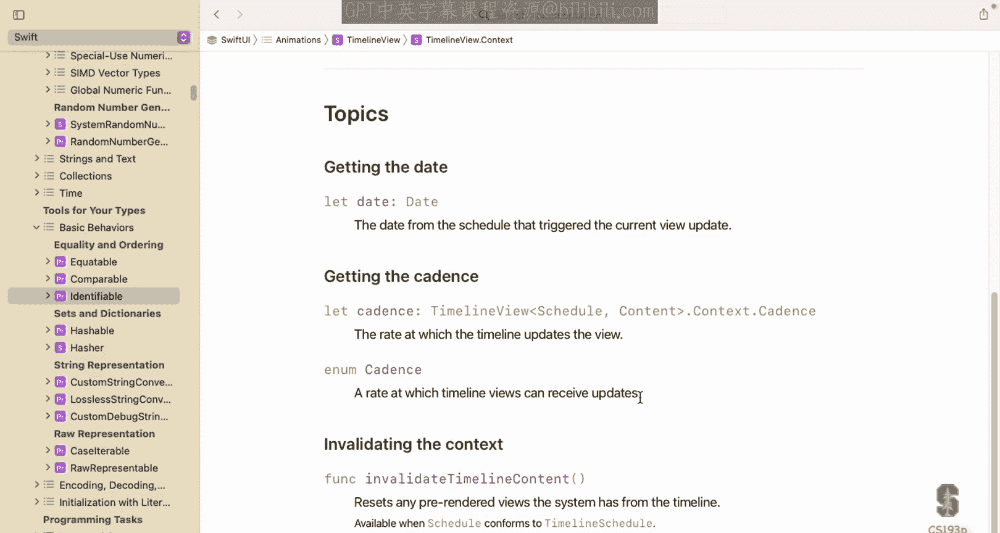

```swift
TimelineView(.animation) { timeline in
    Pie(endAngle: .degrees(card.bonusPercentRemaining * 360))
        .opacity(0.5)
        .foregroundColor(.blue)
}
```

**关键点**：
*   `.animation`调度器让`TimelineView`与动画系统同步更新。
*   每次更新时，`Pie`视图会根据`card.bonusPercentRemaining`（一个随时间减少的模型属性）重新绘制，从而产生动画效果。
*   你可以通过`.animation(minimumInterval: 0.1)`等方式控制更新频率，以平衡流畅度和性能。

## 实现发牌动画

最后，我们来实现一个更复杂的动画：从牌堆中一张张发牌到游戏区域。

### 管理“已发”状态

发牌是一个纯粹的UI行为，与游戏模型无关。我们使用一个`Set`来跟踪哪些卡片的ID已经被发出。

```swift
@State private var dealt = Set<Card.ID>() // 存储已发卡片的ID

// 辅助计算属性
var undealtCards: [Card] {
    viewModel.cards.filter { !dealt.contains($0.id) }
}
func isDealt(_ card: Card) -> Bool {
    dealt.contains(card.id)
}
```

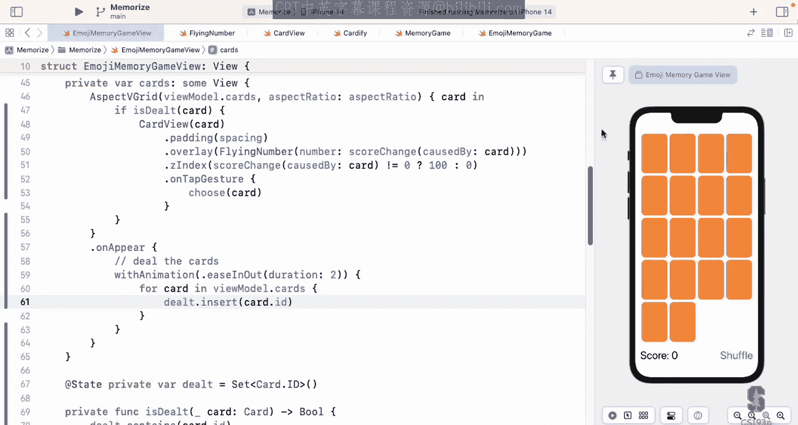

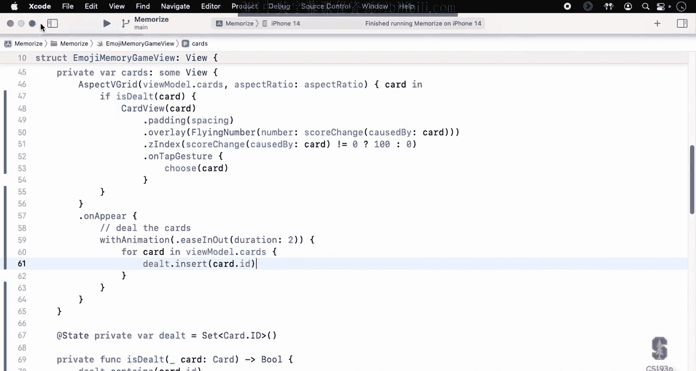

在游戏主视图中，我们只显示已发的卡片：

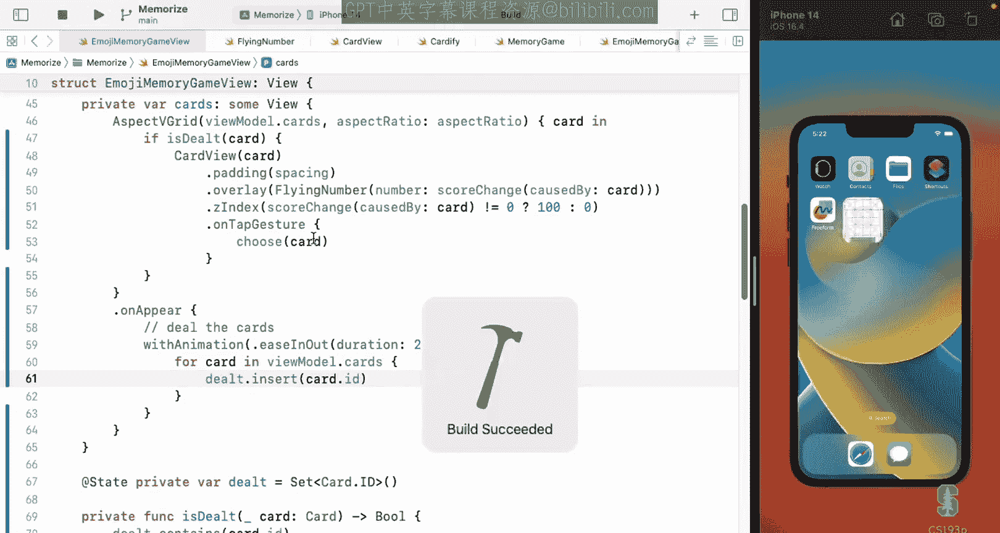

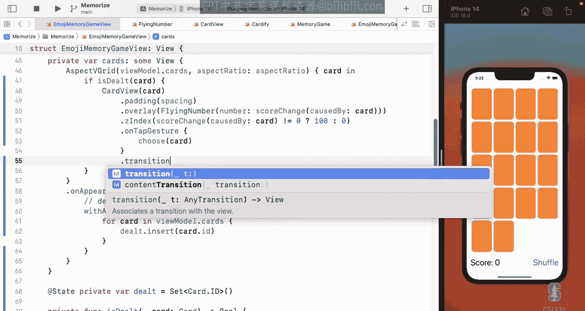

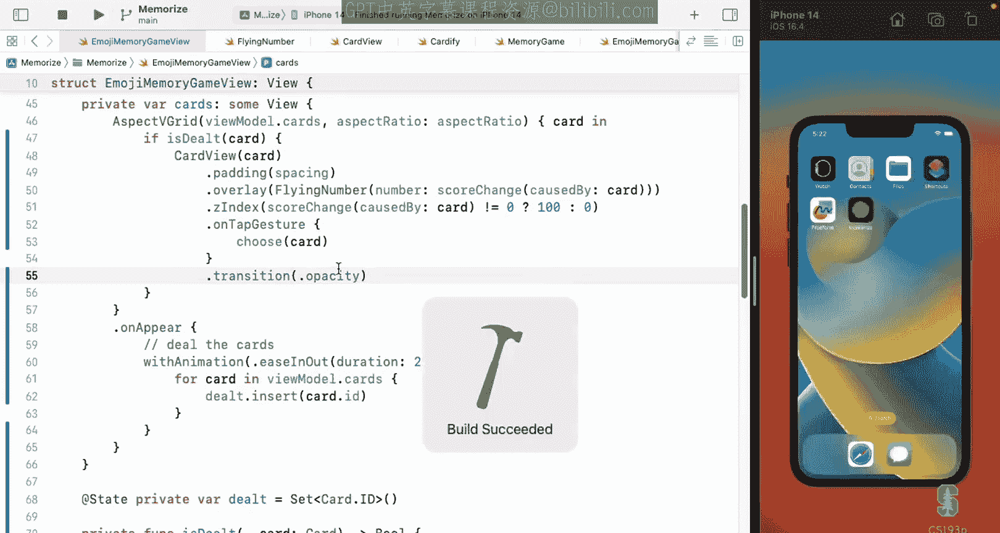

```swift
AspectVGrid(items: viewModel.cards, aspectRatio: 2/3) { card in
    if isDealt(card) { // 仅当卡片已发时才显示
        CardView(card: card)
            .matchedGeometryEffect(id: card.id, in: dealingNamespace)
            .transition(.asymmetric(insertion: .identity, removal: .identity))
    }
}
```

### 创建牌堆视图

牌堆由所有未发出的卡片堆叠而成。

```swift
@Namespace private var dealingNamespace

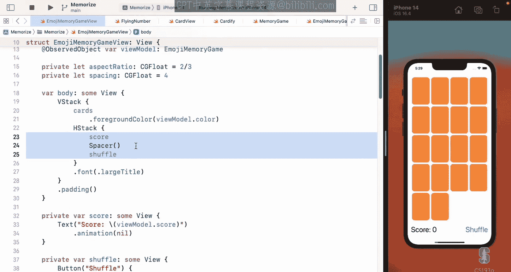

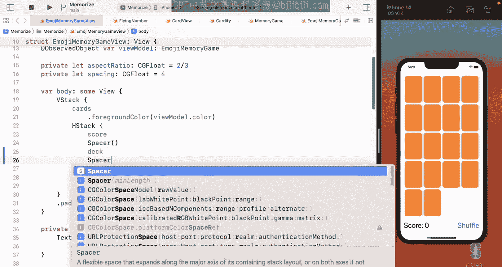

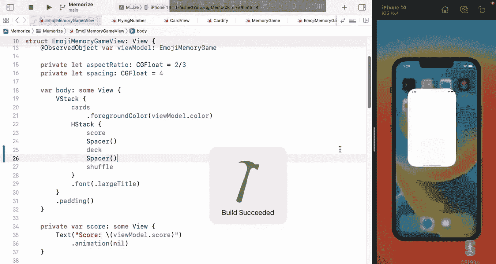

ZStack {
    ForEach(undealtCards) { card in
        CardView(card: card)
            .matchedGeometryEffect(id: card.id, in: dealingNamespace)
            .transition(.asymmetric(insertion: .identity, removal: .identity))
    }
    .frame(width: deckWidth, height: deckWidth / aspectRatio)
    .foregroundColor(viewModel.color)
    .onTapGesture {
        deal() // 点击牌堆发牌
    }
}
```

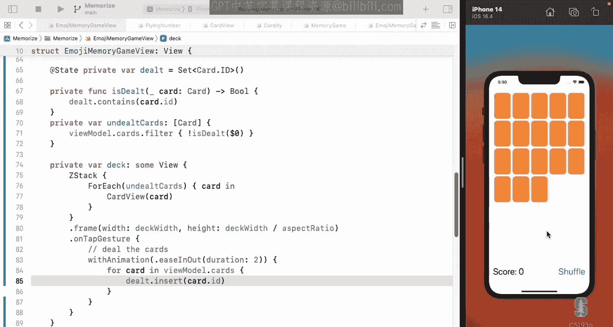

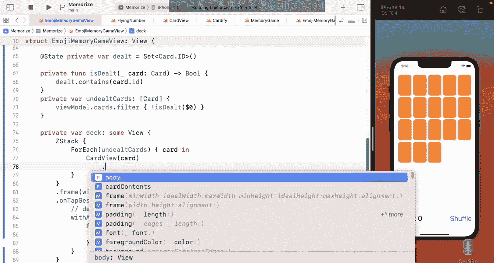

### 实现发牌动画

发牌函数遍历所有卡片，将它们加入`dealt`集合，并为每张卡片添加递增的动画延迟，模拟依次发出的效果。

```swift
private func deal() {
    var delay: TimeInterval = 0
    for card in viewModel.cards {
        withAnimation(dealAnimation.delay(delay)) {
            _ = dealt.insert(card.id) // 触发动画
        }
        delay += dealInterval
    }
}

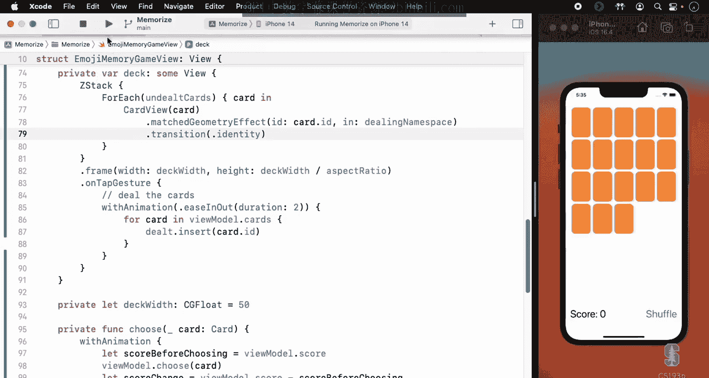

// 动画常量
private let dealAnimation: Animation = .easeInOut(duration: 1)
private let dealInterval: TimeInterval = 0.15
```

### 使用Matched Geometry Effect

为了实现卡片从牌堆“飞”到游戏区域的视觉效果，我们使用了`matchedGeometryEffect`。它能让两个在不同位置的、具有相同ID的视图，在其中一个被插入、另一个被移除时，其尺寸和位置产生平滑的动画过渡。

**关键点**：
*   `id`参数必须唯一标识视图（这里使用卡片ID）。
*   `namespace`参数用于区分不同的动画组（例如，发牌堆和弃牌堆需要不同的命名空间）。
*   为了**仅**使用几何匹配动画而禁用默认的淡入淡出过渡，我们需要设置一个不对称过渡：`transition(.asymmetric(insertion: .identity, removal: .identity))`。

---

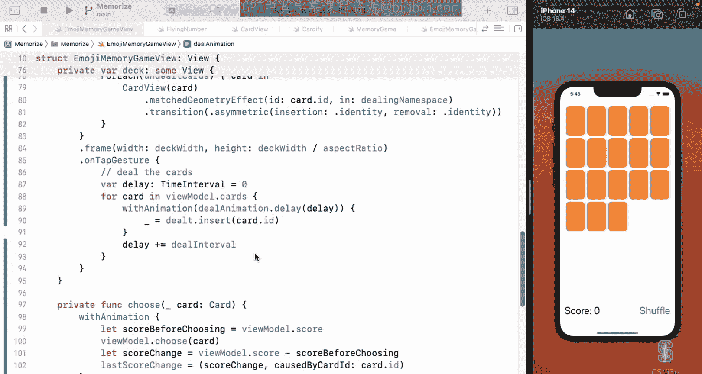

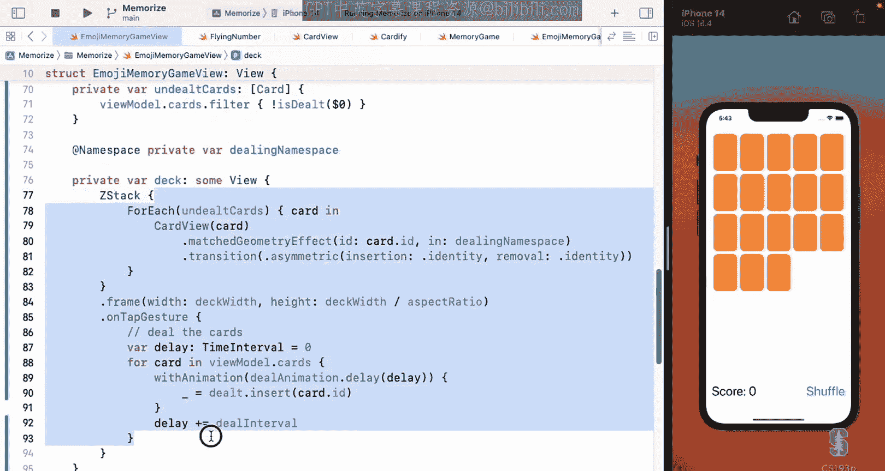

本节课中我们一起学习了SwiftUI中几种核心的动画技术：
1.  **使用`withAnimation`和状态驱动视图属性变化**，实现了分数的飞入飞出。
2.  **利用`TimelineView`创建基于时间的连续动画**，让计时器饼图得以平滑转动。
3.  **综合运用状态管理、延迟动画和`matchedGeometryEffect`**，构建了复杂的发牌序列动画，并理解了命名空间和过渡修饰符在其中的关键作用。

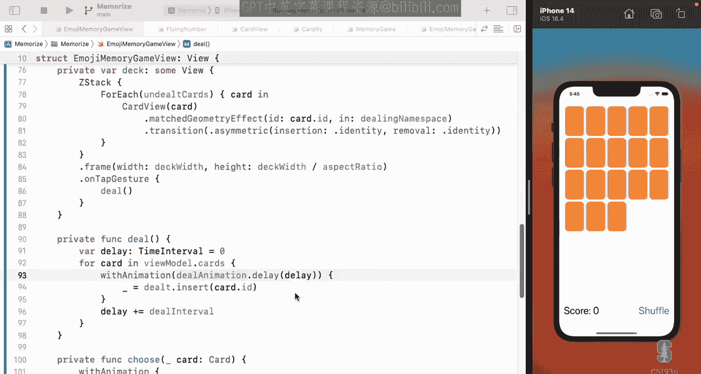

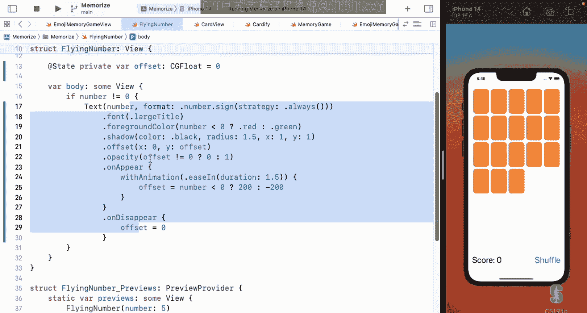

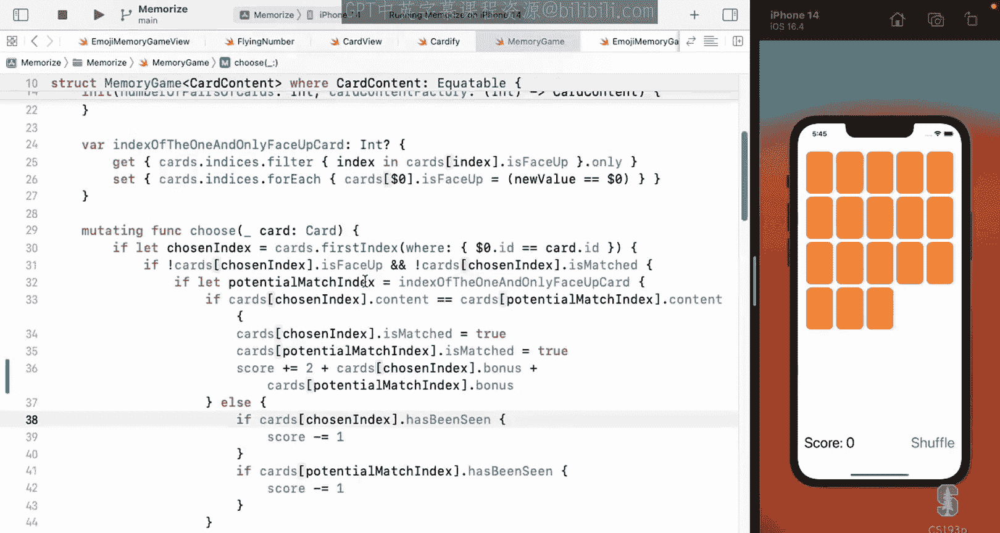

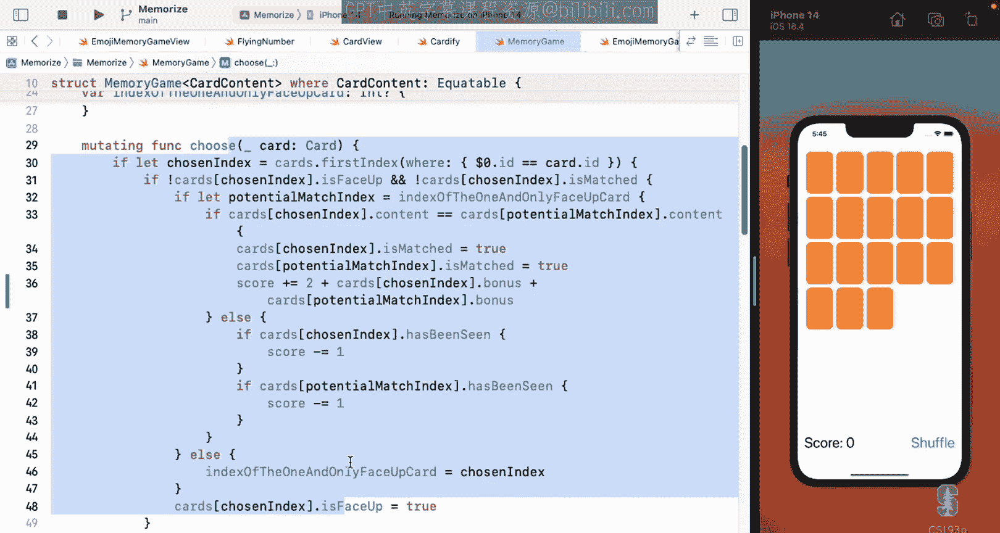

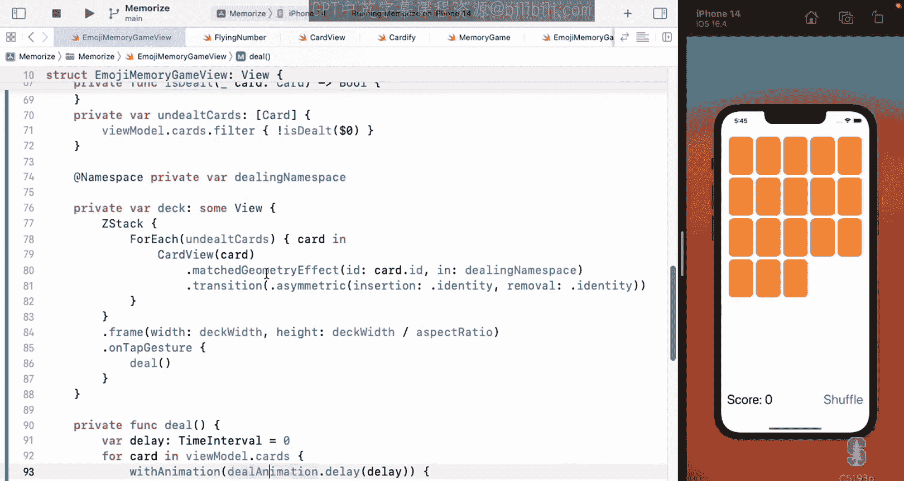

通过这些实践，你应当能够为应用中的各种状态变化添加生动、流畅的视觉反馈，极大地提升用户体验。记住，动画的目的不仅是美观，更是为了清晰地传达信息。