# 斯坦福大学《SwiftUI的iOS应用开发｜CS193p Developing Applications for iOS using SwiftUI 2023》 p10 -10-Lecture 10 _ Stanford CS193p 2023.zh_en -BV1HyzNYdEiD_p10-

Allright， lecture 10 this week we are going to start a completely new app called emoji art I'm going to show you what it looks like in just a second here and that's going to allow us to okay of course like we always do learn new things for example this week we're going to learn about drag and drop how to do that gestures that's the main thing Also multiple MVVMs so far our app only had one MVVM but a real app has many MVVM so we're going to have an app that has another MVVM and eventually we'll get to talking a little bit more about colors and images and how they're represented and multi writing and error handling very important things and we're all going to be able to do this on the framework of this emoji art thing so let us go and do that here is what emoji art looks like it is as you can imagine making art out of emojis and I've already created one here this cow and these bees down here in the rocket chip。

up there， those are emojis and we create our art by going down here。

 you can see that I have a whole bunch of emojis that I can scroll around and I can pick them up and move out of there so let's put this one here maybe。

Cal wants to look out because here comes a car coming down the road。

And what we're going to do this week is learn to do that drag and drop that I just did and also drag and drop of the background。

 you see this nice countryside image right there， I'm going to do that background and we're also going to do multitouch specifically here I'm going to be able to do things like zooming in like if I zoom weigh in on this one。

Really far in。You can see that there's a ghost， no window right there， emoji that I put in there。

 and we're also going to want to be able to pan around， see I'm zooming in and panning。

So that's what we're going to be doing in the first lecture today is building this basic UI that you see right here。

 and you're going to take it the next step， your assignment is going to be pick the car up and be able to move it。

In other words， have this edit the selection， create and edit a selection。So let's go back to Xcode。

We're going to create a new project。This app that we're going build。

 we're actually going have this working on the Mac in addition to on our iOSos devices。

 but we're going to use the mechanism to work on the Mac called design for iPad because our app looks pretty good with an iPad like UI on the Mac。

 So when we choose it here， we're not going to choose multiplatform。

 You see it says multiplatform in the corner there。

 That's if you want to build an app that truly build a native Mac app and a native i app。

 And I don't think I'm going to get to that this quarter。

 but we are still going to be able to have a Mac app using this design for iPad mechanism。

 So we're still going pick i app。Just like we did before， this is called emoji art。

And same old stuff here that we had before， you wouldn' to have same organization identifier。

 all that stuff。And you're going to want to put this into your repository except that that's really not what you're going to do because as I said。

 when you get your assignment five assignment it's going to have the code from this week in it if you wanted to follow along here as you'll you know maybe go watch this on video and you're following along youll probably just create it in some other place and then when you clone your assignment five you'll get a nice copy to work with from there。

I'm going to put mine。Right here in my developer directory。This big， close some stuff here。

 make more room。Huge fonts。Well you don't even need this first one thing you notice is when you first created it。

 it's showing me an iPhone here as you saw when I showed you the app， it's an iPad app。

 not an iPhone app。We're going to make our app work on iPhone too。

 but we're first going to target it for iPad because in authoring mode when you're making theseoji works of art。

 you really would love to have an iPad plenty of room to maneuver you're going to be able to do it on iPhone but it's pretty crowded in there so how do I make my little。

Preview window here， show me an iPad， I just pick an iPad as the target here。

So if I pick an iPad as the place I'm going to run my simulator。

 then the preview is going to match that up now I'm going to say right off the bat as I'm doing demos here。

 I'm not going to keep this open because an iPad isn an unfortunate aspect ratio it if I was going to show it to you。

 it makes it quite wide so I'll be opening and closing the preview or I'll just be clicking run the simulator and we'll fly over and see it in the simulator etc。

 it's not quite as fun as it was when we had that code there and it was just everything I changed was instantly showing you that。

Let's start by doing our model， which we always like to do understanding what it is we're building maybe we won't get the model right right off the bat。

 but a pretty good idea， so let's go over here file new file。St file because it's a model。

 and I'm going to call my model emoji art。An emoji art structure is going to be that background and although emojis and where they are and what size they are because they can all be different sizes。

 that's it。 that's the entirety of my model so far， maybe we'll add some more stuff later。

 but that is the entirety of it。Totally UI independent here is not going to， you know。

 know how I'm going to display these things on screen， so it's astruct called emoji art。

And it has this var background and I'm going to store my background there's actually multiple ways we could think about storing our background like we can store it as an image。

 we haven't really talked about how to do that we only know about image as a view for displaying images like system images we've seen but another way we could do it by it's just having kind of the raw data of an image is to store a URL here and this URL it's just can be HtTP s something out there where the image is on the internet。

Now that's going to create an interesting problem for our app。

 which is that sometimes the internet is slow and I want to draw the background of my beautiful artwork。

 so how am I going to do that so we're going to see that's going to create some nice problems for us to learn how to solve。

😊，And then of course I'm going to have my emojis and we'll just make this an array of some other struct called emoji。

 let's go down here and have a substruct emoji and this substruct emoji it's going to have the string that represents the emoji。

And then we need this position， I'm going to have its position be yet another littlestruct。

 and then we need the size， which I'm going to make it an int。

 and notice I'm not using like CG float or anything in here because this is UI independent。

 So I can't have CG floatat。 so so I'm st as an int。 you could say I I should be storing as a double。

But actuallym going to have the coordinate system for my emoji art be kind of set by my background。

 So most backgrounds， if they have any kind of resolution are going be at least a few hundred wide by a few hundred high probably a few thousand wide0 I so having the size of the emojis kind of be in an integer boundary should be good enough。

 at least that's the design decision I'm making here might be wrong。

 but that's what I'm deciding and the position is just an X and y， so let's say bar x bar Y。And。

I made these be vs because I can imagine that obviously while I'm using my document I'm resizing those emojis or moving them around。

 in fact that's your assignment is to be able to do that so their're vs so they can be edited and currently my emojis right here is public access var that you can go change all you want。

Nothing thing that stop you from changing all the positions and sizes or anything。

 the only thing I don't let you change is the actual emoji on an emoji has to stay if it's a ghost。

 it's always a ghost， it doesn't change to being something else。And that's really it。Model。

 simple model。 We're not really focused too much here on all the MVVM stuff because you've already done MVVM to the nines。

 but I thought it would be valuable to see another M Vm here。 In fact， like I said。

 we're going to do two MVVMs。 So let's go on now and look at our view model。

 What does our view model look like for this All right file new file。File。

And I'm going to call this emoji art。Document and that might seem like an interesting name for my view model。

 but the reason I'm calling an emoji art document is that we eventually want our emoji art thing to we have multiple windows on our Mac。

 for example， multiple windows or on an iPad side by side documents that we're working on。

 We want to have multiple emoji arts in our app。 We don't want to just have like we had memorize one game That's all there is this is one game。

 we don't want to have one emoji art now we're going to have that for a while until we put some support for documents in there。

 and I'm thinking ahead a little bit， and I'm going to call this an emoji art document。

Here is Of course it's our view model， So it's Swt UI。

 It's part of the UI and it's a class emoji art document。 and of course it's an observable object。

 It's like all of our view models are， we can always start off with that。

 We always know that our view models are classes and that they do observable object。

 I didn't start with that with memorized because you didn't know those things。

 but now that you know what they are， of course we start with them at the start and of course we're also going to start with what is our model。

 Well， it is of course an emoji art and I'll have it set up to be just a blank emoji art。

 We didn't have any ins in our model oroji art model so we get to free one and we didn't have any uninitialized bars right。

 we go back here to our emoji art。 This is an optional So it starts out nil right。

 we get the free equals nil。Nail here and then this one we said is an empty array of emojis。

 so there's nothing we have to initialize so we can just。Haven't had initialized right there。

You probably got the idea that I'm kind of a fan of protective view models。

 view models that protect their model against invasion。

 so I am going to do full protect mode here and say that this is a private v only I'm going to allow you to access it so that means I have to provide things like an emojis computed property here。

 public property that lets you get at these emoji so I'm going to return my emoji arts emojis and I of course I'm going to be doing a lot with emojis here so I don't want this error cannot find type emoji in scope so I'm going to go really quickly we're right up to the top and say type alias emoji to be emoji art do emoji and I would argue you could almost put this type alias at the global level。

Unlike in our memorize where we had a card and we might have other card games。

 the word card is so generic in this case capital E emoji that type it's almost certainly going to mean the emoji that's inside of an emoji art so I could if you made the argument to me to put that globally so I don't have to put it in all my you know my UI Strs and all this Id probably be w you on that I'd probably go with that but for now we'll leave it named spaced inside of our view model here。

And I probably also need the background， so I'll have our background here。Which is a URL。

I want to return our emoji art background and what about setting these values so I'm definitely going to of course have intent I'm going to market here intent functions and for example。

 a funk set background， of course we want to be able to set our background to a URL。

And we'll just say emojiart。 backgroundground equals that URL。

And we're going to have more intent functions， I mean obviously we're going to need intent functions to move the emojis around right and to resize them because you're going to be doing your multituch to do that and we'll add those later we want to add everything up front to get the idea question。

我。the see。The question is why am I doing this， why am I making emojiR private and then having this public thing well the answer is I'm protecting my emoji art it also gives me an opportunity I'm protecting it from someone who calls the wrong things on it like maybe they add emojis and when you add emoji you have to do something and in fact we're going to see that that's true and I don't want some view to do that so I'm providing functions that I'm telling to the view here's how you can access this model。

Only in these ways， only these public bars， only these public intent functions。

 that is the only way you can access this model。I'm sure you're just like， well that's so simple。

 why would you ever do that and this is the problem with the demo is of course I'm making it simple we can't stand here for hours typing more and more code in making complicated models。

 but again I'm just trying to show you what it looks like to do this a more complicated model like if it was a SQL database obviously you want to protect it you don't want people making SQL calls into your SQL database your view model wants to make the calls for you right？

Hope does that make more sense if it was a more complicated model， would it make more sense yeah？

Okay。So we got this。 that's our view model for now。 We got the idea about this。 Let's go do our view。

I'm going to file new。Well， this is a swift BuI view， so I want the one in the corner here。

This is an emoji art document view， it's a view of an emoji art document。

 you give it an emoji art document， it draws it。No matter what it is， it draws it， that's its job。

 that's what this view does。Create。It is。And our emoji art document view， what does it have in it。

 Well if we go back and look at it over here， it's kind of got the image and then it's got this little scrolling emojis thing down here right that's the only two pieces we have so far of this So let's put those pieces in here。

 make it just a v stack of them V stack at the top we're going to put I'm going to put color yellow at the top because we don't have our image yet。

 So imagine that the background this is color yellow thing and then scrolling emojis I'm going to put down here So scrolling emojis is going to be some view I'm going to create this going have that little scrolling emojis thing down there。

It's a view， obviously， has a bar body， which is some view。

And we had to put some scrolling emojis down there。 Now one thing some of you might be saying is。

 wait， VStack， this app over here。It looks like like a Z stack actually right because you see the image is going behind it's not stacked on top of it it actually goes behind。

 well actually this is v stacked and right now I'm just not clipping to that space so this image is big and it's spilling outside the bounds now of course our color do yellow that I have as a placeholder it's not going to spill outside its bounds but this image is and this is an interesting thing about Swi is that views can spill outside and sometimes you want to allow that and sometimes you don't and in this app sometimes we're going to and sometimes we're not but we're not doing it for this background we're letting it spill out。

But it's still a vStac， we all still want the scrolling modejis at the bottom and you know the other thing generally at the top。

So let's do our scrolling emojis here， the body of our scrolling emojis。

 I'm going to do it conceptually first and then we'll fill it in with some reality。

Conceptually it's a scroll view and specifically it's a horizontal scroll view now we didn't see this when we did the other scroll view because we didn't have an argument because vertical is like the default。

 I guess。And we specifically want this to scroll horizontally if these mojis down the bottom。

And it's a horizontal stack stack， we've got a for each。

 we're going to go over some number of emojis down there， we'll talk about that。

 I'm going to use this ID backslash self， which means this emojis， whatever these emojis are。

 they better be unique。Because I'm going to use themselves as their identifiers， so this has to be。

 this can't have any repeat emojis in there， that's going to confuse the each， but that's okay。

 we can make that happen。And then of course， emoji in like we do with all four incheses。

 and then I'm just going to have a text of the emoji。

Now we're not quite there because what is this emojis Well， this emojis。

 it could be a string of emojis。But then this emoji right here would be what a character。

Because if you for each over a string， you get the characters。 I don't quite want that。

 I actually want this to be a string so I can pass it to text。 Text doesn't take a character。

 It takes a string。 So I want this to be an array of strings。 Each string is one emoji。

 That's what I want to do。 So let's go up here and make a var for that。 emojis is an array of string。

And each string is an emoji。And the only problem with that is it's real convenient to have a list of emojis as a string。

I instead of having to say open square bracket quote one moji and quote comm quote it thats the pin in the neck be nice if I could just do something like this。

 let's go up here and say I have one here scrolling emojis I could just say private let my emojis equal a string of a whole bunch of emojis and that would be really nice So how am I going to pass this string into this that takes an array I'm just going make and in it I'm going to knit right here and just hit tab and it gave me a default the default in knit。

 but instead of just taking the emojis as an array of string。

 I'm going take it as a string and then I'm going convert it to an array of strings So the first thing I'm going to do is unique it。

Unique。Great little var that takes a string and removes all duplicates。

 Unfortunately it doesn't exist。 There's no such thing。 I wish there was。 There's not。

 So I actually wrote that myself。 And this is a classic case。 when you're coding and you're like。

 you want a function。 and it's just not in the Swift library。 You can write it yourself。

 And how do you add it extensions， right， That's what we use extension force。 So I did it。

 I have it over here， let's go and drag it in。😊，I have it on my desktop， I think。

 somewhere out's go over here here it is extensions。sft， so I'm going to pick it up drag in here。

Drop it in。When you drag and drop something in， you almost always want that destination copy items if needed because otherwise it's going to essentially be like a link。

 a symbolic link to it。Be careful that it's a link to a place that you know what's going on over there that's not changing out from under you。

 whatever。Of course， when you copy it in， it makes a copy of it。

 so it's freezing at the time you copied it in， but that's what we want here let's take a quick look at this extensions file that I just dragged in。

You can see down here， extension to string。 I've added this thing unique。

 It's not a very good implementation of it' not very efficient or anything。

 but it just reduces that string into a new string where it's checking to make sure the thing doesn't already exist right if not so far that I've created contains the thing than just keep up it right so it's really inefficient。

 it would be it's fine for small strings。 you wouldn't want to do it on really large strings but very inefficient but it's good enough。

 now notice I have some other things in the extension。

 we're gonna to see this I've extended CG rec to have some things CG size I've actually created a type alias for CGI size called CG offset I have some transitions here。

 I even have a button kind of special button than I made We'll look at that in a bit and you know as I add more extensions and made more little utility views。

 I'm just gonna to throw them in here over time。Let's go back here we have this unique。

 it's actually a thing， now I want to convert this from a string to an array of strings。

Let going do that with map。So map takes a collection of things， it might be an array。

 it might be a string， a string is a collection of characters， so it's a collection。

 and it maps them and creates a new array where each of the things in the other collection gets a function run on it。

And then ends open the new one So what is the function I'm going to run on it。

 I'm going to convert it to a string so dollar0 here is a character because I'm doing map on a string。

 emojis do unique is a string。String of a character makes a string with that character in it。

This makes sense right， everyone's cool with this， Im me show you another way to do this that you're going to see encode code and you're going to be like what the heck is going on there now you're going to know I'm going to say map and map takes an argument。

 what's the argument to map？In this case， the argument to this map is a function that takes a character and returns a string。

 that's what we want to return a string so here's a function that takes a character and returns a string string dot in it so when you see type dot in it。

 this means call that constructor with this argument。When I say string dotted it here。

 I'm passing a function that takes a character and returns a string。In fact。

 this function will also take other things and return a string because you can pass a number to the string construct and a double and it'll turn it into a string that's what this means when you see dot in it it means call the constructor with this thing notice I don't I'm not doing curly braces here I'm just passing this function the string dot in knit function because the argument to map is a function so I'm passing it a function string dot in it is a function it's the constructing function and it uses type inference to pick the right one the one that takes a character in this case。

That makes it nice and also I probably don't even need to say emojis。

 it's pretty clear scrolling emojis takes emojis， so I'll do this external trick that we've done before。

 get rid of that。Let's surpa pass this in here， trolling emojis， emojis。All right， let's see。

No there it is and it's kind of hard to see but you see my scrolling emojis right there， well。

 it's hard to see because these are very small。Let's make those emojis bigger so we can see them a little better。

 how are we going to do that Well probably one of the best ways to be just to set the font and I can set the font of this whole thing up here。

 see who it says scrolling emojis that's that scrolling emojis view down there。 What if I just said。

Dot font， use the system font of a certain size， we'll call it my palette。

Emoji size or something like that， turn this into a nice little private let palette emoji size a CG float。

Make it， I don't know 40 points or something like that， that's better。

What else can we do to make this look a better。 One thing I don't like see the ghost right there。

 Boy， he jammed right up against the edge。 let's give a little padding here。

 let's make a little padding。 I'm gonna say dot padding。

 Now the interesting thing about padding is I don't really want this much padding There's no need to have this much space all around I really just want this padding on the sides So I'm just going pass an argument to padding here dot horizontal and that only does the horizontal padding。

 The other thing is， look there's a little bit of space between my image here。

 my background image and the emojis， I don't even really need that。

 and I know eventually it's gonna spill over anyway。

 but I want these emojis kind of as tight as I can。

 And what about the space down below this space down below is actually a safe area because on an iPad you can swipe up from the bottom everyone pa an iPad or seen an iPad that you can swipe up from the bottom and get to the app switcher basically So let's at least fix this by having spacing。

Zero between the thing on the top so that we get down as tight as we can down here。

The other thing I notice， and I'm kind of surprised by it， but do you see little scroll indicator。

 see that scroll indicator， it's hard to see it's kind of a little gray bar that appears when I'm scrolling I definitely don't want that so I'm going to take that out I didn't think that that would appear there I'm kind of surprised by it but I'm going to say scroll indicators hidden because I don't want it in any case。

And I'm putting it here， but I could also put it up here。The place it should hide it。

 So let's go try that。Yeah， see， there it's not showing that little thing。

Let's work on this color yellow。 Let's turn this into the body of our document。

 the actual emoji art document in here， I'm going to make that be a separate little v。

 so I'm going to。B called document body and then go down here and say。Private bar document body。

 which is some view。And what do I to put in my body so again I'm going to do this kind of conceptually and then we'll just chase down all the errors that are showing because reality is not the same as conceptual and our emojiR document is basically a ZStack with all the emojis and the background right the background in the back of the ZStack and then all the emojis are stacked up on top of it all one big ZStack though so let's make a Z stackack。

And the thing in the very back， and I actually put white background in the back。Behind everything。

 even behind my image， if you scroll around to the point where the background image is not even showing。

 I want it to be white。

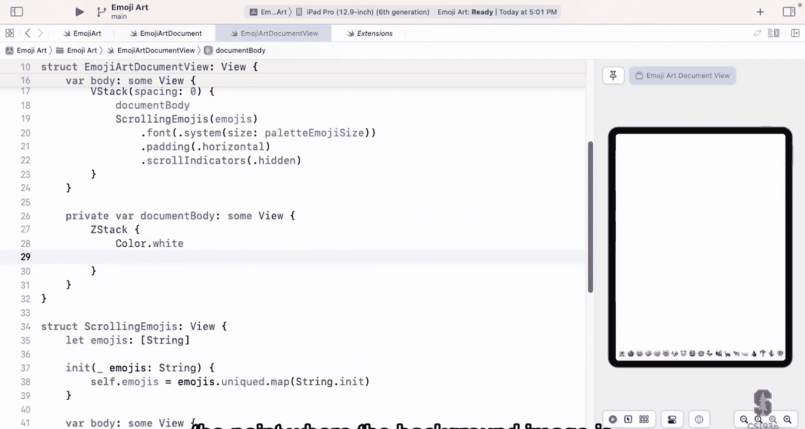

In the spaces where there's no background image right， in other words。

 if I go over here and I zoom way in right say zoom way in here see I want that to be white。

Over on the sides， consumingooming even more here。

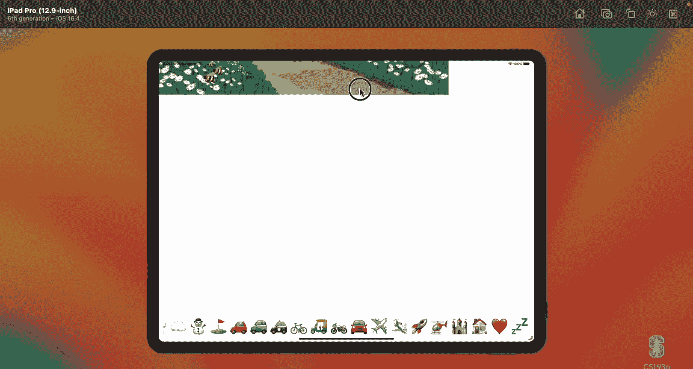

See what I mean by I want a big white square， this area here I want to be white。

I'm putting that in the very back of my z stack then the next thing is I'm going to put my image image goes here。

 we don't know how to do that yet， but we will in a second and then I'm just going to put my emoji so I have before each with all of my documents。

Emojis and for each emoji in there， I'm going to create a text。With the emojis string。

 and then I want the font be nice if I actually had like emoji font and then I'm going to use this new viewmodifier we haven't seen before called position。

 which is the emojis position Now again， I'm conceptual here。

 This is gonna create all kinds of errors and we're gonna to chase these all down。

 but this is kind of a conceptually what I want。 if I could write the code this way。

 I'd love it as a view。 remember I always want my view code to be simple and conceptual and semantically meaningful。

 I'll put the complexity somewhere else like in my view model or somewhere else So let's chase these down。

 what's the first thing cannot find document and scope。

 Why did I type document emojis there because that's my view model， the document my view model。

 but I never put my view model as a var up here So let's do that at sign observed object var。

 my document is an emoji art document。G like we did with memorize and all this stuff。

 we obviously need the view model that is driving our document Now how are we gonna to set that value again。

 we could make it an outside state object and create it here but we definitely don't want that think ahead to what I was talking about where I'm gonna to have multiple documents in my app like on the Mac or whatever well each of them is' just gonna to be an OG document view and I'm going to be passing different documents to it as I open them in the file system or wherever I get them from so I definitely don't want to have the state object and have it be stuck in here plus eventually we're gonna be saving these documents on disk and all that stuff we don't want that inside our view views aren't about saving things they're about displaying things so we definitely want to pass it in now down here in our preview。

 we need to do one here So down here we might just say as we are want to do just create one on the fly because every single time I click on this thing It's gonna re。

anyway， so it's fine if that viewmod isnt getting constantly recreated， we really don't care there。

 but the real key， the real important one is over in our app so if we go to our Moji art app over here here's where we want to do the exact same thing we did before state object bar。

Call this our default document because we are only a single document app right now。

 but we're going to have multiple documents and it will set it equal to an emoji art document。

And then we're not going to do content view in our app。

 we're going to do an emoji art document view going pass。It。This default document。

I see why I'm calling it a default document because right now it's a single document app it only has our one document they're working on we don't even know how to save a document let alone open multiple。

 but eventually we're going to and when we can start opening multiple we're not gonna to even have this outside state object here instead the documents are going to start coming out of files right file system or whatever and that's a ways down the road five or six lectures in the future but we want to be ready to do that someday but for now we'll just have this one default document we keep in the state object at the top level that's the same thing we did and memorize so nothing new here。

Let's go back to our view， see what other kind of errors we got going here。

Referencing initializer in it for each requires that emoji。Conform to identifiable right。

 of course we have a before each there， the things that we for each over have to be identifiable。

We're going to all the way back to our model over here and make this emoji art emoji。

 this thing be identifiable。And we know that means that we have to add a var here that's ID and what type should we do Well。

 since this is a document essentially with a bunch of emojis in it。

 I'm going to use an int as my type and I'm just every time I add an emoji I'm going to increment the number so in my document I'm going to keep one number which is the next number to use。

I'll call that its a private thing here， I'll call it unique emoji ID and we'll start it out at zero and then every time I add an emoji I'm going to increment that by one and make that be the identifier。

Now how am I going to set this， well， I'm going to have to add a function to add an emoji to my document that does this thing of incrementing that。

 so let's create such a thing the emoji that you want to add and what position you wanted at。

Give an emoji dot position here and the size you want it to be。

And then I'm going to say unique emoji ID plus equals one， go to the next one。

 and then I'm going to say emojis do append a new emoji。

 so let's say emoji and I'll put this on multiple lines so you can see it a little better here and the arguments are the string to use for the emoji。

 that's what you just would pass into us the position also passed to us。

The size also passed to us and the ID， which is this unique emoji ID。

Now we get the error that we're hopefully really used to because we are trying to modify ourselves。

Both adding emoji and also incrementing our unique ID so we need to say that this is a mutating fun that way Swift will know that if you add an emoji it has to copy on right the entire emoji document which is fine that's all you want here。

Now， this is not really going to work 100%。Why is that because var emojis up there is public var anyone could go along create their own emoji with any idea they want and put it into our array of emojis。

 and maybe it has the same idea something we already put in so somehow we have to make it so the only way to add an emoji is by calling this function。

This is the only function that knows how to correctly put an emoji in there So how we're going to do that we're going to go up here and say private set only we can set an emojis Now this is going to have some ramifications it's going to make this work So now the only way you can add emoji is with this function but what if you wanted to resize an emoji or move an emoji Now this guy emoji art is going to have to provide functions for that and in your assignment5 you're going to need to do that because I'm going to ask you to make emoji is resizable andmvable so you're going have to add functions here to do that and in your view model for that matter。

I'm speaking of the view model， I have ad emoji here， but my view model， since it protects my model。

 it needs an addd emoji as well。 So I'm make it a little easier myself by starting with this same function。

 It's just an intent。So let's go down here we're a class so we don't need mutating and I might do some nice things for my view like maybe I'll take a CG floatat here because my view is more likely to want to send me a CG floatloat instead of an int and my job as a view model is to make it easier on my view this is a small thing to make it easier on there and then I'm just going to call that same function over there emoji art emoji which I'm allowed to do because this emoji art is private to me but。

That means I can write it。And so here's the emoji and the position and the size。All right。

 let's go back， keep looking over here。Build。Got rid of our identifiable problem That's great。

 what's the next thing value of type emoji art and emoji has no member font。

I tried to call font on an emojiart emoji now some of you I know are saying oh。

 that's illegal because a font， that's a UI thing and an emoji is a model thing there's in no way I can't have the font be the model and that's true okay but all things are so true but it is not true that you can't have a font far there because we can go and add an extension。

To emojiart。 emoji， that adds a v font， which is upt font。

 and it returns a font dot system font of size， Cg float value of the size from the emoji。

And you might look at this and say， who， this got to be illegal somehow here isn't this illegal and it is absolutely not illegal and this code is not part of our model。

 this code is part of our view in this case because that's why I put it in the view， however。

 I'm not even going to put it in the view， this is the kind of thing that would be really nice to put in my view model。

Because my viewmod's job is to help my view make life easier。

 so why wouldn't my viewmod add a nice little extension to the emoji here to add this nice little function that the view once。

 it makes the View code look so pretty over here。So it's perfectly legal for it to add that over there。

We're almost there now we've got conflicting arguments to content and it doesn't know the types。

 It's very confused about this position So what is position position is a viewmodifier we haven't seen so far It's the viewmodifier that like H stack uses to position the views in a little horizontal stack or aspect V grid uses it by having lazy V grid use it to say put the things in columns in rows So position is how you position something inside your view space and here we want to obviously position these emojis at the right place in our z stack we don't want them all stack up on in the Sanur or find that。

 we want them to be positioned where they're supposed to be The problem is that emoji dot position。

Is an int。And that has to be APG point floating point point that we have to pass to it。

But it's even worse than that because we haven't even really talked about what coordinate system this position is in。

Everything that x and y is an offset from the middle。Cartesian kind of coordinates。

 right that you're used to with up being up and the background image is centered on the middle。

So if you move around in the document or scale it up or anything like you scale things up。

 everything just scales together， everything's scaling out of the middle。Now。

 that is a problem over in my view， because where is the middle of my view？You know。

 it's like I need to find my middle。Well， the only way I can find my middle is to get the coordinate system of my view and figure out where the middle point of it is。

 because that middle point is where I'm going to put things that are at0 zero， for example。

 in my Mojag document and all everything relative to that。

So how do I get my coordinate system in a view， well， geometry reader， of course。

 so I have my geometry reader proxy。And we'll go down here。

And we saw how geometry reader can tell us the size。

 but it can also tell us the entire coordinate system。Of our view， we definitely need that here。

 so I have a geometry now I know the coordinate system。

 so it would be really cool here if I had emoji position in that geometry。

That would be awesome to have a function called in geometry that was in emoji do position。

 just like we have the var font that we added， well we can add a function to。

 so let's go over and do that I'm going to do that in my view model here。

 so I'm going to add this one， this extension to emojiart。 emoji。 position。

And this is going to be a function it's called in and it takes a geometry proxy and it returns a CG point。

 which is exactly what my view wants， my view wants a CG point that represents that emoji R position in that geometry Now what's this error keyword in cannot be used here in is that keyword we use in a four loop right for each we say in the closure。

 it's the thing that separates the arguments from the things so we can't use in there。

 but actually we can if you go over here and click the fix you'll see what the fix is which is to put back quotes around it if you want to use a reserved keyword as the name of your you can you just put back quotes there single backwards quotes。

It's like escaping it out of there so it doesn't interpret that and then on the calling side you just say in you don't have to use any quotes on that side。

A gun cool。How do we find the center of our geometry here。

 because that's really what we need to do to be able to do anything。

 I'm going to say let center equal。Our geometry。Frame in the local coordinate system now we can get our frame in the global coordinate system of our entire device。

 but we want it in the local coordinate system of just our view， and I want the center of that。

A center。Nice little bar gives you the center of a CG rec。

 this geometry frame in local gives you a CG rec， the rectangle。

 which is your entire coordinate system， your view， unfortunately center does not exist。

 so that's another one I added VMI extensions over here to my extensions you'll see right here CG rec I added the bar center I also put a away to create a rectangle given its center and the size。

Just from my own convenience。You might say hey you know why do you really need to do that well it makes this code look really clean right here because otherwise I'm going to have to do all this stuff that I'm doing over here。

 like you know mid X and midY all that is just not as clean as just saying the center， please。😡。

So now I've got the center of my geometryries frame， right， my views rectangle。

 and now I just need to offset by whatever the emoji's position is from the center。

 so let us just return a CG point where the x value is that center。

Plus a CG float of the x value and remember the I'm adding this as an extension to emoji。

 emoji do position， so that struct has x and Y。RememberNow let's go look at it。Here it is。

Right here see it has x and Y and since I'm extending it， I can use x right here。

 unfortunately it's an int， so I have to CG floatize it because I'm returning a CG point here。

Let's doing that in the same thing here， the y is centeredt y。Plus CG float of Y， except what？

Upside down Cor system。The organ system is upside down， so that's really not plus。

 it's actually minus。Because I told you that I wanted my emoji arts scoring system to be Cartesian upright。

It's easier for me to think about it to do it that way and again。

 this is part of the job of the view model， interpret this wacky or normal Cartesian like coordinateism for the view which has this upside down coordinate system。

Anybody cool with that， so now we go back here to our view。Build。

Buildil succeeded so this thing that I started out， I said was just like pseudo code。

 I actually can type it that way type it in exactly I said because my view model helping me out with a lot of little extra functions there。

Believe it or not， this is enough to actually look at our document let's go put a couple of emojis。

 we can't drag and drop any emojis in from our thing， but so let's drop a couple in。

 I'm just going to go over to my view model and let's add in a knit。And inside the in。

 I'm just going to add a couple of these things。 So emoji art add emoji， we' add emoji of some kind。

 And oh， here's another cool thing here。 I could say emojiart do emoji dot position， sub X， whatever。

But this is kind of a lot of things to type， so I can just say dot in it here。

Saying dot in knit allows type inference to go and say， well， what am I expecting there。 Oh yeah。

 I'm expecting an emoji art dot position， So I'll just use that as the initializer to use。

 So now I can do the X and Y。 So let's put one of them at-200。Minus 150。With size， let's pick 200。

 we'll make them nice and big because there's demo mode here and let's do another one。

 so we have a couple of them。We'll put the other one of the other side the other side of our Cartesian coordinates here this way we can double check that our upside downness and all that stuff is working and we'll make this one small so we can tell which one it is and what kind of emojis we want to use here let's just pick some random emojis。

How about。Biciycle that looks a good one and for the other one， flame。All right。

 let's take a look at this。 I'm going to actually run this。

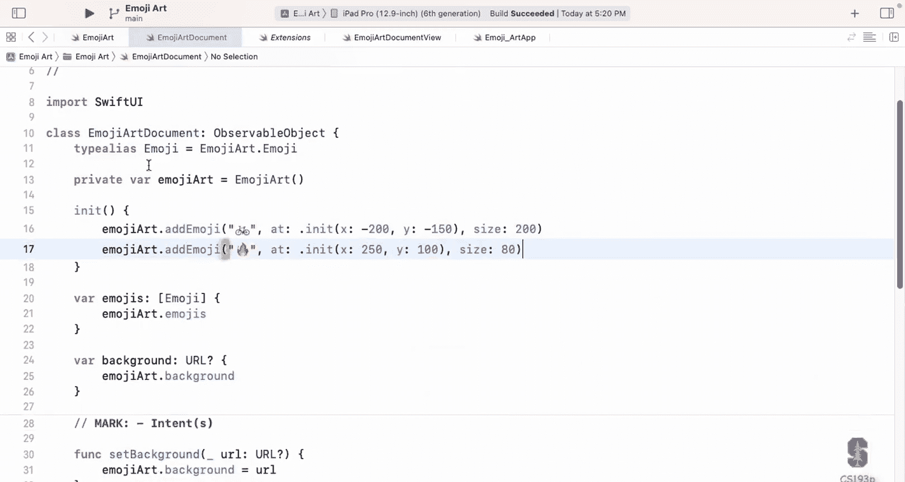

Look at it kind of bigger mode here。Look at that。0，0 is the middle。

 this was what minus 250 minus 150， that sounds right。

 I'm going minus I'm going minus and this one was plus plus， so I'm going plus plus from the middle。

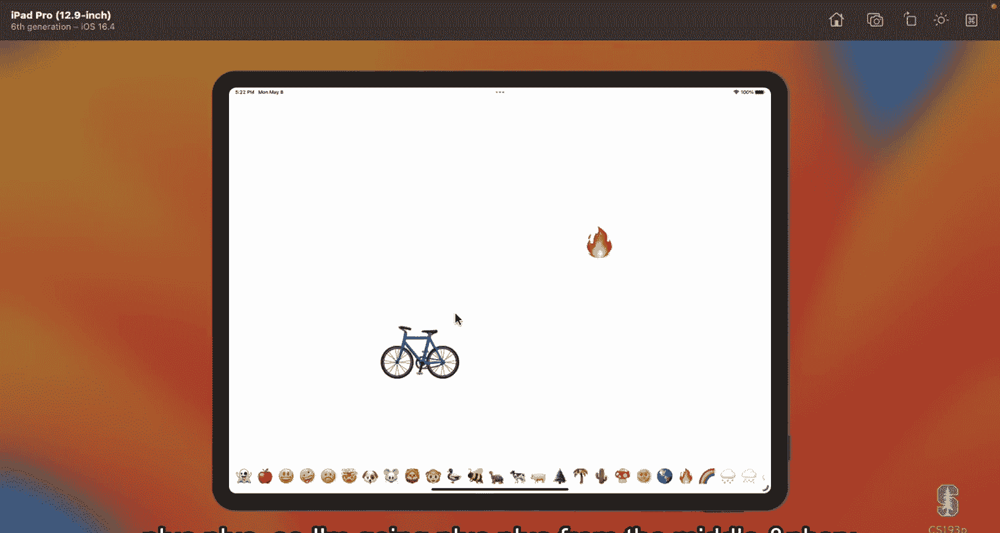

And if I went back here， maybe we changed this one too。Plus 150。LetSee if that works。

 so we changed the bicycle to be plus 150， it should be up above and it is。

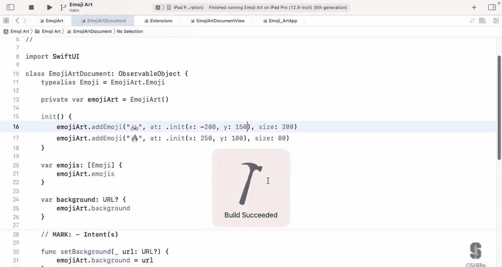

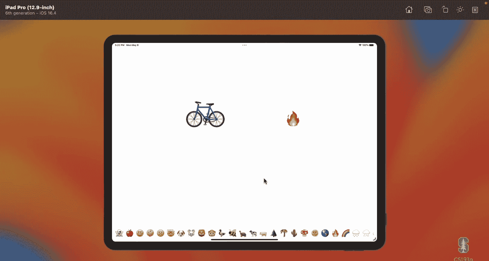

doesn good。 This is nice。 Everything is working well here。 Now， let's get our background image going。

 We've got the emojis going there。 Let's show a background image。

 That turns out to be incredibly easy to do。😊，Weve got our ZSt over here that has all of our。

Emojis and I'm just going to replace this image goes here with a view called and you'd think we'd want to put image here you know you know we've had image system name and I told you you can do image named and nothing like that。

 but actually we don't want the view called image， we want a view called Async image that takes a URL。

In this case， are documents background URL， an Async image， really cool little view。

 it puts up a gray box while it goes out and fetches that image and when a big image comes back。

 it shows it to you asynchronously。Now we're going to write our own asyncch image in this class because I want to teach you how to write your own asynchronous code。

 but for now let's go see this one in action。

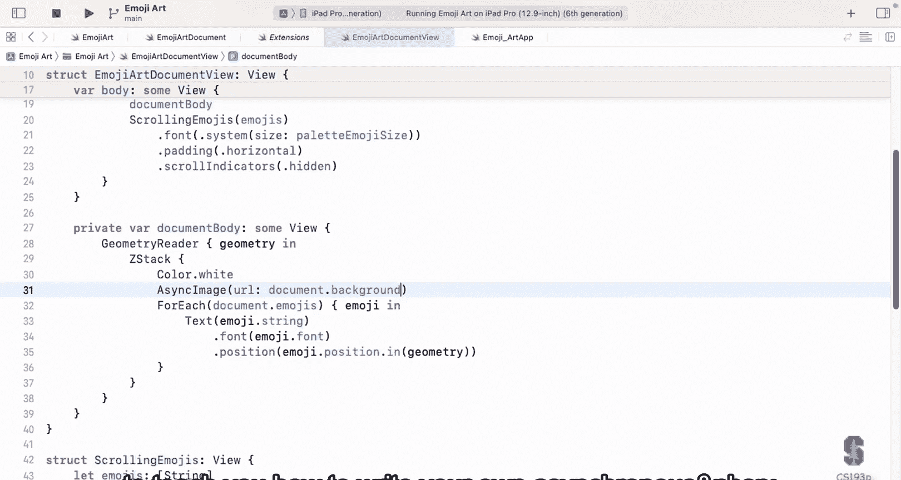

There it is gray box。Hamgen said it， how do I set that URL？We're going to do that with drag and drop。

 we're just going to a website somewhere， and then we're going to drag and drop。

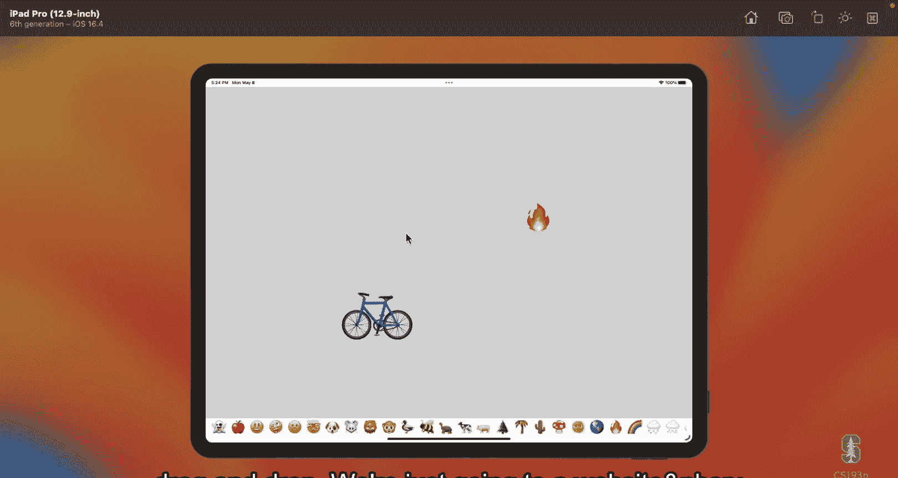

One other thing I want to do about this image is where is this image？

Right now it's just kind of centered in our coordinate system， but that's not really what I want。

 I want it centered in the emoji arts coordinate system， so I'm going to say dot position here。

 and I'm going to put its position being emoji dot position basically x of0 y of0。In。This geometry。

Okay， we need our type alias up here， of course。It baius emoji equals emojiart。 emoji。

 so I'm already regretting I didn't make that global to type it twice。

But I'm just taking the position 00 in our geometry and putting the image there position you probably already figured this out is always positioning the center of the view when you say position of view here it puts the center of the view there to exactly what we want in this case。

This code， by the way， is fine emoji deposit x0 y0 in geometry。

 but really what would be cool if I could do something like position do0 in geometry？Okay。你冇知。

t position do zero in geometry and you'll the reason I'm putting this here as something that be nice is you're going to see this a lot with Cg rec do0 Cg size。

0 Cg point。0 and I just want to show you how that's done it's pretty obvious really if I go over to my emoji arch I can just add a static let here in my position。

Call it zero and it equals self x0 y0 I'm me show you two things here one is that you can have these static lets like zero on yourstructs if it makes sense to have a zero。

 but also I'm doing this I'm calling self this is myself capital S self means the type your code is in。

And you'll see I'm only putting it there because you'll see it sometime we could easily say emoji dot position。

 in fact， we could just say here position。That would be perfectly fine， that is the type here。

 but capital S self is the same thing there。In case you ever see that。All right， Bill succeeded。

Now we can go on to doing our little drag and drop and I'll talk about it in slides and then we'll go do it so let's go to the slides。

How does drag and droprop work。You are just going to make sure that the thing you want to drag or drop implements the protocol transferable makes sense right it's going to transfer when you drag it and drop it somewhere。

 it's going to transfer it so it has to implement this thing called transferable and all this basicstruct。

 strings and ins and datas like if you're dragging image data and yes URL。

 they all implement transferable so we can easily drag and drop all of those things。

Now there's two sides of being drag and drop， there's being a drager and a dropper。

A drager is a view that can let you pick it up and drag it around。

 And a dropper is something that lets you drop something or transferable on you and you can do something about it。

 Let's talk about the drager first， being a drag initiator is just the view modifier draggable。

If you put the viewMo ofifier draggable on any view。

 then you can pick that view up and start dragging it around even into other apps。

And all the dragggable viewmodifier I wants to know is what is the transferable that I'm going to transfer if someone drops you somewhere。

 so here if I had a text that was showing some emoji string in it and I said dot Drggable。

 I would give it the emoji so that when someone picked this text up and dropped it somewhere it would be dropping the emoji the string。

The argument to draggable is a transferable and it could be any transferable URL string whatever that's it that's all just required the system automatically deals with picking the view up and you know lets you drag the view around it's actually amazingly simple。

But what about the other side， the dropping？To be D E you just need to add the Viewmodifier drop destination to yourself and that tells the system Im a drop destination for this kind of transferable。

And so the code looks something like this， here I have some rectangle。

 this rectangle is a drop destination for strings。And you can see that the rectangle is strokes its edge with a either a five or one line width。

 depending on what it's highlighted， it's a drop destination here and notice when you say drop destination you say for what kind of transferable。

Am I drop destination for strings or for ints or URLs， what are you trying to drop on me？

And then you provide a closure here and it gives you an array of the things that were dropped on you Why is this an array Because in SwiftUI you can drag and drop multiple things at once。

 you do it with two fingers， you pick the thing up with one finger and then you tap on some other things and it adds it to what you're dragging so like our little emojis at the bottom we could pick up one and then just start tapping on the other ones and it would be adding them to it so now I'm dragging multiple things around。

So it gives you array of those things and the point at which it was dropped in your local coordinate system。

 of course。There's also another closure that's optional that you can put on there called I targeted and that is just telling you someone is dragging on top of you。

 they haven't dropped yet， but they're just dragging over you so do you want to highlight yourself so here my rectangle when I'm targeted you see it sets the highlight to true。

When I'm being dragged over now that's why my rectangle has five thickness border。

 and that's only when it's being dragged over， not dropped， just drag over。

 it's just kind of giving feedback to the user。 look you might drop now you don't need that very much because when you drag over something that can drop by your finger。

 there's a little plus sign you're gonna to see it in the demo little green plus and that tells you。

 oh， I can drop here。So that's important feedback and usually that's good enough。

 but you can do it if you want。Only one drop destination view modifier on any given view now you can have different drop destinations on different views。

 but on one view you can only have one and this is a major restriction for us in emoji art。

Because we want to drag our background in and we want to drag the emojis in。 One is a URL。

 the other one's a string， I can't have one drop destination for URLs and one per string on the same view。

 and yet they're being dropped into exactly the same spot。

 So I'm going show you how we can work around that， but that is somewhat of a restriction here。

 It's kind of nice that emoji art has that restriction because I can show you how to get around it。

So let's go back to the demo and do this let's do the dropping of the URL background first this is really very。

 very easy where do we want to drop this thing， we essentially want to drop it on top of our ZStack that is our document here so dot drop destination and what are we dropping URLs。

Notice that this URL do self， when you say do self lowercase to a type， that means the type itself。

So here I'm saying I'm a drop destination for things that are of type URL。

 I'm passing the type URL actually to D destination as an argument here so it knows what kind of thing we're looking for。

Then there's the closure， takes an array of the URLs and the location that we dropped it。

 we don't really care about that for the background。

 but we are going to care obviously for emojis and then inside here we have to process it。

 this closure that you give it has to return whether the drop was successful because some of my drop on top of you and you look at it and they're like。

 whohoa， I can't take that。And then you have to say no so that the thing will fly back to where it came from。

 so I'm going to return from a function I'm going to write。

That drops these URLs at that location in my geometry。

 you can see why we're going to need that in a second。

 we're down here and create a little private bunk to drop URLs， which is an array of URL。

At a location which is a sub CG point in geometry， which is a geometry proxy， and it returns a bull。

 which is whether it successfully drops I'd put it down here just because。I don't like any of my vs。

 but especially my body to have a bunch of junk in it， So I'm putting this off and I was like。

 no other reason don't have to do this。So what do I have to do here。

 I it's going to grab the first URL So I can say if I can let URL equal the URLs first the first thing in the array。

 so it's I don't think this can happen。But if for some reason you got this dropping and the array was empty。

 I don't want to crash， but I'm not sure that's possible。

 I don't think D destination would call your closure with an empty array I don't know why it would ever do that。

 but I'm just being careful here that in case this array was empty shouldn't be。

 but I'm just going to grab the first one in the array and use it as my background image basically so I document I call this intent function set background to that URL and I'm going to return true in that case。

Otherwise， I'll return false， let's try this。

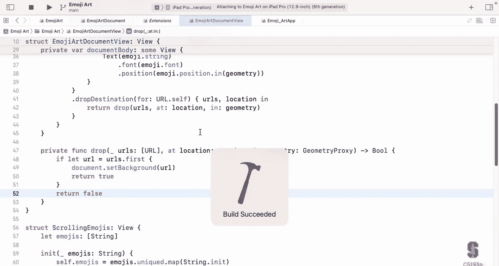

Here we are now we're going to learn a little bit about iPad UI here so you can drag up from the bottom here to get to other apps and start other apps。

 the other thing you can do is look at these little three dots at the top see that add another window add another window use sir I'm going to add this Safari so I got a safari window there so now I've got two windows on screen at the same time and I can just drag and drop between them so that's how you do this。

To get this functionality， you need to turn on on your iPad， a feature called stage Manager。

So if you go into your settings， they're somewhere there and somewhere I'm not sure either look for stage management or not。

 yeah。All right， so I've gone to a website here， it's just a search engine。

 I've searched countryside cartoon backgrounds okay because that's my favorite kind of background。

 countryside cartoons and there it is and you can see actually the first one there that's the one that I was showing you before。

 but we can pick up any of these and you just press and hold to pick it up and you can start dragging it around you can drag it over into our app。

And when we get over here， look what happened， look at the little green plus。

 and this is telling you that if you drop it here， it's going to drop， but notice if I go down here。

 it's gone。Because this is a different view down here。 This is my H stack， my scrolling view。

 it doesn't have。 It's not a drop destination， but this is， so I get the plus green。

 so let's drop it。It's interesting that's not working。

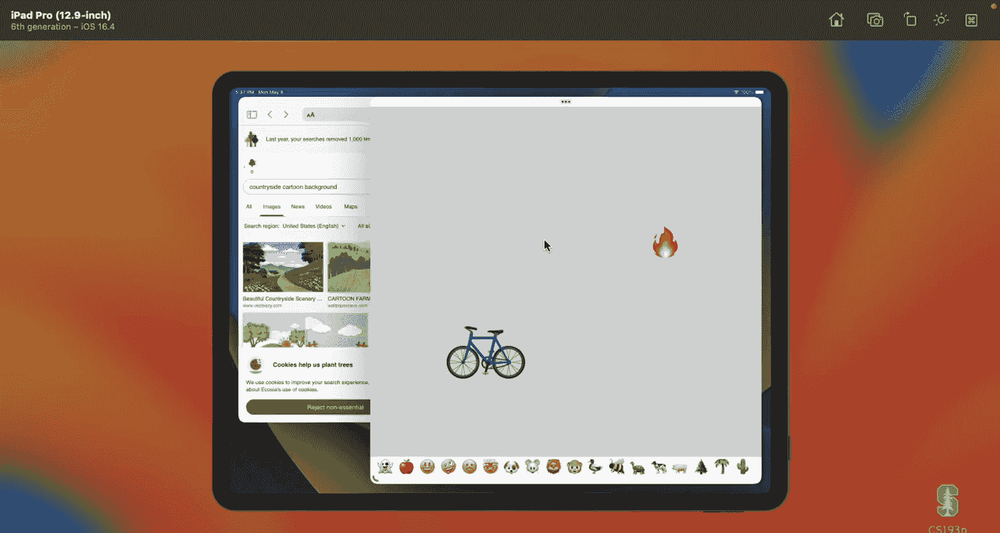

Oh， okay， I know echo got the promise。This is a problem you'll often have happen to you this is a really simple problem this is actually a fundamental problem there's nothing wrong with the code that we wrote to do that thing The problem is the code that makes our MVBM work。

Where is our at sign published we never published any changes so emoji art was changing。

 we set the background it was working great， but we never actually published a changes。

 so it never caused our view to redraw so that you never asked for an async image never reddrew it okay。

So there you go， good learning lesson there。

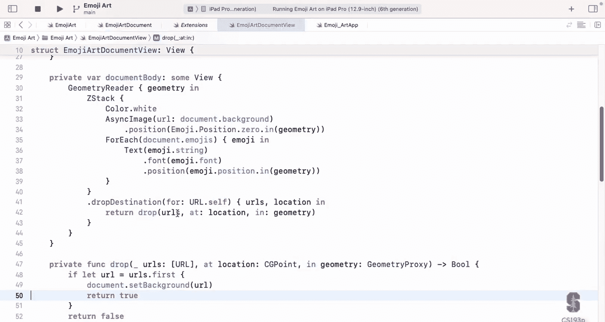

All right， so let's get our other window。

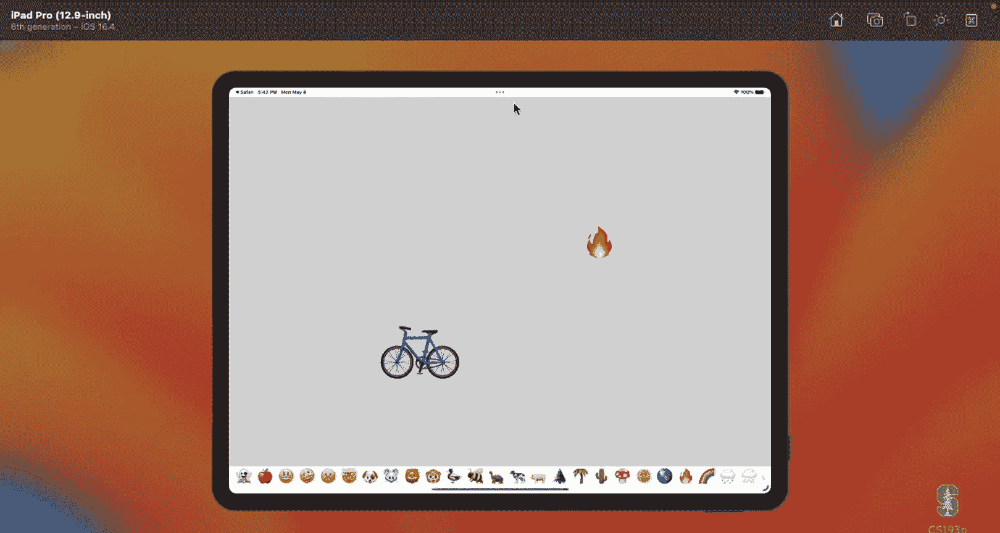

So pickick up something， this guy， drag it in here。See are nice green。Plus is okay， let go。

There it is， I got it， our background， let's go grab something else。

 let's try this one that we used in the other document over here。This one's big。

 so it took a second to load that one， but all the time that it was loading was not blocking our UI。

 all happy asynchronously over there。That's cool So we got that drag and drop working What about the drag and drop of our little emojis down here。

 We want to be able to pick these things up and drop them so how do we do that well。

 there's two sides to that we need to be able to pick them up and we need to be able to drop them so we're gonna have to do both sides when the picking them up size absolutely trivial go down here to the text this is the text that are in our H stack right our scrolling emojis here and we're just going to say that this is draggable and the transferable that you're gonna drag when you pick this view up is of course the emoji string string is a transferable so this works fine but again you could have your own transferables you could transfer and this could be URL you give it whatever you want anything that is transferable can be dragable。

You attach it to any view and it'll pick that view up as you do it。 And this works。

 in fact it's all we need if we go run， it's not going to drop， but it's going to drag。

 pick up turtle， see。

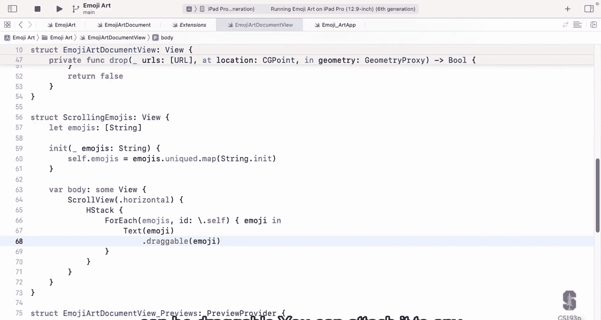

now notice I don't have a green plus because I haven't， I only can drop URLs on my background。

 I can't drop strings， so I drop it， nothing happens， the turtle goes back。

So we got the drag side。Easy， what about the drop side Well。

 the drop side a little trickier because we want to drop it in the same place I want to do something like this。

I want to go here and say drops string and go do a different drop thing here。

 but I can't have two of these drop destinations， I can only have one。

 and I also can't have like an array of different types right here， I can only have one type。

 one transferable。What's the solution， youve got to create your own transferable that can be a string or a URL。

So that's what I did， I' show you that code。Here。It's called St data right here， drag that in。

Butut our'll st data here at the bottom， copy it in。Let's take a look at sterile data。

So sterile data， first of all， it's a transferable。

 so I'm importing core transferable if you're doing the transferable protocol。

 you need core transferable， that's the module that does the transferable stuff。

So what is my type here it's called sterile data string URL data It's just an enum that has three cases。

 This thing is a string it's a URL or it's data raw image data is what we're going to do eventually with that we're not doing anything with data right now and that's it that's really all my enum is you can see that it implements the transferable protocol because I want this thing to be transferable but this thing could be either one of those three things it's an enum so it can only be one of the three things but it can be either of those three things Now the only other code I have in here is a couple of ins that handle the case where one of the types actually is another type for example look at this one a string that's actually a URL so it's a string that actually starts with HtTP something something that's really a URL so I'm just being kind of tricky here and noticing oh someone is transferring a string but it's got a URL in it so I'm going actually say it's a URL and same thing up here've got a URL there's certain kind of URLs that have image data。

in the URL， not where the URL points to， but the actual URL software like for thumbnail images。

 small images， whatever， so I'm just being a little tricky there。

 but you don't even have to pay any attention to those innis。

We got that now the question is how do I make myself a transferable？

I want to be a transferable well all three things in me are transferables strings， URLs data。

 so I'm going to create myself as a transferable by proxy and this is a really cool feature of transferables。

 which is that you can create a transfer representation for yourself that is a proxy of these other formats。

That's how you do it， you just say proxy representation of every other format that you want to proxy and then just provide one of yourself with that type。

And now you can transfer yourself so don't worry too much about this if you don't understand this whatever。

 just realize that I've created a new type called Stroll data， which can be a string。

 a URL or a data it's a single type it's a enome could be any of those three things now I can drop that on my document if I go back here instead of dropping URLs I'm going to drop a strollroll data on myself So everywhere I say URL here I'm going to say stroll data。

copypy and paste to make this easier， be based， based， based Now I'm not going to quite do this。

So I'm just passing these around instead of URLs， st data instead of URLs。

And this is instead of array of URL， it's an array of sterile data Now which of the things is it that actually got dropped well I'm going to switch on myself to find out here switch on that sterile data and in the case that it's a URL that I'm going to grab the URL associated data from the same thing I just did。

And in the case that it is a strain。This is the emoji being dropped on me。

 then I'm going to ask my document to add this emoji。We'll do that in a second here。And otherwise。

 if it's that raw data type， raw data image， I'm just going to do nothing。

 eventually we will make it so you can drag an image， not a URL to an image。

 but an actual image in and we'll do that eventually but we're not doing that yet。

So I need to add an emoji， if you drop a string on me， I need to call my intent function， add emoji。

 you remember that so let's provide the arguments for that and those arguments are the emoji I want to drop that comes from my sterile data right here that's the thing that was transfer。

 the transferable thing。And then I have a location， so what is my location。

 well it's location that's the location that was handed off here。

 unfortunately that's a CG point and when I add an emoji I have to add it out an emoji dot position right which is this coordinate system so I'm going to have to do a conversion to a different coordinate system there。

And then of course we also have the size and I'm going to when I drag an emoji off the pallet and drag in there。

 I'm going to drop it at the size that the emoji palate is。

 well drop it the same size and won't get smaller or bigger， so that is my palate emoji size。

 which is a CG float， but that's okay because our view mile converts it to an in for us remember。

So we have this problem right here where this is passing a CG point。

 so we're going to have to have a little function here。

 I'm going to call it emoji position at location， let's put the function in first。Private。

Bunk emoji position at a location， the location is a CG point in some geometry。

 we always need our geometry so that we can convert geometry proxy and it's going to return an emoji art dot position。

And this is the same kind of conversion we do before I need the center of myself。

 so that's geometry dot frame in the local coordinate systems center， so I have my center。

 I'm just going to return an emoji dot position here and the x value of this is an int which is the location minus the center。

And the y， again， we can't just say location dot y minus the center dot y because it's upside down。

 instead I'm going to say minus that。I need to turn it right side back up again。

 so now I can go up here and say at the location in my geometry。ttle complicated there unfortunately。

 but it's just because it's different coordinate systems we had to do a little bit of conversion there and when we start zooming and panning on Wednesday。

 we're going to do even a little more here okay because when we drop the emojis into a zoomed or panned thing we have to figure out well where exactly did that emoji get drop but we're set up to do that here。

So what's it want here， oh switch st data， Okay， so let's go through all the ster data so I'm going to say ster。

Data in all of the sterile data。Now I'm just going to take the first one and return it。

 and I told you that we can pick up multiple of them and drop them in。

But I'm not actually going to do that even though it kind of would make sense。

 but it would drop them all on top of each other， which is kind of weird。

 why would you create an emoji art where there a whole bunch of right at one spot you'd probably just drag them in separately to their location so I'm just going take whatever the first one is and I'll return true when I find one so I'm going through all my sterile data and first one I find that works either it's a URL or is a string boom I'm just gonna use it either shut the background or drop the emoji。

All right， let's。See if it works。

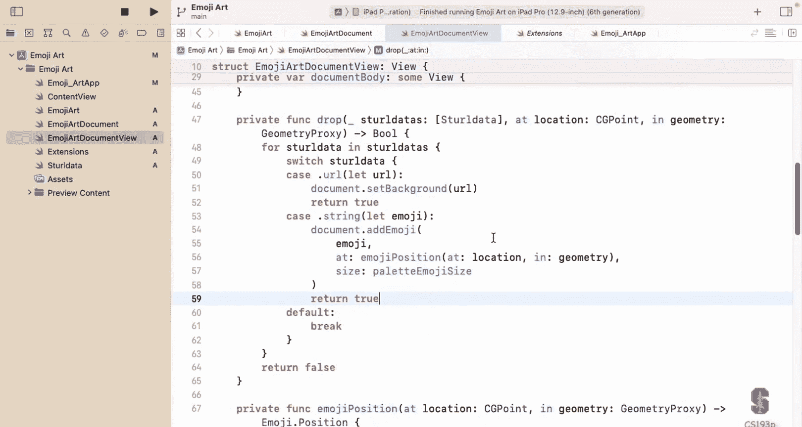

Let's get our background here real quick。When you drag。

 you got to let the other one come forward for it to drag。

 it won't drag while it's in the background and then just drag something How about what do we got here？

We had a rocket ship us put a rocket， so I'm going to pick up the rocket。

We got a plus plus is good and drop。 Go， it works。 You， How about a car on the road right here。

How about。A airplane up in the sky。All right， we'll put a little house here。

So that's all I wanted to show today at the Dr and drop。Next time we're going to work on zooming。

 pinching to zoom and panning around in this thing and by doing that I'm going to show you how to use gestures and then you I'm sure your assignment are going to make it so you can pick the house up。

 make it bigger， you know have a selection of multiple things， make them all bigger together。

 move them around together that's what you're going to be doing for your assignment5。

