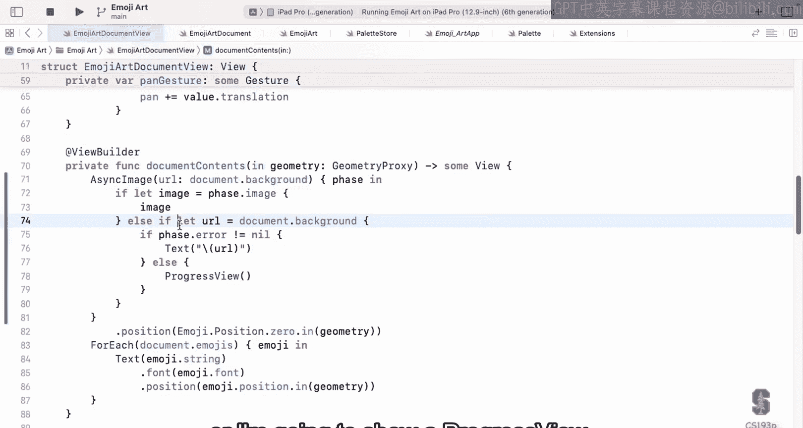
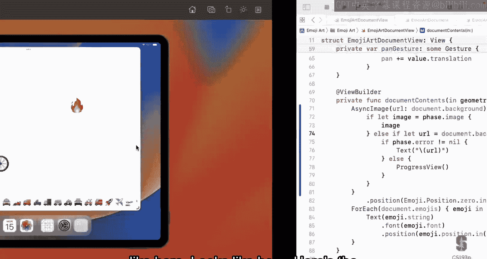
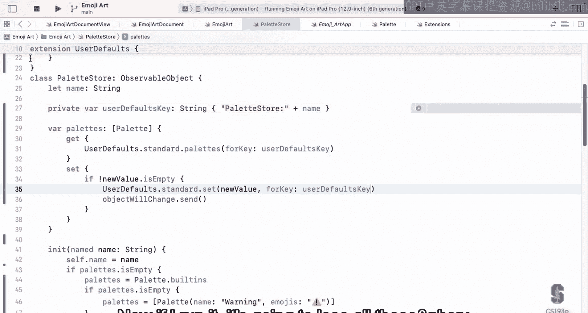

# 斯坦福大学《SwiftUI的iOS应用开发｜CS193p Developing Applications for iOS using SwiftUI 2023》 p12 -12-Lecture 12 _ Stanford CS193p 2023.zh_en -BV1HyzNYdEiD_p12-

Like for 12 today we are going to be talking about persistence that is how to make things stay on your device。

 even when your app gets killed or quits or your device restarts or whatever and also eventually we're going to talk about persistence on the internet as well and where you want data to live out on the network so if you're lost your phone or something you would find it so today is really just part one of that we're going to talk about local persistence persistence on your device and even that we're not going to talk about all the ways to do persistence because for example our little object orient database that we'll talk about later is a really powerful way to persistence that we're not going to talk about。

And then we're going to go into emoji art and see this in action。

 we're going to make our emoji art document persist because as you all know。

 working on your assignments， you move a little emoji around and then you run again and it's gone we have to start it again so we're going to make that persist and we're also going to make our pallets persist right we have those palettes and we can create a new palette we can delete a pallet but it forgets every time we rerun we're going to fix that and then after that down I'm going to go back to the sides and we're going to talk about property wrappers that's all those things to start with at sign at sign state at sign published at sign observed object all those things we're going to talk about what are those things really and what's going on there help you understand that。

So let's talk about persistence or at least part one of persistence here。

 and there's a lot of different ways to persist things in iOS in the file system， of course。

 it's got a UniX file system and we can put things in there。

SQL database or some other kind of network database you can store things in there and there's an incredibly powerful objectoriented way to do that called core data layered on top of SQL the cloud iCloud and store a lot of things there and these are things I mentioned core data and the file system they actually interoperate with iCloud you can kind of make it so that the data you store there automatically gets put on the cloud and there's this whole framework called cloud kit。

 which lets you create records and store them in iCloud and all that so there's a lot of that to do persistence there's a lot of thirdparty options as well especially for storing things on the network and last and definitely least there's user defaults。

 which is this really like a persistent dictionary that you can put stuff in but it's only for lightweight stuff user preferences。

So today I'm going to talk about the first thing there and the last thing。

 but I'm not going to talk about any things in the middle and we will talk about that later in the quarter。

We'll talk about the first one there which is storing things in the UniX file system。

 I don't think everyone knows this， but iOS underneath is essentially a UniX operating system and it has a UniX file system。

And there's file protections， of course， in that Uni file system。

 so you can't see everything in there， you can't see the system files and all that。And in fact。

 it's a little more formal than that you can really only see the files in there that are in what's called your sandbox so why do we have this concept of a sandbox well obvious reasons as you might imagine for security you don't want any other app to be able to reach in and damage your app by deleting a file or something like that also privacy。

 your app collecting user data you don't want other apps to be able to look at what that is some other lesser known but important ones clean up when you delete an app from your device you wanted to delete everything that came with all the data the user created everything gone and since when you delete your app。

 the entire sandbox is deleted everything gets gone so it're not going to be cropped leftover on your device after you delete an app and also back up when you back up your device to iCloud or even to a computer you want your entire sandbox to get backed up。

Well actually not really you want most of your sandbox to get backed up but not everything like your application itself is in the sandbox you don't need to back that up because you can just download it again from the app store or whatever。

 but all the user documents they've created you definitely want that backed up and so that part of the sandbox is backed up so the sandbox is smart about what gets backed up what doesn't etc。

So what's in the sandbox， what are some of the directories， these Uni directories in the sandbox？

There's the application directory that's your executable and also any you know images or other things that you bring along with your app that you're going to present。

 That part of your sandbox is read only so you can't go and edit your executable on the fly we're going allow that and then there's also other places that are editable though like your documents directory and your application support directory these are two very important places in your sandbox。

 the difference between the two really is just whether the user perceives the data that they've created as a document like in emoji art it would definitely be a document you created that so that would be in the document directory if it was just other information like for example。

 in what you're going to be doing for assignment 6 where you're gonna have your memorized you're gonna to have themes。

 maybe the themes they only' aren't really documents their user data you'd store them maybe an application support I think in your assignment you're plug to store it in user defaults because it's really easy but if you're going to store in the file system。

of place would go I mean there's other ones like the cashs directory。

 the cashs directory and put anything you want in there。

 but it doesn't get backed up so anything you put in there wants to be something you can recreate。

So if your Safari app then it'd be like pages that you cache from the internet you can always go back and get them again。

 but you like to have them local to make things fast that's what the cash is director and there's other ones if you go look at the documentation for URL。

You will see what those things are， as I'll show you here。Now when we want to access our sandbox。

 we obviously have to start in one of those special directory。

 Those are the only places we know how to find out where they are in our sandbox and once we find it then we're going to add paths to it to build directory structure and create our files etc and you get the URL to these things via these statics in the URLstruct please go look at URL and you'll see them URL documents directory is your documents directory etc Now I'm been mentioning URL here maybe not everyone's aware everyone knows what URL is I'm sure people know that HttP slash something that's a URL to something on the network well there's also URLs for things in your file system they look like file colon slash some Uni path right so when I talk about URL I'm talking about the path to a file essentially the URL is the structure we use to have paths to the files to files。

And you create those paths by taking one of those sandbox directories and appending path components to it so these URL functions a path component and appending path extension these things to you and give you a new URL So if I wanted to create a document called file name doc in my documents directory I would just say URL that documents directory a pending path component and I would get a URL to that thing that's how I'm going build files and do everything is by building this URLs Now URL has other stuff in there I'm not really going to talk about like you can ask is this URL a file URL or is it an HTTP type of thing you can find that out and it also has all kinds of resource values you can get about the file like the creation date。

 whether it's a directory， how big it is on disk those kind of things you can get all that with functions on URL so URL is a really powerful way to access your UniX file system a lot of convenience mechanisms。

There。But it's not the only way， for example， how do I store stuff in the UniX file system right I've got a URL and now I want to put data in there or I've got a URL that I've put data in the past now I want to get it back one of the primary ways we do that is actually with the datastruct and we've mentioned data briefly。

Data is just astruct which is bag of bits it's one of the fundamental types kind of like int and float。

 there's data right it represents just a bunch of bytes and when we're reading and writing to files a lot of times we're just grabbing all the bytes out of them or putting bytes into the files so data is one of the primary ways that we will access it。

And so how do we read and write data with the data。

 Well there's a initializer called contents of URL you can create a data by looking at the contents of URL and yes。

 that does work with HTTP URLs as well， although we almost never use this because it blocks you can imagine when you say give me the contents of URL it could take five or 10 seconds because the network's really slow or it might take a long time because the network's down or something so we don't usually use it for that。

 but it's great for file access because SSD or whatever inside of your phone you can get it really quick right away。

One thing about creating a data with a contents of URL like this。

 you'll notice that you have to put the word try in front of it。

See that you can't just say let data equal data contents of URL。

 you have to try data contents of URL， and that's because it can throw an error。

And we haven't talked about air handling， we're going to talk about it。

 I'm going to part one of that today， but all of these IO things tend to throw errors when there are problems like your disc is full。

 it'll throw an error at you or whatever。You'll see this red try and throws on a lot of these slides。

 don't worry about it I'm going to talk about it in a few minutes what that is and how we deal with functions that can throw like this initializer for data。

So how do I write the data to the filelist you know I can create a data with the contents of URL。

 how do I write it out well data has a function called write to URL and you just write this data all the entire data out to the URL and has some options for writing there which you can look at in the documentation and this one also throws this one you can obviously imagine why this one would throw because it just could be full it's like ah this full throw an error but even the one on top contents of if it was an HGGP one it could throw an error network inaccessible can't get to that。

So that's data so at URL and data and there's one other one。

 another struck called fileile manager and fileile manager is used to manage the file system itself。

 copy files around， create directories， list directories， see what's in there。

 that's all file manager and we're usually going to get the default file manager。

 which is file manager。default is a static。We're going do all these operations on there like copy and move and file exists and all these things so you can go look at file manager surprisingly we don't do this that much I mean usually we're just getting URLs and then reading writing to them but occasionally you'll want to be able to list the files that are inter directory or whatever and that's what file manager is for。

Using URL and data and Fer， that's how we access the UniX file system。

But how do we kind create the data that we want to put in the file system？

So we're reading and writing data， but the data in our app is not usually a bag of bits。

 it's a struct， which has a whole bunch of stuff like imagine our emoji art。

 our emoji art has all those emojis in the background URL and all in there that's the thing we want to put in a file if we're going to save our file to disk so how do we turn astruct and random arbitrary struct into a data so that we can write it with that data right to URL and we do this with the codeable mechanism here。

And it's essentially a way to gather up all the bars of astruct and smash it into a data。

 specifically the format of that is going to be JSON data。

 how many people here have heard of JSON know what that is。

everybody no almost everybody so JO is just a file format。

 it's actually a text format it's used a lot in the internet to communicate information around it kind of has a arrays in dictionaries of things and there I'll show you what a JSON looks like in a few slides here。

But what this codeable mechanism does is it takes you'restruct and it turns into a JSON， all right。

 which is a big string， and then that string gets encoded into a bag of byte the data and then you write it to a file and then vice versa when you're coming back out。

So how does codeable work， how do you make something codeable。

 how do you take yourstruct and make a codeable， Well。

 it just has to implement the codeable protocol as you probably imagined。

Now codeable is so important that it swift will really help you here。

 so if you have a struct and all the variables of that struct are codeable。

 then all you need to do to make your struct codeable is say coal and codeable right you just say you implement codeable it will do it automatically as long as all your vars are also codeable same thing for an enNum as long as your associated data is codeable then it can code that。

But if you have vars that aren't themselves codeable or let's say you're a class instead of astruct。

 then there's a whole API for how to implement some methods to make yourself codeable and I'm not going to talk about any of that in this quarter but you can go take a look at the codeable documentation and look through all how to do it。

 you won't have to do it， we're always going to try and design ourstructs to always use codeable properties that makes it easy on us。

Now， the way that's human easier is all these types are all codeable。

Not just strings and bos and stuff like that， optional is codeable。

Also array and dictionary and set and data itself is codeable。

 so you can see all these things are commonly used。

 you can build a lot of powerfulstructs out of these primitives and they're all codeable you're good to go。

Once you're struct is codeable， how do I turn into JSON blob。

 how do I get a data with JSON in it from its so easy， there's a thing called a JSON encoder。

 you see it there and it has a function on it called encode and you just pass your object to it and it will pass you back a JSON blob of data exactly what you want you just say JSON data equals JSON encoder encode that object。

 of course the object has to implement codeable for this to work and notice this one throws。

This one throws you have to try it because maybe it can't encode that object for some reason it tries to and it fails。

 so you have to try and throw this one as well， but it couldn't be easier to get a data from astruct that's codeable。

Now this JSON it's not a binary format， it's actually a text format。

 so if you want to turn that data b into a string that you can look at it。

 right look at the JSON string string has a nice initializer which takes a data and the encoding。

 JSON happens to always be encoded with UTF 8 which is a UniIcode8 bit bytes format and if you do that you'll get back the string and it'll look like JSON that you're used to。

Now you can also take that data blob of course and write to URL because it's a data so you can do write to URL。

 of course that throws as we know so you have to try it。But what about going the other way。

 what if I opened up my file and got the date out and now I want to turn it back into mystruct。

 we can do that with a JSON decoder。So the JsonN decoder it has a function decocode and you tell it what type you want to decode remember if you want to specify the type of something you say the name of the type do self that means the type itself we saw that when we did the drop destination remember we're like what kind of type you want to drop and we did stroll data do self here we're doing my types dose and then from the data blob the JON blob that you want and it will return to you an object of your type So if this was an emoji art I would say JSON decoder decode emojiA do self from the JSON data and I would get back an emoji art and again this can throw because this。

JSON you give it could be just a mess could be nothing so clearly this has to throw to say I couldn't find an emoji art in there and here notice that I'm trying it with a question mark and this kind of trying going talk about in a second this means try this and if it fails。

 just return nil I'm not going I don't know I'm going to look at the error but just return nil so that's what that try question mark means so this is how you would decode something that you found in a JSON data object。

So what does it look like to make something codeable。

 if you just put coal and codable on the end of it there。

 you can see these barss are all codeable because I'm saying that some other type is also codeable。

And the JSON probably looks something like this， this is what JO looks like。

 it's got a lot of curly braces and colons and commas and all that stuff。

 but that would be JSON for that thing。OkayThe last thing I'll talk about briefly here is user defaults user defaults really not that important of a persistence mechanism。

 It's really for things like settings if you have settings in your app that you want to remember we're going to put our MojiR pallets in there that's right on the border of whether that's too important of a thing to put in user defaults。

 but we don't actually manipulate our pallets that much so it's probably fine it's not that much data but user defaults is essentially just a persistent dictionary It looks like a persistent dictionary Now it's not the dictionary but it's like a dictionary and that it's got keys and values and those keys and values persist to use it you need an instance of it obviously so you are almost always going to use user defaults do standard that is the big shared。

Dictionary， persistent dictionary you'll use throughout most of your app and it has a ramification that you're going to use this one throughout your whole app。

Which we'll see in a minute。So how do you store something into this persistent dictionary。

 use this one function called set object for key to send this to user defaults that standard there and the interesting thing about this is the object that you're going to set for that key in this little persistent dictionary like thing has to be what's called a property list now this is an ancient API this user defaults it's 20 years old or something so that property list thing is not a protocol or some kind of concrete type it's just an idea right the property list means strings it doubles a raise of those things dictionaries whose keys are strings and whose value is one of those things and also data is a property list so all property meaning list means it' one of those things that's what property list means and that's the object there has to be that and you'll see in the demo moment。

Try and pass some other kind of object there and it's going to complain。

 and you'll see the complaint that it makes there。But since data is a property list， well。

 that means any codeable thing can be put in user default because you can just turn it into a JSON first and then throw it in there。

So it's pretty flexible， actually。So that's how you put stuff in just with this one function right here。

Remember I said that this user's default standard it's the one that we're going to use pretty much throughout route whole app。

 you want to be careful about these keys that you use。

 you don't want them to be really generic because you might have some other class or function construct or whatever that's trying to put something in there with the same name。

 so you wouldn't want key names here like。Like in our emoji art we call it our palette main。

 the main palette main is too generic of a word to be a top level key and user default。

 you'd want to name space it a little bit， so be careful about that you want these keys you got to remember these keys are going to apply to your whole app。

So that's how you put data in how about getting data out well there's a whole bunch of convenience functions and user defaults to get the data out in the type you want like integer for key or data for key or URL for key。

 they are going to return。Something that you set for key in the previous slide as that type now of course maybe you set it as one thing and you tried to get it as something else and this is going to fail that's why all of these you see they return optionals。

Because either you never set something there or you set something of a different type and when you try to get it。

 they can't do it until it returns nil。And there's a nice one here to know which is string array because putting an array of strings in user default is a common thing to want to do。

 so there's a way to get array of strings back out。

Getting a dictionary or array out of there that's not an array of strengths is tricky and I recommend against it。

 I actually recommend just use codeable and create your ownstruct and put it into a data to make it Json that's because if you call the function array for key and user default it's going to give you an array of any we have not seen this type to any it's kind of this type。

For mostly backwards compatibility with the old world of UI kit。

 it means an array of something that you don't know its type and you have to then。

Use this operator as in Swift to try and turn it into the type you want， oh my gosh。

 just forget about all that， don't use array for key or dictionary for key and use your default。

 just make your ownstruct， put it and make it into a JSO and put that in there。All right。

 let's talk about that error handling， the trying and the throwing that you saw with some of these things and why do we have this throwing of errors Well。

 the alternative if we didn't have throwing of errors would be that functions would have to return an error code and this really gets messy if you have a function and it returns something else normally。

 but then if it doesn an error it has to return to error code so now when you're can return either an enum with success and failure which people did for a long time or like a tuple or there's the right answer and then an error see it gets messy whereas if you throw your errors like this。

 then you can make it so that your API looks normal as if there' are no errors and then you have to catch the errors that get thrown the other thing about throwing errors is。

You're going to see in the demo sometimes the code that tries something。

 it doesn't want to handle the errors， but it wants somebody else to。

 so the good thing about try is you can rethrow them up the stack frame until somebody handles them。

It's also easy to ignore errors you get an error thrown you're like I don't care I give up or whatever you can decide what you want to do and so that's very easy to do as well as you're going to see here so we're going to talk a lot more about handling errors when we talk about asynchronous programming multithreading next week because they really work together beautifully having thrown errors and things happening asynchronously。

This is the part one of throwing， so let's talk about the basics here。

When a function can throw an error is always marked， throws。

The end of its declaration in the documentation or whatever it's always going to say throws that means this can throw an error if you want to call a function that throws you have to try it so you always must use the keyword try when you call a function that is marked throws there's no exceptions to this you always have to do this。

Now let's talk about four ways to deal with trying a function that might throw。

 three of them are to basically ignore the error and one of them is to handle the error。

So let's talk about the three ways to basically not handle the error an error happened and you're not going to do anything about it The first one we already saw try question mark that means try this completely ignore any error just do nothing and if I'm calling a function that returns a value have that thing return nil instead so it turns the return value would normally be。

 it turns it into an optional because now it can be nil if that thing fails you do try question mark it makes it so that like data contents of which normally returns the data now it returns an optional data。

Because it might fail。So let's try question mark， kind of complete， that's the ignore case。

 just ignore the failure。Then there's try exclamation point。

 that means crash my program if this thing throws an error。

So this is one that you put in there a lot in development when you're calling something that should never throw an error and it does and you want to crash or you have a nice back trace and you can go debug and see what it is。

 you don't use it as much in production code， although you might because there might be time for you're just certain that thing's never going to throw an error。

 so you're going to do try exclamation point。And then the last way to kind of ignore it is to rethrow it。

Here's a function foo， it's trying something that can throw and it doesn't want to deal with this if this thing throws in error。

 it's like I don't know what to do so I'm going to throw。So if you mark a function itself as throws。

 then inside it can call things that throw and if those things throw。

 it'll just throw it up to the person who called foo and that means whoever calls foo has to say try fo because fo is now marked as throws you see so I'm just。

Throwing it up the chain right and punting unless something else deals with。

 so these are the three ways if you don't want to deal with an error yourself。

Now what if you do want to deal with the error， you want to see what the error was and do something about it。

 clean up or do some alternative thing to do that you wrap your call and try with a do catch。

 so you just say do open curly brace any amount of code you want that can try as many things as it wants。

 and if any of the things inside there， throw an error， then you can catch that error。

Now this catch let error right here is the catchall catch。

 It catches any error thrown and assigns it to a v called error。

 and you could say catch let fo that would be fine。

 and then it would catch it and throw it in a v called foo inside this curly brace area here。

 You would then handle the error inside there。 you can look at the error， see what it is error。

 by the way， will always be something that implements the error protocol Now it could be astruct an enum anything that implements error。

 The error protocol only has one thing in it， localized description which is a string that describes the error that nominally might be something you could throw in front of a user even。

But mostly here when you're catching errors you're looking， if you want to catch specific errors。

 you're going to look at the actual type of the error， what is the enum that got thrown。

 what is thestruct， we're not going to look at any of that today。

 but I will be looking at that next week when we do asynchronous program because we will be throwing errors and wanting to look at which error happened。

😡，All right， so let's go into the demo and see all this in action。

 all the things I just talked about there， we're going to access the file system。

 we're going to be trying things to throw， we're even going to use user defaults。Before we start。

 I'm actually going to do something real quick。Which is a couple of you on the forums were saying。

 oh， I drag an image into my emoji art and it just did nothing。

 it didn't work and we don't really report any errors in our code here when we drag a bad image into our emoji art right we just ignore it。

 It's just like it didn't even happen So I'm going to put a little code in here that lets you see when that happens。

 see an error when that happens and that's because async image does have some mechanism for handling this Now when we do our asynchronous demo next week。

 we're going to do async image ourselves and our error handling is going to be really good Okay because we're going be learning about error handling async image error handling。

 it's minimal， but it goes like this， you can put a little。

Closure after here and it'll pass you this thing called the phase。

 which is the phase of the image loading that's going on and then you can look at the phase and for example。

 if the phase has an image then you can just use the image this is essentially a view builder in here so I'm going to return which view to show so here i'll say if I can let image equal the phases image。

Then I'll use that image Otherwise， if I'm fetching。

 so I'm going to say if I can let URL equal our documents background。

So our background has been set to some URL， then if the phase has an error。Of some sort。

Then I'm going to just put the URL of the background on the screen so you can take a look at it。

 otherwise I'm going to do a kind of a cool thing here， which is I'm going to use a progress view。

So remember， this is a view builder， my async image here is asking me to return。But if and here。

Return the view to use to show this ASI image and I'm either returning the image itself if I've been able to get one or I'm returning a text that shows me the URL that was bad。

Or I'm going to show a progress view。 Pro view is the little spinning dial。 You know。

 you've seen the little spinning dial like wait， I'm doing something。

 So let's try this and see what it looks like here。

Go get。Here here's the background。This one successfully the spinning thing， spin spin spin。

 it's loading it， this was obviously a very big file。

I think this one I hear has got a problem with it， won't work so I'm dragging it in。

 it says it's working， I hit oh error and it's showing me the URL that failed， why did this URL fail。

 it's HTTP， not HTTPS。Unsure HTP Now there is a way I'm not going to show you to make it so that your app can accept unsecure HtTB images。

 but that's why this one failed Now over back in our code。We didn't look at this error。

 this phase error， but it's actually an error protocol error。

 it was thrown and it's being passed onto us so we could look at it。

 look at its localized description， maybe even put that up。

 you can do that if you want I just wanted to show you basically how you do this and I'm not spending any more time on this because like I say we're going to write our own async image equivalent that's way better anyway。

Okay， now to persistence and what we want to do for persistence is auto saveve our documents。

 we're eventually going to have multiple documents， so we can open multiple emoji arts。

 but right now we only have this one and every time we run it's reset to a blank document and we want it to save so we're going to add auto saving to our emoji art document and all of our saving and all that is going to be in our view model。

Because our view， its job is to present this thing our model， its job is to be this thing。

 so who owns saving it on disk， well， that job falls to the view model。

 our emoGA document right here。😡，And it's really easy to make this auto save。

 you see here's our Moji artRT model， it's going to say whenever it changes， please auto save it。

And what is this auto save function， a private funk auto save？

And what do I need to do inside autosSave， I'm just going to save it to。

Some auto save URL of some sort， let's go ahead and make that oh private let autoSave URL and this auto saveve URL is going to be obviously something in our sandbox。

What in our sandbox Well it's going to save to our documents directory because emoji art is a document so that's where it belongs so I'm going to say URL do documents directory now I have to give it a name so I'll append the path component I'm going to call this auto saved do emoji art。

I haven't really invented a type for emoji art， that's what this's conforming to once。

 it wants to know what is the type of document， we're eventually going to invent an actual type do emojiA but for now we're not doing that so we won't specify this conforming。

Two， and there we go， weve got our autoSafe URL in our sandbox。

 and that's the file we're going to save things to。Now when we save it。

 let's go ahead and put a print out so that we can see this is happening， I'll just say print。

 I auto saved to that auto save。URL and then will' also give us a chance to see what this autosSa URL into our sandbox looks like on our simulator anyway。

 which is kind of fun。So what about save two， We need to do that， All right， private。Bunk。

 save to a URL。And how do we save to a URL Well we're going to have to write it to that file so we're going to have to create some sort of data and write it to the URL and what kind of data we're going to do Well of course we are going to let our data equal our emoji art as a Json。

I'm going to do exactly what I said in the slide， I'm going to convert my emoji artRT into a JSON data。

 and then I'm going to write that data out to that URL in my sandbox。To make this all work。

 we of course have to implement this JSON function and we know how we're going to do it right。

 we're going to use that JSON encoder and all that stuff， so let's go over to our emoji art。

Right here and we'll have ak public bunk called JSON， which returns a data。

How do we do this one liner， JSON？Encoder。En code myself。That's it。

 that's all it's required to do it and we've got an error here， what does this error say？

Instance method and code requires that emoji art conform to encodedable。

 And I told you it was called codeable， not encodedable。 remember， well， codeable。

 that protocol is really just two protocols， encodedable and decoable combined together。

 Well I'm going to make emoji art conform to both encodedable and decodable。

This is exactly the same as saying codeable。That's just the combination of those two。

 it only makes sense to kind of do both of them， why would you encode one， you can't decode it。

And when I say that up there it says emoji art does not conform to the protocol decodable。

 why is that， well that must be because not all of its vs are codedable。

 so let's look at all of emoji arts of vs and find out。Background is a URL。 that codeable。 Yes。

 definitely is。Emojis is an array is array encodecodable yes。

 of emoji oh is emoji codedable Oh let's look， here's emoji right here， doesn't lookcodable to me。

 but how about if I say now it's codeable。W do this。 We had another error。 It says emoji marked out。

 emoji does not conform to come。 Oh， no， let's see string ya and yeah， old position。 this guy， okay。

Coable。And we're winning now everything is codeable。

So this is just to emphasize that when you have substructs。

 you need to go mark them codeable as well because everything needs to be codeable all the way down and sure enough。

 no error up here anymore about that。But we do have an error left， call can throw。

 but is not marked with try。And we know that JSON encoder can throw errors。

 so if we want to call this， we have to say try。Now we're going to get another error here。

So what is this error， errors thrown from here are not handled。

 so I say I'm going to try that thing that I don't say what I'm going to do about it。

So what am I going to do about it there， I might be tempted here to use try exclamation points。

Because I know I can be encoded look I only have instant strings。

 although I do have that URL up there， I might be a little worried that encoding that URL maybe that could throw an error。

 I don't think so， butm not going to use try exlamation point it's just too dangerous。

But what am I going to do here？Well， I could do cry question mark and return nil。

 that would be one option， but just to show you how it's done。

 I'm going to actually have this thing rethrow the error。

So I'm marking this JsonN function as throws and look， no more error because if that try。

Throws an air， it's just going to throw right up to who called me。Now。

 another thing I'm going to do while we're in here。

 let's go ahead and print this out so that every time somebody asks my emoji art for its JSO representation。

 we see it on the console just so we can see what the。

What the stuff looks like so I'm going to say let encoded version of this equal this and I'm going to do that thing from the slides。

 which is I'm going to print this out I'm going to say emoji art equals slash parentheses。String。

 give the data to it， which is this encoded data and the encoding of it is UTF 8。

And that might fail because maybe there's not UTF8 in there， I guess， and so if that fails。

 we'll just say nil OGR equals nil on the console and then let's return this encoded data。

So encoded is a data data struck that has JSON in it。

And we're going to use that string initializer to just grab the string out of there。

 the JSON string encoded as UTF8。So now we absolutely know how to turn ourOGR into a JSO。

 we can go back to our view model。And use that here。See what it says。Oh， call can throw。

 but it is not Mark would try。 And sure enough， we know that J can throw right， right here。

 it says JasonO throws。 So I'm going to have to say try to do that。 And what about this one， too。

 call can throw， but it's not marked down here。 Well， of course。Data right。It can throw as well。

 disk might be full。 I throw that air。Now how are we going to deal with this thing right here Well we could throw again and then make the person who called save deal with it。

 but it's time to actually handle the error， so let's handle these errors。

 I'm going to go just put a do catch around this thing catch let error and then inside here error is the error thone。

I can go look at that error， see what type of thing it was with it a network error。

 some kind of encoding error with the JSON whatever now I'm not going to do any of that here because we'll talk about that the next week so instead what I'm going to do if I get an error is just print that localized description out on the console so I'm going see what it is so I'll say here print。

Emoji art document。Error， while saving。And we'll just put the error dot localized description。

Not really handling the error that much， but at least I'm doing something here yeah。Yeah。

 so the question is here what happens if this has an error and this throws an error as soon as this first one throws an error you're down here so it'll never even get to the right that's another good thing about throwing is once it throws an error and stop executing the rest of the lines there because if you throw an error you probably can't continue and that's certainly true here if we throw an error and doing the JSsonN we certainly can't write it out so we don't want it to even try that。

I actually think this is all we need to make things work， let's see if it's working run over here。

Here we have our document， it's go and give it a background。We already have a couple of emojis there。

Let's put another thing in here， though。 How about airplanes， all this。Good one。

 But in the sky up here。 Now， hopefully， this has been auto saving Every time we changed our document is supposed to auto save I can look。

At our consolesul。Oh look there it is Sato saved it quite a few times the last time it saved it right here。

 this is what JSON looks like right emojiR equals here it's saying I auto saved to this file so this long thing users blah。

 blah， blah， blah oh this。Funky number data containers all the way past all the way to here。

That's the directory of our sandbox on the simulator if you were running on a device that would look quite different you wouldn't have all as much junk there。

 but if you ever want to go look in your sandbox on the simulator。

 you can just print out the URL to it and go look there you know it's in your finder you go look for it and then you can see it's in the documents directory which happens to be called documents and there's our auto saved。

And then here is the JSON that was produced and here's our emojis array。

 this open square bracket thing， look at these， see there's the bike， here's the flame。

 there's the airplane size and position， also their ID， their unique identifier。

 and then here's our background， which is this ACCPS thing。

We have not done anything to look in the file system and pull the stuff out of they're only saving we're not auto loading。

We can do that in our in， instead of having to bike in the flame， those are finally gone。

 we're going to load this thing up。So we need to do here to load this thing up。

 really we need some more help from our emoji art just like our emoji art can generate itself as JSON。

 it really needs a way to in itself as JSON so you're going to give it some JSON data and it's going to initialize itself。

 create itself。That's really easy set itself to be JSON decoder。Dot decocode。EmojiAt。self。

 please from the JSON data that was handed to it。And that's all it needs to do。

Notice I'm in an in and I'm saying self equals totally allowed because I'm a value type。

 value types can replace their entire selves with self equals。

 and that's all that's happening in that in。Call can throw but is not marked a try of course decoding can throw what if that Json is like just a curly brace blank mess or who knows what's in there so it could throw so we have to try this。

And we're going to go ahead and throw this on up too。

 so that anyone who is trying to create an emoji art from the JSON data and it fails。

 they can go look and see， Well， why did that fail。

 I thought it passeded some good JSON and it can look and figure out what's going on。

SoLet's go back to our emOjiR document， and we're going to see a little error up here that we didn't really expect。

Missing argument for parameter JON in call， this is where I'm initializing my emoji art to a blank emoji art document right the very when I first have my var being initialized there。

 my published var， how come this is now expecting JSON。Well。

 why did it work before it work before because it was using the free in it that struck get。

 and since if you look in ouroji art background is URL。

 it's kind of free equals nil because it's an optional。

 there was nothing to initialize so in it with no arguments worked。😡。

But now I've added an knit and knit JSO， now I don't get the free one。

When you add an init to astruct， you lose the free one， so if we want that in it with no arguments。

 we have to put it hereLuckily it's easy to implement because we don't do anything。

But we have to explicitly put it back， so now if I go back here， I'll see this error will go away。

All right， now that we know how to create an emoji document from the JSON。

 we can go back to RNANI here and say， let's set data equal data contents of URL。

Being our auto save URL。 So now I've got the data back out of the file system。

 and now I can say let my auto saved emoji art equal and emoji art。From that JSON data I just got。

 then I could say set my emoji R equal to the auto saved emoji art。Now， this is all great， except。

Call control throw These things are all thable， right， we know that data content of is throwable。

 We know that we made it so that our emoji in it can throw if it can't figure out that。

I'm going to use try question mark here， which basically means if I can't get this to work。

 then I'm just going to use a blank emoji art。The blank emoji art that Ive created up there。

 I'll just stick with that。 I won't reset it。 So I'm going to use try there。

 I'm going to use try question mark here also。And I'm going to if let these things to see if all these things are true。

 so I'm going to if let that one and if let this other one。And if all those things are true。

Then I will do this。Let's go back here and。Create a new document。Go here， this guy。

Nottter background。Go。Put a helicopter。You can see here it's reloading the document。

It comes back picking the URL， we got our helicopter up there。Let' put another thing， rocket ship。

Appear as well。Go back， rerun our app from scratch。There's the rocket chip to reloading the URL。

All right， let's do our palettes， you see the palettes right here。

 if I go into my palettes and say new and it adds this math palette， well。

 if I go back here and rerun。When I come back， math is gone。

 it didn't remember that I had added the math palette， or if I delete something。

 like let's get rid of sports， we don't like sports， go back here and rerun our app。Oh。

 sports is back， I know， sports is back。So we want to make it so that whatever we're doing here with new and delete to our palettes gets remembered。

We're going to remember it in user defaults， mostly because I already showed you how to do it in the file system and user defaults。

 I want to show you how to do that， but probably not inappropriate as we were talking about before to do it in user defaults pretty。

Small amount of data。How are we going to do this thing。

 I'm going to do this in a really kind of a cool way here， which is。You see， here's my palettes。

 I published pallets that are in my pallet store。 Let me get rid of this。

And turn this entire palace thing。Into a computed property。

And I'm going to get the value of my property from user defaults。

So I'm going to go out to user defaults and say give me the pallets for a key， the name of my store。

 and when I set this thing， I'm going to set it in user defaults， set my palettes。

 this is the new value for key name。And this。If it worked as is。

 would just work because every time someone's access accessing the pallet。

 it's looking at user default and every time they're saving it's saving a user default。

 so we kind of changed our model for our pallet store to be a bunch of pallets stored in user defaults。

And imagine this was a SQL database or something like that Our model would be some SQL database tables and rows。

 well now it's this user default thing because we're directly storing it。

 we don't actually store it as a local variable anymore。

 we always go to the source the data just like we would always make a SQL call to go get the data if we were going to SQL database Everyone understand why the source now of course it doesn't work we got some errors here。

 It says property wrapper cannot be applied to a computed property oh no we need that to be outside published otherwise our view is not going to update。

What are we going to do here well what we're going to do here is we're going to understand how Asign published works。

What does Atine P really do I told you that if you have a class and you implement observable object that there's a free var you get remember this var object will change and I said we don't need to put it in here ourselves which' kind of we get it automatically behind the scenes well that var has value and that var is the var we use to tell the view something will change so be prepared you might have to update and that's what Atine published does。

As I publish， whenever you change that bar， it calls this thing send function。Well。

 if we can't be an at sign published here， if we have to take atign published away。

 then we can call this directly， there's no reason， in fact it's normal to call this in this case。

 so when we set it here I'm going to say object will change do send。

 that's how you send this message that hey， this object will change。

When you say object will change by the way， what you're saying to the view system is keep an eye on this because it might change and the next time you do your pass to update the whole UI look at this thing and see if it has changed so object will change doesn't always mean that it's going to change but it means pay attention to this Mr。

 UI because it might change that's why it's object will change it's notifying it to look out。😡。

While I'm here by the way， there's no reason I have to give up my nice feature in my view model where I don't allow this to be empty remember I' don't allow my pal to be empty this really easily here I can just say if this new value is not empty so not new value is empty then update it otherwise ignore it in other words ignore any attempt to set this pallets to be some empty array now I've got that same thing so I don't need this object will change even if I'm using it。

 I don't need it so just leave it out of there you can use it anytime you want anytime you want to tell the view hey。

 I'm doing something that you need to pay attention to my change。😡，You called that。

Now we got an even bigger problem， though， I've used the function palettes for key in user defaults。

 no such thing。RightRemember from the slides， there were things like Integer for key and float for key and data for key。

 string array for key， but there's not something called pallets for key pallets。

 that's my thing okay that's inside my app。So how do I fix this anyone have an idea how we can fix this？

Binggo let's add an extension user default to do our custom type here and how are we going to do that we're going to use data as a thing and we're going to json ourselves and that's how we'll store ourselves in there so it's going be really easy to implement this little function and on the saving side everything set up to work too so we can just provide a little set that Jsonizes our thing so let's do that up here。

Extension。To user defaults。And I'm going to add a fun called pallets。For key， which takes a key。

And returns an array of palate。Then I'm going to have another function set。Palets。Aray of pallets。

4 key。That sets them。And now that I put these here， look， no more errors down here。

 of course I have to implement them， but look， everything's just fine。

So we're going to implement this， let's do the set first。 The set is really easy。

 It's basically a one liner here。 So I'm going to say let data equal trying to Json encode code。

My pals。Palllets that were passed in here， try to encode them and then set on user default so I can call set on myself for key key and this is setting it as data。

 this is a data object。What's the problem here， JSON encodecor requires that palette conform to codeable。

 of course， how can we have an array of pallets get JSON encoded if palette is not codeable？

No problem。 We pop over here to pallet， let's make it。Cotable。And when we do this。

 we get an interesting warning。Themutable property ID will not be decoded。

Because it's declared with initial value that cannot be overwritten， because it's a let。

We made our ID be a let， that means it is set at creation time and can never be set again Well when you're decoding yourself。

 it creates an empty palette and sets all the vs that's what decoding means right so we can't have any of our vs that arere going to be decoded be let they have to be vrs so this has to be a var and it's still going to get that nice initial value when we knit it when we call it initializer but then when it gets decoded。

 it can be reset back to what it was when it was stored by the encoder。

While I was here I actually noticed another bug that I put in this code， which is my built ins。

 you see my builtin is a static let which is an array of pallets。

 if I were to create two pallet stores with different names， both of them set to built ins。

 they would end up having pallets with the same ID。Because this builtins array。

 these palettes when I create them they get an ID， so I can't do that。

 I'm going to fix this really easily though by making this be a var。

Which is a tight array of pallets。And I'm going to have it be computed to return this array。

 that means every time someone asks me for my built ins， it makes new ones。Runs this code。

 this computed， so it runs it again， and I get new ones with new Is。So go back to our pallet store。

 this code right here should work now。It does。Because palette is now codedable。

What about this code right here to get our palettes out， Well。

 we just have to decode here so I say if I can let JSO data equal。Myself， I'm a user default。

 the data for key， the key that we want to pass right in here。Then I can try to let decoded palettes。

Equal trying a Json decoder。To decode。 And what's the type that I'm trying to decode。

Right we're trying to decode an array of pallets that's what we encoded right here。

 we encoded our pallets， that was an array of pallets now I'm trying to decode an array of pallets and yes。

 it's perfectly legal to say array of pallets do selflf array of pallets is a type。

Maybe if I wrote it array angle bracket palette， you wouldn't be just disturbed by it but it is just that and where's it coming from。

 of course it coming from that JSO data I just got from myself by doing data for key directly。

All right， so now I've checked those things and if those things both work。

 then I can return these decod pallets and if they don't work。

 if there was never stored or somehow it got corrupted or who knows what。

 then I'll just return an empty array of pallets。Which is mine。

 just my palace door will be empty in that case。So one other thing that we need to do here。

 which is in our in， we always set our pals to the built ins， no matter what。

 we only want to do that if the palette is empty， so I'm going to say if my pals is empty。

 then I'll use the built ins。 Otherwise I'm going to use。Whatever I find。In user defaults。

We got vehicles。Sleep vehicles。Add math。User default， that persistent dictionary。

 it doesn't write to disk every time you store in it。

 it buffers up the changes and writes it out when it thinks maybe you need to for users this is not really a problem because it writes it out every few seconds or whatever。

 but when you're in Xcode and you're killing your app really quickly。

 it doesn't always get a chance to write out。😡，So how can we fix that the best way to make it do it is switch to another app see if you switch to another app。

 then your app is going to be like a yeah I'm not going to be the active app anymore I better write my user default out so that's a good way to force it to do that。

Go back here。B again。All right。There's math。And no vehicles。

That's one other thing I want to do here for code cleanliness。

 which is I told you about the fact that this user default standard。

 we're going use this through my whole app and I don't really like the key for my pallets to be main that's the name of my pallet store right pal store name you see' at the top there let name strength it's called main back in my。

Moji art app， right， I called this Pstorm Maine。 That's kind of a generic word to be a top level key in this little lightweight dictionary。

 So I'm going to do this， and I recommend strongly doing this。So you create a little private let。

 I'll call it my user defaults key。Which is a string。

 and I'll compute it by saying something like pallet store colon plus my name。

 Now I'm storing the thing under pallet store colon main。 That's a much more unique top level key。

 This is a bar。So let's use this when we're using it for a key to store things。Now if I run。

 it's going to lose all those changes that I made because now it's looking at a different key。

 so vehicles is back right and no math， but here if I， I don't know， let's delete animal faces。

We'll switch to another app。To force it to do its thing， go back here。R。

Hopefully we have no animal faces and we don't know animal faces in there。Okay。

 that's it for the demo for today we're going to go back to the slides， any questions about that。

 we saw a lot of stuff there， codeable throwing and trying things， we saw writing to the file system。

 we saw writing to user default a lot of things going on there， not a lot of code。

 but a lot of conceptual things happening。All right。

 let's talk about these property wrappers that we see all over the place。

When you see a property wrappper like Atine State， what's actually being created there is a struct。

So these drugs encapsulate some kind of behavior that you always want to apply to a certain variable。

So let's talk about some of these things that we know and see what they do well at sign state what does it do well it moves the storage into the heap so that as the view is rebuilt all the time the value stays right keeps the state in the view and it also causes the view to redraw itself anytime that a sign state changes what about at sign publish similar right every time something changes in thatR it calls object will change that sense。

And how about observed object Okay that causes a view to redraw when it sees object will change that sense right so that's what these things are doing they're doing a little extra behavior all the time when that far changes。

Property wrapper is a feature in the Swt language that allows you to create these things and then it has syntactic sugar。

 so let's look a little the syntactic sugar that you get and we're going to use Asign published as an example。

 so I have this Asign published bar emoji art which is an emoji art we're going to look through what this is this is actually going to be a struct。

Not a emojiR， but astruct。 Now the name of thestruct to watch now is going to be some animation here。

The name of thestruct。Is the name of the outside thing。

 it's going to create astruct of type published。And inside。

 it's always going to have a var called wrapped value。And this wrapped value。

There's always going to be a type the type you specify。😡。

Now sometimes we notice we don't specify a type， remember atign namespace。

 we didn't say atign namespace dealing namespace colon and namespace， we didn't specify it。

 so sometimes the struct knows its own type on the inside， you don't have to specify it。

 but other times it gets it from there and again this is all part of the property wrap or feature that it can get it from there or just define it itself if at wants。

Now if once it builds this little struct for you Swift makes some v available to you The first one is underbar emoji art we've never seen this。

 but in your code you could refer to underbar emoji art and what that is it's a type published and it is the published initially set to the published with the wrapped value being the thing you set the initial thing to so underbar emoji art is an instance of the actual struct the published struct。

😡，And it's got wrapped value in there。 This is a little bit pseudocode because this would actually be something called initial value。

 the initializer for the publish this would call initial value。

 but I say rap value because it's setting the ra value basically almost all struck like this would set their RA value that way。

 so that's underbar modeGR and I'm going to show you a little later when you might actually use this。

 you might want actually get at the struct that the outside publish created for you。

Then the next bar that you get， of course， is the v you've been using， which is this v emojiy。

 and this is a computed property， believe it or not。

 you've been using this thing left right and center， but it's actually computed。

 it gets and sets the wrapped value。Of that struct right the underbar emojiard is the actual struct and you're getting the RA value of setting it this is important because it's setting and getting here so we can do those other things Ob will change do send and all the other things it wants to do it can do that in here and we'll talk about that on the next slide。

But wait there's more， there's another one， another var called the projected value。

 so this struct can have a var called projected value and you get that var。

Dollar sign emoji art and we actually have seen this once。

 Do you remember it dollar sign gesture state remember the gesture state we had there that actually was using the projected value of the at sign gesture state。

Now projected value， what is that projected value， It can be anything thestruct once。

 so differentstructs published has its own projected value of a certain kind of thing I'm going to talk about what that is right here。

 but other ones like at sign state， they have their own projected value。

 which is different at I observed objects。 It has its own projected value。

 It's different than published， you see they all can vary。

 and I'm going to go through all of them what their projected values are in a second here published projected value。

 this dollar sign emoji art is what's called a publisher。

Now I'm not going to talk about what publishers are。

 they're essentially things in Swt that know how to publish things on a stream basically a stream of information being published out。

 so you can imagine here the stream of information is the changes to this variable but。Ignore this。

 but I am going to talk about the dollar sign for all these other things。

Why do we do all this why do we have this app sign state and outside published and have these well because we obviously have something we want to do that's the same for a lot of different vs we have all our App sign states they all want to do exactly the same thing get put in the heap cause our view to update so we want to collect all that code in a nice place that's what the wrappers allows to do。

Al right， so let's go through each of these so Asign publishlish we talked about what does it do when its rap value is set well we know what it does。

 it publishes the change through its dollar sign thing that was that publisher we don't really care about that。

 but it also invokes object will change that send in its enclosing observable object that's what Asign publishlish does。

And let's look at some of the other ones。Atine State。

So the raft value in an outside state can be any type， as we know， and what does it do， Well。

 it causes that RA value to be moved to the heap。And stably kept there as the view is constantly changing and it invalidates the view whenever that value changes。

 that's what Asine State does makes sense。Now what is its projected value is dollar signed。

 notice I put all the dollar sign things in bright purple here because this is all new and so this is going to take some getting used to。

The dollar sign of an outside state is what's called a binding。

So a binding is another at sign thing I'm going to show you towards the end of this these slides。

And once you have this binding， you can give it out to other people and now they are bound to your value。

 and this is a way that I can pass my at state value to other views and when they change it it changes my state。

😡，So it's like a reference， you when think of it that way。

 it's like a variable that's bound to my at sign state and we're going to talk about why this is so important in a few slides here。

 but that's at sign states finding at sign states's projected value。

 it dollar sign thing is a binding to that outside sign state。

I just want to say one thing about outside states sometimes you want to initialize your outside state in your init in this class we've only initialized our assigned states with equals something。

 but you might want to do it in your init it's a little tricky you actually have to do it by setting the underbar food the actual struct the state struct you can set it to either state you can say state of the right type or you can just say dot in initial value5 and that will。

remember I said before this was RA value， but it's actually initial value。

So here I'm directly setting the state struct， the thing of type state struct。

You don't have to do this much。You know where you do this a lot on a here。

So you would set the state to zero or it'd be an optional or something。

 and then in you're on up here， then you would set the thing you don't have to do this underbar。

All right， how about at sign state object and at sign observed object okay the ra value there is anything that implements the observable object protocol。

 so it has to be a class， your view model basically that is the ra value of these things。

Now what do these things do Well they invalidate the view when the raft value does object will change that send that's what they do when they see that object will change thatend in the ra value。

 they invalidate the view but and we know the difference between these two right at sign state object is a source of truth its lifetime is tied to the view or the app or something called the scene we're going to talk about that it's in that's its lifetime and observed object we never set it to an initial value or anything like that it always gets passed into us because the source of truth for an observed object live somewhere else it gets passed into us。

 but they both do exactly the same thing after that which is they do this object will change send invalid validation。

Was' the dollar sign of an atine state or Asign xob super important， it's a binding to all the vrs。

In the view model。So you can use the dollar sign of a state object and apps I observed to get to any of the vars in your not just the published ones。

 any of the vars that are public inside your view model。

 and you can even go multiple level down and you can even do arrays so you can access something in an array and create a binding to it and the fact that it's a binding to this means that if you change it it's changing it in your view model。

 the source of truth remains in your view model or maybe in your model because the var that you're accessing might be one of your model vars in your view model。

 the source of truth remains the same you have a binding to it so you're changing it in the source of truth。

All right， what is as sign binding well the wrapped value of at sign binding is a value that's bound to something else。

 either an assign state or some view model through outside observed object an as state object。

What does Na sign binding do， it gets and sets the value of the thing it's bound to when you get and set its draft value。

So it's a reference， right， it's remotely changing that other thing。The other thing it does。

 very importantly， it invalidates the view。The view it'。

And outside binding is going to be in one view， it's going to be bound to the stage in another view when the value changes in that other view。

 it's going to cause the view that has the outside binding to get invalidated。

 you see because it's bound to that other one。The projected value of a binding is a binding to itself。

Or if you want to think of it， it's a binding to that original thing。

So if you take a binding a dollar sign of a binding。

 you get the same thing back basically it's like self， if you can think of it that way。

Where do we use bindings， this outside binding thing， where do we use it。

 we use it all over the place， we use it to get the text out of a text field right a text field is like an editable text and when you type in there the text you' typing comes to us via a binding to some state that's inside that text field。

Also toggling， so if you put a toggle on screen which you press it and it turns on off on off the on off in the state you bind to it。

 so when you create a toggle the argument you pass is a binding。

And it could be a binding to something in your view model。

 right using a Zar or it could be a binding to an outside state either way。

 because both of those things have the dollar sign thing。

We saw the binding to our gesture state when we did the updating gesture state。

 we used Do or sign because we wanted to be bound to that gesture state。

 modally presented views when we put other views on screen。

 we want to know whether they're actually still on screen or not。

 that's bound to us via binding but is presented Boolean inside of there。

We use bindings all over the place to break our views up into smaller views where when we break it into the smaller view。

 the smaller view needs to refer some state in the bigger view。😡。

So the bigger view will pass some binding to its own state。

In so many more places you're going to start seeing bindings everywhere， in fact。

 I'm amazed we you're able to get this far without talking about binding because it's really absolutely everywhere。

Now bindings are all about single source of truth， we only want the source of truth be in one place and if we need to use it somewhere else。

 we're going to pass a binding to it。Now the single source of truth is usually our view model or a model。

 but sometimes it's outside state， we have it in outside state。

 if it's little temporary truth just about the UI， it might be an outside state。

 and that's why the projected value， the dollar sign of our at states and of our observed objects is a binding to those things we want to bind to the source of truth at all times。

 we never want to copy the source of truth。never want to say， you know。

 I'm going to have this views or do something， I'm going to pass this value to it and have a copy it and now they both have it in an outside signed state。

 we want one of them to have it in an outside signed state one to be bound to it。

We see this in this kind of code right here， so I've got my view up at the top and it's got some at sign state and then I've got another view down here and it wants to put up a text field that edits that at sign state。

😡，So it does that by declaring a binding。And then this guy， when he calls it。

 he says sharere text dollar sign my string， that passes a binding into this share text and now down here in text field。

 this argument is also a binding and so the text field is bound through this binding。

Back to this state。This， what you see right here this pattern will do all the time。

This is how we pass some outside state to another view and still retain the source of truth in ourselves。

So this is a slide you're going to want to go back and look at later。

 fully absorb what's going on here， of course we're going to see it in the demos all over the place on Wednesday and Wednesday we're going to start doing。

I kind of packed up all the binding stuff into one big lecture we going do a lot of as binding there。

But the bottom line is my string up there， the T low which that sign state is being changed by this text field down here through this binding。

 which we got from Do signing that state。You can also bind to constant values if you。

Bding do constant with a value combined to a constant value that's useful in previews and things like that where you don't want it actually changing and you can also compute your own binding you can create a binding where you get to do the get and set。

So you can actually create bindings that will bind to anything you want and you could even put your own code in there to do something when something changes that's a little bit of advanced topic I don't expect you need to do that for your final projects or any homework。

 but just something to know that's possible to go look in the binding dock under the get set initializer there。

We're running out of time here so I'm going really blast quickly through environment object。

 you know what that its wrap value is the observable object that was injected into it by that environment object we already covered this it's its project value is also a binding to the vs of that thing and then there's at sign environment this is the last one this is the only one we haven't talked about yet it's not anything to do with outside sign environment object it's a kind of an interesting property wrapper because when you create it actually takes some extra arguments so I can say。

 for example， outside sign environment backslash do color scheme var color scheme and that will create a little var color color scheme which will represent the color scheme dark mode or light mode。

Of your current running process。And all of these things that outside environment can specify there are in this very important structure that you should really look at and look at the entire documentation board called Environment values。

You'll see color scheme in there you'll see a bunch of other things it's really nice for just knowing what's going on am I in landscape mode or i'm in portrait mode what's my color scheme all that stuff is an As environment with a certain backslash dot something that you can go look at in this environment valuesstruct so go check that out for sure。

Notice that you don't specify the type there， the color scheme there's no coal in something like outside namespace was。

 that's because it depends on which environment variable you're looking at the color scheme is a yum with darkened light and other things or other things that's built into environment that happens automatically there。

To summarize the outside environment's rap value is the value of some bar in that environment variables's place and its projected value is nothing so you can't have a binding to those things Okay some of the environment variables themselves are actually bindings。

 but that's a whole different thing。That is it for those at sign things a lot of going on there。

 most of the out sign things you just learn them by using them like you already have at sign state Asign observed object As state object you know how those work Asign published so you don't really need know the details there but I wanted you to kind of see behind the scenes what the heck is going on there you don't actually have to know anything that I told you just there to use those things you just have to know what they do。

So on Wednesday gigantic demo where we're going to start putting more things on screen right now with all our outside just one view that's always on the screen now we're going to put other views popovers and things like that we're going to start creating complex UI with formss and lists navigation going around to different views and coming back all that stuff on Wednesday it's a humongous demo probably the most important demo I do of the quarter it'll be all demo all the time and again sorry for holding you over 10 minutes here I'll never do it again I promise。

